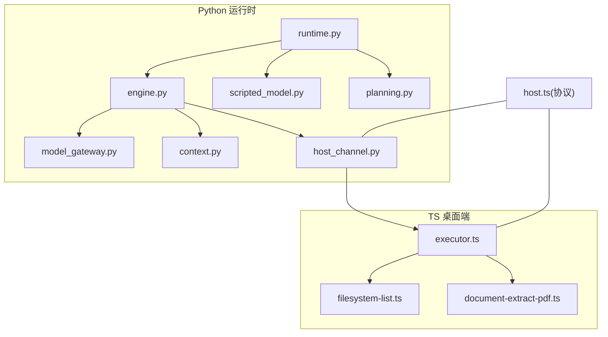
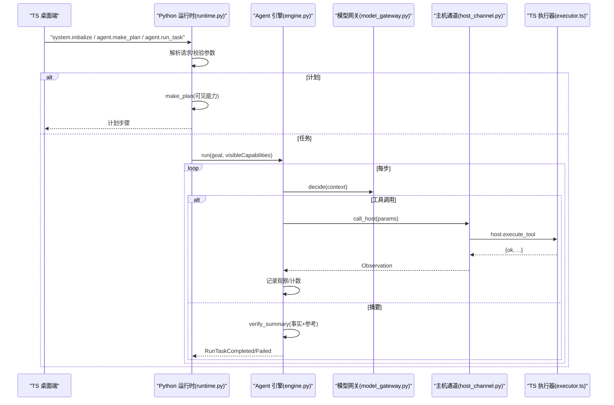
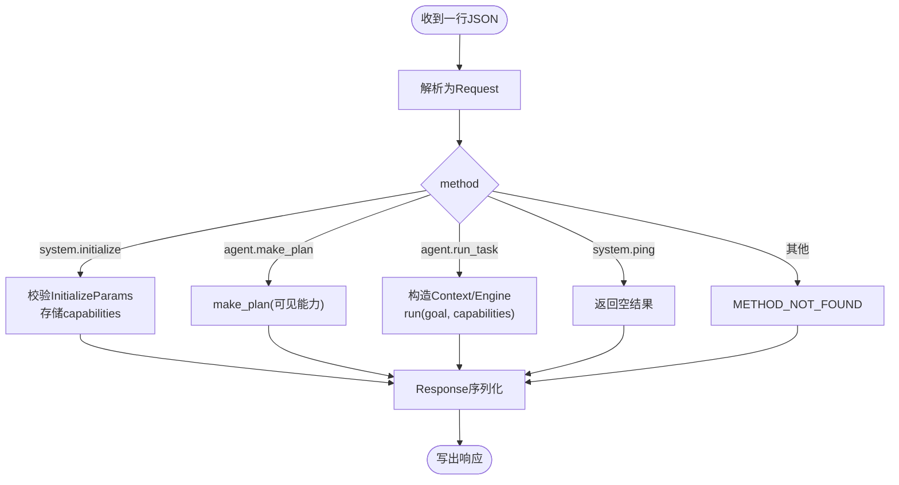
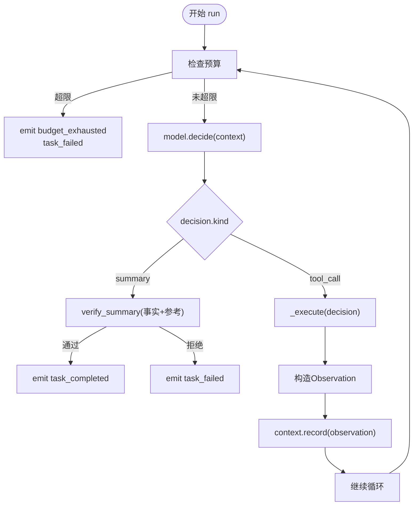
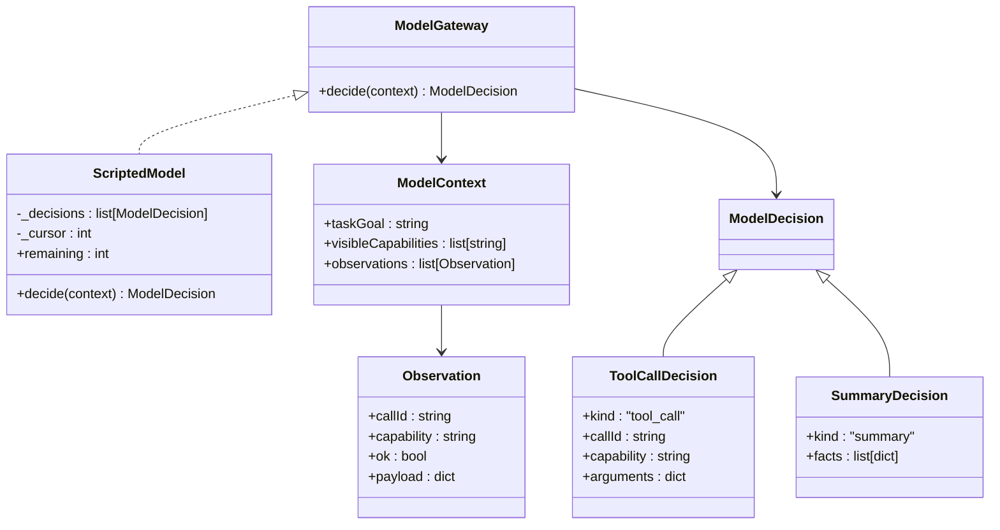
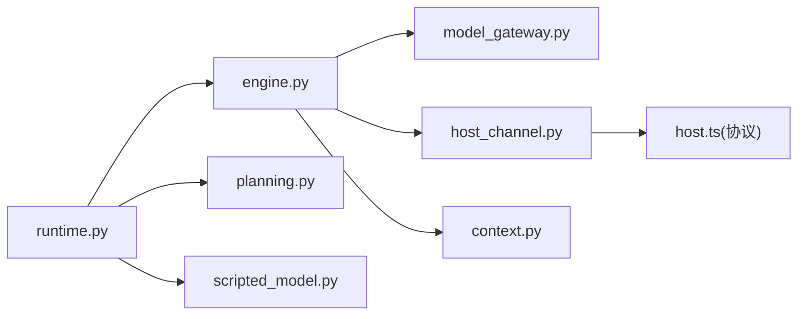

# AI 运行时

<cite>
**本文引用的文件**
- [runtime.py](file://services/agent-runtime/src/personal_agent/runtime.py)
- [engine.py](file://services/agent-runtime/src/personal_agent/engine.py)
- [model_gateway.py](file://services/agent-runtime/src/personal_agent/model_gateway.py)
- [scripted_model.py](file://services/agent-runtime/src/personal_agent/scripted_model.py)
- [planning.py](file://services/agent-runtime/src/personal_agent/planning.py)
- [context.py](file://services/agent-runtime/src/personal_agent/context.py)
- [host_channel.py](file://services/agent-runtime/src/personal_agent/host_channel.py)
- [__init__.py](file://services/agent-runtime/src/personal_agent/__init__.py)
- [__main__.py](file://services/agent-runtime/src/personal_agent/__main__.py)
- [host.ts](file://packages/protocol/schemas/host.ts)
- [executor.ts](file://apps/desktop/src/main/capabilities/executor.ts)
- [filesystem-list.ts](file://apps/desktop/src/main/capabilities/filesystem-list.ts)
- [document-extract-pdf.ts](file://apps/desktop/src/main/capabilities/document-extract-pdf.ts)
- [test_engine.py](file://services/agent-runtime/tests/test_engine.py)
</cite>

## 目录
1. [简介](#简介)
2. [项目结构](#项目结构)
3. [核心组件](#核心组件)
4. [架构总览](#架构总览)
5. [详细组件分析](#详细组件分析)
6. [依赖关系分析](#依赖关系分析)
7. [性能考虑](#性能考虑)
8. [故障排除指南](#故障排除指南)
9. [结论](#结论)
10. [附录：集成示例与扩展指南](#附录：集成示例与扩展指南)

## 简介
本仓库实现了一个“AI 运行时”，负责接收上层（桌面端）任务，驱动 AI 推理引擎进行多步决策，协调工具执行框架完成文件系统与文档处理等操作，并将结果以事件流形式返回。其关键目标包括：
- 提供稳定的进程内运行循环、协议解析与分发。
- 抽象模型网关，支持脚本化模型与未来真实模型适配。
- 实现最小 Agent 循环与预算控制，保证可观测性与可控性。
- 通过 HostChannel 与 TS 侧能力执行器通信，统一错误与重试边界。
- 提供可扩展的工具系统，便于新增文件系统操作或外部 API 调用。

## 项目结构
Python 服务位于 services/agent-runtime，核心模块按职责划分：
- runtime.py：进程入口、请求分发、初始化、计划与任务执行编排。
- engine.py：Agent 主循环、预算控制、事件发射、工具调用封装。
- model_gateway.py：模型接口与数据结构定义。
- scripted_model.py：默认脚本化模型实现，用于确定性测试与演示。
- planning.py：基于可见能力的静态计划生成。
- context.py：观察历史管理与上下文构造，含字符串截断策略。
- host_channel.py：与 TS 侧的 JSON-RPC 通道，负责请求发送、响应匹配与异常封装。
- apps/desktop/src/main/capabilities/*：TS 侧能力注册与执行器，承载具体工具实现。
- packages/protocol/schemas/host.ts：能力枚举、参数与响应契约。

**图表来源**
- [runtime.py:67-182](file://services/agent-runtime/src/personal_agent/runtime.py#L67-L182)
- [engine.py:76-195](file://services/agent-runtime/src/personal_agent/engine.py#L76-L195)
- [host_channel.py:36-91](file://services/agent-runtime/src/personal_agent/host_channel.py#L36-L91)
- [executor.ts:73-143](file://apps/desktop/src/main/capabilities/executor.ts#L73-L143)
- [host.ts:1-76](file://packages/protocol/schemas/host.ts#L1-L76)

**章节来源**
- [runtime.py:1-245](file://services/agent-runtime/src/personal_agent/runtime.py#L1-L245)
- [engine.py:1-195](file://services/agent-runtime/src/personal_agent/engine.py#L1-L195)
- [host.ts:1-76](file://packages/protocol/schemas/host.ts#L1-L76)

## 核心组件
- 运行时调度器（runtime.py）
  - 负责 JSON-RPC 请求解析、方法分发、初始化、计划与任务执行。
  - 维护进程级依赖 RuntimeDeps（通道、模型工厂、能力清单）。
  - 通过环境变量加载脚本化模型，未配置时拒绝任务执行并返回明确错误码。
- Agent 引擎（engine.py）
  - 实现最小 Agent 循环：决策→执行→记录观察→重复，直到摘要或预算耗尽。
  - 两维预算：最大步数与最大工具调用次数，超限即失败并输出事件。
  - 统一失败路径，确保事件序列完整回传。
- 模型网关（model_gateway.py + scripted_model.py）
  - 抽象 ModelGateway 协议，决定下一步是工具调用还是摘要。
  - ScriptedModel 提供确定性决策序列，便于测试与调试。
- 上下文管理（context.py）
  - 保存原始观察，按需构建带截断的 ModelContext，避免上下文过大。
- 主机通道（host_channel.py）
  - 封装 JSON-RPC 请求/响应匹配、错误转换、非匹配消息入队。
  - 将 TS 侧的系统级错误提升为异常，业务失败以 ok:false 透传。
- TS 能力执行器（executor.ts + filesystem-list.ts + document-extract-pdf.ts）
  - 基于策略评估权限与范围，路由到具体能力实现。
  - 文件系统列出 PDF、PDF 文本提取等能力的具体副作用。

**章节来源**
- [runtime.py:47-182](file://services/agent-runtime/src/personal_agent/runtime.py#L47-L182)
- [engine.py:67-195](file://services/agent-runtime/src/personal_agent/engine.py#L67-L195)
- [model_gateway.py:6-59](file://services/agent-runtime/src/personal_agent/model_gateway.py#L6-L59)
- [scripted_model.py:18-57](file://services/agent-runtime/src/personal_agent/scripted_model.py#L18-L57)
- [context.py:45-79](file://services/agent-runtime/src/personal_agent/context.py#L45-L79)
- [host_channel.py:36-91](file://services/agent-runtime/src/personal_agent/host_channel.py#L36-L91)
- [executor.ts:73-325](file://apps/desktop/src/main/capabilities/executor.ts#L73-L325)

## 架构总览
运行时采用“进程内主循环 + 子进程/通道协作”的架构：
- Python 运行时作为独立进程，通过 stdin/stdout 与 TS 桌面端通信。
- 请求进入后由 runtime 分发到计划或任务执行；任务执行由 engine 驱动。
- engine 通过 model_gateway 做决策，必要时经 host_channel 调用 TS 能力。
- TS 侧 executor 根据策略与注册表执行具体工具，返回结构化结果。

**图表来源**
- [runtime.py:67-182](file://services/agent-runtime/src/personal_agent/runtime.py#L67-L182)
- [engine.py:89-195](file://services/agent-runtime/src/personal_agent/engine.py#L89-L195)
- [host_channel.py:45-85](file://services/agent-runtime/src/personal_agent/host_channel.py#L45-L85)
- [executor.ts:73-143](file://apps/desktop/src/main/capabilities/executor.ts#L73-L143)

## 详细组件分析

### 运行时调度器（runtime.py）
- 请求分发：统一解析 Request，按 method 路由到 initialize/make_plan/run_task。
- 初始化：存储能力清单，供后续计划与任务使用。
- 计划：基于可见能力生成固定三步计划（列 PDF、提取 PDF、生成摘要），缺能力则报错。
- 任务执行：构造 ContextManager 与 AgentEngine，传入模型工厂；若未配置模型则返回特定错误码。
- I/O：读取行、解析 JSON、写入响应；EOF 安全退出。

**图表来源**
- [runtime.py:67-182](file://services/agent-runtime/src/personal_agent/runtime.py#L67-L182)

**章节来源**
- [runtime.py:67-182](file://services/agent-runtime/src/personal_agent/runtime.py#L67-L182)

### Agent 引擎（engine.py）
- 预算控制：两维上限（步数、工具调用），任一达到上限即触发预算耗尽事件并失败。
- 决策循环：每次迭代先检查预算，再调用模型决策；摘要分支验证事实与页码引用，工具调用分支执行并记录观察。
- 事件发射：集中构造事件，包含类型、负载与时间戳，保证时序一致。
- 错误处理：HostRequestFailed 与 HostChannelClosed 直接失败；未注册的 capability 就地返回失败观察。

**图表来源**
- [engine.py:89-195](file://services/agent-runtime/src/personal_agent/engine.py#L89-L195)

**章节来源**
- [engine.py:67-195](file://services/agent-runtime/src/personal_agent/engine.py#L67-L195)
- [test_engine.py:178-616](file://services/agent-runtime/tests/test_engine.py#L178-L616)

### 模型网关与脚本化模型（model_gateway.py + scripted_model.py）
- 协议抽象：ModelGateway 仅暴露 decide(context) 接口；Decision 联合类型区分 tool_call 与 summary。
- 数据结构：Observation、ModelContext 清晰表达一次工具调用结果与模型输入上下文。
- 脚本化实现：ScriptedModel 按预设序列逐步返回决策，超出序列抛出 ScriptExhausted，便于测试与调试。

**图表来源**
- [model_gateway.py:6-59](file://services/agent-runtime/src/personal_agent/model_gateway.py#L6-L59)
- [scripted_model.py:18-57](file://services/agent-runtime/src/personal_agent/scripted_model.py#L18-L57)

**章节来源**
- [model_gateway.py:6-59](file://services/agent-runtime/src/personal_agent/model_gateway.py#L6-L59)
- [scripted_model.py:18-57](file://services/agent-runtime/src/personal_agent/scripted_model.py#L18-L57)

### 上下文管理（context.py）
- 观察记录：保存原始 Observation，不修改内容。
- 上下文构建：对 payload 中的字符串按白名单键进行截断，防止上下文过大。
- 字符限制：默认单字符串上限，避免静默丢弃早期重要信息。

**章节来源**
- [context.py:27-79](file://services/agent-runtime/src/personal_agent/context.py#L27-L79)

### 主机通道（host_channel.py）
- 请求发送：为每次调用生成唯一 RPC id，写入 HostExecuteToolRequest。
- 响应匹配：循环读取行，非匹配消息入 inbox；匹配后校验响应结构。
- 错误转换：协议错误或 error 字段存在时抛出 HostRequestFailed；stdin EOF 抛出 HostChannelClosed。

**章节来源**
- [host_channel.py:36-91](file://services/agent-runtime/src/personal_agent/host_channel.py#L36-L91)

### TS 能力执行器（executor.ts + 工具实现）
- 策略评估：基于 Scope、权限、风险等规则决定是否允许执行。
- 能力路由：switch 按 descriptor.name 分发到具体实现；未实现返回 NOT_IMPLEMENTED。
- 工具实现：
  - filesystem-list：列出指定根目录下 PDF 文件，排序并返回条目。
  - document-extract-pdf：读取 PDF 字节流，提取每页文本，处理空/损坏/加密等错误。

**章节来源**
- [executor.ts:73-325](file://apps/desktop/src/main/capabilities/executor.ts#L73-L325)
- [filesystem-list.ts:6-32](file://apps/desktop/src/main/capabilities/filesystem-list.ts#L6-L32)
- [document-extract-pdf.ts:31-69](file://apps/desktop/src/main/capabilities/document-extract-pdf.ts#L31-L69)

## 依赖关系分析
- 运行时依赖：
  - runtime.py 依赖 engine、context、host_channel、model_gateway、planning、scripted_model。
  - engine.py 依赖 model_gateway、host_channel、context、protocol models。
  - host_channel.py 依赖 protocol schemas（host.ts 对应 Pydantic 模型）。
- 协议约束：
  - CapabilityId 在 TS 侧集中声明，Python 侧通过 pydantic 模型校验，未注册能力不会发出请求。
- 耦合点：
  - engine 与 host_channel 通过 Observation 与 HostExecuteToolResult 解耦。
  - runtime 与 engine 通过 RunTaskCompleted/Failed 契约解耦。

**图表来源**
- [runtime.py:10-28](file://services/agent-runtime/src/personal_agent/runtime.py#L10-L28)
- [engine.py:16-40](file://services/agent-runtime/src/personal_agent/engine.py#L16-L40)
- [host_channel.py:8-13](file://services/agent-runtime/src/personal_agent/host_channel.py#L8-L13)
- [host.ts:1-76](file://packages/protocol/schemas/host.ts#L1-L76)

**章节来源**
- [runtime.py:10-28](file://services/agent-runtime/src/personal_agent/runtime.py#L10-L28)
- [engine.py:16-40](file://services/agent-runtime/src/personal_agent/engine.py#L16-L40)
- [host_channel.py:8-13](file://services/agent-runtime/src/personal_agent/host_channel.py#L8-L13)
- [host.ts:1-76](file://packages/protocol/schemas/host.ts#L1-L76)

## 性能考虑
- 预算控制：默认最大步数与工具调用次数，避免无限循环与资源耗尽。
- 上下文截断：对长文本进行截断，减少模型输入大小，降低 token 消耗。
- 事件流：以事件形式输出中间状态，便于前端增量渲染与监控。
- 通道复用：HostChannel 使用队列缓存非匹配消息，避免阻塞主循环。
- 模型实例化：每次任务新建模型实例，避免状态污染（如 ScriptedModel 游标）。

[本节为通用指导，无需代码来源]

## 故障排除指南
- 运行时未配置模型：
  - 现象：run_task 返回 RUNTIME_MODEL_NOT_CONFIGURED。
  - 排查：检查环境变量 PERSONAL_AGENT_SCRIPT 是否指向有效剧本。
- 计划不可构建：
  - 现象：make_plan 返回 PLAN_NOT_BUILDABLE。
  - 排查：确认握手下发的能力清单包含 filesystem.list 与 document.extract_pdf。
- 能力未注册：
  - 现象：引擎收到未注册 capability 时返回 CAPABILITY_NOT_REGISTERED，不发出请求。
  - 排查：核对 TS 侧 CapabilityId 与能力注册表。
- 主机通道关闭：
  - 现象：等待响应时 stdin EOF，抛出 HostChannelClosed。
  - 排查：检查 TS 进程是否存活，管道是否正常。
- 工具执行失败：
  - 现象：ok:false 且携带 code/reason（如 FILE_UNREADABLE、PDF_ENCRYPTED）。
  - 排查：查看 TS 侧错误码与日志，确认权限与路径。

**章节来源**
- [runtime.py:156-182](file://services/agent-runtime/src/personal_agent/runtime.py#L156-L182)
- [planning.py:25-45](file://services/agent-runtime/src/personal_agent/planning.py#L25-L45)
- [engine.py:167-195](file://services/agent-runtime/src/personal_agent/engine.py#L167-L195)
- [host_channel.py:18-34](file://services/agent-runtime/src/personal_agent/host_channel.py#L18-L34)
- [executor.ts:121-172](file://apps/desktop/src/main/capabilities/executor.ts#L121-L172)

## 结论
该 AI 运行时通过清晰的模块划分与严格的协议约束，实现了稳定可控的 Agent 循环。模型网关抽象使得脚本化与真实模型可无缝替换；工具系统通过 TS 侧能力注册与策略评估，确保安全与可扩展。预算控制与事件流为可观测性与调优提供了基础。

[本节为总结，无需代码来源]

## 附录：集成示例与扩展指南

### 集成新的 AI 模型（替换 ScriptedModel）
- 目标：在不改动 engine 与 runtime 的前提下，接入真实模型。
- 步骤：
  1. 实现 ModelGateway 协议，封装模型调用逻辑。
  2. 在 resolve_model_factory 中返回新模型的工厂函数。
  3. 保持 decide(context) 返回 ToolCallDecision 或 SummaryDecision。
- 参考路径：
  - 模型接口定义：[model_gateway.py:53-59](file://services/agent-runtime/src/personal_agent/model_gateway.py#L53-L59)
  - 脚本化模型实现：[scripted_model.py:18-57](file://services/agent-runtime/src/personal_agent/scripted_model.py#L18-L57)
  - 运行时工厂解析：[runtime.py:206-223](file://services/agent-runtime/src/personal_agent/runtime.py#L206-L223)

**章节来源**
- [model_gateway.py:53-59](file://services/agent-runtime/src/personal_agent/model_gateway.py#L53-L59)
- [scripted_model.py:18-57](file://services/agent-runtime/src/personal_agent/scripted_model.py#L18-L57)
- [runtime.py:206-223](file://services/agent-runtime/src/personal_agent/runtime.py#L206-L223)

### 添加新的文件系统操作或外部 API 调用
- 目标：在 TS 侧新增能力并在 Python 侧被识别与执行。
- 步骤：
  1. 在 host.ts 的 CapabilityId 中添加新能力名。
  2. 在 executor.ts 的 switch 中添加分支，实现能力副作用。
  3. 在 planning.py 的计划中引入该能力（如需）。
  4. 在 runtime 初始化时下发该能力描述，使模型可见。
- 参考路径：
  - 能力枚举：[host.ts:7-16](file://packages/protocol/schemas/host.ts#L7-L16)
  - 能力执行器路由：[executor.ts:121-143](file://apps/desktop/src/main/capabilities/executor.ts#L121-L143)
  - 计划生成：[planning.py:25-45](file://services/agent-runtime/src/personal_agent/planning.py#L25-L45)
  - 能力下发：[runtime.py:107-123](file://services/agent-runtime/src/personal_agent/runtime.py#L107-L123)

**章节来源**
- [host.ts:7-16](file://packages/protocol/schemas/host.ts#L7-L16)
- [executor.ts:121-143](file://apps/desktop/src/main/capabilities/executor.ts#L121-L143)
- [planning.py:25-45](file://services/agent-runtime/src/personal_agent/planning.py#L25-L45)
- [runtime.py:107-123](file://services/agent-runtime/src/personal_agent/runtime.py#L107-L123)

### 错误处理与重试机制
- 错误分类：
  - 协议层：PROTOCOL_INVALID_REQUEST、PROTOCOL_INVALID_JSON、METHOD_NOT_FOUND。
  - 运行时：RUNTIME_MODEL_NOT_CONFIGURED、PLAN_NOT_BUILDABLE、RUNTIME_INTERNAL。
  - 主机通道：HostRequestFailed（系统级）、HostChannelClosed。
  - 工具业务：ok:false 携带 code/reason（如 FILE_UNREADABLE、PDF_ENCRYPTED）。
- 重试建议：
  - 网络超时或临时错误可在 TS 侧重试，Python 侧不自动重试。
  - 业务失败（ok:false）应交由模型决策切换策略，而非盲目重试。
- 参考路径：
  - 错误构建与分发：[runtime.py:63-91](file://services/agent-runtime/src/personal_agent/runtime.py#L63-L91)
  - 通道异常：[host_channel.py:18-34](file://services/agent-runtime/src/personal_agent/host_channel.py#L18-L34)
  - 引擎失败路径：[engine.py:148-152](file://services/agent-runtime/src/personal_agent/engine.py#L148-L152)

**章节来源**
- [runtime.py:63-91](file://services/agent-runtime/src/personal_agent/runtime.py#L63-L91)
- [host_channel.py:18-34](file://services/agent-runtime/src/personal_agent/host_channel.py#L18-L34)
- [engine.py:148-152](file://services/agent-runtime/src/personal_agent/engine.py#L148-L152)

### 任务执行的完整生命周期
- 阶段概览：
  1. 初始化：建立会话，下发能力清单。
  2. 计划：基于可见能力生成步骤。
  3. 执行：引擎循环决策→工具调用→记录观察→摘要验证。
  4. 完成：返回 completed/failed 及事件序列。
- 参考路径：
  - 初始化与计划：[runtime.py:107-153](file://services/agent-runtime/src/personal_agent/runtime.py#L107-L153)
  - 任务执行循环：[engine.py:89-195](file://services/agent-runtime/src/personal_agent/engine.py#L89-L195)
  - 事件类型与顺序：[test_engine.py:333-343](file://services/agent-runtime/tests/test_engine.py#L333-L343)

**章节来源**
- [runtime.py:107-153](file://services/agent-runtime/src/personal_agent/runtime.py#L107-L153)
- [engine.py:89-195](file://services/agent-runtime/src/personal_agent/engine.py#L89-L195)
- [test_engine.py:333-343](file://services/agent-runtime/tests/test_engine.py#L333-L343)