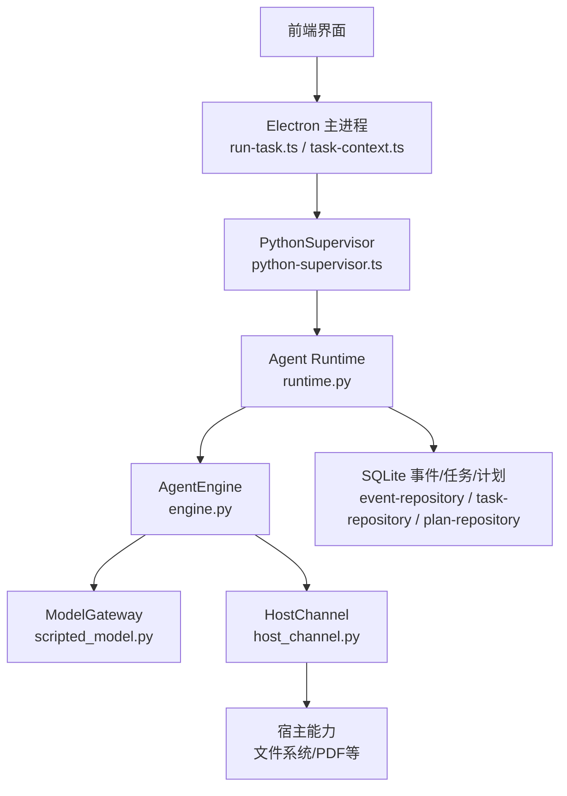
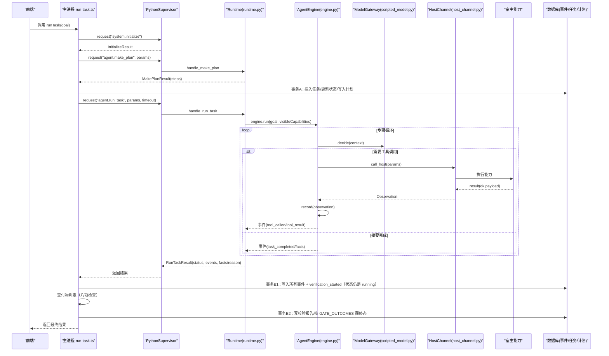
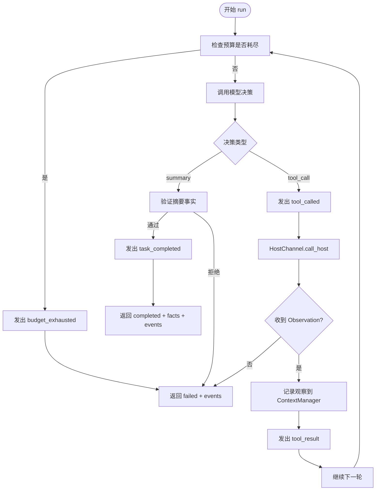
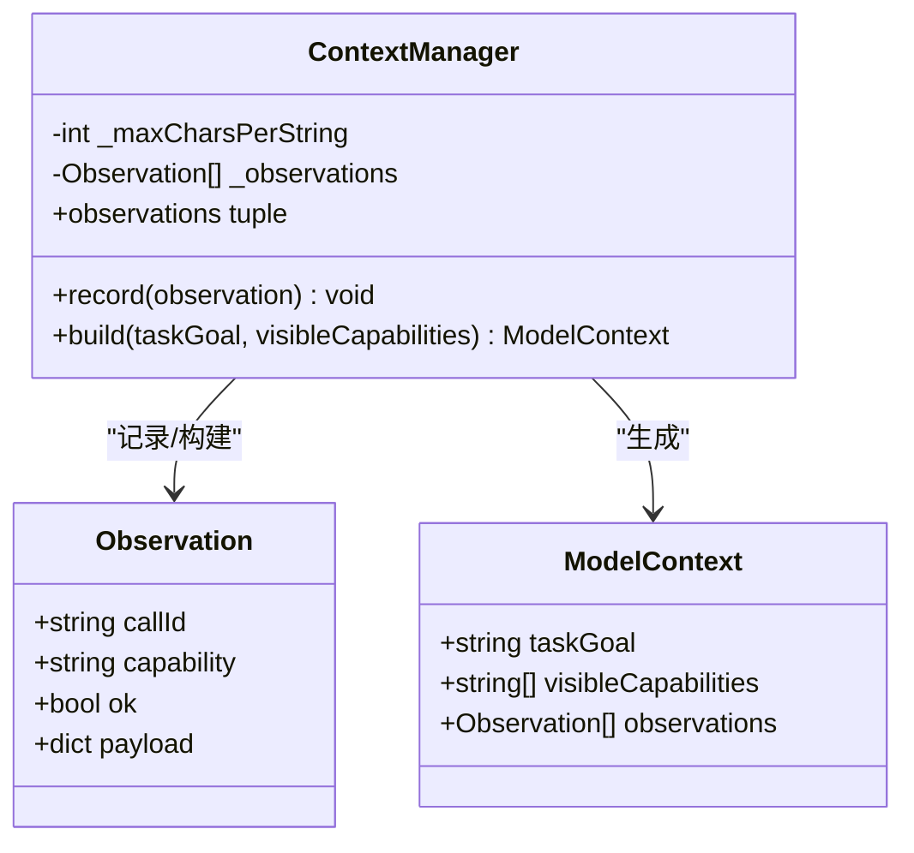
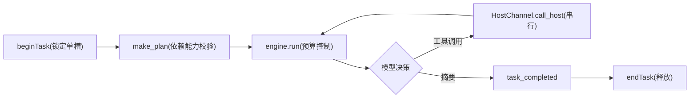
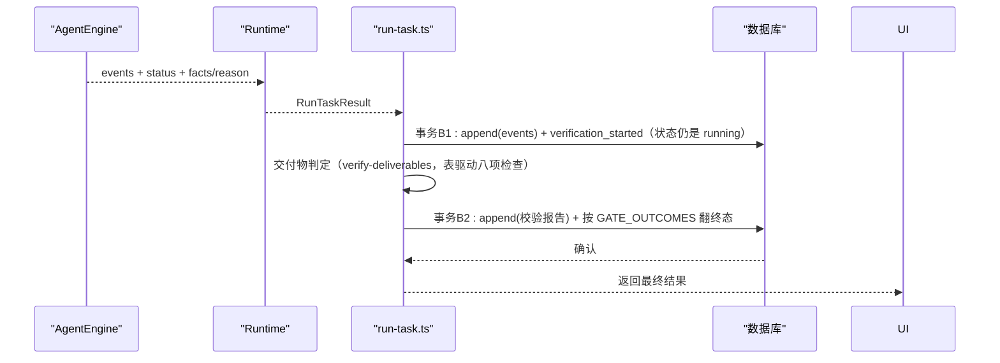
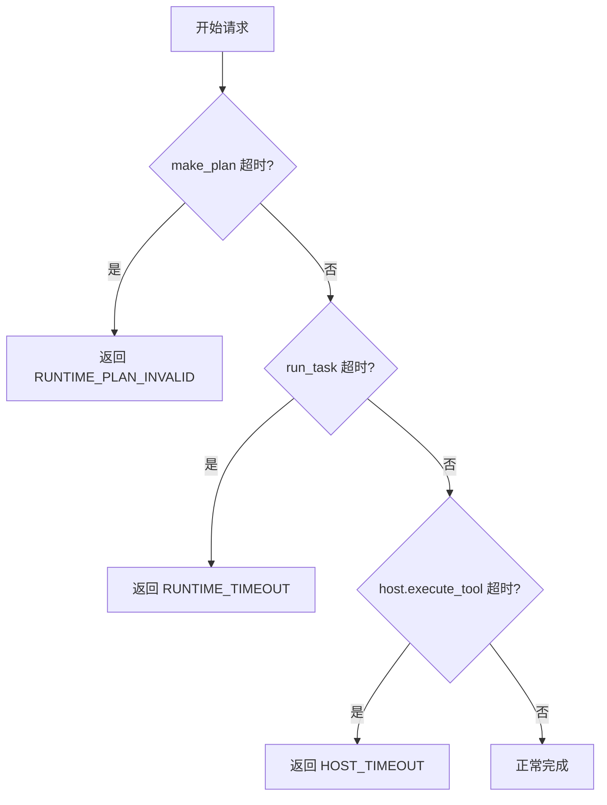
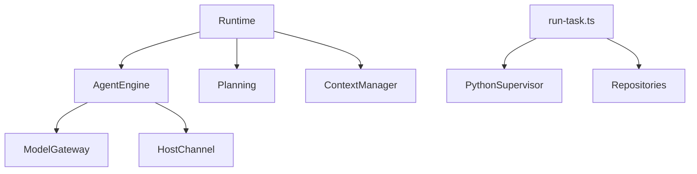

# 任务执行引擎

<cite>
**本文引用的文件**
- [engine.py](file://services/agent-runtime/src/personal_agent/engine.py)
- [context.py](file://services/agent-runtime/src/personal_agent/context.py)
- [runtime.py](file://services/agent-runtime/src/personal_agent/runtime.py)
- [host_channel.py](file://services/agent-runtime/src/personal_agent/host_channel.py)
- [model_gateway.py](file://services/agent-runtime/src/personal_agent/model_gateway.py)
- [planning.py](file://services/agent-runtime/src/personal_agent/planning.py)
- [scripted_model.py](file://services/agent-runtime/src/personal_agent/scripted_model.py)
- [run-task.ts](file://apps/desktop/src/main/tasks/run-task.ts)
- [task-context.ts](file://apps/desktop/src/main/policy/task-context.ts)
- [python-supervisor.ts](file://apps/desktop/src/main/runtime/python-supervisor.ts)
- [timeouts.ts](file://apps/desktop/src/main/runtime/timeouts.ts)
- [error-code.ts](file://apps/desktop/src/main/runtime/error-code.ts)
</cite>

## 目录
1. [简介](#简介)
2. [项目结构](#项目结构)
3. [核心组件](#核心组件)
4. [架构总览](#架构总览)
5. [详细组件分析](#详细组件分析)
6. [依赖关系分析](#依赖关系分析)
7. [性能考量](#性能考量)
8. [故障排查指南](#故障排查指南)
9. [结论](#结论)
10. [附录](#附录)

## 简介
本文件面向“任务执行引擎”的完整设计与实现，聚焦以下目标：
- 解释 AgentEngine 的核心架构与任务生命周期管理、上下文状态维护、执行结果聚合。
- 说明 ContextManager 的设计：观察记录、状态跟踪、跨步骤数据传递机制。
- 描述调度算法：并行执行、依赖管理与资源协调（当前为串行单槽设计）。
- 说明执行结果的收集与处理：成功结果、失败处理、中间状态的持久化。
- 阐述错误恢复机制：重试策略、超时控制、降级处理。
- 提供监控执行进度与异常处理的实践建议、调试技巧与性能调优建议。

## 项目结构
本项目采用前后端分离与进程间通信的混合架构：
- Python 侧负责 Agent 运行时：解析协议、驱动模型决策、调用宿主能力、维护上下文与事件流。
- TypeScript/Electron 主进程负责编排：发起计划与任务、管理子进程生命周期、落库事件与任务状态、对外暴露 IPC。

图表来源
- [run-task.ts:105-341](file://apps/desktop/src/main/tasks/run-task.ts#L105-L341)
- [python-supervisor.ts:66-356](file://apps/desktop/src/main/runtime/python-supervisor.ts#L66-L356)
- [runtime.py:69-184](file://services/agent-runtime/src/personal_agent/runtime.py#L69-L184)
- [engine.py:91-244](file://services/agent-runtime/src/personal_agent/engine.py#L91-L244)
- [host_channel.py:36-91](file://services/agent-runtime/src/personal_agent/host_channel.py#L36-L91)
- [scripted_model.py:18-57](file://services/agent-runtime/src/personal_agent/scripted_model.py#L18-L57)

章节来源
- [run-task.ts:105-341](file://apps/desktop/src/main/tasks/run-task.ts#L105-L341)
- [python-supervisor.ts:66-356](file://apps/desktop/src/main/runtime/python-supervisor.ts#L66-L356)
- [runtime.py:69-184](file://services/agent-runtime/src/personal_agent/runtime.py#L69-L184)

## 核心组件
- AgentEngine：最小 Agent Loop，负责预算控制、决策循环、工具调用、事件产出与结果聚合。
- ContextManager：保存原始观察，按需组装截断后的 ModelContext，支持跨任务复用。
- Runtime：JSON-RPC 分发器，初始化、计划生成、任务执行入口；I/O 层读写行协议。
- HostChannel：封装对宿主能力的 RPC 调用与响应匹配，处理通道关闭与协议校验。
- ModelGateway/ScriptedModel：模型抽象与默认脚本化实现，按预设序列输出决策。
- Electron 主进程编排：run-task.ts 负责计划获取、任务建表、事件持久化、超时与错误码映射；task-context.ts 保证单任务并发控制。
- PythonSupervisor：子进程管理、请求/响应路由、反向 host.execute_tool 转发、超时与崩溃处理。

章节来源
- [engine.py:91-244](file://services/agent-runtime/src/personal_agent/engine.py#L91-L244)
- [context.py:45-79](file://services/agent-runtime/src/personal_agent/context.py#L45-L79)
- [runtime.py:69-184](file://services/agent-runtime/src/personal_agent/runtime.py#L69-L184)
- [host_channel.py:36-91](file://services/agent-runtime/src/personal_agent/host_channel.py#L36-L91)
- [model_gateway.py:6-100](file://services/agent-runtime/src/personal_agent/model_gateway.py#L6-L100)
- [scripted_model.py:18-57](file://services/agent-runtime/src/personal_agent/scripted_model.py#L18-L57)
- [run-task.ts:105-341](file://apps/desktop/src/main/tasks/run-task.ts#L105-L341)
- [task-context.ts:23-51](file://apps/desktop/src/main/policy/task-context.ts#L23-L51)
- [python-supervisor.ts:66-356](file://apps/desktop/src/main/runtime/python-supervisor.ts#L66-L356)

## 架构总览
下图展示从用户触发到任务完成的全链路交互，包括计划生成、任务执行、事件回传与持久化。

图表来源
- [run-task.ts:105-341](file://apps/desktop/src/main/tasks/run-task.ts#L105-L341)
- [python-supervisor.ts:129-200](file://apps/desktop/src/main/runtime/python-supervisor.ts#L129-L200)
- [runtime.py:128-184](file://services/agent-runtime/src/personal_agent/runtime.py#L128-L184)
- [engine.py:104-173](file://services/agent-runtime/src/personal_agent/engine.py#L104-L173)
- [host_channel.py:45-85](file://services/agent-runtime/src/personal_agent/host_channel.py#L45-L85)
- [scripted_model.py:26-32](file://services/agent-runtime/src/personal_agent/scripted_model.py#L26-L32)

## 详细组件分析

### AgentEngine：任务执行生命周期与结果聚合
- 生命周期
  - 启动时发出 task_started 事件。
  - 循环执行：检查预算（步数与工具调用次数），若超限则发出 budget_exhausted 并失败。
  - 通过 ModelGateway.decide 获取决策：
    - 若为 SummaryDecision：验证摘要事实，发出 task_completed 并返回完成结果。
    - 若为 ToolCallDecision：发出 tool_called，调用 HostChannel.call_host，收到 Observation 后发出 tool_result，并记录到 ContextManager。
  - 任何未捕获异常或通道关闭都会转为 task_failed。
- 结果聚合
  - 所有事件在 run() 内部集中构造并随结果一并返回，供上层持久化。
- 预算控制
  - 两维上限：maxSteps 与 maxToolCalls，超出即终止。

图表来源
- [engine.py:104-173](file://services/agent-runtime/src/personal_agent/engine.py#L104-L173)
- [engine.py:174-215](file://services/agent-runtime/src/personal_agent/engine.py#L174-L215)
- [engine.py:216-244](file://services/agent-runtime/src/personal_agent/engine.py#L216-L244)

章节来源
- [engine.py:91-244](file://services/agent-runtime/src/personal_agent/engine.py#L91-L244)

### ContextManager：观察记录、状态跟踪与数据传递
- 职责
  - 保存原始 Observation 列表，提供只读快照。
  - 构建 ModelContext 时对 payload 字符串进行截断，避免上下文过大。
- 截断策略
  - 仅对白名单字段（如 text、reason）进行长度限制，其他标识符不被截断。
  - 使用统一标记指示被截断位置。
- 跨步骤数据传递
  - 每次工具调用结果作为 Observation 追加，后续决策基于累积上下文。

图表来源
- [context.py:45-79](file://services/agent-runtime/src/personal_agent/context.py#L45-L79)
- [model_gateway.py:6-24](file://services/agent-runtime/src/personal_agent/model_gateway.py#L6-L24)

章节来源
- [context.py:45-79](file://services/agent-runtime/src/personal_agent/context.py#L45-L79)

### 调度算法：并行、依赖与资源协调
- 当前实现为串行单槽：
  - 主进程通过 task-context.ts 的 beginTask/endTask 保证同一时刻只有一个任务在执行。
  - AgentEngine 内部按预算逐步推进，不并行执行工具调用。
- 依赖管理：
  - 计划由 planning.py 生成：随可见能力伸缩（完整六步 / 只读三步），两个 READ 是硬要求。
  - 工具调用顺序由模型决策决定，但受限于可见能力清单。
- 资源协调：
  - 预算（步数与工具调用次数）防止无限循环。
  - 超时控制由 TS 侧 supervisor 与 runtime 共同保障。

图表来源
- [task-context.ts:23-51](file://apps/desktop/src/main/policy/task-context.ts#L23-L51)
- [planning.py:54-77](file://services/agent-runtime/src/personal_agent/planning.py#L54-L77)
- [engine.py:104-173](file://services/agent-runtime/src/personal_agent/engine.py#L104-L173)

章节来源
- [task-context.ts:23-51](file://apps/desktop/src/main/policy/task-context.ts#L23-L51)
- [planning.py:54-77](file://services/agent-runtime/src/personal_agent/planning.py#L54-L77)
- [engine.py:104-173](file://services/agent-runtime/src/personal_agent/engine.py#L104-L173)

### 执行结果的收集与处理
- 事件收集
  - AgentEngine 在运行过程中集中构造事件（task_started、tool_called、tool_result、budget_exhausted、task_completed、task_failed），并随结果返回。
- 持久化
  - 主进程在事务中写入所有事件与任务状态变更，确保一致性。
- 成功与失败
  - 成功：status=completed，附带 facts。
  - 失败：status=failed，附带 reason；同时记录 task_failed 事件。

图表来源
- [engine.py:104-173](file://services/agent-runtime/src/personal_agent/engine.py#L104-L173)
- [run-task.ts:236-292](file://apps/desktop/src/main/tasks/run-task.ts#L236-L292)

章节来源
- [engine.py:104-173](file://services/agent-runtime/src/personal_agent/engine.py#L104-L173)
- [run-task.ts:190-223](file://apps/desktop/src/main/tasks/run-task.ts#L190-L223)

### 错误恢复机制：重试、超时与降级
- 重试策略
  - 当前未实现自动重试；失败路径直接返回 failed。
  - 可在上层根据错误码决定是否重试（例如网络抖动导致的 HOST_TIMEOUT）。
- 完成语义（TASK-026）：Python 的 `task_completed` 事件只是 **Agent 侧完成声明**；「任务算不算完成」由 Main 侧的交付物闸口给出——B1 落事件后状态仍留在 running，判定表按计划推导的必需交付物逐项核对（页码落地、文件位置、Reminder、批准、时间线），通过才由 B2 翻 completed；判定器异常按未通过处理（fail-closed），拒绝时写 RUNTIME_VERIFICATION_FAILED。
- 超时控制
  - 主进程对 agent.make_plan 设置独立短超时，避免长时间无反馈。
  - 对 agent.run_task 设置总超时，推导自宿主工具最大调用次数与批准窗口。
  - 宿主工具单次调用有独立超时，避免阻塞整个任务。
- 降级处理
  - 当模型未配置或脚本不可用时，返回明确错误码，允许上层降级（如提示用户配置模型）。
  - 计划构建失败时返回 PLAN_NOT_BUILDABLE，提示能力缺失。

图表来源
- [run-task.ts:26-33](file://apps/desktop/src/main/tasks/run-task.ts#L26-L33)
- [timeouts.ts:1-17](file://apps/desktop/src/main/runtime/timeouts.ts#L1-L17)
- [python-supervisor.ts:285-313](file://apps/desktop/src/main/runtime/python-supervisor.ts#L285-L313)

章节来源
- [run-task.ts:20-24](file://apps/desktop/src/main/tasks/run-task.ts#L20-L24)
- [timeouts.ts:1-17](file://apps/desktop/src/main/runtime/timeouts.ts#L1-L17)
- [python-supervisor.ts:285-313](file://apps/desktop/src/main/runtime/python-supervisor.ts#L285-L313)

### 监控执行进度与异常处理示例
- 监控进度
  - 监听事件流：task_started、tool_called、tool_result、budget_exhausted、task_completed、task_failed。
  - 在主进程中，将 events 逐条写入数据库，可通过查询事件表获得实时进度。
- 异常处理
  - 捕获 RuntimeError 并映射为统一的 IpcErrorCode。
  - 对于未知错误码，降级为 CRASHED，避免前端显示不可识别字符串。

章节来源
- [run-task.ts:39-46](file://apps/desktop/src/main/tasks/run-task.ts#L39-L46)
- [run-task.ts:82-103](file://apps/desktop/src/main/tasks/run-task.ts#L82-L103)
- [error-code.ts:1-18](file://apps/desktop/src/main/runtime/error-code.ts#L1-L18)

## 依赖关系分析
- 模块耦合
  - Engine 依赖 ModelGateway 与 HostChannel，解耦模型与宿主能力。
  - Runtime 作为协议分发中心，依赖 Planning、ContextManager 与 Engine。
  - 主进程依赖 Supervisor 与 Repository，解耦进程管理与数据持久化。
- 外部依赖
  - JSON-RPC 协议用于主进程与 Python 运行时通信。
  - SQLite 用于事件、任务、计划的持久化。
- 潜在循环依赖
  - 当前无循环依赖；各层职责清晰，单向依赖。

图表来源
- [engine.py:91-244](file://services/agent-runtime/src/personal_agent/engine.py#L91-L244)
- [runtime.py:69-184](file://services/agent-runtime/src/personal_agent/runtime.py#L69-L184)
- [run-task.ts:105-341](file://apps/desktop/src/main/tasks/run-task.ts#L105-L341)

章节来源
- [engine.py:91-244](file://services/agent-runtime/src/personal_agent/engine.py#L91-L244)
- [runtime.py:69-184](file://services/agent-runtime/src/personal_agent/runtime.py#L69-L184)
- [run-task.ts:105-341](file://apps/desktop/src/main/tasks/run-task.ts#L105-L341)

## 性能考量
- 上下文大小控制
  - 通过 ContextManager 的字符串截断限制 payload 大小，避免上下文过大影响模型性能。
- 预算控制
  - 限制最大步数与工具调用次数，防止无限循环与资源耗尽。
- 超时优化
  - make_plan 使用较短超时，快速失败；run_task 超时基于宿主工具调用次数推导，避免过早中断。
- 单槽执行
  - 简化并发模型，降低竞争与死锁风险；如需并行，需引入队列与资源池。
- I/O 效率
  - 事件批量写入数据库，减少事务开销。

[本节为通用指导，无需特定文件引用]

## 故障排查指南
- 常见问题
  - 计划构建失败：检查能力清单是否包含所需能力。
  - 运行时未配置模型：检查环境变量与脚本路径。
  - 宿主工具超时：检查权限有效期与宿主处理能力。
  - 子进程崩溃：查看 stderr 日志与崩溃信息。
- 调试技巧
  - 启用日志级别调整，定位问题阶段。
  - 检查事件表，确认哪一步失败。
  - 使用 ScriptedModel 的确定性行为复现问题。
- 恢复策略
  - 针对可重试错误（如网络抖动）在上层实现重试逻辑。
  - 对于能力缺失或配置错误，提示用户修正。

章节来源
- [runtime.py:128-184](file://services/agent-runtime/src/personal_agent/runtime.py#L128-L184)
- [python-supervisor.ts:258-314](file://apps/desktop/src/main/runtime/python-supervisor.ts#L258-L314)
- [error-code.ts:1-18](file://apps/desktop/src/main/runtime/error-code.ts#L1-L18)

## 结论
该任务执行引擎以清晰的层次划分与严格的协议约束实现了可靠的 Agent 执行流程。通过预算控制、上下文截断、超时管理与事件持久化，确保了任务的可观测性与稳定性。当前为串行单槽设计，适合桌面端场景；未来可扩展并行执行与更复杂的调度策略。

[本节为总结性内容，无需特定文件引用]

## 附录
- 关键常量与配置
  - 默认最大步数与工具调用次数。
  - 字符串截断阈值与白名单字段。
  - 超时推导公式与权限有效期关联。
- 扩展点
  - 替换 ModelGateway 实现真实模型。
  - 注入自定义 HostHandler 扩展宿主能力。
  - 增加重试与降级策略于上层编排。

[本节为补充信息，无需特定文件引用]