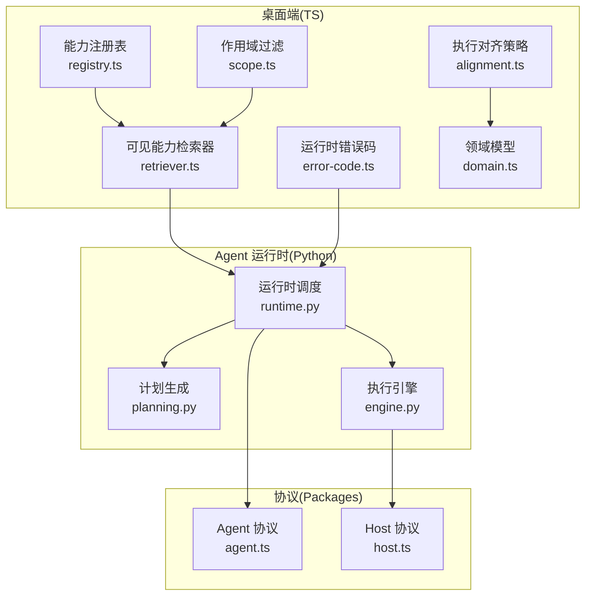
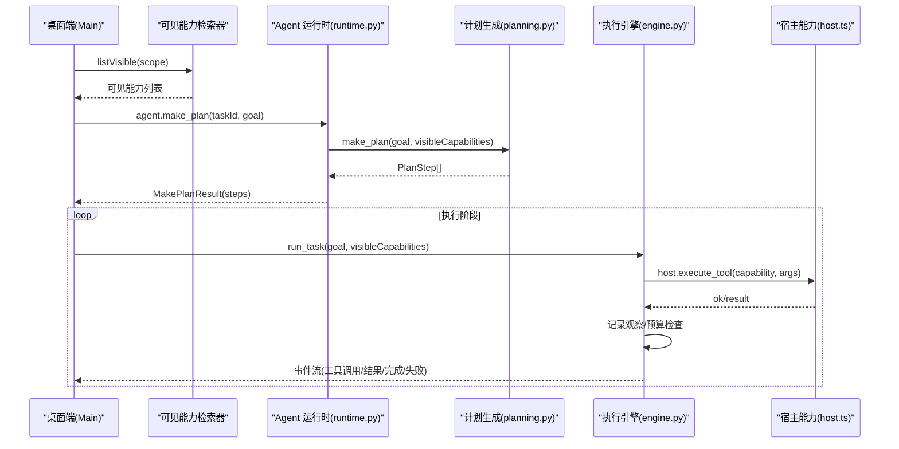
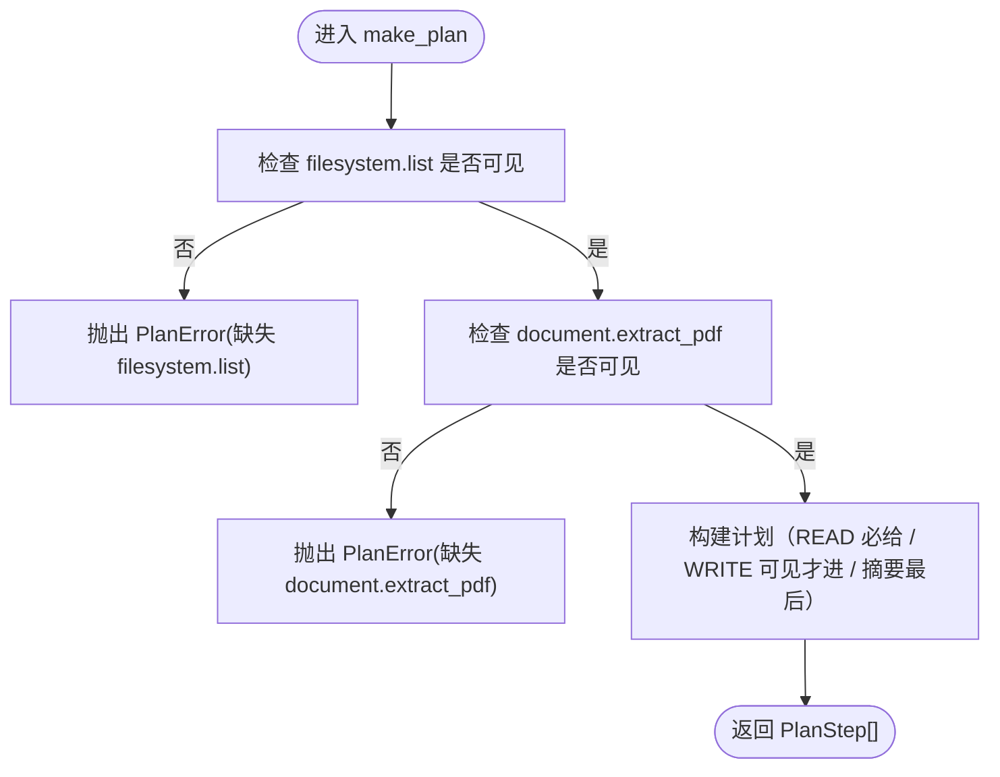
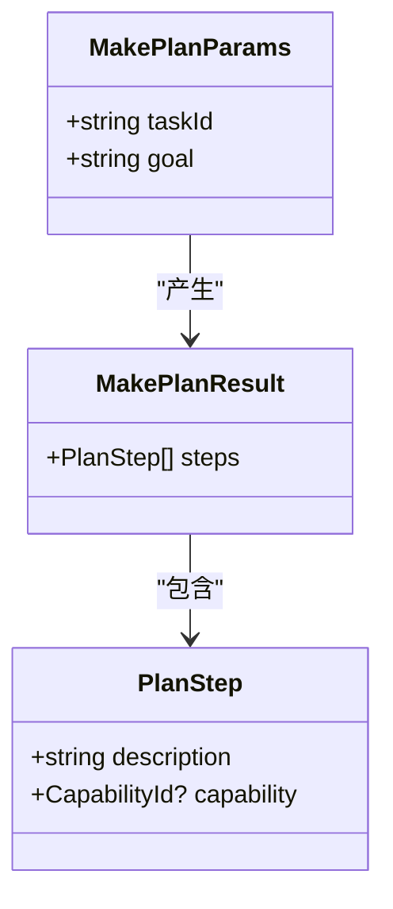
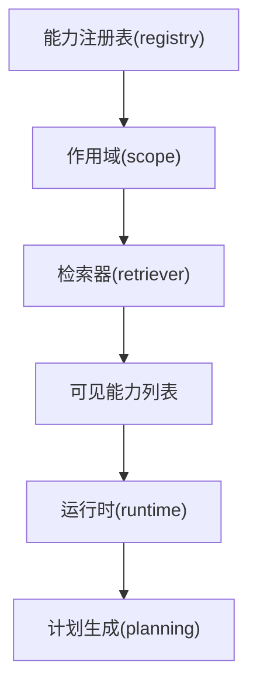
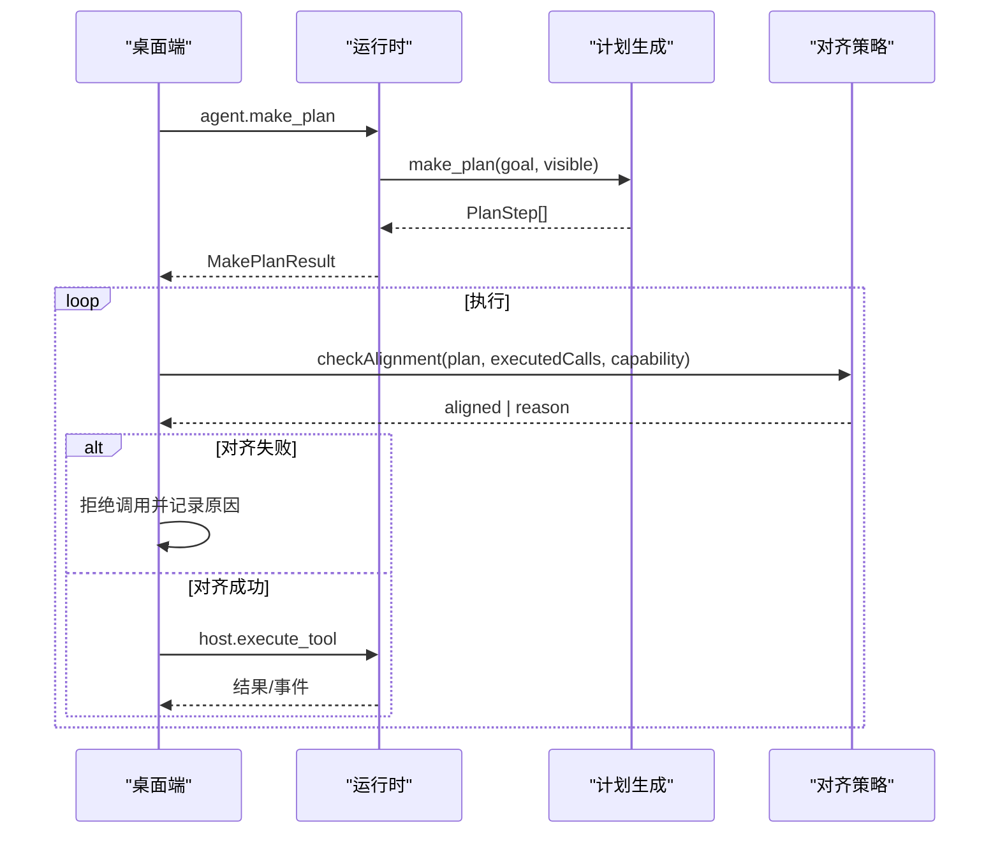
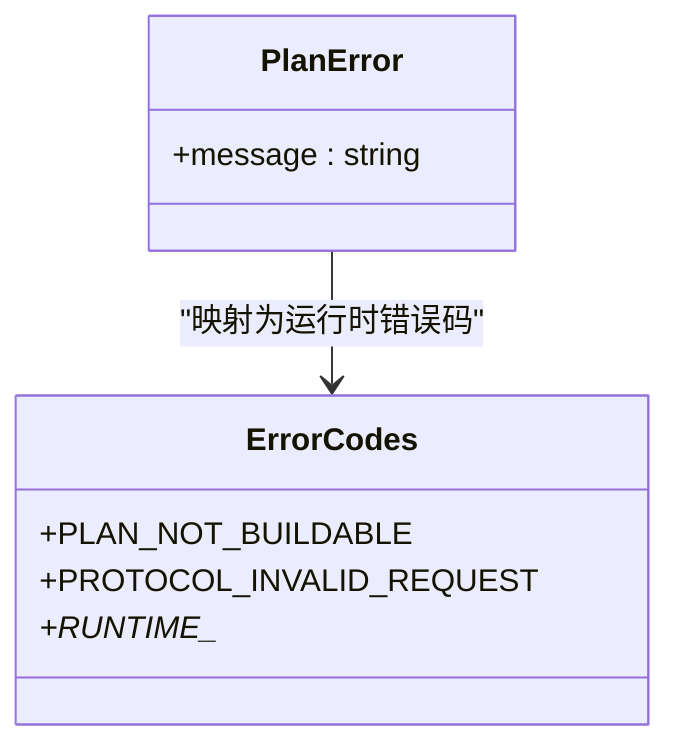
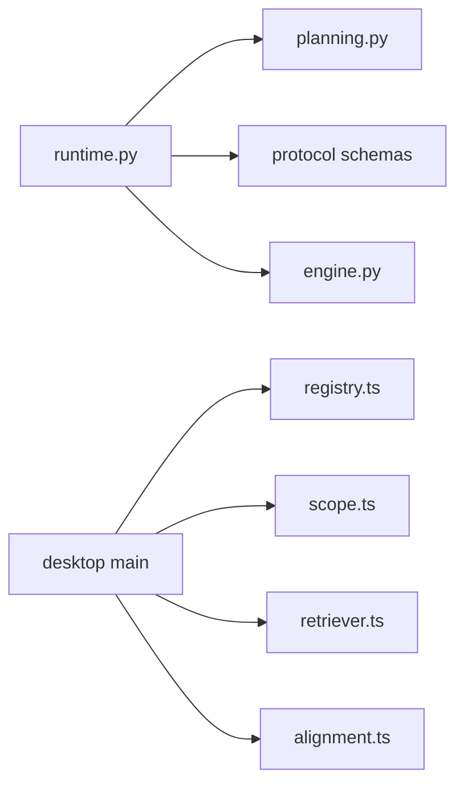

# 任务规划系统

<cite>
**本文引用的文件**
- [planning.py](file://services/agent-runtime/src/personal_agent/planning.py)
- [runtime.py](file://services/agent-runtime/src/personal_agent/runtime.py)
- [engine.py](file://services/agent-runtime/src/personal_agent/engine.py)
- [agent.ts](file://packages/protocol/schemas/agent.ts)
- [host.ts](file://packages/protocol/schemas/host.ts)
- [registry.ts](file://apps/desktop/src/main/capabilities/registry.ts)
- [scope.ts](file://apps/desktop/src/main/capabilities/scope.ts)
- [retriever.ts](file://apps/desktop/src/main/capabilities/retriever.ts)
- [alignment.ts](file://apps/desktop/src/main/policy/alignment.ts)
- [error-code.ts](file://apps/desktop/src/main/runtime/error-code.ts)
- [domain.ts](file://apps/desktop/src/shared/domain.ts)
- [ipc-contract.ts](file://apps/desktop/src/shared/ipc-contract.ts)
- [test_planning.py](file://services/agent-runtime/tests/test_planning.py)
- [test_runtime.py](file://services/agent-runtime/tests/test_runtime.py)
- [envelope.test.ts](file://packages/protocol/tests/envelope.test.ts)
</cite>

## 目录
1. [简介](#简介)
2. [项目结构](#项目结构)
3. [核心组件](#核心组件)
4. [架构总览](#架构总览)
5. [详细组件分析](#详细组件分析)
6. [依赖关系分析](#依赖关系分析)
7. [性能考量](#性能考量)
8. [故障排查指南](#故障排查指南)
9. [结论](#结论)
10. [附录：自定义与扩展示例](#附录自定义与扩展示例)

## 简介
本系统为 PersonalAgent 的任务规划子系统，负责将用户目标转化为可执行的步骤计划，并在执行阶段对模型调用进行能力对齐与权限控制。计划是确定性的、**随握手下发的能力伸缩**：完整配置是六步（列出 PDF、提取每页文本、建 Reading 目录、移到 Reading、建一次性提醒、生成带页码引用的摘要），只读配置是三步（前两步 + 摘要）。该设计确保跨语言（TS/Python）契约一致、行为可复现、便于端到端测试与回归。

## 项目结构
- Python Agent 运行时位于 services/agent-runtime，包含计划生成、协议处理、引擎循环等。
- TS 桌面端位于 apps/desktop，负责能力注册、可见性过滤、策略校验、持久化与 UI。
- 协议定义在 packages/protocol，统一约束两端的数据结构与错误码。

图表来源
- [registry.ts:9-40](file://apps/desktop/src/main/capabilities/registry.ts#L9-L40)
- [scope.ts:1-43](file://apps/desktop/src/main/capabilities/scope.ts#L1-L43)
- [retriever.ts:1-48](file://apps/desktop/src/main/capabilities/retriever.ts#L1-L48)
- [runtime.py:128-155](file://services/agent-runtime/src/personal_agent/runtime.py#L128-L155)
- [planning.py:12-75](file://services/agent-runtime/src/personal_agent/planning.py#L12-L75)
- [engine.py:91-244](file://services/agent-runtime/src/personal_agent/engine.py#L91-L244)
- [agent.ts:7-28](file://packages/protocol/schemas/agent.ts#L7-L28)
- [host.ts:7-14](file://packages/protocol/schemas/host.ts#L7-L14)

章节来源
- [registry.ts:9-40](file://apps/desktop/src/main/capabilities/registry.ts#L9-L40)
- [scope.ts:1-43](file://apps/desktop/src/main/capabilities/scope.ts#L1-L43)
- [retriever.ts:1-48](file://apps/desktop/src/main/capabilities/retriever.ts#L1-L48)
- [runtime.py:128-155](file://services/agent-runtime/src/personal_agent/runtime.py#L128-L155)
- [planning.py:12-75](file://services/agent-runtime/src/personal_agent/planning.py#L12-L75)
- [engine.py:91-244](file://services/agent-runtime/src/personal_agent/engine.py#L91-L244)
- [agent.ts:7-28](file://packages/protocol/schemas/agent.ts#L7-L28)
- [host.ts:7-14](file://packages/protocol/schemas/host.ts#L7-L14)

## 核心组件
- 计划生成：make_plan 根据可见能力清单输出计划（READ 必给 / WRITE 可见才进 / 摘要最后）；缺必需能力则抛出 PlanError。
- 数据模型：PlanStep 描述步骤与可选能力；MakePlanParams/Result 定义请求/响应契约。
- 可见能力：通过 registry + scope + retriever 组合，按任务作用域过滤出模型可见的能力集合。
- 执行对齐：alignment 校验第 i 次工具调用必须匹配计划中第 i 个带 capability 的步骤。
- 运行时调度：runtime 解析协议、维护会话能力、调用 make_plan 并序列化结果。
- 错误体系：PLAN_NOT_BUILDABLE、PROTOCOL_INVALID_REQUEST、RUNTIME_* 等错误码贯穿两端。

章节来源
- [planning.py:12-75](file://services/agent-runtime/src/personal_agent/planning.py#L12-L75)
- [agent.ts:7-28](file://packages/protocol/schemas/agent.ts#L7-L28)
- [retriever.ts:1-48](file://apps/desktop/src/main/capabilities/retriever.ts#L1-L48)
- [alignment.ts:1-45](file://apps/desktop/src/main/policy/alignment.ts#L1-L45)
- [runtime.py:128-155](file://services/agent-runtime/src/personal_agent/runtime.py#L128-L155)
- [error-code.ts:1-17](file://apps/desktop/src/main/runtime/error-code.ts#L1-L17)

## 架构总览
下图展示了从桌面端下发能力到 Agent 运行时生成计划的完整链路，以及执行阶段的对齐校验。

图表来源
- [retriever.ts:18-47](file://apps/desktop/src/main/capabilities/retriever.ts#L18-L47)
- [runtime.py:128-155](file://services/agent-runtime/src/personal_agent/runtime.py#L128-L155)
- [planning.py:54-75](file://services/agent-runtime/src/personal_agent/planning.py#L54-L75)
- [engine.py:104-244](file://services/agent-runtime/src/personal_agent/engine.py#L104-L244)
- [host.ts:28-45](file://packages/protocol/schemas/host.ts#L28-L45)

## 详细组件分析

### make_plan 实现原理
- 目标分解算法：当前是确定性模板，不随 goal 变化改变顺序或数量（只随可见能力伸缩），保证可复现性与对齐基准稳定。
- 步骤生成逻辑：
  - 第一步：列出 Downloads 下的 PDF，使用 filesystem.list。
  - 第二步：提取目标 PDF 的每页文本，使用 document.extract_pdf。
  - 第三步：基于页面内容生成带页码引用的摘要，无需工具（capability 为空）。
- 能力匹配机制：
  - 要求 filesystem.list 与 document.extract_pdf 必须在 visibleCapabilities 中，否则抛出 PlanError。
  - 最终返回的 steps 严格遵循协议定义的 PlanStepDto 字段与约束。

图表来源
- [planning.py:54-75](file://services/agent-runtime/src/personal_agent/planning.py#L54-L75)

章节来源
- [planning.py:54-75](file://services/agent-runtime/src/personal_agent/planning.py#L54-L75)
- [test_planning.py:25-86](file://services/agent-runtime/tests/test_planning.py#L25-L86)

### PlanStep 数据模型与设计
- 字段：
  - description：非空字符串，用于展示与对齐。
  - capability：可选，表示该步骤需要调用的能力名；缺失表示由模型自行产出（如摘要）。
- 验证与约束：
  - Python 侧使用 Pydantic 模型，description 最小长度限制，capability 限定为 CapabilityId 枚举或 None。
  - TS 侧 zod 定义 PlanStepDto，capability 为 optional，且 exclude_none=True 时不会输出 null，避免与 zod 的 optional 语义冲突。
- 执行约束：
  - 只有带 capability 的步骤才会触发 host.execute_tool；不带 capability 的步骤直接进入摘要验证与完成。

图表来源
- [agent.ts:7-28](file://packages/protocol/schemas/agent.ts#L7-L28)
- [host.ts:7-14](file://packages/protocol/schemas/host.ts#L7-L14)
- [planning.py:16-23](file://services/agent-runtime/src/personal_agent/planning.py#L16-L23)

章节来源
- [agent.ts:7-28](file://packages/protocol/schemas/agent.ts#L7-L28)
- [host.ts:7-14](file://packages/protocol/schemas/host.ts#L7-L14)
- [planning.py:16-23](file://services/agent-runtime/src/personal_agent/planning.py#L16-L23)
- [domain.ts:30-42](file://apps/desktop/src/shared/domain.ts#L30-L42)

### 可见能力（visible capabilities）的作用
- 权限过滤：
  - 桌面端通过 registry 注册能力白名单，并按 kind（READ/WRITE）划分。
  - scope 提供 TaskScope 与作用域判断 isInScope，仅允许任务范围内能力可见。
  - retriever 基于 scope 过滤出 listVisible，并对具体能力授权 authorize。
- 功能限制：
  - 未注册或不在作用域内的能力会被拒绝，错误信息包含能力名与原因，便于诊断。
  - 风险模型依据 kind 判定是否需要权限（READ -> NONE，WRITE -> PERMISSION_REQUIRED），保障安全边界。

图表来源
- [registry.ts:9-40](file://apps/desktop/src/main/capabilities/registry.ts#L9-L40)
- [scope.ts:1-43](file://apps/desktop/src/main/capabilities/scope.ts#L1-L43)
- [retriever.ts:18-47](file://apps/desktop/src/main/capabilities/retriever.ts#L18-L47)

章节来源
- [registry.ts:9-40](file://apps/desktop/src/main/capabilities/registry.ts#L9-L40)
- [scope.ts:1-43](file://apps/desktop/src/main/capabilities/scope.ts#L1-L43)
- [retriever.ts:18-47](file://apps/desktop/src/main/capabilities/retriever.ts#L18-L47)

### 计划验证过程
- 依赖检查：
  - make_plan 显式检查 filesystem.list 与 document.extract_pdf 是否在可见能力中，缺失即失败。
- 冲突检测：
  - 执行阶段 alignment 校验第 i 次 tool call 必须等于计划中第 i 个带 capability 的步骤，防止越权或乱序调用。
- 可行性分析：
  - 协议层禁止空计划（steps 至少一步），确保 ActionAlignment 有比对基准。
  - 握手阶段 initialize 必须携带 capabilities，否则无法构建计划。

图表来源
- [planning.py:54-75](file://services/agent-runtime/src/personal_agent/planning.py#L54-L75)
- [alignment.ts:24-44](file://apps/desktop/src/main/policy/alignment.ts#L24-L44)
- [agent.ts:20-28](file://packages/protocol/schemas/agent.ts#L20-L28)

章节来源
- [planning.py:54-75](file://services/agent-runtime/src/personal_agent/planning.py#L54-L75)
- [alignment.ts:24-44](file://apps/desktop/src/main/policy/alignment.ts#L24-L44)
- [envelope.test.ts:518-590](file://packages/protocol/tests/envelope.test.ts#L518-L590)

### PlanError 异常体系
- 类型与用途：
  - PlanError：计划生成失败，通常因可见能力缺失导致。
  - PLAN_NOT_BUILDABLE：运行时错误码，表示无法构建计划（握手未初始化或缺少能力）。
  - PROTOCOL_INVALID_REQUEST：参数不符合协议契约。
  - RUNTIME_*：运行时内部错误、超时、崩溃、通道关闭等。
- 错误信息格式化：
  - PlanError 消息包含缺失能力名，便于定位。
  - 运行时将异常转换为标准 JSON-RPC error 对象，code/message 清晰传递。

图表来源
- [planning.py:12-14](file://services/agent-runtime/src/personal_agent/planning.py#L12-L14)
- [runtime.py:39-42](file://services/agent-runtime/src/personal_agent/runtime.py#L39-L42)
- [error-code.ts:1-17](file://apps/desktop/src/main/runtime/error-code.ts#L1-L17)

章节来源
- [planning.py:12-14](file://services/agent-runtime/src/personal_agent/planning.py#L12-L14)
- [runtime.py:39-42](file://services/agent-runtime/src/personal_agent/runtime.py#L39-L42)
- [error-code.ts:1-17](file://apps/desktop/src/main/runtime/error-code.ts#L1-L17)
- [test_runtime.py:637-686](file://services/agent-runtime/tests/test_runtime.py#L637-L686)

### 执行引擎与预算控制
- 引擎循环：
  - 每次迭代先检查预算（最大步数与工具调用次数），超限则失败并返回事件。
  - 决策来自模型，若为 SummaryDecision 则汇总事实并通过验证后完成。
  - 若为 ToolCallDecision，则通过 host.execute_tool 执行并记录观察。
- 能力校验：
  - 若模型请求的 capability 不在协议枚举内，直接构造失败 Observation 并返回。

```mermaid
flowchart TD
Start(["开始 run"]) --> Budget{"预算是否耗尽?"}
Budget --> |是| Fail["失败并返回事件"]
Budget --> |否| Decide["模型决策"]
Decide --> Type{"决策类型"}
Type --> |Summary| Verify["验证摘要"]
Verify --> |通过| Complete["完成任务"]
Verify --> |失败| Fail
Type --> |ToolCall| Exec["执行工具调用"]
Exec --> Record["记录观察"]
Record --> Loop["继续循环"]
```

图表来源
- [engine.py:104-244](file://services/agent-runtime/src/personal_agent/engine.py#L104-L244)

章节来源
- [engine.py:104-244](file://services/agent-runtime/src/personal_agent/engine.py#L104-L244)

## 依赖关系分析
- 模块耦合：
  - runtime 依赖 planning、protocol models、engine；planning 依赖 protocol CapabilityId。
  - 桌面端 retriever 依赖 registry 与 scope；alignment 依赖 domain 的 PlanStep。
- 外部依赖：
  - 协议层（packages/protocol）作为唯一事实来源，约束两端数据结构与能力枚举。
- 潜在循环：
  - 当前无循环依赖；各层职责清晰，单向依赖。

图表来源
- [runtime.py:1-29](file://services/agent-runtime/src/personal_agent/runtime.py#L1-L29)
- [planning.py:1-23](file://services/agent-runtime/src/personal_agent/planning.py#L1-L23)
- [engine.py:1-43](file://services/agent-runtime/src/personal_agent/engine.py#L1-L43)
- [registry.ts:1-55](file://apps/desktop/src/main/capabilities/registry.ts#L1-L55)
- [scope.ts:1-43](file://apps/desktop/src/main/capabilities/scope.ts#L1-L43)
- [retriever.ts:1-48](file://apps/desktop/src/main/capabilities/retriever.ts#L1-L48)
- [alignment.ts:1-45](file://apps/desktop/src/main/policy/alignment.ts#L1-L45)

章节来源
- [runtime.py:1-29](file://services/agent-runtime/src/personal_agent/runtime.py#L1-L29)
- [planning.py:1-23](file://services/agent-runtime/src/personal_agent/planning.py#L1-L23)
- [engine.py:1-43](file://services/agent-runtime/src/personal_agent/engine.py#L1-L43)
- [registry.ts:1-55](file://apps/desktop/src/main/capabilities/registry.ts#L1-L55)
- [scope.ts:1-43](file://apps/desktop/src/main/capabilities/scope.ts#L1-L43)
- [retriever.ts:1-48](file://apps/desktop/src/main/capabilities/retriever.ts#L1-L48)
- [alignment.ts:1-45](file://apps/desktop/src/main/policy/alignment.ts#L1-L45)

## 性能考量
- 计划生成是确定性的常数时间操作，开销极低。
- 执行阶段受预算限制（默认最大步数与工具调用次数），避免无限循环与资源耗尽。
- 协议序列化使用 exclude_none=True，减少网络负载与解析成本。
- 建议：
  - 保持计划模板稳定，避免动态分支带来的不确定性。
  - 监控引擎事件中的预算耗尽频率，必要时调整预算上限。
  - 对大文本观察进行截断后再喂给模型，降低上下文大小。

## 故障排查指南
- 常见问题与定位：
  - 计划构建失败：检查 initialize 是否传入 capabilities，确认 filesystem.list 与 document.extract_pdf 是否可见。
  - 协议无效请求：核对 MakePlanParams/RunTaskParams 字段是否符合 schema。
  - 能力未注册或越权：查看 retriever.authorize 返回的原因，确认能力是否在作用域内。
  - 执行对齐失败：检查 alignment 的 reason，确认 tool call 顺序与计划一致。
- 日志与调试：
  - 运行时日志级别可通过环境变量配置。
  - 桌面端诊断界面可查看权限状态与事件摘要。

章节来源
- [test_runtime.py:637-686](file://services/agent-runtime/tests/test_runtime.py#L637-L686)
- [retriever.ts:25-47](file://apps/desktop/src/main/capabilities/retriever.ts#L25-L47)
- [alignment.ts:24-44](file://apps/desktop/src/main/policy/alignment.ts#L24-L44)
- [runtime.py:193-205](file://services/agent-runtime/src/personal_agent/runtime.py#L193-L205)

## 结论
本规划系统采用确定性的、随可见能力伸缩的计划（完整六步 / 只读三步），结合严格的协议约束与能力可见性控制，确保执行过程安全、可审计、可复现。通过 alignment 策略与预算控制，系统在灵活性与安全性之间取得平衡。未来可扩展为动态规划，但仍需保持契约一致与可测试性。

## 附录：自定义与扩展示例
- 自定义规划规则：
  - 在 planning.py 中扩展 make_plan，增加新的步骤或条件分支，同时更新协议 schema 与测试用例。
  - 示例路径参考：[planning.py:25-44](file://services/agent-runtime/src/personal_agent/planning.py#L25-L44)。
- 复杂目标分解场景：
  - 引入能力依赖图，按依赖顺序生成步骤；在 runtime 中注入依赖检查逻辑。
  - 示例路径参考：[runtime.py:126-153](file://services/agent-runtime/src/personal_agent/runtime.py#L126-L153)。
- 能力扩展：
  - 在 registry.ts 中添加新能力，并在 scope.ts 中定义作用域规则。
  - 示例路径参考：[registry.ts:9-40](file://apps/desktop/src/main/capabilities/registry.ts#L9-L40)、[scope.ts:8-13](file://apps/desktop/src/main/capabilities/scope.ts#L8-L13)。
- 协议一致性：
  - 同步更新 packages/protocol 中的 schema，确保两端校验一致。
  - 示例路径参考：[agent.ts:7-28](file://packages/protocol/schemas/agent.ts#L7-L28)、[host.ts:7-14](file://packages/protocol/schemas/host.ts#L7-L14)。