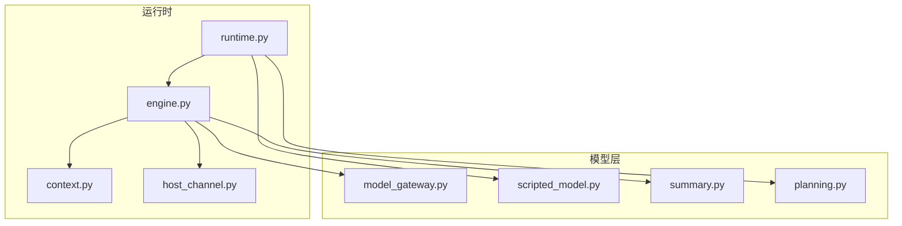
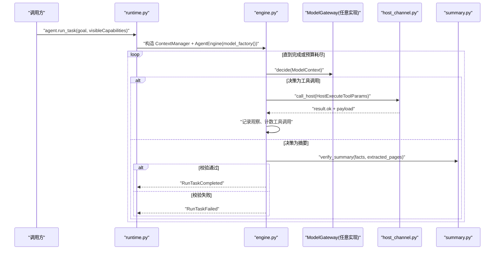
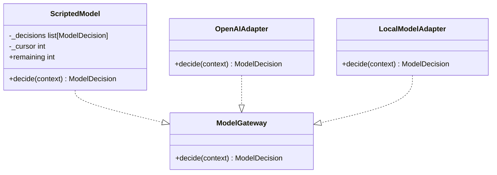
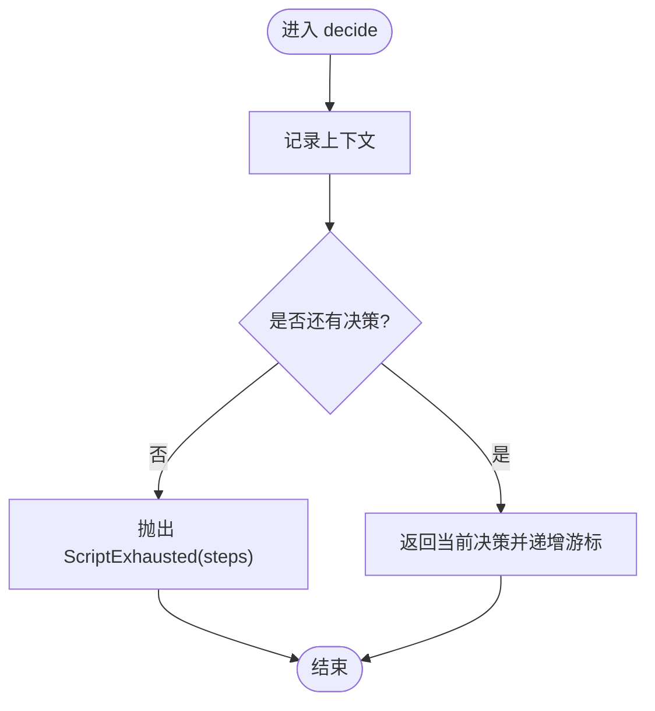
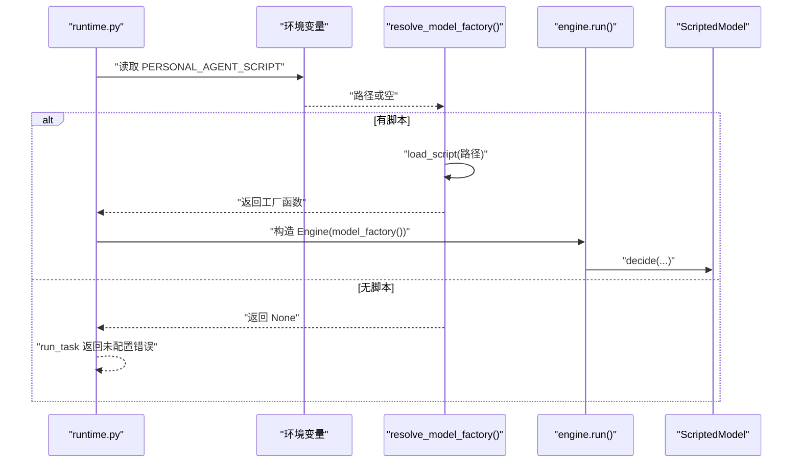
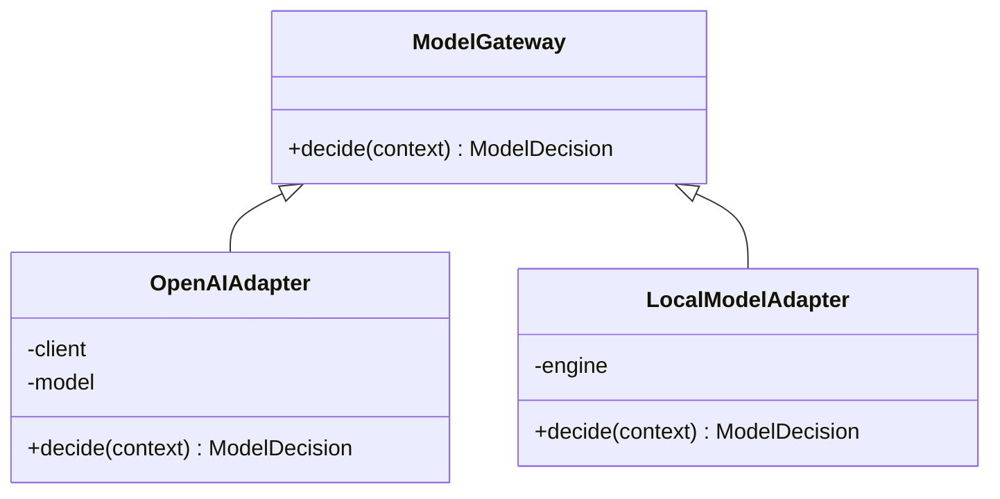
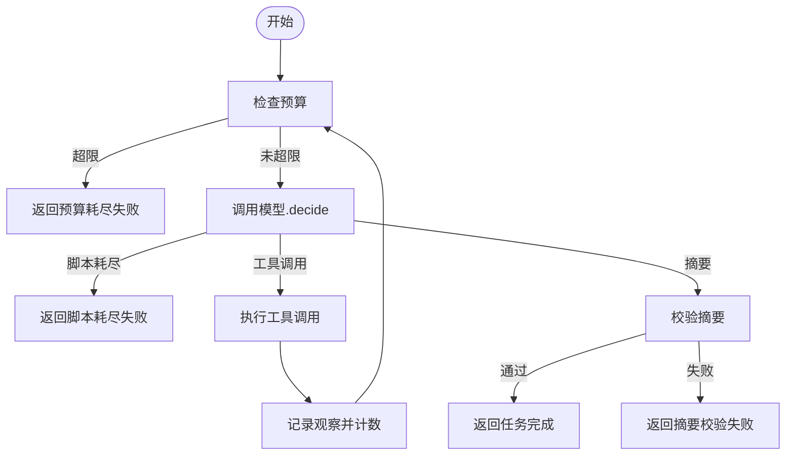
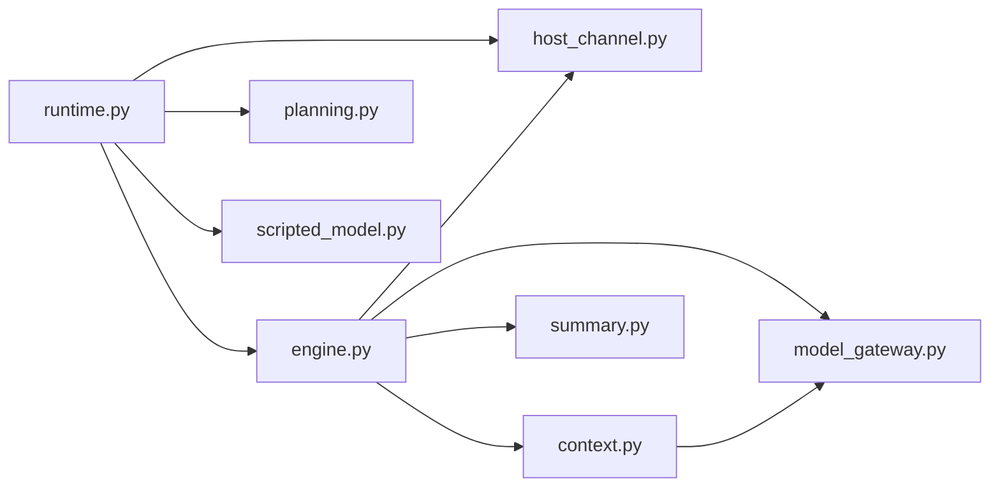

# 模型管理

<cite>
**本文引用的文件**
- [model_gateway.py](file://services/agent-runtime/src/personal_agent/model_gateway.py)
- [scripted_model.py](file://services/agent-runtime/src/personal_agent/scripted_model.py)
- [engine.py](file://services/agent-runtime/src/personal_agent/engine.py)
- [runtime.py](file://services/agent-runtime/src/personal_agent/runtime.py)
- [context.py](file://services/agent-runtime/src/personal_agent/context.py)
- [host_channel.py](file://services/agent-runtime/src/personal_agent/host_channel.py)
- [planning.py](file://services/agent-runtime/src/personal_agent/planning.py)
- [summary.py](file://services/agent-runtime/src/personal_agent/summary.py)
- [test_model_gateway.py](file://services/agent-runtime/tests/test_model_gateway.py)
- [test_scripted_model.py](file://services/agent-runtime/tests/test_scripted_model.py)
- [uv.lock](file://services/agent-runtime/uv.lock)
</cite>

## 目录
1. [简介](#简介)
2. [项目结构](#项目结构)
3. [核心组件](#核心组件)
4. [架构总览](#架构总览)
5. [详细组件分析](#详细组件分析)
6. [依赖关系分析](#依赖关系分析)
7. [性能考量](#性能考量)
8. [故障排查指南](#故障排查指南)
9. [结论](#结论)
10. [附录：扩展与示例](#附录：扩展与示例)

## 简介
本文件系统性地梳理个人代理运行时中的“模型管理”子系统，围绕以下目标展开：
- 解释 ModelGateway 接口设计：统一的模型调用抽象与适配器模式。
- 深入 ScriptedModel 实现：脚本加载、决策序列执行与状态管理。
- 说明模型工厂模式：动态实例创建、配置管理与生命周期控制。
- 描述不同 AI 模型的适配机制：OpenAI API、本地模型与其他第三方服务的集成方式。
- 阐述脚本化模型的工作原理：决策规则定义、条件判断与执行流程控制。
- 提供添加新模型适配器或编写自定义脚本的实践指引。
- 给出模型选择策略与性能优化建议。

## 项目结构
Python 侧的模型管理相关代码集中在 services/agent-runtime/src/personal_agent 下，关键文件职责如下：
- model_gateway.py：定义模型协议（ModelGateway）、上下文（ModelContext）、观察（Observation）与决策类型（ToolCallDecision、SummaryDecision）。
- scripted_model.py：默认确定性模型实现，按预设 JSON 剧本顺序输出决策。
- engine.py：AgentEngine 驱动任务循环，负责预算控制、工具调用编排与事件上报。
- runtime.py：运行时入口，解析请求、组装依赖、根据环境变量决定使用哪个模型工厂。
- context.py：维护观察历史并构建带截断的 ModelContext。
- host_channel.py：与宿主进程通信，封装工具调用的请求/响应协议。
- planning.py：计划生成器，用于 make_plan 阶段的能力校验与步骤规划。
- summary.py：摘要校验器，确保模型给出的摘要具备可追溯的页码引用。

**图表来源**
- [runtime.py:67-182](file://services/agent-runtime/src/personal_agent/runtime.py#L67-L182)
- [engine.py:76-195](file://services/agent-runtime/src/personal_agent/engine.py#L76-L195)
- [model_gateway.py:6-59](file://services/agent-runtime/src/personal_agent/model_gateway.py#L6-L59)
- [scripted_model.py:18-57](file://services/agent-runtime/src/personal_agent/scripted_model.py#L18-L57)
- [context.py:45-79](file://services/agent-runtime/src/personal_agent/context.py#L45-L79)
- [host_channel.py:36-91](file://services/agent-runtime/src/personal_agent/host_channel.py#L36-L91)
- [planning.py:25-45](file://services/agent-runtime/src/personal_agent/planning.py#L25-L45)
- [summary.py:30-85](file://services/agent-runtime/src/personal_agent/summary.py#L30-L85)

**章节来源**
- [runtime.py:67-182](file://services/agent-runtime/src/personal_agent/runtime.py#L67-L182)
- [engine.py:76-195](file://services/agent-runtime/src/personal_agent/engine.py#L76-L195)
- [model_gateway.py:6-59](file://services/agent-runtime/src/personal_agent/model_gateway.py#L6-L59)
- [scripted_model.py:18-57](file://services/agent-runtime/src/personal_agent/scripted_model.py#L18-L57)
- [context.py:45-79](file://services/agent-runtime/src/personal_agent/context.py#L45-L79)
- [host_channel.py:36-91](file://services/agent-runtime/src/personal_agent/host_channel.py#L36-L91)
- [planning.py:25-45](file://services/agent-runtime/src/personal_agent/planning.py#L25-L45)
- [summary.py:30-85](file://services/agent-runtime/src/personal_agent/summary.py#L30-L85)

## 核心组件
- ModelGateway 协议：统一模型抽象，仅暴露 decide(context) -> decision。所有模型实现必须遵循该契约，便于引擎以不变应万变。
- 决策类型：
  - ToolCallDecision：要求调用某个能力（工具），携带 callId、capability、arguments。
  - SummaryDecision：最终摘要，包含 facts，需经摘要校验。
- 上下文与观察：
  - ModelContext：任务目标、可见能力列表、历史观察。
  - Observation：一次工具调用的结果，包含 callId、capability、ok、payload。
- ScriptedModel：确定性模型，按 JSON 剧本顺序返回决策；支持剩余步数查询与接收上下文记录。
- AgentEngine：任务主循环，预算控制（最大步数、最大工具调用次数），事件上报，失败路径统一处理。
- RuntimeDeps 与工厂：运行时依赖容器，持有 HostChannel、capabilities，以及可选的模型工厂；每次 run_task 构造新的 ContextManager 与 Engine，保证状态隔离。
- HostChannel：与宿主进程通过 JSON-RPC 风格消息交互，封装工具调用与响应解析。
- Planning：基于可见能力生成固定三步计划（列出 PDF、提取文本、生成摘要）。
- Summary：对模型提交的摘要进行严格校验，要求每条事实必须包含有效的页码引用。

**章节来源**
- [model_gateway.py:6-59](file://services/agent-runtime/src/personal_agent/model_gateway.py#L6-L59)
- [scripted_model.py:18-57](file://services/agent-runtime/src/personal_agent/scripted_model.py#L18-L57)
- [engine.py:67-195](file://services/agent-runtime/src/personal_agent/engine.py#L67-L195)
- [runtime.py:47-61](file://services/agent-runtime/src/personal_agent/runtime.py#L47-L61)
- [host_channel.py:36-91](file://services/agent-runtime/src/personal_agent/host_channel.py#L36-L91)
- [planning.py:25-45](file://services/agent-runtime/src/personal_agent/planning.py#L25-L45)
- [summary.py:30-85](file://services/agent-runtime/src/personal_agent/summary.py#L30-L85)

## 架构总览
下图展示了从运行时接收到 run_task 请求到模型决策、工具执行、摘要校验的完整流程。

**图表来源**
- [runtime.py:156-182](file://services/agent-runtime/src/personal_agent/runtime.py#L156-L182)
- [engine.py:89-195](file://services/agent-runtime/src/personal_agent/engine.py#L89-L195)
- [host_channel.py:45-85](file://services/agent-runtime/src/personal_agent/host_channel.py#L45-L85)
- [summary.py:55-78](file://services/agent-runtime/src/personal_agent/summary.py#L55-L78)

## 详细组件分析

### ModelGateway 接口设计与适配器模式
- 设计要点：
  - 单一方法 decide(context) 返回 ModelDecision（判别联合：tool_call 或 summary）。
  - 通过 Protocol + runtime_checkable 声明接口，便于静态检查与运行时 isinstance 判定。
  - 将“如何决策”的实现细节完全隐藏，引擎只关心决策语义。
- 适配器模式：
  - 任何外部模型（如 OpenAI、本地模型、第三方服务）只需实现 ModelGateway 即可接入引擎。
  - 运行时通过工厂函数按需创建具体实现，避免全局单例污染状态。

**图表来源**
- [model_gateway.py:53-59](file://services/agent-runtime/src/personal_agent/model_gateway.py#L53-L59)
- [scripted_model.py:18-37](file://services/agent-runtime/src/personal_agent/scripted_model.py#L18-L37)

**章节来源**
- [model_gateway.py:53-59](file://services/agent-runtime/src/personal_agent/model_gateway.py#L53-L59)
- [test_model_gateway.py:138-152](file://services/agent-runtime/tests/test_model_gateway.py#L138-L152)

### ScriptedModel 实现原理：脚本加载、决策执行与状态管理
- 脚本加载：
  - load_script(path) 读取 JSON 文件，解析为 list[ModelDecision]，并进行 Pydantic 校验。
  - 错误类型 ScriptLoadError 区分文件读取、JSON 解析、结构校验三类失败。
- 决策执行：
  - 内部维护 _decisions 列表与游标 _cursor，每次 decide 返回当前决策并递增游标。
  - 当游标越界时抛出 ScriptExhausted(steps)，由引擎统一处理失败。
- 状态管理：
  - receivedContexts 记录每次收到的上下文，便于测试验证。
  - remaining 属性暴露剩余决策数量，便于调试与监控。

**图表来源**
- [scripted_model.py:26-37](file://services/agent-runtime/src/personal_agent/scripted_model.py#L26-L37)
- [scripted_model.py:39-57](file://services/agent-runtime/src/personal_agent/scripted_model.py#L39-L57)

**章节来源**
- [scripted_model.py:18-57](file://services/agent-runtime/src/personal_agent/scripted_model.py#L18-L57)
- [test_scripted_model.py:43-119](file://services/agent-runtime/tests/test_scripted_model.py#L43-L119)
- [test_scripted_model.py:142-203](file://services/agent-runtime/tests/test_scripted_model.py#L142-L203)

### 模型工厂模式：动态实例创建、配置管理与生命周期控制
- 工厂位置：
  - resolve_model_factory() 根据环境变量 PERSONAL_AGENT_SCRIPT 决定是否启用脚本模型。
  - 若未配置或脚本不可用，返回 None，运行时在 run_task 时返回“未配置模型”的错误。
- 生命周期：
  - 工厂每次调用都创建新的 ScriptedModel 实例，避免多任务共享游标导致的状态污染。
  - RuntimeDeps 中保存 channel、model_factory、capabilities；engine 与 context 在每次 run_task 现场构造。
- 配置管理：
  - 通过环境变量注入脚本路径，保持运行时解耦与可插拔。
  - 计划阶段不依赖模型，即使未配置模型也能生成计划。

**图表来源**
- [runtime.py:206-223](file://services/agent-runtime/src/personal_agent/runtime.py#L206-L223)
- [runtime.py:156-182](file://services/agent-runtime/src/personal_agent/runtime.py#L156-L182)
- [scripted_model.py:39-57](file://services/agent-runtime/src/personal_agent/scripted_model.py#L39-L57)

**章节来源**
- [runtime.py:47-61](file://services/agent-runtime/src/personal_agent/runtime.py#L47-L61)
- [runtime.py:206-223](file://services/agent-runtime/src/personal_agent/runtime.py#L206-L223)
- [test_runtime.py:452-481](file://services/agent-runtime/tests/test_runtime.py#L452-L481)

### 不同 AI 模型的适配机制：OpenAI API、本地模型与第三方服务
- 现状：
  - Phase 1 全程使用 ScriptedModel；真实模型适配器尚未实现。
  - uv.lock 中包含 openai 依赖，表明未来可通过官方 SDK 集成 OpenAI API。
- 适配方式：
  - 实现 ModelGateway.decide(context)：
    - 将 ModelContext 转换为模型所需的 prompt 或结构化输入。
    - 调用外部 API（如 OpenAI）获取响应，映射为 ToolCallDecision 或 SummaryDecision。
    - 处理网络异常、超时、鉴权失败等错误，必要时降级或上报。
- 集成点：
  - 在 resolve_model_factory() 中根据配置切换不同适配器。
  - 通过环境变量或配置文件注入密钥、模型名、温度等参数。

**图表来源**
- [model_gateway.py:53-59](file://services/agent-runtime/src/personal_agent/model_gateway.py#L53-L59)
- [uv.lock:150-165](file://services/agent-runtime/uv.lock#L150-L165)

**章节来源**
- [uv.lock:150-165](file://services/agent-runtime/uv.lock#L150-L165)

### 脚本化模型的工作原理：决策规则、条件判断与执行流程控制
- 决策规则：
  - JSON 脚本定义有序决策序列，每个条目为 ToolCallDecision 或 SummaryDecision。
  - 引擎按序消费，遇到 tool_call 则执行工具，遇到 summary 则触发摘要校验。
- 条件判断：
  - 引擎侧进行预算控制（步数、工具调用次数），超限即终止。
  - 摘要校验要求每条事实包含有效页码引用，否则拒绝完成。
- 执行流程控制：
  - 工具调用失败（系统级）抛 HostRequestFailed，引擎转为失败响应。
  - 能力未注册（capability 不在协议枚举）就地构造 Observation(ok=false)。
  - 宿主通道关闭（stdin EOF）抛 HostChannelClosed，引擎转为失败响应。

**图表来源**
- [engine.py:89-195](file://services/agent-runtime/src/personal_agent/engine.py#L89-L195)
- [summary.py:55-78](file://services/agent-runtime/src/personal_agent/summary.py#L55-L78)

**章节来源**
- [engine.py:89-195](file://services/agent-runtime/src/personal_agent/engine.py#L89-L195)
- [summary.py:55-78](file://services/agent-runtime/src/personal_agent/summary.py#L55-L78)

## 依赖关系分析
- 模块耦合：
  - runtime.py 依赖 engine.py、host_channel.py、planning.py、scripted_model.py。
  - engine.py 依赖 model_gateway.py、host_channel.py、context.py、summary.py。
  - context.py 依赖 model_gateway.py。
  - host_channel.py 依赖 protocol 模型。
- 外部依赖：
  - pydantic 用于数据校验与序列化。
  - openai 已纳入依赖，为后续 OpenAI 适配器预留空间。

**图表来源**
- [runtime.py:10-28](file://services/agent-runtime/src/personal_agent/runtime.py#L10-L28)
- [engine.py:16-40](file://services/agent-runtime/src/personal_agent/engine.py#L16-L40)
- [context.py:9-12](file://services/agent-runtime/src/personal_agent/context.py#L9-L12)
- [host_channel.py:8-13](file://services/agent-runtime/src/personal_agent/host_channel.py#L8-L13)

**章节来源**
- [runtime.py:10-28](file://services/agent-runtime/src/personal_agent/runtime.py#L10-L28)
- [engine.py:16-40](file://services/agent-runtime/src/personal_agent/engine.py#L16-L40)
- [context.py:9-12](file://services/agent-runtime/src/personal_agent/context.py#L9-L12)
- [host_channel.py:8-13](file://services/agent-runtime/src/personal_agent/host_channel.py#L8-L13)
- [uv.lock:150-165](file://services/agent-runtime/uv.lock#L150-L165)

## 性能考量
- 预算控制：
  - 限制最大步数与工具调用次数，防止无限循环与资源耗尽。
- 上下文截断：
  - 对 observation.payload 中的字符串进行长度截断，避免上下文过大影响模型性能与成本。
- 工厂复用：
  - 每次 run_task 新建 ContextManager 与 Engine，避免状态共享导致的竞争与缓存失效。
- I/O 效率：
  - HostChannel 使用队列缓冲非匹配行，减少阻塞等待。
- 摘要校验：
  - 仅在 summary 决策时执行，避免不必要的计算开销。

[本节为通用性能指导，不直接分析具体文件]

## 故障排查指南
- 脚本加载失败：
  - 现象：resolve_model_factory 返回 None，run_task 返回“未配置模型”。
  - 原因：文件不存在、JSON 非法、结构不符合 ModelDecision 契约。
  - 处理：检查环境变量 PERSONAL_AGENT_SCRIPT 指向的路径与内容。
- 脚本耗尽：
  - 现象：引擎抛出 ScriptExhausted，任务失败。
  - 原因：脚本决策序列已用完，仍被要求继续决策。
  - 处理：增加脚本步骤或调整业务逻辑。
- 工具调用失败：
  - 系统级失败：HostRequestFailed，检查宿主进程状态与协议响应。
  - 能力未注册：capability 不在协议枚举，就地构造 ok=false 的观察。
- 摘要校验失败：
  - 现象：SummaryRejected，任务失败。
  - 原因：fact 缺少页码引用或引用了不存在的页面。
  - 处理：修正摘要格式并确保页码来自实际提取结果。

**章节来源**
- [scripted_model.py:14-16](file://services/agent-runtime/src/personal_agent/scripted_model.py#L14-L16)
- [scripted_model.py:39-57](file://services/agent-runtime/src/personal_agent/scripted_model.py#L39-L57)
- [engine.py:148-195](file://services/agent-runtime/src/personal_agent/engine.py#L148-L195)
- [host_channel.py:18-34](file://services/agent-runtime/src/personal_agent/host_channel.py#L18-L34)
- [summary.py:20-28](file://services/agent-runtime/src/personal_agent/summary.py#L20-L28)
- [summary.py:55-78](file://services/agent-runtime/src/personal_agent/summary.py#L55-L78)

## 结论
本模型管理系统通过清晰的接口抽象（ModelGateway）、确定性的脚本模型（ScriptedModel）、严格的预算与摘要校验机制，实现了可扩展、可测试、可观测的任务执行框架。未来可通过适配器模式无缝接入 OpenAI、本地模型或其他第三方服务，同时保持引擎层的稳定与简洁。

[本节为总结性内容，不直接分析具体文件]

## 附录：扩展与示例

### 添加新的模型适配器（以 OpenAI 为例）
- 步骤：
  - 新建适配器类实现 ModelGateway.decide(context)。
  - 将 ModelContext 转换为模型输入（如 prompt 或结构化字段）。
  - 调用 OpenAI API，解析响应为 ToolCallDecision 或 SummaryDecision。
  - 在 resolve_model_factory() 中根据配置返回新适配器实例。
- 参考路径：
  - 接口定义：[model_gateway.py:53-59](file://services/agent-runtime/src/personal_agent/model_gateway.py#L53-L59)
  - 工厂解析：[runtime.py:206-223](file://services/agent-runtime/src/personal_agent/runtime.py#L206-L223)
  - 依赖项：[uv.lock:150-165](file://services/agent-runtime/uv.lock#L150-L165)

**章节来源**
- [model_gateway.py:53-59](file://services/agent-runtime/src/personal_agent/model_gateway.py#L53-L59)
- [runtime.py:206-223](file://services/agent-runtime/src/personal_agent/runtime.py#L206-L223)
- [uv.lock:150-165](file://services/agent-runtime/uv.lock#L150-L165)

### 编写自定义脚本（JSON 决策序列）
- 结构：
  - 顶层为数组，每项为 ToolCallDecision 或 SummaryDecision。
  - ToolCallDecision 包含 kind、callId、capability、arguments。
  - SummaryDecision 包含 kind、facts（每项含 text 与 pageRefs）。
- 加载与校验：
  - 使用 load_script(path) 加载并校验，错误类型为 ScriptLoadError。
- 参考路径：
  - 脚本加载：[scripted_model.py:39-57](file://services/agent-runtime/src/personal_agent/scripted_model.py#L39-L57)
  - 决策类型：[model_gateway.py:26-44](file://services/agent-runtime/src/personal_agent/model_gateway.py#L26-L44)
  - 测试用例：[test_scripted_model.py:142-203](file://services/agent-runtime/tests/test_scripted_model.py#L142-L203)

**章节来源**
- [scripted_model.py:39-57](file://services/agent-runtime/src/personal_agent/scripted_model.py#L39-L57)
- [model_gateway.py:26-44](file://services/agent-runtime/src/personal_agent/model_gateway.py#L26-L44)
- [test_scripted_model.py:142-203](file://services/agent-runtime/tests/test_scripted_model.py#L142-L203)

### 模型选择策略与性能优化建议
- 选择策略：
  - 简单任务：优先使用 ScriptedModel，确定性高、成本低。
  - 复杂推理：接入 OpenAI 或本地模型，结合提示工程与缓存策略。
  - 混合模式：根据任务复杂度动态选择适配器。
- 性能优化：
  - 合理设置预算（maxSteps、maxToolCalls），避免过度消耗。
  - 上下文截断阈值可调，平衡信息完整性与 token 成本。
  - 批量工具调用与并行化（需宿主支持）以减少延迟。
  - 摘要校验前置，尽早发现无效事实，减少无效轮次。

[本节为通用优化指导，不直接分析具体文件]