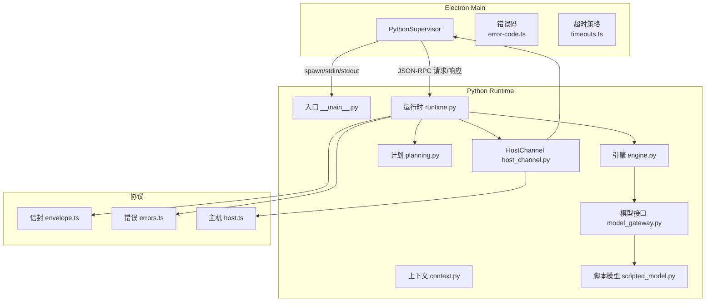
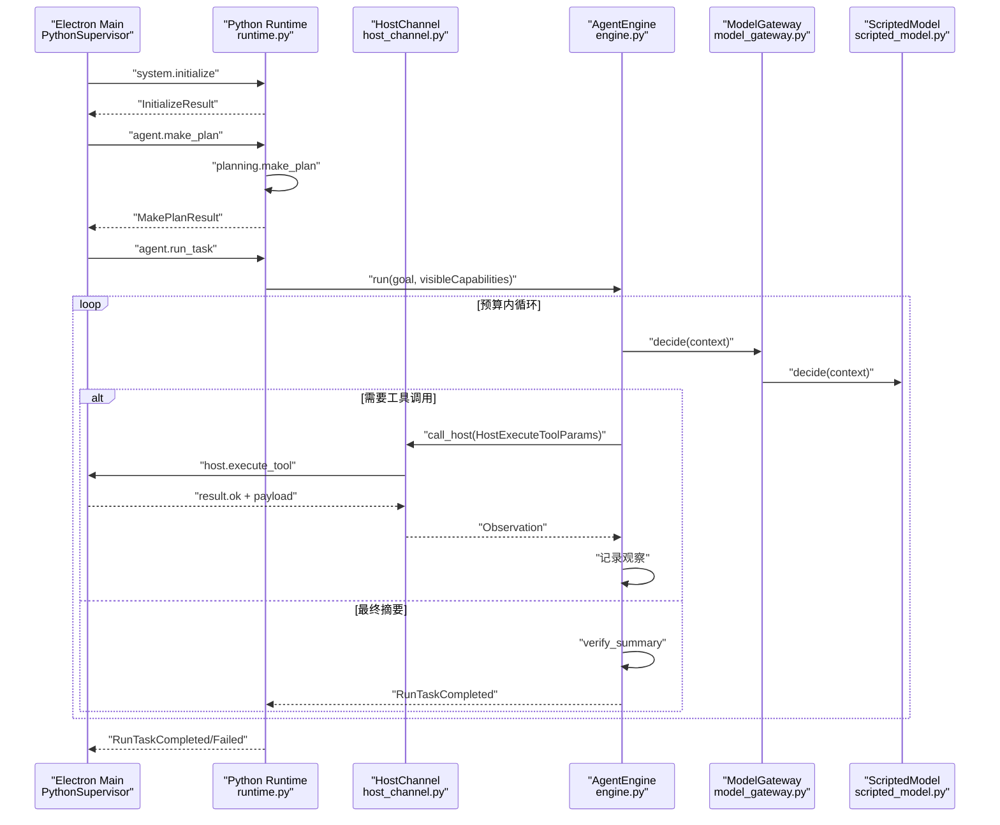
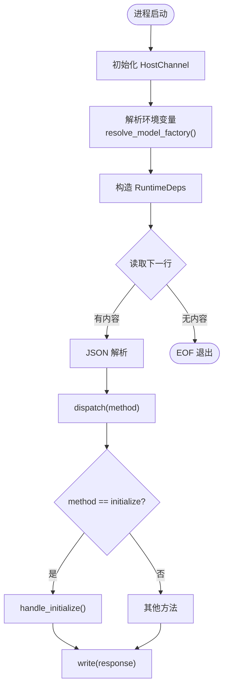
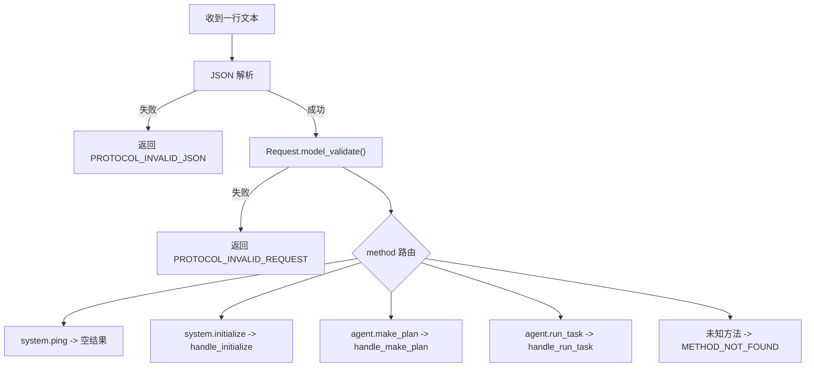
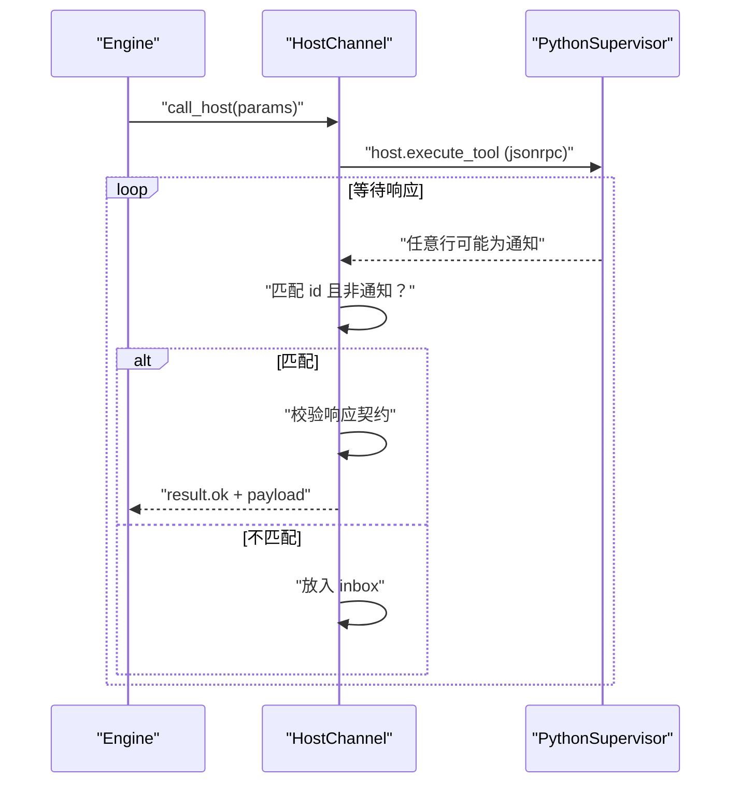
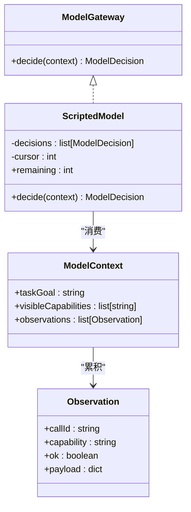
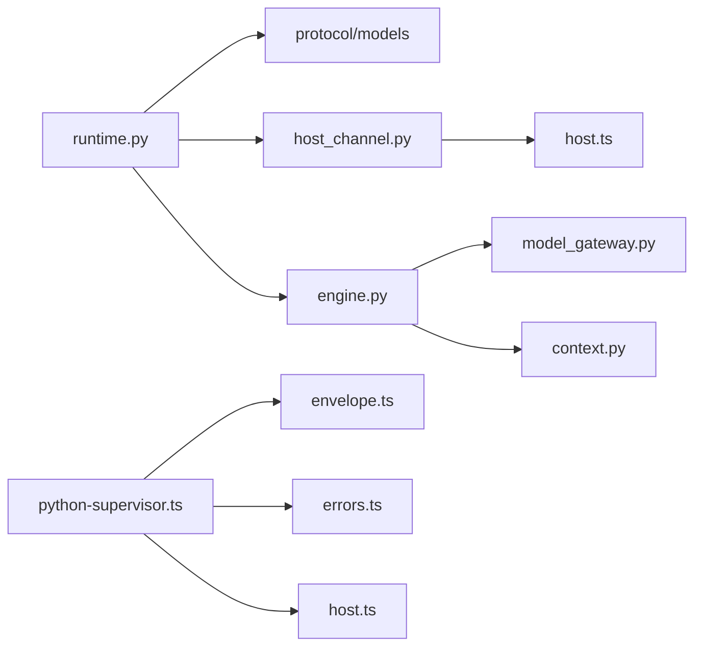

# 运行时核心

<cite>
**本文引用的文件**
- [__main__.py](file://services/agent-runtime/src/personal_agent/__main__.py)
- [runtime.py](file://services/agent-runtime/src/personal_agent/runtime.py)
- [host_channel.py](file://services/agent-runtime/src/personal_agent/host_channel.py)
- [model_gateway.py](file://services/agent-runtime/src/personal_agent/model_gateway.py)
- [engine.py](file://services/agent-runtime/src/personal_agent/engine.py)
- [context.py](file://services/agent-runtime/src/personal_agent/context.py)
- [scripted_model.py](file://services/agent-runtime/src/personal_agent/scripted_model.py)
- [planning.py](file://services/agent-runtime/src/personal_agent/planning.py)
- [python-supervisor.ts](file://apps/desktop/src/main/runtime/python-supervisor.ts)
- [error-code.ts](file://apps/desktop/src/main/runtime/error-code.ts)
- [timeouts.ts](file://apps/desktop/src/main/runtime/timeouts.ts)
- [envelope.ts](file://packages/protocol/schemas/envelope.ts)
- [errors.ts](file://packages/protocol/schemas/errors.ts)
- [host.ts](file://packages/protocol/schemas/host.ts)
</cite>

## 目录
1. [简介](#简介)
2. [项目结构](#项目结构)
3. [核心组件](#核心组件)
4. [架构总览](#架构总览)
5. [详细组件分析](#详细组件分析)
6. [依赖关系分析](#依赖关系分析)
7. [性能考虑](#性能考虑)
8. [故障排除指南](#故障排除指南)
9. [结论](#结论)
10. [附录：扩展示例](#附录：扩展示例)

## 简介
本文件面向“个人代理”项目的运行时核心，聚焦 Python 侧 Agent Runtime 与 Electron Main 进程间的 JSON-RPC 通信、请求分发、生命周期管理、能力声明与依赖注入、I/O 层实现、错误码与异常策略，以及可扩展的 RPC 方法设计。目标是帮助读者理解从启动到任务执行的完整链路，并掌握如何安全地扩展新的 RPC 方法与自定义错误类型。

## 项目结构
- Python 运行时位于 services/agent-runtime/src/personal_agent，负责：
  - 进程入口与主循环（读取 stdin 行、解析 JSON、分发处理）
  - 依赖注入容器 RuntimeDeps（通道、模型工厂、能力清单）
  - JSON-RPC 协议路由与参数校验
  - 引擎循环（预算控制、工具调用、摘要验证）
  - I/O 与日志配置
  - HostChannel 与 Host 进程的双向消息收发
  - ModelGateway 抽象与 ScriptedModel 默认实现
  - 计划生成（确定性三步计划）
- Electron Main 侧通过 PythonSupervisor 管理子进程生命周期、超时、崩溃恢复与 host.execute_tool 反向 RPC。
- 协议定义集中在 packages/protocol/schemas，统一约束 Request/Response/Notification、错误码与能力枚举。

图表来源
- [python-supervisor.ts:96-120](file://apps/desktop/src/main/runtime/python-supervisor.ts#L96-L120)
- [runtime.py:238-257](file://services/agent-runtime/src/personal_agent/runtime.py#L238-L257)
- [host_channel.py:36-91](file://services/agent-runtime/src/personal_agent/host_channel.py#L36-L91)
- [engine.py:85-238](file://services/agent-runtime/src/personal_agent/engine.py#L85-L238)
- [envelope.ts:1-41](file://packages/protocol/schemas/envelope.ts#L1-L41)
- [errors.ts:1-30](file://packages/protocol/schemas/errors.ts#L1-L30)
- [host.ts:1-76](file://packages/protocol/schemas/host.ts#L1-L76)

章节来源
- [__main__.py:1-5](file://services/agent-runtime/src/personal_agent/__main__.py#L1-L5)
- [runtime.py:1-257](file://services/agent-runtime/src/personal_agent/runtime.py#L1-L257)
- [python-supervisor.ts:1-342](file://apps/desktop/src/main/runtime/python-supervisor.ts#L1-L342)
- [envelope.ts:1-41](file://packages/protocol/schemas/envelope.ts#L1-L41)
- [errors.ts:1-30](file://packages/protocol/schemas/errors.ts#L1-L30)
- [host.ts:1-76](file://packages/protocol/schemas/host.ts#L1-L76)

## 核心组件
- 进程入口与主循环：__main__.py 仅转发到 personal_agent.main；runtime.run() 建立 HostChannel，构造 RuntimeDeps，进入 while True 读取 stdin 行，解析为 JSON 后交给 dispatch 分发。
- 依赖注入 RuntimeDeps：持有 channel、model_factory、capabilities。engine 与 ContextManager 不在其中，避免跨任务状态污染。
- JSON-RPC 分发：dispatch 基于 method 路由到 system.ping、system.initialize、agent.make_plan、agent.run_task；未知方法返回 METHOD_NOT_FOUND。
- 引擎循环 AgentEngine：维护步骤与工具调用预算，驱动模型决策、执行工具调用、记录观察、汇总摘要或失败。
- 上下文 ContextManager：累积 Observation，构建带截断的 ModelContext，防止上下文过大。
- 模型抽象 ModelGateway 与默认实现 ScriptedModel：决定下一步是工具调用还是最终摘要；ScriptedModel 按预设序列推进，耗尽时报错。
- 计划模块 planning：根据可见能力生成确定性三步计划，缺能力时抛出 PlanError。
- I/O 与日志：write 输出 JSON 行；_setup_logging 将日志写入 stderr，级别由环境变量控制。
- HostChannel：封装 call_host 与 next_line，处理 inbound/outbound 消息匹配、inbox 缓冲、非法 JSON 丢弃、契约校验与错误转换。
- Electron 侧 PythonSupervisor：管理子进程生命周期、请求超时、取消、崩溃恢复、host.execute_tool 反向处理与超时。

章节来源
- [runtime.py:49-93](file://services/agent-runtime/src/personal_agent/runtime.py#L49-L93)
- [engine.py:85-238](file://services/agent-runtime/src/personal_agent/engine.py#L85-L238)
- [context.py:45-79](file://services/agent-runtime/src/personal_agent/context.py#L45-L79)
- [model_gateway.py:6-100](file://services/agent-runtime/src/personal_agent/model_gateway.py#L6-L100)
- [scripted_model.py:18-57](file://services/agent-runtime/src/personal_agent/scripted_model.py#L18-L57)
- [planning.py:25-45](file://services/agent-runtime/src/personal_agent/planning.py#L25-L45)
- [runtime.py:187-205](file://services/agent-runtime/src/personal_agent/runtime.py#L187-L205)
- [host_channel.py:36-91](file://services/agent-runtime/src/personal_agent/host_channel.py#L36-L91)
- [python-supervisor.ts:96-342](file://apps/desktop/src/main/runtime/python-supervisor.ts#L96-L342)

## 架构总览
下图展示 Electron Main 与 Python Runtime 之间的双向 JSON-RPC 流：Main 发起 initialize、make_plan、run_task；Runtime 在 run_task 中通过 HostChannel 反向触发 host.execute_tool，由 Main 的 hostHandler 执行能力并回写结果。

图表来源
- [python-supervisor.ts:123-147](file://apps/desktop/src/main/runtime/python-supervisor.ts#L123-L147)
- [runtime.py:69-93](file://services/agent-runtime/src/personal_agent/runtime.py#L69-L93)
- [engine.py:98-167](file://services/agent-runtime/src/personal_agent/engine.py#L98-L167)
- [host_channel.py:45-85](file://services/agent-runtime/src/personal_agent/host_channel.py#L45-L85)
- [scripted_model.py:26-32](file://services/agent-runtime/src/personal_agent/scripted_model.py#L26-L32)

## 详细组件分析

### 运行时启动与生命周期管理
- 启动流程：__main__.py 调用 main；runtime.run() 创建 HostChannel（默认绑定 stdin/stdout），解析环境变量以决定是否加载脚本模型，构造 RuntimeDeps，进入主循环读取行、解析、分发、写出响应。EOF 时优雅退出。
- 握手：initialize 校验 InitializeParams，保存 capabilities 到 deps.capabilities，返回 InitializeResult（含协议版本与服务器信息）。
- 停止：Main 调用 stop() 关闭 stdin，Runtime 检测到空行后退出循环并记录日志。

图表来源
- [runtime.py:238-257](file://services/agent-runtime/src/personal_agent/runtime.py#L238-L257)
- [runtime.py:109-125](file://services/agent-runtime/src/personal_agent/runtime.py#L109-L125)
- [runtime.py:208-235](file://services/agent-runtime/src/personal_agent/runtime.py#L208-L235)

章节来源
- [__main__.py:1-5](file://services/agent-runtime/src/personal_agent/__main__.py#L1-L5)
- [runtime.py:238-257](file://services/agent-runtime/src/personal_agent/runtime.py#L238-L257)
- [runtime.py:109-125](file://services/agent-runtime/src/personal_agent/runtime.py#L109-L125)

### 请求分发机制与 JSON-RPC 协议
- 协议信封：Request/Response/Notification 使用 Zod 严格校验，确保 jsonrpc=2.0、id 非空、method 符合命名规范，且 result 与 error 互斥。
- 分发逻辑：dispatch 先做 Request 校验，再按 method 路由到系统方法或业务方法；未知方法返回 METHOD_NOT_FOUND。
- 参数校验：各 handler 使用 Pydantic 对 params 进行强校验，失败返回 PROTOCOL_INVALID_REQUEST。
- 响应构建：统一使用 Response 模型序列化，exclude_none=True 避免 null 字段导致两端契约不一致。

图表来源
- [runtime.py:69-93](file://services/agent-runtime/src/personal_agent/runtime.py#L69-L93)
- [envelope.ts:5-34](file://packages/protocol/schemas/envelope.ts#L5-L34)
- [errors.ts:1-30](file://packages/protocol/schemas/errors.ts#L1-L30)

章节来源
- [runtime.py:69-93](file://services/agent-runtime/src/personal_agent/runtime.py#L69-L93)
- [envelope.ts:1-41](file://packages/protocol/schemas/envelope.ts#L1-L41)
- [errors.ts:1-30](file://packages/protocol/schemas/errors.ts#L1-L30)

### RuntimeDeps 依赖注入设计
- RuntimeDeps 作为单进程级依赖容器，持有：
  - channel：与 Host 进程的通信通道
  - model_factory：每次调用返回新 ModelGateway 实例，避免状态复用问题
  - capabilities：会话级能力清单，来自 initialize 握手
- 不存放 engine 与 ContextManager：因为每个 run_task 需独立上下文，避免跨任务污染。
- 模型工厂解析：根据环境变量 PERSONAL_AGENT_SCRIPT 加载脚本，失败则返回 None，使 run_task 直接返回未配置模型的错误码。

章节来源
- [runtime.py:49-62](file://services/agent-runtime/src/personal_agent/runtime.py#L49-L62)
- [runtime.py:208-235](file://services/agent-runtime/src/personal_agent/runtime.py#L208-L235)

### HostChannel 通信通道
- 发送 host.execute_tool：分配唯一 rpc_id，写入请求，循环读取 stdin，匹配 id 且非通知的消息进行响应解析与校验。
- 接收混合消息：next_line 支持 inbox 缓冲，允许在等待响应期间接收其他消息（如反向通知）。
- 错误处理：
  - HostChannelClosed：stdin EOF，表示宿主进程已退出
  - HostRequestFailed：响应不符合契约或包含 error，携带 code/message
  - 非法 JSON：记录警告并丢弃

图表来源
- [host_channel.py:45-91](file://services/agent-runtime/src/personal_agent/host_channel.py#L45-L91)
- [host.ts:28-67](file://packages/protocol/schemas/host.ts#L28-L67)

章节来源
- [host_channel.py:18-91](file://services/agent-runtime/src/personal_agent/host_channel.py#L18-L91)
- [host.ts:1-76](file://packages/protocol/schemas/host.ts#L1-L76)

### ModelGateway 工厂模式与 Capability 管理
- ModelGateway 为 Protocol，定义 decide(context) -> ModelDecision；默认实现 ScriptedModel 按预设序列推进，耗尽时抛出 ScriptExhausted。
- Capability 管理：
  - 握手阶段 Main 下发 capabilities，Runtime 存入 RuntimeDeps.capabilities
  - make_plan 与 run_task 均使用可见能力清单进行判定与过滤
  - 若 capability 不在协议枚举内，engine 就地构造 Observation 标记 CAPABILITY_NOT_REGISTERED

图表来源
- [model_gateway.py:6-100](file://services/agent-runtime/src/personal_agent/model_gateway.py#L6-L100)
- [scripted_model.py:18-57](file://services/agent-runtime/src/personal_agent/scripted_model.py#L18-L57)

章节来源
- [model_gateway.py:6-100](file://services/agent-runtime/src/personal_agent/model_gateway.py#L6-L100)
- [scripted_model.py:18-57](file://services/agent-runtime/src/personal_agent/scripted_model.py#L18-L57)
- [runtime.py:109-125](file://services/agent-runtime/src/personal_agent/runtime.py#L109-L125)
- [engine.py:210-236](file://services/agent-runtime/src/personal_agent/engine.py#L210-L236)

### I/O 层：标准输入输出、日志与错误处理
- 标准 I/O：write 将响应序列化为 JSON 行并 flush；run 主循环读取 stdin 行，遇到 EOF 退出。
- 日志：_setup_logging 创建 logger，级别由环境变量控制，输出到 stderr，格式包含时间、级别、名称与消息。
- 错误处理：
  - JSON 解析失败：返回 PROTOCOL_INVALID_JSON
  - 协议校验失败：返回 PROTOCOL_INVALID_REQUEST
  - 未知方法：METHOD_NOT_FOUND
  - 内部异常：RUNTIME_INTERNAL
  - 模型未配置：RUNTIME_MODEL_NOT_CONFIGURED
  - 计划不可构建：PLAN_NOT_BUILDABLE

章节来源
- [runtime.py:187-205](file://services/agent-runtime/src/personal_agent/runtime.py#L187-L205)
- [runtime.py:69-93](file://services/agent-runtime/src/personal_agent/runtime.py#L69-L93)
- [runtime.py:128-155](file://services/agent-runtime/src/personal_agent/runtime.py#L128-L155)
- [runtime.py:158-184](file://services/agent-runtime/src/personal_agent/runtime.py#L158-L184)

### 进程间通信：消息序列化、错误码与异常策略
- 序列化：双方均使用 JSON 行协议，Request/Response/Notification 受 Zod/Pydantic 双重校验。
- 错误码：
  - 协议层：ERROR_CODE 集中定义，包括 PROTOCOL_INVALID_JSON、METHOD_NOT_FOUND、HOST_TIMEOUT 等
  - 运行时层：RUNTIME_ERROR_CODE 定义 Electron 侧运行时错误（超时、取消、崩溃、握手失败等）
  - Python 单侧错误码：RUNTIME_MODEL_NOT_CONFIGURED、PLAN_NOT_BUILDABLE 等，TS 侧视为不透明字符串透传
- 异常策略：
  - HostChannelClosed：管道关闭，引擎转为失败事件
  - HostRequestFailed：系统级失败，携带 code/message
  - ScriptExhausted：脚本用尽，引擎直接失败
  - SummaryRejected：摘要验证失败，引擎失败

章节来源
- [errors.ts:1-30](file://packages/protocol/schemas/errors.ts#L1-L30)
- [error-code.ts:1-18](file://apps/desktop/src/main/runtime/error-code.ts#L1-L18)
- [runtime.py:31-46](file://services/agent-runtime/src/personal_agent/runtime.py#L31-L46)
- [host_channel.py:18-34](file://services/agent-runtime/src/personal_agent/host_channel.py#L18-L34)
- [engine.py:168-171](file://services/agent-runtime/src/personal_agent/engine.py#L168-L171)

## 依赖关系分析
- 耦合度：
  - runtime.py 与 protocol/models 强耦合（方法名、参数结构）
  - engine.py 与 model_gateway、host_channel、context 紧密协作
  - host_channel.py 与 host.ts 协议强一致
  - python-supervisor.ts 与 envelope.ts、errors.ts、host.ts 保持一致
- 外部依赖：
  - pydantic：参数校验与数据建模
  - zod：TS 侧契约校验
  - Node child_process：子进程管理
- 潜在循环依赖：当前未见循环导入；各模块职责清晰，通过接口与协议解耦。

图表来源
- [runtime.py:10-29](file://services/agent-runtime/src/personal_agent/runtime.py#L10-L29)
- [engine.py:16-42](file://services/agent-runtime/src/personal_agent/engine.py#L16-L42)
- [host_channel.py:8-13](file://services/agent-runtime/src/personal_agent/host_channel.py#L8-L13)
- [python-supervisor.ts:1-15](file://apps/desktop/src/main/runtime/python-supervisor.ts#L1-L15)

章节来源
- [runtime.py:1-257](file://services/agent-runtime/src/personal_agent/runtime.py#L1-L257)
- [engine.py:1-238](file://services/agent-runtime/src/personal_agent/engine.py#L1-L238)
- [host_channel.py:1-91](file://services/agent-runtime/src/personal_agent/host_channel.py#L1-L91)
- [python-supervisor.ts:1-342](file://apps/desktop/src/main/runtime/python-supervisor.ts#L1-L342)

## 性能考虑
- 预算控制：引擎限制最大步数与工具调用次数，避免无限循环与资源耗尽。
- 上下文截断：ContextManager 对可截断键值进行长度限制，减少模型上下文大小。
- 超时策略：
  - 单次 host.execute_tool 超时由 TIMEOUTS 推导，保证大于权限有效期
  - run_task 整体超时基于最大工具调用次数与模型余量计算
- 日志级别：可通过环境变量调整，降低生产环境开销。
- 模型工厂：每次任务新建 ModelGateway 实例，避免状态复用导致的性能退化。

章节来源
- [engine.py:46-83](file://services/agent-runtime/src/personal_agent/engine.py#L46-L83)
- [context.py:14-25](file://services/agent-runtime/src/personal_agent/context.py#L14-L25)
- [timeouts.ts:1-13](file://apps/desktop/src/main/runtime/timeouts.ts#L1-L13)
- [runtime.py:193-205](file://services/agent-runtime/src/personal_agent/runtime.py#L193-L205)

## 故障排除指南
- 握手失败：检查 initialize 参数是否符合 InitializeParams，确认协议版本与能力清单正确。
- 计划不可构建：确保可见能力包含 filesystem.list 与 document.extract_pdf。
- 模型未配置：设置 PERSONAL_AGENT_SCRIPT 指向合法脚本路径，或提供有效 model_factory。
- 工具调用失败：
  - 检查 hostHandler 是否注入
  - 关注 HOST_TIMEOUT 与 HOST_HANDLER_FAILED
  - 查看 HostChannel 抛出的 HostRequestFailed 详情
- 进程崩溃：
  - Electron 侧会记录 crashInfo 并拒绝后续请求
  - Python 侧 EOF 后正常退出，注意区分意外退出与优雅关闭
- 日志定位：stderr 输出包含时间戳与级别，结合 PERSONAL_AGENT_LOG_LEVEL 调整详细程度。

章节来源
- [runtime.py:109-125](file://services/agent-runtime/src/personal_agent/runtime.py#L109-L125)
- [runtime.py:128-155](file://services/agent-runtime/src/personal_agent/runtime.py#L128-L155)
- [runtime.py:158-184](file://services/agent-runtime/src/personal_agent/runtime.py#L158-L184)
- [python-supervisor.ts:244-300](file://apps/desktop/src/main/runtime/python-supervisor.ts#L244-L300)
- [python-supervisor.ts:318-340](file://apps/desktop/src/main/runtime/python-supervisor.ts#L318-L340)

## 结论
该运行时核心通过清晰的依赖注入、严格的协议校验、稳健的错误处理与可控的预算策略，实现了 Electron 与 Python 之间的高内聚、低耦合通信。扩展新 RPC 方法或自定义错误类型时，应遵循现有模式：在协议层定义契约，在分发层添加路由，在处理器中进行参数校验与响应构建，并在错误路径中返回合适的错误码。

## 附录：扩展示例

### 新增一个 RPC 方法
- 在协议层定义方法与参数结构（参考 envelope.ts、host.ts）
- 在 runtime.py 的 dispatch 中添加路由分支
- 实现对应 handler，使用 Pydantic 校验参数，返回 Response
- 在 Electron 侧 PythonSupervisor 中如需反向调用，参照 host.execute_tool 模式

章节来源
- [runtime.py:69-93](file://services/agent-runtime/src/personal_agent/runtime.py#L69-L93)
- [envelope.ts:5-34](file://packages/protocol/schemas/envelope.ts#L5-L34)
- [host.ts:28-67](file://packages/protocol/schemas/host.ts#L28-L67)

### 自定义错误类型
- 在协议层 errors.ts 或运行时 error-code.ts 中定义错误码
- 在处理器中捕获异常并返回 build_error(code, message)
- 在 Electron 侧映射为 RuntimeError，便于上层统一处理

章节来源
- [errors.ts:1-30](file://packages/protocol/schemas/errors.ts#L1-L30)
- [error-code.ts:1-18](file://apps/desktop/src/main/runtime/error-code.ts#L1-L18)
- [runtime.py:65-67](file://services/agent-runtime/src/personal_agent/runtime.py#L65-L67)