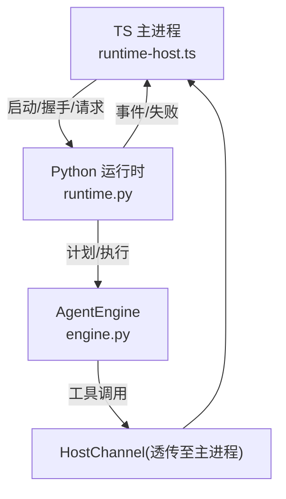
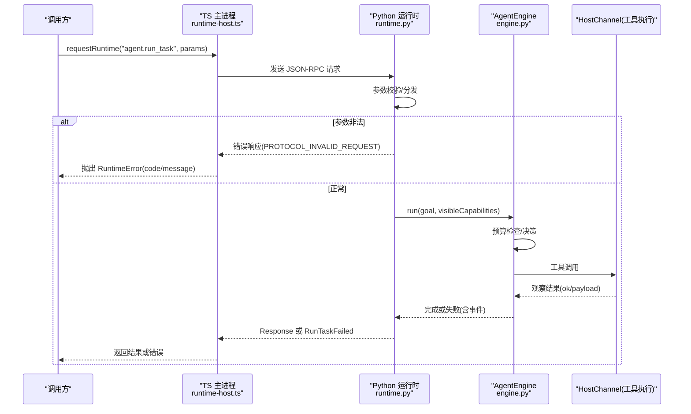
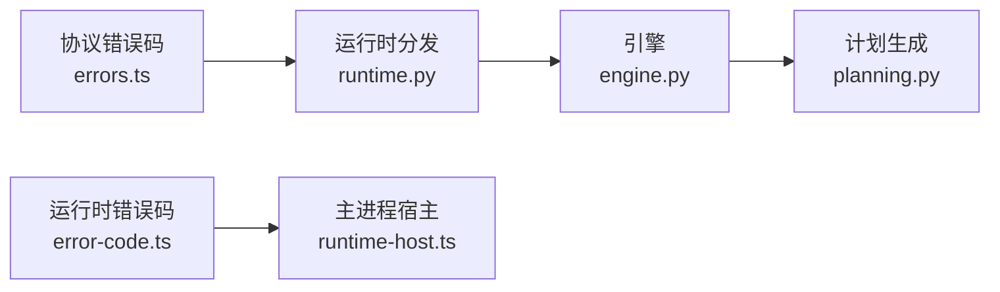

# 错误处理

<cite>
**本文引用的文件**
- [apps/desktop/src/main/runtime/error-code.ts](file://apps/desktop/src/main/runtime/error-code.ts)
- [apps/desktop/src/main/runtime/runtime-host.ts](file://apps/desktop/src/main/runtime/runtime-host.ts)
- [packages/protocol/schemas/errors.ts](file://packages/protocol/schemas/errors.ts)
- [services/agent-runtime/src/personal_agent/runtime.py](file://services/agent-runtime/src/personal_agent/runtime.py)
- [services/agent-runtime/src/personal_agent/engine.py](file://services/agent-runtime/src/personal_agent/engine.py)
- [services/agent-runtime/src/personal_agent/planning.py](file://services/agent-runtime/src/personal_agent/planning.py)
</cite>

## 目录
1. [简介](#简介)
2. [项目结构](#项目结构)
3. [核心组件](#核心组件)
4. [架构总览](#架构总览)
5. [详细组件分析](#详细组件分析)
6. [依赖关系分析](#依赖关系分析)
7. [性能与可靠性考虑](#性能与可靠性考虑)
8. [故障排查指南](#故障排查指南)
9. [结论](#结论)
10. [附录：错误码与消息规范](#附录错误码与消息规范)

## 简介
本文件系统化梳理 Personal Agent 的错误处理机制，覆盖运行时错误分类、错误码体系、异常传播、重试与恢复策略、日志记录规范，以及常见问题的定位方法。目标是帮助开发者在不同语言（TypeScript/Electron 主进程与 Python Agent Runtime）之间统一错误语义，确保跨层调用可观测、可诊断、可恢复。

## 项目结构
本项目在“主进程—Python 运行时”的双端架构中实现错误处理：
- TypeScript（Electron 主进程）负责启动/监控 Python 子进程、协议握手、能力清单下发、工具执行桥接，以及将运行时错误映射为统一的错误码。
- Python（Agent Runtime）负责请求分发、参数校验、计划生成、任务执行循环、事件上报，并将内部异常转换为协议错误响应。
- 共享协议定义位于 packages/protocol，集中了错误码常量与数据结构。

**图表来源**
- [apps/desktop/src/main/runtime/runtime-host.ts:1-88](file://apps/desktop/src/main/runtime/runtime-host.ts#L1-L88)
- [services/agent-runtime/src/personal_agent/runtime.py:69-184](file://services/agent-runtime/src/personal_agent/runtime.py#L69-L184)
- [services/agent-runtime/src/personal_agent/engine.py:91-244](file://services/agent-runtime/src/personal_agent/engine.py#L91-L244)

**章节来源**
- [apps/desktop/src/main/runtime/runtime-host.ts:1-88](file://apps/desktop/src/main/runtime/runtime-host.ts#L1-L88)
- [services/agent-runtime/src/personal_agent/runtime.py:69-184](file://services/agent-runtime/src/personal_agent/runtime.py#L69-L184)
- [services/agent-runtime/src/personal_agent/engine.py:91-244](file://services/agent-runtime/src/personal_agent/engine.py#L91-L244)

## 核心组件
- 错误码定义
  - 协议侧错误码：集中在协议包，用于 JSON-RPC 层、能力范围、权限、文件系统、PDF 提取等场景。
  - 运行时侧错误码：集中在 TS 主进程，描述 Python 运行时的生命周期与通信状态。
- 请求分发与参数校验：Python 运行时对每个方法进行参数校验，不合法则返回协议错误。
- 任务执行引擎：AgentEngine 维护预算控制、事件流、工具调用与失败路径。
- 主进程宿主通道：封装 Python 子进程生命周期管理、错误映射与状态同步。

**章节来源**
- [packages/protocol/schemas/errors.ts:1-30](file://packages/protocol/schemas/errors.ts#L1-L30)
- [apps/desktop/src/main/runtime/error-code.ts:1-18](file://apps/desktop/src/main/runtime/error-code.ts#L1-L18)
- [services/agent-runtime/src/personal_agent/runtime.py:69-184](file://services/agent-runtime/src/personal_agent/runtime.py#L69-L184)
- [services/agent-runtime/src/personal_agent/engine.py:91-244](file://services/agent-runtime/src/personal_agent/engine.py#L91-L244)
- [apps/desktop/src/main/runtime/runtime-host.ts:1-88](file://apps/desktop/src/main/runtime/runtime-host.ts#L1-L88)

## 架构总览
下图展示一次 agent.run_task 的端到端流程及错误传播路径。

**图表来源**
- [apps/desktop/src/main/runtime/runtime-host.ts:77-87](file://apps/desktop/src/main/runtime/runtime-host.ts#L77-L87)
- [services/agent-runtime/src/personal_agent/runtime.py:158-184](file://services/agent-runtime/src/personal_agent/runtime.py#L158-L184)
- [services/agent-runtime/src/personal_agent/engine.py:104-177](file://services/agent-runtime/src/personal_agent/engine.py#L104-L177)

## 详细组件分析

### 运行时错误分类与处理策略
- 协议错误
  - 定义：JSON-RPC 层或参数不符合契约，如无效 JSON、未知方法、参数校验失败。
  - 处理：Python 运行时捕获解析/校验异常，构造标准错误响应；TS 主进程将其包装为 RuntimeError 并向上抛出。
  - 关键位置：
    - 协议错误码定义：[packages/protocol/schemas/errors.ts:1-30](file://packages/protocol/schemas/errors.ts#L1-L30)
    - 请求分发与参数校验：[services/agent-runtime/src/personal_agent/runtime.py:67-104](file://services/agent-runtime/src/personal_agent/runtime.py#L67-L104)
    - 未知方法处理：[services/agent-runtime/src/personal_agent/runtime.py:83-91](file://services/agent-runtime/src/personal_agent/runtime.py#L83-L91)
    - TS 错误包装与传播：[apps/desktop/src/main/runtime/runtime-host.ts:77-87](file://apps/desktop/src/main/runtime/runtime-host.ts#L77-L87)

- 内部错误
  - 定义：运行时不可预期的异常（如未捕获异常、脚本加载失败、通道关闭）。
  - 处理：Python 侧记录堆栈并返回通用内部错误码；TS 侧根据子进程状态更新为崩溃态。
  - 关键位置：
    - 计划生成异常兜底：[services/agent-runtime/src/personal_agent/runtime.py:142-149](file://services/agent-runtime/src/personal_agent/runtime.py#L142-L149)
    - 任务执行异常兜底：[services/agent-runtime/src/personal_agent/runtime.py:174-178](file://services/agent-runtime/src/personal_agent/runtime.py#L174-L178)
    - 通道关闭处理：[services/agent-runtime/src/personal_agent/engine.py:130-136](file://services/agent-runtime/src/personal_agent/engine.py#L130-L136)
    - 子进程崩溃状态：[apps/desktop/src/main/runtime/runtime-host.ts:43-62](file://apps/desktop/src/main/runtime/runtime-host.ts#L43-L62)

- 业务错误
  - 定义：由业务规则触发的失败，如能力未注册、权限不足、路径越界、PDF 提取失败、预算耗尽等。
  - 处理：通过明确的错误码与结构化 payload 返回，便于上层区分与降级。
  - 关键位置：
    - 能力未注册：[services/agent-runtime/src/personal_agent/engine.py:167-186](file://services/agent-runtime/src/personal_agent/engine.py#L167-L186)
    - 预算耗尽：[services/agent-runtime/src/personal_agent/engine.py:96-105](file://services/agent-runtime/src/personal_agent/engine.py#L96-L105)
    - 计划构建失败：[services/agent-runtime/src/personal_agent/planning.py:54-75](file://services/agent-runtime/src/personal_agent/planning.py#L54-L75)

**章节来源**
- [packages/protocol/schemas/errors.ts:1-30](file://packages/protocol/schemas/errors.ts#L1-L30)
- [services/agent-runtime/src/personal_agent/runtime.py:69-184](file://services/agent-runtime/src/personal_agent/runtime.py#L69-L184)
- [services/agent-runtime/src/personal_agent/engine.py:118-235](file://services/agent-runtime/src/personal_agent/engine.py#L118-L235)
- [services/agent-runtime/src/personal_agent/planning.py:54-75](file://services/agent-runtime/src/personal_agent/planning.py#L54-L75)
- [apps/desktop/src/main/runtime/runtime-host.ts:43-87](file://apps/desktop/src/main/runtime/runtime-host.ts#L43-L87)

### 错误码体系
- 预定义错误码（协议层）
  - 涵盖：协议格式/请求、方法不存在、能力范围、权限、文件系统、PDF 提取等。
  - 参考：[packages/protocol/schemas/errors.ts:1-30](file://packages/protocol/schemas/errors.ts#L1-L30)

- 运行时错误码（TS 主进程）
  - 涵盖：未启动、超时、取消、停止、崩溃、握手失败、响应无效、计划无效、数据库失败、任务忙、孤儿等。
  - 参考：[apps/desktop/src/main/runtime/error-code.ts:1-18](file://apps/desktop/src/main/runtime/error-code.ts#L1-L18)

- 自定义错误码（Python 运行时）
  - 涵盖：模型未配置、计划无法构建等，作为不透明字符串透传给 TS 侧。
  - 参考：
    - 模型未配置：[services/agent-runtime/src/personal_agent/runtime.py:33-42](file://services/agent-runtime/src/personal_agent/runtime.py#L33-L42)
    - 计划无法构建：[services/agent-runtime/src/personal_agent/runtime.py:142-149](file://services/agent-runtime/src/personal_agent/runtime.py#L142-L149)
- 模型侧失败（TASK-027）
  - ModelCallFailed（网络、鉴权、结构化输出不合契约）由 engine 捕获，把任务收成 failed 且 reason 带 MODEL_CALL_FAILED 前缀——不让它冒成 RUNTIME_INTERNAL，任务记录里直接看得出是哪一侧。
  - 参考：[services/agent-runtime/src/personal_agent/engine.py:68-71](file://services/agent-runtime/src/personal_agent/engine.py#L68-L71)

- 错误消息格式
  - JSON-RPC 错误对象包含 code 与 message；Python 侧统一通过 build_error 构造。
  - 参考：[services/agent-runtime/src/personal_agent/runtime.py:65-67](file://services/agent-runtime/src/personal_agent/runtime.py#L65-L67)

**章节来源**
- [packages/protocol/schemas/errors.ts:1-30](file://packages/protocol/schemas/errors.ts#L1-L30)
- [apps/desktop/src/main/runtime/error-code.ts:1-18](file://apps/desktop/src/main/runtime/error-code.ts#L1-L18)
- [services/agent-runtime/src/personal_agent/runtime.py:65-67](file://services/agent-runtime/src/personal_agent/runtime.py#L65-L67)
- [services/agent-runtime/src/personal_agent/runtime.py:33-42](file://services/agent-runtime/src/personal_agent/runtime.py#L33-L42)
- [services/agent-runtime/src/personal_agent/runtime.py:142-149](file://services/agent-runtime/src/personal_agent/runtime.py#L142-L149)
- [services/agent-runtime/src/personal_agent/engine.py:68-71](file://services/agent-runtime/src/personal_agent/engine.py#L68-L71)

### 异常传播机制
- 跨层异常处理
  - Python 侧：参数校验失败返回协议错误；未预期异常记录堆栈后返回内部错误。
  - TS 侧：捕获 Python 子进程错误，设置状态为 crashed，并向调用方抛出 RuntimeError。
  - 参考：
    - 参数校验与错误响应：[services/agent-runtime/src/personal_agent/runtime.py:67-104](file://services/agent-runtime/src/personal_agent/runtime.py#L67-L104)
    - 未预期异常兜底：[services/agent-runtime/src/personal_agent/runtime.py:140-147](file://services/agent-runtime/src/personal_agent/runtime.py#L140-L147), [services/agent-runtime/src/personal_agent/runtime.py:174-178](file://services/agent-runtime/src/personal_agent/runtime.py#L174-L178)
    - TS 错误包装与状态更新：[apps/desktop/src/main/runtime/runtime-host.ts:43-62](file://apps/desktop/src/main/runtime/runtime-host.ts#L43-L62), [apps/desktop/src/main/runtime/runtime-host.ts:77-87](file://apps/desktop/src/main/runtime/runtime-host.ts#L77-L87)

- 错误上下文保留
  - 任务失败时附带 events，包含步骤、工具调用、结果与失败原因，便于回溯。
  - 参考：[services/agent-runtime/src/personal_agent/engine.py:98-171](file://services/agent-runtime/src/personal_agent/engine.py#L98-L171)

- 堆栈追踪
  - Python 侧使用 logging.exception 记录未预期异常的完整堆栈。
  - 参考：[services/agent-runtime/src/personal_agent/runtime.py:140-147](file://services/agent-runtime/src/personal_agent/runtime.py#L140-L147), [services/agent-runtime/src/personal_agent/runtime.py:174-178](file://services/agent-runtime/src/personal_agent/runtime.py#L174-L178)

**章节来源**
- [services/agent-runtime/src/personal_agent/runtime.py:69-184](file://services/agent-runtime/src/personal_agent/runtime.py#L69-L184)
- [services/agent-runtime/src/personal_agent/engine.py:95-157](file://services/agent-runtime/src/personal_agent/engine.py#L95-L157)
- [apps/desktop/src/main/runtime/runtime-host.ts:43-87](file://apps/desktop/src/main/runtime/runtime-host.ts#L43-L87)

### 重试与恢复策略
- 指数退避
  - 当前代码未内置指数退避逻辑。建议在 TS 主进程发起请求前增加重试层，针对可恢复错误（如 HOST_TIMEOUT、RUNTIME_TIMEOUT）进行有限次重试，并逐步增大间隔。
- 熔断器
  - 当前代码未实现熔断。建议在主进程侧统计连续失败率，达到阈值后快速失败，避免雪崩。
- 降级处理
  - 当模型未配置或脚本不可用时，Python 运行时返回明确错误码，TS 侧可降级为提示用户或回退到最小功能集。
  - 参考：
    - 模型未配置：[services/agent-runtime/src/personal_agent/runtime.py:166-169](file://services/agent-runtime/src/personal_agent/runtime.py#L166-L169)
    - 脚本加载失败：[services/agent-runtime/src/personal_agent/runtime.py:226-230](file://services/agent-runtime/src/personal_agent/runtime.py#L226-L230)

**章节来源**
- [services/agent-runtime/src/personal_agent/runtime.py:164-167](file://services/agent-runtime/src/personal_agent/runtime.py#L164-L167)
- [services/agent-runtime/src/personal_agent/runtime.py:226-230](file://services/agent-runtime/src/personal_agent/runtime.py#L226-L230)

### 日志记录规范
- 日志级别
  - Python 运行时通过环境变量 PERSONAL_AGENT_LOG_LEVEL 控制级别，默认 INFO。
  - 参考：[services/agent-runtime/src/personal_agent/runtime.py:193-202](file://services/agent-runtime/src/personal_agent/runtime.py#L193-L202)
- 结构化日志
  - 使用 logging 模块输出时间戳、级别、名称与消息；异常使用 exception 记录堆栈。
  - 参考：[services/agent-runtime/src/personal_agent/runtime.py:191-200](file://services/agent-runtime/src/personal_agent/runtime.py#L191-L200), [services/agent-runtime/src/personal_agent/runtime.py:140-147](file://services/agent-runtime/src/personal_agent/runtime.py#L140-L147)
- 调试信息收集
  - 开发模式下转发 Python stderr 到主进程控制台，便于联调。
  - 参考：[apps/desktop/src/main/runtime/runtime-host.ts:47-50](file://apps/desktop/src/main/runtime/runtime-host.ts#L47-L50)

**章节来源**
- [services/agent-runtime/src/personal_agent/runtime.py:191-200](file://services/agent-runtime/src/personal_agent/runtime.py#L191-L200)
- [apps/desktop/src/main/runtime/runtime-host.ts:47-50](file://apps/desktop/src/main/runtime/runtime-host.ts#L47-L50)

### 具体示例（以路径引用代替代码片段）
- 正确抛出协议错误（参数校验失败）
  - Python 侧：[services/agent-runtime/src/personal_agent/runtime.py:67-104](file://services/agent-runtime/src/personal_agent/runtime.py#L67-L104)
- 捕获并转换内部异常
  - Python 侧：[services/agent-runtime/src/personal_agent/runtime.py:140-147](file://services/agent-runtime/src/personal_agent/runtime.py#L140-L147), [services/agent-runtime/src/personal_agent/runtime.py:174-178](file://services/agent-runtime/src/personal_agent/runtime.py#L174-L178)
- 记录诊断信息
  - Python 侧：[services/agent-runtime/src/personal_agent/runtime.py:191-200](file://services/agent-runtime/src/personal_agent/runtime.py#L191-L200)
- 主进程错误包装与状态更新
  - TS 侧：[apps/desktop/src/main/runtime/runtime-host.ts:43-62](file://apps/desktop/src/main/runtime/runtime-host.ts#L43-L62), [apps/desktop/src/main/runtime/runtime-host.ts:77-87](file://apps/desktop/src/main/runtime/runtime-host.ts#L77-L87)

## 依赖关系分析

**图表来源**
- [packages/protocol/schemas/errors.ts:1-30](file://packages/protocol/schemas/errors.ts#L1-L30)
- [apps/desktop/src/main/runtime/error-code.ts:1-18](file://apps/desktop/src/main/runtime/error-code.ts#L1-L18)
- [services/agent-runtime/src/personal_agent/runtime.py:69-184](file://services/agent-runtime/src/personal_agent/runtime.py#L69-L184)
- [services/agent-runtime/src/personal_agent/engine.py:91-244](file://services/agent-runtime/src/personal_agent/engine.py#L91-L244)
- [services/agent-runtime/src/personal_agent/planning.py:54-75](file://services/agent-runtime/src/personal_agent/planning.py#L54-L75)

**章节来源**
- [packages/protocol/schemas/errors.ts:1-30](file://packages/protocol/schemas/errors.ts#L1-L30)
- [apps/desktop/src/main/runtime/error-code.ts:1-18](file://apps/desktop/src/main/runtime/error-code.ts#L1-L18)
- [services/agent-runtime/src/personal_agent/runtime.py:69-184](file://services/agent-runtime/src/personal_agent/runtime.py#L69-L184)
- [services/agent-runtime/src/personal_agent/engine.py:91-244](file://services/agent-runtime/src/personal_agent/engine.py#L91-L244)
- [services/agent-runtime/src/personal_agent/planning.py:25-44](file://services/agent-runtime/src/personal_agent/planning.py#L25-L44)

## 性能与可靠性考虑
- 预算控制
  - 通过最大步数与工具调用次数限制，防止无限循环与资源耗尽。
  - 参考：[services/agent-runtime/src/personal_agent/engine.py:67-74](file://services/agent-runtime/src/personal_agent/engine.py#L67-L74), [services/agent-runtime/src/personal_agent/engine.py:96-105](file://services/agent-runtime/src/personal_agent/engine.py#L96-L105)
- 事件驱动的可观测性
  - 每次工具调用与结果均产生事件，便于审计与回放。
  - 参考：[services/agent-runtime/src/personal_agent/engine.py:121-146](file://services/agent-runtime/src/personal_agent/engine.py#L121-L146)
- 健壮性
  - 对通道关闭、脚本加载失败等边界条件进行显式处理，避免进程挂死。
  - 参考：[services/agent-runtime/src/personal_agent/engine.py:130-136](file://services/agent-runtime/src/personal_agent/engine.py#L130-L136), [services/agent-runtime/src/personal_agent/runtime.py:214-218](file://services/agent-runtime/src/personal_agent/runtime.py#L214-L218)

**章节来源**
- [services/agent-runtime/src/personal_agent/engine.py:82-172](file://services/agent-runtime/src/personal_agent/engine.py#L82-L172)
- [services/agent-runtime/src/personal_agent/runtime.py:214-218](file://services/agent-runtime/src/personal_agent/runtime.py#L214-L218)

## 故障排查指南
- 现象：请求立即失败，错误码为 PROTOCOL_INVALID_JSON 或 PROTOCOL_INVALID_REQUEST
  - 可能原因：JSON 格式错误或参数不符合契约
  - 排查要点：检查入参结构与必填字段；查看 Python 侧日志中的警告信息
  - 参考：[services/agent-runtime/src/personal_agent/runtime.py:94-104](file://services/agent-runtime/src/personal_agent/runtime.py#L94-L104)

- 现象：方法调用报 METHOD_NOT_FOUND
  - 可能原因：请求 method 不在支持列表
  - 排查要点：核对协议方法与路由；确认版本兼容
  - 参考：[services/agent-runtime/src/personal_agent/runtime.py:83-91](file://services/agent-runtime/src/personal_agent/runtime.py#L83-L91)

- 现象：任务执行中途失败，events 中包含失败原因
  - 可能原因：预算耗尽、能力未注册、通道关闭、脚本耗尽等
  - 排查要点：检查 events 中的 step/tool 计数与 reason；关注 Python 侧异常堆栈
  - 参考：[services/agent-runtime/src/personal_agent/engine.py:112-171](file://services/agent-runtime/src/personal_agent/engine.py#L112-L171)

- 现象：主进程状态变为 crashed
  - 可能原因：Python 子进程崩溃、握手失败、找不到 venv python
  - 排查要点：查看 stderr 输出与 detail 信息；确认环境路径与依赖
  - 参考：[apps/desktop/src/main/runtime/runtime-host.ts:31-62](file://apps/desktop/src/main/runtime/runtime-host.ts#L31-L62)

**章节来源**
- [services/agent-runtime/src/personal_agent/runtime.py:85-106](file://services/agent-runtime/src/personal_agent/runtime.py#L85-L106)
- [services/agent-runtime/src/personal_agent/engine.py:102-157](file://services/agent-runtime/src/personal_agent/engine.py#L102-L157)
- [apps/desktop/src/main/runtime/runtime-host.ts:31-62](file://apps/desktop/src/main/runtime/runtime-host.ts#L31-L62)

## 结论
本项目的错误处理围绕“协议错误、内部错误、业务错误”三类展开，通过统一的错误码与事件流实现跨层可观测与可诊断。建议在现有基础上补充重试与熔断机制，进一步提升系统的弹性与可用性。同时，保持日志规范化与事件完整性，有助于快速定位问题与优化用户体验。

## 附录：错误码与消息规范
- 协议错误码（部分）
  - 无效 JSON/请求、方法不存在、能力越界、权限相关、文件系统与 PDF 提取失败等
  - 参考：[packages/protocol/schemas/errors.ts:1-30](file://packages/protocol/schemas/errors.ts#L1-L30)

- 运行时错误码（部分）
  - 未启动、超时、取消、停止、崩溃、握手失败、响应无效、计划无效、数据库失败、任务忙、孤儿等
  - 参考：[apps/desktop/src/main/runtime/error-code.ts:1-18](file://apps/desktop/src/main/runtime/error-code.ts#L1-L18)

- Python 自定义错误码（部分）
  - 模型未配置、计划无法构建、模型调用失败（MODEL_CALL_FAILED）等
  - 参考：[services/agent-runtime/src/personal_agent/runtime.py:33-42](file://services/agent-runtime/src/personal_agent/runtime.py#L33-L42), [services/agent-runtime/src/personal_agent/engine.py:62-65](file://services/agent-runtime/src/personal_agent/engine.py#L62-L65)

- 错误消息格式
  - JSON-RPC 错误对象包含 code 与 message；Python 侧统一通过 build_error 构造
  - 参考：[services/agent-runtime/src/personal_agent/runtime.py:63-65](file://services/agent-runtime/src/personal_agent/runtime.py#L63-L65)

**章节来源**
- [packages/protocol/schemas/errors.ts:1-30](file://packages/protocol/schemas/errors.ts#L1-L30)
- [apps/desktop/src/main/runtime/error-code.ts:1-18](file://apps/desktop/src/main/runtime/error-code.ts#L1-L18)
- [services/agent-runtime/src/personal_agent/runtime.py:33-42](file://services/agent-runtime/src/personal_agent/runtime.py#L33-L42)
- [services/agent-runtime/src/personal_agent/runtime.py:63-65](file://services/agent-runtime/src/personal_agent/runtime.py#L63-L65)
- [services/agent-runtime/src/personal_agent/engine.py:62-65](file://services/agent-runtime/src/personal_agent/engine.py#L62-L65)