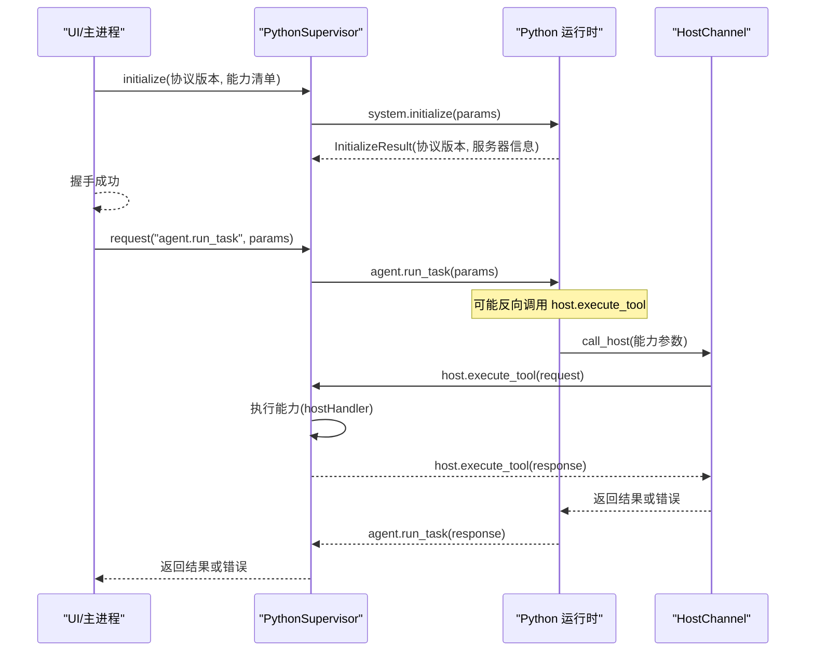
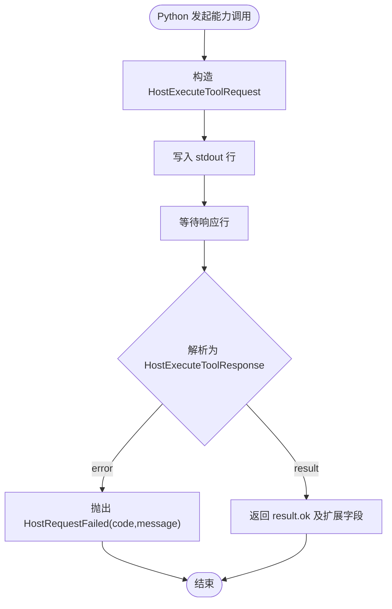
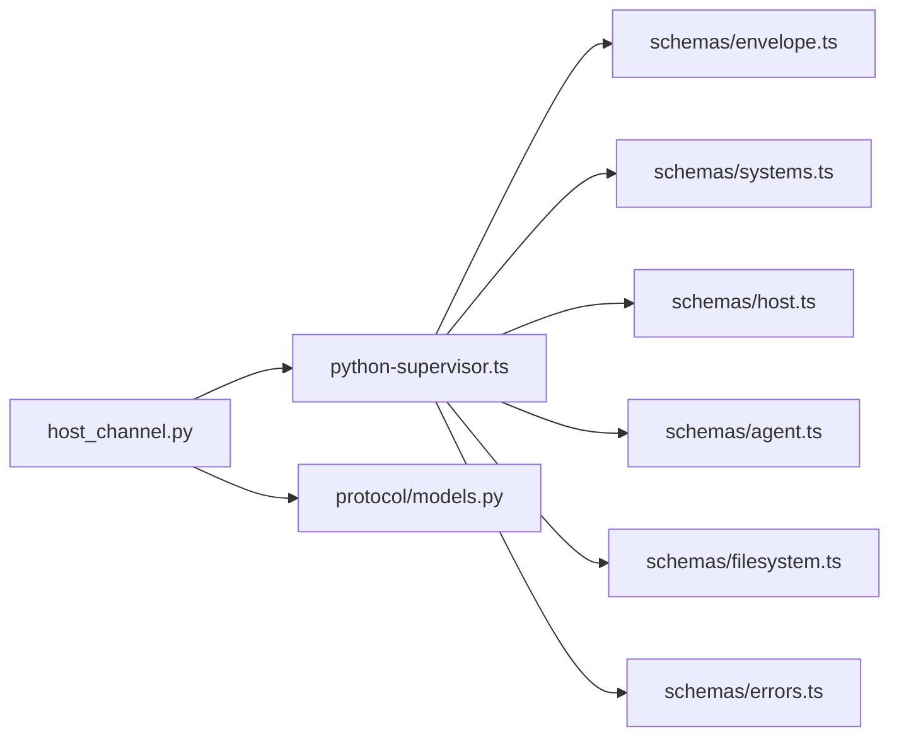

# API 协议

<cite>
**本文引用的文件**
- [packages/protocol/schemas/envelope.ts](file://packages/protocol/schemas/envelope.ts)
- [packages/protocol/schemas/errors.ts](file://packages/protocol/schemas/errors.ts)
- [packages/protocol/schemas/systems.ts](file://packages/protocol/schemas/systems.ts)
- [packages/protocol/schemas/host.ts](file://packages/protocol/schemas/host.ts)
- [packages/protocol/schemas/filesystem.ts](file://packages/protocol/schemas/filesystem.ts)
- [packages/protocol/schemas/agent.ts](file://packages/protocol/schemas/agent.ts)
- [packages/protocol/fixtures/initialize.request.json](file://packages/protocol/fixtures/initialize.request.json)
- [packages/protocol/fixtures/initialize.response.json](file://packages/protocol/fixtures/initialize.response.json)
- [packages/protocol/fixtures/agent-run-task.request.json](file://packages/protocol/fixtures/agent-run-task.request.json)
- [packages/protocol/tests/envelope.test.ts](file://packages/protocol/tests/envelope.test.ts)
- [apps/desktop/src/main/runtime/python-supervisor.ts](file://apps/desktop/src/main/runtime/python-supervisor.ts)
- [apps/desktop/src/main/runtime/timeouts.ts](file://apps/desktop/src/main/runtime/timeouts.ts)
- [services/agent-runtime/src/personal_agent/protocol/models.py](file://services/agent-runtime/src/personal_agent/protocol/models.py)
- [services/agent-runtime/src/personal_agent/host_channel.py](file://services/agent-runtime/src/personal_agent/host_channel.py)
- [apps/desktop/src/shared/ipc-contract.ts](file://apps/desktop/src/shared/ipc-contract.ts)
</cite>

## 目录
1. [简介](#简介)
2. [项目结构](#项目结构)
3. [核心组件](#核心组件)
4. [架构总览](#架构总览)
5. [详细组件分析](#详细组件分析)
6. [依赖关系分析](#依赖关系分析)
7. [性能与超时](#性能与超时)
8. [故障排查指南](#故障排查指南)
9. [结论](#结论)
10. [附录：API 调用示例与测试方法](#附录api-调用示例与测试方法)

## 简介
本文件面向个人代理项目的 IPC 通信协议，系统性说明 JSON-RPC 2.0 消息格式、错误码体系、版本协商与兼容性策略、前后端数据契约（TypeScript Zod 与 Python Pydantic 模型），以及前端 Electron Main 进程与 Python Agent Runtime 之间的双向 RPC 流程。文档同时给出请求/响应示例路径、错误处理与调试建议，帮助读者快速理解并正确使用该协议。

## 项目结构
协议定义集中在 packages/protocol 的 schemas 与 fixtures 中；Electron Main 通过 PythonSupervisor 管理 Python 子进程，使用行式 JSON-RPC 进行通信；Python 侧在 services/agent-runtime 中实现 host 能力通道与业务方法。共享类型在 apps/desktop/src/shared 暴露给 UI 与主进程。

```mermaid
graph TB
subgraph "Electron Main"
PS["PythonSupervisor"]
SC["共享类型 ipc-contract.ts"]
end
subgraph "协议包"
EN["envelope.ts"]
ER["errors.ts"]
SY["systems.ts"]
HO["host.ts"]
FS["filesystem.ts"]
AG["agent.ts"]
end
subgraph "Python 运行时"
PM["models.py"]
HC["host_channel.py"]
end
PS --> EN
PS --> SY
PS --> HO
PS --> AG
PS --> FS
PS --> ER
PS ---|JSON-RPC 行式传输| --> HC
HC --> PM
SC -.-> PS
```

图表来源
- [apps/desktop/src/main/runtime/python-supervisor.ts:1-126](file://apps/desktop/src/main/runtime/python-supervisor.ts#L1-L126)
- [packages/protocol/schemas/envelope.ts:1-41](file://packages/protocol/schemas/envelope.ts#L1-L41)
- [packages/protocol/schemas/systems.ts:1-21](file://packages/protocol/schemas/systems.ts#L1-L21)
- [packages/protocol/schemas/host.ts:1-76](file://packages/protocol/schemas/host.ts#L1-L76)
- [packages/protocol/schemas/filesystem.ts:1-71](file://packages/protocol/schemas/filesystem.ts#L1-L71)
- [packages/protocol/schemas/agent.ts:1-138](file://packages/protocol/schemas/agent.ts#L1-L138)
- [services/agent-runtime/src/personal_agent/protocol/models.py:1-368](file://services/agent-runtime/src/personal_agent/protocol/models.py#L1-L368)
- [services/agent-runtime/src/personal_agent/host_channel.py:1-91](file://services/agent-runtime/src/personal_agent/host_channel.py#L1-L91)
- [apps/desktop/src/shared/ipc-contract.ts:1-75](file://apps/desktop/src/shared/ipc-contract.ts#L1-L75)

章节来源
- [packages/protocol/schemas/index.ts:1-8](file://packages/protocol/schemas/index.ts#L1-L8)
- [packages/protocol/package.json:1-16](file://packages/protocol/package.json#L1-L16)

## 核心组件
- JSON-RPC 信封：统一的 jsonrpc、id、method、params/result/error 结构，强制 result 与 error 互斥。
- 系统握手：system.initialize 用于版本协商与能力声明。
- 主机能力通道：host.execute_tool 由 Python 主动发起，TS 侧执行具体能力（filesystem.list、document.extract_pdf、filesystem.create_dir、filesystem.move、scheduler.create 等）。
- Agent 方法：agent.run_task、agent.make_plan 由 TS 触发 Python 执行任务或生成计划。
- 错误码：集中定义于 errors.ts，贯穿各层。
- 数据契约：TS 使用 Zod，Python 使用 Pydantic，两端严格对齐字段与约束。

章节来源
- [packages/protocol/schemas/envelope.ts:1-41](file://packages/protocol/schemas/envelope.ts#L1-L41)
- [packages/protocol/schemas/systems.ts:1-21](file://packages/protocol/schemas/systems.ts#L1-L21)
- [packages/protocol/schemas/host.ts:1-76](file://packages/protocol/schemas/host.ts#L1-L76)
- [packages/protocol/schemas/agent.ts:1-138](file://packages/protocol/schemas/agent.ts#L1-L138)
- [packages/protocol/schemas/filesystem.ts:1-71](file://packages/protocol/schemas/filesystem.ts#L1-L71)
- [packages/protocol/schemas/errors.ts:1-30](file://packages/protocol/schemas/errors.ts#L1-L30)

## 架构总览
协议基于 JSON-RPC 2.0，采用“行式 JSON”作为传输帧。Electron Main 通过 PythonSupervisor 启动 Python 子进程，建立 stdin/stdout 管道，发送/接收 JSON 行。握手阶段交换协议版本与能力列表；随后 TS 可调用 agent.* 方法，Python 可在需要时反向调用 host.execute_tool 请求 TS 执行受控能力。



图表来源
- [apps/desktop/src/main/runtime/python-supervisor.ts:128-200](file://apps/desktop/src/main/runtime/python-supervisor.ts#L128-L200)
- [services/agent-runtime/src/personal_agent/host_channel.py:45-85](file://services/agent-runtime/src/personal_agent/host_channel.py#L45-L85)
- [packages/protocol/schemas/systems.ts:1-21](file://packages/protocol/schemas/systems.ts#L1-L21)
- [packages/protocol/schemas/agent.ts:105-138](file://packages/protocol/schemas/agent.ts#L105-L138)
- [packages/protocol/schemas/host.ts:28-67](file://packages/protocol/schemas/host.ts#L28-L67)

## 详细组件分析

### JSON-RPC 信封与消息格式
- 请求：包含 jsonrpc="2.0"、非空 id、符合命名规范的 method、任意 params。
- 响应：result 与 error 二选一，error 包含 code、message、可选 data。
- 通知：无 id 的消息，仅含 method 与 params。
- 方法名规范：小写字母开头，允许分段标识符，如 agent.run_task、host.execute_tool。

章节来源
- [packages/protocol/schemas/envelope.ts:1-41](file://packages/protocol/schemas/envelope.ts#L1-L41)

### 系统握手与版本管理
- 客户端在 initialize 中声明 protocolVersion 与 capabilities，服务端返回自身信息与确认的版本。
- 当前协议版本为常量字符串，两端均校验一致性。
- 兼容性策略：新增字段应向后兼容；破坏性变更需升级协议版本并拒绝旧版本握手。

章节来源
- [packages/protocol/schemas/systems.ts:1-21](file://packages/protocol/schemas/systems.ts#L1-L21)
- [services/agent-runtime/src/personal_agent/protocol/models.py:253-261](file://services/agent-runtime/src/personal_agent/protocol/models.py#L253-L261)

### 主机能力通道（host.execute_tool）
- Python 侧通过 HostChannel 向 TS 发起能力调用，携带 capability 与 arguments。
- TS 侧通过 PythonSupervisor 的 hostHandler 执行能力，并以 JSON-RPC 响应回传 ok 或错误。
- 能力白名单与描述在 schemas/host.ts 中定义，确保最小权限与可审计性。
- 文件系统相关参数与结果在 schemas/filesystem.ts 中定义，包括列出、创建目录、移动等。



图表来源
- [services/agent-runtime/src/personal_agent/host_channel.py:45-85](file://services/agent-runtime/src/personal_agent/host_channel.py#L45-L85)
- [packages/protocol/schemas/host.ts:28-67](file://packages/protocol/schemas/host.ts#L28-L67)
- [apps/desktop/src/main/runtime/python-supervisor.ts:258-314](file://apps/desktop/src/main/runtime/python-supervisor.ts#L258-L314)

章节来源
- [packages/protocol/schemas/host.ts:1-76](file://packages/protocol/schemas/host.ts#L1-L76)
- [packages/protocol/schemas/filesystem.ts:1-71](file://packages/protocol/schemas/filesystem.ts#L1-L71)
- [services/agent-runtime/src/personal_agent/host_channel.py:1-91](file://services/agent-runtime/src/personal_agent/host_channel.py#L1-L91)
- [apps/desktop/src/main/runtime/python-supervisor.ts:258-314](file://apps/desktop/src/main/runtime/python-supervisor.ts#L258-L314)

### Agent 方法：run_task 与 make_plan
- agent.run_task：TS 触发 Python 执行任务，返回完成或失败的结果，包含事件流与摘要事实。
- agent.make_plan：TS 请求 Python 生成计划步骤，至少一步，每步可选 capability。
- 两类方法的请求/响应 envelope 与 payload 均在 schemas/agent.ts 中严格定义。

章节来源
- [packages/protocol/schemas/agent.ts:1-138](file://packages/protocol/schemas/agent.ts#L1-L138)
- [services/agent-runtime/src/personal_agent/protocol/models.py:264-368](file://services/agent-runtime/src/personal_agent/protocol/models.py#L264-L368)

### 错误处理与错误码
- 统一错误码枚举位于 errors.ts，涵盖协议、主机、权限、路径、文件系统、目录创建/移动、Reminder 调度等场景（当前共 28 个错误码）。
- 响应中的 error.code 必须来自该枚举，便于上层统一处理。
- Python 侧对 host 响应错误会封装为 HostRequestFailed，携带 code 与 message。

章节来源
- [packages/protocol/schemas/errors.ts:1-30](file://packages/protocol/schemas/errors.ts#L1-L30)
- [services/agent-runtime/src/personal_agent/host_channel.py:22-34](file://services/agent-runtime/src/personal_agent/host_channel.py#L22-L34)

### 前后端数据契约（TypeScript 与 Python）
- TS 侧使用 Zod 定义请求/响应与领域模型，并在测试中用 fixtures 验证合法性。
- Python 侧使用 Pydantic 模型，字段名与约束与 TS 保持一致，必要时通过 exclude_none 控制 null 序列化。
- 共享类型在 ipc-contract.ts 中导出，供 UI 与主进程消费。

章节来源
- [packages/protocol/tests/envelope.test.ts:1-655](file://packages/protocol/tests/envelope.test.ts#L1-L655)
- [services/agent-runtime/src/personal_agent/protocol/models.py:1-368](file://services/agent-runtime/src/personal_agent/protocol/models.py#L1-L368)
- [apps/desktop/src/shared/ipc-contract.ts:1-75](file://apps/desktop/src/shared/ipc-contract.ts#L1-L75)

## 依赖关系分析
- PythonSupervisor 依赖协议包的 schemas 与错误码，负责生命周期管理与超时控制。
- HostChannel 依赖 models.py 的请求/响应模型，负责与 TS 的双向通信。
- 测试用例通过 fixtures 校验 schema 的一致性，防止漂移。



图表来源
- [apps/desktop/src/main/runtime/python-supervisor.ts:1-126](file://apps/desktop/src/main/runtime/python-supervisor.ts#L1-L126)
- [services/agent-runtime/src/personal_agent/host_channel.py:1-91](file://services/agent-runtime/src/personal_agent/host_channel.py#L1-L91)
- [packages/protocol/schemas/envelope.ts:1-41](file://packages/protocol/schemas/envelope.ts#L1-L41)
- [packages/protocol/schemas/systems.ts:1-21](file://packages/protocol/schemas/systems.ts#L1-L21)
- [packages/protocol/schemas/host.ts:1-76](file://packages/protocol/schemas/host.ts#L1-L76)
- [packages/protocol/schemas/agent.ts:1-138](file://packages/protocol/schemas/agent.ts#L1-L138)
- [packages/protocol/schemas/filesystem.ts:1-71](file://packages/protocol/schemas/filesystem.ts#L1-L71)
- [packages/protocol/schemas/errors.ts:1-30](file://packages/protocol/schemas/errors.ts#L1-L30)

章节来源
- [packages/protocol/tests/envelope.test.ts:298-328](file://packages/protocol/tests/envelope.test.ts#L298-L328)

## 性能与超时
- 单次 host.execute_tool 超时：HOST_TOOL_TIMEOUT_MS = PERMISSION_TTL_MS + 余量，避免用户批准窗口过期。
- 任务级超时：RUN_TASK_TIMEOUT_MS = 最大工具调用次数 × HOST_TOOL_TIMEOUT_MS + 模型余量。
- PythonSupervisor 在 request 中维护 pending Map，支持超时与取消信号，崩溃时批量拒绝未决请求。

章节来源
- [apps/desktop/src/main/runtime/timeouts.ts:1-17](file://apps/desktop/src/main/runtime/timeouts.ts#L1-L17)
- [apps/desktop/src/main/runtime/python-supervisor.ts:156-200](file://apps/desktop/src/main/runtime/python-supervisor.ts#L156-L200)
- [apps/desktop/src/main/runtime/python-supervisor.ts:332-354](file://apps/desktop/src/main/runtime/python-supervisor.ts#L332-L354)

## 故障排查指南
- 常见错误码：
  - PROTOCOL_INVALID_JSON / PROTOCOL_INVALID_REQUEST：消息格式不合法。
  - METHOD_NOT_FOUND / NOT_IMPLEMENTED：方法未注册或未实现。
  - HOST_HANDLER_FAILED / HOST_TIMEOUT：主机能力执行失败或超时。
  - PERMISSION_*：权限相关错误（缺失、拒绝、过期、篡改）。
  - FILESYSTEM_*：路径越界、UNC 不允许、文件不可读、PDF 提取失败等。
  - CREATE_DIR_FAILED / MOVE_SOURCE_MISSING / MOVE_TARGET_EXISTS / MOVE_FAILED：目录创建与文件移动失败。
  - REMINDER_TIME_IN_PAST / REMINDER_ALREADY_EXISTS / SCHEDULER_CREATE_FAILED：Reminder 时间在过去、同任务重复创建、落库失败。
- 调试技巧：
  - 监听 stderr 输出，查看 supervisor 日志与非法 JSON 提示。
  - 使用 fixtures 与 schema 测试验证消息形状。
  - 检查协议版本与能力清单是否一致。
  - 关注时间戳格式与字段约束（如 occurredAt 的毫秒与时区）。

章节来源
- [packages/protocol/schemas/errors.ts:1-30](file://packages/protocol/schemas/errors.ts#L1-L30)
- [apps/desktop/src/main/runtime/python-supervisor.ts:224-256](file://apps/desktop/src/main/runtime/python-supervisor.ts#L224-L256)
- [packages/protocol/tests/envelope.test.ts:270-296](file://packages/protocol/tests/envelope.test.ts#L270-L296)

## 结论
本协议以 JSON-RPC 2.0 为基础，通过严格的 schema 与模型约束保障前后端一致性；通过版本协商与能力白名单实现最小权限与可控扩展；通过集中错误码与超时机制提升稳定性与可观测性。配合完善的 fixtures 与测试，可有效防止协议漂移与回归问题。

## 附录：API 调用示例与测试方法

### 初始化握手
- 请求示例路径：[initialize.request.json](file://packages/protocol/fixtures/initialize.request.json)
- 响应示例路径：[initialize.response.json](file://packages/protocol/fixtures/initialize.response.json)
- 调用流程：Main 调用 initialize，传入协议版本与能力清单；Python 返回服务器信息与确认版本。

章节来源
- [packages/protocol/fixtures/initialize.request.json:1-22](file://packages/protocol/fixtures/initialize.request.json#L1-L22)
- [packages/protocol/fixtures/initialize.response.json:1-5](file://packages/protocol/fixtures/initialize.response.json#L1-L5)
- [apps/desktop/src/main/runtime/python-supervisor.ts:128-153](file://apps/desktop/src/main/runtime/python-supervisor.ts#L128-L153)

### 运行任务（agent.run_task）
- 请求示例路径：[agent-run-task.request.json](file://packages/protocol/fixtures/agent-run-task.request.json)
- 响应示例路径：参考测试中对 completed/failed 分支的断言与 fixture 校验。
- 调用流程：Main 发起 run_task；Python 执行任务，可能反向调用 host.execute_tool；最终返回完成或失败结果与事件。

章节来源
- [packages/protocol/fixtures/agent-run-task.request.json:1-10](file://packages/protocol/fixtures/agent-run-task.request.json#L1-L10)
- [packages/protocol/tests/envelope.test.ts:233-253](file://packages/protocol/tests/envelope.test.ts#L233-L253)
- [packages/protocol/schemas/agent.ts:105-138](file://packages/protocol/schemas/agent.ts#L105-L138)

### 主机能力调用（host.execute_tool）
- 请求/响应示例路径：
  - [host-execute-tool.request.json](file://packages/protocol/fixtures/host-execute-tool.request.json)
  - [host-execute-tool.response.json](file://packages/protocol/fixtures/host-execute-tool.response.json)
  - [host-execute-tool.failure.response.json](file://packages/protocol/fixtures/host-execute-tool.failure.response.json)
- 调用流程：Python 发起能力调用；TS 执行对应能力并返回 ok 或错误；Python 将结果写入 timeline 或继续任务流程。

章节来源
- [packages/protocol/schemas/host.ts:28-67](file://packages/protocol/schemas/host.ts#L28-L67)
- [services/agent-runtime/src/personal_agent/host_channel.py:45-85](file://services/agent-runtime/src/personal_agent/host_channel.py#L45-L85)
- [apps/desktop/src/main/runtime/python-supervisor.ts:258-314](file://apps/desktop/src/main/runtime/python-supervisor.ts#L258-L314)

### 协议测试方法
- 使用 fixtures 与 schema 测试验证合法/非法消息。
- 重点覆盖：
  - Envelope 的 result/error 互斥约束。
  - 方法名字面量与参数约束。
  - 能力白名单与描述必填。
  - 时间戳格式与页码约束。
  - host 请求/响应与 envelope 的包含关系。

章节来源
- [packages/protocol/tests/envelope.test.ts:1-655](file://packages/protocol/tests/envelope.test.ts#L1-L655)

### 调试技巧
- 观察 stderr 输出，定位非法 JSON 与超时报错。
- 检查 pending 请求是否被正确 settle，避免泄漏。
- 核对协议版本与能力清单，确保握手成功。
- 使用最小化 fixture 复现问题，逐步缩小范围。

章节来源
- [apps/desktop/src/main/runtime/python-supervisor.ts:224-256](file://apps/desktop/src/main/runtime/python-supervisor.ts#L224-L256)
- [apps/desktop/src/main/runtime/python-supervisor.ts:332-354](file://apps/desktop/src/main/runtime/python-supervisor.ts#L332-L354)