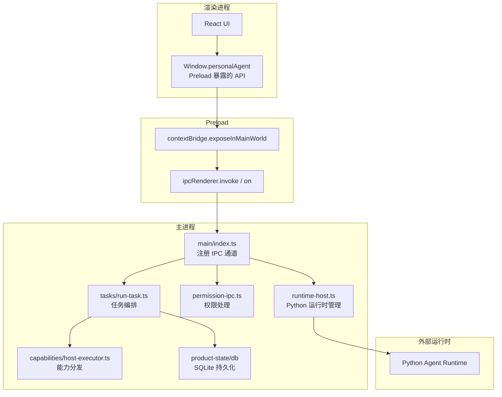
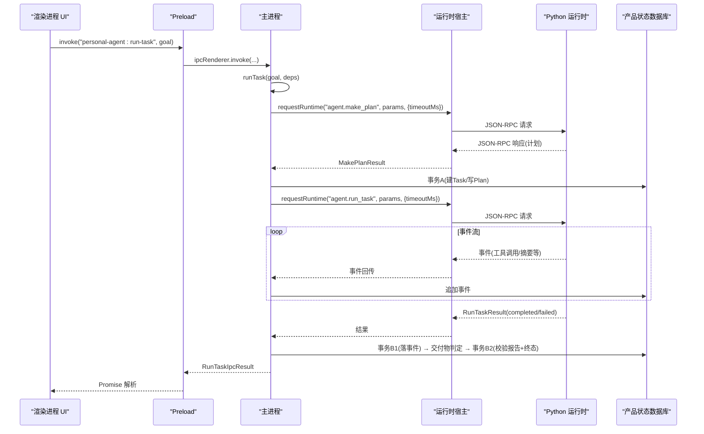
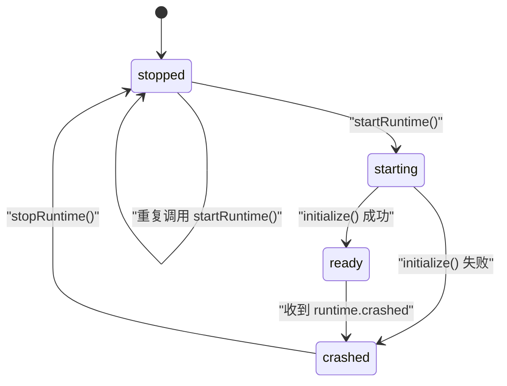
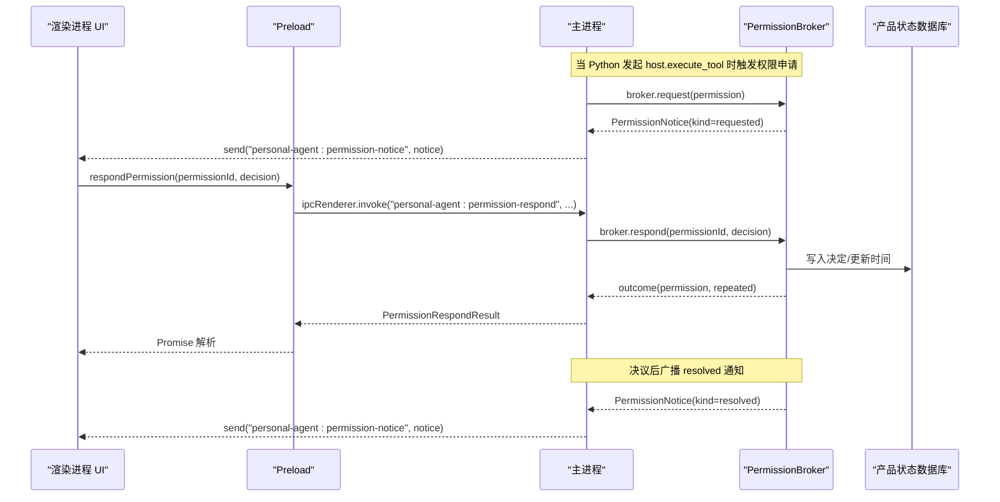
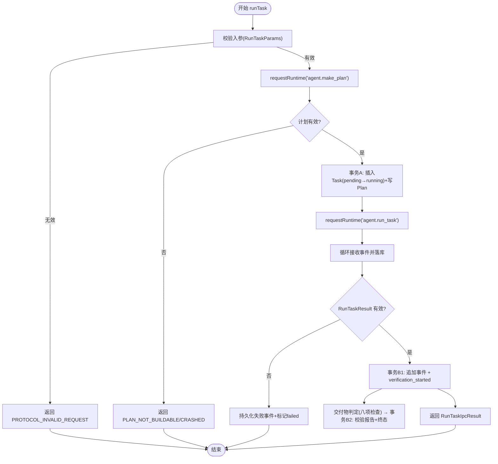
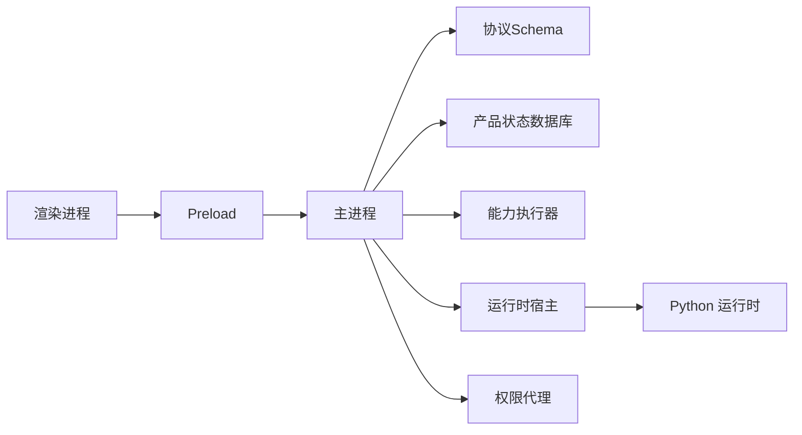

# IPC 通信协议

<cite>
**本文引用的文件**
- [apps/desktop/src/shared/ipc-contract.ts](file://apps/desktop/src/shared/ipc-contract.ts)
- [apps/desktop/src/preload/index.ts](file://apps/desktop/src/preload/index.ts)
- [apps/desktop/src/preload/index.d.ts](file://apps/desktop/src/preload/index.d.ts)
- [apps/desktop/src/main/index.ts](file://apps/desktop/src/main/index.ts)
- [apps/desktop/src/main/runtime/runtime-host.ts](file://apps/desktop/src/main/runtime/runtime-host.ts)
- [apps/desktop/src/main/permission/permission-ipc.ts](file://apps/desktop/src/main/permission/permission-ipc.ts)
- [apps/desktop/src/main/tasks/run-task.ts](file://apps/desktop/src/main/tasks/run-task.ts)
- [packages/protocol/schemas/envelope.ts](file://packages/protocol/schemas/envelope.ts)
- [packages/protocol/schemas/host.ts](file://packages/protocol/schemas/host.ts)
- [packages/protocol/schemas/agent.ts](file://packages/protocol/schemas/agent.ts)
- [packages/protocol/schemas/errors.ts](file://packages/protocol/schemas/errors.ts)
- [apps/desktop/src/shared/domain.ts](file://apps/desktop/src/shared/domain.ts)
</cite>

## 目录
1. [简介](#简介)
2. [项目结构](#项目结构)
3. [核心组件](#核心组件)
4. [架构总览](#架构总览)
5. [详细组件分析](#详细组件分析)
6. [依赖关系分析](#依赖关系分析)
7. [性能考量](#性能考量)
8. [故障排查指南](#故障排查指南)
9. [结论](#结论)
10. [附录：IPC 调用示例与调试技巧](#附录ipc-调用示例与调试技巧)

## 简介
本文件面向 Electron 主进程与渲染进程之间的 IPC 通信协议，覆盖消息格式、事件类型、错误码体系、运行时状态管理、权限通知与决策流程、任务执行生命周期，以及具体的 IPC 调用示例和调试方法。该协议基于 JSON-RPC 2.0 信封，结合 Zod 模式校验，确保跨进程数据契约稳定可靠。

## 项目结构
- 共享契约层：定义 IPC 返回类型、错误码联合、领域模型等，供主进程与渲染进程共同引用。
- Preload 桥接层：通过 contextBridge 暴露安全的 API 给渲染进程，封装 ipcRenderer.invoke/on。
- 主进程入口：注册所有 IPC 通道，协调数据库、能力执行器、权限代理、运行时宿主等。
- 协议包：集中定义 JSON-RPC 信封、系统方法（host.execute_tool）、Agent 方法（make_plan、run_task）及错误码。

图表来源
- [apps/desktop/src/preload/index.ts:1-51](file://apps/desktop/src/preload/index.ts#L1-L51)
- [apps/desktop/src/main/index.ts:108-327](file://apps/desktop/src/main/index.ts#L108-L327)
- [apps/desktop/src/main/runtime/runtime-host.ts:15-141](file://apps/desktop/src/main/runtime/runtime-host.ts#L15-L141)
- [apps/desktop/src/main/tasks/run-task.ts:105-341](file://apps/desktop/src/main/tasks/run-task.ts#L105-L341)
- [packages/protocol/schemas/envelope.ts:1-41](file://packages/protocol/schemas/envelope.ts#L1-L41)

章节来源
- [apps/desktop/src/shared/ipc-contract.ts:24-75](file://apps/desktop/src/shared/ipc-contract.ts#L24-L75)
- [apps/desktop/src/preload/index.ts:1-51](file://apps/desktop/src/preload/index.ts#L1-L51)
- [apps/desktop/src/main/index.ts:108-327](file://apps/desktop/src/main/index.ts#L108-L327)

## 核心组件
- 共享契约与类型：统一 IPC 返回结构、错误码联合、领域对象（任务、计划、权限等）。
- Preload 安全桥：仅暴露必要 API，屏蔽底层 ipcRenderer 细节，提供订阅取消函数。
- 主进程 IPC 路由：将渲染进程请求路由到具体业务模块（运行时、权限、任务、能力执行）。
- 运行时宿主：启动/停止 Python 子进程，维护运行状态，透传 host.execute_tool 调用。
- 权限代理：负责权限申请、用户决策、过期投影、广播通知。
- 任务编排：创建任务、生成计划、执行 agent.run_task、落库事件、同步结果。

章节来源
- [apps/desktop/src/shared/ipc-contract.ts:24-75](file://apps/desktop/src/shared/ipc-contract.ts#L24-L75)
- [apps/desktop/src/preload/index.d.ts:33-57](file://apps/desktop/src/preload/index.d.ts#L33-L57)
- [apps/desktop/src/main/index.ts:134-323](file://apps/desktop/src/main/index.ts#L134-L323)
- [apps/desktop/src/main/runtime/runtime-host.ts:83-153](file://apps/desktop/src/main/runtime/runtime-host.ts#L83-L153)
- [apps/desktop/src/main/permission/permission-ipc.ts:44-83](file://apps/desktop/src/main/permission/permission-ipc.ts#L44-L83)
- [apps/desktop/src/main/tasks/run-task.ts:105-341](file://apps/desktop/src/main/tasks/run-task.ts#L105-L341)

## 架构总览
IPC 通信遵循 JSON-RPC 2.0 信封，使用 Zod 进行严格校验；主进程作为网关，将渲染进程请求转发至运行时或本地能力，并通过 SQLite 持久化关键状态。权限通知采用主进程主动推送（on），其余为请求-响应（invoke）。

图表来源
- [apps/desktop/src/main/tasks/run-task.ts:100-222](file://apps/desktop/src/main/tasks/run-task.ts#L100-L222)
- [apps/desktop/src/main/runtime/runtime-host.ts:144-153](file://apps/desktop/src/main/runtime/runtime-host.ts#L144-L153)
- [packages/protocol/schemas/agent.ts:105-138](file://packages/protocol/schemas/agent.ts#L105-L138)

## 详细组件分析

### 运行时状态管理（启动/就绪/崩溃）
- 状态枚举：stopped、starting、ready、crashed。
- 启动流程：检查运行时命令是否存在（按布局解析：PERSONAL_AGENT_RUNTIME 覆盖 / 打包冻结产物 / 仓库 venv） → 创建 PythonSupervisor → 监听崩溃事件 → initialize 成功后置 ready。
- 崩溃处理：收到 runtime.crashed 事件后设置 crashed 并记录 detail；初始化失败也进入 crashed。
- 查询接口：渲染进程通过 runtimeStatus 获取当前状态与详情。状态不是一次性的——Main 侧从 starting 走到 ready/crashed 是异步的（打包版要先把冻结产物拉起来），渲染层在 starting 期间每秒轮询、到终态停表，否则状态栏会永远停在「运行时启动中」（TASK-029 修的）。

图表来源
- [apps/desktop/src/main/runtime/runtime-host.ts:87-141](file://apps/desktop/src/main/runtime/runtime-host.ts#L87-L141)
- [apps/desktop/src/main/index.ts:134-134](file://apps/desktop/src/main/index.ts#L134-L134)

章节来源
- [apps/desktop/src/main/runtime/runtime-host.ts:83-153](file://apps/desktop/src/main/runtime/runtime-host.ts#L83-L153)
- [apps/desktop/src/main/index.ts:134-134](file://apps/desktop/src/main/index.ts#L134-L134)

### 权限通知与决策流程
- 通知通道：主进程向所有窗口广播 personal-agent:permission-notice，包含 requested/resolved 两类通知。
- 决策通道：渲染进程通过 respondPermission 提交 approved/denied，主进程校验参数并交由 broker.respond。
- 列表通道：listPermissions 按任务列出权限记录，状态含 expired 投影。
- 错误映射：broker 返回的协议错误码映射为 IpcErrorCode，未知码降级为 DB_FAILED。

图表来源
- [apps/desktop/src/main/index.ts:35-54](file://apps/desktop/src/main/index.ts#L35-L54)
- [apps/desktop/src/main/permission/permission-ipc.ts:44-83](file://apps/desktop/src/main/permission/permission-ipc.ts#L44-L83)
- [apps/desktop/src/preload/index.ts:29-45](file://apps/desktop/src/preload/index.ts#L29-L45)

章节来源
- [apps/desktop/src/main/index.ts:35-54](file://apps/desktop/src/main/index.ts#L35-L54)
- [apps/desktop/src/main/permission/permission-ipc.ts:1-84](file://apps/desktop/src/main/permission/permission-ipc.ts#L1-L84)
- [apps/desktop/src/preload/index.ts:29-45](file://apps/desktop/src/preload/index.ts#L29-L45)

### 任务执行生命周期管理
- 创建与计划：先调用 agent.make_plan 获取步骤，再在事务中创建 Task 并写入 Plan。
- 执行监控：调用 agent.run_task，期间持续接收事件并落库。
- 结果同步：RunTaskResult 的 completed 只是 Agent 侧声明——先落事件（B1，状态仍在 running），再由交付物闸口按计划推导的必需交付物判定，通过才翻 completed（B2）；失败与校验拒绝都返回统一 IPC 结果。
- 并发控制：单槽设计，避免多任务并发导致对齐基准错乱。

图表来源
- [apps/desktop/src/main/tasks/run-task.ts:105-341](file://apps/desktop/src/main/tasks/run-task.ts#L105-L341)
- [packages/protocol/schemas/agent.ts:7-35](file://packages/protocol/schemas/agent.ts#L7-L35)
- [packages/protocol/schemas/agent.ts:62-138](file://packages/protocol/schemas/agent.ts#L62-L138)

章节来源
- [apps/desktop/src/main/tasks/run-task.ts:105-341](file://apps/desktop/src/main/tasks/run-task.ts#L105-L341)

### 消息格式与事件类型
- 信封：JSON-RPC 2.0，包含 jsonrpc、id、method、params；响应包含 result 或 error（二者互斥）。
- 方法命名：小写字母开头，支持点分隔层级，如 host.execute_tool、agent.make_plan、agent.run_task。
- 事件类型：执行事件由 Python 侧产生，包含 type、payload、occurredAt；主进程将其持久化并按 seq 排序。
- 权限通知：kind 为 requested 或 resolved，分别携带权限记录或决议后的状态投影。

章节来源
- [packages/protocol/schemas/envelope.ts:1-41](file://packages/protocol/schemas/envelope.ts#L1-L41)
- [packages/protocol/schemas/host.ts:1-76](file://packages/protocol/schemas/host.ts#L1-L76)
- [packages/protocol/schemas/agent.ts:62-138](file://packages/protocol/schemas/agent.ts#L62-L138)
- [apps/desktop/src/shared/domain.ts:86-95](file://apps/desktop/src/shared/domain.ts#L86-L95)

### 错误处理与错误码
- 协议错误：来自 packages/protocol/schemas/errors.ts，如 PROTOCOL_INVALID_REQUEST、PERMISSION_REQUIRED 等。
- 运行时错误：RUNTIME_ERROR_CODE，涵盖未启动、超时、崩溃、响应无效、计划无效、任务忙等。
- 映射策略：未知错误码统一降级为 CRASHED 或 DB_FAILED，保证 UI 可识别且安全。
- 返回值：所有 IPC 返回统一为 ok 联合类型，便于渲染进程一致处理成功与失败分支。

章节来源
- [packages/protocol/schemas/errors.ts:1-30](file://packages/protocol/schemas/errors.ts#L1-L30)
- [apps/desktop/src/main/runtime/error-code.ts:1-18](file://apps/desktop/src/main/runtime/error-code.ts#L1-L18)
- [apps/desktop/src/main/tasks/run-task.ts:25-37](file://apps/desktop/src/main/tasks/run-task.ts#L25-L37)
- [apps/desktop/src/main/permission/permission-ipc.ts:17-32](file://apps/desktop/src/main/permission/permission-ipc.ts#L17-L32)

## 依赖关系分析
- 渲染进程依赖 Preload 暴露的 Window.personalAgent API。
- Preload 依赖 electron 的 contextBridge 与 ipcRenderer。
- 主进程依赖 protocol 包的 schema 进行请求/响应校验，依赖 product-state 数据库进行持久化。
- 任务编排依赖运行时宿主发送 JSON-RPC 请求，依赖能力执行器处理 host.execute_tool。
- 权限模块依赖 PermissionBroker 与数据库，负责状态投影与广播。

图表来源
- [apps/desktop/src/preload/index.ts:1-51](file://apps/desktop/src/preload/index.ts#L1-L51)
- [apps/desktop/src/main/index.ts:134-323](file://apps/desktop/src/main/index.ts#L134-L323)
- [packages/protocol/schemas/index.ts:1-8](file://packages/protocol/schemas/index.ts#L1-L8)

章节来源
- [apps/desktop/src/preload/index.ts:1-51](file://apps/desktop/src/preload/index.ts#L1-L51)
- [apps/desktop/src/main/index.ts:134-323](file://apps/desktop/src/main/index.ts#L134-L323)
- [packages/protocol/schemas/index.ts:1-8](file://packages/protocol/schemas/index.ts#L1-L8)

## 性能考量
- 超时控制：make_plan 使用较短超时以避免长时间无反馈；run_task 使用较长超时以容纳完整 Agent Loop。
- 事务边界：建计划与执行结果落库分属两个事务，减少锁竞争与回滚范围。
- 单槽并发：避免多任务并发导致的对齐基准错乱，简化状态机复杂度。
- 只读通道：list-tasks、get-timeline 不写库，降低主线程阻塞风险。

[本节为通用指导，无需特定文件引用]

## 故障排查指南
- 运行时未启动：检查 运行时命令路径与存在性；确认 startRuntime 已调用且未重复 spawn。
- 计划构建失败：查看 make_plan 超时与错误码，必要时增加日志定位 Python 侧问题。
- 权限通道不可用：确认 product-state 数据库已打开；若 broker 构造失败，批准通道不可用。
- 数据库失败：捕获 RUNTIME_DB_FAILED，检查 SQLite 连接与事务异常。
- 响应无效：核对 Python 返回结构与 Zod 模式，确保字段齐全且类型正确。

章节来源
- [apps/desktop/src/main/runtime/runtime-host.ts:87-129](file://apps/desktop/src/main/runtime/runtime-host.ts#L87-L129)
- [apps/desktop/src/main/index.ts:124-131](file://apps/desktop/src/main/index.ts#L124-L131)
- [apps/desktop/src/main/tasks/run-task.ts:104-122](file://apps/desktop/src/main/tasks/run-task.ts#L104-L122)
- [apps/desktop/src/main/tasks/run-task.ts:190-217](file://apps/desktop/src/main/tasks/run-task.ts#L190-L217)

## 结论
本 IPC 协议以 JSON-RPC 2.0 为基础，结合严格的 Schema 校验与统一的错误码体系，实现了主进程与渲染进程之间清晰、可追溯的消息传递。通过权限代理与任务编排，应用能够安全地协调外部运行时与本地资源，并提供稳定的状态管理与事件通知机制。建议在生产环境中完善日志与监控，持续优化超时与事务边界，以提升整体稳定性与用户体验。

[本节为总结性内容，无需特定文件引用]

## 附录：IPC 调用示例与调试技巧

### 渲染进程调用示例
- 查询运行时状态：调用 Window.personalAgent.runtimeStatus()，返回 RuntimeStatus。
- 列出 PDF：调用 listPdfs('downloads')，返回 ListPdfsResult。
- 运行任务：调用 runTask(goal)，返回 RunTaskIpcResult；随后可通过 getTimeline(taskId) 拉取时间线。
- 权限操作：订阅 onPermissionNotice 接收 requested/resolved 通知；调用 respondPermission 提交决策；调用 listPermissions 查看记录。

章节来源
- [apps/desktop/src/preload/index.d.ts:39-57](file://apps/desktop/src/preload/index.d.ts#L39-L57)
- [apps/desktop/src/preload/index.ts:11-45](file://apps/desktop/src/preload/index.ts#L11-L45)

### 主进程 IPC 通道清单
- personal-agent:runtime-status：返回运行时状态。
- personal-agent:list-pdfs：列出指定根目录下的 PDF。
- personal-agent:indexed-pdfs：返回已索引的 PDF 列表。
- personal-agent:list-tasks：返回历史任务列表。
- personal-agent:run-task：启动任务编排。
- personal-agent:get-timeline：返回任务时间线。
- personal-agent:permission-respond：提交权限决策。
- personal-agent:list-permissions：列出任务的权限记录。
- personal-agent:permission-notice：主进程推送权限通知。

章节来源
- [apps/desktop/src/main/index.ts:134-323](file://apps/desktop/src/main/index.ts#L134-L323)

### 调试技巧
- 启用开发日志：运行时 stderr 输出在开发模式下打印到控制台，便于定位 Python 侧问题。
- 使用 DevTools：在 BrowserWindow 中开启开发者工具，观察网络与 Console。
- 断点与日志：在主进程 IPC handler 处设置断点，检查入参与返回值。
- 数据库快照：在事务前后导出 SQLite 快照，对比状态变化。
- 协议校验：利用 Zod 的错误信息快速定位字段缺失或类型不匹配。

章节来源
- [apps/desktop/src/main/runtime/runtime-host.ts:148-152](file://apps/desktop/src/main/runtime/runtime-host.ts#L148-L152)
- [apps/desktop/src/main/index.ts:56-90](file://apps/desktop/src/main/index.ts#L56-L90)