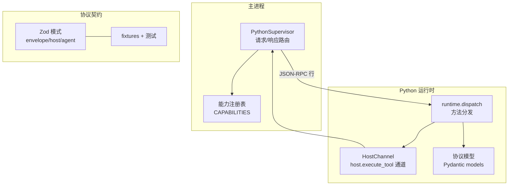
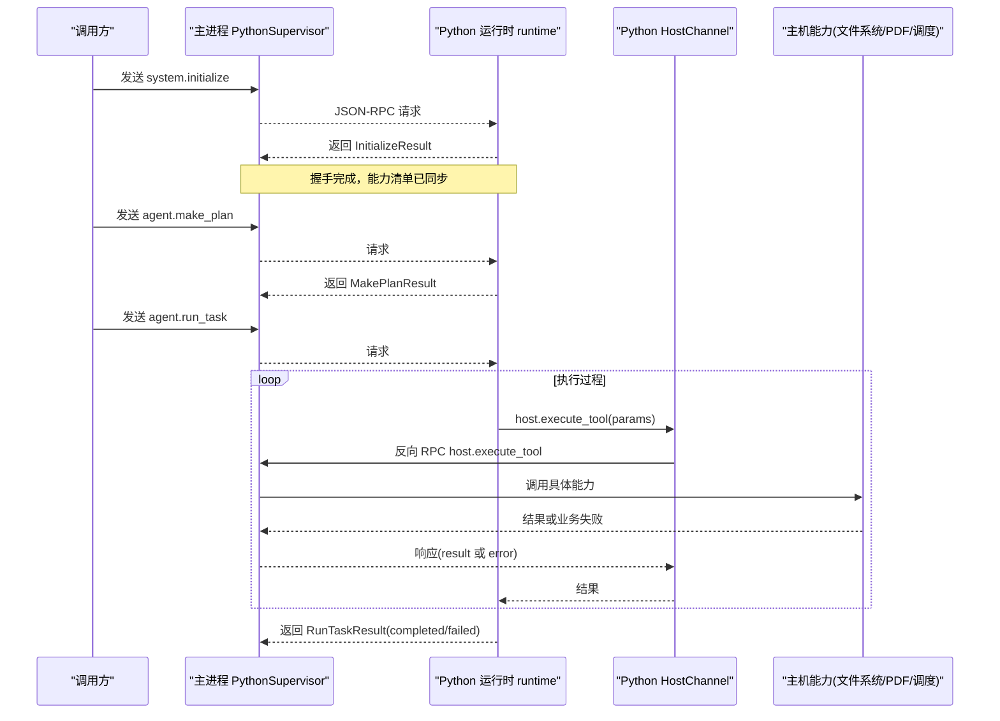
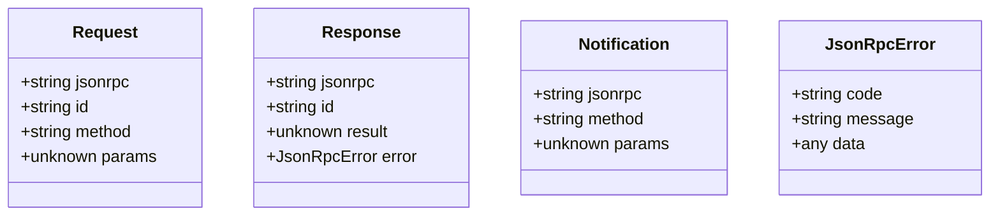
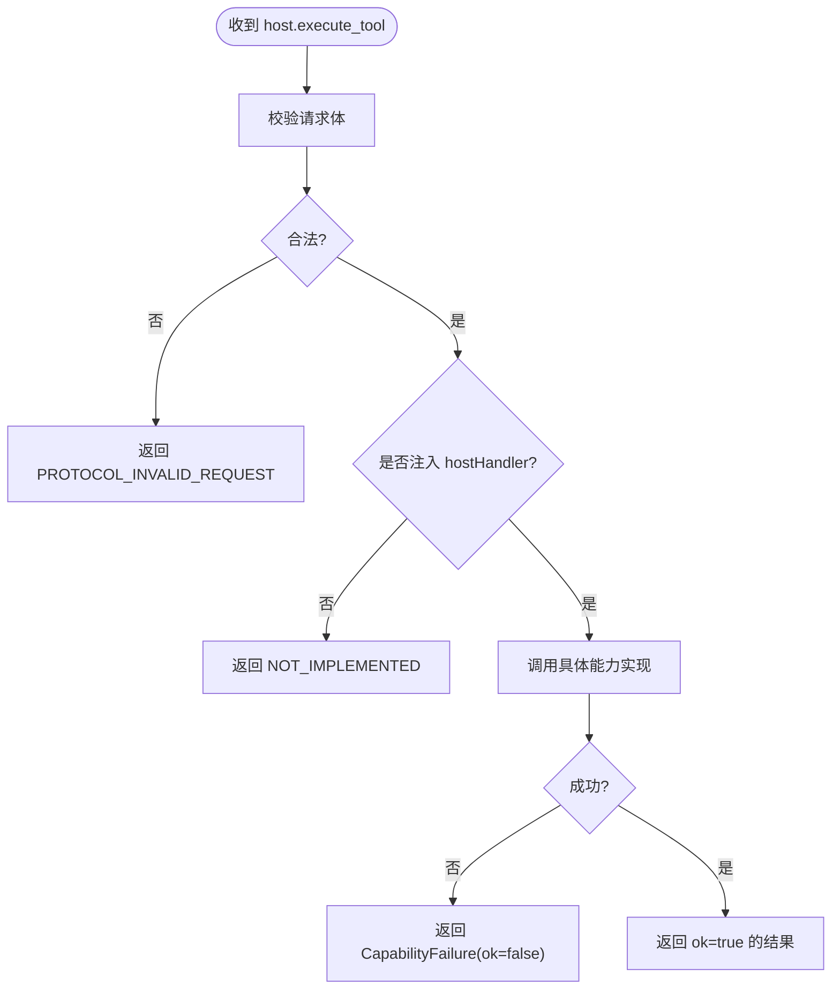
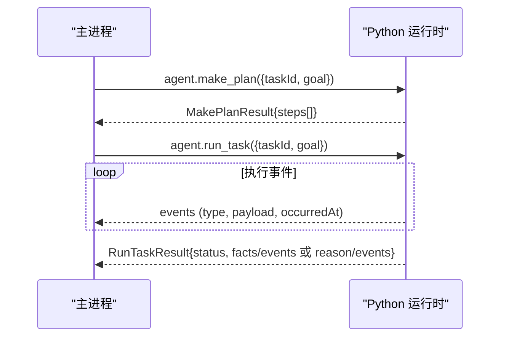
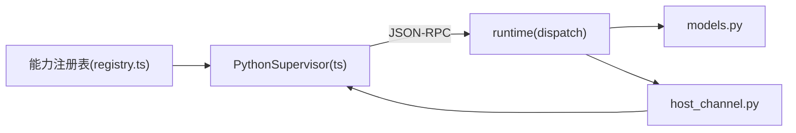

# JSON-RPC 协议

<cite>
**本文引用的文件**
- [packages/protocol/schemas/envelope.ts](file://packages/protocol/schemas/envelope.ts)
- [packages/protocol/schemas/host.ts](file://packages/protocol/schemas/host.ts)
- [packages/protocol/schemas/agent.ts](file://packages/protocol/schemas/agent.ts)
- [packages/protocol/schemas/errors.ts](file://packages/protocol/schemas/errors.ts)
- [services/agent-runtime/src/personal_agent/protocol/models.py](file://services/agent-runtime/src/personal_agent/protocol/models.py)
- [services/agent-runtime/src/personal_agent/runtime.py](file://services/agent-runtime/src/personal_agent/runtime.py)
- [services/agent-runtime/src/personal_agent/host_channel.py](file://services/agent-runtime/src/personal_agent/host_channel.py)
- [apps/desktop/src/main/runtime/python-supervisor.ts](file://apps/desktop/src/main/runtime/python-supervisor.ts)
- [apps/desktop/src/main/capabilities/registry.ts](file://apps/desktop/src/main/capabilities/registry.ts)
- [apps/desktop/src/main/runtime/error-code.ts](file://apps/desktop/src/main/runtime/error-code.ts)
- [packages/protocol/fixtures/initialize.request.json](file://packages/protocol/fixtures/initialize.request.json)
- [packages/protocol/fixtures/initialize.response.json](file://packages/protocol/fixtures/initialize.response.json)
- [packages/protocol/fixtures/ping.request.json](file://packages/protocol/fixtures/ping.request.json)
- [packages/protocol/fixtures/ping.response.json](file://packages/protocol/fixtures/ping.response.json)
- [packages/protocol/fixtures/host-execute-tool.request.json](file://packages/protocol/fixtures/host-execute-tool.request.json)
- [packages/protocol/fixtures/host-filesystem-list.request.json](file://packages/protocol/fixtures/host-filesystem-list.request.json)
- [packages/protocol/fixtures/host-filesystem-list.response.json](file://packages/protocol/fixtures/host-filesystem-list.response.json)
- [packages/protocol/fixtures/agent-run-task.request.json](file://packages/protocol/fixtures/agent-run-task.request.json)
- [packages/protocol/fixtures/agent-make-plan.response.json](file://packages/protocol/fixtures/agent-make-plan.response.json)
- [packages/protocol/tests/envelope.test.ts](file://packages/protocol/tests/envelope.test.ts)
</cite>

## 目录
1. [简介](#简介)
2. [项目结构](#项目结构)
3. [核心组件](#核心组件)
4. [架构总览](#架构总览)
5. [详细组件分析](#详细组件分析)
6. [依赖关系分析](#依赖关系分析)
7. [性能考虑](#性能考虑)
8. [故障排查指南](#故障排查指南)
9. [结论](#结论)
10. [附录：请求与响应示例](#附录请求与响应示例)

## 简介
本文件为个人代理项目中主进程（Electron Main）与 Python 运行时之间的 JSON-RPC 通信协议文档。协议基于 JSON-RPC 2.0，采用行式管道传输，定义了系统初始化、任务规划、任务执行以及主机能力调用等核心方法；同时明确了消息信封格式、错误码体系、异常处理机制，并给出完整的请求/响应示例与测试方法、性能优化建议。

## 项目结构
- 协议契约层（TypeScript）：位于 packages/protocol，使用 Zod 定义信封、主机能力、Agent 方法与错误码，并提供大量 fixture 与单元测试，确保两端契约一致。
- Python 运行时：位于 services/agent-runtime，使用 Pydantic 镜像 TS 侧模型，提供调度器、计划生成、引擎执行、主机通道封装等。
- 主进程侧：位于 apps/desktop/src/main，通过 PythonSupervisor 管理子进程生命周期、请求路由、反向 RPC host.execute_tool 的转发与超时控制。

**图表来源**
- [apps/desktop/src/main/runtime/python-supervisor.ts:97-342](file://apps/desktop/src/main/runtime/python-supervisor.ts#L97-L342)
- [services/agent-runtime/src/personal_agent/runtime.py:69-184](file://services/agent-runtime/src/personal_agent/runtime.py#L69-L184)
- [services/agent-runtime/src/personal_agent/host_channel.py:36-90](file://services/agent-runtime/src/personal_agent/host_channel.py#L36-L90)
- [packages/protocol/schemas/envelope.ts:5-40](file://packages/protocol/schemas/envelope.ts#L5-L40)
- [packages/protocol/schemas/host.ts:3-76](file://packages/protocol/schemas/host.ts#L3-L76)
- [packages/protocol/schemas/agent.ts:4-138](file://packages/protocol/schemas/agent.ts#L4-L138)
- [apps/desktop/src/main/capabilities/registry.ts:9-55](file://apps/desktop/src/main/capabilities/registry.ts#L9-L55)

**章节来源**
- [packages/protocol/schemas/envelope.ts:5-40](file://packages/protocol/schemas/envelope.ts#L5-L40)
- [packages/protocol/schemas/host.ts:3-76](file://packages/protocol/schemas/host.ts#L3-L76)
- [packages/protocol/schemas/agent.ts:4-138](file://packages/protocol/schemas/agent.ts#L4-L138)
- [services/agent-runtime/src/personal_agent/runtime.py:69-184](file://services/agent-runtime/src/personal_agent/runtime.py#L69-L184)
- [apps/desktop/src/main/runtime/python-supervisor.ts:97-342](file://apps/desktop/src/main/runtime/python-supervisor.ts#L97-L342)

## 核心组件
- 消息信封：统一的 JSON-RPC 2.0 请求/响应/通知结构，强制 result 与 error 互斥。
- 主机能力接口：以 host.execute_tool 统一承载文件系统、PDF 提取、Reminder 调度等能力。
- Agent 方法：system.initialize/system.ping、agent.make_plan、agent.run_task。
- 运行时调度：Python 侧 dispatch 将方法路由到具体处理器；TS 侧 supervisor 负责进程管理、超时、取消、崩溃恢复。
- 错误码体系：协议级错误、运行时错误、能力失败三类，分别由不同模块维护。

**章节来源**
- [packages/protocol/schemas/envelope.ts:5-40](file://packages/protocol/schemas/envelope.ts#L5-L40)
- [packages/protocol/schemas/host.ts:3-76](file://packages/protocol/schemas/host.ts#L3-L76)
- [packages/protocol/schemas/agent.ts:4-138](file://packages/protocol/schemas/agent.ts#L4-L138)
- [services/agent-runtime/src/personal_agent/runtime.py:69-184](file://services/agent-runtime/src/personal_agent/runtime.py#L69-L184)
- [apps/desktop/src/main/runtime/python-supervisor.ts:97-342](file://apps/desktop/src/main/runtime/python-supervisor.ts#L97-L342)
- [packages/protocol/schemas/errors.ts:1-30](file://packages/protocol/schemas/errors.ts#L1-L30)
- [apps/desktop/src/main/runtime/error-code.ts:1-18](file://apps/desktop/src/main/runtime/error-code.ts#L1-L18)

## 架构总览
主进程通过 PythonSupervisor 启动 Python 子进程，双方以 JSON-RPC 行协议通信。初始化阶段交换能力清单与版本信息；任务阶段由主进程发起 agent.make_plan 与 agent.run_task；执行过程中 Python 侧通过 host.execute_tool 反向调用主进程能力（如文件系统、PDF 提取），主进程将结果回传给 Python。

**图表来源**
- [apps/desktop/src/main/runtime/python-supervisor.ts:123-147](file://apps/desktop/src/main/runtime/python-supervisor.ts#L123-L147)
- [apps/desktop/src/main/runtime/python-supervisor.ts:244-300](file://apps/desktop/src/main/runtime/python-supervisor.ts#L244-L300)
- [services/agent-runtime/src/personal_agent/runtime.py:109-184](file://services/agent-runtime/src/personal_agent/runtime.py#L109-L184)
- [services/agent-runtime/src/personal_agent/host_channel.py:45-85](file://services/agent-runtime/src/personal_agent/host_channel.py#L45-L85)

## 详细组件分析

### 消息信封与协议基础
- 请求/响应/通知均遵循 JSON-RPC 2.0，method 命名规范为小写字母开头、分段点号分隔。
- Response 必须包含 result 或 error 之一，且不能同时存在；Notification 无 id。
- 所有字段在 TS 与 Python 两侧均有强类型校验，确保契约一致性。

**图表来源**
- [packages/protocol/schemas/envelope.ts:5-40](file://packages/protocol/schemas/envelope.ts#L5-L40)
- [services/agent-runtime/src/personal_agent/protocol/models.py:8-38](file://services/agent-runtime/src/personal_agent/protocol/models.py#L8-L38)

**章节来源**
- [packages/protocol/schemas/envelope.ts:5-40](file://packages/protocol/schemas/envelope.ts#L5-L40)
- [services/agent-runtime/src/personal_agent/protocol/models.py:8-38](file://services/agent-runtime/src/personal_agent/protocol/models.py#L8-L38)

### 主机能力接口：host.execute_tool
- 能力白名单：filesystem.list、document.extract_pdf、filesystem.create_dir、filesystem.move、scheduler.create。
- 参数结构：callId、capability、arguments；返回值统一为 ok 布尔，业务失败通过 CapabilityFailure（ok=false, code, reason）表达。
- 主进程侧对 host.execute_tool 进行超时控制与错误包装，未注入 hostHandler 时返回 NOT_IMPLEMENTED。

**图表来源**
- [packages/protocol/schemas/host.ts:3-76](file://packages/protocol/schemas/host.ts#L3-L76)
- [apps/desktop/src/main/runtime/python-supervisor.ts:244-300](file://apps/desktop/src/main/runtime/python-supervisor.ts#L244-L300)
- [services/agent-runtime/src/personal_agent/host_channel.py:45-85](file://services/agent-runtime/src/personal_agent/host_channel.py#L45-L85)

**章节来源**
- [packages/protocol/schemas/host.ts:3-76](file://packages/protocol/schemas/host.ts#L3-L76)
- [apps/desktop/src/main/runtime/python-supervisor.ts:244-300](file://apps/desktop/src/main/runtime/python-supervisor.ts#L244-L300)
- [services/agent-runtime/src/personal_agent/host_channel.py:45-85](file://services/agent-runtime/src/personal_agent/host_channel.py#L45-L85)

### Agent 方法：make_plan 与 run_task
- make_plan：根据目标 goal 与可见能力列表生成步骤计划，至少一步；步骤可省略 capability（表示无需工具）。
- run_task：执行任务，期间可能产生事件流 events；最终返回 completed（含 facts/events）或 failed（含 reason/events）。
- 时间戳约束：events.occurredAt 要求三位毫秒 + Z 后缀，严格匹配以避免跨端解析差异。

**图表来源**
- [packages/protocol/schemas/agent.ts:7-138](file://packages/protocol/schemas/agent.ts#L7-L138)
- [services/agent-runtime/src/personal_agent/protocol/models.py:264-368](file://services/agent-runtime/src/personal_agent/protocol/models.py#L264-L368)
- [services/agent-runtime/src/personal_agent/runtime.py:128-184](file://services/agent-runtime/src/personal_agent/runtime.py#L128-L184)

**章节来源**
- [packages/protocol/schemas/agent.ts:7-138](file://packages/protocol/schemas/agent.ts#L7-L138)
- [services/agent-runtime/src/personal_agent/protocol/models.py:264-368](file://services/agent-runtime/src/personal_agent/protocol/models.py#L264-L368)
- [services/agent-runtime/src/personal_agent/runtime.py:128-184](file://services/agent-runtime/src/personal_agent/runtime.py#L128-L184)

### 主机能力：文件系统与 PDF 处理
- 文件系统：list（只读）、create_dir（写）、move（写），参数通过 arguments 传递，结果按能力定义返回。
- PDF 提取：document.extract_pdf，返回每页文本与页码；若失败则返回 CapabilityFailure。
- 能力清单由主进程注册并在 initialize 时下发给 Python 运行时，用于计划与权限判定。

**章节来源**
- [packages/protocol/schemas/host.ts:3-76](file://packages/protocol/schemas/host.ts#L3-L76)
- [packages/protocol/fixtures/host-filesystem-list.request.json:1-13](file://packages/protocol/fixtures/host-filesystem-list.request.json#L1-L13)
- [packages/protocol/fixtures/host-filesystem-list.response.json:1-22](file://packages/protocol/fixtures/host-filesystem-list.response.json#L1-L22)
- [packages/protocol/fixtures/host-execute-tool.request.json:1-13](file://packages/protocol/fixtures/host-execute-tool.request.json#L1-L13)
- [apps/desktop/src/main/capabilities/registry.ts:9-55](file://apps/desktop/src/main/capabilities/registry.ts#L9-L55)

### 错误码体系与异常处理
- 协议级错误：PROTOCOL_INVALID_JSON、PROTOCOL_INVALID_REQUEST、METHOD_NOT_FOUND、NOT_IMPLEMENTED、HOST_TIMEOUT、HOST_HANDLER_FAILED 等（ERROR_CODE 枚举当前共 28 个）。
- 运行时错误：RUNTIME_* 系列（超时、取消、崩溃、握手失败、任务忙等）。
- 能力失败：CapabilityFailure（ok=false，code/reason），用于业务层面失败（如 PDF 损坏、CREATE_DIR_FAILED、MOVE_SOURCE_MISSING / MOVE_TARGET_EXISTS / MOVE_FAILED、REMINDER_TIME_IN_PAST / REMINDER_ALREADY_EXISTS、SCHEDULER_CREATE_FAILED）。
- 两端均对 result/error 互斥做强校验；Python 侧在 host 通道中遇到非法响应或子进程关闭会抛出明确异常。

**章节来源**
- [packages/protocol/schemas/errors.ts:1-30](file://packages/protocol/schemas/errors.ts#L1-L30)
- [apps/desktop/src/main/runtime/error-code.ts:1-18](file://apps/desktop/src/main/runtime/error-code.ts#L1-L18)
- [services/agent-runtime/src/personal_agent/host_channel.py:18-34](file://services/agent-runtime/src/personal_agent/host_channel.py#L18-L34)
- [services/agent-runtime/src/personal_agent/host_channel.py:74-85](file://services/agent-runtime/src/personal_agent/host_channel.py#L74-L85)
- [apps/desktop/src/main/runtime/python-supervisor.ts:244-300](file://apps/desktop/src/main/runtime/python-supervisor.ts#L244-L300)

### 协议测试方法
- 使用 fixtures 中的合法/非法样例，结合 Zod/Pydantic 模型进行双向校验，确保契约不漂移。
- 覆盖 envelope、host schema、agent schema 的边界条件（空串、缺失字段、非法枚举值、时间戳格式等）。
- 针对 host.execute_tool 的请求/响应、能力失败场景进行断言。

**章节来源**
- [packages/protocol/tests/envelope.test.ts:68-328](file://packages/protocol/tests/envelope.test.ts#L68-L328)
- [packages/protocol/tests/envelope.test.ts:330-655](file://packages/protocol/tests/envelope.test.ts#L330-L655)

## 依赖关系分析
- 主进程依赖 PythonSupervisor 管理子进程、请求路由与反向 RPC；能力注册表提供能力清单。
- Python 运行时依赖 protocol models 进行数据校验，runtime.dispatch 负责方法分发，host_channel 负责与主进程的 host.execute_tool 交互。
- 协议契约层被 TS 与 Python 两侧共同引用，保证 wire 格式一致。

**图表来源**
- [apps/desktop/src/main/capabilities/registry.ts:9-55](file://apps/desktop/src/main/capabilities/registry.ts#L9-L55)
- [apps/desktop/src/main/runtime/python-supervisor.ts:97-342](file://apps/desktop/src/main/runtime/python-supervisor.ts#L97-L342)
- [services/agent-runtime/src/personal_agent/runtime.py:69-184](file://services/agent-runtime/src/personal_agent/runtime.py#L69-L184)
- [services/agent-runtime/src/personal_agent/host_channel.py:36-90](file://services/agent-runtime/src/personal_agent/host_channel.py#L36-L90)

**章节来源**
- [apps/desktop/src/main/capabilities/registry.ts:9-55](file://apps/desktop/src/main/capabilities/registry.ts#L9-L55)
- [apps/desktop/src/main/runtime/python-supervisor.ts:97-342](file://apps/desktop/src/main/runtime/python-supervisor.ts#L97-L342)
- [services/agent-runtime/src/personal_agent/runtime.py:69-184](file://services/agent-runtime/src/personal_agent/runtime.py#L69-L184)
- [services/agent-runtime/src/personal_agent/host_channel.py:36-90](file://services/agent-runtime/src/personal_agent/host_channel.py#L36-L90)

## 性能考虑
- 超时与取消：主进程对所有请求设置默认超时，支持 AbortSignal 取消；host.execute_tool 单独超时控制，避免阻塞任务执行。
- 进程生命周期：子进程退出或崩溃时立即拒绝所有待处理请求，防止悬挂；优雅停止时写入 EOF 并等待退出。
- 资源复用：Python 侧每次 run_task 构造新的 ContextManager 与 Engine，避免状态污染；模型工厂按需创建，避免脚本游标复用问题。
- I/O 效率：行式协议逐行读取/写入，避免大块缓冲；主进程对 stdout 分块拼接后按行路由，减少解析开销。

[本节为通用指导，不直接分析具体文件]

## 故障排查指南
- 握手失败：检查 initialize 参数是否符合契约（协议版本、capabilities 数组、client 信息）。
- 方法未找到：确认 method 字面量与命名规范；未知方法返回 METHOD_NOT_FOUND。
- 主机能力不可用：确认已注入 hostHandler；未注入返回 NOT_IMPLEMENTED；能力不在白名单会被拒绝。
- 超时与取消：检查 defaultTimeoutMs 与 hostTimeoutMs 配置；AbortSignal 触发会返回 CANCELLED。
- 子进程崩溃：监听 runtime.crashed 事件；pending 请求将被统一拒绝。
- 协议校验失败：对照 envelope/host/agent schema 与 fixtures，定位字段缺失或类型不符。

**章节来源**
- [apps/desktop/src/main/runtime/python-supervisor.ts:123-147](file://apps/desktop/src/main/runtime/python-supervisor.ts#L123-L147)
- [apps/desktop/src/main/runtime/python-supervisor.ts:150-194](file://apps/desktop/src/main/runtime/python-supervisor.ts#L150-L194)
- [apps/desktop/src/main/runtime/python-supervisor.ts:244-300](file://apps/desktop/src/main/runtime/python-supervisor.ts#L244-L300)
- [services/agent-runtime/src/personal_agent/runtime.py:69-93](file://services/agent-runtime/src/personal_agent/runtime.py#L69-L93)
- [services/agent-runtime/src/personal_agent/host_channel.py:45-85](file://services/agent-runtime/src/personal_agent/host_channel.py#L45-L85)

## 结论
该 JSON-RPC 协议通过严格的类型契约与完善的错误码体系，实现了主进程与 Python 运行时的可靠通信。主机能力以统一入口暴露，便于扩展与维护；计划与执行分离，使任务流程可控、可观测。配合全面的测试与性能策略，可在生产环境中稳定运行。

[本节为总结性内容，不直接分析具体文件]

## 附录：请求与响应示例
以下为关键方法的完整请求/响应示例路径，可直接参考对应 fixture 文件验证协议格式。

- 系统初始化
  - 请求：[initialize.request.json:1-22](file://packages/protocol/fixtures/initialize.request.json#L1-L22)
  - 响应：[initialize.response.json:1-5](file://packages/protocol/fixtures/initialize.response.json#L1-L5)
- 心跳检测
  - 请求：[ping.request.json:1-6](file://packages/protocol/fixtures/ping.request.json#L1-L6)
  - 响应：[ping.response.json:1-5](file://packages/protocol/fixtures/ping.response.json#L1-L5)
- 主机能力：列出下载目录
  - 请求：[host-filesystem-list.request.json:1-13](file://packages/protocol/fixtures/host-filesystem-list.request.json#L1-L13)
  - 响应：[host-filesystem-list.response.json:1-22](file://packages/protocol/fixtures/host-filesystem-list.response.json#L1-L22)
- 主机能力：PDF 提取
  - 请求：[host-execute-tool.request.json:1-13](file://packages/protocol/fixtures/host-execute-tool.request.json#L1-L13)
  - 响应（成功/失败）：参见 host-execute-tool.response.json 与 host-execute-tool.failure.response.json（路径见 fixtures）
- Agent 任务
  - 请求：[agent-run-task.request.json:1-10](file://packages/protocol/fixtures/agent-run-task.request.json#L1-L10)
  - 计划响应：[agent-make-plan.response.json:1-20](file://packages/protocol/fixtures/agent-make-plan.response.json#L1-L20)

**章节来源**
- [packages/protocol/fixtures/initialize.request.json:1-22](file://packages/protocol/fixtures/initialize.request.json#L1-L22)
- [packages/protocol/fixtures/initialize.response.json:1-5](file://packages/protocol/fixtures/initialize.response.json#L1-L5)
- [packages/protocol/fixtures/ping.request.json:1-6](file://packages/protocol/fixtures/ping.request.json#L1-L6)
- [packages/protocol/fixtures/ping.response.json:1-5](file://packages/protocol/fixtures/ping.response.json#L1-L5)
- [packages/protocol/fixtures/host-filesystem-list.request.json:1-13](file://packages/protocol/fixtures/host-filesystem-list.request.json#L1-L13)
- [packages/protocol/fixtures/host-filesystem-list.response.json:1-22](file://packages/protocol/fixtures/host-filesystem-list.response.json#L1-L22)
- [packages/protocol/fixtures/host-execute-tool.request.json:1-13](file://packages/protocol/fixtures/host-execute-tool.request.json#L1-L13)
- [packages/protocol/fixtures/agent-run-task.request.json:1-10](file://packages/protocol/fixtures/agent-run-task.request.json#L1-L10)
- [packages/protocol/fixtures/agent-make-plan.response.json:1-20](file://packages/protocol/fixtures/agent-make-plan.response.json#L1-L20)