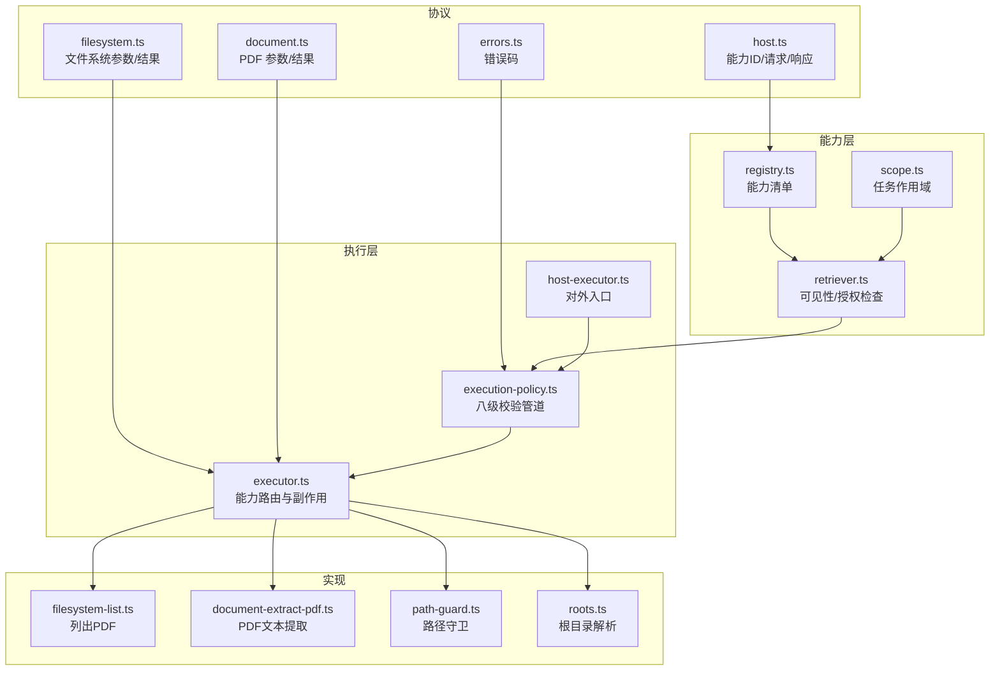
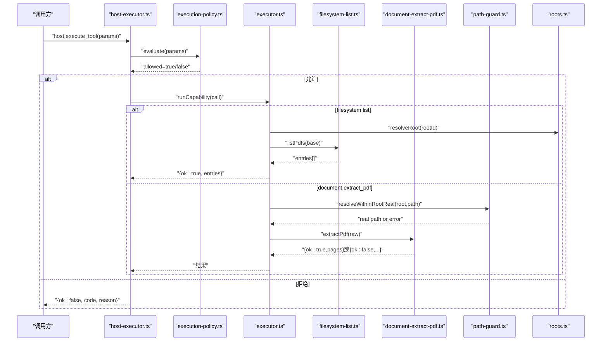
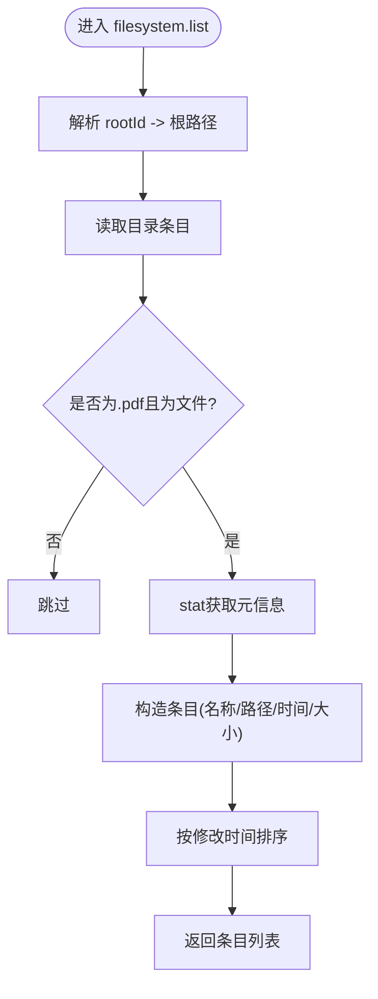
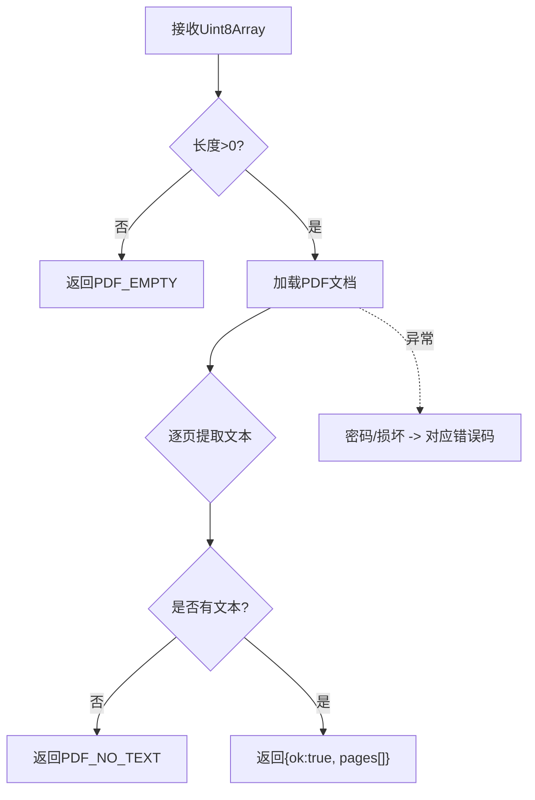
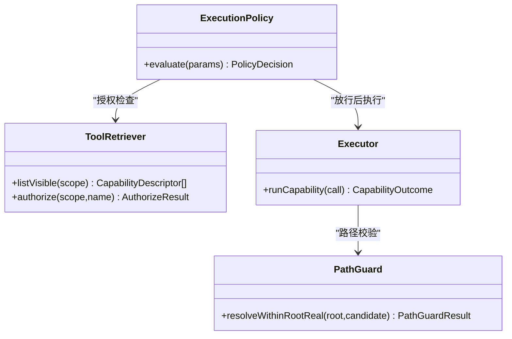
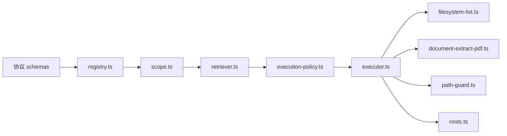

# 主机能力接口

<cite>
**本文引用的文件**
- [apps/desktop/src/main/capabilities/host-executor.ts](file://apps/desktop/src/main/capabilities/host-executor.ts)
- [apps/desktop/src/main/capabilities/executor.ts](file://apps/desktop/src/main/capabilities/executor.ts)
- [apps/desktop/src/main/capabilities/retriever.ts](file://apps/desktop/src/main/capabilities/retriever.ts)
- [apps/desktop/src/main/capabilities/registry.ts](file://apps/desktop/src/main/capabilities/registry.ts)
- [apps/desktop/src/main/capabilities/scope.ts](file://apps/desktop/src/main/capabilities/scope.ts)
- [apps/desktop/src/main/capabilities/filesystem-list.ts](file://apps/desktop/src/main/capabilities/filesystem-list.ts)
- [apps/desktop/src/main/capabilities/document-extract-pdf.ts](file://apps/desktop/src/main/capabilities/document-extract-pdf.ts)
- [apps/desktop/src/main/capabilities/path-guard.ts](file://apps/desktop/src/main/capabilities/path-guard.ts)
- [apps/desktop/src/main/capabilities/roots.ts](file://apps/desktop/src/main/capabilities/roots.ts)
- [packages/protocol/schemas/host.ts](file://packages/protocol/schemas/host.ts)
- [packages/protocol/schemas/filesystem.ts](file://packages/protocol/schemas/filesystem.ts)
- [packages/protocol/schemas/document.ts](file://packages/protocol/schemas/document.ts)
- [packages/protocol/schemas/errors.ts](file://packages/protocol/schemas/errors.ts)
- [apps/desktop/src/main/policy/execution-policy.ts](file://apps/desktop/src/main/policy/execution-policy.ts)
- [apps/desktop/src/main/policy/risk.ts](file://apps/desktop/src/main/policy/risk.ts)
</cite>

## 目录
1. [简介](#简介)
2. [项目结构](#项目结构)
3. [核心组件](#核心组件)
4. [架构总览](#架构总览)
5. [详细组件分析](#详细组件分析)
6. [依赖关系分析](#依赖关系分析)
7. [性能考虑](#性能考虑)
8. [故障排查指南](#故障排查指南)
9. [结论](#结论)
10. [附录：能力调用示例与最佳实践](#附录：能力调用示例与最佳实践)

## 简介
本文件面向“主机能力接口”，系统化说明主机暴露给代理（Agent）的能力集合，包括文件系统操作、PDF 文档处理与工具执行机制。重点覆盖：
- 文件系统能力：目录列表、创建子目录、移动文件等；
- PDF 处理能力：文档提取、索引构建思路、内容搜索建议；
- 工具执行机制：能力注册、参数校验、权限审批与结果返回；
- 安全与权限控制：作用域、路径守卫、风险分级与审批流；
- 完整调用示例与最佳实践。

## 项目结构
主机能力由“协议定义 + 能力注册 + 策略执行 + 具体实现”四层构成：
- 协议层：定义能力 ID、参数/结果契约、错误码与请求/响应格式；
- 注册与检索：集中声明可用能力，按任务作用域过滤可见能力；
- 策略执行：八级校验管道（注册/作用域/计划对齐/参数/路径/风险/权限/放行），统一入口；
- 具体实现：文件系统、PDF 提取等副作用逻辑。

图表来源
- [packages/protocol/schemas/host.ts:1-76](file://packages/protocol/schemas/host.ts#L1-L76)
- [packages/protocol/schemas/filesystem.ts:1-71](file://packages/protocol/schemas/filesystem.ts#L1-L71)
- [packages/protocol/schemas/document.ts:1-31](file://packages/protocol/schemas/document.ts#L1-L31)
- [packages/protocol/schemas/errors.ts:1-30](file://packages/protocol/schemas/errors.ts#L1-L30)
- [apps/desktop/src/main/capabilities/registry.ts:1-55](file://apps/desktop/src/main/capabilities/registry.ts#L1-L55)
- [apps/desktop/src/main/capabilities/scope.ts:1-43](file://apps/desktop/src/main/capabilities/scope.ts#L1-L43)
- [apps/desktop/src/main/capabilities/retriever.ts:1-49](file://apps/desktop/src/main/capabilities/retriever.ts#L1-L49)
- [apps/desktop/src/main/policy/execution-policy.ts:1-197](file://apps/desktop/src/main/policy/execution-policy.ts#L1-L197)
- [apps/desktop/src/main/capabilities/executor.ts:1-325](file://apps/desktop/src/main/capabilities/executor.ts#L1-L325)
- [apps/desktop/src/main/capabilities/host-executor.ts:1-118](file://apps/desktop/src/main/capabilities/host-executor.ts#L1-L118)
- [apps/desktop/src/main/capabilities/filesystem-list.ts:1-32](file://apps/desktop/src/main/capabilities/filesystem-list.ts#L1-L32)
- [apps/desktop/src/main/capabilities/document-extract-pdf.ts:1-69](file://apps/desktop/src/main/capabilities/document-extract-pdf.ts#L1-L69)
- [apps/desktop/src/main/capabilities/path-guard.ts:1-126](file://apps/desktop/src/main/capabilities/path-guard.ts#L1-L126)
- [apps/desktop/src/main/capabilities/roots.ts:1-27](file://apps/desktop/src/main/capabilities/roots.ts#L1-L27)

章节来源
- [apps/desktop/src/main/capabilities/host-executor.ts:1-118](file://apps/desktop/src/main/capabilities/host-executor.ts#L1-L118)
- [apps/desktop/src/main/capabilities/executor.ts:1-325](file://apps/desktop/src/main/capabilities/executor.ts#L1-L325)
- [apps/desktop/src/main/capabilities/retriever.ts:1-49](file://apps/desktop/src/main/capabilities/retriever.ts#L1-L49)
- [apps/desktop/src/main/capabilities/registry.ts:1-55](file://apps/desktop/src/main/capabilities/registry.ts#L1-L55)
- [apps/desktop/src/main/capabilities/scope.ts:1-43](file://apps/desktop/src/main/capabilities/scope.ts#L1-L43)
- [apps/desktop/src/main/capabilities/filesystem-list.ts:1-32](file://apps/desktop/src/main/capabilities/filesystem-list.ts#L1-L32)
- [apps/desktop/src/main/capabilities/document-extract-pdf.ts:1-69](file://apps/desktop/src/main/capabilities/document-extract-pdf.ts#L1-L69)
- [apps/desktop/src/main/capabilities/path-guard.ts:1-126](file://apps/desktop/src/main/capabilities/path-guard.ts#L1-L126)
- [apps/desktop/src/main/capabilities/roots.ts:1-27](file://apps/desktop/src/main/capabilities/roots.ts#L1-L27)
- [packages/protocol/schemas/host.ts:1-76](file://packages/protocol/schemas/host.ts#L1-L76)
- [packages/protocol/schemas/filesystem.ts:1-71](file://packages/protocol/schemas/filesystem.ts#L1-L71)
- [packages/protocol/schemas/document.ts:1-31](file://packages/protocol/schemas/document.ts#L1-L31)
- [packages/protocol/schemas/errors.ts:1-30](file://packages/protocol/schemas/errors.ts#L1-L30)
- [apps/desktop/src/main/policy/execution-policy.ts:1-197](file://apps/desktop/src/main/policy/execution-policy.ts#L1-L197)
- [apps/desktop/src/main/policy/risk.ts:1-22](file://apps/desktop/src/main/policy/risk.ts#L1-L22)

## 核心组件
- 能力注册表：集中声明所有可被调用的能力名称、类型（READ/WRITE）与描述，并提供按类型筛选与查找能力的方法。
- 任务作用域：限定每个任务可访问的能力集合，默认只允许 READ 能力，避免越权。
- 能力检索器：基于作用域过滤可见能力，并对调用进行“是否已注册、是否在作用域内”的授权检查。
- 执行策略：统一的八级校验管道，涵盖注册/作用域/计划对齐/参数/路径/风险/权限/放行，确保安全性与一致性。
- 能力执行器：将策略放行的调用路由到具体实现（如文件系统、PDF 提取），并封装成功/失败结果。
- 对外入口：提供两类入口——给 Python 代理的 host.execute_tool，以及给渲染进程的 IPC 网关（UI 起源）。

章节来源
- [apps/desktop/src/main/capabilities/registry.ts:1-55](file://apps/desktop/src/main/capabilities/registry.ts#L1-L55)
- [apps/desktop/src/main/capabilities/scope.ts:1-43](file://apps/desktop/src/main/capabilities/scope.ts#L1-L43)
- [apps/desktop/src/main/capabilities/retriever.ts:1-49](file://apps/desktop/src/main/capabilities/retriever.ts#L1-L49)
- [apps/desktop/src/main/policy/execution-policy.ts:1-197](file://apps/desktop/src/main/policy/execution-policy.ts#L1-L197)
- [apps/desktop/src/main/capabilities/executor.ts:1-325](file://apps/desktop/src/main/capabilities/executor.ts#L1-L325)
- [apps/desktop/src/main/capabilities/host-executor.ts:1-118](file://apps/desktop/src/main/capabilities/host-executor.ts#L1-L118)

## 架构总览
下图展示一次能力调用的端到端流程：从协议层入参校验，到策略层的八级校验，再到执行层的路由与副作用，最后返回统一的结果结构。

图表来源
- [apps/desktop/src/main/capabilities/host-executor.ts:1-118](file://apps/desktop/src/main/capabilities/host-executor.ts#L1-L118)
- [apps/desktop/src/main/policy/execution-policy.ts:1-197](file://apps/desktop/src/main/policy/execution-policy.ts#L1-L197)
- [apps/desktop/src/main/capabilities/executor.ts:1-325](file://apps/desktop/src/main/capabilities/executor.ts#L1-L325)
- [apps/desktop/src/main/capabilities/filesystem-list.ts:1-32](file://apps/desktop/src/main/capabilities/filesystem-list.ts#L1-L32)
- [apps/desktop/src/main/capabilities/document-extract-pdf.ts:1-69](file://apps/desktop/src/main/capabilities/document-extract-pdf.ts#L1-L69)
- [apps/desktop/src/main/capabilities/path-guard.ts:1-126](file://apps/desktop/src/main/capabilities/path-guard.ts#L1-L126)
- [apps/desktop/src/main/capabilities/roots.ts:1-27](file://apps/desktop/src/main/capabilities/roots.ts#L1-L27)

## 详细组件分析

### 能力注册与作用域
- 能力清单：集中声明了文件系统、PDF、调度、通知等能力，标注读写类型与描述。
- 作用域：默认只暴露 READ 能力，防止意外写入；可按需扩展 WRITE 能力的作用域。
- 检索器：负责“可见性”和“授权检查”，未注册或不在作用域内的能力会被拒绝。

章节来源
- [apps/desktop/src/main/capabilities/registry.ts:1-55](file://apps/desktop/src/main/capabilities/registry.ts#L1-L55)
- [apps/desktop/src/main/capabilities/scope.ts:1-43](file://apps/desktop/src/main/capabilities/scope.ts#L1-L43)
- [apps/desktop/src/main/capabilities/retriever.ts:1-49](file://apps/desktop/src/main/capabilities/retriever.ts#L1-L49)

### 文件系统能力
- 列出 PDF：扫描授权根目录下的 .pdf 文件，返回文件名、绝对路径、修改时间、大小，并按修改时间倒序排列。
- 创建目录：通过协议参数定义 path，结合路径守卫确保在授权根内创建。
- 移动文件：通过 source/target 参数移动文件，同样受路径守卫与权限审批约束。
- 根目录解析：支持环境变量覆盖默认下载目录，统一正斜杠路径表示。

图表来源
- [apps/desktop/src/main/capabilities/filesystem-list.ts:1-32](file://apps/desktop/src/main/capabilities/filesystem-list.ts#L1-L32)
- [apps/desktop/src/main/capabilities/roots.ts:1-27](file://apps/desktop/src/main/capabilities/roots.ts#L1-L27)

章节来源
- [apps/desktop/src/main/capabilities/filesystem-list.ts:1-32](file://apps/desktop/src/main/capabilities/filesystem-list.ts#L1-L32)
- [packages/protocol/schemas/filesystem.ts:1-71](file://packages/protocol/schemas/filesystem.ts#L1-L71)
- [apps/desktop/src/main/capabilities/roots.ts:1-27](file://apps/desktop/src/main/capabilities/roots.ts#L1-L27)

### PDF 文档处理能力
- 文档提取：读取二进制数据，使用 PDF 库逐页提取文本，返回页码与文本；对空文件、损坏、加密、无文本层等情况给出明确错误码。
- 索引构建（建议）：可将提取出的每页文本持久化至数据库或向量存储，建立页级索引以便后续检索。
- 内容搜索（建议）：在索引基础上实现关键词检索、语义检索或混合检索，返回命中页码与片段。

图表来源
- [apps/desktop/src/main/capabilities/document-extract-pdf.ts:1-69](file://apps/desktop/src/main/capabilities/document-extract-pdf.ts#L1-L69)
- [packages/protocol/schemas/document.ts:1-31](file://packages/protocol/schemas/document.ts#L1-L31)

章节来源
- [apps/desktop/src/main/capabilities/document-extract-pdf.ts:1-69](file://apps/desktop/src/main/capabilities/document-extract-pdf.ts#L1-L69)
- [packages/protocol/schemas/document.ts:1-31](file://packages/protocol/schemas/document.ts#L1-L31)

### 工具执行机制
- 能力注册：在注册表中声明能力名、类型与描述；协议层维护 CapabilityId 枚举。
- 参数验证：通过协议 schema 严格校验入参与出参，避免非法输入。
- 路径守卫：对涉及文件路径的操作进行根范围校验，防止链接逃逸与 UNC 路径。
- 风险与权限：WRITE 能力需要权限审批；审批前后更新任务状态，确保可观测性。
- 结果返回：统一以 { ok: true/false, ... } 的结构返回，失败时附带错误码与原因。

图表来源
- [apps/desktop/src/main/policy/execution-policy.ts:1-197](file://apps/desktop/src/main/policy/execution-policy.ts#L1-L197)
- [apps/desktop/src/main/capabilities/retriever.ts:1-49](file://apps/desktop/src/main/capabilities/retriever.ts#L1-L49)
- [apps/desktop/src/main/capabilities/executor.ts:1-325](file://apps/desktop/src/main/capabilities/executor.ts#L1-L325)
- [apps/desktop/src/main/capabilities/path-guard.ts:1-126](file://apps/desktop/src/main/capabilities/path-guard.ts#L1-L126)

章节来源
- [apps/desktop/src/main/policy/execution-policy.ts:1-197](file://apps/desktop/src/main/policy/execution-policy.ts#L1-L197)
- [apps/desktop/src/main/capabilities/executor.ts:1-325](file://apps/desktop/src/main/capabilities/executor.ts#L1-L325)
- [apps/desktop/src/main/capabilities/path-guard.ts:1-126](file://apps/desktop/src/main/capabilities/path-guard.ts#L1-L126)
- [packages/protocol/schemas/host.ts:1-76](file://packages/protocol/schemas/host.ts#L1-L76)

### 安全与权限控制
- 作用域隔离：每个任务仅能访问其作用域内的能力，默认只读。
- 计划对齐：Agent 发起的调用必须与当前任务计划一致，防止偏离计划的任意行为。
- 路径守卫：拒绝 UNC/设备路径，强制路径在授权根内，并对符号链接/联合点进行二次校验。
- 风险分级：WRITE 能力一律要求权限审批，审批通过后再次校验绑定参数的一致性。
- 错误码体系：统一错误码便于客户端定位问题，如权限不足、路径越界、文件不可读、PDF 解析失败等。

章节来源
- [apps/desktop/src/main/capabilities/scope.ts:1-43](file://apps/desktop/src/main/capabilities/scope.ts#L1-L43)
- [apps/desktop/src/main/policy/execution-policy.ts:1-197](file://apps/desktop/src/main/policy/execution-policy.ts#L1-L197)
- [apps/desktop/src/main/capabilities/path-guard.ts:1-126](file://apps/desktop/src/main/capabilities/path-guard.ts#L1-L126)
- [apps/desktop/src/main/policy/risk.ts:1-22](file://apps/desktop/src/main/policy/risk.ts#L1-L22)
- [packages/protocol/schemas/errors.ts:1-30](file://packages/protocol/schemas/errors.ts#L1-L30)

## 依赖关系分析
- 协议依赖：host.ts、filesystem.ts、document.ts、errors.ts 定义了跨进程通信的数据契约与错误码。
- 能力依赖：registry.ts 提供能力清单；scope.ts 与 retriever.ts 组合实现可见性与授权。
- 执行依赖：execution-policy.ts 串联各阶段校验；executor.ts 将策略结果路由到具体实现。
- 实现依赖：filesystem-list.ts、document-extract-pdf.ts 分别实现文件系统与 PDF 能力；path-guard.ts、roots.ts 提供路径与根目录支撑。

图表来源
- [packages/protocol/schemas/host.ts:1-76](file://packages/protocol/schemas/host.ts#L1-L76)
- [packages/protocol/schemas/filesystem.ts:1-71](file://packages/protocol/schemas/filesystem.ts#L1-L71)
- [packages/protocol/schemas/document.ts:1-31](file://packages/protocol/schemas/document.ts#L1-L31)
- [apps/desktop/src/main/capabilities/registry.ts:1-55](file://apps/desktop/src/main/capabilities/registry.ts#L1-L55)
- [apps/desktop/src/main/capabilities/scope.ts:1-43](file://apps/desktop/src/main/capabilities/scope.ts#L1-L43)
- [apps/desktop/src/main/capabilities/retriever.ts:1-49](file://apps/desktop/src/main/capabilities/retriever.ts#L1-L49)
- [apps/desktop/src/main/policy/execution-policy.ts:1-197](file://apps/desktop/src/main/policy/execution-policy.ts#L1-L197)
- [apps/desktop/src/main/capabilities/executor.ts:1-325](file://apps/desktop/src/main/capabilities/executor.ts#L1-L325)
- [apps/desktop/src/main/capabilities/filesystem-list.ts:1-32](file://apps/desktop/src/main/capabilities/filesystem-list.ts#L1-L32)
- [apps/desktop/src/main/capabilities/document-extract-pdf.ts:1-69](file://apps/desktop/src/main/capabilities/document-extract-pdf.ts#L1-L69)
- [apps/desktop/src/main/capabilities/path-guard.ts:1-126](file://apps/desktop/src/main/capabilities/path-guard.ts#L1-L126)
- [apps/desktop/src/main/capabilities/roots.ts:1-27](file://apps/desktop/src/main/capabilities/roots.ts#L1-L27)

## 性能考虑
- PDF 提取：逐页读取与文本提取可能耗时，建议在后台线程或异步队列中执行，避免阻塞主线程；对大文档可分页缓存与增量索引。
- 文件系统扫描：列出目录时先过滤后缀再 stat，减少不必要的元信息读取；对大量文件场景可考虑分批或惰性加载。
- 路径解析：splitExisting 会尝试多个祖先存在性判断，尽量复用 realpath 结果，避免重复系统调用。
- 资源释放：PDF 文档对象使用后及时销毁，避免内存泄漏。

[本节为通用性能建议，不直接分析具体文件]

## 故障排查指南
- 能力未注册或不在作用域：检查 registry.ts 是否包含该能力，scope.ts 是否允许；确认 retriever.authorize 返回的原因。
- 路径越界或链接逃逸：查看 path-guard.ts 的错误码 PATH_OUT_OF_ROOT、PATH_ESCAPES_ROOT_VIA_LINK、PATH_UNC_NOT_ALLOWED，确认授权根配置与目标路径。
- 文件不可读：FILE_UNREADABLE 通常由读取失败引起，检查文件权限与路径有效性。
- PDF 解析失败：区分 PDF_EMPTY、PDF_CORRUPT、PDF_ENCRYPTED、PDF_NO_TEXT，根据错误码采取相应处理（如提示用户解密、转为扫描件处理等）。
- 权限不足：PERMISSION_REQUIRED/PERMISSION_DENIED/PERMISSION_EXPIRED/PERMISSION_TAMPERED，检查权限审批流程与有效期。

章节来源
- [packages/protocol/schemas/errors.ts:1-30](file://packages/protocol/schemas/errors.ts#L1-L30)
- [apps/desktop/src/main/capabilities/path-guard.ts:1-126](file://apps/desktop/src/main/capabilities/path-guard.ts#L1-L126)
- [apps/desktop/src/main/capabilities/document-extract-pdf.ts:1-69](file://apps/desktop/src/main/capabilities/document-extract-pdf.ts#L1-L69)
- [apps/desktop/src/main/policy/execution-policy.ts:1-197](file://apps/desktop/src/main/policy/execution-policy.ts#L1-L197)

## 结论
主机能力接口通过“协议 + 注册 + 策略 + 实现”的分层设计，提供了安全可控的文件系统与 PDF 处理能力，并以严格的权限与路径守卫保障系统边界。对于更复杂的索引与搜索需求，可在现有提取能力之上构建持久化索引与检索服务。

[本节为总结性内容，不直接分析具体文件]

## 附录：能力调用示例与最佳实践

### 能力清单与类型
- 文件系统：
  - filesystem.list：列出授权根目录下的 PDF 条目（READ）
  - filesystem.create_dir：在授权根目录下创建子目录（WRITE）
  - filesystem.move：在授权根目录内移动文件（WRITE）
- 文档处理：
  - document.extract_pdf：提取 PDF 每页文本与页码（READ）
- 其他：
  - scheduler.create：创建提醒（WRITE）
  - notification.send：发送系统通知（WRITE）

章节来源
- [apps/desktop/src/main/capabilities/registry.ts:1-55](file://apps/desktop/src/main/capabilities/registry.ts#L1-L55)
- [packages/protocol/schemas/host.ts:1-76](file://packages/protocol/schemas/host.ts#L1-L76)

### 文件系统能力调用示例
- 列出 PDF
  - 方法：host.execute_tool
  - 能力：filesystem.list
  - 参数：rootId（例如 downloads）
  - 结果：{ ok: true, entries: [...] }
  - 参考路径：[filesystem-list.ts:1-32](file://apps/desktop/src/main/capabilities/filesystem-list.ts#L1-L32)、[filesystem.ts:1-71](file://packages/protocol/schemas/filesystem.ts#L1-L71)

- 创建目录
  - 方法：host.execute_tool
  - 能力：filesystem.create_dir
  - 参数：path（相对或绝对路径，需在授权根内）
  - 结果：{ ok: true } 或 { ok: false, code, reason }
  - 参考路径：[filesystem.ts:1-71](file://packages/protocol/schemas/filesystem.ts#L1-L71)、[path-guard.ts:1-126](file://apps/desktop/src/main/capabilities/path-guard.ts#L1-L126)

- 移动文件
  - 方法：host.execute_tool
  - 能力：filesystem.move
  - 参数：source、target（均在授权根内）
  - 结果：{ ok: true } 或 { ok: false, code, reason }
  - 参考路径：[filesystem.ts:1-71](file://packages/protocol/schemas/filesystem.ts#L1-L71)、[path-guard.ts:1-126](file://apps/desktop/src/main/capabilities/path-guard.ts#L1-L126)

### PDF 能力调用示例
- 提取 PDF 文本
  - 方法：host.execute_tool
  - 能力：document.extract_pdf
  - 参数：path（指向 PDF 文件的绝对路径，需在授权根内）
  - 结果：
    - 成功：{ ok: true, pages: [{ pageNumber, text }, ...] }
    - 失败：{ ok: false, code: PDF_EMPTY|PDF_CORRUPT|PDF_ENCRYPTED|PDF_NO_TEXT, reason }
  - 参考路径：[document-extract-pdf.ts:1-69](file://apps/desktop/src/main/capabilities/document-extract-pdf.ts#L1-L69)、[document.ts:1-31](file://packages/protocol/schemas/document.ts#L1-L31)

### 工具执行机制要点
- 能力注册：在 registry.ts 中声明能力，并在协议层维护 CapabilityId。
- 参数验证：通过协议 schema 严格校验入参与出参。
- 路径守卫：所有涉及路径的能力均经过 resolveWithinRootReal 校验，防止越界与链接逃逸。
- 风险与权限：WRITE 能力触发权限审批，审批通过后再次校验绑定参数。
- 结果返回：统一以 { ok, code, reason } 或业务字段返回，便于客户端处理。

章节来源
- [apps/desktop/src/main/capabilities/executor.ts:1-325](file://apps/desktop/src/main/capabilities/executor.ts#L1-L325)
- [apps/desktop/src/main/policy/execution-policy.ts:1-197](file://apps/desktop/src/main/policy/execution-policy.ts#L1-L197)
- [apps/desktop/src/main/capabilities/path-guard.ts:1-126](file://apps/desktop/src/main/capabilities/path-guard.ts#L1-L126)
- [packages/protocol/schemas/host.ts:1-76](file://packages/protocol/schemas/host.ts#L1-L76)

### 安全与权限控制建议
- 最小权限原则：默认只暴露 READ 能力，按需开启 WRITE。
- 作用域隔离：每个任务独立作用域，避免跨任务能力泄露。
- 计划对齐：Agent 调用必须与当前任务计划一致，防止偏离计划的行为。
- 路径白名单：严格限制在授权根内，拒绝 UNC/设备路径，二次校验链接目标。
- 审计与可观测性：记录执行调用、权限审批与错误码，便于事后追溯。

章节来源
- [apps/desktop/src/main/capabilities/scope.ts:1-43](file://apps/desktop/src/main/capabilities/scope.ts#L1-L43)
- [apps/desktop/src/main/policy/execution-policy.ts:1-197](file://apps/desktop/src/main/policy/execution-policy.ts#L1-L197)
- [apps/desktop/src/main/capabilities/path-guard.ts:1-126](file://apps/desktop/src/main/capabilities/path-guard.ts#L1-L126)
- [apps/desktop/src/main/policy/risk.ts:1-22](file://apps/desktop/src/main/policy/risk.ts#L1-L22)