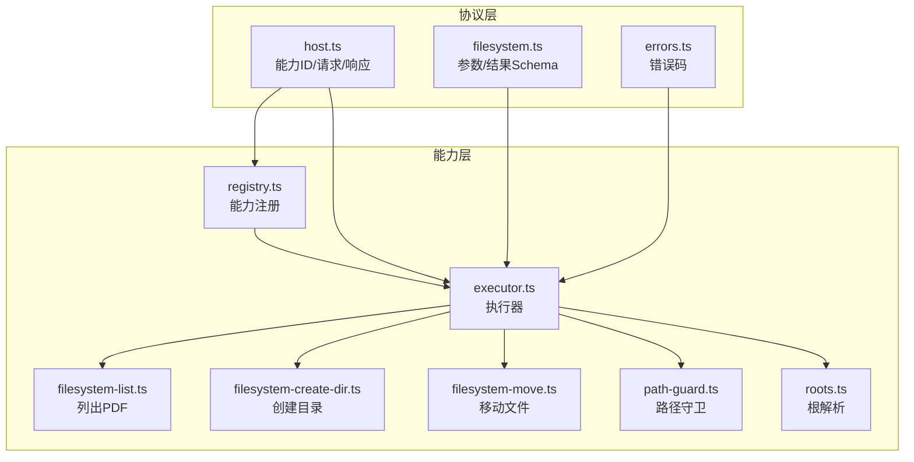
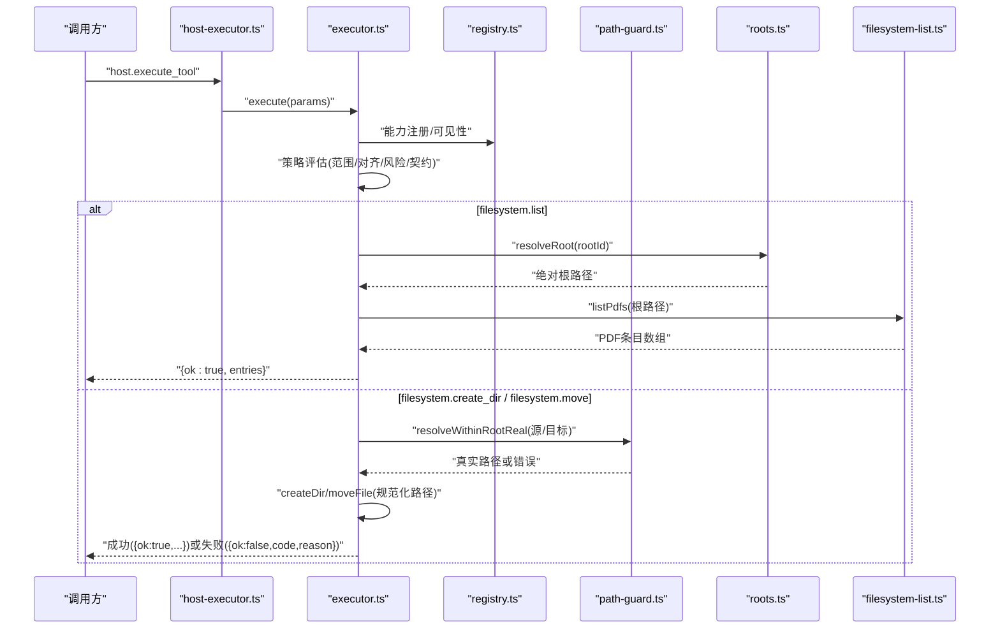
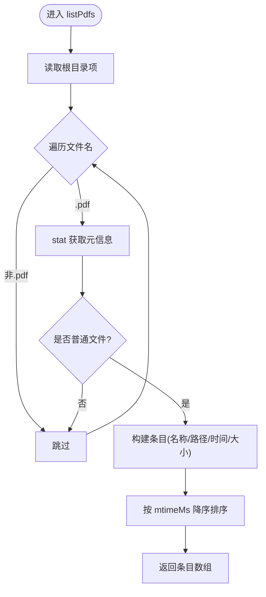
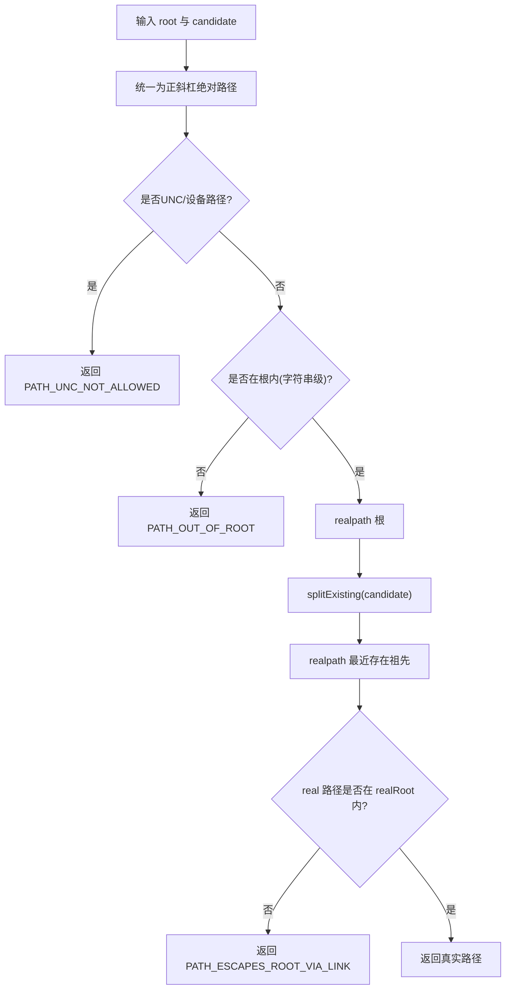
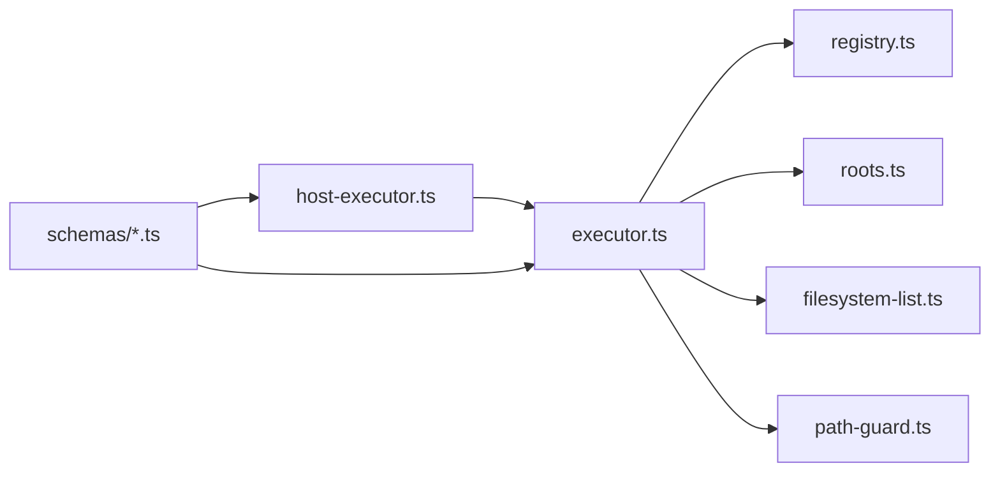

# 文件系统能力

<cite>
**本文引用的文件**
- [apps/desktop/src/main/capabilities/executor.ts](file://apps/desktop/src/main/capabilities/executor.ts)
- [apps/desktop/src/main/capabilities/host-executor.ts](file://apps/desktop/src/main/capabilities/host-executor.ts)
- [apps/desktop/src/main/capabilities/filesystem-list.ts](file://apps/desktop/src/main/capabilities/filesystem-list.ts)
- [apps/desktop/src/main/capabilities/filesystem-create-dir.ts](file://apps/desktop/src/main/capabilities/filesystem-create-dir.ts)
- [apps/desktop/src/main/capabilities/filesystem-move.ts](file://apps/desktop/src/main/capabilities/filesystem-move.ts)
- [apps/desktop/src/main/policy/argument-binders.ts](file://apps/desktop/src/main/policy/argument-binders.ts)
- [apps/desktop/src/main/capabilities/path-guard.ts](file://apps/desktop/src/main/capabilities/path-guard.ts)
- [apps/desktop/src/main/capabilities/roots.ts](file://apps/desktop/src/main/capabilities/roots.ts)
- [packages/protocol/schemas/host.ts](file://packages/protocol/schemas/host.ts)
- [packages/protocol/schemas/filesystem.ts](file://packages/protocol/schemas/filesystem.ts)
- [packages/protocol/schemas/errors.ts](file://packages/protocol/schemas/errors.ts)
- [packages/protocol/fixtures/host-filesystem-list.request.json](file://packages/protocol/fixtures/host-filesystem-list.request.json)
- [packages/protocol/fixtures/host-filesystem-list.response.json](file://packages/protocol/fixtures/host-filesystem-list.response.json)
- [packages/protocol/fixtures/host-filesystem-move.request.json](file://packages/protocol/fixtures/host-filesystem-move.request.json)
- [packages/protocol/fixtures/host-filesystem-move.response.json](file://packages/protocol/fixtures/host-filesystem-move.response.json)
- [packages/protocol/fixtures/host-filesystem-create-dir.request.json](file://packages/protocol/fixtures/host-filesystem-create-dir.request.json)
- [packages/protocol/fixtures/host-filesystem-create-dir.response.json](file://packages/protocol/fixtures/host-filesystem-create-dir.response.json)
</cite>

## 目录
1. [简介](#简介)
2. [项目结构](#项目结构)
3. [核心组件](#核心组件)
4. [架构总览](#架构总览)
5. [详细组件分析](#详细组件分析)
6. [依赖关系分析](#依赖关系分析)
7. [性能考虑](#性能考虑)
8. [故障排查指南](#故障排查指南)
9. [结论](#结论)
10. [附录：JSON-RPC 调用示例与最佳实践](#附录json-rpc-调用示例与最佳实践)

## 简介
本章节面向“文件系统能力”的宿主侧实现，聚焦以下目标：
- 解释已实现的文件系统能力：列出 PDF、创建目录、移动文件。
- 说明每个能力的参数校验、返回值格式与错误处理机制。
- 提供完整的 JSON-RPC 调用示例（请求/响应）。
- 阐述权限控制与安全边界：路径白名单根、符号链接检查、UNC 限制等。
- 给出常见使用场景与最佳实践。

## 项目结构
文件系统能力由协议层（schemas）、能力注册与执行器（capabilities）、以及安全守卫（path-guard）共同组成。关键文件职责如下：
- 协议定义：能力 ID、参数/结果 Schema、错误码、JSON-RPC 请求/响应结构。
- 能力注册：声明文件系统相关能力及其读写类型。
- 执行器：将策略判定后的合法调用分发到具体能力实现。
- 能力实现：列举 PDF、创建目录（filesystem-create-dir.ts）、移动文件（filesystem-move.ts）。
- 路径守卫：确保所有路径在授权根内，并处理符号链接与 UNC 路径。
- 根解析：根据 rootId 解析实际根目录。

**图表来源**
- [packages/protocol/schemas/host.ts:1-76](file://packages/protocol/schemas/host.ts#L1-L76)
- [packages/protocol/schemas/filesystem.ts:1-71](file://packages/protocol/schemas/filesystem.ts#L1-L71)
- [packages/protocol/schemas/errors.ts:1-30](file://packages/protocol/schemas/errors.ts#L1-L30)
- [apps/desktop/src/main/capabilities/registry.ts:1-55](file://apps/desktop/src/main/capabilities/registry.ts#L1-L55)
- [apps/desktop/src/main/capabilities/executor.ts:1-325](file://apps/desktop/src/main/capabilities/executor.ts#L1-L325)
- [apps/desktop/src/main/capabilities/filesystem-list.ts:1-32](file://apps/desktop/src/main/capabilities/filesystem-list.ts#L1-L32)
- [apps/desktop/src/main/capabilities/filesystem-create-dir.ts:1-38](file://apps/desktop/src/main/capabilities/filesystem-create-dir.ts#L1-L38)
- [apps/desktop/src/main/capabilities/filesystem-move.ts:1-36](file://apps/desktop/src/main/capabilities/filesystem-move.ts#L1-L36)
- [apps/desktop/src/main/capabilities/path-guard.ts:1-126](file://apps/desktop/src/main/capabilities/path-guard.ts#L1-L126)
- [apps/desktop/src/main/capabilities/roots.ts:1-27](file://apps/desktop/src/main/capabilities/roots.ts#L1-L27)

**章节来源**
- [packages/protocol/schemas/host.ts:1-76](file://packages/protocol/schemas/host.ts#L1-L76)
- [packages/protocol/schemas/filesystem.ts:1-71](file://packages/protocol/schemas/filesystem.ts#L1-L71)
- [packages/protocol/schemas/errors.ts:1-30](file://packages/protocol/schemas/errors.ts#L1-L30)
- [apps/desktop/src/main/capabilities/registry.ts:1-55](file://apps/desktop/src/main/capabilities/registry.ts#L1-L55)
- [apps/desktop/src/main/capabilities/executor.ts:1-325](file://apps/desktop/src/main/capabilities/executor.ts#L1-L325)
- [apps/desktop/src/main/capabilities/filesystem-list.ts:1-32](file://apps/desktop/src/main/capabilities/filesystem-list.ts#L1-L32)
- [apps/desktop/src/main/capabilities/path-guard.ts:1-126](file://apps/desktop/src/main/capabilities/path-guard.ts#L1-L126)
- [apps/desktop/src/main/capabilities/roots.ts:1-27](file://apps/desktop/src/main/capabilities/roots.ts#L1-L27)

## 核心组件
- 能力注册表：集中声明文件系统能力清单及读写类型，供可见性列表与策略匹配使用。
- 执行器：统一入口，负责策略评估后调用具体能力；对失败进行标准化封装。
- 路径守卫：对候选路径进行白名单根校验、符号链接展开校验、UNC 拒绝。
- 根解析：将逻辑 rootId 映射为真实绝对路径，支持环境变量覆盖。
- 协议 Schema：严格约束能力 ID、参数、结果与错误码，保证跨进程契约一致。

**章节来源**
- [apps/desktop/src/main/capabilities/registry.ts:1-55](file://apps/desktop/src/main/capabilities/registry.ts#L1-L55)
- [apps/desktop/src/main/capabilities/executor.ts:1-325](file://apps/desktop/src/main/capabilities/executor.ts#L1-L325)
- [apps/desktop/src/main/capabilities/path-guard.ts:1-126](file://apps/desktop/src/main/capabilities/path-guard.ts#L1-L126)
- [apps/desktop/src/main/capabilities/roots.ts:1-27](file://apps/desktop/src/main/capabilities/roots.ts#L1-L27)
- [packages/protocol/schemas/host.ts:1-76](file://packages/protocol/schemas/host.ts#L1-L76)
- [packages/protocol/schemas/filesystem.ts:1-71](file://packages/protocol/schemas/filesystem.ts#L1-L71)
- [packages/protocol/schemas/errors.ts:1-30](file://packages/protocol/schemas/errors.ts#L1-L30)

## 架构总览
下图展示从 JSON-RPC 请求到文件系统操作的完整流程，包括能力发现、参数校验、策略评估、路径守卫与最终操作。

**图表来源**
- [apps/desktop/src/main/capabilities/host-executor.ts:1-56](file://apps/desktop/src/main/capabilities/host-executor.ts#L1-L56)
- [apps/desktop/src/main/capabilities/executor.ts:1-325](file://apps/desktop/src/main/capabilities/executor.ts#L1-L325)
- [apps/desktop/src/main/capabilities/registry.ts:1-55](file://apps/desktop/src/main/capabilities/registry.ts#L1-L55)
- [apps/desktop/src/main/capabilities/path-guard.ts:1-126](file://apps/desktop/src/main/capabilities/path-guard.ts#L1-L126)
- [apps/desktop/src/main/capabilities/roots.ts:1-27](file://apps/desktop/src/main/capabilities/roots.ts#L1-L27)
- [apps/desktop/src/main/capabilities/filesystem-list.ts:1-32](file://apps/desktop/src/main/capabilities/filesystem-list.ts#L1-L32)

## 详细组件分析

### 能力清单与类型
- 已注册的文件系统能力：
  - filesystem.list（READ）
  - filesystem.create_dir（WRITE）
  - filesystem.move（WRITE）
- 能力 ID 与请求/响应结构由协议 Schema 约束，确保跨进程一致性。

**章节来源**
- [apps/desktop/src/main/capabilities/registry.ts:9-40](file://apps/desktop/src/main/capabilities/registry.ts#L9-L40)
- [packages/protocol/schemas/host.ts:7-14](file://packages/protocol/schemas/host.ts#L7-L14)

### 列出 PDF（filesystem.list）
- 功能：列出授权根目录下的 PDF 文件，按修改时间倒序返回。
- 参数：rootId（枚举值 downloads），通过协议 Schema 校验。
- 行为：
  - 解析根路径（环境变量或默认 Downloads）。
  - 遍历目录，过滤 .pdf 且为普通文件。
  - 构造条目：名称、绝对路径（POSIX 形式）、修改时间（ISO 8601）、大小（字节）。
- 返回：{ ok: true, entries: PdfEntry[] }。
- 错误：若根不可用，返回 FILESYSTEM_ROOT_UNAVAILABLE。

**图表来源**
- [apps/desktop/src/main/capabilities/filesystem-list.ts:6-31](file://apps/desktop/src/main/capabilities/filesystem-list.ts#L6-L31)
- [apps/desktop/src/main/capabilities/roots.ts:18-26](file://apps/desktop/src/main/capabilities/roots.ts#L18-L26)

**章节来源**
- [apps/desktop/src/main/capabilities/filesystem-list.ts:1-32](file://apps/desktop/src/main/capabilities/filesystem-list.ts#L1-L32)
- [apps/desktop/src/main/capabilities/executor.ts:145-155](file://apps/desktop/src/main/capabilities/executor.ts#L145-L155)
- [packages/protocol/schemas/filesystem.ts:3-20](file://packages/protocol/schemas/filesystem.ts#L3-L20)
- [packages/protocol/schemas/errors.ts:1-30](file://packages/protocol/schemas/errors.ts#L1-L30)

### 创建目录（filesystem.create_dir）
- 能力：在授权根目录下创建子目录（WRITE）。
- 参数：path（字符串，长度≥1），由协议 Schema FilesystemCreateDirParams 校验。
- 安全：
  - 路径必须位于授权根内。
  - 会进行符号链接展开后再校验，防止通过链接逃逸。
  - 拒绝 UNC/设备路径。
- 执行体：filesystem-create-dir.ts 的 createDir 已落地，执行器 runCreateDir 直接使用 binder 输出的 bound.paths['path']（realpath 规范化后的绝对路径），不再二次 parse/resolve。
- 行为：
  - 目标不存在：递归创建（mkdir recursive），返回 created: true。
  - 目标已存在且是目录：**不算失败**（幂等），返回 created: false。
  - 目标已存在但不是目录：失败，返回 CREATE_DIR_FAILED。
- 返回：FilesystemCreateDirResult { ok: true, path, created }。path 是 realpath 规范化后的目录绝对路径（正斜杠），与 bound.paths['path'] 同源；created 区分「本次新建」与「本就存在」。
- 失败：统一封装为 { ok: false, code, reason }，业务码固定 CREATE_DIR_FAILED（只有 reason 变化）；执行器侧另有兜底，防实现意外抛出。

**章节来源**
- [packages/protocol/schemas/filesystem.ts:23-53](file://packages/protocol/schemas/filesystem.ts#L23-L53)
- [apps/desktop/src/main/capabilities/filesystem-create-dir.ts:23-38](file://apps/desktop/src/main/capabilities/filesystem-create-dir.ts#L23-L38)
- [apps/desktop/src/main/capabilities/executor.ts:174-182](file://apps/desktop/src/main/capabilities/executor.ts#L174-L182)
- [apps/desktop/src/main/policy/argument-binders.ts:69-82](file://apps/desktop/src/main/policy/argument-binders.ts#L69-L82)
- [apps/desktop/src/main/capabilities/registry.ts:20-24](file://apps/desktop/src/main/capabilities/registry.ts#L20-L24)
- [apps/desktop/src/main/capabilities/path-guard.ts:61-125](file://apps/desktop/src/main/capabilities/path-guard.ts#L61-L125)

### 移动文件（filesystem.move）
- 能力：在授权根目录内移动文件（WRITE）。
- 参数：source、target（字符串，长度≥1），由协议 Schema FilesystemMoveParams 校验；字段名与 PermissionRecord 的 sourcePaths/targetPath 对齐。
- 安全：
  - 源与目标均需通过 resolveWithinRootReal 校验，确保均在授权根内且未被链接逃逸。
  - 拒绝 UNC/设备路径。
- 执行体：filesystem-move.ts 的 moveFile 已落地，执行器 runMove 直接使用 bound.paths 的 source/target（realpath 后的绝对路径，与批准时计算 hash 的那份一致）。
- 行为（**move 不幂等**，与 create_dir 相反）：
  - source 不存在：失败，返回 MOVE_SOURCE_MISSING。
  - target 已存在：直接拒，返回 MOVE_TARGET_EXISTS——不覆盖、不合并。
  - rename 系统调用失败：返回 MOVE_FAILED。
- 返回：FilesystemMoveResult { ok: true, source, target }，两个路径都是 realpath 后的绝对路径，与 bound.paths 的 source/target 同源；成功即移动完成。
- 失败：统一封装为 { ok: false, code, reason }，move 有三个业务码（MOVE_SOURCE_MISSING / MOVE_TARGET_EXISTS / MOVE_FAILED），code 由失败分支决定。

**章节来源**
- [packages/protocol/schemas/filesystem.ts:30-70](file://packages/protocol/schemas/filesystem.ts#L30-L70)
- [apps/desktop/src/main/capabilities/filesystem-move.ts:21-36](file://apps/desktop/src/main/capabilities/filesystem-move.ts#L21-L36)
- [apps/desktop/src/main/capabilities/executor.ts:184-193](file://apps/desktop/src/main/capabilities/executor.ts#L184-L193)
- [apps/desktop/src/main/policy/argument-binders.ts:84-117](file://apps/desktop/src/main/policy/argument-binders.ts#L84-L117)
- [apps/desktop/src/main/capabilities/registry.ts:25-29](file://apps/desktop/src/main/capabilities/registry.ts#L25-L29)
- [apps/desktop/src/main/capabilities/path-guard.ts:61-125](file://apps/desktop/src/main/capabilities/path-guard.ts#L61-L125)

### 路径守卫与安全边界
- 根白名单：所有路径必须在授权根内（区分大小写比较前统一小写）。
- 符号链接：先拆分最近存在祖先，再对其实路径进行 realpath 校验，防止链接逃逸。
- UNC 拒绝：不接受以 // 开头的 UNC 或设备路径。
- 返回：成功时返回真实路径；失败时返回错误码与原因。

**图表来源**
- [apps/desktop/src/main/capabilities/path-guard.ts:6-17](file://apps/desktop/src/main/capabilities/path-guard.ts#L6-L17)
- [apps/desktop/src/main/capabilities/path-guard.ts:44-59](file://apps/desktop/src/main/capabilities/path-guard.ts#L44-L59)
- [apps/desktop/src/main/capabilities/path-guard.ts:70-125](file://apps/desktop/src/main/capabilities/path-guard.ts#L70-L125)

**章节来源**
- [apps/desktop/src/main/capabilities/path-guard.ts:1-126](file://apps/desktop/src/main/capabilities/path-guard.ts#L1-L126)

### 根解析与环境变量
- rootId 映射：downloads → 环境变量 PERSONAL_AGENT_DOWNLOADS_DIR，否则回退到用户 Downloads 目录。
- 输出：POSIX 形式的绝对路径，便于后续统一处理。

**章节来源**
- [apps/desktop/src/main/capabilities/roots.ts:1-27](file://apps/desktop/src/main/capabilities/roots.ts#L1-L27)

### 执行器与错误封装
- 执行器根据策略评估结果调用具体能力，runCapability 按注册表中的能力真名分发到 listPdfs / extractPdf / createDir / moveFile 等执行体。
- 失败统一封装为 { ok: false, code, reason }，错误码来自协议错误定义。
- 针对文件系统根不可用、文件不可读、PDF 解析失败等场景分别返回对应错误码。
- WRITE 能力（create_dir、move）另有专属业务码：CREATE_DIR_FAILED；MOVE_SOURCE_MISSING、MOVE_TARGET_EXISTS、MOVE_FAILED。
- 执行体拿到的路径是 binder 规范化后的 bound.paths，不再二次 parse/resolve；createDir/moveFile 契约上不 throw，执行器仍保留 try/catch 兜底以留住精确错误码。

**章节来源**
- [apps/desktop/src/main/capabilities/executor.ts:115-276](file://apps/desktop/src/main/capabilities/executor.ts#L115-L276)
- [apps/desktop/src/main/capabilities/filesystem-create-dir.ts:1-38](file://apps/desktop/src/main/capabilities/filesystem-create-dir.ts#L1-L38)
- [apps/desktop/src/main/capabilities/filesystem-move.ts:1-36](file://apps/desktop/src/main/capabilities/filesystem-move.ts#L1-L36)
- [packages/protocol/schemas/errors.ts:1-30](file://packages/protocol/schemas/errors.ts#L1-L30)

## 依赖关系分析
- executor.ts 依赖 registry.ts（能力注册）、roots.ts（根解析）、filesystem-list.ts（能力实现）、path-guard.ts（路径守卫）。
- host-executor.ts 暴露对外接口，内部复用 executor.ts。
- 协议 schemas 被多处引用，确保契约一致。

**图表来源**
- [apps/desktop/src/main/capabilities/host-executor.ts:1-56](file://apps/desktop/src/main/capabilities/host-executor.ts#L1-L56)
- [apps/desktop/src/main/capabilities/executor.ts:1-325](file://apps/desktop/src/main/capabilities/executor.ts#L1-L325)
- [apps/desktop/src/main/capabilities/registry.ts:1-55](file://apps/desktop/src/main/capabilities/registry.ts#L1-L55)
- [apps/desktop/src/main/capabilities/roots.ts:1-27](file://apps/desktop/src/main/capabilities/roots.ts#L1-L27)
- [apps/desktop/src/main/capabilities/filesystem-list.ts:1-32](file://apps/desktop/src/main/capabilities/filesystem-list.ts#L1-L32)
- [apps/desktop/src/main/capabilities/path-guard.ts:1-126](file://apps/desktop/src/main/capabilities/path-guard.ts#L1-L126)
- [packages/protocol/schemas/host.ts:1-76](file://packages/protocol/schemas/host.ts#L1-L76)
- [packages/protocol/schemas/filesystem.ts:1-71](file://packages/protocol/schemas/filesystem.ts#L1-L71)

**章节来源**
- [apps/desktop/src/main/capabilities/host-executor.ts:1-56](file://apps/desktop/src/main/capabilities/host-executor.ts#L1-L56)
- [apps/desktop/src/main/capabilities/executor.ts:1-325](file://apps/desktop/src/main/capabilities/executor.ts#L1-L325)
- [packages/protocol/schemas/host.ts:1-76](file://packages/protocol/schemas/host.ts#L1-L76)

## 性能考虑
- 列出 PDF：仅扫描一次目录，过滤与 stat 合并，按 mtime 排序，适合中等规模目录。
- 路径守卫：仅在必要时进行 realpath 与存在性检查，避免不必要的系统调用。
- 根解析：常量时间查找环境变量，无额外开销。

[本节为通用性能建议，不直接分析具体文件]

## 故障排查指南
- 根不可用：当授权根不存在或不可访问时，返回 FILESYSTEM_ROOT_UNAVAILABLE。
- 文件不可读：读取失败时返回 FILE_UNREADABLE。
- 路径越界：不在授权根内返回 PATH_OUT_OF_ROOT。
- 链接逃逸：经符号链接指向根外返回 PATH_ESCAPES_ROOT_VIA_LINK。
- UNC 拒绝：不接受 UNC/设备路径，返回 PATH_UNC_NOT_ALLOWED。
- 参数无效：不符合 Schema 时返回 INVALID_ARGUMENT。
- 创建目录失败：目标路径已存在但不是目录、或 mkdir 失败时返回 CREATE_DIR_FAILED；目录已存在不是错误，看 created 字段区分「本次新建/本就存在」。
- 移动失败：source 不存在返回 MOVE_SOURCE_MISSING；target 已存在返回 MOVE_TARGET_EXISTS（move 不幂等，拒绝覆盖）；rename 系统调用失败返回 MOVE_FAILED。

**章节来源**
- [packages/protocol/schemas/errors.ts:1-30](file://packages/protocol/schemas/errors.ts#L1-L30)
- [apps/desktop/src/main/capabilities/executor.ts:145-193](file://apps/desktop/src/main/capabilities/executor.ts#L145-L193)
- [apps/desktop/src/main/capabilities/path-guard.ts:70-125](file://apps/desktop/src/main/capabilities/path-guard.ts#L70-L125)

## 结论
文件系统能力通过严格的协议 Schema、能力注册与执行器编排，结合路径守卫与环境变量根解析，实现了安全的只读与受限写入能力。filesystem.create_dir 与 filesystem.move 的执行体均已落地：create_dir 幂等（created 字段区分新建/已存在），move 不幂等（target 已存在直接拒绝），两者都只消费 binder 规范化后的真实路径。能力契约与安全边界完备，并为后续扩展提供了清晰扩展点。

[本节为总结性内容，不直接分析具体文件]

## 附录：JSON-RPC 调用示例与最佳实践

### 列出 PDF（filesystem.list）
- 方法：host.execute_tool
- 能力：filesystem.list
- 参数：{ rootId: "downloads" }
- 请求示例：
  - [host-filesystem-list.request.json:1-13](file://packages/protocol/fixtures/host-filesystem-list.request.json#L1-L13)
- 响应示例：
  - [host-filesystem-list.response.json:1-22](file://packages/protocol/fixtures/host-filesystem-list.response.json#L1-L22)

**章节来源**
- [packages/protocol/fixtures/host-filesystem-list.request.json:1-13](file://packages/protocol/fixtures/host-filesystem-list.request.json#L1-L13)
- [packages/protocol/fixtures/host-filesystem-list.response.json:1-22](file://packages/protocol/fixtures/host-filesystem-list.response.json#L1-L22)

### 创建目录（filesystem.create_dir）
- 方法：host.execute_tool
- 能力：filesystem.create_dir
- 参数：{ path: "D:/Users/demo/Downloads/Reading" }
- 请求示例：
  - [host-filesystem-create-dir.request.json:1-12](file://packages/protocol/fixtures/host-filesystem-create-dir.request.json#L1-L12)
- 响应示例（created: true 表示本次新建；目录已存在时幂等返回 created: false）：
  - [host-filesystem-create-dir.response.json:1-9](file://packages/protocol/fixtures/host-filesystem-create-dir.response.json#L1-L9)

**章节来源**
- [packages/protocol/fixtures/host-filesystem-create-dir.request.json:1-12](file://packages/protocol/fixtures/host-filesystem-create-dir.request.json#L1-L12)
- [packages/protocol/fixtures/host-filesystem-create-dir.response.json:1-9](file://packages/protocol/fixtures/host-filesystem-create-dir.response.json#L1-L9)

### 移动文件（filesystem.move）
- 方法：host.execute_tool
- 能力：filesystem.move
- 参数：{ source: "D:/Users/demo/Downloads/report-2026.pdf", target: "D:/Users/demo/Downloads/Reading/report-2026.pdf" }
- 请求示例：
  - [host-filesystem-move.request.json:1-12](file://packages/protocol/fixtures/host-filesystem-move.request.json#L1-L12)
- 响应示例（source/target 均为 realpath 规范化后的绝对路径）：
  - [host-filesystem-move.response.json:1-9](file://packages/protocol/fixtures/host-filesystem-move.response.json#L1-L9)

**章节来源**
- [packages/protocol/fixtures/host-filesystem-move.request.json:1-12](file://packages/protocol/fixtures/host-filesystem-move.request.json#L1-L12)
- [packages/protocol/fixtures/host-filesystem-move.response.json:1-9](file://packages/protocol/fixtures/host-filesystem-move.response.json#L1-L9)

### 权限控制与安全最佳实践
- 所有路径必须通过路径守卫校验，确保在授权根内且不被链接逃逸。
- 拒绝 UNC/设备路径，避免系统级路径滥用。
- 使用环境变量配置根目录，便于隔离不同任务的工作区。
- 对写入类能力（create_dir、move）务必在执行前进行路径守卫与策略评估。
- 日志中记录真实路径，便于审计与排障。

[本节为通用安全建议，不直接分析具体文件]