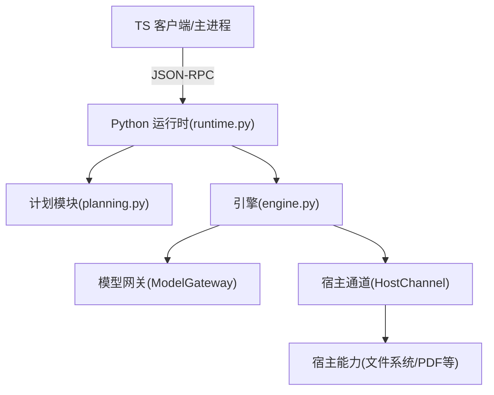
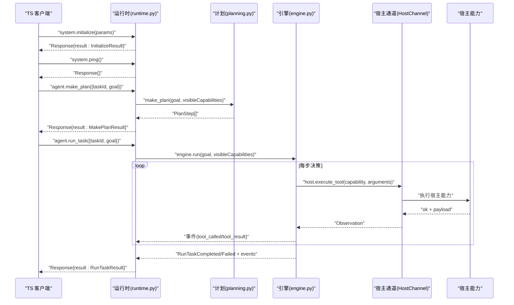
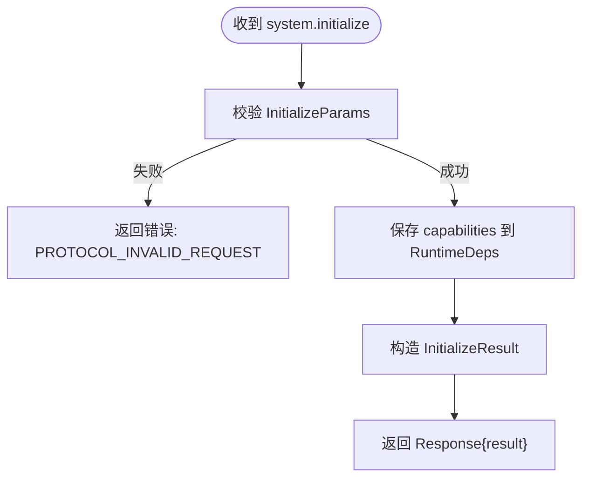
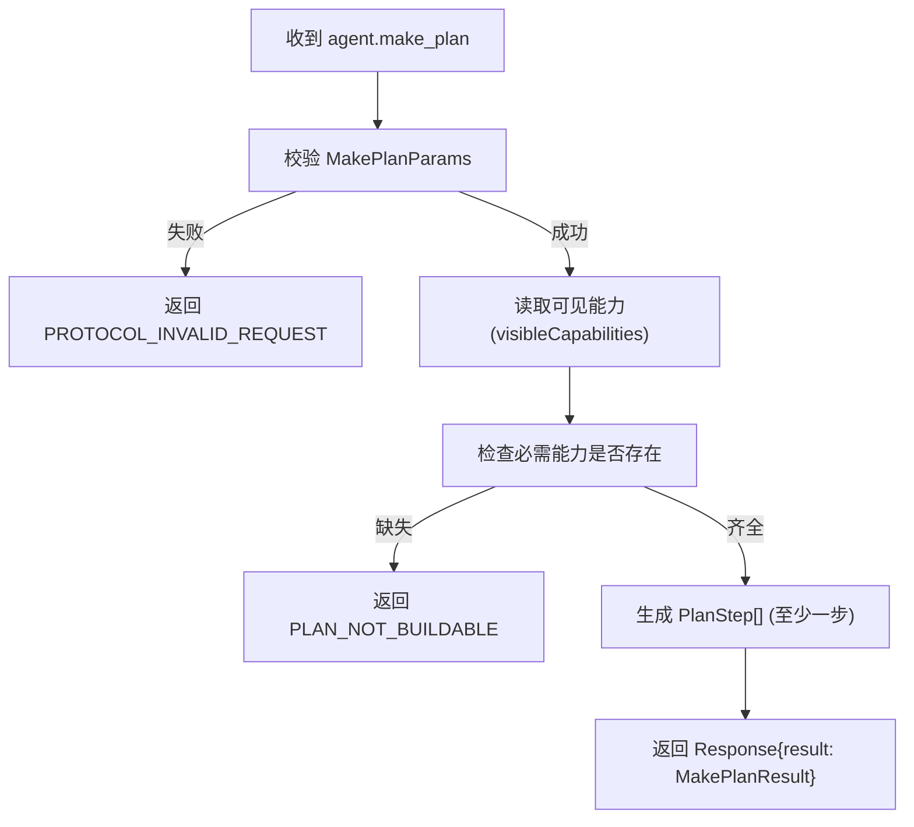
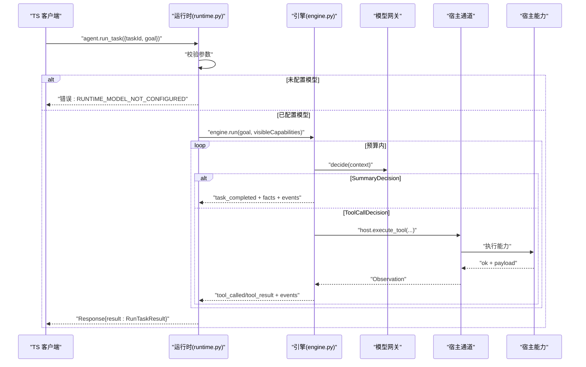
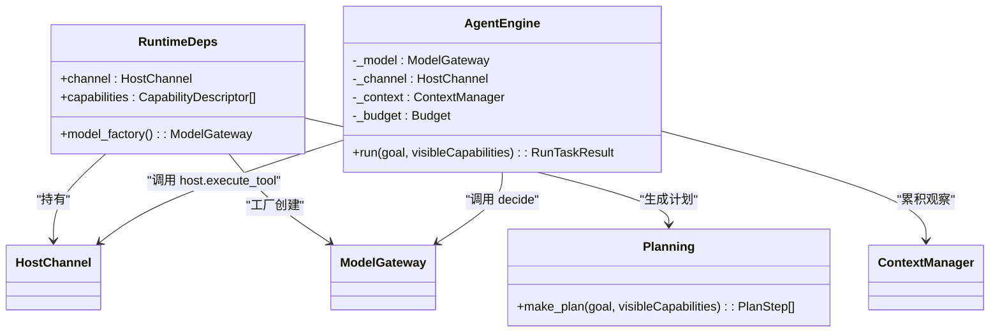

# 代理方法接口

<cite>
**本文引用的文件**
- [runtime.py](file://services/agent-runtime/src/personal_agent/runtime.py)
- [engine.py](file://services/agent-runtime/src/personal_agent/engine.py)
- [planning.py](file://services/agent-runtime/src/personal_agent/planning.py)
- [models.py](file://services/agent-runtime/src/personal_agent/protocol/models.py)
- [agent.ts](file://packages/protocol/schemas/agent.ts)
- [envelope.ts](file://packages/protocol/schemas/envelope.ts)
- [errors.ts](file://packages/protocol/schemas/errors.ts)
- [initialize.request.json](file://packages/protocol/fixtures/initialize.request.json)
- [ping.request.json](file://packages/protocol/fixtures/ping.request.json)
- [agent-make-plan.request.json](file://packages/protocol/fixtures/agent-make-plan.request.json)
- [agent-run-task.request.json](file://packages/protocol/fixtures/agent-run-task.request.json)
- [agent-make-plan.response.json](file://packages/protocol/fixtures/agent-make-plan.response.json)
- [agent-run-task.completed.response.json](file://packages/protocol/fixtures/agent-run-task.completed.response.json)
</cite>

## 目录
1. [简介](#简介)
2. [项目结构](#项目结构)
3. [核心组件](#核心组件)
4. [架构总览](#架构总览)
5. [详细组件分析](#详细组件分析)
6. [依赖关系分析](#依赖关系分析)
7. [性能考量](#性能考量)
8. [故障排查指南](#故障排查指南)
9. [结论](#结论)
10. [附录：方法调用示例与最佳实践](#附录方法调用示例与最佳实践)

## 简介
本文件面向“代理方法接口”的完整技术文档，聚焦 JSON-RPC 方法 initialize、system.ping、agent.make_plan、agent.run_task 的定义、参数结构、返回值格式与执行流程。同时说明任务规划过程（计划生成、步骤分解、执行控制）以及任务执行的生命周期管理（状态跟踪、进度事件、结果返回）。文末提供完整的调用示例、错误处理策略与性能优化建议。

## 项目结构
本项目采用前后端分离与进程间协议协作的方式：
- TypeScript 侧（packages/protocol）定义 JSON-RPC 信封、错误码与 Agent 相关的数据契约（Zod Schema），并提供测试夹具（fixtures）。
- Python 侧（services/agent-runtime）实现运行时调度、计划生成、引擎循环、宿主通道通信与协议模型（Pydantic）。

图表来源
- [runtime.py:67-91](file://services/agent-runtime/src/personal_agent/runtime.py#L67-L91)
- [engine.py:76-195](file://services/agent-runtime/src/personal_agent/engine.py#L76-L195)
- [planning.py:25-44](file://services/agent-runtime/src/personal_agent/planning.py#L25-L44)

章节来源
- [envelope.ts:5-41](file://packages/protocol/schemas/envelope.ts#L5-L41)
- [agent.ts:4-138](file://packages/protocol/schemas/agent.ts#L4-L138)
- [models.py:14-38](file://services/agent-runtime/src/personal_agent/protocol/models.py#L14-L38)

## 核心组件
- 运行时分发器：负责解析请求、路由到具体处理器（initialize、ping、make_plan、run_task），并统一构造响应或错误。
- 计划生成器：根据目标与可见能力清单，输出确定性三步计划（列出 PDF、提取文本、生成摘要）。
- 引擎循环：最小 Agent Loop，按预算（步数/工具调用次数）驱动决策与执行，产出事件流与最终结果。
- 协议模型：两端共享的 Pydantic/Zod 类型，保证请求/响应结构一致。

章节来源
- [runtime.py:67-182](file://services/agent-runtime/src/personal_agent/runtime.py#L67-L182)
- [planning.py:25-44](file://services/agent-runtime/src/personal_agent/planning.py#L25-L44)
- [engine.py:76-195](file://services/agent-runtime/src/personal_agent/engine.py#L76-L195)
- [models.py:14-38](file://services/agent-runtime/src/personal_agent/protocol/models.py#L14-L38)

## 架构总览
下图展示从 TS 发起 JSON-RPC 到 Python 运行时的端到端流程，包括计划与任务执行两个阶段。

图表来源
- [runtime.py:67-182](file://services/agent-runtime/src/personal_agent/runtime.py#L67-L182)
- [engine.py:89-151](file://services/agent-runtime/src/personal_agent/engine.py#L89-L151)
- [models.py:264-320](file://services/agent-runtime/src/personal_agent/protocol/models.py#L264-L320)

## 详细组件分析

### 系统初始化：system.initialize
- 作用：建立会话，下发能力清单（capabilities）、协议版本与客户端信息；运行时保存能力用于后续计划与执行可见性控制。
- 入参：InitializeParams（包含 protocolVersion、capabilities、client）。
- 出参：InitializeResult（包含 protocolVersion、server）。
- 错误：参数不合法时返回 PROTOCOL_INVALID_REQUEST。

图表来源
- [runtime.py:107-123](file://services/agent-runtime/src/personal_agent/runtime.py#L107-L123)
- [models.py:253-262](file://services/agent-runtime/src/personal_agent/protocol/models.py#L253-L262)

章节来源
- [runtime.py:107-123](file://services/agent-runtime/src/personal_agent/runtime.py#L107-L123)
- [models.py:253-262](file://services/agent-runtime/src/personal_agent/protocol/models.py#L253-L262)
- [initialize.request.json:1-22](file://packages/protocol/fixtures/initialize.request.json#L1-L22)

### 健康检查：system.ping
- 作用：快速探测运行时是否存活。
- 入参：空对象。
- 出参：空结果。
- 错误：无业务错误，仅协议层非法请求会报错。

章节来源
- [runtime.py:75-78](file://services/agent-runtime/src/personal_agent/runtime.py#L75-L78)
- [ping.request.json:1-7](file://packages/protocol/fixtures/ping.request.json#L1-L7)

### 计划生成：agent.make_plan
- 作用：基于目标与可见能力，输出一份有序、可执行的计划步骤列表。
- 入参：MakePlanParams（taskId、goal）。
- 出参：MakePlanResult（steps 数组，至少一步）。
- 错误：
  - 参数不合法：PROTOCOL_INVALID_REQUEST。
  - 能力缺失导致无法构建计划：PLAN_NOT_BUILDABLE。
  - 未预期异常：RUNTIME_INTERNAL。
- 计划逻辑：固定三步（列出 PDF、提取 PDF 文本、生成带页码引用的摘要），要求 filesystem.list 与 document.extract_pdf 在可见能力中。

图表来源
- [runtime.py:126-153](file://services/agent-runtime/src/personal_agent/runtime.py#L126-L153)
- [planning.py:25-44](file://services/agent-runtime/src/personal_agent/planning.py#L25-L44)

章节来源
- [runtime.py:126-153](file://services/agent-runtime/src/personal_agent/runtime.py#L126-L153)
- [planning.py:25-44](file://services/agent-runtime/src/personal_agent/planning.py#L25-L44)
- [agent.ts:7-60](file://packages/protocol/schemas/agent.ts#L7-L60)
- [models.py:322-368](file://services/agent-runtime/src/personal_agent/protocol/models.py#L322-L368)
- [agent-make-plan.request.json:1-10](file://packages/protocol/fixtures/agent-make-plan.request.json#L1-L10)
- [agent-make-plan.response.json:1-20](file://packages/protocol/fixtures/agent-make-plan.response.json#L1-L20)

### 任务执行：agent.run_task
- 作用：启动一个任务，按预算驱动引擎循环，产出事件流与最终结果。
- 入参：RunTaskParams（taskId、goal）。
- 出参：RunTaskResult（discriminated union：completed 或 failed），包含事件列表 events。
- 错误：
  - 参数不合法：PROTOCOL_INVALID_REQUEST。
  - 未配置模型：RUNTIME_MODEL_NOT_CONFIGURED。
  - 宿主通道关闭：RUNTIME_CHANNEL_CLOSED（通过事件回传）。
  - 未预期异常：RUNTIME_INTERNAL。
- 生命周期与事件：
  - task_started：任务开始。
  - tool_called / tool_result：每次工具调用及结果。
  - budget_exhausted：达到预算上限（步数或工具调用次数）。
  - task_completed / task_failed：任务结束。
- 预算默认值：最大步数 8，最大工具调用 5。

图表来源
- [runtime.py:156-182](file://services/agent-runtime/src/personal_agent/runtime.py#L156-L182)
- [engine.py:89-151](file://services/agent-runtime/src/personal_agent/engine.py#L89-L151)
- [models.py:264-320](file://services/agent-runtime/src/personal_agent/protocol/models.py#L264-L320)

章节来源
- [runtime.py:156-182](file://services/agent-runtime/src/personal_agent/runtime.py#L156-L182)
- [engine.py:89-151](file://services/agent-runtime/src/personal_agent/engine.py#L89-L151)
- [agent.ts:62-138](file://packages/protocol/schemas/agent.ts#L62-L138)
- [models.py:264-320](file://services/agent-runtime/src/personal_agent/protocol/models.py#L264-L320)
- [agent-run-task.request.json:1-10](file://packages/protocol/fixtures/agent-run-task.request.json#L1-L10)
- [agent-run-task.completed.response.json:1-35](file://packages/protocol/fixtures/agent-run-task.completed.response.json#L1-L35)

## 依赖关系分析
- 运行时依赖：
  - HostChannel：与宿主能力进行 RPC 通信。
  - ModelGateway：抽象模型决策接口，当前使用脚本化模型（ScriptedModel）。
  - ContextManager：维护观察记录，跨步骤累积上下文。
- 计划依赖：
  - 能力枚举：必须包含 filesystem.list 与 document.extract_pdf。
- 引擎依赖：
  - 预算控制：限制步数与工具调用次数，防止无限循环。
  - 摘要验证：对模型产出的摘要进行事实校验与页码引用约束。

图表来源
- [runtime.py:47-61](file://services/agent-runtime/src/personal_agent/runtime.py#L47-L61)
- [engine.py:76-195](file://services/agent-runtime/src/personal_agent/engine.py#L76-L195)
- [planning.py:25-44](file://services/agent-runtime/src/personal_agent/planning.py#L25-L44)

章节来源
- [runtime.py:47-61](file://services/agent-runtime/src/personal_agent/runtime.py#L47-L61)
- [engine.py:76-195](file://services/agent-runtime/src/personal_agent/engine.py#L76-L195)
- [planning.py:25-44](file://services/agent-runtime/src/personal_agent/planning.py#L25-L44)

## 性能考量
- 预算控制：默认最多 8 步、5 次工具调用，避免长尾与资源耗尽。可根据场景调整。
- 模型实例化：每次 run_task 新建模型实例，避免脚本游标复用问题，确保连续任务稳定。
- 事件批量：事件在引擎内部集中构造并随结果返回，减少往返开销。
- 能力可见性：仅在握手时下发必要能力，降低计划与执行阶段的判断成本。
- I/O 阻塞：engine.run 同步阻塞，主循环在 handle_line 中等待，避免并发竞争 stdin。

[本节为通用指导，无需特定文件来源]

## 故障排查指南
- 协议层错误：
  - PROTOCOL_INVALID_JSON：请求行不是合法 JSON。
  - PROTOCOL_INVALID_REQUEST：参数不符合契约（如缺少必填字段、类型不符）。
  - METHOD_NOT_FOUND：未知方法名。
- 运行时错误：
  - RUNTIME_MODEL_NOT_CONFIGURED：未配置模型脚本，无法执行任务。
  - PLAN_NOT_BUILDABLE：计划所需能力不在可见清单中。
  - RUNTIME_CHANNEL_CLOSED：宿主通道关闭，任务失败。
  - CAPABILITY_NOT_REGISTERED：模型请求了未在协议枚举内的 capability。
- 调试建议：
  - 检查 initialize 下发的 capabilities 是否包含计划所需能力。
  - 确认环境变量 PERSONAL_AGENT_SCRIPT 指向有效脚本。
  - 查看 stderr 日志定位未预期异常堆栈。

章节来源
- [runtime.py:67-91](file://services/agent-runtime/src/personal_agent/runtime.py#L67-L91)
- [runtime.py:126-182](file://services/agent-runtime/src/personal_agent/runtime.py#L126-L182)
- [engine.py:164-195](file://services/agent-runtime/src/personal_agent/engine.py#L164-L195)
- [errors.ts:1-30](file://packages/protocol/schemas/errors.ts#L1-L30)

## 结论
本接口以 JSON-RPC 为基础，将“计划生成”和“任务执行”解耦：计划由 Python 侧依据能力清单确定，任务执行由引擎驱动，结合宿主能力完成实际工作。通过严格的数据契约与事件流，TS 侧可可靠地追踪任务状态与进度，并在失败路径获得明确原因。预算控制与能力可见性机制保障了系统的稳定性与安全性。

[本节为总结，无需特定文件来源]

## 附录：方法调用示例与最佳实践

### 方法清单与契约要点
- system.initialize
  - 入参：protocolVersion、capabilities、client。
  - 出参：protocolVersion、server。
  - 用途：建立会话并下发能力清单。
- system.ping
  - 入参：空对象。
  - 出参：空结果。
  - 用途：健康检查。
- agent.make_plan
  - 入参：taskId、goal。
  - 出参：steps（至少一步，capability 可选）。
  - 用途：生成可执行计划。
- agent.run_task
  - 入参：taskId、goal。
  - 出参：status=completed/failed，facts/events（completed）或 reason/events（failed）。
  - 用途：执行任务并返回事件流与结果。

章节来源
- [initialize.request.json:1-22](file://packages/protocol/fixtures/initialize.request.json#L1-L22)
- [ping.request.json:1-7](file://packages/protocol/fixtures/ping.request.json#L1-L7)
- [agent-make-plan.request.json:1-10](file://packages/protocol/fixtures/agent-make-plan.request.json#L1-L10)
- [agent-make-plan.response.json:1-20](file://packages/protocol/fixtures/agent-make-plan.response.json#L1-L20)
- [agent-run-task.request.json:1-10](file://packages/protocol/fixtures/agent-run-task.request.json#L1-L10)
- [agent-run-task.completed.response.json:1-35](file://packages/protocol/fixtures/agent-run-task.completed.response.json#L1-L35)
- [agent.ts:4-138](file://packages/protocol/schemas/agent.ts#L4-L138)
- [models.py:14-38](file://services/agent-runtime/src/personal_agent/protocol/models.py#L14-L38)

### 典型调用序列
1) 初始化
- 发送 system.initialize，附带 capabilities（需包含 filesystem.list、document.extract_pdf）。
- 接收 InitializeResult，确认协议版本与服务信息。

2) 健康检查
- 发送 system.ping，确认运行时存活。

3) 生成计划
- 发送 agent.make_plan，传入 taskId 与 goal。
- 接收 MakePlanResult，确认 steps 数量与能力绑定。

4) 执行任务
- 发送 agent.run_task，传入相同 taskId 与 goal。
- 接收 RunTaskResult，包含事件流与最终结果。

章节来源
- [runtime.py:67-182](file://services/agent-runtime/src/personal_agent/runtime.py#L67-L182)
- [engine.py:89-151](file://services/agent-runtime/src/personal_agent/engine.py#L89-L151)

### 错误处理策略
- 协议层：统一校验 Request/Response 结构，确保 result 与 error 互斥。
- 能力层：计划前校验能力可见性，缺失则直接拒绝并返回 PLAN_NOT_BUILDABLE。
- 执行层：捕获宿主通道异常与脚本耗尽异常，转为失败事件与原因。
- 客户端：根据 status 与事件类型更新 UI，对失败原因进行用户友好提示。

章节来源
- [envelope.ts:12-34](file://packages/protocol/schemas/envelope.ts#L12-L34)
- [models.py:21-31](file://services/agent-runtime/src/personal_agent/protocol/models.py#L21-L31)
- [runtime.py:67-91](file://services/agent-runtime/src/personal_agent/runtime.py#L67-L91)
- [engine.py:148-151](file://services/agent-runtime/src/personal_agent/engine.py#L148-L151)

### 性能优化建议
- 合理设置预算：根据任务复杂度调优 maxSteps 与 maxToolCalls。
- 能力裁剪：仅下发必要能力，减少计划与执行阶段的判定开销。
- 事件消费：客户端按需订阅关键事件（tool_called、task_completed/failed），避免全量渲染。
- 模型脚本缓存：脚本加载后复用，但每个任务仍创建新模型实例以避免游标污染。

[本节为通用指导，无需特定文件来源]