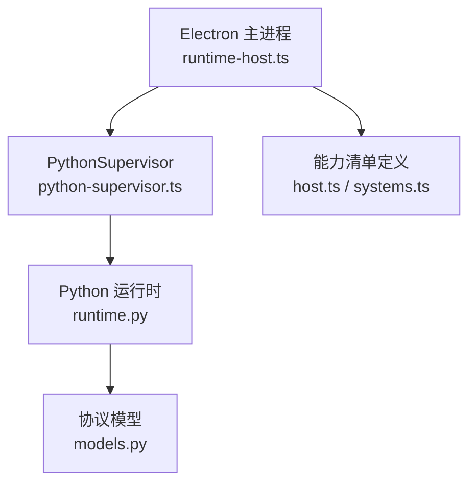
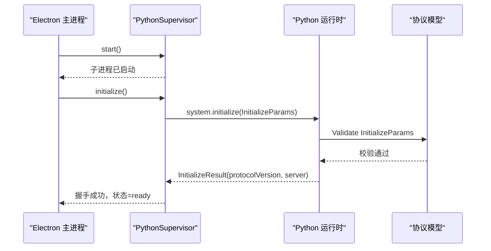
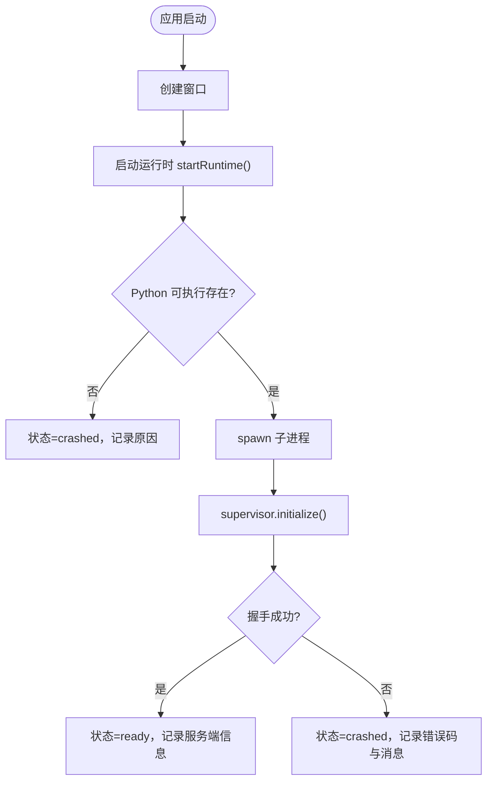
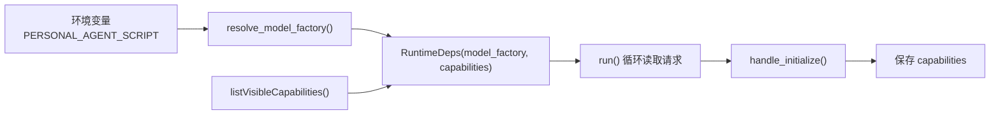
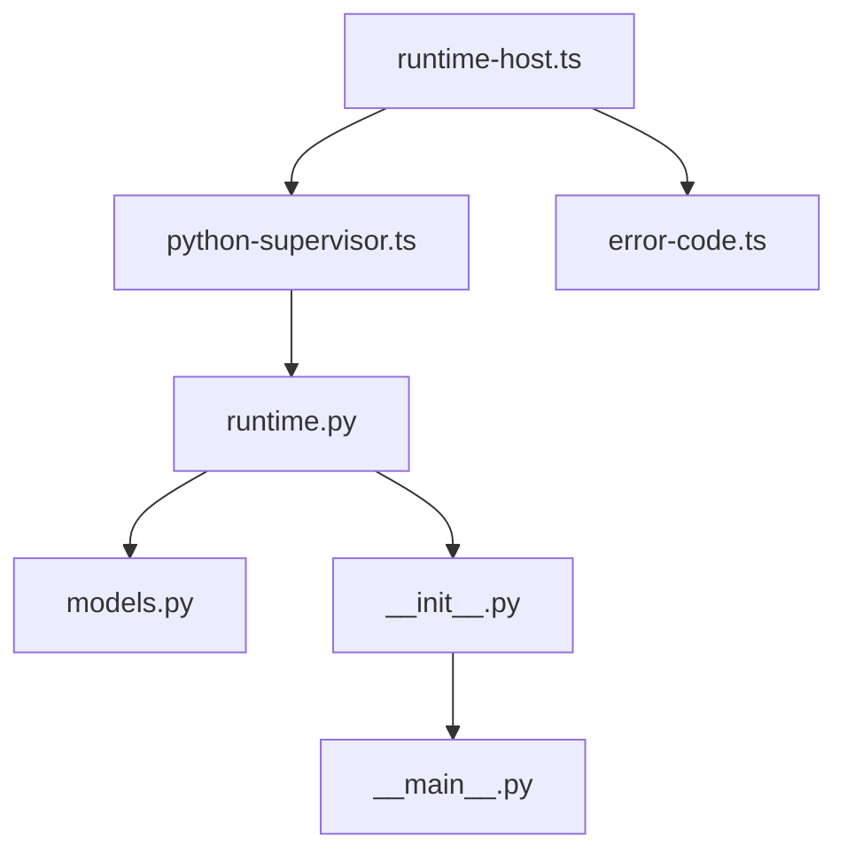

# 初始化方法

<cite>
**本文引用的文件**
- [runtime.py](file://services/agent-runtime/src/personal_agent/runtime.py)
- [models.py](file://services/agent-runtime/src/personal_agent/protocol/models.py)
- [systems.ts](file://packages/protocol/schemas/systems.ts)
- [host.ts](file://packages/protocol/schemas/host.ts)
- [initialize.request.json](file://packages/protocol/fixtures/initialize.request.json)
- [initialize.response.json](file://packages/protocol/fixtures/initialize.response.json)
- [python-supervisor.ts](file://apps/desktop/src/main/runtime/python-supervisor.ts)
- [runtime-host.ts](file://apps/desktop/src/main/runtime/runtime-host.ts)
- [error-code.ts](file://apps/desktop/src/main/runtime/error-code.ts)
- [__init__.py](file://services/agent-runtime/src/personal_agent/__init__.py)
- [__main__.py](file://services/agent-runtime/src/personal_agent/__main__.py)
</cite>

## 目录
1. [简介](#简介)
2. [项目结构](#项目结构)
3. [核心组件](#核心组件)
4. [架构总览](#架构总览)
5. [详细组件分析](#详细组件分析)
6. [依赖关系分析](#依赖关系分析)
7. [性能考虑](#性能考虑)
8. [故障排查指南](#故障排查指南)
9. [结论](#结论)
10. [附录](#附录)

## 简介
本文件聚焦于系统“初始化”流程，围绕 initialize 方法的用途、调用时机、参数与响应结构、环境配置、启动顺序（模型加载、工具注册、权限验证）展开说明，并提供完整的请求与响应示例以及常见错误的诊断与解决方案。该初始化用于在 Electron 主进程与 Python Agent 运行时之间建立协议握手，声明客户端能力清单并确认服务端版本信息，为后续的计划生成与任务执行奠定基础。

## 项目结构
初始化涉及两端：
- 前端（Electron 主进程）：负责启动 Python 子进程、构造初始化参数、发起 system.initialize 握手、维护运行状态。
- 后端（Python Agent 运行时）：负责解析请求、校验参数、记录可见能力、返回服务端信息与协议版本。

**图表来源**
- [runtime-host.ts:24-72](file://apps/desktop/src/main/runtime/runtime-host.ts#L24-L72)
- [python-supervisor.ts:135-160](file://apps/desktop/src/main/runtime/python-supervisor.ts#L135-L160)
- [runtime.py:69-125](file://services/agent-runtime/src/personal_agent/runtime.py#L69-L125)
- [models.py:247-262](file://services/agent-runtime/src/personal_agent/protocol/models.py#L247-L262)
- [host.ts:7-26](file://packages/protocol/schemas/host.ts#L7-L26)
- [systems.ts:4-21](file://packages/protocol/schemas/systems.ts#L4-L21)

**章节来源**
- [runtime-host.ts:24-72](file://apps/desktop/src/main/runtime/runtime-host.ts#L24-L72)
- [python-supervisor.ts:135-160](file://apps/desktop/src/main/runtime/python-supervisor.ts#L135-L160)
- [runtime.py:69-125](file://services/agent-runtime/src/personal_agent/runtime.py#L69-L125)
- [models.py:247-262](file://services/agent-runtime/src/personal_agent/protocol/models.py#L247-L262)
- [host.ts:7-26](file://packages/protocol/schemas/host.ts#L7-L26)
- [systems.ts:4-21](file://packages/protocol/schemas/systems.ts#L4-L21)

## 核心组件
- 初始化参数与结果
  - InitializeParams：包含协议版本、能力清单、客户端信息。
  - InitializeResult：包含协议版本与服务端信息。
- 能力描述 CapabilityDescriptor：能力名称、读写类型、描述。
- 运行时调度：Python 侧通过 dispatch/handle_initialize 处理 system.initialize。
- 握手封装：TS 侧通过 PythonSupervisor.initialize 组装参数并发送 RPC。

**章节来源**
- [models.py:64-161](file://services/agent-runtime/src/personal_agent/protocol/models.py#L64-L161)
- [systems.ts:4-21](file://packages/protocol/schemas/systems.ts#L4-L21)
- [host.ts:7-26](file://packages/protocol/schemas/host.ts#L7-L26)
- [runtime.py:69-125](file://services/agent-runtime/src/personal_agent/runtime.py#L69-L125)
- [python-supervisor.ts:135-160](file://apps/desktop/src/main/runtime/python-supervisor.ts#L135-L160)

## 架构总览
初始化是跨进程握手过程，遵循 JSON-RPC 2.0 风格。Electron 主进程启动 Python 子进程后，立即发送 system.initialize，携带当前可见能力；Python 运行时校验参数并回传协议版本与服务端信息。成功后，主进程进入 ready 状态，后续可继续调用 agent.make_plan 与 agent.run_task。

**图表来源**
- [runtime-host.ts:136-181](file://apps/desktop/src/main/runtime/runtime-host.ts#L136-L181)
- [python-supervisor.ts:135-160](file://apps/desktop/src/main/runtime/python-supervisor.ts#L135-L160)
- [runtime.py:69-125](file://services/agent-runtime/src/personal_agent/runtime.py#L69-L125)
- [models.py:247-262](file://services/agent-runtime/src/personal_agent/protocol/models.py#L247-L262)

## 详细组件分析

### 初始化参数与响应结构
- InitializeParams
  - protocolVersion：固定为“0.1”，用于协议版本对齐。
  - capabilities：数组，每项包含 name、kind、description。name 必须来自受控的能力集合；kind 为 READ 或 WRITE；description 非空。
  - client：包含 name 与 version，标识客户端身份。
- InitializeResult
  - protocolVersion：固定为“0.1”。
  - server：包含 name 与 version，标识服务端身份。

这些结构在 TS 与 Python 两侧均有严格校验，任何字段缺失或类型不符都会导致握手失败。

**章节来源**
- [systems.ts:4-21](file://packages/protocol/schemas/systems.ts#L4-L21)
- [host.ts:7-26](file://packages/protocol/schemas/host.ts#L7-L26)
- [models.py:247-262](file://services/agent-runtime/src/personal_agent/protocol/models.py#L247-L262)

### 初始化调用时机与触发点
- Electron 主进程在应用准备就绪后创建窗口并启动运行时：startRuntime()。
- startRuntime 会检查 Python 可执行路径是否存在，若存在则创建 PythonSupervisor，并调用 initialize() 完成握手。
- 握手成功后，主进程将状态置为 ready，并记录服务端信息与协议版本。

**图表来源**
- [index.ts:106-134](file://apps/desktop/src/main/index.ts#L106-L134)
- [runtime-host.ts:136-181](file://apps/desktop/src/main/runtime/runtime-host.ts#L136-L181)
- [python-supervisor.ts:135-160](file://apps/desktop/src/main/runtime/python-supervisor.ts#L135-L160)

**章节来源**
- [index.ts:106-134](file://apps/desktop/src/main/index.ts#L106-L134)
- [runtime-host.ts:136-181](file://apps/desktop/src/main/runtime/runtime-host.ts#L136-L181)
- [python-supervisor.ts:135-160](file://apps/desktop/src/main/runtime/python-supervisor.ts#L135-L160)

### 系统组件启动顺序
- 模型加载
  - Python 运行时启动时根据环境变量 PERSONAL_AGENT_SCRIPT 决定是否加载脚本化模型工厂。未设置或脚本不可用时，模型工厂为 None，此时无法执行任务，但握手仍可成功。
- 工具注册
  - 能力清单由主进程通过 listVisibleCapabilities() 计算并下发给 Python 运行时。Python 侧在 handle_initialize 中保存 capabilities，供后续 make_plan 与 run_task 使用。
- 权限验证
  - 初始化阶段不直接进行权限审批，但能力清单决定了后续哪些工具可以被计划与执行。权限审批发生在具体工具调用前，由主进程的权限代理与策略模块控制。

**图表来源**
- [runtime.py:208-245](file://services/agent-runtime/src/personal_agent/runtime.py#L208-L245)
- [runtime.py:109-125](file://services/agent-runtime/src/personal_agent/runtime.py#L109-L125)
- [runtime-host.ts:153-160](file://apps/desktop/src/main/runtime/runtime-host.ts#L153-L160)

**章节来源**
- [runtime.py:208-245](file://services/agent-runtime/src/personal_agent/runtime.py#L208-L245)
- [runtime.py:109-125](file://services/agent-runtime/src/personal_agent/runtime.py#L109-L125)
- [runtime-host.ts:153-160](file://apps/desktop/src/main/runtime/runtime-host.ts#L153-L160)

### 完整初始化请求与响应示例
- 请求示例（JSON）
  - 方法：system.initialize
  - 参数：包含 protocolVersion、capabilities、client
- 响应示例（JSON）
  - 结果：包含 protocolVersion、server

参考固定夹具中的请求与响应样例，确保两端对字段与约束一致。

**章节来源**
- [initialize.request.json:1-22](file://packages/protocol/fixtures/initialize.request.json#L1-L22)
- [initialize.response.json:1-5](file://packages/protocol/fixtures/initialize.response.json#L1-L5)

### 如何正确配置代理运行时环境
- 启动命令与工作目录
  - 主进程通过 resolveRuntimeLaunch() 定位 Python 可执行路径与工作目录，并以 -m personal_agent 方式启动。
- 环境变量
  - PERSONAL_AGENT_LOG_LEVEL：控制 Python 运行时日志级别。
  - PERSONAL_AGENT_SCRIPT：可选，指定脚本化模型路径；未设置则不加载模型，仅影响任务执行能力。
- 能力清单
  - 主进程通过 listVisibleCapabilities() 计算并下发，确保只暴露当前会话允许的能力。
- 握手参数
  - protocolVersion 必须为“0.1”。
  - capabilities 必须为数组，且每个元素符合 CapabilityDescriptor 约束。
  - client 必须包含 name 与 version。

**章节来源**
- [runtime-host.ts:24-29](file://apps/desktop/src/main/runtime/runtime-host.ts#L24-L29)
- [runtime.py:193-205](file://services/agent-runtime/src/personal_agent/runtime.py#L193-L205)
- [runtime.py:208-235](file://services/agent-runtime/src/personal_agent/runtime.py#L208-L235)
- [systems.ts:4-21](file://packages/protocol/schemas/systems.ts#L4-L21)
- [host.ts:7-26](file://packages/protocol/schemas/host.ts#L7-L26)

## 依赖关系分析
- 主进程依赖
  - runtime-host.ts：管理 Python 子进程生命周期、状态机、握手与请求转发。
  - python-supervisor.ts：封装 initialize 握手、请求/响应契约校验。
  - error-code.ts：定义运行时错误码，包括握手失败、响应无效等。
- Python 运行时依赖
  - runtime.py：请求分发、初始化处理、能力存储、模型工厂解析。
  - models.py：协议模型定义，包括 InitializeParams/Result、CapabilityDescriptor 等。
  - __init__.py 与 __main__.py：入口函数，调用 run() 启动事件循环。

**图表来源**
- [runtime-host.ts:1-90](file://apps/desktop/src/main/runtime/runtime-host.ts#L1-L90)
- [python-supervisor.ts:135-160](file://apps/desktop/src/main/runtime/python-supervisor.ts#L135-L160)
- [runtime.py:69-125](file://services/agent-runtime/src/personal_agent/runtime.py#L69-L125)
- [models.py:247-262](file://services/agent-runtime/src/personal_agent/protocol/models.py#L247-L262)
- [error-code.ts:1-18](file://apps/desktop/src/main/runtime/error-code.ts#L1-L18)
- [__init__.py:1-5](file://services/agent-runtime/src/personal_agent/__init__.py#L1-L5)
- [__main__.py:1-5](file://services/agent-runtime/src/personal_agent/__main__.py#L1-L5)

**章节来源**
- [runtime-host.ts:1-90](file://apps/desktop/src/main/runtime/runtime-host.ts#L1-L90)
- [python-supervisor.ts:135-160](file://apps/desktop/src/main/runtime/python-supervisor.ts#L135-L160)
- [runtime.py:69-125](file://services/agent-runtime/src/personal_agent/runtime.py#L69-L125)
- [models.py:247-262](file://services/agent-runtime/src/personal_agent/protocol/models.py#L247-L262)
- [error-code.ts:1-18](file://apps/desktop/src/main/runtime/error-code.ts#L1-L18)
- [__init__.py:1-5](file://services/agent-runtime/src/personal_agent/__init__.py#L1-L5)
- [__main__.py:1-5](file://services/agent-runtime/src/personal_agent/__main__.py#L1-L5)

## 性能考虑
- 握手开销低：initialize 仅做参数校验与简单响应，不应成为瓶颈。
- 能力清单大小：capabilities 数组过大可能增加序列化与校验成本，建议按需暴露最小能力集。
- 模型工厂：若启用脚本化模型，每次任务执行会新建实例，避免状态污染；初始化阶段不加载真实模型，减少启动时间。
- 日志级别：通过 PERSONAL_AGENT_LOG_LEVEL 调整日志输出，生产环境建议降低日志量。

[本节提供通用指导，无需特定文件引用]

## 故障排查指南
- 握手失败（RUNTIME_HANDSHAKE_FAILED）
  - 现象：initialize 参数不符合契约或握手响应不符合契约。
  - 排查：检查 protocolVersion 是否为“0.1”；capabilities 是否为数组且每项符合 CapabilityDescriptor；client 是否包含 name 与 version。
  - 相关错误码：RUNTIME_HANDSHAKE_FAILED。
- 响应无效（RUNTIME_RESPONSE_INVALID）
  - 现象：Python 返回的响应不符合 Response 模型（result 与 error 不能同时存在或缺失）。
  - 排查：确认 Python 侧返回结构满足 Response 校验规则。
- 运行时未启动（RUNTIME_NOT_STARTED）
  - 现象：在未启动的情况下调用 requestRuntime。
  - 排查：确保先调用 startRuntime() 并完成握手。
- 找不到 Python 可执行
  - 现象：resolveRuntimeLaunch() 指定的路径不存在。
  - 排查：检查各布局的解析结果：打包态找 resources/agent-runtime/personal_agent.exe，开发态找 .venv/Scripts/python.exe。
- 模型未配置（RUNTIME_MODEL_NOT_CONFIGURED）
  - 现象：未设置 PERSONAL_AGENT_SCRIPT 或脚本不可用，导致无法执行任务。
  - 排查：设置环境变量并确认脚本路径有效；注意初始化仍可成功，仅任务执行受影响。
- 计划不可构建（PLAN_NOT_BUILDABLE）
  - 现象：make_plan 因能力不足无法生成计划。
  - 排查：确保 capabilities 包含计划所需能力；检查能力名称与 kind 是否正确。

**章节来源**
- [python-supervisor.ts:135-160](file://apps/desktop/src/main/runtime/python-supervisor.ts#L135-L160)
- [error-code.ts:1-18](file://apps/desktop/src/main/runtime/error-code.ts#L1-L18)
- [runtime-host.ts:136-181](file://apps/desktop/src/main/runtime/runtime-host.ts#L136-L181)
- [runtime.py:109-125](file://services/agent-runtime/src/personal_agent/runtime.py#L109-L125)
- [runtime.py:158-184](file://services/agent-runtime/src/personal_agent/runtime.py#L158-L184)
- [runtime.py:208-235](file://services/agent-runtime/src/personal_agent/runtime.py#L208-L235)

## 结论
initialize 方法是 Electron 主进程与 Python Agent 运行时之间的关键握手步骤，用于声明能力、确认协议版本与服务端信息。正确的参数结构与稳定的环境配置是握手成功的前提。启动顺序上，先启动 Python 子进程，再发送初始化请求；成功后进入 ready 状态，方可继续计划与任务执行。通过严格的协议模型校验与错误码映射，可以快速定位并解决常见问题。

[本节总结性内容，无需特定文件引用]

## 附录
- 入口与启动
  - Python 入口：__init__.py 导出 main()，__main__.py 调用 main()，最终进入 runtime.py 的 run() 循环。
  - 主进程入口：index.ts 在 app.whenReady() 后创建窗口并调用 startRuntime()。
- 能力清单来源
  - 主进程通过 listVisibleCapabilities() 计算当前可见能力，并在初始化时下发给 Python 运行时。
- 协议版本
  - 固定为“0.1”，双方必须一致，否则握手失败。

**章节来源**
- [__init__.py:1-5](file://services/agent-runtime/src/personal_agent/__init__.py#L1-L5)
- [__main__.py:1-5](file://services/agent-runtime/src/personal_agent/__main__.py#L1-L5)
- [runtime.py:238-257](file://services/agent-runtime/src/personal_agent/runtime.py#L238-L257)
- [index.ts:106-134](file://apps/desktop/src/main/index.ts#L106-L134)
- [systems.ts:4-21](file://packages/protocol/schemas/systems.ts#L4-L21)