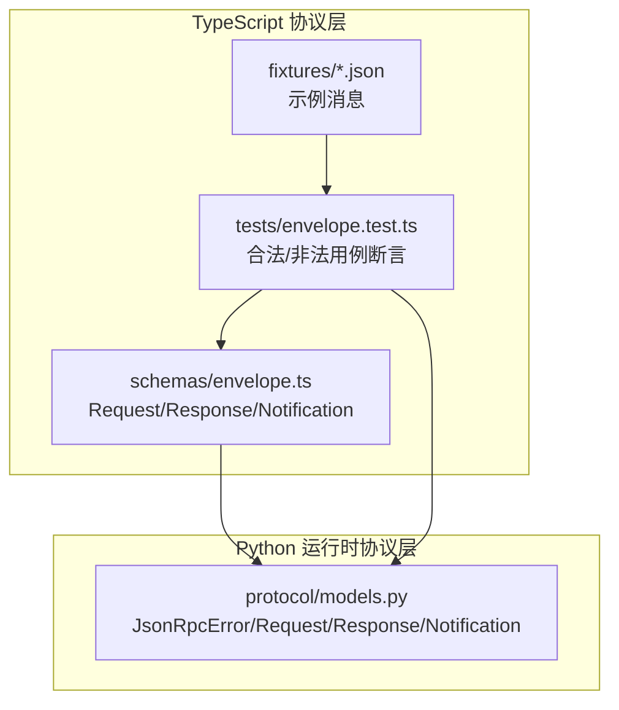
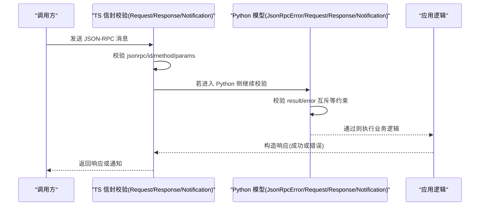
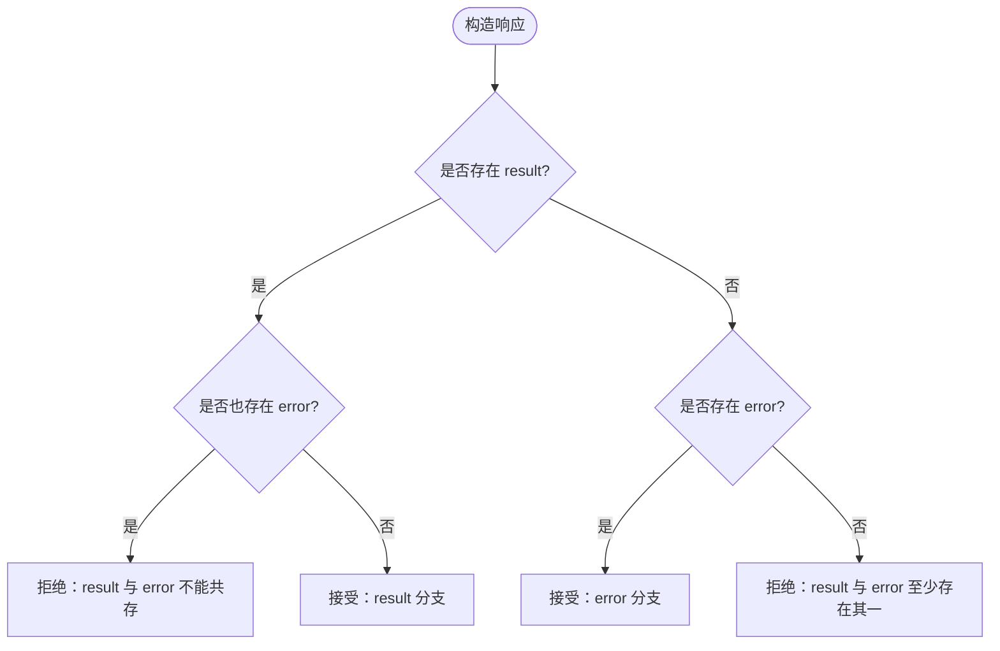
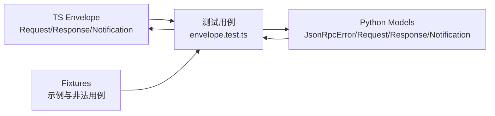

# 消息信封格式

<cite>
**本文引用的文件**
- [packages/protocol/schemas/envelope.ts](file://packages/protocol/schemas/envelope.ts)
- [services/agent-runtime/src/personal_agent/protocol/models.py](file://services/agent-runtime/src/personal_agent/protocol/models.py)
- [packages/protocol/fixtures/ping.request.json](file://packages/protocol/fixtures/ping.request.json)
- [packages/protocol/fixtures/ping.response.json](file://packages/protocol/fixtures/ping.response.json)
- [packages/protocol/fixtures/initialize.request.json](file://packages/protocol/fixtures/initialize.request.json)
- [packages/protocol/fixtures/initialize.response.json](file://packages/protocol/fixtures/initialize.response.json)
- [packages/protocol/fixtures/host-execute-tool.request.json](file://packages/protocol/fixtures/host-execute-tool.request.json)
- [packages/protocol/fixtures/host-execute-tool.response.json](file://packages/protocol/fixtures/host-execute-tool.response.json)
- [packages/protocol/fixtures/host-filesystem-list.request.json](file://packages/protocol/fixtures/host-filesystem-list.request.json)
- [packages/protocol/fixtures/host-filesystem-list.response.json](file://packages/protocol/fixtures/host-filesystem-list.response.json)
- [packages/protocol/fixtures/invalid/request-missing-id.json](file://packages/protocol/fixtures/invalid/request-missing-id.json)
- [packages/protocol/fixtures/invalid/response-both-result-and-error.json](file://packages/protocol/fixtures/invalid/response-both-result-and-error.json)
- [packages/protocol/tests/envelope.test.ts](file://packages/protocol/tests/envelope.test.ts)
</cite>

## 目录
1. [简介](#简介)
2. [项目结构](#项目结构)
3. [核心组件](#核心组件)
4. [架构总览](#架构总览)
5. [详细组件分析](#详细组件分析)
6. [依赖关系分析](#依赖关系分析)
7. [性能考虑](#性能考虑)
8. [故障排查指南](#故障排查指南)
9. [结论](#结论)
10. [附录：示例与最佳实践](#附录示例与最佳实践)

## 简介
本文件围绕 JSON-RPC 消息“信封”（envelope）格式，系统化说明请求、响应与通知三种消息类型的结构与字段约束；解释 jsonrpc 版本标识、id 唯一性要求、method 命名规范以及 params 参数传递机制；明确响应中 result 与 error 的互斥关系与错误对象结构；提供完整消息示例、验证规则与最佳实践建议。文档同时覆盖 TypeScript（Zod）与 Python（Pydantic）两端实现，确保跨语言一致性。

## 项目结构
协议契约由两部分共同定义并校验：
- TypeScript 侧使用 Zod 在 packages/protocol/schemas/envelope.ts 中定义通用信封 Request、Response、Notification 及方法名正则。
- Python 侧在 services/agent-runtime/src/personal_agent/protocol/models.py 中以 Pydantic 模型镜像 TS 定义，保证两端一致。
- 测试与示例集中在 packages/protocol/tests/envelope.test.ts 与 fixtures 目录，用于断言合法/非法消息的接受与拒绝行为。

图表来源
- [packages/protocol/schemas/envelope.ts:1-41](file://packages/protocol/schemas/envelope.ts#L1-L41)
- [services/agent-runtime/src/personal_agent/protocol/models.py:8-38](file://services/agent-runtime/src/personal_agent/protocol/models.py#L8-L38)
- [packages/protocol/tests/envelope.test.ts:194-234](file://packages/protocol/tests/envelope.test.ts#L194-L234)

章节来源
- [packages/protocol/schemas/envelope.ts:1-41](file://packages/protocol/schemas/envelope.ts#L1-L41)
- [services/agent-runtime/src/personal_agent/protocol/models.py:8-38](file://services/agent-runtime/src/personal_agent/protocol/models.py#L8-L38)
- [packages/protocol/tests/envelope.test.ts:194-234](file://packages/protocol/tests/envelope.test.ts#L194-L234)

## 核心组件
- 版本标识：所有信封必须包含 jsonrpc 字段且值为字符串字面量 "2.0"。
- 请求（Request）：
  - 必需字段：jsonrpc、id、method、params。
  - id：非空字符串，用于关联请求与响应。
  - method：遵循命名规范的小写字母开头、可带点分隔的多段标识符。
  - params：任意类型，但必须存在（可为空对象）。
- 响应（Response）：
  - 必需字段：jsonrpc、id。
  - result 与 error 二选一且不可同时出现或同时缺失。
  - error 对象包含 code、message，可选 data。
- 通知（Notification）：
  - 无 id。
  - 必需字段：jsonrpc、method、params。

章节来源
- [packages/protocol/schemas/envelope.ts:5-40](file://packages/protocol/schemas/envelope.ts#L5-L40)
- [services/agent-runtime/src/personal_agent/protocol/models.py:14-38](file://services/agent-runtime/src/personal_agent/protocol/models.py#L14-L38)

## 架构总览
下图展示请求-响应-通知三类消息在两端（TS/Python）的校验与流转关系。

图表来源
- [packages/protocol/schemas/envelope.ts:5-40](file://packages/protocol/schemas/envelope.ts#L5-L40)
- [services/agent-runtime/src/personal_agent/protocol/models.py:14-38](file://services/agent-runtime/src/personal_agent/protocol/models.py#L14-L38)

## 详细组件分析

### 请求（Request）
- 字段与约束
  - jsonrpc: 固定为 "2.0"。
  - id: 非空字符串，用于匹配响应。
  - method: 必须符合命名规范（小写开头，允许点号分段）。
  - params: 必须存在，可为任意值（常见为空对象）。
- 示例
  - 系统 ping 请求：参见 [packages/protocol/fixtures/ping.request.json](file://packages/protocol/fixtures/ping.request.json)。
  - 初始化请求：参见 [packages/protocol/fixtures/initialize.request.json](file://packages/protocol/fixtures/initialize.request.json)。
  - host.execute_tool 请求：参见 [packages/protocol/fixtures/host-execute-tool.request.json](file://packages/protocol/fixtures/host-execute-tool.request.json)。
- 常见错误模式
  - 缺少 id：参见 [packages/protocol/fixtures/invalid/request-missing-id.json](file://packages/protocol/fixtures/invalid/request-missing-id.json)，会被拒绝。
  - method 不符合命名规范：将被 Zod/Pydantic 的正则拒绝。
- 验证要点
  - 测试用例断言非法请求被拒绝：参见 [packages/protocol/tests/envelope.test.ts:208-234](file://packages/protocol/tests/envelope.test.ts#L208-L234)。

章节来源
- [packages/protocol/schemas/envelope.ts:5-10](file://packages/protocol/schemas/envelope.ts#L5-L10)
- [services/agent-runtime/src/personal_agent/protocol/models.py:14-19](file://services/agent-runtime/src/personal_agent/protocol/models.py#L14-L19)
- [packages/protocol/fixtures/ping.request.json:1-7](file://packages/protocol/fixtures/ping.request.json#L1-L7)
- [packages/protocol/fixtures/initialize.request.json:1-22](file://packages/protocol/fixtures/initialize.request.json#L1-L22)
- [packages/protocol/fixtures/host-execute-tool.request.json:1-13](file://packages/protocol/fixtures/host-execute-tool.request.json#L1-L13)
- [packages/protocol/fixtures/invalid/request-missing-id.json:1-6](file://packages/protocol/fixtures/invalid/request-missing-id.json#L1-L6)
- [packages/protocol/tests/envelope.test.ts:208-234](file://packages/protocol/tests/envelope.test.ts#L208-L234)

### 响应（Response）
- 字段与约束
  - jsonrpc: 固定为 "2.0"。
  - id: 与请求对应。
  - result 与 error 互斥：二者有且仅有一个存在。
  - error 对象：code（字符串）、message（字符串）、data（可选）。
- 示例
  - 成功响应（ping）：参见 [packages/protocol/fixtures/ping.response.json](file://packages/protocol/fixtures/ping.response.json)。
  - 成功响应（host.execute_tool）：参见 [packages/protocol/fixtures/host-execute-tool.response.json](file://packages/protocol/fixtures/host-execute-tool.response.json)。
  - 失败响应（能力执行失败）：参见 [packages/protocol/fixtures/host-filesystem-list.response.json](file://packages/protocol/fixtures/host-filesystem-list.response.json)。
- 常见错误模式
  - 同时包含 result 和 error：参见 [packages/protocol/fixtures/invalid/response-both-result-and-error.json](file://packages/protocol/fixtures/invalid/response-both-result-and-error.json)，将被拒绝。
  - 两者都缺失：测试断言会拒绝此类响应。
- 验证要点
  - 测试用例断言非法响应被拒绝：参见 [packages/protocol/tests/envelope.test.ts:208-234](file://packages/protocol/tests/envelope.test.ts#L208-L234)。

图表来源
- [packages/protocol/schemas/envelope.ts:12-34](file://packages/protocol/schemas/envelope.ts#L12-L34)
- [services/agent-runtime/src/personal_agent/protocol/models.py:21-31](file://services/agent-runtime/src/personal_agent/protocol/models.py#L21-L31)
- [packages/protocol/tests/envelope.test.ts:439-455](file://packages/protocol/tests/envelope.test.ts#L439-L455)

章节来源
- [packages/protocol/schemas/envelope.ts:12-34](file://packages/protocol/schemas/envelope.ts#L12-L34)
- [services/agent-runtime/src/personal_agent/protocol/models.py:21-31](file://services/agent-runtime/src/personal_agent/protocol/models.py#L21-L31)
- [packages/protocol/fixtures/ping.response.json:1-6](file://packages/protocol/fixtures/ping.response.json#L1-L6)
- [packages/protocol/fixtures/host-execute-tool.response.json:1-18](file://packages/protocol/fixtures/host-execute-tool.response.json#L1-L18)
- [packages/protocol/fixtures/host-filesystem-list.response.json:1-22](file://packages/protocol/fixtures/host-filesystem-list.response.json#L1-L22)
- [packages/protocol/fixtures/invalid/response-both-result-and-error.json:1-7](file://packages/protocol/fixtures/invalid/response-both-result-and-error.json#L1-L7)
- [packages/protocol/tests/envelope.test.ts:439-455](file://packages/protocol/tests/envelope.test.ts#L439-L455)

### 通知（Notification）
- 字段与约束
  - 无 id。
  - jsonrpc: 固定为 "2.0"。
  - method: 符合命名规范。
  - params: 必须存在，可为任意值。
- 用途
  - 单向事件上报，无需等待响应。
- 示例
  - 可在业务中按相同 envelope 结构构造通知（如能力调用事件），参考方法命名与 params 约定。

章节来源
- [packages/protocol/schemas/envelope.ts:36-40](file://packages/protocol/schemas/envelope.ts#L36-L40)
- [services/agent-runtime/src/personal_agent/protocol/models.py:34-38](file://services/agent-runtime/src/personal_agent/protocol/models.py#L34-L38)

### 方法命名规范（method）
- 规则
  - 以小写字母开头。
  - 可由多段组成，段间以点号分隔。
  - 每段均由小写字母、数字和下划线构成。
- 示例
  - system.initialize、system.ping、host.execute_tool、agent.make_plan、agent.run_task 等均符合规范。
- 验证
  - TS 使用正则表达式进行校验；Python 使用相同模式的 Field(pattern=...)。

章节来源
- [packages/protocol/schemas/envelope.ts:3-9](file://packages/protocol/schemas/envelope.ts#L3-L9)
- [services/agent-runtime/src/personal_agent/protocol/models.py:5-18](file://services/agent-runtime/src/personal_agent/protocol/models.py#L5-L18)
- [packages/protocol/fixtures/initialize.request.json:1-22](file://packages/protocol/fixtures/initialize.request.json#L1-L22)
- [packages/protocol/fixtures/host-execute-tool.request.json:1-13](file://packages/protocol/fixtures/host-execute-tool.request.json#L1-L13)
- [packages/protocol/fixtures/agent-make-plan.request.json:1-10](file://packages/protocol/fixtures/agent-make-plan.request.json#L1-L10)
- [packages/protocol/fixtures/agent-run-task.request.json:1-10](file://packages/protocol/fixtures/agent-run-task.request.json#L1-L10)

### 参数传递机制（params）
- 通用规则
  - 请求与通知均必须包含 params 字段。
  - params 可为任意类型，常见为空对象 {}。
- 场景化约定
  - host.execute_tool 的 params.arguments 承载具体能力参数（如文件系统操作、PDF 提取等）。
  - agent.* 系列方法的 params 携带任务相关参数（如 taskId、goal）。
- 示例
  - host.execute_tool 请求：参见 [packages/protocol/fixtures/host-execute-tool.request.json](file://packages/protocol/fixtures/host-execute-tool.request.json)。
  - 文件系统列表请求：参见 [packages/protocol/fixtures/host-filesystem-list.request.json](file://packages/protocol/fixtures/host-filesystem-list.request.json)。

章节来源
- [packages/protocol/schemas/envelope.ts:5-10](file://packages/protocol/schemas/envelope.ts#L5-L10)
- [services/agent-runtime/src/personal_agent/protocol/models.py:14-19](file://services/agent-runtime/src/personal_agent/protocol/models.py#L14-L19)
- [packages/protocol/fixtures/host-execute-tool.request.json:1-13](file://packages/protocol/fixtures/host-execute-tool.request.json#L1-L13)
- [packages/protocol/fixtures/host-filesystem-list.request.json:1-13](file://packages/protocol/fixtures/host-filesystem-list.request.json#L1-L13)

### 错误对象（error）
- 结构
  - code: 字符串，表示错误类别。
  - message: 字符串，人类可读的错误信息。
  - data: 可选，附加数据。
- 使用原则
  - 仅在响应中使用，且与 result 互斥。
  - 业务层面的失败（如 PDF 损坏）可通过特定结果结构表达，不一定走 error。
- 示例
  - 非法响应示例（同时包含 result 与 error）：参见 [packages/protocol/fixtures/invalid/response-both-result-and-error.json](file://packages/protocol/fixtures/invalid/response-both-result-and-error.json)。

章节来源
- [packages/protocol/schemas/envelope.ts:17-23](file://packages/protocol/schemas/envelope.ts#L17-L23)
- [services/agent-runtime/src/personal_agent/protocol/models.py:8-12](file://services/agent-runtime/src/personal_agent/protocol/models.py#L8-L12)
- [packages/protocol/fixtures/invalid/response-both-result-and-error.json:1-7](file://packages/protocol/fixtures/invalid/response-both-result-and-error.json#L1-L7)

## 依赖关系分析
- 两端模型强耦合：TS 的 Zod 定义与 Python 的 Pydantic 模型保持字段与约束一致，确保 wire 层兼容性。
- 测试驱动契约：通过 fixtures 与单元测试，强制所有合法消息通过、非法消息被拒。
- 扩展点：新增方法或参数时，需同步更新 TS 与 Python 两侧模型，并在测试中添加用例。

图表来源
- [packages/protocol/tests/envelope.test.ts:194-234](file://packages/protocol/tests/envelope.test.ts#L194-L234)
- [packages/protocol/schemas/envelope.ts:5-40](file://packages/protocol/schemas/envelope.ts#L5-L40)
- [services/agent-runtime/src/personal_agent/protocol/models.py:14-38](file://services/agent-runtime/src/personal_agent/protocol/models.py#L14-L38)

章节来源
- [packages/protocol/tests/envelope.test.ts:194-234](file://packages/protocol/tests/envelope.test.ts#L194-L234)

## 性能考虑
- 校验成本：Zod 与 Pydantic 的解析与校验开销较低，适合在高吞吐场景下作为入口网关。
- 建议
  - 尽早校验：在网络边界对信封进行快速校验，减少无效负载进入业务层。
  - 复用常量：将方法名、错误码等常量集中管理，避免重复定义导致漂移。
  - 批量处理：对通知类消息可采用批处理降低序列化/反序列化开销。

## 故障排查指南
- 常见问题
  - 缺少 id：请求必须包含非空 id，否则被拒绝。
  - result 与 error 同时存在或缺失：响应必须满足互斥且至少存在其一。
  - method 不合规：不符合命名规范的方法名将被拒绝。
  - params 缺失：请求与通知必须包含 params。
- 定位步骤
  - 使用测试中的非法用例对照检查：参见 [packages/protocol/tests/envelope.test.ts:208-234](file://packages/protocol/tests/envelope.test.ts#L208-L234)。
  - 检查两端模型定义是否一致：对比 TS 与 Python 的字段与约束。
  - 查看错误对象：确认 error.code 与 error.message 是否清晰指向问题根因。

章节来源
- [packages/protocol/tests/envelope.test.ts:208-234](file://packages/protocol/tests/envelope.test.ts#L208-L234)
- [packages/protocol/schemas/envelope.ts:5-40](file://packages/protocol/schemas/envelope.ts#L5-L40)
- [services/agent-runtime/src/personal_agent/protocol/models.py:14-38](file://services/agent-runtime/src/personal_agent/protocol/models.py#L14-L38)

## 结论
本项目的 JSON-RPC 信封格式在 TS 与 Python 两端保持一致的严格约束：统一的版本标识、严格的 method 命名、明确的 id 与 params 要求，以及响应中 result 与 error 的互斥规则。通过丰富的 fixtures 与测试用例，确保了消息格式的健壮性与可维护性。遵循本文档的验证规则与最佳实践，可有效避免协议漂移与线上错误。

## 附录：示例与最佳实践

### 完整消息示例
- 系统 ping
  - 请求：[packages/protocol/fixtures/ping.request.json](file://packages/protocol/fixtures/ping.request.json)
  - 响应：[packages/protocol/fixtures/ping.response.json](file://packages/protocol/fixtures/ping.response.json)
- 初始化
  - 请求：[packages/protocol/fixtures/initialize.request.json](file://packages/protocol/fixtures/initialize.request.json)
  - 响应：[packages/protocol/fixtures/initialize.response.json](file://packages/protocol/fixtures/initialize.response.json)
- 主机工具执行
  - 请求：[packages/protocol/fixtures/host-execute-tool.request.json](file://packages/protocol/fixtures/host-execute-tool.request.json)
  - 响应：[packages/protocol/fixtures/host-execute-tool.response.json](file://packages/protocol/fixtures/host-execute-tool.response.json)
- 文件系统列表
  - 请求：[packages/protocol/fixtures/host-filesystem-list.request.json](file://packages/protocol/fixtures/host-filesystem-list.request.json)
  - 响应：[packages/protocol/fixtures/host-filesystem-list.response.json](file://packages/protocol/fixtures/host-filesystem-list.response.json)

### 常见错误模式
- 缺少 id：[packages/protocol/fixtures/invalid/request-missing-id.json](file://packages/protocol/fixtures/invalid/request-missing-id.json)
- 同时包含 result 与 error：[packages/protocol/fixtures/invalid/response-both-result-and-error.json](file://packages/protocol/fixtures/invalid/response-both-result-and-error.json)

### 验证规则清单
- 所有信封必须包含 jsonrpc = "2.0"。
- 请求必须包含非空 id 与符合命名规范的 method，且必须包含 params。
- 通知必须包含 method 与 params，且不包含 id。
- 响应必须包含 id，且 result 与 error 有且仅有一个存在。
- error 对象必须包含 code 与 message，data 可选。

### 最佳实践建议
- 统一方法命名：采用小写、点分段的命名方式，便于分类与路由。
- 严格校验入参：在网络边界进行信封与参数校验，尽早失败。
- 明确错误语义：error 用于协议/系统级错误；业务失败优先通过结果结构表达。
- 保持两端一致：新增字段或约束时，同步更新 TS 与 Python 模型，并补充测试用例。
- 使用 fixtures 回归：将典型消息与非法用例纳入回归测试，防止协议漂移。