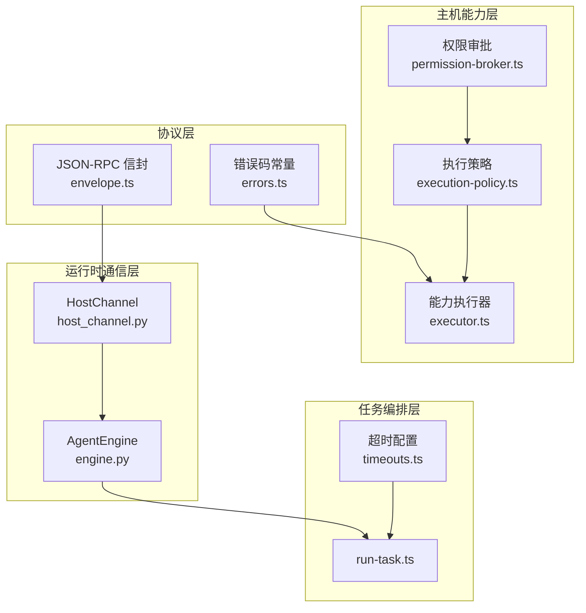
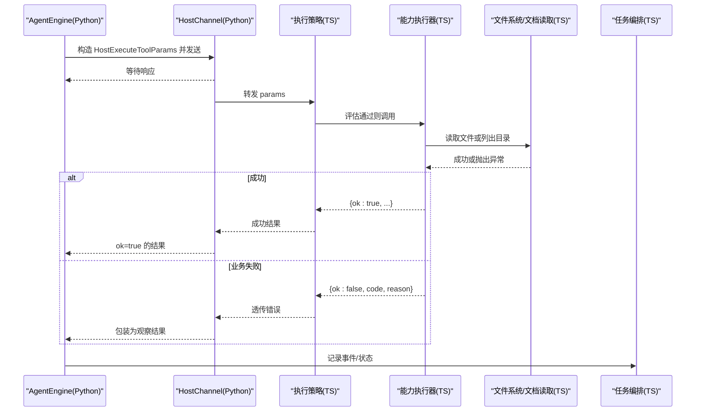
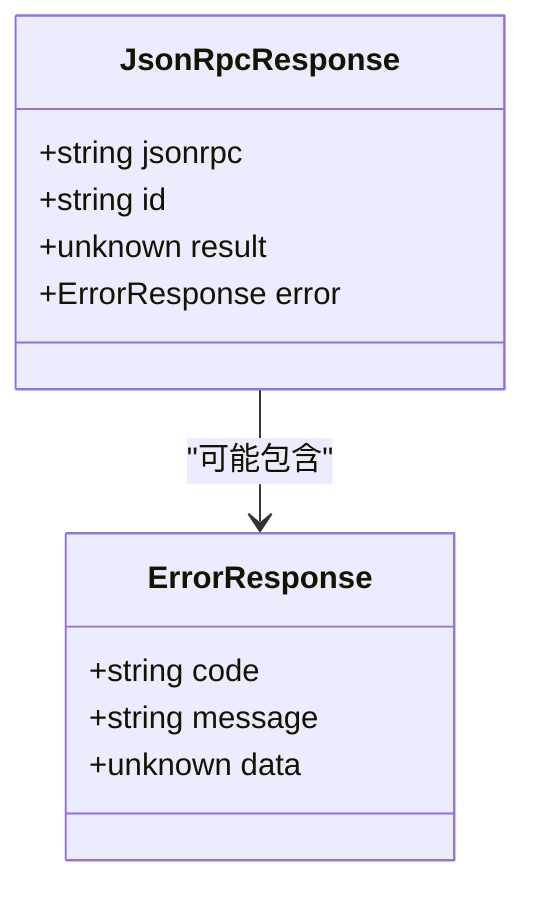
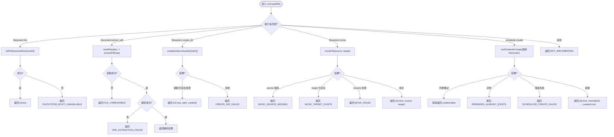
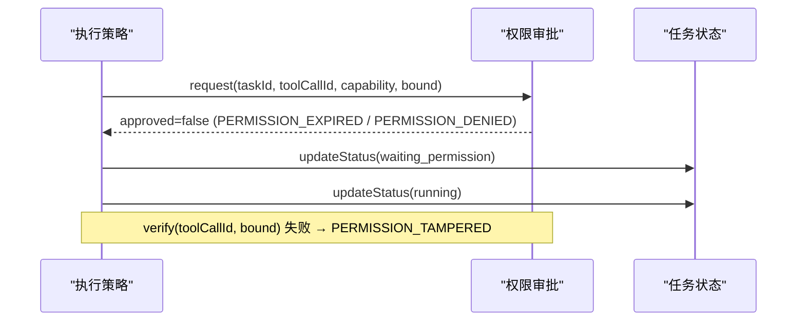
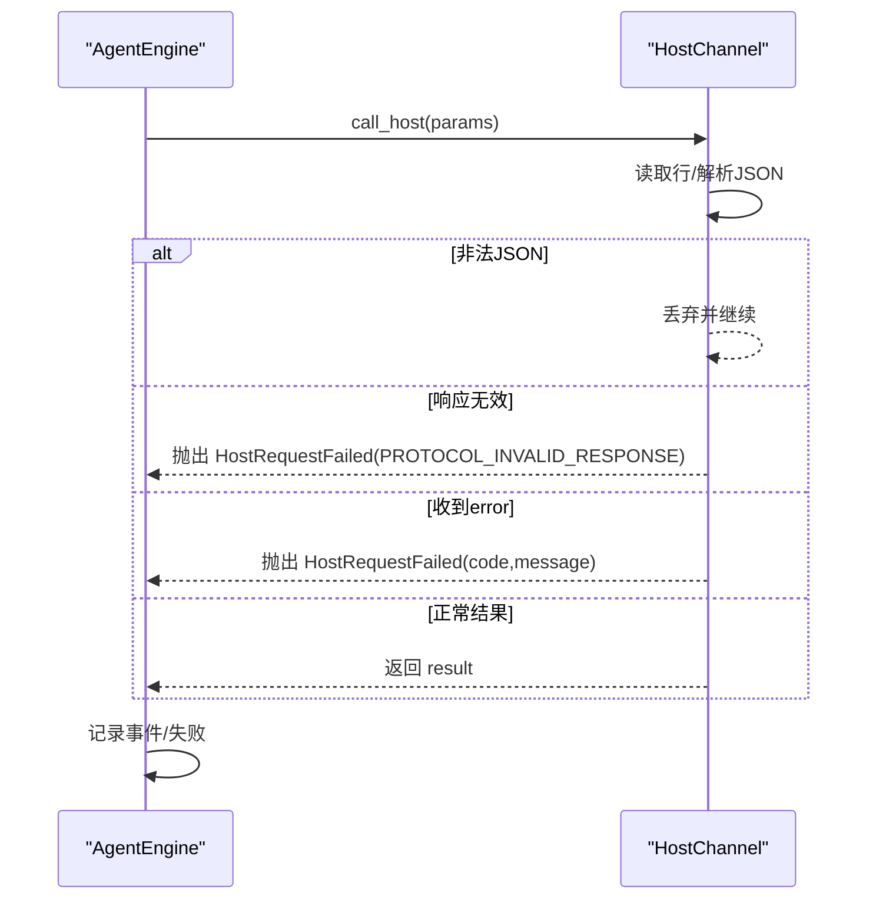
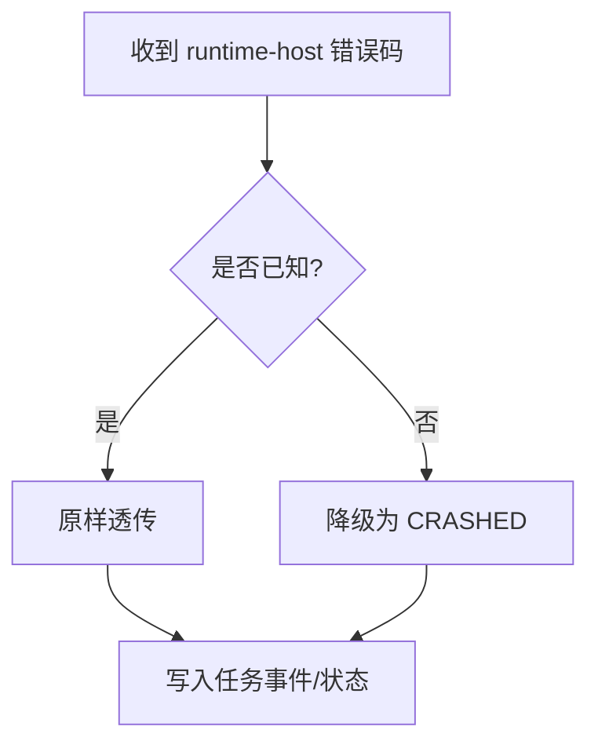
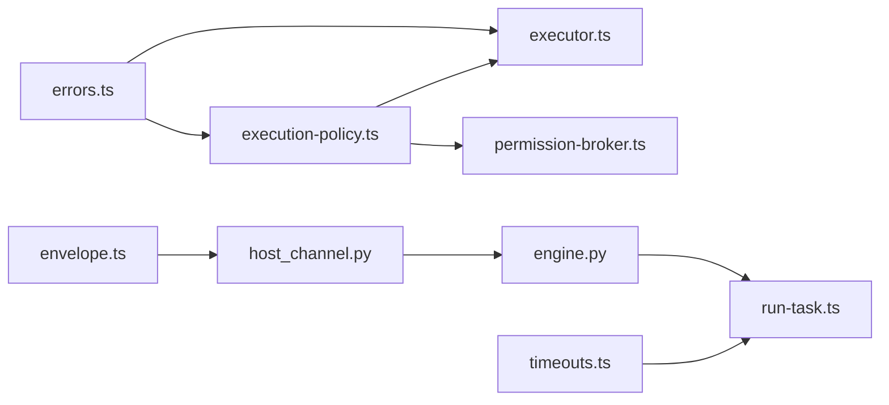

# 错误处理机制

<cite>
**本文引用的文件**
- [packages/protocol/schemas/errors.ts](file://packages/protocol/schemas/errors.ts)
- [packages/protocol/schemas/envelope.ts](file://packages/protocol/schemas/envelope.ts)
- [apps/desktop/src/main/runtime/error-code.ts](file://apps/desktop/src/main/runtime/error-code.ts)
- [apps/desktop/src/main/capabilities/executor.ts](file://apps/desktop/src/main/capabilities/executor.ts)
- [apps/desktop/src/main/capabilities/filesystem-create-dir.ts](file://apps/desktop/src/main/capabilities/filesystem-create-dir.ts)
- [apps/desktop/src/main/capabilities/filesystem-move.ts](file://apps/desktop/src/main/capabilities/filesystem-move.ts)
- [apps/desktop/src/main/capabilities/idempotency.ts](file://apps/desktop/src/main/capabilities/idempotency.ts)
- [apps/desktop/src/main/policy/argument-binders.ts](file://apps/desktop/src/main/policy/argument-binders.ts)
- [apps/desktop/src/main/policy/execution-policy.ts](file://apps/desktop/src/main/policy/execution-policy.ts)
- [apps/desktop/src/main/permission/permission-broker.ts](file://apps/desktop/src/main/permission/permission-broker.ts)
- [apps/desktop/src/main/runtime/timeouts.ts](file://apps/desktop/src/main/runtime/timeouts.ts)
- [services/agent-runtime/src/personal_agent/host_channel.py](file://services/agent-runtime/src/personal_agent/host_channel.py)
- [services/agent-runtime/src/personal_agent/engine.py](file://services/agent-runtime/src/personal_agent/engine.py)
- [apps/desktop/src/main/tasks/run-task.ts](file://apps/desktop/src/main/tasks/run-task.ts)
</cite>

## 目录
1. [简介](#简介)
2. [项目结构](#项目结构)
3. [核心组件](#核心组件)
4. [架构总览](#架构总览)
5. [详细组件分析](#详细组件分析)
6. [依赖关系分析](#依赖关系分析)
7. [性能与超时考量](#性能与超时考量)
8. [故障排除指南](#故障排除指南)
9. [结论](#结论)
10. [附录：错误码速查](#附录错误码速查)

## 简介
本文件系统性梳理本项目中 JSON-RPC 错误处理机制，覆盖错误码体系、错误对象结构、跨层错误传播策略、异常场景（超时、权限拒绝、资源不可用等）的处理方式，并提供调试与排障建议。目标是让读者既能理解整体设计，也能在实际开发中正确捕获和处理各类错误。

## 项目结构
错误处理贯穿协议定义、主机能力执行、权限审批、运行时通信以及任务编排等多个层次：
- 协议层：定义 JSON-RPC 响应结构与错误对象字段规范。
- 主机能力层：将业务失败映射为统一错误码并返回结构化结果。
- 权限审批层：在需要时挂起请求，并在过期、拒绝或篡改时返回特定错误码。
- 运行时通信层：Python 侧对 TS 的 Host 调用进行校验与错误转换。
- 任务编排层：聚合事件与错误，决定最终任务状态。

图表来源
- [packages/protocol/schemas/errors.ts:1-30](file://packages/protocol/schemas/errors.ts#L1-L30)
- [packages/protocol/schemas/envelope.ts:12-34](file://packages/protocol/schemas/envelope.ts#L12-L34)
- [apps/desktop/src/main/capabilities/executor.ts:73-113](file://apps/desktop/src/main/capabilities/executor.ts#L73-L113)
- [apps/desktop/src/main/policy/execution-policy.ts:82-147](file://apps/desktop/src/main/policy/execution-policy.ts#L82-L147)
- [apps/desktop/src/main/permission/permission-broker.ts:137-180](file://apps/desktop/src/main/permission/permission-broker.ts#L137-L180)
- [services/agent-runtime/src/personal_agent/host_channel.py:45-85](file://services/agent-runtime/src/personal_agent/host_channel.py#L45-L85)
- [services/agent-runtime/src/personal_agent/engine.py:98-171](file://services/agent-runtime/src/personal_agent/engine.py#L98-L171)
- [apps/desktop/src/main/runtime/timeouts.ts:1-13](file://apps/desktop/src/main/runtime/timeouts.ts#L1-L13)
- [apps/desktop/src/main/tasks/run-task.ts:25-37](file://apps/desktop/src/main/tasks/run-task.ts#L25-L37)

章节来源
- [packages/protocol/schemas/errors.ts:1-30](file://packages/protocol/schemas/errors.ts#L1-L30)
- [packages/protocol/schemas/envelope.ts:12-34](file://packages/protocol/schemas/envelope.ts#L12-L34)
- [apps/desktop/src/main/capabilities/executor.ts:73-113](file://apps/desktop/src/main/capabilities/executor.ts#L73-L113)
- [apps/desktop/src/main/policy/execution-policy.ts:82-147](file://apps/desktop/src/main/policy/execution-policy.ts#L82-L147)
- [apps/desktop/src/main/permission/permission-broker.ts:137-180](file://apps/desktop/src/main/permission/permission-broker.ts#L137-L180)
- [services/agent-runtime/src/personal_agent/host_channel.py:45-85](file://services/agent-runtime/src/personal_agent/host_channel.py#L45-L85)
- [services/agent-runtime/src/personal_agent/engine.py:98-171](file://services/agent-runtime/src/personal_agent/engine.py#L98-L171)
- [apps/desktop/src/main/runtime/timeouts.ts:1-13](file://apps/desktop/src/main/runtime/timeouts.ts#L1-L13)
- [apps/desktop/src/main/tasks/run-task.ts:25-37](file://apps/desktop/src/main/tasks/run-task.ts#L25-L37)

## 核心组件
- 错误码体系
  - 协议层集中维护标准错误码集合，用于跨进程/语言边界传递。
  - 运行时层维护运行时相关错误码，用于内部状态机与 IPC 透传。
- JSON-RPC 错误对象
  - 响应体必须包含 jsonrpc、id，且 result 与 error 互斥。
  - error 对象包含 code、message，可选 data 携带附加信息。
- 能力执行器
  - 负责将具体能力实现中的异常转换为统一错误码与消息（含 create_dir/move/scheduler.create 的专属业务码）。
- 参数绑定器
  - 契约校验与时间语义判定（如 REMINDER_TIME_IN_PAST），失败以稳定错误码返回。
- 幂等关
  - WRITE 能力执行前后查重；矛盾态 reject 时在结果载荷中使用 IDEMPOTENCY_CONFLICT（不属于 ERROR_CODE 表）。
- 执行策略
  - 八级校验管道：注册检查、Scope 检查、任务对齐、参数绑定、风险与批准、路径守卫等。
- 权限审批
  - 支持请求、验证、过期、拒绝、篡改等分支，均返回明确错误码。
- 运行时通信
  - Python 侧对 TS 的 Host 调用进行 JSON 解析、契约校验与错误转换。
- 任务编排
  - 汇总事件与错误，决定任务完成或失败；对未知错误码进行降级处理。

章节来源
- [packages/protocol/schemas/errors.ts:1-30](file://packages/protocol/schemas/errors.ts#L1-L30)
- [packages/protocol/schemas/envelope.ts:12-34](file://packages/protocol/schemas/envelope.ts#L12-L34)
- [apps/desktop/src/main/capabilities/executor.ts:73-113](file://apps/desktop/src/main/capabilities/executor.ts#L73-L113)
- [apps/desktop/src/main/policy/execution-policy.ts:82-147](file://apps/desktop/src/main/policy/execution-policy.ts#L82-L147)
- [apps/desktop/src/main/permission/permission-broker.ts:137-180](file://apps/desktop/src/main/permission/permission-broker.ts#L137-L180)
- [services/agent-runtime/src/personal_agent/host_channel.py:45-85](file://services/agent-runtime/src/personal_agent/host_channel.py#L45-L85)
- [services/agent-runtime/src/personal_agent/engine.py:98-171](file://services/agent-runtime/src/personal_agent/engine.py#L98-L171)
- [apps/desktop/src/main/tasks/run-task.ts:25-37](file://apps/desktop/src/main/tasks/run-task.ts#L25-L37)

## 架构总览
下图展示一次工具调用的端到端流程与错误传播路径：从 Agent 引擎发起 Host 调用，到 TS 侧能力执行、权限审批、文件系统访问，再到错误回传与任务状态更新。

图表来源
- [services/agent-runtime/src/personal_agent/engine.py:98-171](file://services/agent-runtime/src/personal_agent/engine.py#L98-L171)
- [services/agent-runtime/src/personal_agent/host_channel.py:45-85](file://services/agent-runtime/src/personal_agent/host_channel.py#L45-L85)
- [apps/desktop/src/main/policy/execution-policy.ts:82-147](file://apps/desktop/src/main/policy/execution-policy.ts#L82-L147)
- [apps/desktop/src/main/capabilities/executor.ts:121-276](file://apps/desktop/src/main/capabilities/executor.ts#L121-L276)

## 详细组件分析

### 错误码体系与错误对象结构
- 标准错误码（协议层）
  - 覆盖协议、方法、权限、路径、文件、PDF 提取等常见场景，现共 28 个。
  - 文件系统写入类：CREATE_DIR_FAILED、MOVE_SOURCE_MISSING、MOVE_TARGET_EXISTS、MOVE_FAILED。
  - Reminder 调度类：REMINDER_TIME_IN_PAST、REMINDER_ALREADY_EXISTS、SCHEDULER_CREATE_FAILED。
- 运行时错误码（TS 运行时）
  - 覆盖启动、超时、取消、崩溃、握手失败、响应无效、计划无效、数据库失败、任务忙、孤儿等。
- JSON-RPC 错误对象
  - code：字符串错误码，需来自已知集合或运行时错误码集合。
  - message：人类可读的错误描述。
  - data：可选，承载额外上下文（如路径、参数指纹等）。

图表来源
- [packages/protocol/schemas/envelope.ts:12-34](file://packages/protocol/schemas/envelope.ts#L12-L34)
- [packages/protocol/schemas/errors.ts:1-30](file://packages/protocol/schemas/errors.ts#L1-L30)
- [apps/desktop/src/main/runtime/error-code.ts:1-18](file://apps/desktop/src/main/runtime/error-code.ts#L1-L18)

章节来源
- [packages/protocol/schemas/errors.ts:1-30](file://packages/protocol/schemas/errors.ts#L1-L30)
- [packages/protocol/schemas/envelope.ts:12-34](file://packages/protocol/schemas/envelope.ts#L12-L34)
- [apps/desktop/src/main/runtime/error-code.ts:1-18](file://apps/desktop/src/main/runtime/error-code.ts#L1-L18)

### 能力执行器的错误映射
- 未实现的能力：返回 NOT_IMPLEMENTED。
- 授权根不可用：返回 FILESYSTEM_ROOT_UNAVAILABLE。
- 文件读取失败：返回 FILE_UNREADABLE。
- PDF 解析失败：返回 PDF_EXTRACTION_FAILED。
- 创建目录失败：返回 CREATE_DIR_FAILED（目标已存在但不是目录、mkdir 失败，或执行器兜底捕获意外异常；目录已存在不是失败，幂等返回 created:false）。
- 移动文件失败：source 不存在返回 MOVE_SOURCE_MISSING；target 已存在返回 MOVE_TARGET_EXISTS（move 不幂等，拒绝覆盖）；rename 失败返回 MOVE_FAILED。
- 创建 Reminder 失败：未接线存储返回 NOT_IMPLEMENTED；任务已有 Reminder 且参数不同返回 REMINDER_ALREADY_EXISTS（同参重试则幂等返回 created:false）；落库异常返回 SCHEDULER_CREATE_FAILED。
- 所有失败均以 {ok:false, code, reason} 形式返回，便于上层统一处理。

图表来源
- [apps/desktop/src/main/capabilities/executor.ts:121-276](file://apps/desktop/src/main/capabilities/executor.ts#L121-L276)
- [apps/desktop/src/main/capabilities/filesystem-create-dir.ts:23-38](file://apps/desktop/src/main/capabilities/filesystem-create-dir.ts#L23-L38)
- [apps/desktop/src/main/capabilities/filesystem-move.ts:21-36](file://apps/desktop/src/main/capabilities/filesystem-move.ts#L21-L36)

章节来源
- [apps/desktop/src/main/capabilities/executor.ts:121-276](file://apps/desktop/src/main/capabilities/executor.ts#L121-L276)
- [apps/desktop/src/main/capabilities/filesystem-create-dir.ts:1-38](file://apps/desktop/src/main/capabilities/filesystem-create-dir.ts#L1-L38)
- [apps/desktop/src/main/capabilities/filesystem-move.ts:1-36](file://apps/desktop/src/main/capabilities/filesystem-move.ts#L1-L36)

### 参数绑定器与幂等关的错误码
- 参数绑定器（argument-binders.ts，Binder 层）：
  - scheduler.create 的 remindAt 无法解析为时间：返回 INVALID_ARGUMENT。
  - remindAt 不晚于当前时间：返回 REMINDER_TIME_IN_PAST——创建即过期的 Reminder 几乎必然是模型把相对时间解析错了，稳定错误码让模型有机会改口。这是「契约钉形状，语义归执行链」分层原则的体现：SchedulerCreateParams 契约只校验非空字符串，时间语义由 host 侧 binder 判定。
  - 各能力参数不符合 Zod 契约：统一返回 INVALID_ARGUMENT；路径类失败透传 path-guard 的 PATH_* 码。
- 幂等关（idempotency.ts，WRITE 能力执行前后）：
  - recovery resolver 判定结果未知或执行记录处于未知状态时，reject 并构造 { ok:false, code:"IDEMPOTENCY_CONFLICT", reason } 结果载荷。
  - **注意**：IDEMPOTENCY_CONFLICT 不在 errors.ts 的 ERROR_CODE 表中，它只出现在幂等关 reject 时构造的结果载荷里，与协议层标准错误码是两个来源。
  - scheduler.create 虽是 WRITE 但不进幂等关：其副作用是库内一行，reminders.task_id UNIQUE + 执行体内按 idempotencyKey 比对已覆盖「同参重试幂等返回、异参拒绝」。

章节来源
- [apps/desktop/src/main/policy/argument-binders.ts:115-170](file://apps/desktop/src/main/policy/argument-binders.ts#L115-L170)
- [apps/desktop/src/main/capabilities/idempotency.ts:154-190](file://apps/desktop/src/main/capabilities/idempotency.ts#L154-L190)
- [apps/desktop/src/main/capabilities/executor.ts:95-108](file://apps/desktop/src/main/capabilities/executor.ts#L95-L108)

### 执行策略与权限审批的错误流
- 八级校验管道：
  1) 能力是否已注册；2) 是否在 Scope；3) 是否有当前任务；4) 是否与计划对齐；5) 参数绑定与路径规范化；6) 风险评估；7) 权限审批；8) 放行计数。
- 权限审批分支：
  - 无审批通道：返回 PERMISSION_REQUIRED。
  - 审批超时：返回 PERMISSION_EXPIRED。
  - 用户拒绝：返回 PERMISSION_DENIED。
  - 参数被篡改或 ID 不匹配：返回 PERMISSION_TAMPERED。
- 任务状态管理：
  - 审批期间将任务置为 waiting_permission，结束后恢复 running。

图表来源
- [apps/desktop/src/main/policy/execution-policy.ts:82-147](file://apps/desktop/src/main/policy/execution-policy.ts#L82-L147)
- [apps/desktop/src/main/policy/execution-policy.ts:151-187](file://apps/desktop/src/main/policy/execution-policy.ts#L151-L187)
- [apps/desktop/src/main/permission/permission-broker.ts:137-180](file://apps/desktop/src/main/permission/permission-broker.ts#L137-L180)
- [apps/desktop/src/main/permission/permission-broker.ts:221-243](file://apps/desktop/src/main/permission/permission-broker.ts#L221-L243)

章节来源
- [apps/desktop/src/main/policy/execution-policy.ts:82-147](file://apps/desktop/src/main/policy/execution-policy.ts#L82-L147)
- [apps/desktop/src/main/policy/execution-policy.ts:151-187](file://apps/desktop/src/main/policy/execution-policy.ts#L151-L187)
- [apps/desktop/src/main/permission/permission-broker.ts:137-180](file://apps/desktop/src/main/permission/permission-broker.ts#L137-L180)
- [apps/desktop/src/main/permission/permission-broker.ts:221-243](file://apps/desktop/src/main/permission/permission-broker.ts#L221-L243)

### 运行时通信层的错误处理
- Python 侧 HostChannel：
  - 读取 stdin 行，过滤非响应消息。
  - JSON 解析失败：丢弃并继续。
  - 响应不符合契约：抛出 HostRequestFailed，code 为 PROTOCOL_INVALID_RESPONSE。
  - 收到 error 响应：直接抛出 HostRequestFailed，携带 code 与 message。
  - 既无 result 也无 error：视为无效响应。
- AgentEngine：
  - 捕获 HostRequestFailed 与 HostChannelClosed，转为任务失败事件与原因。
  - 对模型请求的 capability 不在协议枚举的情况，返回 CAPABILITY_NOT_REGISTERED 的观察结果。

图表来源
- [services/agent-runtime/src/personal_agent/host_channel.py:45-85](file://services/agent-runtime/src/personal_agent/host_channel.py#L45-L85)
- [services/agent-runtime/src/personal_agent/engine.py:210-236](file://services/agent-runtime/src/personal_agent/engine.py#L210-L236)

章节来源
- [services/agent-runtime/src/personal_agent/host_channel.py:45-85](file://services/agent-runtime/src/personal_agent/host_channel.py#L45-L85)
- [services/agent-runtime/src/personal_agent/engine.py:98-171](file://services/agent-runtime/src/personal_agent/engine.py#L98-L171)
- [services/agent-runtime/src/personal_agent/engine.py:210-236](file://services/agent-runtime/src/personal_agent/engine.py#L210-L236)

### 任务编排与错误码归一化
- 已知错误码集合：合并运行时错误码与协议错误码。
- 未知错误码降级：若从 runtime-host 收到的 code 不在已知集合，统一归为 CRASHED，避免 UI 无法识别的字符串泄露。
- 超时与预算：结合 RUN_TASK_TIMEOUT_MS 与步骤/工具调用上限控制。

图表来源
- [apps/desktop/src/main/tasks/run-task.ts:25-37](file://apps/desktop/src/main/tasks/run-task.ts#L25-L37)
- [apps/desktop/src/main/runtime/timeouts.ts:1-13](file://apps/desktop/src/main/runtime/timeouts.ts#L1-L13)

章节来源
- [apps/desktop/src/main/tasks/run-task.ts:25-37](file://apps/desktop/src/main/tasks/run-task.ts#L25-L37)
- [apps/desktop/src/main/runtime/timeouts.ts:1-13](file://apps/desktop/src/main/runtime/timeouts.ts#L1-L13)

## 依赖关系分析
- 协议层 errors.ts 被能力执行器与策略模块引用，确保错误码一致性。
- envelope.ts 约束响应结构，Python 侧据此校验。
- execution-policy.ts 依赖 retriever、scope、risk、argument-binders 等子模块，形成强内聚的策略层。
- permission-broker.ts 提供审批门控，与策略层解耦但通过 PermissionGate 接口交互。
- host_channel.py 与 engine.py 构成 Python 侧最小闭环，屏蔽底层通信细节。
- run-task.ts 作为 TS 侧任务编排入口，统一错误码归一化与超时控制。

图表来源
- [packages/protocol/schemas/errors.ts:1-30](file://packages/protocol/schemas/errors.ts#L1-L30)
- [packages/protocol/schemas/envelope.ts:12-34](file://packages/protocol/schemas/envelope.ts#L12-L34)
- [apps/desktop/src/main/policy/execution-policy.ts:82-147](file://apps/desktop/src/main/policy/execution-policy.ts#L82-L147)
- [apps/desktop/src/main/capabilities/executor.ts:73-113](file://apps/desktop/src/main/capabilities/executor.ts#L73-L113)
- [apps/desktop/src/main/permission/permission-broker.ts:137-180](file://apps/desktop/src/main/permission/permission-broker.ts#L137-L180)
- [services/agent-runtime/src/personal_agent/host_channel.py:45-85](file://services/agent-runtime/src/personal_agent/host_channel.py#L45-L85)
- [services/agent-runtime/src/personal_agent/engine.py:98-171](file://services/agent-runtime/src/personal_agent/engine.py#L98-L171)
- [apps/desktop/src/main/runtime/timeouts.ts:1-13](file://apps/desktop/src/main/runtime/timeouts.ts#L1-L13)
- [apps/desktop/src/main/tasks/run-task.ts:25-37](file://apps/desktop/src/main/tasks/run-task.ts#L25-L37)

## 性能与超时考量
- 单次工具调用超时：HOST_TOOL_TIMEOUT_MS = PERMISSION_TTL_MS + 余量，避免审批窗口过长导致整体阻塞。
- 任务总超时：RUN_TASK_TIMEOUT_MS = PYTHON_MAX_TOOL_CALLS * HOST_TOOL_TIMEOUT_MS + MODEL_SLACK_MS，防止长任务无限循环。
- 最大工具调用次数：PYTHON_MAX_TOOL_CALLS 限制单任务工具调用上限，配合预算耗尽事件。
- 建议：
  - 合理设置 PERMISSION_TTL_MS，兼顾用户体验与安全性。
  - 监控预算耗尽事件，优化模型决策与工具调用链。
  - 对慢 I/O（文件读取、PDF 解析）增加重试与熔断策略。

章节来源
- [apps/desktop/src/main/runtime/timeouts.ts:1-13](file://apps/desktop/src/main/runtime/timeouts.ts#L1-L13)
- [services/agent-runtime/src/personal_agent/engine.py:98-171](file://services/agent-runtime/src/personal_agent/engine.py#L98-L171)

## 故障排除指南
- 常见问题定位
  - 协议错误：检查 JSON-RPC 信封是否符合 schema，result 与 error 是否互斥。
  - 方法不存在：确认 method 命名符合模式，且能力已注册。
  - 权限问题：查看审批事件日志，确认是否过期或被拒绝。
  - 资源不可用：检查授权根是否存在、文件是否可读、PDF 是否损坏。
  - 写入操作失败：CREATE_DIR_FAILED 看目标是否被同名文件占用；MOVE_SOURCE_MISSING/MOVE_TARGET_EXISTS 核对 realpath 后的源与目标；REMINDER_TIME_IN_PAST 说明模型解析出的时刻已过期，REMINDER_ALREADY_EXISTS 说明同任务换了参数重复创建。
  - 运行时错误：关注 CRASHED 降级，排查新错误码是否登记。
- 调试技巧
  - 启用详细日志：在 HostChannel 与 Engine 中打印关键事件与错误。
  - 使用测试夹具：参考 fixtures 中的 invalid 用例，快速复现协议错误。
  - 断点策略：在执行策略与能力执行器处断点，观察 bound 参数与路径。
  - 超时模拟：缩短 TTL 或设置极小超时，验证超时分支。
- 排障清单
  - 是否已登记错误码？
  - 是否设置了审批通道？
  - 路径是否经过 root guard？
  - 是否记录了必要的事件？
  - 是否对未知错误码做了降级？

章节来源
- [packages/protocol/fixtures/invalid/request-bad-method.json:1-6](file://packages/protocol/fixtures/invalid/request-bad-method.json#L1-L6)
- [packages/protocol/fixtures/invalid/response-both-result-and-error.json:1-6](file://packages/protocol/fixtures/invalid/response-both-result-and-error.json#L1-L6)
- [services/agent-runtime/src/personal_agent/host_channel.py:45-85](file://services/agent-runtime/src/personal_agent/host_channel.py#L45-L85)
- [apps/desktop/src/main/policy/execution-policy.ts:82-147](file://apps/desktop/src/main/policy/execution-policy.ts#L82-L147)
- [apps/desktop/src/main/capabilities/executor.ts:121-276](file://apps/desktop/src/main/capabilities/executor.ts#L121-L276)
- [apps/desktop/src/main/tasks/run-task.ts:25-37](file://apps/desktop/src/main/tasks/run-task.ts#L25-L37)

## 结论
本项目的错误处理机制以协议层为中心，通过统一的错误码与错误对象结构，实现了从网络层到业务层的清晰错误传播。执行策略与权限审批提供了细粒度的安全与合规控制，运行时通信层确保了跨语言边界的健壮性。通过合理的超时与预算控制，系统能够在异常情况下优雅降级，并通过事件与日志辅助排障。建议在新增能力或错误场景时，遵循现有模式，保持错误码一致性与可观测性。

## 附录：错误码速查
- 协议层标准错误码（errors.ts，共 28 个）
  - PROTOCOL_INVALID_JSON、PROTOCOL_INVALID_REQUEST、METHOD_NOT_FOUND、NOT_IMPLEMENTED
  - FILESYSTEM_ROOT_UNAVAILABLE、HOST_HANDLER_FAILED、HOST_TIMEOUT、INVALID_ARGUMENT
  - CAPABILITY_OUT_OF_SCOPE、CAPABILITY_NOT_REGISTERED、PATH_OUT_OF_ROOT、PATH_ESCAPES_ROOT_VIA_LINK、PATH_UNC_NOT_ALLOWED
  - ACTION_NOT_ALIGNED、NO_ACTIVE_TASK、PERMISSION_REQUIRED、PERMISSION_DENIED、PERMISSION_EXPIRED、PERMISSION_TAMPERED
  - FILE_UNREADABLE、PDF_EXTRACTION_FAILED
  - CREATE_DIR_FAILED、MOVE_SOURCE_MISSING、MOVE_TARGET_EXISTS、MOVE_FAILED
  - REMINDER_TIME_IN_PAST、REMINDER_ALREADY_EXISTS、SCHEDULER_CREATE_FAILED
- 非 ERROR_CODE 表内的结果码
  - IDEMPOTENCY_CONFLICT：不在 errors.ts 的 ERROR_CODE 表中，只出现在幂等关（capabilities/idempotency.ts）reject 时构造的 { ok:false, code, reason } 结果载荷里。
- 运行时错误码（部分）
  - RUNTIME_NOT_STARTED、RUNTIME_TIMEOUT、RUNTIME_CANCELLED、RUNTIME_STOPPED、RUNTIME_CRASHED
  - RUNTIME_HANDSHAKE_FAILED、RUNTIME_RESPONSE_INVALID、RUNTIME_PLAN_INVALID、RUNTIME_PLAN_NOT_BUILDABLE
  - RUNTIME_DB_FAILED、RUNTIME_TASK_BUSY、RUNTIME_ORPHANED

章节来源
- [packages/protocol/schemas/errors.ts:1-30](file://packages/protocol/schemas/errors.ts#L1-L30)
- [apps/desktop/src/main/capabilities/idempotency.ts:154-190](file://apps/desktop/src/main/capabilities/idempotency.ts#L154-L190)
- [apps/desktop/src/main/runtime/error-code.ts:1-18](file://apps/desktop/src/main/runtime/error-code.ts#L1-L18)