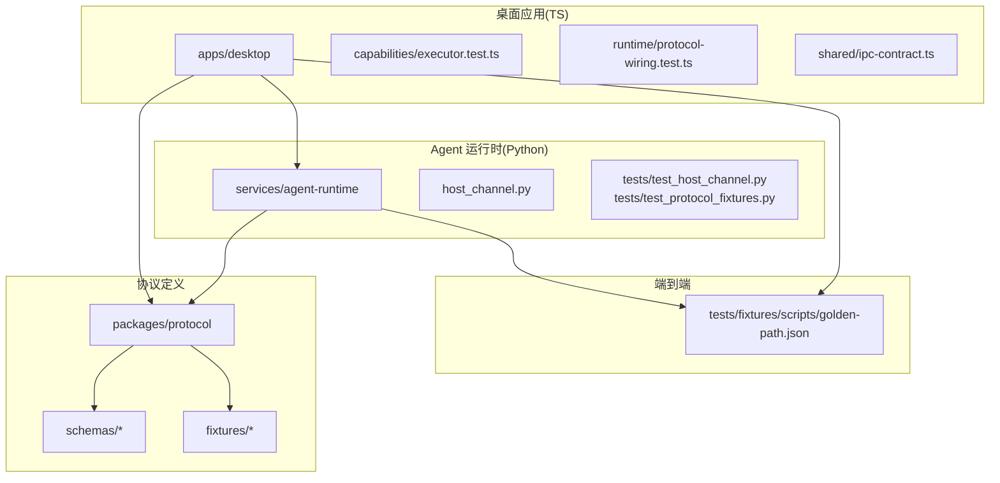
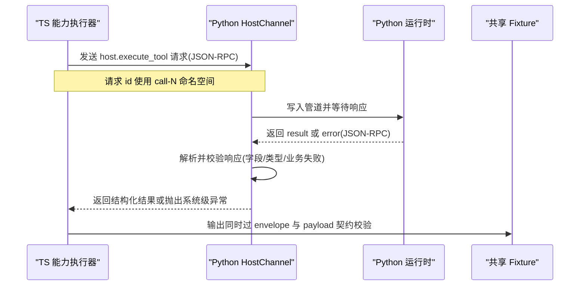
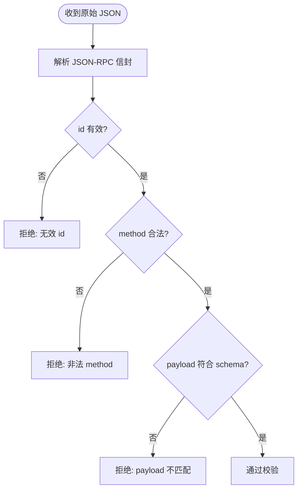
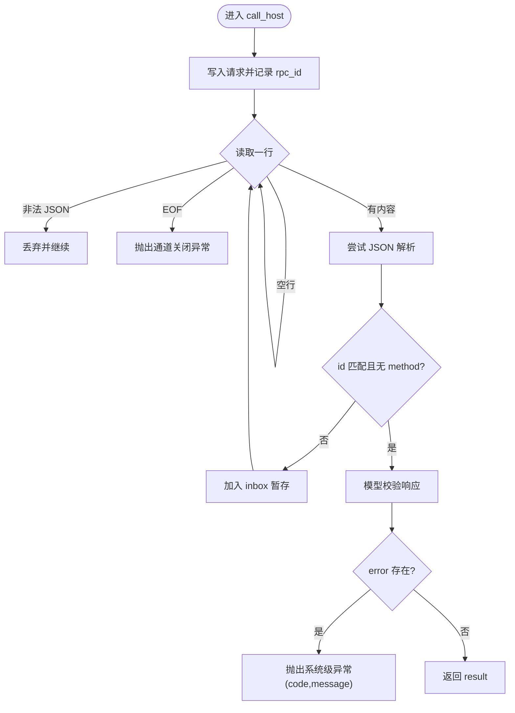
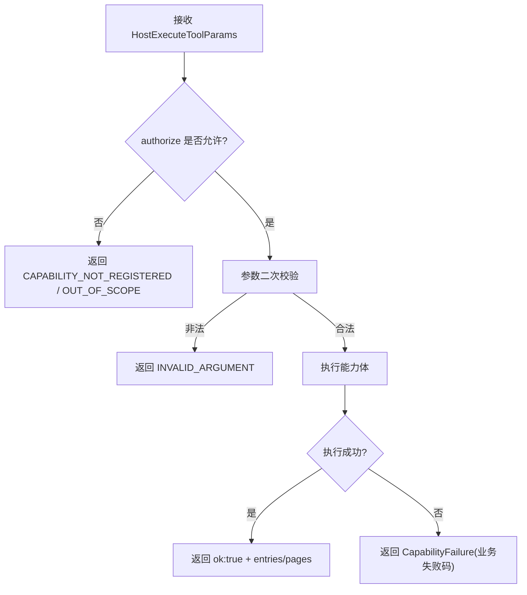
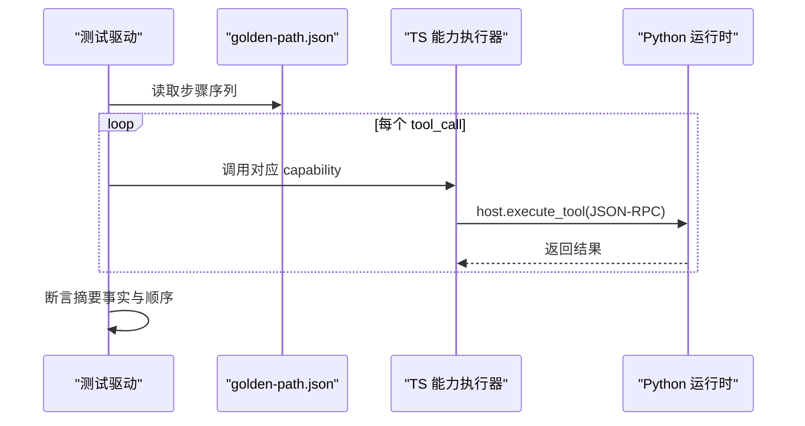
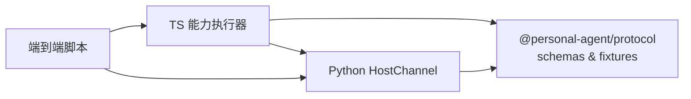

# 协议测试

<cite>
**本文引用的文件**
- [packages/protocol/package.json](file://packages/protocol/package.json)
- [packages/protocol/schemas/envelope.ts](file://packages/protocol/schemas/envelope.ts)
- [packages/protocol/schemas/host.ts](file://packages/protocol/schemas/host.ts)
- [packages/protocol/schemas/index.ts](file://packages/protocol/schemas/index.ts)
- [packages/protocol/tests/envelope.test.ts](file://packages/protocol/tests/envelope.test.ts)
- [packages/protocol/fixtures/host-execute-tool.request.json](file://packages/protocol/fixtures/host-execute-tool.request.json)
- [apps/desktop/src/shared/ipc-contract.ts](file://apps/desktop/src/shared/ipc-contract.ts)
- [apps/desktop/src/main/capabilities/executor.test.ts](file://apps/desktop/src/main/capabilities/executor.test.ts)
- [apps/desktop/src/main/capabilities/pdf-fixtures.test.ts](file://apps/desktop/src/main/capabilities/pdf-fixtures.test.ts)
- [apps/desktop/src/main/runtime/protocol-wiring.test.ts](file://apps/desktop/src/main/runtime/protocol-wiring.test.ts)
- [services/agent-runtime/src/personal_agent/host_channel.py](file://services/agent-runtime/src/personal_agent/host_channel.py)
- [services/agent-runtime/tests/test_host_channel.py](file://services/agent-runtime/tests/test_host_channel.py)
- [services/agent-runtime/tests/test_protocol_fixtures.py](file://services/agent-runtime/tests/test_protocol_fixtures.py)
- [tests/fixtures/scripts/golden-path.json](file://tests/fixtures/scripts/golden-path.json)
</cite>

## 目录
1. [简介](#简介)
2. [项目结构](#项目结构)
3. [核心组件](#核心组件)
4. [架构总览](#架构总览)
5. [详细组件分析](#详细组件分析)
6. [依赖关系分析](#依赖关系分析)
7. [性能考虑](#性能考虑)
8. [故障排查指南](#故障排查指南)
9. [结论](#结论)
10. [附录](#附录)

## 简介
本文件面向个人代理项目的协议测试，聚焦 IPC 与 JSON-RPC 协议的实现验证。内容涵盖：
- 协议一致性测试：消息格式、错误处理、边界情况覆盖
- 测试夹具与模拟数据：共享 fixture 的双端校验与生成策略
- 端到端测试策略：完整工作流场景与回归保障
- 测试环境搭建与依赖管理：Node/Python 双栈测试运行方式
- 具体用例示例：如何编写协议测试
- 覆盖率分析与性能基准方法建议

## 项目结构
仓库采用多包/多服务组织，协议定义集中在 packages/protocol，TS 侧能力执行在 apps/desktop，Python 侧运行时在 services/agent-runtime，跨进程通道通过 host.execute_tool 的 JSON-RPC 消息进行通信。测试分布在各自模块内，并通过共享 fixtures 保证两端契约一致。

图表来源
- [packages/protocol/schemas/index.ts:1-8](file://packages/protocol/schemas/index.ts#L1-L8)
- [packages/protocol/schemas/envelope.ts:1-41](file://packages/protocol/schemas/envelope.ts#L1-L41)
- [packages/protocol/schemas/host.ts:1-76](file://packages/protocol/schemas/host.ts#L1-L76)
- [apps/desktop/src/shared/ipc-contract.ts:1-75](file://apps/desktop/src/shared/ipc-contract.ts#L1-L75)
- [services/agent-runtime/src/personal_agent/host_channel.py:1-91](file://services/agent-runtime/src/personal_agent/host_channel.py#L1-L91)

章节来源
- [packages/protocol/package.json:1-16](file://packages/protocol/package.json#L1-L16)
- [packages/protocol/schemas/index.ts:1-8](file://packages/protocol/schemas/index.ts#L1-L8)
- [apps/desktop/src/shared/ipc-contract.ts:1-75](file://apps/desktop/src/shared/ipc-contract.ts#L1-L75)

## 核心组件
- 协议信封与错误模型：JSON-RPC 2.0 信封、请求/响应/通知、result/error 互斥约束、方法名模式校验
- Host 工具调用：host.execute_tool 的请求/响应、能力白名单、参数与结果形状
- TS 能力执行器：权限与范围校验、参数二次校验、错误码映射、业务失败透传
- Python 通道层：阻塞读取、EOF 处理、非匹配请求暂存、响应校验与异常分类
- 端到端脚本：固定步骤序列（工具调用与摘要）用于回归验证

章节来源
- [packages/protocol/schemas/envelope.ts:1-41](file://packages/protocol/schemas/envelope.ts#L1-L41)
- [packages/protocol/schemas/host.ts:1-76](file://packages/protocol/schemas/host.ts#L1-L76)
- [apps/desktop/src/main/capabilities/executor.test.ts:1-314](file://apps/desktop/src/main/capabilities/executor.test.ts#L1-L314)
- [services/agent-runtime/src/personal_agent/host_channel.py:1-91](file://services/agent-runtime/src/personal_agent/host_channel.py#L1-L91)
- [tests/fixtures/scripts/golden-path.json:1-22](file://tests/fixtures/scripts/golden-path.json#L1-L22)

## 架构总览
下图展示从 TS 能力执行到 Python 通道层的 JSON-RPC 往返流程，以及两端对协议的一致性校验点。

图表来源
- [services/agent-runtime/src/personal_agent/host_channel.py:45-85](file://services/agent-runtime/src/personal_agent/host_channel.py#L45-L85)
- [packages/protocol/schemas/host.ts:40-67](file://packages/protocol/schemas/host.ts#L40-L67)
- [packages/protocol/schemas/envelope.ts:5-34](file://packages/protocol/schemas/envelope.ts#L5-L34)
- [apps/desktop/src/main/capabilities/executor.test.ts:149-158](file://apps/desktop/src/main/capabilities/executor.test.ts#L149-L158)

## 详细组件分析

### 协议信封与消息格式验证
- 信封层强制 jsonrpc 为 "2.0"，id 非空，method 符合命名规范；Response 要求 result 与 error 有且仅有一个
- 针对 host.execute_tool 的请求/响应，额外限定 id 命名空间与方法字面量，确保两端严格对齐
- 通过共享 fixture 与双端测试，确保合法消息被接受、非法消息被拒绝

图表来源
- [packages/protocol/schemas/envelope.ts:5-34](file://packages/protocol/schemas/envelope.ts#L5-L34)
- [packages/protocol/schemas/host.ts:40-67](file://packages/protocol/schemas/host.ts#L40-L67)
- [packages/protocol/tests/envelope.test.ts:194-234](file://packages/protocol/tests/envelope.test.ts#L194-L234)

章节来源
- [packages/protocol/schemas/envelope.ts:1-41](file://packages/protocol/schemas/envelope.ts#L1-L41)
- [packages/protocol/schemas/host.ts:1-76](file://packages/protocol/schemas/host.ts#L1-L76)
- [packages/protocol/tests/envelope.test.ts:194-234](file://packages/protocol/tests/envelope.test.ts#L194-L234)
- [services/agent-runtime/tests/test_protocol_fixtures.py:184-203](file://services/agent-runtime/tests/test_protocol_fixtures.py#L184-L203)

### Host 通道层行为与错误分类
- 发送请求时构造 host.execute_tool 的 JSON-RPC 请求，id 自增并使用 call-N 命名空间
- 循环读取 stdin 行：跳过空白行与非法 JSON；将非目标 id 或带 method 的消息放入 inbox 暂存
- 响应校验：必须满足 HostExecuteToolResponse；若存在 error 则抛出系统级异常；否则返回 result
- EOF 处理：readline 返回空字符串视为通道关闭，抛出通道关闭异常

图表来源
- [services/agent-runtime/src/personal_agent/host_channel.py:45-91](file://services/agent-runtime/src/personal_agent/host_channel.py#L45-L91)
- [services/agent-runtime/tests/test_host_channel.py:142-200](file://services/agent-runtime/tests/test_host_channel.py#L142-L200)

章节来源
- [services/agent-runtime/src/personal_agent/host_channel.py:1-91](file://services/agent-runtime/src/personal_agent/host_channel.py#L1-L91)
- [services/agent-runtime/tests/test_host_channel.py:58-228](file://services/agent-runtime/tests/test_host_channel.py#L58-L228)

### TS 能力执行器：权限、参数与错误码
- authorize 是唯一关口：越权与未注册能力分别返回不同错误码，避免混淆
- 参数二次校验：rootId/path 等字段在白名单与格式层面收紧，非法参数统一返回 INVALID_ARGUMENT
- 文件系统与 PDF 能力：根不可用、路径逃逸、文件不可读、PDF 业务失败等场景均返回稳定错误码
- 输出契约：成功与失败输出均能通过 HostExecuteToolResult/CapabilityFailure 等 schema 校验

图表来源
- [apps/desktop/src/main/capabilities/executor.test.ts:59-136](file://apps/desktop/src/main/capabilities/executor.test.ts#L59-L136)
- [apps/desktop/src/main/capabilities/executor.test.ts:138-271](file://apps/desktop/src/main/capabilities/executor.test.ts#L138-L271)

章节来源
- [apps/desktop/src/main/capabilities/executor.test.ts:1-314](file://apps/desktop/src/main/capabilities/executor.test.ts#L1-L314)

### 端到端测试策略与黄金路径
- 使用 golden-path.json 描述完整的工具调用与摘要步骤，作为回归基线
- 结合固定 PDF 与期望页文本，确保文档提取链路稳定
- 通过 TS 与 Python 两侧对同一 fixture 的校验，保证跨进程行为一致

图表来源
- [tests/fixtures/scripts/golden-path.json:1-22](file://tests/fixtures/scripts/golden-path.json#L1-L22)
- [apps/desktop/src/main/capabilities/pdf-fixtures.test.ts:22-55](file://apps/desktop/src/main/capabilities/pdf-fixtures.test.ts#L22-L55)

章节来源
- [tests/fixtures/scripts/golden-path.json:1-22](file://tests/fixtures/scripts/golden-path.json#L1-L22)
- [apps/desktop/src/main/capabilities/pdf-fixtures.test.ts:1-56](file://apps/desktop/src/main/capabilities/pdf-fixtures.test.ts#L1-L56)

### 测试夹具与模拟数据准备
- 共享 fixture：位于 packages/protocol/fixtures，包含合法与非法 JSON-RPC 消息样例
- 双端同步校验：TS 与 Python 两侧分别加载相同 fixture，确保 schema 与行为一致
- 固定 PDF：通过构建与落盘固定 PDF，验证 PDF 提取结果的稳定性

章节来源
- [packages/protocol/tests/envelope.test.ts:58-192](file://packages/protocol/tests/envelope.test.ts#L58-L192)
- [services/agent-runtime/tests/test_protocol_fixtures.py:35-182](file://services/agent-runtime/tests/test_protocol_fixtures.py#L35-L182)
- [apps/desktop/src/main/capabilities/pdf-fixtures.test.ts:1-56](file://apps/desktop/src/main/capabilities/pdf-fixtures.test.ts#L1-L56)

### 端到端与一致性测试要点
- 合法性：所有合法 fixture 必须被双方接受
- 非法性：所有非法 fixture 必须被双方拒绝
- 漂移防护：host schema 必须同时满足 envelope 的 Request/Response 约束
- 字段清单钉死：关键 DTO 的字段集合必须与预期一致，防止隐式扩展
- 时间戳与枚举：occurredAt 格式、status 取值等强约束需覆盖

章节来源
- [packages/protocol/tests/envelope.test.ts:194-260](file://packages/protocol/tests/envelope.test.ts#L194-L260)
- [services/agent-runtime/tests/test_protocol_fixtures.py:206-222](file://services/agent-runtime/tests/test_protocol_fixtures.py#L206-L222)
- [packages/protocol/tests/envelope.test.ts:268-425](file://packages/protocol/tests/envelope.test.ts#L268-L425)
- [services/agent-runtime/tests/test_protocol_fixtures.py:286-370](file://services/agent-runtime/tests/test_protocol_fixtures.py#L286-L370)

## 依赖关系分析
- 协议包提供 Zod schema 与常量，TS 与 Python 两侧分别消费
- TS 能力执行器依赖协议包与本地能力实现，输出必须符合协议 schema
- Python 通道层依赖 Pydantic models，负责 JSON-RPC 往返与错误分类
- 端到端脚本与固定 PDF 作为回归基线，贯穿两端

图表来源
- [packages/protocol/schemas/index.ts:1-8](file://packages/protocol/schemas/index.ts#L1-L8)
- [apps/desktop/src/main/capabilities/executor.test.ts:1-314](file://apps/desktop/src/main/capabilities/executor.test.ts#L1-L314)
- [services/agent-runtime/src/personal_agent/host_channel.py:1-91](file://services/agent-runtime/src/personal_agent/host_channel.py#L1-L91)

章节来源
- [packages/protocol/schemas/index.ts:1-8](file://packages/protocol/schemas/index.ts#L1-L8)
- [apps/desktop/src/main/capabilities/executor.test.ts:1-314](file://apps/desktop/src/main/capabilities/executor.test.ts#L1-L314)
- [services/agent-runtime/src/personal_agent/host_channel.py:1-91](file://services/agent-runtime/src/personal_agent/host_channel.py#L1-L91)

## 性能考虑
- 通道层读取限制：测试中设置 readline 上限，防止 EOF 误判导致忙轮询
- 批量与并发：当前通道为单工阻塞读写，适合短小消息；高吞吐场景可考虑批处理或异步队列
- 序列化开销：JSON 解析与模型校验在高频路径上应关注耗时，必要时缓存 schema 或减少冗余转换
- 资源清理：测试中使用临时目录与固定 PDF，确保磁盘与进程资源及时释放

[本节为通用指导，不直接分析具体文件]

## 故障排查指南
- 协议不一致：当出现“未知错误码”或“字段缺失”，优先检查两端 schema 与 fixture 是否同步更新
- 通道卡死：确认 EOF 处理是否正确，避免 while True 空转；检查 next_line 与 inbox 逻辑
- 能力执行失败：核对 authorize 顺序与错误码映射，确保业务失败以 CapabilityFailure 返回而非抛异常
- 时间戳问题：occurredAt 必须为三位毫秒加 Z 的 ISO 格式，避免 +00:00 或微秒格式

章节来源
- [services/agent-runtime/tests/test_host_channel.py:230-247](file://services/agent-runtime/tests/test_host_channel.py#L230-L247)
- [apps/desktop/src/main/capabilities/executor.test.ts:273-313](file://apps/desktop/src/main/capabilities/executor.test.ts#L273-L313)
- [packages/protocol/tests/envelope.test.ts:290-356](file://packages/protocol/tests/envelope.test.ts#L290-L356)

## 结论
本项目通过共享 fixture、双端 schema 校验与严格的错误分类，构建了稳健的协议测试体系。TS 侧聚焦能力执行与错误码映射，Python 侧专注通道语义与响应校验，端到端脚本保障完整工作流的回归。遵循本文的测试策略与最佳实践，可有效降低协议漂移风险并提升系统可靠性。

[本节为总结性内容，不直接分析具体文件]

## 附录

### 测试环境与依赖管理
- Node 侧：使用 Vitest 运行协议与能力测试，依赖 zod 进行 schema 校验
- Python 侧：使用 pytest 运行通道与协议测试，依赖 pydantic 进行模型校验
- 工作区：通过 pnpm workspace 管理多包依赖，确保协议包版本一致

章节来源
- [packages/protocol/package.json:1-16](file://packages/protocol/package.json#L1-L16)
- [apps/desktop/src/main/runtime/protocol-wiring.test.ts:1-11](file://apps/desktop/src/main/runtime/protocol-wiring.test.ts#L1-L11)

### 具体测试用例示例（路径引用）
- 协议信封与非法消息拒绝：参见 [packages/protocol/tests/envelope.test.ts:194-234](file://packages/protocol/tests/envelope.test.ts#L194-L234)
- Host 通道行为与 EOF：参见 [services/agent-runtime/tests/test_host_channel.py:134-200](file://services/agent-runtime/tests/test_host_channel.py#L134-L200)
- 能力执行器权限与参数校验：参见 [apps/desktop/src/main/capabilities/executor.test.ts:59-136](file://apps/desktop/src/main/capabilities/executor.test.ts#L59-L136)
- 固定 PDF 与端到端回归：参见 [apps/desktop/src/main/capabilities/pdf-fixtures.test.ts:22-55](file://apps/desktop/src/main/capabilities/pdf-fixtures.test.ts#L22-L55) 与 [tests/fixtures/scripts/golden-path.json:1-22](file://tests/fixtures/scripts/golden-path.json#L1-L22)

### 覆盖率分析与性能基准建议
- 覆盖率：建议在 CI 中启用代码覆盖率报告（如 Vitest 与 pytest 的覆盖率插件），重点关注协议解析、通道层与能力执行分支
- 基准：对通道层解析与模型校验进行微基准测试，测量单次往返耗时；对 PDF 提取进行吞吐与延迟基准，评估大文件场景表现
- 回归：将 golden-path 与固定 PDF 纳入自动化流水线，任何变更均需通过端到端断言

[本节为通用指导，不直接分析具体文件]