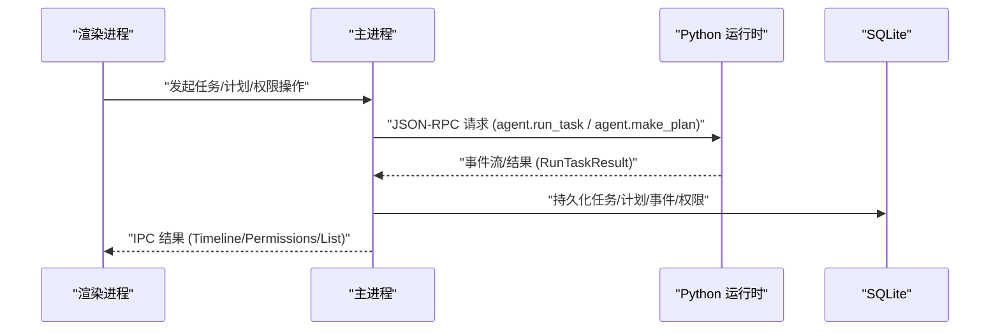
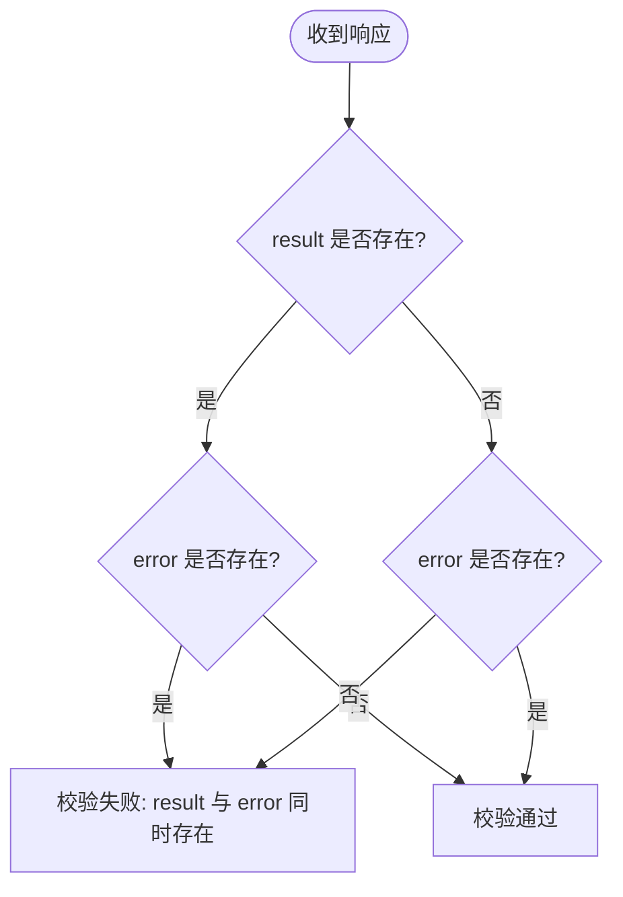
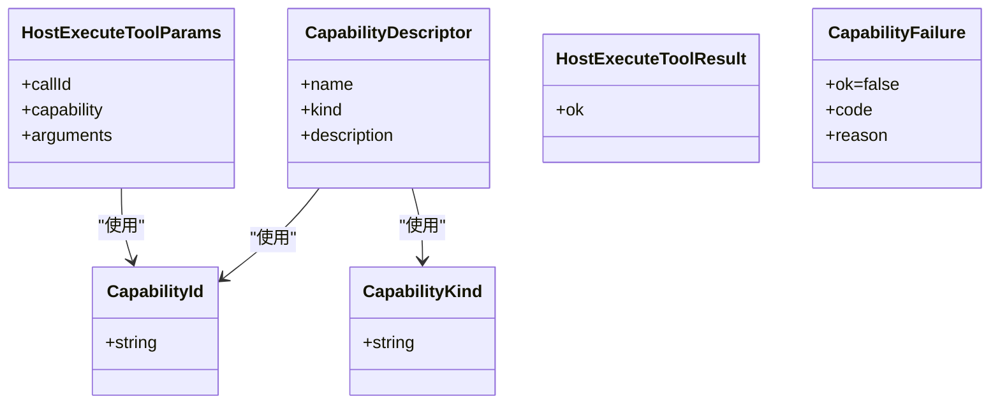
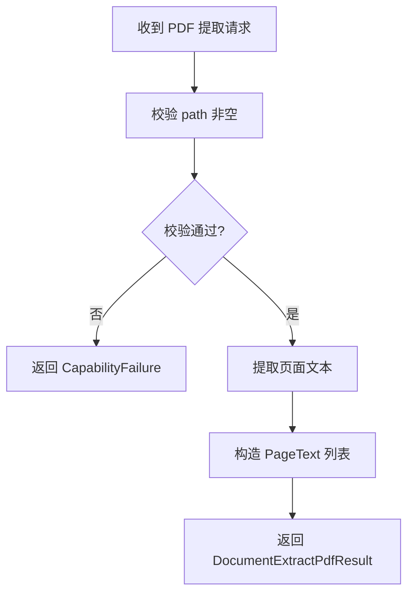
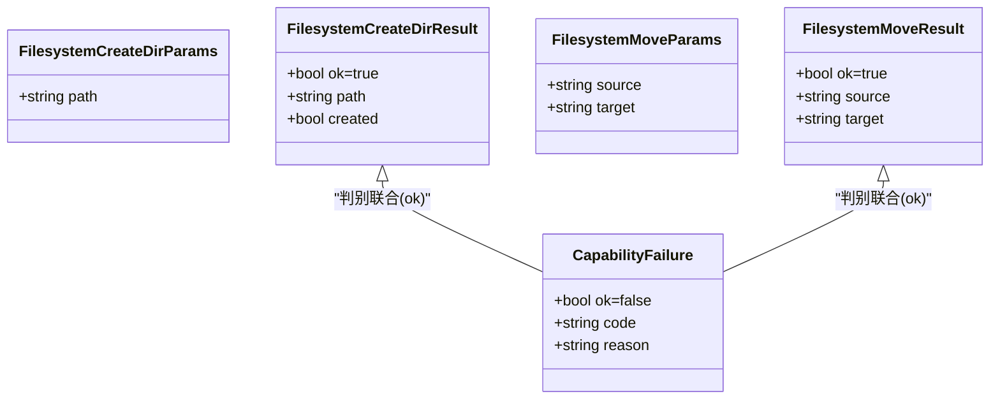
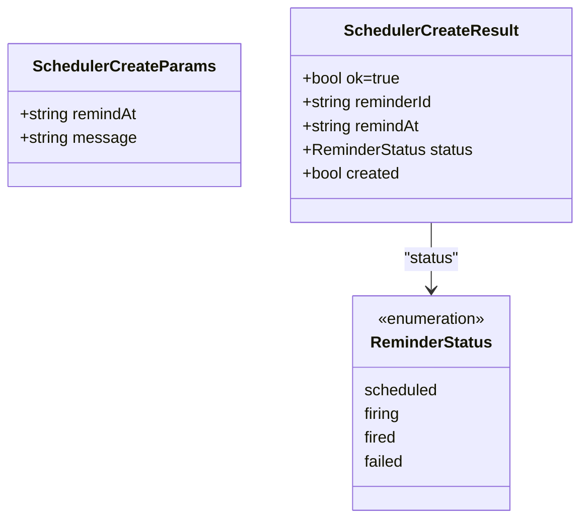
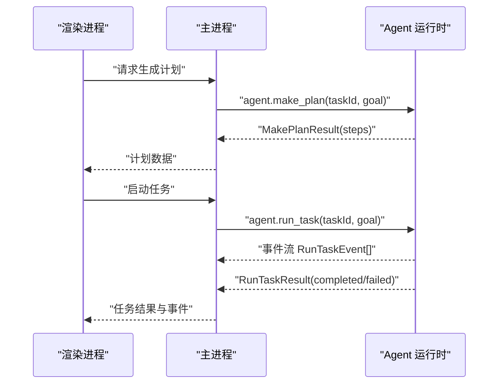
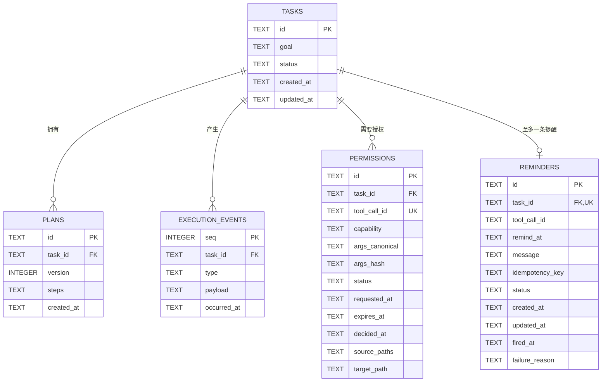
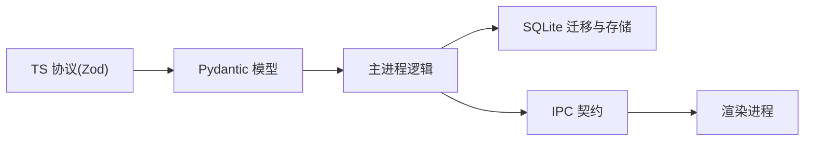

# 数据契约

<cite>
**本文引用的文件**
- [packages/protocol/schemas/index.ts](file://packages/protocol/schemas/index.ts)
- [packages/protocol/schemas/envelope.ts](file://packages/protocol/schemas/envelope.ts)
- [packages/protocol/schemas/host.ts](file://packages/protocol/schemas/host.ts)
- [packages/protocol/schemas/document.ts](file://packages/protocol/schemas/document.ts)
- [packages/protocol/schemas/agent.ts](file://packages/protocol/schemas/agent.ts)
- [packages/protocol/schemas/filesystem.ts](file://packages/protocol/schemas/filesystem.ts)
- [packages/protocol/schemas/scheduler.ts](file://packages/protocol/schemas/scheduler.ts)
- [packages/protocol/fixtures/host-scheduler-create.request.json](file://packages/protocol/fixtures/host-scheduler-create.request.json)
- [packages/protocol/fixtures/host-scheduler-create.response.json](file://packages/protocol/fixtures/host-scheduler-create.response.json)
- [services/agent-runtime/src/personal_agent/protocol/models.py](file://services/agent-runtime/src/personal_agent/protocol/models.py)
- [apps/desktop/src/shared/domain.ts](file://apps/desktop/src/shared/domain.ts)
- [apps/desktop/src/shared/ipc-contract.ts](file://apps/desktop/src/shared/ipc-contract.ts)
- [apps/desktop/src/main/product-state/database.ts](file://apps/desktop/src/main/product-state/database.ts)
- [apps/desktop/src/main/product-state/migrations/index.ts](file://apps/desktop/src/main/product-state/migrations/index.ts)
- [apps/desktop/src/main/product-state/migrations/0001-create-tasks.ts](file://apps/desktop/src/main/product-state/migrations/0001-create-tasks.ts)
- [apps/desktop/src/main/product-state/migrations/0002-create-plans.ts](file://apps/desktop/src/main/product-state/migrations/0002-create-plans.ts)
- [apps/desktop/src/main/product-state/migrations/0003-create-execution-events.ts](file://apps/desktop/src/main/product-state/migrations/0003-create-execution-events.ts)
- [apps/desktop/src/main/product-state/migrations/0004-create-permissions.ts](file://apps/desktop/src/main/product-state/migrations/0004-create-permissions.ts)
- [apps/desktop/src/main/product-state/migrations/0005-widen-task-status-check.ts](file://apps/desktop/src/main/product-state/migrations/0005-widen-task-status-check.ts)
- [apps/desktop/src/main/product-state/migrations/0007-create-reminders.ts](file://apps/desktop/src/main/product-state/migrations/0007-create-reminders.ts)
</cite>

## 目录
1. [简介](#简介)
2. [项目结构](#项目结构)
3. [核心组件](#核心组件)
4. [架构总览](#架构总览)
5. [详细组件分析](#详细组件分析)
6. [依赖关系分析](#依赖关系分析)
7. [性能考虑](#性能考虑)
8. [故障排查指南](#故障排查指南)
9. [结论](#结论)
10. [附录](#附录)

## 简介
本文件面向前后端共享的数据契约，系统性梳理 TypeScript 类型与 Pydantic 模型的对应关系，覆盖任务记录、计划步骤、时间线事件、PDF 文档索引、权限记录的状态管理与视图投影，以及数据验证规则、约束条件、迁移策略与版本兼容性说明。目标是让读者在不深入代码的情况下也能准确理解跨进程通信、持久化存储与 UI 展示之间的数据约定。

## 项目结构
本项目采用“协议层 + 运行时 + 桌面应用”的分层组织：
- 协议层（packages/protocol）：使用 Zod 定义 JSON-RPC 信封、能力描述、主机工具调用、文档提取、Agent 任务等消息模型，并统一导出。
- 运行时（services/agent-runtime）：使用 Pydantic 定义与 TS 侧一致的请求/响应模型，包括 PDF 提取、文件系统能力、Agent 任务执行结果等。
- 桌面应用（apps/desktop）：包含主进程产品状态数据库（SQLite）、迁移脚本、IPC 契约与领域模型（domain），用于持久化任务、计划、事件、权限，并向渲染进程提供查询接口。

```mermaid
graph TB
subgraph "协议层"
P_INDEX["schemas/index.ts"]
P_ENVELOPE["schemas/envelope.ts"]
P_HOST["schemas/host.ts"]
P_DOC["schemas/document.ts"]
P_AGENT["schemas/agent.ts"]
P_FS["schemas/filesystem.ts"]
P_SCHED["schemas/scheduler.ts"]
end
subgraph "运行时"
R_MODELS["protocol/models.py"]
end
subgraph "桌面应用"
D_DOMAIN["shared/domain.ts"]
D_IPC["shared/ipc-contract.ts"]
D_DB["product-state/database.ts"]
D_MIGRATIONS["product-state/migrations/*"]
end
P_INDEX --> P_ENVELOPE
P_INDEX --> P_HOST
P_INDEX --> P_DOC
P_INDEX --> P_AGENT
P_INDEX --> P_FS
P_INDEX --> P_SCHED
P_HOST < --> R_MODELS
P_DOC < --> R_MODELS
P_AGENT < --> R_MODELS
P_FS < --> R_MODELS
P_SCHED < --> R_MODELS
D_DOMAIN --> D_IPC
D_DB --> D_MIGRATIONS
D_IPC --> D_DOMAIN
```

**图表来源**
- [packages/protocol/schemas/index.ts:1-8](file://packages/protocol/schemas/index.ts#L1-L8)
- [packages/protocol/schemas/envelope.ts:1-41](file://packages/protocol/schemas/envelope.ts#L1-L41)
- [packages/protocol/schemas/host.ts:1-76](file://packages/protocol/schemas/host.ts#L1-L76)
- [packages/protocol/schemas/document.ts:1-31](file://packages/protocol/schemas/document.ts#L1-L31)
- [packages/protocol/schemas/agent.ts:1-138](file://packages/protocol/schemas/agent.ts#L1-L138)
- [packages/protocol/schemas/filesystem.ts:1-71](file://packages/protocol/schemas/filesystem.ts#L1-L71)
- [packages/protocol/schemas/scheduler.ts:1-42](file://packages/protocol/schemas/scheduler.ts#L1-L42)
- [services/agent-runtime/src/personal_agent/protocol/models.py:1-368](file://services/agent-runtime/src/personal_agent/protocol/models.py#L1-L368)
- [apps/desktop/src/shared/domain.ts:1-158](file://apps/desktop/src/shared/domain.ts#L1-L158)
- [apps/desktop/src/shared/ipc-contract.ts:1-75](file://apps/desktop/src/shared/ipc-contract.ts#L1-L75)
- [apps/desktop/src/main/product-state/database.ts:1-100](file://apps/desktop/src/main/product-state/database.ts#L1-L100)
- [apps/desktop/src/main/product-state/migrations/index.ts:1-22](file://apps/desktop/src/main/product-state/migrations/index.ts#L1-L22)

**章节来源**
- [packages/protocol/schemas/index.ts:1-8](file://packages/protocol/schemas/index.ts#L1-L8)
- [apps/desktop/src/main/product-state/migrations/index.ts:1-22](file://apps/desktop/src/main/product-state/migrations/index.ts#L1-L22)

## 核心组件
- JSON-RPC 信封：统一的请求/通知/响应格式，强制 result 与 error 互斥。
- 能力系统：CapabilityId、CapabilityKind、CapabilityDescriptor 描述可用能力及其读写属性。
- 主机工具调用：host.execute_tool 的入参/出参与失败体。
- 文档提取：PDF 路径参数、分页文本结果与能力失败体。
- 文件系统写入：create_dir/move 的参数与结果 DTO（幂等标记 created、realpath 规范化路径）。
- 调度器：scheduler.create 的参数/结果与 Reminder 四状态枚举（Zod、Pydantic、DB CHECK 三处同源）。
- Agent 任务：make_plan 与 run_task 的请求/响应、事件与摘要事实。
- 领域模型：TaskRecord、PlanRecord、ExecutionEventRecord、PermissionRecord、ReminderRecord、TaskTimeline、PermissionViewState 等。
- IPC 契约：主进程与渲染进程间的数据传输类型，含错误码与结果包装。
- 产品状态数据库：SQLite 表结构与迁移脚本，保证数据一致性与演进。

**章节来源**
- [packages/protocol/schemas/envelope.ts:1-41](file://packages/protocol/schemas/envelope.ts#L1-L41)
- [packages/protocol/schemas/host.ts:1-76](file://packages/protocol/schemas/host.ts#L1-L76)
- [packages/protocol/schemas/document.ts:1-31](file://packages/protocol/schemas/document.ts#L1-L31)
- [packages/protocol/schemas/agent.ts:1-138](file://packages/protocol/schemas/agent.ts#L1-L138)
- [services/agent-runtime/src/personal_agent/protocol/models.py:1-368](file://services/agent-runtime/src/personal_agent/protocol/models.py#L1-L368)
- [apps/desktop/src/shared/domain.ts:1-158](file://apps/desktop/src/shared/domain.ts#L1-L158)
- [apps/desktop/src/shared/ipc-contract.ts:1-75](file://apps/desktop/src/shared/ipc-contract.ts#L1-L75)

## 架构总览
下图展示了从前端到后端再到数据库的关键数据流：前端通过 IPC 调用主进程，主进程驱动 Python 运行时执行任务或计划，运行结果以事件和摘要形式回传，最终写入 SQLite 并通过 IPC 返回给渲染进程。



**图表来源**
- [packages/protocol/schemas/agent.ts:1-138](file://packages/protocol/schemas/agent.ts#L1-L138)
- [services/agent-runtime/src/personal_agent/protocol/models.py:264-368](file://services/agent-runtime/src/personal_agent/protocol/models.py#L264-L368)
- [apps/desktop/src/main/product-state/database.ts:42-83](file://apps/desktop/src/main/product-state/database.ts#L42-L83)
- [apps/desktop/src/shared/ipc-contract.ts:36-75](file://apps/desktop/src/shared/ipc-contract.ts#L36-L75)

## 详细组件分析

### JSON-RPC 信封与通用约束
- 信封模型：Request/Notification/Response 统一字段 jsonrpc、id、method、params；Response 必须满足 result 与 error 二选一。
- 方法名模式：METHOD_PATTERN 限制为小写字母开头、可带层级点号的方法名。
- 两端一致性：TS 使用 Zod 校验，Pydantic 使用 Literal/Field 与 model_validator 实现相同约束。



**图表来源**
- [packages/protocol/schemas/envelope.ts:12-34](file://packages/protocol/schemas/envelope.ts#L12-L34)
- [services/agent-runtime/src/personal_agent/protocol/models.py:21-31](file://services/agent-runtime/src/personal_agent/protocol/models.py#L21-L31)

**章节来源**
- [packages/protocol/schemas/envelope.ts:1-41](file://packages/protocol/schemas/envelope.ts#L1-L41)
- [services/agent-runtime/src/personal_agent/protocol/models.py:1-38](file://services/agent-runtime/src/personal_agent/protocol/models.py#L1-L38)

### 能力系统与主机工具调用
- CapabilityId：能力白名单枚举，当前包含 filesystem.list、document.extract_pdf、filesystem.create_dir、filesystem.move、scheduler.create、notification.send（TS 侧 z.enum 与 Pydantic 侧 Literal 逐项对应）。
- CapabilityKind：READ/WRITE 标记能力用途。
- HostExecuteTool：TS 与 Pydantic 均定义 callId、capability、arguments 入参；返回 ok 布尔；失败体 CapabilityFailure 以 ok=false 区分。
- 方法名与 ID 模式：HOST_CALL_ID_PATTERN 限定 callId 格式。



**图表来源**
- [packages/protocol/schemas/host.ts:7-26](file://packages/protocol/schemas/host.ts#L7-L26)
- [packages/protocol/schemas/host.ts:28-76](file://packages/protocol/schemas/host.ts#L28-L76)
- [services/agent-runtime/src/personal_agent/protocol/models.py:75-204](file://services/agent-runtime/src/personal_agent/protocol/models.py#L75-L204)

**章节来源**
- [packages/protocol/schemas/host.ts:1-76](file://packages/protocol/schemas/host.ts#L1-L76)
- [services/agent-runtime/src/personal_agent/protocol/models.py:75-204](file://services/agent-runtime/src/personal_agent/protocol/models.py#L75-L204)

### 文档提取（PDF）
- 入参：DocumentExtractPdfParams 要求 path 非空。
- 结果：DocumentExtractPdfResult 包含 ok=true 与 pages 数组，每页 PageText 包含 pageNumber≥1 与 text。
- 联合类型：DocumentExtractPdfOutcome 为成功结果或 CapabilityFailure 的判别联合。
- 两端对齐：Zod 与 Pydantic 在字段名、约束上保持一致。



**图表来源**
- [packages/protocol/schemas/document.ts:5-31](file://packages/protocol/schemas/document.ts#L5-L31)
- [services/agent-runtime/src/personal_agent/protocol/models.py:127-141](file://services/agent-runtime/src/personal_agent/protocol/models.py#L127-L141)

**章节来源**
- [packages/protocol/schemas/document.ts:1-31](file://packages/protocol/schemas/document.ts#L1-L31)
- [services/agent-runtime/src/personal_agent/protocol/models.py:127-141](file://services/agent-runtime/src/personal_agent/protocol/models.py#L127-L141)

### 文件系统写入契约（create_dir / move）
- 入参：
  - FilesystemCreateDirParams：path 非空字符串。
  - FilesystemMoveParams：source、target 均非空字符串，字段名与 PermissionRecord 的 sourcePaths/targetPath 对齐。
- 结果：
  - FilesystemCreateDirResult { ok: true, path, created }。create_dir **幂等**：目录已存在不算失败，created 区分「本次新建」与「本就存在」；path 是 realpath 规范化后的绝对路径（正斜杠），与 binder 输出的 bound.paths['path'] 同源。
  - FilesystemMoveResult { ok: true, source, target }。move **不幂等**：target 已存在直接拒（MOVE_TARGET_EXISTS），成功即移动完成；source/target 均为 realpath 后的绝对路径。
- 联合类型：FilesystemCreateDirOutcome / FilesystemMoveOutcome 为成功结果或 CapabilityFailure 的判别联合（按 ok 判别），失败码分别为 CREATE_DIR_FAILED 与 MOVE_SOURCE_MISSING / MOVE_TARGET_EXISTS / MOVE_FAILED。
- Pydantic 镜像：models.py 中同名模型逐字段镜像（FilesystemCreateDirParams/FilesystemMoveParams/FilesystemCreateDirResult/FilesystemMoveResult 及两个 Outcome 判别联合）。



**图表来源**
- [packages/protocol/schemas/filesystem.ts:23-70](file://packages/protocol/schemas/filesystem.ts#L23-L70)
- [services/agent-runtime/src/personal_agent/protocol/models.py:55-61](file://services/agent-runtime/src/personal_agent/protocol/models.py#L55-L61)
- [services/agent-runtime/src/personal_agent/protocol/models.py:144-163](file://services/agent-runtime/src/personal_agent/protocol/models.py#L144-L163)

**章节来源**
- [packages/protocol/schemas/filesystem.ts:23-70](file://packages/protocol/schemas/filesystem.ts#L23-L70)
- [services/agent-runtime/src/personal_agent/protocol/models.py:144-163](file://services/agent-runtime/src/personal_agent/protocol/models.py#L144-L163)
- [packages/protocol/fixtures/host-filesystem-create-dir.response.json:1-9](file://packages/protocol/fixtures/host-filesystem-create-dir.response.json#L1-L9)
- [packages/protocol/fixtures/host-filesystem-move.response.json:1-9](file://packages/protocol/fixtures/host-filesystem-move.response.json#L1-L9)

### 调度器契约（scheduler.create / Reminder）
- ReminderStatus：z.enum(["scheduled", "firing", "fired", "failed"])，与 apps/desktop shared/domain.ts 的 REMINDER_STATUSES 及 reminders 表的 CHECK 约束**同源**（防漂移测试遍历数组做真库插入）。scheduled=待触发；firing=触发中、通知结果未知；fired=已发送，终态；failed=通知失败，保留原因，只允许显式重试。
- 入参 SchedulerCreateParams：remindAt（模型把「今晚」这类自然语言解析后的具体时间，ISO-8601）、message（到期通知正文，落 reminders.message），均非空字符串。
- **契约钉形状，语义归执行链**：契约层不校验 remindAt 能否解析、是否在未来——那是 host 侧 binder 的职责，过去时刻由 binder 拒以 REMINDER_TIME_IN_PAST。与 DocumentExtractPdfParams 不校验路径越界是同一个分层原则，避免两处校验各自演化。
- 结果 SchedulerCreateResult { ok: true, reminderId, remindAt, status, created }：
  - created 区分「本次新建」与「命中同任务已有 Reminder 的幂等返回」（同参重试 created:false，异参拒绝 REMINDER_ALREADY_EXISTS）。
  - remindAt 是 binder 规范化后的 UTC ISO（毫秒三位 + Z），与 reminders.remind_at、批准面板展示的时间是同一个串——用户确认的就是落库的。
- 联合类型：SchedulerCreateOutcome 为 SchedulerCreateResult 或 CapabilityFailure 的判别联合；落库失败码 SCHEDULER_CREATE_FAILED。
- Pydantic 镜像：models.py 中 ReminderStatus（Literal 四值）、SchedulerCreateParams、SchedulerCreateResult、SchedulerCreateOutcome 逐字段镜像，均 ConfigDict(extra="allow") 防静默丢数据。
- Fixtures 交叉验证：host-scheduler-create.request.json 钉 remindAt/message 字段名双端一致，host-scheduler-create.response.json 钉结果 DTO 形状；TS 侧 tests/scheduler.test.ts 与 Python 侧 test_protocol_fixtures.py 的对称用例逐条对应。
- 范围说明：Reminder 的创建、持久化、到期触发（fire-reminder.ts + reminder-timer.ts）与启动恢复（recover-reminders.ts）均已实现；生产接线（executor 的 scheduler wiring 与启动时调用恢复）尚未接上，见 docs/adr/0001-file-boundaries-deviations.md。



**图表来源**
- [packages/protocol/schemas/scheduler.ts:8-42](file://packages/protocol/schemas/scheduler.ts#L8-L42)
- [services/agent-runtime/src/personal_agent/protocol/models.py:166-204](file://services/agent-runtime/src/personal_agent/protocol/models.py#L166-L204)
- [apps/desktop/src/shared/domain.ts:104-113](file://apps/desktop/src/shared/domain.ts#L104-L113)

**章节来源**
- [packages/protocol/schemas/scheduler.ts:1-42](file://packages/protocol/schemas/scheduler.ts#L1-L42)
- [services/agent-runtime/src/personal_agent/protocol/models.py:166-204](file://services/agent-runtime/src/personal_agent/protocol/models.py#L166-L204)
- [packages/protocol/fixtures/host-scheduler-create.request.json:1-1](file://packages/protocol/fixtures/host-scheduler-create.request.json#L1-L1)
- [packages/protocol/fixtures/host-scheduler-create.response.json:1-1](file://packages/protocol/fixtures/host-scheduler-create.response.json#L1-L1)
- [packages/protocol/tests/scheduler.test.ts:1-161](file://packages/protocol/tests/scheduler.test.ts#L1-L161)
- [services/agent-runtime/tests/test_protocol_fixtures.py:525-625](file://services/agent-runtime/tests/test_protocol_fixtures.py#L525-L625)

### 任务与计划（Agent）
- make_plan：
  - 入参：taskId、goal。
  - 结果：steps 至少一步，每步 PlanStepDto 包含 description 与可选 capability。
  - 约束：空计划会导致主进程无法进行 ActionAlignment 比对。
- run_task：
  - 入参：taskId、goal。
  - 事件：RunTaskEvent 包含 type、payload、occurredAt（严格 ISO 时间格式）。
  - 结果：RunTaskResult 为 completed/failed 判别联合；completed 包含 facts 与 events，failed 包含 reason 与 events。
  - 摘要事实：SummaryFact 包含 text 与 pageRefs（每项为正整数）。



**图表来源**
- [packages/protocol/schemas/agent.ts:7-138](file://packages/protocol/schemas/agent.ts#L7-L138)
- [services/agent-runtime/src/personal_agent/protocol/models.py:264-368](file://services/agent-runtime/src/personal_agent/protocol/models.py#L264-L368)

**章节来源**
- [packages/protocol/schemas/agent.ts:1-138](file://packages/protocol/schemas/agent.ts#L1-L138)
- [services/agent-runtime/src/personal_agent/protocol/models.py:264-368](file://services/agent-runtime/src/personal_agent/protocol/models.py#L264-L368)

### 领域模型与 IPC 契约
- TaskRecord：任务标识、目标、状态、创建与更新时间。
- ExecutionEventRecord：事件序号、任务关联、类型、负载、发生时间。
- PlanRecord：计划标识、任务关联、版本、步骤、创建时间。
- TaskTimeline：任务本体 + 最新计划 + 按 seq 升序的事件集合。
- PermissionRecord：权限记录，包含 toolCallId、capability、规范化参数、哈希、状态、时间戳、来源/目标路径等。
- PermissionViewState：视图层额外状态 expired（由 pending+expiresAt 推导）。
- ReminderRecord：一次性阅读提醒，一个 Task 至多一条（reminders.task_id UNIQUE）。包含 taskId、toolCallId（仅诊断，不参与幂等判定）、remindAt（binder 规范化 UTC ISO）、message、idempotencyKey（scheduler.create:{argsHash}）、status（REMINDER_STATUSES 四值）、firedAt/failureReason（可空）。
- IPC 结果包装：ListPdfsResult、ListTasksResult、IndexedPdfsResult、RunTaskIpcResult、TimelineIpcResult、PermissionRespondResult、PermissionListResult 统一 ok/code/message 或 ok/entries 结构。

```mermaid
classDiagram
class TaskRecord {
+id
+goal
+status
+createdAt
+updatedAt
}
class ExecutionEventRecord {
+seq
+taskId
+type
+payload
+occurredAt
}
class PlanRecord {
+id
+taskId
+version
+steps
+createdAt
}
class TaskTimeline {
+task
+plan
+events
}
class PermissionRecord {
+id
+taskId
+toolCallId
+capability
+argsCanonical
+argsHash
+status
+requestedAt
+expiresAt
+decidedAt
+sourcePaths
+targetPath
}
class PermissionViewState {
+pending
+approved
+denied
+expired
}
class ReminderRecord {
+id
+taskId
+toolCallId
+remindAt
+message
+idempotencyKey
+status
+createdAt
+updatedAt
+firedAt
+failureReason
}
TaskTimeline --> TaskRecord : "包含"
TaskTimeline --> PlanRecord : "包含"
TaskTimeline --> ExecutionEventRecord : "包含"
TaskRecord ||--o| ReminderRecord : "至多一条"
```

**图表来源**
- [apps/desktop/src/shared/domain.ts:1-158](file://apps/desktop/src/shared/domain.ts#L1-L158)
- [apps/desktop/src/shared/domain.ts:104-136](file://apps/desktop/src/shared/domain.ts#L104-L136)
- [apps/desktop/src/shared/ipc-contract.ts:1-75](file://apps/desktop/src/shared/ipc-contract.ts#L1-L75)

**章节来源**
- [apps/desktop/src/shared/domain.ts:1-158](file://apps/desktop/src/shared/domain.ts#L1-L158)
- [apps/desktop/src/shared/ipc-contract.ts:1-75](file://apps/desktop/src/shared/ipc-contract.ts#L1-L75)

### 数据库表结构与迁移
- tasks：任务表，包含 id、goal、status、created_at、updated_at；状态受 CHECK 约束。
- plans：计划表，包含 id、task_id（外键）、version、steps（序列化）、created_at；唯一约束 (task_id, version)。
- execution_events：追加只写事件表，包含 seq（自增主键）、task_id（外键）、type、payload、occurred_at；触发器禁止更新与删除。TASK-026 起 verification_passed/failed 事件的 payload 带判定报告与 Evidence Bundle（不新增表：可核对的证据就留在 append-only 日志里）。
- permissions：权限表，包含 id、task_id（外键）、tool_call_id（唯一）、capability、args_canonical、args_hash、status（CHECK）、requested_at、expires_at、decided_at、source_paths、target_path；索引优化查询。
- reminders：提醒表（迁移 0007），包含 id、task_id（外键，**UNIQUE**——「同一 Task 不创建重复 Reminder」的数据库级保证）、tool_call_id、remind_at、message、idempotency_key（不设 UNIQUE：key 不含 taskId，不同任务参数恰好相同时 key 相等但不是重复 Reminder）、status（CHECK 限定 scheduled/firing/fired/failed 四值）、created_at、updated_at、fired_at、failure_reason；到期索引 idx_reminders_due (status, remind_at) 服务于启动恢复扫描。
- 迁移管理：database.ts 负责打开数据库、设置 PRAGMA、执行迁移、检查外键完整性；migrations/index.ts 注册迁移顺序。



**图表来源**
- [apps/desktop/src/main/product-state/migrations/0001-create-tasks.ts:9-27](file://apps/desktop/src/main/product-state/migrations/0001-create-tasks.ts#L9-L27)
- [apps/desktop/src/main/product-state/migrations/0002-create-plans.ts:3-21](file://apps/desktop/src/main/product-state/migrations/0002-create-plans.ts#L3-L21)
- [apps/desktop/src/main/product-state/migrations/0003-create-execution-events.ts:3-39](file://apps/desktop/src/main/product-state/migrations/0003-create-execution-events.ts#L3-L39)
- [apps/desktop/src/main/product-state/migrations/0004-create-permissions.ts:5-39](file://apps/desktop/src/main/product-state/migrations/0004-create-permissions.ts#L5-L39)
- [apps/desktop/src/main/product-state/migrations/0005-widen-task-status-check.ts:3-28](file://apps/desktop/src/main/product-state/migrations/0005-widen-task-status-check.ts#L3-L28)
- [apps/desktop/src/main/product-state/migrations/0007-create-reminders.ts:6-25](file://apps/desktop/src/main/product-state/migrations/0007-create-reminders.ts#L6-L25)
- [apps/desktop/src/main/product-state/database.ts:42-83](file://apps/desktop/src/main/product-state/database.ts#L42-L83)

**章节来源**
- [apps/desktop/src/main/product-state/database.ts:1-100](file://apps/desktop/src/main/product-state/database.ts#L1-L100)
- [apps/desktop/src/main/product-state/migrations/index.ts:1-22](file://apps/desktop/src/main/product-state/migrations/index.ts#L1-L22)
- [apps/desktop/src/main/product-state/migrations/0001-create-tasks.ts:1-27](file://apps/desktop/src/main/product-state/migrations/0001-create-tasks.ts#L1-L27)
- [apps/desktop/src/main/product-state/migrations/0002-create-plans.ts:1-21](file://apps/desktop/src/main/product-state/migrations/0002-create-plans.ts#L1-L21)
- [apps/desktop/src/main/product-state/migrations/0003-create-execution-events.ts:1-39](file://apps/desktop/src/main/product-state/migrations/0003-create-execution-events.ts#L1-L39)
- [apps/desktop/src/main/product-state/migrations/0004-create-permissions.ts:1-39](file://apps/desktop/src/main/product-state/migrations/0004-create-permissions.ts#L1-L39)
- [apps/desktop/src/main/product-state/migrations/0005-widen-task-status-check.ts:1-28](file://apps/desktop/src/main/product-state/migrations/0005-widen-task-status-check.ts#L1-L28)
- [apps/desktop/src/main/product-state/migrations/0007-create-reminders.ts:1-34](file://apps/desktop/src/main/product-state/migrations/0007-create-reminders.ts#L1-L34)

## 依赖关系分析
- 协议层对 TS 与 Pydantic 的双端定义保持字段名、约束与判别联合一致，确保跨进程数据契约稳定。
- 桌面应用通过 domain.ts 定义领域对象，ipc-contract.ts 暴露 IPC 类型，供渲染进程消费。
- 数据库迁移脚本按版本顺序执行，确保 schema 演进安全；database.ts 在迁移后执行外键检查，防止不一致数据。



**图表来源**
- [packages/protocol/schemas/index.ts:1-8](file://packages/protocol/schemas/index.ts#L1-L8)
- [services/agent-runtime/src/personal_agent/protocol/models.py:1-368](file://services/agent-runtime/src/personal_agent/protocol/models.py#L1-L368)
- [apps/desktop/src/main/product-state/database.ts:42-83](file://apps/desktop/src/main/product-state/database.ts#L42-L83)
- [apps/desktop/src/shared/ipc-contract.ts:1-75](file://apps/desktop/src/shared/ipc-contract.ts#L1-L75)

**章节来源**
- [packages/protocol/schemas/index.ts:1-8](file://packages/protocol/schemas/index.ts#L1-L8)
- [apps/desktop/src/main/product-state/database.ts:42-83](file://apps/desktop/src/main/product-state/database.ts#L42-L83)

## 性能考虑
- 事件表追加只写：execution_events 通过触发器禁止更新与删除，提升写入性能与数据不可变性。
- 索引优化：permissions 表针对 task_id、args_hash 建立索引，加速按任务查询与去重匹配。
- WAL 日志模式：数据库启用 WAL 以提升并发写入性能。
- 迁移事务：迁移在一个事务中执行，减少中间态风险。

[本节为一般性指导，不直接分析具体文件]

## 故障排查指南
- 响应校验失败：若出现 result 与 error 同时存在或缺失，检查 JSON-RPC 响应构造逻辑，确保仅有一个字段存在。
- 方法名非法：确认 method 符合 METHOD_PATTERN 规范。
- 能力调用失败：HostExecuteTool 返回 ok=false 时，检查 code 与 reason，定位能力实现问题。
- 权限过期：PermissionViewState 中的 expired 由 pending 与 expiresAt 计算得出，确认时间比较逻辑正确。
- 迁移异常：若迁移后外键检查失败，检查外键引用完整性与迁移脚本顺序。

**章节来源**
- [packages/protocol/schemas/envelope.ts:12-34](file://packages/protocol/schemas/envelope.ts#L12-L34)
- [packages/protocol/schemas/host.ts:47-76](file://packages/protocol/schemas/host.ts#L47-L76)
- [apps/desktop/src/shared/domain.ts:52-95](file://apps/desktop/src/shared/domain.ts#L52-L95)
- [apps/desktop/src/main/product-state/database.ts:55-83](file://apps/desktop/src/main/product-state/database.ts#L55-L83)

## 结论
本数据契约通过严格的 JSON-RPC 信封、能力系统与模型校验，确保了前后端与运行时之间的数据一致性。领域模型与 IPC 契约清晰划分了持久化与展示职责，数据库迁移机制保障了 schema 的安全演进。遵循本文档的约束与流程，可有效降低跨进程通信与数据存储的错误率，提高系统的可维护性与可扩展性。

## 附录
- 版本兼容性说明：
  - 协议版本：InitializeResult.protocolVersion 固定为 "0.1"，客户端与服务端需保持一致。
  - 任务状态扩展：迁移 0005 将 tasks.status 扩展为包含 waiting_permission，旧数据通过复制与替换表完成升级。
  - 计划步骤最小长度：MakePlanResult.steps 至少一步，避免空计划导致主进程无法进行动作对齐。
  - 权限状态投影：数据库中仅有 pending/approved/denied，expired 为视图层派生状态，不落库。
  - Reminder 状态同源：protocol 包 ReminderStatus（Zod 枚举）、domain.ts REMINDER_STATUSES（readonly const 数组）与 reminders 表 CHECK 约束三处同源，防漂移测试遍历状态数组做真库插入；迁移 0007 新增 reminders 表（task_id UNIQUE）。
  - 写入能力结果契约：create_dir 幂等（created 区分新建/已存在），move 不幂等（target 已存在拒以 MOVE_TARGET_EXISTS）；scheduler.create 同参重试幂等返回 created:false，异参拒以 REMINDER_ALREADY_EXISTS。

[本节为概念性补充，不直接分析具体文件]