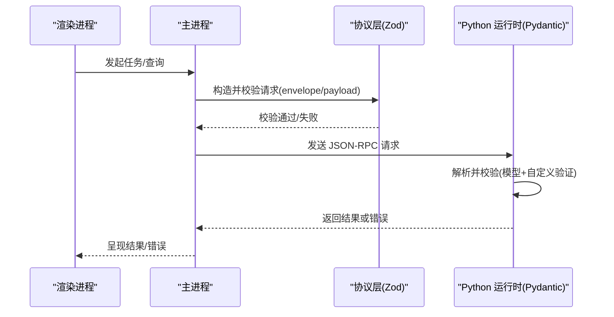

# 代码规范

<cite>
**本文引用的文件**
- [apps/desktop/eslint.config.mjs](file://apps/desktop/eslint.config.mjs)
- [apps/desktop/.prettierrc.yaml](file://apps/desktop/.prettierrc.yaml)
- [apps/desktop/tsconfig.json](file://apps/desktop/tsconfig.json)
- [apps/desktop/tsconfig.node.json](file://apps/desktop/tsconfig.node.json)
- [apps/desktop/tsconfig.web.json](file://apps/desktop/tsconfig.web.json)
- [services/agent-runtime/pyproject.toml](file://services/agent-runtime/pyproject.toml)
- [services/agent-runtime/src/personal_agent/protocol/models.py](file://services/agent-runtime/src/personal_agent/protocol/models.py)
- [packages/protocol/schemas/index.ts](file://packages/protocol/schemas/index.ts)
- [packages/protocol/schemas/errors.ts](file://packages/protocol/schemas/errors.ts)
- [packages/protocol/schemas/host.ts](file://packages/protocol/schemas/host.ts)
- [apps/desktop/src/main/runtime/error-code.ts](file://apps/desktop/src/main/runtime/error-code.ts)
- [apps/desktop/src/main/tasks/run-task.ts](file://apps/desktop/src/main/tasks/run-task.ts)
- [apps/desktop/src/main/runtime/timeouts.test.ts](file://apps/desktop/src/main/runtime/timeouts.test.ts)
- [apps/desktop/src/renderer/src/view-model.ts](file://apps/desktop/src/renderer/src/view-model.ts)
- [docs/adr/0001-file-boundaries-deviations.md](file://docs/adr/0001-file-boundaries-deviations.md)
</cite>

## 目录
1. [简介](#简介)
2. [项目结构](#项目结构)
3. [核心组件](#核心组件)
4. [架构总览](#架构总览)
5. [详细组件分析](#详细组件分析)
6. [依赖关系分析](#依赖关系分析)
7. [性能考虑](#性能考虑)
8. [故障排查指南](#故障排查指南)
9. [结论](#结论)
10. [附录](#附录)

## 简介
本规范面向 PersonalAgent 仓库，统一 TypeScript/JavaScript 与 Python 的编码标准、类型定义、格式化、命名约定、文件组织、注释规范以及质量检查工具链的使用方式。重点覆盖：
- TypeScript/JavaScript：ESLint 规则、Prettier 配置、TypeScript 编译选项与路径映射、React/Hooks 规范。
- Python：PEP 8 风格、Pydantic 模型定义、错误码与异常处理模式。
- 跨语言协议层：JSON-RPC 信封与业务载荷的类型契约（TS Zod + Pydantic）。
- 自动化：ESLint、Prettier、Ruff、pytest 等工具的集成与使用建议。

## 项目结构
仓库采用多包/多应用结构：
- apps/desktop：Electron 桌面端（主进程、渲染进程、preload、共享类型），包含 ESLint/Prettier/TS 配置。
- services/agent-runtime：Python Agent 运行时，基于 Pydantic 定义协议模型，提供任务执行、规划、宿主能力调用等。
- packages/protocol：TS 侧协议类型与校验（Zod），作为 TS↔Python 的契约中心。
- docs/adr：架构决策记录，包含对“文件边界”的实际偏差说明。

```mermaid
graph TB
subgraph "桌面端"
A["apps/desktop<br/>ESLint / Prettier / TS"]
B["apps/desktop/src/main<br/>主进程逻辑"]
C["apps/desktop/src/renderer<br/>渲染进程 UI"]
end
subgraph "协议层"
D["packages/protocol/schemas<br/>Zod 类型与校验"]
end
subgraph "Python 运行时"
E["services/agent-runtime<br/>Pydantic 模型 / 引擎"]
end
A --> B
A --> C
B < --> D
C < --> D
B < --> E
C < --> E
```

图表来源
- [apps/desktop/eslint.config.mjs:1-44](file://apps/desktop/eslint.config.mjs#L1-L44)
- [apps/desktop/.prettierrc.yaml:1-5](file://apps/desktop/.prettierrc.yaml#L1-L5)
- [apps/desktop/tsconfig.json:1-11](file://apps/desktop/tsconfig.json#L1-L11)
- [apps/desktop/tsconfig.node.json:1-14](file://apps/desktop/tsconfig.node.json#L1-L14)
- [apps/desktop/tsconfig.web.json:1-25](file://apps/desktop/tsconfig.web.json#L1-L25)
- [packages/protocol/schemas/index.ts:1-8](file://packages/protocol/schemas/index.ts#L1-L8)
- [services/agent-runtime/src/personal_agent/protocol/models.py:1-368](file://services/agent-runtime/src/personal_agent/protocol/models.py#L1-L368)

章节来源
- [apps/desktop/eslint.config.mjs:1-44](file://apps/desktop/eslint.config.mjs#L1-L44)
- [apps/desktop/.prettierrc.yaml:1-5](file://apps/desktop/.prettierrc.yaml#L1-L5)
- [apps/desktop/tsconfig.json:1-11](file://apps/desktop/tsconfig.json#L1-L11)
- [apps/desktop/tsconfig.node.json:1-14](file://apps/desktop/tsconfig.node.json#L1-L14)
- [apps/desktop/tsconfig.web.json:1-25](file://apps/desktop/tsconfig.web.json#L1-L25)
- [packages/protocol/schemas/index.ts:1-8](file://packages/protocol/schemas/index.ts#L1-L8)
- [services/agent-runtime/src/personal_agent/protocol/models.py:1-368](file://services/agent-runtime/src/personal_agent/protocol/models.py#L1-L368)

## 核心组件
- TypeScript/JavaScript 质量与格式
  - ESLint：启用 Electron/TS/React/Hooks/Refresh 推荐规则；针对 shadcn/ui 生成目录关闭部分严格规则，避免生成物干扰。
  - Prettier：单引号、无分号、行宽 100、尾逗号不添加。
  - TypeScript：启用 noImplicitAny；通过 tsconfig 拆分 node/web 构建；路径别名 @renderer/* 与 @personal-agent/protocol 指向协议包。
- Python 质量与类型
  - 依赖 pydantic>=2.x，用于 JSON-RPC 请求/响应及业务载荷的强类型校验。
  - 测试与 lint：pytest、ruff 在 dev 依赖中声明。
- 协议层
  - TS 侧使用 Zod 定义 envelope 与 payload，Python 侧使用 Pydantic 镜像同一契约，确保两端一致。
  - 错误码集中管理：TS 侧 runtime error-code.ts 与 protocol errors.ts；Python 侧通过模型字段与自定义校验保证一致性。

章节来源
- [apps/desktop/eslint.config.mjs:1-44](file://apps/desktop/eslint.config.mjs#L1-L44)
- [apps/desktop/.prettierrc.yaml:1-5](file://apps/desktop/.prettierrc.yaml#L1-L5)
- [apps/desktop/tsconfig.node.json:1-14](file://apps/desktop/tsconfig.node.json#L1-L14)
- [apps/desktop/tsconfig.web.json:1-25](file://apps/desktop/tsconfig.web.json#L1-L25)
- [services/agent-runtime/pyproject.toml:1-27](file://services/agent-runtime/pyproject.toml#L1-L27)
- [packages/protocol/schemas/errors.ts:1-30](file://packages/protocol/schemas/errors.ts#L1-L30)
- [apps/desktop/src/main/runtime/error-code.ts:1-18](file://apps/desktop/src/main/runtime/error-code.ts#L1-L18)

## 架构总览
下图展示桌面端、协议层与 Python 运行时的交互关系，以及类型校验在两端如何保持一致。



图表来源
- [packages/protocol/schemas/host.ts:44-75](file://packages/protocol/schemas/host.ts#L44-L75)
- [services/agent-runtime/src/personal_agent/protocol/models.py:14-31](file://services/agent-runtime/src/personal_agent/protocol/models.py#L14-L31)
- [apps/desktop/src/main/tasks/run-task.ts:25-57](file://apps/desktop/src/main/tasks/run-task.ts#L25-L57)

## 详细组件分析

### TypeScript/JavaScript 编码规范
- ESLint
  - 启用 Electron/TS/React/Hooks/Refresh 推荐规则集。
  - 针对 shadcn/ui 生成目录关闭显式返回类型与导出组件限制，避免生成物引发误报。
  - 与 Prettier 集成，保持格式与规则解耦。
- Prettier
  - 单引号、无分号、行宽 100、无尾逗号。
- TypeScript
  - 开启 noImplicitAny，强制显式类型。
  - 使用 composite 与 references 拆分 node/web 构建。
  - 路径别名：@renderer/* 指向渲染源码；@personal-agent/protocol 指向协议包 schemas。
- React/Hooks
  - 启用 react-hooks/recommended 与 react-refresh 规则，保障 Hooks 使用正确性与开发体验。

章节来源
- [apps/desktop/eslint.config.mjs:1-44](file://apps/desktop/eslint.config.mjs#L1-L44)
- [apps/desktop/.prettierrc.yaml:1-5](file://apps/desktop/.prettierrc.yaml#L1-L5)
- [apps/desktop/tsconfig.node.json:1-14](file://apps/desktop/tsconfig.node.json#L1-L14)
- [apps/desktop/tsconfig.web.json:1-25](file://apps/desktop/tsconfig.web.json#L1-L25)

### Python 编码规范
- PEP 8
  - 遵循通用 Python 风格；本项目通过 ruff 进行静态检查（dev 依赖）。
- Pydantic 模型
  - 使用 BaseModel、Field、model_validator 等实现强类型与自定义校验。
  - 对 JSON-RPC 的 result/error 互斥性进行约束，避免同时存在或缺失。
  - 使用 Literal、Annotated、discriminator 表达联合类型与判别字段。
- 错误处理
  - 错误码集中管理于 TS 侧（error-code.ts、errors.ts），Python 侧通过模型字段与校验保证一致性。
  - 方法不存在、参数非法、权限不足等场景通过明确的错误码与消息返回。

章节来源
- [services/agent-runtime/pyproject.toml:1-27](file://services/agent-runtime/pyproject.toml#L1-L27)
- [services/agent-runtime/src/personal_agent/protocol/models.py:14-31](file://services/agent-runtime/src/personal_agent/protocol/models.py#L14-L31)
- [services/agent-runtime/src/personal_agent/protocol/models.py:109-119](file://services/agent-runtime/src/personal_agent/protocol/models.py#L109-L119)
- [services/agent-runtime/src/personal_agent/protocol/models.py:209-219](file://services/agent-runtime/src/personal_agent/protocol/models.py#L209-L219)
- [services/agent-runtime/src/personal_agent/protocol/models.py:258-268](file://services/agent-runtime/src/personal_agent/protocol/models.py#L258-L268)
- [packages/protocol/schemas/errors.ts:1-30](file://packages/protocol/schemas/errors.ts#L1-L30)
- [apps/desktop/src/main/runtime/error-code.ts:1-18](file://apps/desktop/src/main/runtime/error-code.ts#L1-L18)

### 命名约定
- 方法名/能力标识
  - 小写字母开头，下划线分隔，支持点号层级（如 host.execute_tool、agent.run_task）。
- 常量与枚举
  - 错误码以全大写常量形式集中声明（ERROR_CODE、RUNTIME_ERROR_CODE）。
- 字段命名
  - 使用驼峰（如 absolutePath、occurredAt）以保持与 JSON 键一致。
- 模块与包
  - Python 包 personal_agent 下按职责划分：protocol、tools、runtime 等；TS 侧按 main/renderer/shared 分层。

章节来源
- [services/agent-runtime/src/personal_agent/protocol/models.py:75-86](file://services/agent-runtime/src/personal_agent/protocol/models.py#L75-L86)
- [packages/protocol/schemas/errors.ts:1-30](file://packages/protocol/schemas/errors.ts#L1-L30)
- [apps/desktop/src/main/runtime/error-code.ts:1-18](file://apps/desktop/src/main/runtime/error-code.ts#L1-L18)

### 文件组织结构
- 桌面端
  - src/main：主进程逻辑（能力、策略、数据库、任务、权限、运行时）。
  - src/renderer：渲染进程 UI 与视图模型。
  - src/preload：预加载脚本与类型声明。
  - src/shared：共享领域模型与 IPC 契约。
- 协议层
  - packages/protocol/schemas：按能力域拆分的 Zod 类型（envelope、errors、filesystem、host、document、agent、systems）。
- Python 运行时
  - services/agent-runtime/src/personal_agent：协议模型、引擎、规划、宿主通道、脚本化模型、摘要等。

章节来源
- [docs/adr/0001-file-boundaries-deviations.md:48-65](file://docs/adr/0001-file-boundaries-deviations.md#L48-L65)
- [packages/protocol/schemas/index.ts:1-8](file://packages/protocol/schemas/index.ts#L1-L8)

### 注释规范
- 关键行为与约束应在模型或函数附近以注释说明设计意图与边界条件（例如 result/error 互斥、空计划不允许等）。
- 对外暴露的错误码应附带可读性信息，便于定位问题。
- 视图层事件描述需保持单行输出，避免破坏 UI 布局。

章节来源
- [services/agent-runtime/src/personal_agent/protocol/models.py:234-249](file://services/agent-runtime/src/personal_agent/protocol/models.py#L234-L249)
- [apps/desktop/src/renderer/src/view-model.ts:54-89](file://apps/desktop/src/renderer/src/view-model.ts#L54-L89)

### 代码质量检查与自动化
- TypeScript/JavaScript
  - ESLint：通过 flat config 引入推荐规则，结合 Prettier 保持格式一致。
  - Prettier：统一缩进、引号、分号、行宽与尾逗号。
  - TypeScript：noImplicitAny、composite、paths 别名提升类型安全与可维护性。
- Python
  - Ruff：作为 Linter（dev 依赖），建议配合 pre-commit 钩子在提交前运行。
  - pytest：测试入口与路径在 pyproject.toml 中声明。
- 建议
  - 在编辑器中启用 ESLint/Prettier 保存时自动修复。
  - 在 CI 中并行运行 ESLint、Prettier 检查、TypeScript 编译、pytest 与 ruff。

章节来源
- [apps/desktop/eslint.config.mjs:1-44](file://apps/desktop/eslint.config.mjs#L1-L44)
- [apps/desktop/.prettierrc.yaml:1-5](file://apps/desktop/.prettierrc.yaml#L1-L5)
- [services/agent-runtime/pyproject.toml:17-27](file://services/agent-runtime/pyproject.toml#L17-L27)

### 常见风格示例与反模式
- 示例
  - 使用 Pydantic model_validator 校验 result/error 互斥。
  - 使用 Zod superRefine 在 TS 侧做同样的互斥校验。
  - 使用 Literal 与 discriminator 表达联合类型（如 RunTaskResult）。
- 反模式
  - 在 response 中同时设置 result 与 error。
  - 在 response 中两者都缺失。
  - 将任意对象直接透传到 UI 而不做摘要与截断，导致布局崩溃。
  - 忽略错误码登记，导致未知错误被降级为笼统的 CRASHED。

章节来源
- [services/agent-runtime/src/personal_agent/protocol/models.py:27-31](file://services/agent-runtime/src/personal_agent/protocol/models.py#L27-L31)
- [packages/protocol/schemas/host.ts:47-67](file://packages/protocol/schemas/host.ts#L47-L67)
- [apps/desktop/src/main/tasks/run-task.ts:25-37](file://apps/desktop/src/main/tasks/run-task.ts#L25-L37)
- [apps/desktop/src/renderer/src/view-model.ts:242-267](file://apps/desktop/src/renderer/src/view-model.ts#L242-L267)

## 依赖关系分析
- 桌面端依赖协议层的 Zod 类型，Python 运行时依赖 Pydantic 模型，二者共同维护 JSON-RPC 契约。
- 运行时超时与错误码由桌面端集中管理，Python 侧通过模型与校验保持一致。

```mermaid
graph LR
TS_Main["桌面端主进程"] --> TS_Zod["协议层(Zod)"]
TS_Renderer["渲染进程"] --> TS_Zod
TS_Main --> Py_Models["Python 模型(Pydantic)"]
TS_Zod <- --> Py_Models
```

图表来源
- [apps/desktop/tsconfig.node.json:1-14](file://apps/desktop/tsconfig.node.json#L1-L14)
- [apps/desktop/tsconfig.web.json:1-25](file://apps/desktop/tsconfig.web.json#L1-L25)
- [packages/protocol/schemas/index.ts:1-8](file://packages/protocol/schemas/index.ts#L1-L8)
- [services/agent-runtime/src/personal_agent/protocol/models.py:1-368](file://services/agent-runtime/src/personal_agent/protocol/models.py#L1-L368)

章节来源
- [apps/desktop/tsconfig.node.json:1-14](file://apps/desktop/tsconfig.node.json#L1-L14)
- [apps/desktop/tsconfig.web.json:1-25](file://apps/desktop/tsconfig.web.json#L1-L25)
- [packages/protocol/schemas/index.ts:1-8](file://packages/protocol/schemas/index.ts#L1-L8)
- [services/agent-runtime/src/personal_agent/protocol/models.py:1-368](file://services/agent-runtime/src/personal_agent/protocol/models.py#L1-L368)

## 性能考虑
- 超时与并发
  - 桌面端对权限 TTL、宿主工具调用超时、模型决策余量、任务总超时等进行集中管理与推导，确保 TS 等待时间大于 Python 最坏执行时间，避免资源泄漏与悬挂写入。
- 数据序列化
  - 协议层使用最小必要字段传输，避免冗余；对大体积 arguments 进行摘要与截断，防止 UI 卡顿。
- 类型校验
  - 在边界处尽早校验（Zod/Pydantic），减少无效计算与错误传播成本。

章节来源
- [apps/desktop/src/main/runtime/timeouts.test.ts:30-57](file://apps/desktop/src/main/runtime/timeouts.test.ts#L30-L57)
- [apps/desktop/src/renderer/src/view-model.ts:242-267](file://apps/desktop/src/renderer/src/view-model.ts#L242-L267)

## 故障排查指南
- 协议校验失败
  - 检查 JSON 是否合法、method 是否存在、result/error 是否互斥且非空。
  - 参考 TS 与 Python 两端的模型定义与测试用例。
- 错误码识别
  - 若收到未登记的新错误码，桌面端会将其归并为 RUNTIME_CRASHED；请补充到错误码表以便前端准确展示。
- 权限与路径
  - 路径规范化与哈希指纹用于权限判定与去重，注意 Windows/POSIX 路径差异与转义。
- 运行时状态
  - 关注 NOT_STARTED、TIMEOUT、CANCELLED、STOPPED、CRASHED、HANDSHAKE_FAILED、RESPONSE_INVALID、PLAN_INVALID、PLAN_NOT_BUILDABLE、DB_FAILED、TASK_BUSY、ORPHANED 等状态码。

章节来源
- [packages/protocol/schemas/host.ts:47-67](file://packages/protocol/schemas/host.ts#L47-L67)
- [apps/desktop/src/main/runtime/error-code.ts:1-18](file://apps/desktop/src/main/runtime/error-code.ts#L1-L18)
- [apps/desktop/src/main/tasks/run-task.ts:25-37](file://apps/desktop/src/main/tasks/run-task.ts#L25-L37)

## 结论
本项目通过统一的协议层（Zod + Pydantic）、严格的类型与格式规则（ESLint + Prettier + TS）、以及集中的错误码与超时管理，实现了跨语言的高内聚、低耦合与高可维护性。建议在团队内推广以下实践：
- 新增能力时同步更新 TS 与 Python 模型，并通过测试覆盖。
- 所有外部输入在边界处进行强类型校验。
- 错误码集中管理，禁止散落字符串。
- 使用 Prettier/ESLint/Ruff/pytest 在本地与 CI 中强制执行。

## 附录
- 常用命令建议
  - TS/JS：eslint --fix、prettier --write、tsc --build。
  - Python：ruff check、pytest。
- 相关文件
  - 桌面端配置：eslint.config.mjs、.prettierrc.yaml、tsconfig.*。
  - 协议层：packages/protocol/schemas/*。
  - Python 运行时：services/agent-runtime/src/personal_agent/protocol/models.py、pyproject.toml。