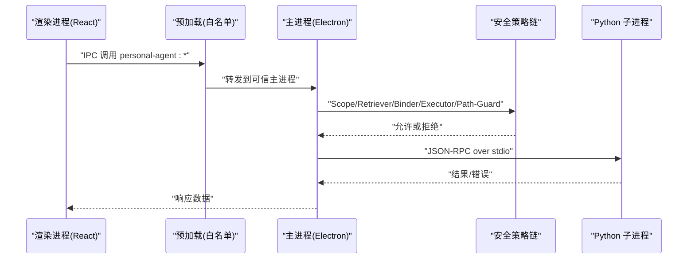
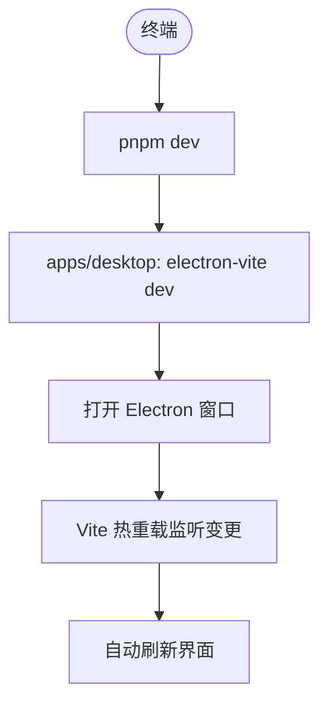
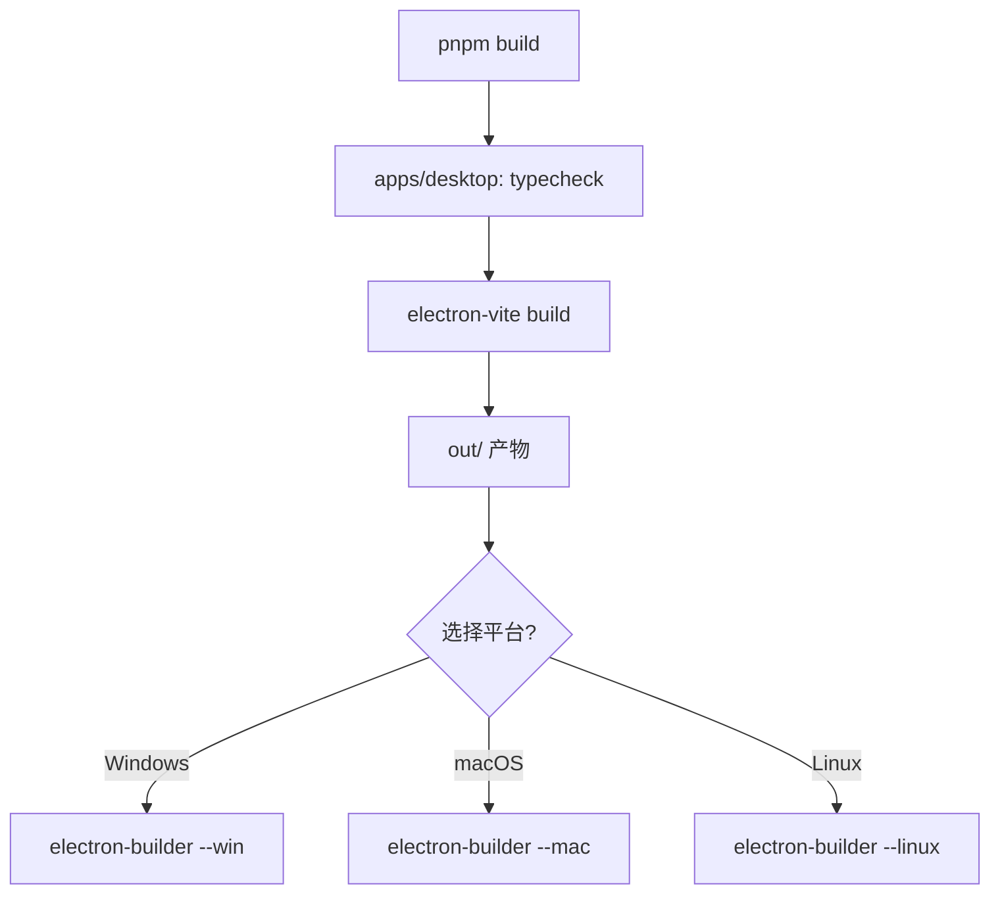
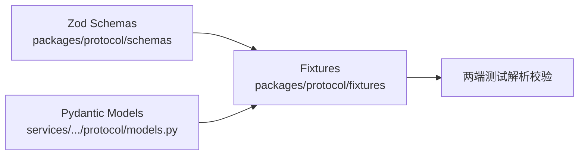
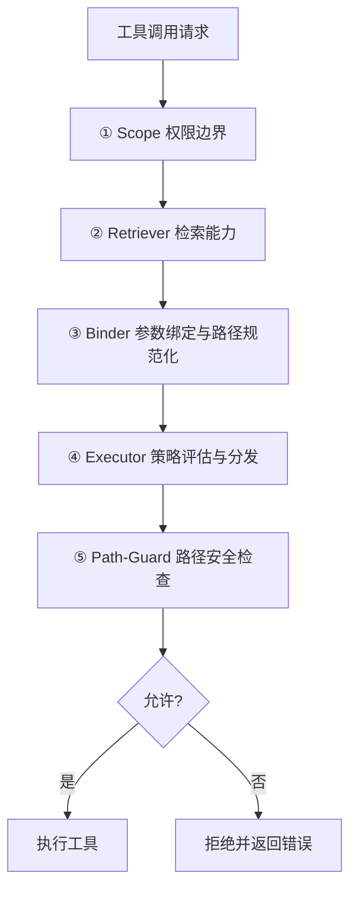
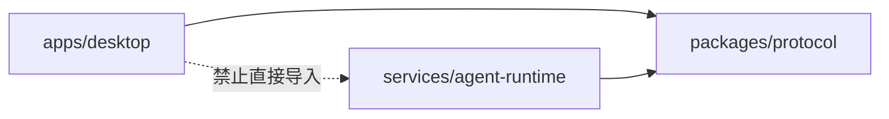

# 开发工作流

<cite>
**本文引用的文件**
- [package.json](file://package.json)
- [pnpm-workspace.yaml](file://pnpm-workspace.yaml)
- [apps/desktop/package.json](file://apps/desktop/package.json)
- [apps/desktop/electron.vite.config.ts](file://apps/desktop/electron.vite.config.ts)
- [apps/desktop/electron-builder.yml](file://apps/desktop/electron-builder.yml)
- [apps/desktop/README.md](file://apps/desktop/README.md)
- [AGENTS.md](file://AGENTS.md)
- [apps/desktop/src/main/product-state/tool-execution-repository.ts](file://apps/desktop/src/main/product-state/tool-execution-repository.ts)
- [apps/desktop/src/main/product-state/tool-execution-repository.test.ts](file://apps/desktop/src/main/product-state/tool-execution-repository.test.ts)
- [services/agent-runtime/pyproject.toml](file://services/agent-runtime/pyproject.toml)
- [packages/protocol/package.json](file://packages/protocol/package.json)
</cite>

## 目录
1. [简介](#简介)
2. [项目结构](#项目结构)
3. [核心组件](#核心组件)
4. [架构总览](#架构总览)
5. [详细组件分析](#详细组件分析)
6. [依赖关系分析](#依赖关系分析)
7. [性能与构建注意事项](#性能与构建注意事项)
8. [故障排查指南](#故障排查指南)
9. [结论](#结论)
10. [附录：开发与提交清单](#附录开发与提交清单)

## 简介
本文件面向贡献者与日常开发者，系统化说明从需求到提交的完整工作流、日常开发任务（启动、热重载、构建、打包）、Git 分支策略、代码审查与发布流程、环境同步更新方法，以及贡献代码与报告 bug 的标准步骤。内容基于仓库现有配置与脚本，确保可操作、可验证。

## 项目结构
本项目为 pnpm monorepo，包含三个主要区域：
- apps/desktop：Electron + React + TypeScript 桌面应用（主进程、渲染进程、预加载）
- packages/protocol：跨语言协议契约包（Zod schema），被 TS 与 Python 侧共同遵守
- services/agent-runtime：Python 运行时服务，通过 JSON-RPC over stdio 与主进程通信

```mermaid
graph TB
subgraph "桌面端"
A["apps/desktop<br/>Electron + React"]
end
subgraph "协议层"
B["packages/protocol<br/>Zod Schema"]
end
subgraph "后端运行期"
C["services/agent-runtime<br/>Python Runtime"]
end
A --> B
C --> B
A < --> |JSON-RPC over stdio| C
```

**图表来源**
- [pnpm-workspace.yaml:1-13](file://pnpm-workspace.yaml#L1-L13)
- [apps/desktop/electron.vite.config.ts:6-23](file://apps/desktop/electron.vite.config.ts#L6-L23)
- [AGENTS.md:76-97](file://AGENTS.md#L76-L97)

**章节来源**
- [pnpm-workspace.yaml:1-13](file://pnpm-workspace.yaml#L1-L13)
- [AGENTS.md:76-97](file://AGENTS.md#L76-L97)

## 核心组件
- 根工作区脚本：统一入口，聚合类型检查、Lint、测试、构建等命令
- 桌面应用脚本：开发预览、构建、平台打包
- Python 运行时：独立包，使用 uv 管理依赖与运行测试
- 协议包：纯契约，TS 与 Python 通过 Zod/Pydantic 镜像与 fixtures 保持一致

关键脚本速查：
- 根级
  - 开发：pnpm dev
  - 全量校验：pnpm verify
  - 全量校验+构建：pnpm verify:all
  - 测试：pnpm test
  - 构建：pnpm build
- 桌面端
  - 开发预览：pnpm dev（electron-vite dev）
  - 构建产物：pnpm build（typecheck + electron-vite build）
  - 平台打包：build:win / build:mac / build:linux
- Python
  - Lint：pnpm lint:py
  - 修复：pnpm fix:py
  - 测试：pnpm test:py

**章节来源**
- [package.json:6-18](file://package.json#L6-L18)
- [apps/desktop/package.json:8-21](file://apps/desktop/package.json#L8-L21)
- [services/agent-runtime/pyproject.toml:17-21](file://services/agent-runtime/pyproject.toml#L17-L21)
- [AGENTS.md:122-145](file://AGENTS.md#L122-L145)

## 架构总览
桌面端通过 IPC 调用主进程，主进程负责权限与安全策略链，并启动 Python 子进程执行工具能力；协议在 packages/protocol 中定义，TS 与 Python 各自实现以保障一致性。



**图表来源**
- [AGENTS.md:174-187](file://AGENTS.md#L174-L187)
- [apps/desktop/electron.vite.config.ts:6-23](file://apps/desktop/electron.vite.config.ts#L6-L23)

## 详细组件分析

### 开发服务器与热重载
- 启动开发服务器：pnpm dev（根级），内部调用 apps/desktop 的 electron-vite dev
- 热重载：electron-vite 默认启用 Vite HMR，修改前端代码即时刷新
- 预览模式：apps/desktop 提供 start 命令用于预览构建产物



**图表来源**
- [package.json:7](file://package.json#L7)
- [apps/desktop/package.json:15-16](file://apps/desktop/package.json#L15-L16)

**章节来源**
- [apps/desktop/README.md:17-21](file://apps/desktop/README.md#L17-L21)
- [apps/desktop/package.json:15-16](file://apps/desktop/package.json#L15-L16)

### 构建与打包
- 构建：pnpm build（根级），内部执行 apps/desktop 的 typecheck + electron-vite build
- 平台打包：
  - Windows：pnpm build:win
  - macOS：pnpm build:mac
  - Linux：pnpm build:linux
- 打包配置：electron-builder.yml 控制产物名称、asar 排除、平台权限与发布地址



**图表来源**
- [package.json:16-18](file://package.json#L16-L18)
- [apps/desktop/package.json:17-21](file://apps/desktop/package.json#L17-L21)
- [apps/desktop/electron-builder.yml:1-45](file://apps/desktop/electron-builder.yml#L1-L45)

**章节来源**
- [apps/desktop/package.json:17-21](file://apps/desktop/package.json#L17-L21)
- [apps/desktop/electron-builder.yml:1-45](file://apps/desktop/electron-builder.yml#L1-L45)

### 协议与双模型同步（Zod ↔ Pydantic ↔ Fixtures）
- 单一事实来源：packages/protocol/schemas/*.ts
- Python 镜像：services/agent-runtime/src/personal_agent/protocol/models.py
- 交叉验证：packages/protocol/fixtures/*.json 被两端解析校验



**图表来源**
- [AGENTS.md:26-47](file://AGENTS.md#L26-L47)

**章节来源**
- [AGENTS.md:26-47](file://AGENTS.md#L26-L47)

### 安全策略链（五层纵深）
每次工具调用需经 Scope → Retriever → Binder → Executor → Path-Guard 逐层校验，任一层拒绝即终止。该流程由主进程集中执行，保证路径与权限判定在同一可信边界内完成。



**图表来源**
- [AGENTS.md:51-72](file://AGENTS.md#L51-L72)

**章节来源**
- [AGENTS.md:51-72](file://AGENTS.md#L51-L72)

### 状态机与数据库约束分离
- 合法值集合：SQL CHECK 约束
- 合法转换规则：Repository 层
- 状态枚举：TS readonly const 数组派生类型
- 领域错误：持久化层抛出专用错误，Service 层映射为全局错误码

**章节来源**
- [AGENTS.md:101-118](file://AGENTS.md#L101-L118)

### 协作模式：核心代码留 TODO(你填)（项目陪练）
本项目按陪练模式推进：AI 负责脚手架与验收，核心业务逻辑留给项目主人手写。
- 分工：AI 完整写出协议 schema/fixtures、类型与接口、migration DDL、仓储 SQL 样板、import 与接线、UI 布局以及全部测试（作为 TODO 的验收标准）；核心业务逻辑本体——状态机转换表、执行体的副作用编排、判定/校验函数、算法段（如时间解析）——留给主人填写。
- 标记统一为 `// TODO(你填): ...`（Python 侧 `# TODO(你填): ...`），全仓搜索该标记即为待办清单；填完必须删掉标记，保证搜索不出现陈旧项。
- 每个 TODO 必须自带足够上下文：输入输出契约、不变量与边界条件、失败时的稳定错误码、对应验收测试的文件名。
- AI 不得顺手代填 TODO 范围内的核心逻辑；主人填完前相关测试允许红，填完后 pnpm verify 必须全绿。
- 验收流程：主人填 TODO → AI 跑 pnpm verify → 对照指导书该 TASK 的 Validation 列核对 → 通过后标 ✅ 并提交。
- 归属边界拿不准时，按「这段代码错了会不会造成副作用/安全问题/契约漂移」判断：会 → 留给主人；不会 → AI 直接写完。
- 先例：product-state/tool-execution-repository.ts 的 `ALLOWED_TRANSITIONS` 转换表是第一个陪练点，由主人填写（原 TODO 标记已随填写移除），逐格一致性断言的测试由 AI 预先写好。

**章节来源**
- [AGENTS.md:149-170](file://AGENTS.md#L149-L170)
- [apps/desktop/src/main/product-state/tool-execution-repository.ts:13-36](file://apps/desktop/src/main/product-state/tool-execution-repository.ts#L13-L36)
- [apps/desktop/src/main/product-state/tool-execution-repository.test.ts:215-237](file://apps/desktop/src/main/product-state/tool-execution-repository.test.ts#L215-L237)

### 代码库探查：优先读 .repowiki
探查目录、理解代码结构时，先看 `.repowiki`，再钻源码，避免盲目全仓扫描。
- `.repowiki/zh/content/`：按主题组织的 wiki 文档（项目概述、架构设计、API 协议、AI 运行时、数据存储、权限管理系统、桌面应用、用户界面、开发指南、部署发布、故障排除）。
- `.repowiki/knowledge/zh/`：知识卡；其中 `_index.yaml` 记录各模块与源文件的映射关系。
- 规则：接到不熟悉的模块任务时，先读对应主题的 repowiki 文档建立全局认知，再定位源码细节；用 `_index.yaml` 的 `scope` / `source_files` 映射反查相关文件，代替全仓 grep；repowiki 是生成快照，可能滞后于代码，与源码冲突时以源码为准，并顺带指出过期之处；AGENTS.md 仍是结构性约定的最高权威，repowiki 只作导航与背景补充。

**章节来源**
- [AGENTS.md:8-22](file://AGENTS.md#L8-L22)

## 依赖关系分析
Monorepo 依赖方向严格单向：apps/desktop 与 services/agent-runtime 均依赖 packages/protocol，但彼此不直接 import。



**图表来源**
- [AGENTS.md:76-97](file://AGENTS.md#L76-L97)
- [pnpm-workspace.yaml:1-13](file://pnpm-workspace.yaml#L1-L13)

**章节来源**
- [AGENTS.md:76-97](file://AGENTS.md#L76-L97)
- [pnpm-workspace.yaml:1-13](file://pnpm-workspace.yaml#L1-L13)

## 性能与构建注意事项
- 全量校验耗时约 20–30 秒，建议每次改动后运行 pnpm verify
- Protocol 包不在 node_modules，需通过 tsconfig paths + vitest alias 解析，避免漏跑测试
- 新建测试文件后需格式化 LF，否则 ESLint 可能报 CRLF warning（Windows）
- 构建产物不包含源码与配置文件，electron-builder 已过滤敏感与开发文件

**章节来源**
- [AGENTS.md:122-145](file://AGENTS.md#L122-L145)
- [apps/desktop/electron-builder.yml:5-11](file://apps/desktop/electron-builder.yml#L5-L11)

## 故障排查指南
- 类型检查失败：分别运行 apps/desktop 的 typecheck:node 与 typecheck:web，定位 TS 问题
- Lint 失败：运行 apps/desktop 的 lint 与根级 lint:py，按提示修复
- 测试失败：
  - 协议包测试：pnpm test:pack
  - 桌面端测试：pnpm test:ts
  - Python 测试：pnpm test:py
- 构建失败：先运行 pnpm build，再根据报错定位依赖或配置问题
- 打包失败：检查 electron-builder.yml 的平台配置与资源排除规则

**章节来源**
- [apps/desktop/package.json:8-21](file://apps/desktop/package.json#L8-L21)
- [package.json:6-18](file://package.json#L6-L18)
- [apps/desktop/electron-builder.yml:1-45](file://apps/desktop/electron-builder.yml#L1-L45)

## 结论
本项目采用清晰的 monorepo 结构与严格的依赖方向约束，配合统一的验证脚本与平台打包配置，形成从开发到发布的闭环。遵循 AGENTS.md 中的协议同步与安全策略链约定，可显著降低跨语言协作风险。建议在每次提交前运行 pnpm verify，确保质量门禁通过。

## 附录：开发与提交清单
- 环境准备
  - 安装依赖：pnpm install
  - 启动开发：pnpm dev
- 日常开发
  - 类型检查：pnpm typecheck
  - Lint：pnpm lint:ts 与 pnpm lint:py
  - 测试：pnpm test
  - 构建：pnpm build
  - 打包：pnpm build:win / build:mac / build:linux
- 提交前校验
  - 全量校验：pnpm verify
  - 全量校验+构建：pnpm verify:all
- 陪练待办（TODO(你填)）
  - 全仓搜索 `TODO(你填)` 标记即为待填核心逻辑清单
  - 填完删除标记，跑 pnpm verify 全绿后对照指导书 Validation 列验收
  - 探查不熟悉的模块前先读 .repowiki 对应主题文档与 knowledge/zh/_index.yaml
- Git 工作流与分支策略（建议）
  - 分支命名：feature/<功能>、fix/<问题>、chore/<维护>
  - 提交规范：语义化提交信息，关联需求或问题编号
  - 合并策略：PR 需通过 CI（verify）与至少一名 reviewer 批准
- 代码审查流程
  - 创建 PR，描述变更动机与影响范围
  - 审查要点：协议变更是否三端同步、安全策略链是否覆盖、测试是否充分
- 发布流程
  - 版本标记与变更日志更新
  - 平台打包产物上传至发布服务器（参考 electron-builder.yml publish 配置）
- 贡献代码与报告 Bug
  - Fork 仓库，创建功能分支，提交 PR
  - Bug 报告：提供复现步骤、环境信息、期望与实际行为

[本节为通用实践建议，未直接引用具体文件]