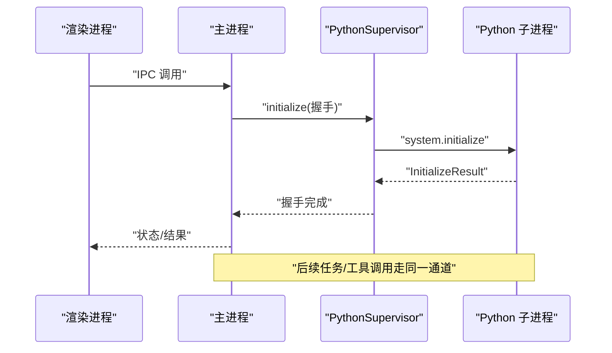
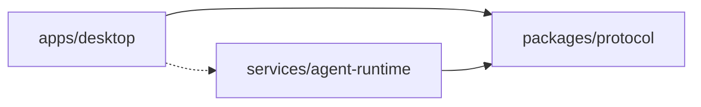

# 开发指南

<cite>
**本文引用的文件**
- [package.json](file://package.json)
- [pnpm-workspace.yaml](file://pnpm-workspace.yaml)
- [apps/desktop/package.json](file://apps/desktop/package.json)
- [apps/desktop/electron.vite.config.ts](file://apps/desktop/electron.vite.config.ts)
- [apps/desktop/eslint.config.mjs](file://apps/desktop/eslint.config.mjs)
- [apps/desktop/.prettierrc.yaml](file://apps/desktop/.prettierrc.yaml)
- [apps/desktop/tsconfig.json](file://apps/desktop/tsconfig.json)
- [apps/desktop/tsconfig.node.json](file://apps/desktop/tsconfig.node.json)
- [apps/desktop/vitest.config.ts](file://apps/desktop/vitest.config.ts)
- [apps/desktop/README.md](file://apps/desktop/README.md)
- [services/agent-runtime/pyproject.toml](file://services/agent-runtime/pyproject.toml)
- [services/agent-runtime/src/personal_agent/__main__.py](file://services/agent-runtime/src/personal_agent/__main__.py)
- [apps/desktop/src/main/index.ts](file://apps/desktop/src/main/index.ts)
- [apps/desktop/src/main/runtime/python-supervisor.ts](file://apps/desktop/src/main/runtime/python-supervisor.ts)
- [apps/desktop/src/main/runtime/runtime-host.ts](file://apps/desktop/src/main/runtime/runtime-host.ts)
- [packages/protocol/package.json](file://packages/protocol/package.json)
- [AGENTS.md](file://AGENTS.md)
</cite>

## 目录
1. [简介](#简介)
2. [项目结构](#项目结构)
3. [核心组件](#核心组件)
4. [架构总览](#架构总览)
5. [详细组件分析](#详细组件分析)
6. [依赖关系分析](#依赖关系分析)
7. [性能与可维护性建议](#性能与可维护性建议)
8. [故障排查指南](#故障排查指南)
9. [结论](#结论)
10. [附录：工作流与清单](#附录工作流与清单)

## 简介
本指南面向在本仓库进行功能开发、问题修复与重构的工程师，覆盖以下内容：
- 开发环境搭建（Node.js、Python、依赖安装与配置）
- 代码规范与编码标准（TypeScript/React ESLint + Prettier；Python Ruff）
- 调试技巧与工具（Electron DevTools、Python 子进程调试）
- 测试策略与用例编写（Vitest、pytest、E2E）
- 典型开发工作流（新功能、Bug 修复、重构）
- 常见问题与解决方案

## 项目结构
本项目为 pnpm workspace monorepo，包含三个主要区域：
- apps/desktop：Electron 桌面应用（主进程、渲染进程、预加载脚本），使用 Vite/Electron-vite 构建
- packages/protocol：跨语言协议契约包（Zod schema 与 JSON fixtures）
- services/agent-runtime：Python 运行时服务（通过 stdio NDJSON JSON-RPC 与主进程通信）

```mermaid
graph TB
subgraph "桌面应用"
A["apps/desktop<br/>Electron + React + TypeScript"]
end
subgraph "协议包"
B["packages/protocol<br/>Zod Schema + Fixtures"]
end
subgraph "Python 运行时"
C["services/agent-runtime<br/>Python 子进程"]
end
A --> B
C --> B
A < --> C
```

图表来源
- [pnpm-workspace.yaml:1-13](file://pnpm-workspace.yaml#L1-L13)
- [apps/desktop/electron.vite.config.ts:6-23](file://apps/desktop/electron.vite.config.ts#L6-L23)
- [packages/protocol/package.json:1-16](file://packages/protocol/package.json#L1-L16)
- [services/agent-runtime/pyproject.toml:1-22](file://services/agent-runtime/pyproject.toml#L1-L22)

章节来源
- [pnpm-workspace.yaml:1-13](file://pnpm-workspace.yaml#L1-L13)
- [apps/desktop/package.json:1-62](file://apps/desktop/package.json#L1-L62)
- [packages/protocol/package.json:1-16](file://packages/protocol/package.json#L1-L16)
- [services/agent-runtime/pyproject.toml:1-22](file://services/agent-runtime/pyproject.toml#L1-L22)

## 核心组件
- Electron 主进程入口与窗口管理：负责启动渲染页面、打开外部链接、DevTools 快捷键等
- Python 运行时监督器：以子进程方式启动 Python 服务，基于 NDJSON JSON-RPC 双向通信，处理握手、请求/响应、反向 RPC、超时与崩溃恢复
- 协议契约包：定义跨语言消息结构与校验规则，TS 侧用 Zod，Python 侧用 Pydantic 镜像，并通过共享 fixtures 做一致性验证
- 构建与测试：Vitest（TS）、pytest（Python）、Ruff（Python lint）、ESLint/Prettier（TS/JSX）

章节来源
- [apps/desktop/src/main/index.ts:78-104](file://apps/desktop/src/main/index.ts#L78-L104)
- [apps/desktop/src/main/runtime/python-supervisor.ts:1-356](file://apps/desktop/src/main/runtime/python-supervisor.ts#L1-L356)
- [packages/protocol/package.json:1-16](file://packages/protocol/package.json#L1-L16)
- [services/agent-runtime/pyproject.toml:1-22](file://services/agent-runtime/pyproject.toml#L1-L22)

## 架构总览
桌面端通过 IPC 调用主进程，主进程启动 Python 子进程并建立 JSON-RPC 通道。Python 侧在需要宿主能力时发起 host.execute_tool 反向 RPC，由主进程执行后返回结果。



图表来源
- [apps/desktop/src/main/runtime/python-supervisor.ts:129-153](file://apps/desktop/src/main/runtime/python-supervisor.ts#L129-L153)
- [apps/desktop/src/main/runtime/runtime-host.ts:15-20](file://apps/desktop/src/main/runtime/runtime-host.ts#L15-L20)
- [services/agent-runtime/src/personal_agent/__main__.py:1-5](file://services/agent-runtime/src/personal_agent/__main__.py#L1-L5)

## 详细组件分析

### 开发环境搭建
- Node.js 与 pnpm
  - 根脚本提供统一入口：dev、typecheck、lint、test、build、verify 等
  - workspace 将 apps、packages、services 纳入同一工程
- Python 运行时
  - 使用 uv 管理 Python 环境与依赖，pyproject 声明运行版本与依赖
  - Python 入口为模块模式，便于通过 python -m personal_agent 启动
- 安装步骤（建议在仓库根目录执行）
  - 安装 Node 依赖：pnpm install
  - 初始化 Python 环境：进入 services/agent-runtime 并使用 uv 创建虚拟环境并安装依赖
  - 验证：pnpm verify（类型检查、TS/Python lint、全部测试）

章节来源
- [package.json:6-20](file://package.json#L6-L20)
- [pnpm-workspace.yaml:1-13](file://pnpm-workspace.yaml#L1-L13)
- [services/agent-runtime/pyproject.toml:1-22](file://services/agent-runtime/pyproject.toml#L1-L22)
- [services/agent-runtime/src/personal_agent/__main__.py:1-5](file://services/agent-runtime/src/personal_agent/__main__.py#L1-L5)

### 代码规范与编码标准
- TypeScript/React
  - ESLint：启用 Electron Toolkit TS 推荐规则、React Hooks、React Refresh，关闭生成目录严格限制
  - Prettier：单引号、无分号、行宽 100、无尾随逗号
  - TypeScript：分离 node/web 编译目标，路径别名指向协议包与渲染源码
- Python
  - Ruff：作为 lint 工具，可通过根脚本统一执行
- 约定
  - 协议变更需同步 Zod、Pydantic 与 fixtures
  - 安全链五层校验不可绕过
  - Monorepo 依赖方向单向约束

章节来源
- [apps/desktop/eslint.config.mjs:1-44](file://apps/desktop/eslint.config.mjs#L1-L44)
- [apps/desktop/.prettierrc.yaml:1-5](file://apps/desktop/.prettierrc.yaml#L1-L5)
- [apps/desktop/tsconfig.json:1-11](file://apps/desktop/tsconfig.json#L1-L11)
- [apps/desktop/tsconfig.node.json:1-13](file://apps/desktop/tsconfig.node.json#L1-L13)
- [AGENTS.md:26-47](file://AGENTS.md#L26-L47)
- [AGENTS.md:51-97](file://AGENTS.md#L51-L97)

### 调试技巧与开发工具
- Electron DevTools
  - 开发模式下支持 F12 打开 DevTools，生产模式禁用热重载快捷键
  - 渲染进程通过 electron-vite 提供 HMR
- Python 子进程调试
  - 主进程通过 PythonSupervisor 启动 Python 子进程，stderr 事件会输出诊断信息
  - 可在 IDE 中直接调试 services/agent-runtime 下的 Python 代码，或通过 pytest 断点调试
- 常见调试要点
  - 确认 venv 存在且路径正确
  - 关注 initialize 握手失败、TIMEOUT、CRASHED 等错误码
  - 反向 RPC host.execute_tool 超时或处理器未注入时会返回明确错误

章节来源
- [apps/desktop/src/main/index.ts:78-104](file://apps/desktop/src/main/index.ts#L78-L104)
- [apps/desktop/src/main/runtime/python-supervisor.ts:96-126](file://apps/desktop/src/main/runtime/python-supervisor.ts#L96-L126)
- [apps/desktop/src/main/runtime/python-supervisor.ts:258-314](file://apps/desktop/src/main/runtime/python-supervisor.ts#L258-L314)
- [apps/desktop/src/main/runtime/runtime-host.ts:15-20](file://apps/desktop/src/main/runtime/runtime-host.ts#L15-L20)

### 测试策略与用例编写
- TypeScript/Vitest
  - 测试环境为 node，包含 main 与 renderer 的单元测试
  - 通过 alias 解析 @personal-agent/protocol 到 schemas/index.ts
- Python/pytest
  - 测试位于 services/agent-runtime/tests，使用 pytest 与 pytest-asyncio
  - 通过 pyproject 指定测试路径
- E2E
  - 真实 spawn Python 子进程，走完整 host.execute_tool 流程，验证端到端行为
- 建议
  - 新增字段必须补充 fixture 与双端解析测试
  - 关键路径增加确定性断言（如计划步骤顺序、能力名）

章节来源
- [apps/desktop/vitest.config.ts:1-17](file://apps/desktop/vitest.config.ts#L1-L17)
- [services/agent-runtime/pyproject.toml:17-22](file://services/agent-runtime/pyproject.toml#L17-L22)
- [AGENTS.md:26-47](file://AGENTS.md#L26-L47)

### 典型开发工作流示例
- 新功能开发
  - 在 packages/protocol 新增/修改 schema，并在 Python 侧镜像模型与 fixtures
  - 在 apps/desktop 实现能力注册与调用逻辑，确保通过安全链五层校验
  - 编写 Vitest/pytest 用例，必要时补充 E2E
  - 运行 pnpm verify 与 pnpm build 验证
- Bug 修复
  - 定位错误码与日志（TIMEOUT、CRASHED、HANDSHAKE_FAILED 等）
  - 复现最小用例，补充回归测试
  - 提交前运行 pnpm verify
- 代码重构
  - 保持协议不变，优先调整内部实现
  - 利用现有测试保护边界，逐步替换实现
  - 全量验证通过后合并

章节来源
- [AGENTS.md:26-47](file://AGENTS.md#L26-L47)
- [AGENTS.md:51-97](file://AGENTS.md#L51-L97)
- [AGENTS.md:122-145](file://AGENTS.md#L122-L145)

## 依赖关系分析
- 依赖方向
  - apps/desktop → packages/protocol（通过 tsconfig paths alias）
  - services/agent-runtime → packages/protocol（通过 Pydantic 镜像与 fixtures 对齐）
  - packages/protocol 不依赖其他两方
- 构建与运行
  - Electron 主进程通过 PythonSupervisor 启动 Python 子进程，使用相对路径定位 venv 中的解释器
  - 协议包仅依赖 zod，保证契约轻量稳定



图表来源
- [apps/desktop/tsconfig.node.json:1-13](file://apps/desktop/tsconfig.node.json#L1-L13)
- [apps/desktop/src/main/runtime/runtime-host.ts:15-20](file://apps/desktop/src/main/runtime/runtime-host.ts#L15-L20)
- [packages/protocol/package.json:1-16](file://packages/protocol/package.json#L1-L16)

章节来源
- [AGENTS.md:76-97](file://AGENTS.md#L76-L97)
- [apps/desktop/tsconfig.node.json:1-13](file://apps/desktop/tsconfig.node.json#L1-L13)
- [apps/desktop/src/main/runtime/runtime-host.ts:15-20](file://apps/desktop/src/main/runtime/runtime-host.ts#L15-L20)
- [packages/protocol/package.json:1-16](file://packages/protocol/package.json#L1-L16)

## 性能与可维护性建议
- 避免重复 spawn：主进程对 Python 子进程采用单例监督，防止资源泄漏
- 合理设置超时：默认请求超时与 host.execute_tool 超时需大于用户交互时间
- 协议变更影响面小：通过契约包集中管理，降低多端漂移风险
- 测试驱动：关键路径增加确定性断言，减少回归成本

[本节为通用建议，不直接分析具体文件]

## 故障排查指南
- 找不到 Python venv
  - 现象：运行时状态为 crashed，detail 提示找不到 venv python
  - 解决：确认 services/agent-runtime/.venv 存在且路径正确
- 握手失败
  - 现象：initialize 参数或结果不符合契约，抛出 HANDSHAKE_FAILED
  - 解决：核对协议版本、capabilities、client 信息
- 请求超时
  - 现象：TIMEOUT，检查 host.execute_tool 是否耗时过长或未注入 hostHandler
- 子进程崩溃
  - 现象：CRASHED，stderr 输出崩溃原因
  - 解决：查看 stderr 事件与 Python 日志，定位异常堆栈

章节来源
- [apps/desktop/src/main/runtime/runtime-host.ts:15-20](file://apps/desktop/src/main/runtime/runtime-host.ts#L15-L20)
- [apps/desktop/src/main/runtime/python-supervisor.ts:129-153](file://apps/desktop/src/main/runtime/python-supervisor.ts#L129-L153)
- [apps/desktop/src/main/runtime/python-supervisor.ts:156-200](file://apps/desktop/src/main/runtime/python-supervisor.ts#L156-L200)
- [apps/desktop/src/main/runtime/python-supervisor.ts:258-314](file://apps/desktop/src/main/runtime/python-supervisor.ts#L258-L314)
- [apps/desktop/src/main/runtime/python-supervisor.ts:332-345](file://apps/desktop/src/main/runtime/python-supervisor.ts#L332-L345)

## 结论
本指南提供了从环境搭建、规范配置、调试方法到测试与工作流的完整实践路径。遵循协议契约与安全链约束，配合统一的验证命令与测试策略，可以高效、稳定地推进功能开发与问题修复。

[本节为总结，不直接分析具体文件]

## 附录：工作流与清单
- 快速开始
  - 安装依赖：pnpm install
  - 启动开发：pnpm dev
  - 构建产物：pnpm build
  - 平台打包：pnpm build:win / build:mac / build:linux
- 质量门禁
  - 类型检查：pnpm typecheck
  - Lint：pnpm lint:ts、pnpm lint:py
  - 测试：pnpm test:pack、pnpm test:ts、pnpm test:py
  - 全量验证：pnpm verify、pnpm verify:all
- 调试清单
  - 确认 venv 存在与路径正确
  - 关注 initialize 握手与 stderr 输出
  - 检查 host.execute_tool 超时与处理器注入
  - 使用 Electron DevTools 调试渲染进程

章节来源
- [apps/desktop/README.md:9-35](file://apps/desktop/README.md#L9-L35)
- [package.json:6-20](file://package.json#L6-L20)
- [AGENTS.md:122-145](file://AGENTS.md#L122-L145)