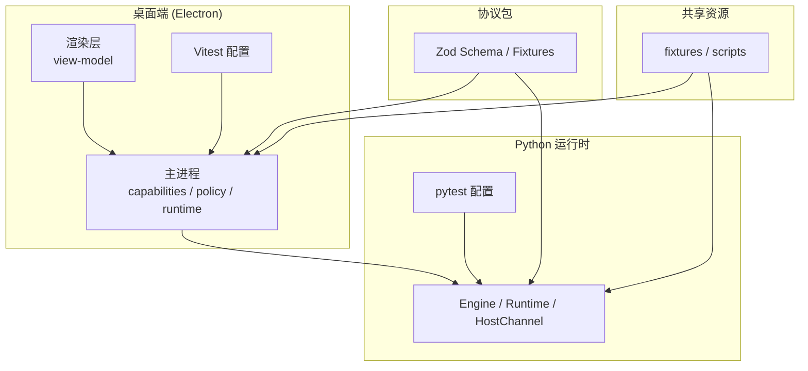
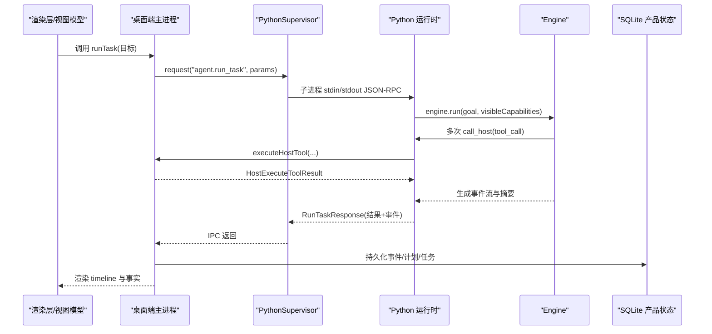
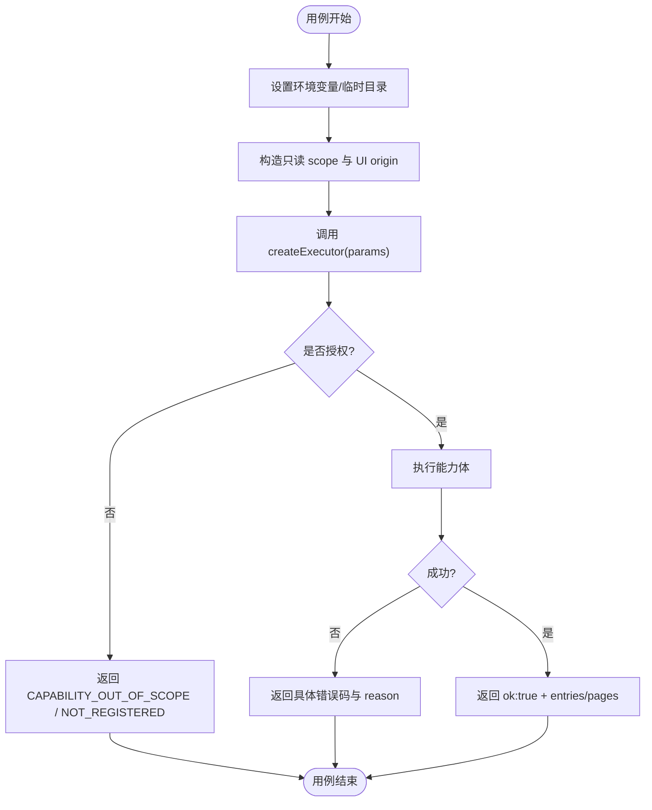
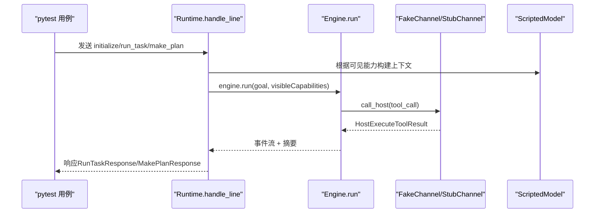
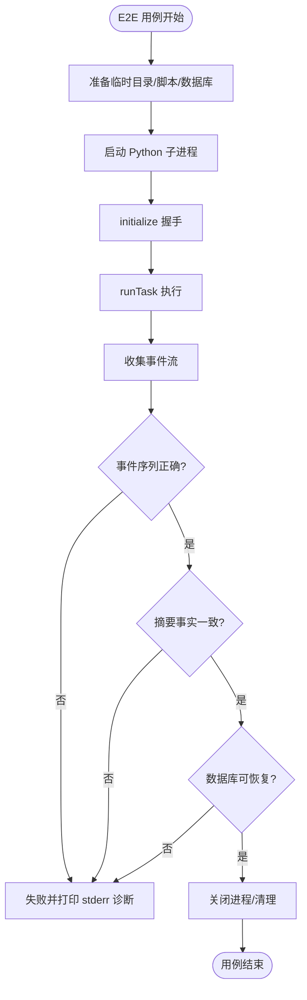
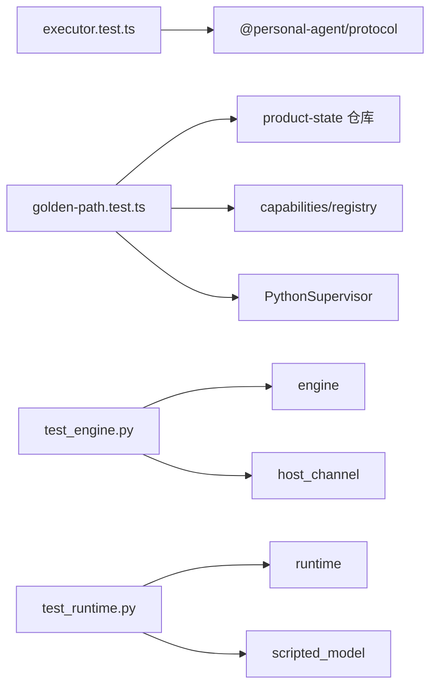

# 测试指南

<cite>
**本文引用的文件**
- [apps/desktop/vitest.config.ts](file://apps/desktop/vitest.config.ts)
- [services/agent-runtime/pyproject.toml](file://services/agent-runtime/pyproject.toml)
- [package.json](file://package.json)
- [apps/desktop/package.json](file://apps/desktop/package.json)
- [packages/protocol/package.json](file://packages/protocol/package.json)
- [apps/desktop/src/main/capabilities/executor.test.ts](file://apps/desktop/src/main/capabilities/executor.test.ts)
- [apps/desktop/src/main/e2e/golden-path.test.ts](file://apps/desktop/src/main/e2e/golden-path.test.ts)
- [apps/desktop/src/main/e2e/security-matrix.test.ts](file://apps/desktop/src/main/e2e/security-matrix.test.ts)
- [apps/desktop/src/main/capabilities/idempotency.test.ts](file://apps/desktop/src/main/capabilities/idempotency.test.ts)
- [apps/desktop/src/main/verification/verify-deliverables.test.ts](file://apps/desktop/src/main/verification/verify-deliverables.test.ts)
- [apps/desktop/src/main/verification/evidence-bundle.test.ts](file://apps/desktop/src/main/verification/evidence-bundle.test.ts)
- [apps/desktop/src/main/capabilities/idempotency-guard.test.ts](file://apps/desktop/src/main/capabilities/idempotency-guard.test.ts)
- [apps/desktop/src/main/capabilities/scheduler-create.test.ts](file://apps/desktop/src/main/capabilities/scheduler-create.test.ts)
- [apps/desktop/src/main/product-state/tool-execution-repository.test.ts](file://apps/desktop/src/main/product-state/tool-execution-repository.test.ts)
- [apps/desktop/src/main/product-state/reminder-repository.test.ts](file://apps/desktop/src/main/product-state/reminder-repository.test.ts)
- [apps/desktop/src/shared/domain.ts](file://apps/desktop/src/shared/domain.ts)
- [packages/protocol/tests/document.test.ts](file://packages/protocol/tests/document.test.ts)
- [packages/protocol/tests/scheduler.test.ts](file://packages/protocol/tests/scheduler.test.ts)
- [services/agent-runtime/tests/test_engine.py](file://services/agent-runtime/tests/test_engine.py)
- [services/agent-runtime/tests/test_runtime.py](file://services/agent-runtime/tests/test_runtime.py)
- [services/agent-runtime/tests/test_protocol_fixtures.py](file://services/agent-runtime/tests/test_protocol_fixtures.py)
- [apps/desktop/src/renderer/src/view-model.test.ts](file://apps/desktop/src/renderer/src/view-model.test.ts)
- [tests/fixtures/scripts/golden-path.json](file://tests/fixtures/scripts/golden-path.json)
</cite>

## 目录
1. [简介](#简介)
2. [项目结构](#项目结构)
3. [核心组件](#核心组件)
4. [架构总览](#架构总览)
5. [详细组件分析](#详细组件分析)
6. [依赖关系分析](#依赖关系分析)
7. [性能与稳定性考量](#性能与稳定性考量)
8. [故障排查指南](#故障排查指南)
9. [结论](#结论)
10. [附录：运行命令与覆盖率建议](#附录：运行命令与覆盖率建议)

## 简介
本指南面向 PersonalAgent 项目的测试策略与实践，覆盖前端（Electron）使用 Vitest、Python 运行时使用 pytest 的配置与用法；说明单元测试、集成测试、端到端测试的编写方法、数据准备与 Mock 策略、覆盖率要求；并提供能力测试、权限测试、任务执行测试的具体示例与最佳实践。同时给出测试自动化与持续集成的落地建议。

## 项目结构
仓库采用多包/多应用结构：
- apps/desktop：Electron 桌面端，包含主进程能力实现、产品状态、权限策略、任务执行等模块，以及基于 Vitest 的前端与主进程测试。
- services/agent-runtime：Python Agent 运行时，包含引擎、协议、模型网关、脚本化模型等，使用 pytest 进行单元测试与集成测试。
- packages/protocol：TS 协议与模式定义，使用 Vitest 校验契约。
- tests/fixtures：跨语言共享的固定数据（如 PDF 与脚本）。

**图表来源**
- [apps/desktop/vitest.config.ts:1-17](file://apps/desktop/vitest.config.ts#L1-L17)
- [services/agent-runtime/pyproject.toml:17-22](file://services/agent-runtime/pyproject.toml#L17-L22)
- [packages/protocol/package.json:6-8](file://packages/protocol/package.json#L6-L8)
- [apps/desktop/package.json:8-21](file://apps/desktop/package.json#L8-L21)

**章节来源**
- [apps/desktop/vitest.config.ts:1-17](file://apps/desktop/vitest.config.ts#L1-L17)
- [services/agent-runtime/pyproject.toml:17-22](file://services/agent-runtime/pyproject.toml#L17-L22)
- [package.json:6-20](file://package.json#L6-L20)
- [apps/desktop/package.json:8-21](file://apps/desktop/package.json#L8-L21)
- [packages/protocol/package.json:6-8](file://packages/protocol/package.json#L6-L8)

## 核心组件
- 测试框架与入口
  - 前端/主进程：Vitest（Node 环境），通过 apps/desktop/vitest.config.ts 指定 include 与别名。
  - Python：pytest（含 pytest-asyncio），通过 pyproject.toml 的 tool.pytest.ini_options 指定 testpaths。
  - 顶层脚本：package.json 提供统一入口 test:test:pack、test:ts、test:py、test、verify、verify:all。
- 测试分层
  - 单元测试：针对 executor、engine、runtime、view-model、协议 schema 等纯逻辑或边界行为。
  - 集成测试：跨模块协作（如 engine + host channel + model gateway），验证事件流与协议序列化。
  - 端到端测试：golden-path 以真实子进程启动 Python 运行时、真实 SQLite 数据库、真实 PDF 文件，走完整 runTask 流程；security-matrix 不 spawn Python，在 host 侧以全真组件组装完整 WRITE 安全链路，覆盖 Deny/Allow/Tamper/Traversal/Retry/Crash 六组场景。
- 测试数据与 Mock
  - 固定数据：tests/fixtures/scripts/golden-path.json 作为确定性“剧本”，驱动 TS E2E 与 Python 测试的一致性。
  - Mock 策略：Python 侧用 FakeChannel/StubChannel/ScriptedModel；TS 侧用 vi.stubEnv、自定义 retriever、临时目录隔离文件系统。

**章节来源**
- [apps/desktop/vitest.config.ts:1-17](file://apps/desktop/vitest.config.ts#L1-L17)
- [services/agent-runtime/pyproject.toml:17-22](file://services/agent-runtime/pyproject.toml#L17-L22)
- [package.json:6-20](file://package.json#L6-L20)
- [tests/fixtures/scripts/golden-path.json:1-45](file://tests/fixtures/scripts/golden-path.json#L1-L45)

## 架构总览
下图展示从桌面端发起任务到 Python 运行时执行的端到端调用链，以及测试如何介入断言关键路径。

**图表来源**
- [apps/desktop/src/main/e2e/golden-path.test.ts:218-273](file://apps/desktop/src/main/e2e/golden-path.test.ts#L218-L273)
- [services/agent-runtime/tests/test_runtime.py:255-348](file://services/agent-runtime/tests/test_runtime.py#L255-L348)
- [services/agent-runtime/tests/test_engine.py:328-351](file://services/agent-runtime/tests/test_engine.py#L328-L351)

## 详细组件分析

### 前端与主进程测试（Vitest）
- 配置要点
  - 环境：node（避免引入 DOM，除非测 UI 组件）。
  - 匹配规则：src/main/**/*.test.ts 与 src/renderer/src/**/*.test.ts。
  - 别名：@personal-agent/protocol 指向 schemas/index.ts，便于在测试中直接引用协议类型。
- 典型测试主题
  - 能力与权限：executor 的 authorize 顺序、scope 限制、错误码区分（未注册 vs 越权）。
  - 参数校验：二次校验 rootId/path 白名单与类型，确保 envelope 层之外的严格约束。
  - 文件系统与 PDF：根目录可用性、路径逃逸防护、PDF 业务失败透传。
  - 永不抛出：所有失败以 ok:false + code 形式返回，避免冒泡为 HOST_HANDLER_FAILED。
  - 渲染层：事件标签、状态标签、剩余时间格式化、payload 摘要、脏数据降级。

**图表来源**
- [apps/desktop/src/main/capabilities/executor.test.ts:78-118](file://apps/desktop/src/main/capabilities/executor.test.ts#L78-L118)
- [apps/desktop/src/main/capabilities/executor.test.ts:120-155](file://apps/desktop/src/main/capabilities/executor.test.ts#L120-L155)
- [apps/desktop/src/main/capabilities/executor.test.ts:157-202](file://apps/desktop/src/main/capabilities/executor.test.ts#L157-L202)
- [apps/desktop/src/main/capabilities/executor.test.ts:204-290](file://apps/desktop/src/main/capabilities/executor.test.ts#L204-L290)
- [apps/desktop/src/main/capabilities/executor.test.ts:292-336](file://apps/desktop/src/main/capabilities/executor.test.ts#L292-L336)
- [apps/desktop/src/main/capabilities/executor.test.ts:338-421](file://apps/desktop/src/main/capabilities/executor.test.ts#L338-L421)

**章节来源**
- [apps/desktop/vitest.config.ts:1-17](file://apps/desktop/vitest.config.ts#L1-L17)
- [apps/desktop/src/main/capabilities/executor.test.ts:78-421](file://apps/desktop/src/main/capabilities/executor.test.ts#L78-L421)
- [apps/desktop/src/renderer/src/view-model.test.ts:32-806](file://apps/desktop/src/renderer/src/view-model.test.ts#L32-L806)

### Python 运行时测试（pytest）
- 配置要点
  - 测试路径：tests。
  - 依赖：pytest、pytest-asyncio、ruff（开发依赖）。
- 典型测试主题
  - Engine：事件字面量钉死、预算维度、_execute 四路分派、run 主循环、摘要页码校验、事件顺序与 payload 形状。
  - Runtime：JSON-RPC 处理、initialize 能力下发、run_task/make_plan 契约校验、错误码与异常转译、每任务新上下文。
  - 脚本化模型：resolve_model_factory 行为、fixture 脚本一致性、确定性输出。

**图表来源**
- [services/agent-runtime/tests/test_runtime.py:181-248](file://services/agent-runtime/tests/test_runtime.py#L181-L248)
- [services/agent-runtime/tests/test_runtime.py:255-348](file://services/agent-runtime/tests/test_runtime.py#L255-L348)
- [services/agent-runtime/tests/test_engine.py:186-255](file://services/agent-runtime/tests/test_engine.py#L186-L255)
- [services/agent-runtime/tests/test_engine.py:328-351](file://services/agent-runtime/tests/test_engine.py#L328-L351)

**章节来源**
- [services/agent-runtime/pyproject.toml:17-22](file://services/agent-runtime/pyproject.toml#L17-L22)
- [services/agent-runtime/tests/test_engine.py:138-184](file://services/agent-runtime/tests/test_engine.py#L138-L184)
- [services/agent-runtime/tests/test_engine.py:186-734](file://services/agent-runtime/tests/test_engine.py#L186-L734)
- [services/agent-runtime/tests/test_runtime.py:181-687](file://services/agent-runtime/tests/test_runtime.py#L181-L687)

### 端到端测试（Golden Path）
- 目标：以真实子进程运行 Python 运行时、真实 PDF、真实 SQLite，跑通**完整 Golden Path**——list → extract → create_dir(Reading) → move → scheduler.create → 摘要，并断言事件序列、计划内容、副作用、批准记录、幂等登记、Reminder 与数据库可恢复性（TASK-028 起不再是只读三步）。
- 关键点
  - 跳过条件：若 venv python.exe 不存在则整块跳过，保证 CI 稳定。
  - 固定数据：golden-path.json 作为“唯一真相源”，TS 与 Python 两侧都读取同一份 fixture；路径（`{{DOWNLOADS_ROOT}}`）与提醒时间（`{{REMIND_AT}}`）是占位符，由跑的人现场替换——写死绝对时刻会在过期那天才变红。
  - 真批准：测试里是「自动批准的假用户」，且必须**延后一拍**响应——broker 是先 notify 再登记挂起项，同步 respond 会撞上「批准窗口已经关闭」。
  - 真副作用：每轮重建下载根（删掉上一轮的 Reading、把 PDF 拷回原位），跑完断言文件在 `Reading/` 下、源目录里只剩 Reading、字节数与 fixture 一致。
  - 幂等与稳定：连续 N 次运行，结果一致；重开数据库后仍可读取最终摘要与计划。
  - 交付物闸口（TASK-026）：E2E 注入的是**真判定器 + 真端口**（realVerificationPorts），所以 20 轮跑通同时证明闸口在真实证据下放行；完整计划下闸口会要求「文件已移动 + 有 approved 权限 + Reminder 已落库」，每轮事件为六条权限事件 + `reminder_created` + 十一步工具/闸口事件。
  - 提醒到点：另有一条用例把提醒时间设成 1.2 秒后，等真 timer 触发、假通知端口收结果，断言 `notification_sent` 事件与 Reminder 的 fired 终态。

### 失败回归集（failure-regression，TASK-028）
- 目标：把系统真的弄坏，看它怎么收场——终态对不对、**授权根动没动**（副作用只看文件系统，不看回包）、留下的错误码/事件够不够排查。
- 六个场景：坏 PDF（提取失败 → 摘要无合法页码 → 拒）、用户拒绝批准（零副作用）、Python 在 WRITE 挂起时被杀（真 `process.kill`；批准窗口未关所以权限停在 pending）、模型第一步就计划外调用（被 ACTION_NOT_ALIGNED 拒但任务照样跑完）、模型一直犯错到预算耗尽、通知发送失败（Reminder 收 failed，任务仍 completed）。
- 期望从用例里抽成 `e2e/fault-expectations.ts` 的 `judgeFault`：输入是「终态 + 失败码 + 授权根形态 + 权限结论 + 失败过的工具 + 事件类型 + Reminder 终态」，输出是「是否符合期望 + 逐条违规」。
- 这组用例跑起来才发现的三处真实缺陷：`permissions.tool_call_id` 全局 UNIQUE（第二个任务复用 callId 就崩）、幂等键缺任务域（撞 tool_executions 主键）、`PythonSupervisor.stop()` 在已退出的子进程上永远等不到 exit（会把退出路径卡死）。

**章节来源**
- [apps/desktop/src/main/e2e/failure-regression.test.ts:1-470](file://apps/desktop/src/main/e2e/failure-regression.test.ts#L1-L470)
- [apps/desktop/src/main/e2e/fault-expectations.ts:1-103](file://apps/desktop/src/main/e2e/fault-expectations.ts#L1-L103)

**图表来源**
- [apps/desktop/src/main/e2e/golden-path.test.ts:211-231](file://apps/desktop/src/main/e2e/golden-path.test.ts#L211-L231)
- [apps/desktop/src/main/e2e/golden-path.test.ts:326-594](file://apps/desktop/src/main/e2e/golden-path.test.ts#L326-L594)
- [tests/fixtures/scripts/golden-path.json:1-45](file://tests/fixtures/scripts/golden-path.json#L1-L45)

**章节来源**
- [apps/desktop/src/main/e2e/golden-path.test.ts:1-583](file://apps/desktop/src/main/e2e/golden-path.test.ts#L1-L583)
- [tests/fixtures/scripts/golden-path.json:1-45](file://tests/fixtures/scripts/golden-path.json#L1-L45)

### 交付物校验测试（DeliverableVerifier，TASK-026）
- 目标：钉住「completed 只能由判定表触发」——缺任一交付物时禁止完成，且判定只依据可信侧查出来的事实。
- 关键点
  - verify-deliverables.test.ts：八项检查逐条验收。FULL_PLAN（四步：list / extract / move / scheduler.create）交付物齐备 → 全部通过；只读计划不因「没移动文件、没建提醒」被判失败（file_at_target / reminder_persisted / permission_approved 三项记为不适用）。拒绝用例各只改一个字段：摘要为空、某条 fact 无页码引用、页码越出重读页集合、拿不到页集合、缺文件（moves 空 / 源还在 / 目标不存在 / 最终路径为空）、缺 Reminder（null / 幂等键为空）、计划步骤缺成功 tool_result、调用只有请求没结果、时间线为空、无 approved 权限、pending、批准与执行 argsHash 不一致、denied 却留下副作用。另有两类契约底线断言由 AI 保留：报告结构（八项 id 齐全不重复、每项 detail 非空）与 fail-closed 底线（取证有缺口必须拒绝）。
  - evidence-bundle.test.ts：真内存库（:memory: + 全量 migration）+ 假端口。纯函数检查点（collectToolResults 三种结局的配对、lastExtractedPath 取最后一次成功、currentPathOf 跟随移动与 A→B→C 链条、finalPathOf 只认搬成功的）不碰库；取证用例断言「选中的 PDF 跟随移动后的位置重读」「授权根外一律不读文件」「路径解析抛错 / 重读失败都只记缺口不抛」「探测抛错不能当成文件不在（EPERM）」「别的任务的权限 / 执行 / 提醒不串进来」。
  - run-task.test.ts 的闸门一组：判定通过才落 completed 且校验事件接在 Python 事件之后、判定不通过落 failed + task_failed(RUNTIME_VERIFICATION_FAILED) 且 completed 从没落过库、判定期间任务仍是 running、判定器抛异常按未通过处理（fail-closed）、Python 回 failed 时不触发校验。
  - 收口检查：verification/ 目录下不得残留 TODO(你填) 标记——断言留白的用例在补断言之前是静默绿的，这条按标记约定兜底。

**章节来源**
- [apps/desktop/src/main/verification/verify-deliverables.test.ts:1-428](file://apps/desktop/src/main/verification/verify-deliverables.test.ts#L1-L428)
- [apps/desktop/src/main/verification/evidence-bundle.test.ts:222-666](file://apps/desktop/src/main/verification/evidence-bundle.test.ts#L222-L666)
- [apps/desktop/src/main/tasks/run-task.test.ts:313-429](file://apps/desktop/src/main/tasks/run-task.test.ts#L313-L429)

### Live Eval Harness（TASK-027）
- 目标：20 条预定义 Case（REQ-011 / TEST-013）各跑一次完整链路，产出成功率、页码、工具、成本、延迟五项统计——TASK-027 的 Validation 就是这五项。
- 关键点
  - 清单 tests/evals/cases.json 是唯一事实来源：页面文本、目标文件、应命中的要点都写在里面，PDF 由 buildPdf 现场生成、scripted 剧本由它合成，于是「清单说第 3 页有什么」与「第 3 页真有什么」是同一份事实。清单契约（case-manifest.ts）在加载时就拦坏数据：页码越界、多份 PDF 不写 target、要点的关键词不在自己的 text 里、页面文本含括号 / 反斜杠 / 非 ASCII。
  - 两种模式共用同一份编排与判定（run-eval.ts），差别只在子进程里挂哪个 ModelGateway：scripted 用清单合出来的剧本（默认，pnpm eval，已含在 test:ts 里），live 换真模型（pnpm eval:live，要 EVAL_LIVE=1 + OPENAI_MODEL + OPENAI_API_KEY，不进 CI，CON-006）。scripted 模式会把 OPENAI_MODEL 从子进程环境里摘掉，避免父 shell 里的配置让「确定性」失效。
  - 每条 case 一个真子进程、一份现场生成的 PDF、一份 product-state 库，并真过 TASK-026 的交付物闸口；取证（observation.ts）的页集合是**重读真实 PDF** 得到的，不抄回包——取证独立于被取证方的自述。
  - 判定表（judge.ts 的 judgeCase）六条判据：终态 completed、facts 非空、每条 fact 的页码都落在真实页集合（页集合拿不到时一条都不算 grounded，fail-closed）、清单要点全部命中（关键词大小写不敏感、可写中英变体）、提取的是目标文件（比 basename）、无预算耗尽。grounded / hit / missed 是逐条计数，与 fullSuccess 分开——报告里既要看「多少条 case 全对」，也要看页码准确率这种连续指标。
  - 自检：scripted 模式就是标准答案（剧本的 fact 正文与页码都取自清单），所以 run-eval.test.ts 断言 20/20 完整成功 + 页码 100% + 召回 100%——清单、剧本合成、判定表三者只要有一个算错就红，并把是哪些 case、因为什么原因打出来。
  - live 模式的报告写在 tests/evals/reports/（不入库），stdout 打一屏摘要（report.ts 的 formatSummary）；成本要配 EVAL_PRICE_INPUT_PER_MTOK / EVAL_PRICE_OUTPUT_PER_MTOK 才折算美元，没配就只记 token（usd 为 null，不猜价格）。

**章节来源**
- [apps/desktop/src/main/eval/case-manifest.ts:1-193](file://apps/desktop/src/main/eval/case-manifest.ts#L1-L193)
- [apps/desktop/src/main/eval/run-eval.ts:1-287](file://apps/desktop/src/main/eval/run-eval.ts#L1-L287)
- [apps/desktop/src/main/eval/judge.ts:85-176](file://apps/desktop/src/main/eval/judge.ts#L85-L176)
- [apps/desktop/src/main/eval/metrics.ts:103-201](file://apps/desktop/src/main/eval/metrics.ts#L103-L201)
- [apps/desktop/src/main/eval/observation.ts:1-155](file://apps/desktop/src/main/eval/observation.ts#L1-L155)
- [apps/desktop/src/main/eval/report.ts:87-180](file://apps/desktop/src/main/eval/report.ts#L87-L180)
- [apps/desktop/src/main/eval/run-eval.test.ts:1-137](file://apps/desktop/src/main/eval/run-eval.test.ts#L1-L137)
- [tests/evals/cases.json:1-602](file://tests/evals/cases.json#L1-L602)

### 安全矩阵端到端测试（security-matrix）
- 目标：Phase 2 安全测试矩阵（TASK-022 / GOAL-003），验证 WRITE 链路的权限控制与路径保护，共 650 行。
- 与 golden-path 的分工：golden-path 走真 Python 验证「正常只读路径」；security-matrix 不 spawn Python——所有安全判定（Scope、路径 guard、Permission 六步、幂等）都在 host 侧（Electron Main）完成，Python 只是 host.execute_tool 的发起方，不参与安全语义。
- 全真组件：真 broker + 真四仓库（task/permission/event/tool_execution）+ 内存 SQLite + 真临时文件系统 + 真批准决策，组装完整 WRITE 链路：executor → policy.evaluate（八级管道）→ broker.request（挂起）→ UI respond → broker.verify（六步）→ beginAttempt（幂等关）→ runCapability（真文件系统副作用）→ afterExecute。
- 六组场景：
  - Deny：拒绝即零副作用——move/create_dir 被拒返回 PERMISSION_DENIED，源文件仍在、目录未建、根零变化；WRITE 没有批准通道回 PERMISSION_REQUIRED；批准窗口超时回 PERMISSION_EXPIRED。
  - Allow：批准精确执行一次；READ（filesystem.list）不挂起、不建 Permission 直接成功。
  - Tamper：批准后 args_hash 被篡改 → verify 第5步 PERMISSION_TAMPERED；批准记录的 callId 被篡改 → 查不到批准回 PERMISSION_REQUIRED，均零副作用。
  - Traversal：路径逃逸在 bindArguments 阶段即拒——`..` 逃逸与同名前缀兄弟目录 → PATH_OUT_OF_ROOT；junction 逃出根 → PATH_ESCAPES_ROOT_VIA_LINK 且根外零落地；UNC → PATH_UNC_NOT_ALLOWED；根内大小写变体放行不误杀。
  - Retry：重复 respond(approved) 第二次 repeated:true、决策事件只落一条；同参数不同 callId 重复执行第二次幂等 skip，只移动一次。
  - Crash：崩溃恢复不重复副作用——move 崩在 rename 后、翻转前 → skip；create_dir 崩在建目录后、翻转前 → skip。

**章节来源**
- [apps/desktop/src/main/e2e/security-matrix.test.ts:1-24](file://apps/desktop/src/main/e2e/security-matrix.test.ts#L1-L24)
- [apps/desktop/src/main/e2e/security-matrix.test.ts:274-662](file://apps/desktop/src/main/e2e/security-matrix.test.ts#L274-L662)

### 幂等保护测试（idempotency）
- 纯函数层 idempotency.test.ts：
  - 幂等键：格式固定 `capability:argsHash`，同能力同参数跨调用稳定同 key，不同能力/不同参数必不同 key。
  - 崩溃恢复判定 resolveExecution：filesystem.move 按 source/target 存在性组合判 done（源不在、目标在）/ not-done（源在、目标不在）/ unknown（都在或都不在的矛盾态）；filesystem.create_dir 按 target 是否为目录判定；没有恢复判定的能力一律 unknown。
- 编排层 idempotency-guard.test.ts：
  - beginAttempt 三决策：没登记过 → proceed 并 insert 一条 attempting；已 succeeded → skip 原样返回缓存 resultPayload；崩在 attempting → 按判定分流（done 翻 succeeded 后 skip、not-done 重跑 proceed、unknown 翻 failed 并 reject，结果载荷码 IDEMPOTENCY_CONFLICT）；上次 failed → 翻回 attempting 重试。
  - afterExecute：outcome.ok=true 翻 succeeded 并把整个 outcome 存进 resultPayload，ok=false 翻 failed。
  - executor 崩溃恢复三时刻：崩在登记前（全新执行）、崩在 rename 前（重跑真移动）、崩在 rename 后翻转前（skip 不重复移动）。

**章节来源**
- [apps/desktop/src/main/capabilities/idempotency.test.ts:49-172](file://apps/desktop/src/main/capabilities/idempotency.test.ts#L49-L172)
- [apps/desktop/src/main/capabilities/idempotency-guard.test.ts:123-310](file://apps/desktop/src/main/capabilities/idempotency-guard.test.ts#L123-L310)

### 调度与提醒测试（scheduler.create / reminder）
- host 侧 scheduler-create.test.ts：
  - 批准 → 落库 scheduled，结果带 reminderId/remindAt/status/created:true；批准面板拿到的是规范化后的 UTC 时间（+08:00 写法归一）。
  - reminder_created 事件与 insert 同事务落库；事件失败 → SCHEDULER_CREATE_FAILED 且 insert 一起回滚（同事务铁证）。
  - 同一 Task 不建重复 Reminder：同参重试（新 callId）幂等返回 created:false 且 status 回报库里当前值；异参（改时间/改文案）→ REMINDER_ALREADY_EXISTS，旧记录原样保留；别的任务不受影响。
  - 拒绝即零副作用：Deny → PERMISSION_DENIED 表为空；时间在过去 → REMINDER_TIME_IN_PAST 连批准关都不进；没接 Reminder 存储 → NOT_IMPLEMENTED 不半创建状态。
  - scheduler.create 不进 tool_executions 表：Reminder 的幂等靠 reminders.task_id UNIQUE + 按 idempotencyKey 比对，不靠文件系统幂等关。
- 持久层 reminder-repository.test.ts：task_id UNIQUE 是数据库级约束（绕过 repository 直接 INSERT 第二条也拦）、转换表校验（fired 终态永不再发、failed 只允许显式重试进 firing）、防漂移遍历测试。
- 触发与恢复链路（TASK-024 / TASK-025）：
  - fire-reminder.test.ts：到点发送一次并记录结果——scheduled 到点翻 firing→fired 且 notification_sent 与翻转同 stamp 落库；重复触发命中 fired 幂等回 already_sent 且不再碰端口；未到点与 firing 中拒绝 REMINDER_NOT_DUE；failed 到点是显式重试入口；端口报失败 → failed + failure_reason + notification_failed 事件，不伪造成功。
  - reminder-timer.test.ts：到点恰好触发一次，超过 2^31-1 ms 的延迟分段重挂（假 setTimer 模拟 Node 把溢出延迟当立即触发），cancel/dispose/重复 arm 语义，fire 失败只记录不重试。
  - windows-notification.test.ts：Windows adapter 用假 electron 模块钉契约——只有 'show' 事件到达才 resolve ok:true，'failed' 事件带 error 信息，once 语义不重复 settle，promise 不 reject。
  - recover-reminders.test.ts：十例重启测试（真内存库 + 真 ReminderTimerService + 假通知端口 + 假时钟）——未来提醒重挂、过期补发「错过的提醒」后 fired、firing 有 notification_sent 证据只补记 fired 绝不重发、无证据先回滚 scheduled 再按过期分流、fired 终态永不重发、failed 保留原因、同一条连跑十轮恢复只发一次、补发失败落 failed；第 10 例是 SC-04 的十轮「创建提醒 → 关闭应用 → 重启应用」循环，每轮断言提醒保留、按时触发、最多一次通知。
  - executor.test.ts 的「scheduler.create → timer → 到时发送一次」一组是这条链路的 executor 端到端表达。

**章节来源**
- [apps/desktop/src/main/capabilities/scheduler-create.test.ts:114-317](file://apps/desktop/src/main/capabilities/scheduler-create.test.ts#L114-L317)
- [apps/desktop/src/main/product-state/reminder-repository.test.ts:100-107](file://apps/desktop/src/main/product-state/reminder-repository.test.ts#L100-L107)
- [apps/desktop/src/main/product-state/reminder-repository.test.ts:154-172](file://apps/desktop/src/main/product-state/reminder-repository.test.ts#L154-L172)
- [apps/desktop/src/main/product-state/reminder-repository.test.ts:263-284](file://apps/desktop/src/main/product-state/reminder-repository.test.ts#L263-L284)
- [apps/desktop/src/main/product-state/migrations/0007-create-reminders.ts:1-34](file://apps/desktop/src/main/product-state/migrations/0007-create-reminders.ts#L1-L34)
- [apps/desktop/src/main/scheduler/fire-reminder.test.ts:28-263](file://apps/desktop/src/main/scheduler/fire-reminder.test.ts#L28-L263)
- [apps/desktop/src/main/scheduler/reminder-timer.test.ts:7-244](file://apps/desktop/src/main/scheduler/reminder-timer.test.ts#L7-L244)
- [apps/desktop/src/main/notifications/windows-notification.test.ts:1-188](file://apps/desktop/src/main/notifications/windows-notification.test.ts#L1-L188)
- [apps/desktop/src/main/scheduler/recover-reminders.test.ts:206-390](file://apps/desktop/src/main/scheduler/recover-reminders.test.ts#L206-L390)

### 防漂移测试模式（状态数组 ↔ SQL CHECK）
- 模式：TS 侧状态用 readonly const 数组定义（TOOL_EXECUTION_STATUSES 三态、REMINDER_STATUSES 四态，位于 shared/domain.ts），类型从数组派生；测试遍历状态数组逐个做真库插入并断言每个成员都能落库，确保 SQL CHECK 约束与 TS 定义同源（防双源漂移）；另以非法值（如 expired）真插一条断言必被 CHECK 拒绝。
- 转换矩阵：assertTransitionAllowed 与 ALLOWED_TRANSITIONS 转换表逐格全覆盖断言（from × to 双重遍历），表外转换必抛领域错误（IllegalToolExecutionTransition / IllegalReminderTransition）；关键不变量单独断言（attempting→succeeded/failed 合法、succeeded 终态不可翻回；fired 终态、failed 只能进 firing 不允许直接翻 fired 伪造成功）。
- 协作先例：tool-execution-repository 的 ALLOWED_TRANSITIONS 转换表由项目主人按陪练模式填写（原 TODO(你填) 标记已随填写移除），逐格一致性断言的测试由 AI 预先写好，见「开发工作流」的协作模式一节。

**章节来源**
- [apps/desktop/src/main/product-state/tool-execution-repository.test.ts:96-102](file://apps/desktop/src/main/product-state/tool-execution-repository.test.ts#L96-L102)
- [apps/desktop/src/main/product-state/tool-execution-repository.test.ts:215-237](file://apps/desktop/src/main/product-state/tool-execution-repository.test.ts#L215-L237)
- [apps/desktop/src/main/product-state/reminder-repository.test.ts:100-107](file://apps/desktop/src/main/product-state/reminder-repository.test.ts#L100-L107)
- [apps/desktop/src/main/product-state/reminder-repository.test.ts:242-263](file://apps/desktop/src/main/product-state/reminder-repository.test.ts#L242-L263)
- [apps/desktop/src/shared/domain.ts:96-113](file://apps/desktop/src/shared/domain.ts#L96-L113)

### 协议契约测试（packages/protocol）
- 目标：确保 Zod Schema 对输入/输出的约束与业务语义一致，避免跨语言漂移。
- 重点
  - DocumentExtractPdfParams：拒绝空/缺失/非字符串 path，不在此层做路径安全校验。
  - PageText：pageNumber 必须为正整数，允许空文本。
  - DocumentExtractPdfOutcome：判别联合分支、缺字段拒绝、code 宽松字符串。
  - 互斥性：成功/失败形状不能互相解析通过。
  - SchedulerCreateParams：remindAt/message 契约校验；不在此层校验时间是否可解析、是否在未来（过去时间由 binder 以 REMINDER_TIME_IN_PAST 拒绝）。
  - ReminderStatus：scheduled/firing/fired/failed 四合法状态都接受，枚举外的值拒绝。
  - SchedulerCreateResult / SchedulerCreateOutcome：结果字段一个不多一个不少、空 reminderId 拒绝、created:false 幂等命中分支合法、判别联合缺 ok 时拒绝而不是猜分支。
  - 跨语言交叉验证：Python 侧 test_protocol_fixtures.py 与 TS 共享同一份 fixture，含 scheduler.create 请求/响应样本与 params/result/判别联合约束（test_scheduler_create_* 三个用例）。

**章节来源**
- [packages/protocol/tests/document.test.ts:1-162](file://packages/protocol/tests/document.test.ts#L1-L162)
- [packages/protocol/tests/scheduler.test.ts:17-161](file://packages/protocol/tests/scheduler.test.ts#L17-L161)
- [services/agent-runtime/tests/test_protocol_fixtures.py:554-655](file://services/agent-runtime/tests/test_protocol_fixtures.py#L554-L655)
- [packages/protocol/package.json:6-8](file://packages/protocol/package.json#L6-L8)

## 依赖关系分析
- 测试与实现的耦合点
  - TS 侧：executor.test.ts 依赖 protocol 的错误码与结果类型；golden-path.test.ts 依赖 runtime supervisor、product-state 仓库、能力注册表。
  - Python 侧：test_engine.py 依赖 engine、host_channel、model_gateway、scripted_model；test_runtime.py 依赖 runtime 的 handle_line、resolve_model_factory。
- 外部依赖
  - 文件系统：临时目录、PDF 文件、SQLite 数据库。
  - 子进程：Python venv 中的 personal_agent 模块。
- 潜在风险
  - 路径与环境变量漂移：需通过固定 fixture 与常量检查来捕获。
  - 版本/协议漂移：通过协议 schema 与响应模型校验拦截。

**图表来源**
- [apps/desktop/src/main/capabilities/executor.test.ts:1-20](file://apps/desktop/src/main/capabilities/executor.test.ts#L1-L20)
- [apps/desktop/src/main/e2e/golden-path.test.ts:29-46](file://apps/desktop/src/main/e2e/golden-path.test.ts#L29-L46)
- [services/agent-runtime/tests/test_engine.py:18-49](file://services/agent-runtime/tests/test_engine.py#L18-L49)
- [services/agent-runtime/tests/test_runtime.py:12-21](file://services/agent-runtime/tests/test_runtime.py#L12-L21)

**章节来源**
- [apps/desktop/src/main/capabilities/executor.test.ts:1-20](file://apps/desktop/src/main/capabilities/executor.test.ts#L1-L20)
- [apps/desktop/src/main/e2e/golden-path.test.ts:29-46](file://apps/desktop/src/main/e2e/golden-path.test.ts#L29-L46)
- [services/agent-runtime/tests/test_engine.py:18-49](file://services/agent-runtime/tests/test_engine.py#L18-L49)
- [services/agent-runtime/tests/test_runtime.py:12-21](file://services/agent-runtime/tests/test_runtime.py#L12-L21)

## 性能与稳定性考量
- 快速反馈
  - 单元测试优先：聚焦小范围逻辑，避免 IO 与子进程开销。
  - 并行执行：Vitest 与 pytest 均支持并发用例，缩短 CI 时间。
- 稳定性
  - E2E 跳过策略：缺少 venv 时整体跳过，避免误报。
  - 固定数据与只读约束：减少副作用与随机性。
  - 超时与诊断：E2E 记录 stderr 尾部用于定位问题。
- 可扩展性
  - 将复杂场景拆分为单元/集成/E2E 三层，逐步增加复杂度。
  - 通过 fixture 与脚本集中管理跨语言共享数据。

[本节为通用指导，无需特定文件来源]

## 故障排查指南
- 常见问题
  - 子进程未启动：检查 venv 路径与脚本模板占位符替换。
  - 握手失败：查看 Python stderr 末尾诊断信息。
  - 事件流不一致：核对事件类型字面量与顺序断言。
  - 协议不匹配：确认 TS/Python 双方模型与 schema 一致。
- 定位技巧
  - 在 E2E 中打印 stderr 尾部，结合 golden-event-types 对比。
  - 在 Python 测试中检查 channel.calls 与 model.receivedContexts。
  - 在 TS 测试中利用 vi.stubEnv 与临时目录隔离文件系统。

**章节来源**
- [apps/desktop/src/main/e2e/golden-path.test.ts:158-183](file://apps/desktop/src/main/e2e/golden-path.test.ts#L158-L183)
- [apps/desktop/src/main/e2e/golden-path.test.ts:218-273](file://apps/desktop/src/main/e2e/golden-path.test.ts#L218-L273)
- [services/agent-runtime/tests/test_runtime.py:291-297](file://services/agent-runtime/tests/test_runtime.py#L291-L297)
- [services/agent-runtime/tests/test_engine.py:674-711](file://services/agent-runtime/tests/test_engine.py#L674-L711)

## 结论
本项目建立了清晰的三层测试体系：以 Vitest 为核心的前端/主进程测试、以 pytest 为核心的 Python 运行时测试、以及覆盖真实子进程与数据的端到端测试。通过固定脚本与协议 schema 保障跨语言一致性，通过 Mock 与隔离策略提升测试稳定性与可维护性。建议在 CI 中统一执行顶层 test 脚本，并结合覆盖率工具逐步提升质量门槛。

[本节为总结性内容，无需特定文件来源]

## 附录：运行命令与覆盖率建议
- 常用命令
  - 全部测试：pnpm test
  - 仅协议测试：pnpm test:pack
  - 仅 TS 测试：pnpm test:ts
  - 仅 Python 测试：pnpm test:py
  - 验证流程：pnpm verify（类型检查、lint、测试）
  - 全量验证：pnpm verify:all（含构建）
  - Live Eval（scripted 20 例，确定性）：pnpm eval
  - Live Eval（真模型，要 EVAL_LIVE=1 + OPENAI_MODEL + OPENAI_API_KEY，不进 CI）：pnpm eval:live
- 覆盖率建议
  - 协议与核心逻辑：≥90% 行覆盖率。
  - 渲染层与交互逻辑：≥80% 行覆盖率。
  - E2E：关注关键路径覆盖，不强制高覆盖率但需稳定。
  - 报告：在 CI 中生成 HTML 报告，便于回归分析。

**章节来源**
- [package.json:6-20](file://package.json#L6-L20)
- [apps/desktop/package.json:8-21](file://apps/desktop/package.json#L8-L21)
- [packages/protocol/package.json:6-8](file://packages/protocol/package.json#L6-L8)
- [services/agent-runtime/pyproject.toml:17-22](file://services/agent-runtime/pyproject.toml#L17-L22)