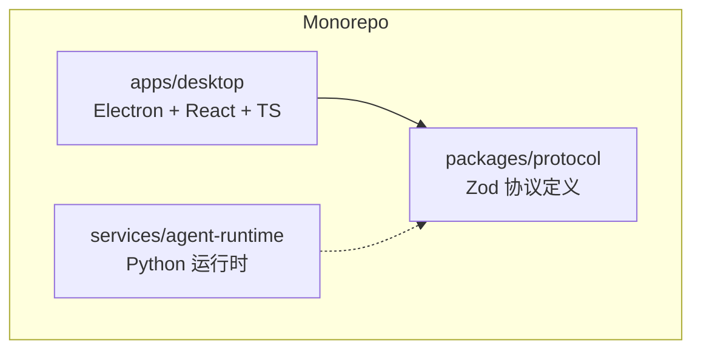
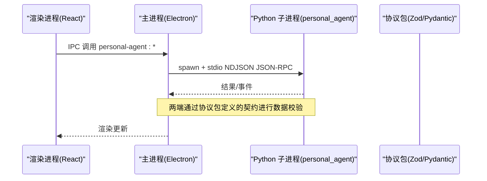
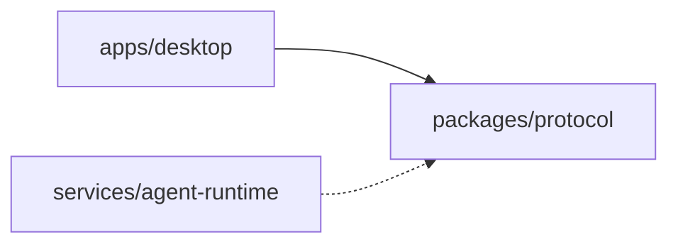

# 环境搭建

<cite>
**本文引用的文件**
- [package.json](file://package.json)
- [pnpm-workspace.yaml](file://pnpm-workspace.yaml)
- [apps/desktop/package.json](file://apps/desktop/package.json)
- [apps/desktop/.npmrc](file://apps/desktop/.npmrc)
- [services/agent-runtime/pyproject.toml](file://services/agent-runtime/pyproject.toml)
- [services/agent-runtime/.python-version](file://services/agent-runtime/.python-version)
- [services/agent-runtime/uv.lock](file://services/agent-runtime/uv.lock)
- [AGENTS.md](file://AGENTS.md)
</cite>

## 目录
1. [简介](#简介)
2. [项目结构](#项目结构)
3. [核心组件](#核心组件)
4. [架构总览](#架构总览)
5. [详细组件分析](#详细组件分析)
6. [依赖关系分析](#依赖关系分析)
7. [性能注意事项](#性能注意事项)
8. [故障排查指南](#故障排查指南)
9. [结论](#结论)
10. [附录](#附录)

## 简介
本指南面向首次参与 PersonalAgent 项目的开发者，目标是帮助你从零开始搭建可运行的开发环境。内容涵盖：
- 所需运行环境与工具版本（Node.js、Python、pnpm、uv）
- 前端与后端依赖的完整安装步骤
- Monorepo 目录结构与模块关系
- 常见环境问题与解决方案（权限、路径、版本冲突等）
- 安装成功的验证步骤

## 项目结构
本项目采用 pnpm workspace 管理的 monorepo，包含三个主要区域：
- apps/desktop：Electron + React + TypeScript 桌面端应用
- packages/protocol：跨语言协议定义（Zod schema），供 TS 与 Python 侧对齐
- services/agent-runtime：Python 实现的 Agent 运行时

图表来源
- [pnpm-workspace.yaml:1-13](file://pnpm-workspace.yaml#L1-L13)
- [AGENTS.md:76-97](file://AGENTS.md#L76-L97)

章节来源
- [pnpm-workspace.yaml:1-13](file://pnpm-workspace.yaml#L1-L13)
- [AGENTS.md:76-97](file://AGENTS.md#L76-L97)

## 核心组件
- Node.js 与 pnpm
  - 根 package.json 声明了 pnpm 版本要求，并配置 devEngines 在缺失时自动下载指定版本
  - pnpm workspace 将 apps/*、packages/*、services/* 纳入同一工作区
- Python 与 uv
  - Python 运行时要求 >= 3.13，.python-version 锁定为 3.13
  - 使用 uv 管理 Python 依赖与虚拟环境，pyproject.toml 定义了依赖与脚本入口
- 协议包
  - packages/protocol 仅依赖 zod，作为单一事实来源的契约包

章节来源
- [package.json:1-34](file://package.json#L1-L34)
- [pnpm-workspace.yaml:1-13](file://pnpm-workspace.yaml#L1-L13)
- [services/agent-runtime/pyproject.toml:1-22](file://services/agent-runtime/pyproject.toml#L1-L22)
- [services/agent-runtime/.python-version:1-2](file://services/agent-runtime/.python-version#L1-L2)
- [packages/protocol/package.json:1-16](file://packages/protocol/package.json#L1-L16)

## 架构总览
下图展示了桌面端与 Python 运行时之间的进程通信方式以及协议包的共享角色。

图表来源
- [AGENTS.md:195-208](file://AGENTS.md#L195-L208)
- [services/agent-runtime/pyproject.toml:10-11](file://services/agent-runtime/pyproject.toml#L10-L11)

## 详细组件分析

### 开发环境与工具链
- Node.js
  - 建议使用当前 LTS 或稳定版本；项目通过 devEngines 强制 pnpm 版本，Node 版本由 pnpm 生态兼容
- pnpm
  - 根 package.json 中 devEngines.packageManager 指定 pnpm ^11.17.0，并在缺失时自动下载
  - 工作区模式启用 hoisted 节点链接器，便于依赖复用
- Python
  - 最低版本要求 >= 3.13，.python-version 锁定为 3.13
  - 使用 uv 管理依赖与测试，pyproject.toml 声明依赖与脚本
- 其他工具
  - Electron、Vite、TypeScript、ESLint、Prettier、Vitest（前端）
  - pytest、ruff（Python）

章节来源
- [package.json:25-31](file://package.json#L25-L31)
- [pnpm-workspace.yaml:6-12](file://pnpm-workspace.yaml#L6-L12)
- [services/agent-runtime/pyproject.toml:1-22](file://services/agent-runtime/pyproject.toml#L1-L22)
- [services/agent-runtime/.python-version:1-2](file://services/agent-runtime/.python-version#L1-L2)
- [apps/desktop/package.json:23-60](file://apps/desktop/package.json#L23-L60)

### 依赖安装步骤

#### 前置条件
- 操作系统：Windows/macOS/Linux
- 已安装 Node.js（建议 LTS）
- 已安装 Python 3.13+（推荐通过 pyenv 或系统包管理器安装）
- 已安装 pnpm（若未安装，根 package.json 的 devEngines 会尝试自动下载）
- 已安装 uv（用于 Python 依赖管理）

#### 安装 Node 与 pnpm
- 安装 Node.js（LTS）
- 全局安装 pnpm（如尚未安装）
- 在项目根目录执行：
  - pnpm install
  - 说明：workspace 会同时安装 apps/desktop、packages/protocol 的依赖；services/* 不在此处安装 Python 依赖

章节来源
- [package.json:6-20](file://package.json#L6-L20)
- [pnpm-workspace.yaml:1-13](file://pnpm-workspace.yaml#L1-L13)
- [apps/desktop/package.json:8-21](file://apps/desktop/package.json#L8-L21)

#### 安装 Python 依赖（uv）
- 确保 Python 版本满足 >= 3.13（.python-version 指定 3.13）
- 进入 Python 服务目录：services/agent-runtime
- 使用 uv 安装依赖（推荐 --locked 以锁定 uv.lock）：
  - uv sync --locked
  - 说明：pyproject.toml 声明了 openai、pydantic 等依赖，dev 组包含 pytest、pytest-asyncio、ruff
- 可选：使用 uv run 直接运行脚本或测试：
  - uv run --project services/agent-runtime --locked ruff check .
  - uv run --project services/agent-runtime --locked pytest

章节来源
- [services/agent-runtime/pyproject.toml:1-22](file://services/agent-runtime/pyproject.toml#L1-L22)
- [services/agent-runtime/.python-version:1-2](file://services/agent-runtime/.python-version#L1-L2)
- [services/agent-runtime/uv.lock:1-203](file://services/agent-runtime/uv.lock#L1-L203)

#### 前端构建与启动
- 类型检查与构建：
  - pnpm --dir apps/desktop typecheck
  - pnpm --dir apps/desktop build
- 开发模式：
  - pnpm --dir apps/desktop dev
- 打包（按平台）：
  - pnpm --dir apps/desktop build:win|build:mac|build:linux

章节来源
- [apps/desktop/package.json:8-21](file://apps/desktop/package.json#L8-L21)

### 环境变量与路径约定
- 下载根目录通过环境变量控制：PERSONAL_AGENT_DOWNLOADS_DIR
- 该变量名在 TS 与 Python 侧保持一致，用于文件系统能力的安全边界与路径解析
- 模型选择（TASK-027）：PERSONAL_AGENT_SCRIPT 指向确定性剧本（CI 与 E2E 默认），OPENAI_MODEL 开启真实模型（DEP-012；API Key 由 openai SDK 自己从 OPENAI_API_KEY 读）。两个都配时真模型优先——配 OPENAI_MODEL 是显式动作，静默降级成演一遍剧本会让人以为真模型跑通了。
- 评测的单价（可选）：EVAL_PRICE_INPUT_PER_MTOK / EVAL_PRICE_OUTPUT_PER_MTOK 只影响 Live Eval 报告里的美元折算，没配就只记 token。

章节来源
- [AGENTS.md:195-208](file://AGENTS.md#L195-L208)
- [services/agent-runtime/src/personal_agent/runtime.py:208-235](file://services/agent-runtime/src/personal_agent/runtime.py#L208-L235)
- [services/agent-runtime/src/personal_agent/live_model.py:1-202](file://services/agent-runtime/src/personal_agent/live_model.py#L1-L202)

## 依赖关系分析
- 依赖方向约束
  - apps/desktop → packages/protocol（通过 @personal-agent/protocol 导入 Zod schema）
  - services/agent-runtime → packages/protocol（通过 Pydantic 镜像与 fixtures 对齐）
  - packages/protocol 不反向依赖 apps 或 services
- 节点链接器与工作区
  - nodeLinker: hoisted 提升依赖到根 node_modules，减少重复
  - allowBuilds 允许 electron、esbuild 等构建脚本

图表来源
- [AGENTS.md:76-97](file://AGENTS.md#L76-L97)
- [pnpm-workspace.yaml:1-13](file://pnpm-workspace.yaml#L1-L13)

章节来源
- [AGENTS.md:76-97](file://AGENTS.md#L76-L97)
- [pnpm-workspace.yaml:1-13](file://pnpm-workspace.yaml#L1-L13)

## 性能注意事项
- 使用 pnpm workspace 的 hoisted 模式可减少磁盘占用与安装时间
- Python 侧使用 uv 与 uv.lock 锁定依赖，保证构建可重现且更快
- 前端构建使用 Vite/Electron-vite，开发体验良好；生产构建前务必先执行类型检查与 lint

[本节为通用指导，无需特定文件引用]

## 故障排查指南

- pnpm 版本不匹配或无法自动下载
  - 现象：提示 devEngines 失败或版本不一致
  - 处理：手动安装指定版本的 pnpm（^11.17.0），或在 CI/CD 中显式安装
  - 参考：根 package.json 的 devEngines 配置

- Python 版本不符合要求
  - 现象：uv 或依赖安装时报 Python 版本错误
  - 处理：安装 Python 3.13+，或使用 .python-version 指定的 3.13
  - 参考：services/agent-runtime/.python-version 与 pyproject.toml 的 requires-python

- 权限问题（Windows 常见）
  - 现象：安装 native 依赖或写入 node_modules 失败
  - 处理：以管理员权限运行终端；确保路径无过长限制；必要时清理缓存后重试
  - 参考：apps/desktop/.npmrc 中的 hoist 配置可能影响安装行为

- 路径与环境变量问题
  - 现象：文件系统能力报错或找不到下载目录
  - 处理：设置 PERSONAL_AGENT_DOWNLOADS_DIR 指向有效路径；确保路径存在且可读可写
  - 参考：AGENTS.md 中对环境变量与路径安全的约定

- 依赖冲突或锁文件不一致
  - 现象：pip/uv 报依赖冲突或版本不匹配
  - 处理：删除 .venv 与 uv.lock 后重新 uv sync --locked；确保 Python 版本一致
  - 参考：services/agent-runtime/uv.lock

- 前端构建失败
  - 现象：TypeScript 类型错误或构建中断
  - 处理：先执行 pnpm --dir apps/desktop typecheck 定位问题；清理缓存后重试
  - 参考：apps/desktop/package.json 中的脚本

章节来源
- [package.json:25-31](file://package.json#L25-L31)
- [services/agent-runtime/.python-version:1-2](file://services/agent-runtime/.python-version#L1-L2)
- [services/agent-runtime/pyproject.toml:1-22](file://services/agent-runtime/pyproject.toml#L1-L22)
- [services/agent-runtime/uv.lock:1-203](file://services/agent-runtime/uv.lock#L1-L203)
- [apps/desktop/.npmrc:1-2](file://apps/desktop/.npmrc#L1-L2)
- [AGENTS.md:195-208](file://AGENTS.md#L195-L208)

## 结论
按照本指南完成 Node.js、pnpm、Python、uv 的安装与配置后，即可在本地运行 PersonalAgent 的桌面端与 Python 运行时。通过 pnpm workspace 统一管理前端依赖，通过 uv 锁定 Python 依赖，配合 AGENTS.md 中的约定与验证命令，可确保代码质量与一致性。建议在提交前始终运行全量验证流程。

[本节为总结性内容，无需特定文件引用]

## 附录

### 快速安装清单
- 安装 Node.js（LTS）
- 安装 pnpm（或让 devEngines 自动下载）
- 安装 Python 3.13+（推荐 3.13）
- 安装 uv
- 在项目根目录执行：
  - pnpm install
  - cd services/agent-runtime && uv sync --locked
- 启动前端开发：
  - pnpm --dir apps/desktop dev
- 运行 Python 测试：
  - uv run --project services/agent-runtime --locked pytest

### 验证安装是否成功
- 前端类型检查与测试：
  - pnpm --dir apps/desktop typecheck
  - pnpm --dir apps/desktop test
- Python 测试：
  - uv run --project services/agent-runtime --locked pytest
- 全量验证（推荐）：
  - pnpm verify
  - 说明：verify 会依次执行类型检查、TS/Python lint、Protocol 包测试、Desktop 测试、Python 测试

章节来源
- [package.json:6-20](file://package.json#L6-L20)
- [AGENTS.md:122-145](file://AGENTS.md#L122-L145)
- [apps/desktop/package.json:8-21](file://apps/desktop/package.json#L8-L21)
- [services/agent-runtime/pyproject.toml:17-22](file://services/agent-runtime/pyproject.toml#L17-L22)