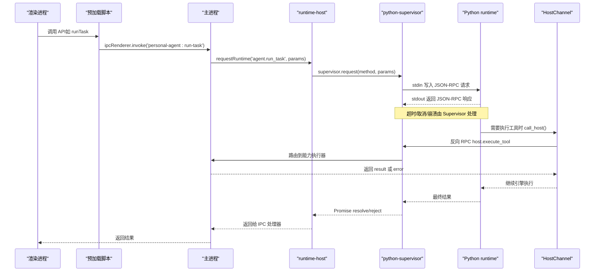
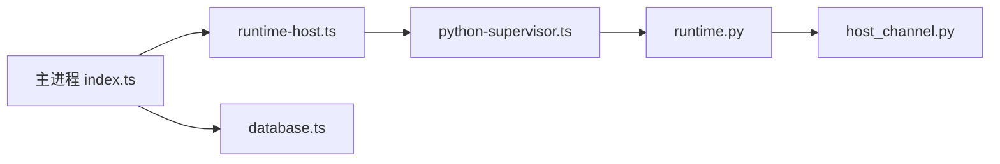
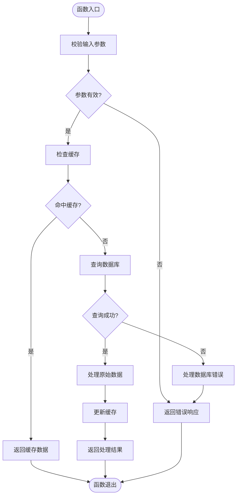

# 调试指南

<cite>
**本文引用的文件**
- [apps/desktop/src/main/index.ts](file://apps/desktop/src/main/index.ts)
- [apps/desktop/electron.vite.config.ts](file://apps/desktop/electron.vite.config.ts)
- [apps/desktop/package.json](file://apps/desktop/package.json)
- [apps/desktop/src/preload/index.ts](file://apps/desktop/src/preload/index.ts)
- [apps/desktop/src/main/runtime/python-supervisor.ts](file://apps/desktop/src/main/runtime/python-supervisor.ts)
- [apps/desktop/src/main/runtime/runtime-host.ts](file://apps/desktop/src/main/runtime/runtime-host.ts)
- [apps/desktop/src/main/runtime/error-code.ts](file://apps/desktop/src/main/runtime/error-code.ts)
- [apps/desktop/src/main/db/database.ts](file://apps/desktop/src/main/db/database.ts)
- [services/agent-runtime/pyproject.toml](file://services/agent-runtime/pyproject.toml)
- [services/agent-runtime/src/personal_agent/__main__.py](file://services/agent-runtime/src/personal_agent/__main__.py)
- [services/agent-runtime/src/personal_agent/runtime.py](file://services/agent-runtime/src/personal_agent/runtime.py)
- [services/agent-runtime/src/personal_agent/host_channel.py](file://services/agent-runtime/src/personal_agent/host_channel.py)
</cite>

## 目录
1. [简介](#简介)
2. [项目结构](#项目结构)
3. [核心组件](#核心组件)
4. [架构总览](#架构总览)
5. [详细组件分析](#详细组件分析)
6. [依赖关系分析](#依赖关系分析)
7. [性能考虑](#性能考虑)
8. [故障排除指南](#故障排除指南)
9. [结论](#结论)
10. [附录](#附录)

## 简介
本指南面向使用 Electron + Python 运行时的 PersonalAgent 桌面应用，提供从主进程、渲染进程到 Python 子进程的完整调试方法。内容涵盖：
- Electron 主进程与渲染进程的调试技巧（DevTools、断点、日志）
- IPC 通信与 JSON-RPC 协议消息的调试
- Python 运行时调试配置（断点、日志级别、性能分析）
- 数据库操作与权限流程的排查
- 常见问题定位与性能监控建议

## 项目结构
本项目采用多包工作区：
- apps/desktop：Electron 桌面端（主进程、预加载脚本、渲染进程）
- services/agent-runtime：Python 运行时（通过标准输入输出与主进程进行 JSON-RPC 通信）
- packages/protocol：共享协议定义（TS/Py 共用）

关键入口与调试相关位置：
- 主进程入口：apps/desktop/src/main/index.ts
- 预加载桥接：apps/desktop/src/preload/index.ts
- Python 运行时启动与生命周期：apps/desktop/src/main/runtime/runtime-host.ts
- Python 子进程管理与 JSON-RPC 收发：apps/desktop/src/main/runtime/python-supervisor.ts
- Python 侧运行时与日志：services/agent-runtime/src/personal_agent/runtime.py
- Python 侧 HostChannel（反向 RPC 通道）：services/agent-runtime/src/personal_agent/host_channel.py
- SQLite 数据库管理：apps/desktop/src/main/db/database.ts

```mermaid
graph TB
subgraph "Electron 主进程"
M["index.ts"]
RH["runtime-host.ts"]
PS["python-supervisor.ts"]
DB["database.ts"]
end
subgraph "渲染进程"
R["renderer (React)"]
PL["preload/index.ts"]
end
subgraph "Python 运行时"
PYR["runtime.py"]
HC["host_channel.py"]
end
R --> PL
PL --> M
M --> RH
RH --> PS
PS < --> |stdin/stdout JSON-RPC| PYR
PYR --> HC
M --> DB
```

图表来源
- [apps/desktop/src/main/index.ts:51-85](file://apps/desktop/src/main/index.ts#L51-L85)
- [apps/desktop/src/main/runtime/runtime-host.ts:15-63](file://apps/desktop/src/main/runtime/runtime-host.ts#L15-L63)
- [apps/desktop/src/main/runtime/python-supervisor.ts:96-120](file://apps/desktop/src/main/runtime/python-supervisor.ts#L96-L120)
- [services/agent-runtime/src/personal_agent/runtime.py:185-244](file://services/agent-runtime/src/personal_agent/runtime.py#L185-L244)
- [services/agent-runtime/src/personal_agent/host_channel.py:45-85](file://services/agent-runtime/src/personal_agent/host_channel.py#L45-L85)

章节来源
- [apps/desktop/src/main/index.ts:51-85](file://apps/desktop/src/main/index.ts#L51-L85)
- [apps/desktop/electron.vite.config.ts:6-23](file://apps/desktop/electron.vite.config.ts#L6-L23)
- [apps/desktop/package.json:8-21](file://apps/desktop/package.json#L8-L21)

## 核心组件
- 主进程窗口与 IPC：负责创建窗口、注册 IPC 处理器、启动/停止 Python 运行时、读写本地数据库。
- Python 运行时宿主：封装子进程生命周期、JSON-RPC 握手、请求/响应匹配、超时与崩溃处理。
- Python 运行时：基于标准输入输出的 JSON-RPC 服务，支持 system.initialize、system.ping、agent.make_plan、agent.run_task 等方法。
- HostChannel：Python 侧发起 host.execute_tool 反向调用，等待 TS 侧返回结果或错误。
- 数据库层：SQLite 持久化 PDF 索引、任务、计划、事件等。

章节来源
- [apps/desktop/src/main/index.ts:126-269](file://apps/desktop/src/main/index.ts#L126-L269)
- [apps/desktop/src/main/runtime/python-supervisor.ts:122-194](file://apps/desktop/src/main/runtime/python-supervisor.ts#L122-L194)
- [services/agent-runtime/src/personal_agent/runtime.py:67-182](file://services/agent-runtime/src/personal_agent/runtime.py#L67-L182)
- [services/agent-runtime/src/personal_agent/host_channel.py:36-85](file://services/agent-runtime/src/personal_agent/host_channel.py#L36-L85)
- [apps/desktop/src/main/db/database.ts:27-50](file://apps/desktop/src/main/db/database.ts#L27-L50)

## 架构总览
下图展示了从渲染进程到 Python 运行时的完整调用链，包括 IPC、JSON-RPC 和反向 RPC。



图表来源
- [apps/desktop/src/preload/index.ts:23-27](file://apps/desktop/src/preload/index.ts#L23-L27)
- [apps/desktop/src/main/index.ts:200-223](file://apps/desktop/src/main/index.ts#L200-L223)
- [apps/desktop/src/main/runtime/runtime-host.ts:77-87](file://apps/desktop/src/main/runtime/runtime-host.ts#L77-L87)
- [apps/desktop/src/main/runtime/python-supervisor.ts:150-194](file://apps/desktop/src/main/runtime/python-supervisor.ts#L150-L194)
- [services/agent-runtime/src/personal_agent/runtime.py:156-182](file://services/agent-runtime/src/personal_agent/runtime.py#L156-L182)
- [services/agent-runtime/src/personal_agent/host_channel.py:45-85](file://services/agent-runtime/src/personal_agent/host_channel.py#L45-L85)

## 详细组件分析

### 主进程调试要点
- 启用 DevTools：开发模式下自动监听快捷键；生产模式可通过代码注入打开。
- 窗口安全选项：contextIsolation、sandbox、nodeIntegration=false，确保仅通过 preload 暴露 API。
- IPC 处理器：所有业务入口集中在 index.ts，便于集中打点和断点。
- 数据库：better-sqlite3 使用 WAL 模式，注意 journal_mode 生效情况。

调试建议
- 在 IPC 处理器入口处设置断点，观察入参与返回值。
- 关注 stderr 输出，特别是数据库初始化失败、权限通道不可用等场景。
- 使用环境变量控制行为（例如脚本路径、日志级别）。

章节来源
- [apps/desktop/src/main/index.ts:51-85](file://apps/desktop/src/main/index.ts#L51-L85)
- [apps/desktop/src/main/index.ts:126-269](file://apps/desktop/src/main/index.ts#L126-L269)
- [apps/desktop/src/main/db/database.ts:27-50](file://apps/desktop/src/main/db/database.ts#L27-L50)

### 预加载与渲染进程调试
- 预加载脚本通过 contextBridge 暴露受限 API，避免直接访问 Node/Electron。
- 渲染进程通过 invoke/on 与主进程通信，唯一推送通道为 permission notice。

调试建议
- 在浏览器 DevTools 中查看网络面板（如有外部请求）、控制台日志。
- 对 onPermissionNotice 回调设置断点，确认权限通知是否正确推送。
- 检查 preload 暴露的方法是否被正确调用。

章节来源
- [apps/desktop/src/preload/index.ts:1-51](file://apps/desktop/src/preload/index.ts#L1-L51)

### Python 运行时调试配置
- 启动方式：主进程通过 child_process.spawn 启动 .venv/python.exe -m personal_agent。
- 日志级别：通过 PERSONAL_AGENT_LOG_LEVEL 环境变量控制 Python 日志级别。
- 脚本模型：通过 PERSONAL_AGENT_SCRIPT 指定脚本路径，用于无真实模型时的测试。

调试建议
- 在 VS Code 中配置 Python 调试器，附加到已启动的子进程或使用 launch 配置。
- 在 runtime.py 的 handle_line、dispatch、handle_run_task 等处设置断点。
- 将 stderr 重定向到文件或终端，结合日志级别过滤噪音。

章节来源
- [apps/desktop/src/main/runtime/runtime-host.ts:15-20](file://apps/desktop/src/main/runtime/runtime-host.ts#L15-L20)
- [services/agent-runtime/src/personal_agent/runtime.py:191-203](file://services/agent-runtime/src/personal_agent/runtime.py#L191-L203)
- [services/agent-runtime/src/personal_agent/runtime.py:206-223](file://services/agent-runtime/src/personal_agent/runtime.py#L206-L223)
- [services/agent-runtime/pyproject.toml:10-11](file://services/agent-runtime/pyproject.toml#L10-L11)

### JSON-RPC 协议与 IPC 通信调试
- 主进程与 Python 之间通过标准输入输出逐行传输 JSON-RPC 消息。
- Supervisor 维护 pending 请求映射，支持超时、取消、崩溃处理。
- Python 侧通过 HostChannel 发起 host.execute_tool 反向调用，TS 侧能力执行器返回结果或错误。

调试建议
- 在 python-supervisor.ts 的 routeLine、writeLine 处打断点，观察 JSON 报文。
- 在 runtime.py 的 dispatch、handle_line 处打断点，验证请求/响应是否符合契约。
- 使用日志级别与 stderr 输出，追踪异常路径。

章节来源
- [apps/desktop/src/main/runtime/python-supervisor.ts:210-316](file://apps/desktop/src/main/runtime/python-supervisor.ts#L210-L316)
- [services/agent-runtime/src/personal_agent/runtime.py:67-104](file://services/agent-runtime/src/personal_agent/runtime.py#L67-L104)
- [services/agent-runtime/src/personal_agent/host_channel.py:45-85](file://services/agent-runtime/src/personal_agent/host_channel.py#L45-L85)

### 数据库操作调试
- SQLite 使用 WAL 模式提升并发性能，初始化时校验 journal_mode。
- 数据表包含 PDF 元信息，支持 upsert 与查询。

调试建议
- 在 openDatabase 处设置断点，确认路径与 PRAGMA 生效。
- 在 IPC 处理器中针对 list-pdfs、indexed-pdfs 等接口设置断点，检查 SQL 执行结果。
- 若出现锁竞争或写入失败，检查 WAL 模式与事务边界。

章节来源
- [apps/desktop/src/main/db/database.ts:27-50](file://apps/desktop/src/main/db/database.ts#L27-L50)
- [apps/desktop/src/main/index.ts:167-177](file://apps/desktop/src/main/index.ts#L167-L177)

### 权限流程调试
- 权限 Broker 与 IPC 通道负责授权决策与通知。
- 渲染进程通过 onPermissionNotice 订阅主进程推送的权限通知。

调试建议
- 在 respondToPermission、listTaskPermissions 处设置断点。
- 在 preload 的 onPermissionNotice 回调中设置断点，确认通知到达。
- 检查 broker 构造与 dispose 时机，避免资源泄漏。

章节来源
- [apps/desktop/src/main/index.ts:244-269](file://apps/desktop/src/main/index.ts#L244-L269)
- [apps/desktop/src/preload/index.ts:35-45](file://apps/desktop/src/preload/index.ts#L35-L45)

## 依赖关系分析
- 主进程依赖 runtime-host 管理 Python 子进程，依赖 database 管理本地存储。
- Python 运行时依赖 HostChannel 与主进程进行双向通信。
- 协议层通过 packages/protocol 统一约束双方数据结构。



图表来源
- [apps/desktop/src/main/index.ts:126-269](file://apps/desktop/src/main/index.ts#L126-L269)
- [apps/desktop/src/main/runtime/runtime-host.ts:15-63](file://apps/desktop/src/main/runtime/runtime-host.ts#L15-L63)
- [apps/desktop/src/main/runtime/python-supervisor.ts:96-120](file://apps/desktop/src/main/runtime/python-supervisor.ts#L96-L120)
- [services/agent-runtime/src/personal_agent/runtime.py:185-244](file://services/agent-runtime/src/personal_agent/runtime.py#L185-L244)
- [services/agent-runtime/src/personal_agent/host_channel.py:45-85](file://services/agent-runtime/src/personal_agent/host_channel.py#L45-L85)
- [apps/desktop/src/main/db/database.ts:27-50](file://apps/desktop/src/main/db/database.ts#L27-L50)

章节来源
- [apps/desktop/src/main/runtime/error-code.ts:1-17](file://apps/desktop/src/main/runtime/error-code.ts#L1-L17)

## 性能考虑
- 数据库 WAL 模式：减少写阻塞，提高并发读取性能。
- 子进程超时与取消：防止长时间阻塞导致界面卡顿。
- 日志级别控制：降低 INFO/DEBUG 日志开销，仅在调试时开启。
- 能力清单过滤：减少不必要的能力下发，降低 Python 侧计算压力。

[本节为通用性能建议，不直接分析具体文件]

## 故障排除指南

### 常见错误码与定位
- RUNTIME_NOT_STARTED：Python 未启动或启动失败，检查 venv 路径与命令。
- RUNTIME_TIMEOUT：请求超时，检查 Python 侧执行耗时与超时配置。
- RUNTIME_CRASHED：子进程崩溃，查看 stderr 与崩溃原因。
- PROTOCOL_INVALID_REQUEST：参数不符合契约，核对 Zod/Pydantic 校验。
- HOST_HANDLER_FAILED：能力执行器抛出异常，检查权限与路径。

章节来源
- [apps/desktop/src/main/runtime/error-code.ts:1-17](file://apps/desktop/src/main/runtime/error-code.ts#L1-L17)
- [apps/desktop/src/main/runtime/python-supervisor.ts:150-194](file://apps/desktop/src/main/runtime/python-supervisor.ts#L150-L194)
- [services/agent-runtime/src/personal_agent/runtime.py:67-104](file://services/agent-runtime/src/personal_agent/runtime.py#L67-L104)

### 调试步骤建议
- 主进程：在 IPC 处理器入口设置断点，打印入参与返回值。
- Python 侧：在 runtime.py 的 handle_line、dispatch 设置断点，观察 JSON 解析与分发。
- 反向 RPC：在 host_channel.py 的 call_host 设置断点，确认请求与响应。
- 数据库：在 openDatabase 与 IPC 处理器中检查 SQL 执行结果。

章节来源
- [apps/desktop/src/main/index.ts:126-269](file://apps/desktop/src/main/index.ts#L126-L269)
- [services/agent-runtime/src/personal_agent/runtime.py:94-104](file://services/agent-runtime/src/personal_agent/runtime.py#L94-L104)
- [services/agent-runtime/src/personal_agent/host_channel.py:45-85](file://services/agent-runtime/src/personal_agent/host_channel.py#L45-L85)
- [apps/desktop/src/main/db/database.ts:27-50](file://apps/desktop/src/main/db/database.ts#L27-L50)

### 日志级别与环境变量
- Python 日志级别：PERSONAL_AGENT_LOG_LEVEL（默认 INFO），可设为 DEBUG 获取更详细日志。
- 脚本路径：PERSONAL_AGENT_SCRIPT，用于无模型环境下的测试。
- 主进程 stderr：开发模式下会转发 Python stderr 到终端，便于实时观察。

章节来源
- [services/agent-runtime/src/personal_agent/runtime.py:191-203](file://services/agent-runtime/src/personal_agent/runtime.py#L191-L203)
- [services/agent-runtime/src/personal_agent/runtime.py:206-223](file://services/agent-runtime/src/personal_agent/runtime.py#L206-L223)
- [apps/desktop/src/main/runtime/runtime-host.ts:47-50](file://apps/desktop/src/main/runtime/runtime-host.ts#L47-L50)

## 结论
本指南提供了从 Electron 主进程、渲染进程到 Python 运行时的完整调试方案。通过合理设置断点、日志级别与超时策略，可以快速定位 IPC、JSON-RPC、数据库与权限流程中的问题。建议在开发阶段充分利用 DevTools 与 Python 调试器，在生产环境严格控制日志级别与错误码，确保稳定性与可观测性。

## 附录

### 快速启动与调试命令
- 启动开发服务器：npm run dev（electron-vite dev）
- 预览构建产物：npm run start（electron-vite preview）
- 类型检查：npm run typecheck
- 单元测试：npm run test（vitest run）

章节来源
- [apps/desktop/package.json:8-21](file://apps/desktop/package.json#L8-L21)

### 调试流程图（复杂逻辑）


[此图为概念性流程图，不直接映射到具体源码文件]