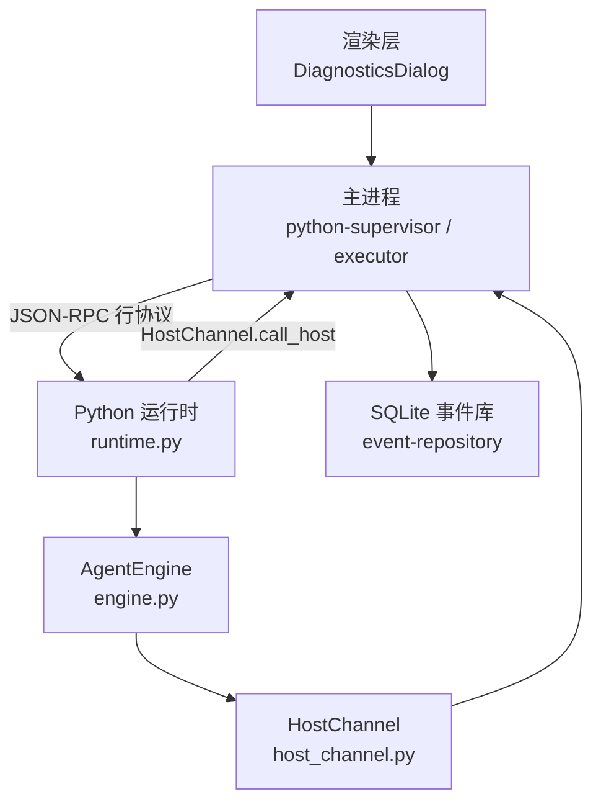
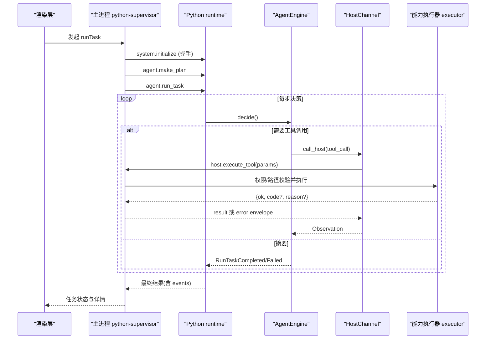
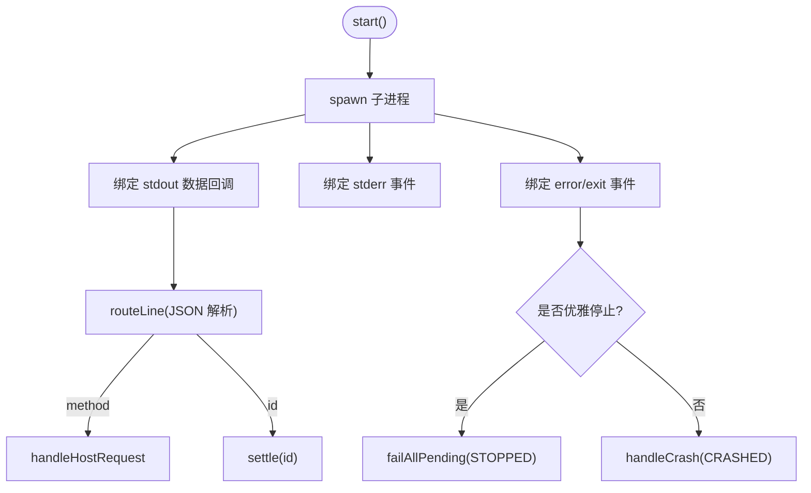
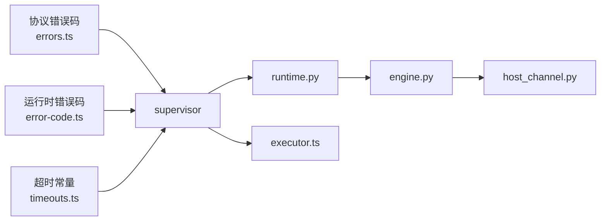

# 故障排除

<cite>
**本文引用的文件**
- [apps/desktop/src/main/runtime/python-supervisor.ts](file://apps/desktop/src/main/runtime/python-supervisor.ts)
- [apps/desktop/src/main/runtime/error-code.ts](file://apps/desktop/src/main/runtime/error-code.ts)
- [apps/desktop/src/main/runtime/timeouts.ts](file://apps/desktop/src/main/runtime/timeouts.ts)
- [packages/protocol/schemas/errors.ts](file://packages/protocol/schemas/errors.ts)
- [services/agent-runtime/src/personal_agent/runtime.py](file://services/agent-runtime/src/personal_agent/runtime.py)
- [services/agent-runtime/src/personal_agent/host_channel.py](file://services/agent-runtime/src/personal_agent/host_channel.py)
- [services/agent-runtime/src/personal_agent/engine.py](file://services/agent-runtime/src/personal_agent/engine.py)
- [apps/desktop/src/main/capabilities/executor.ts](file://apps/desktop/src/main/capabilities/executor.ts)
- [apps/desktop/src/main/product-state/event-repository.ts](file://apps/desktop/src/main/product-state/event-repository.ts)
- [apps/desktop/src/renderer/src/components/DiagnosticsDialog.tsx](file://apps/desktop/src/renderer/src/components/DiagnosticsDialog.tsx)
- [apps/desktop/.gitignore](file://apps/desktop/.gitignore)
</cite>

## 目录
1. [简介](#简介)
2. [项目结构](#项目结构)
3. [核心组件](#核心组件)
4. [架构总览](#架构总览)
5. [详细组件分析](#详细组件分析)
6. [依赖关系分析](#依赖关系分析)
7. [性能注意事项](#性能注意事项)
8. [故障排查指南](#故障排查指南)
9. [结论](#结论)
10. [附录](#附录)

## 简介
本故障排除文档面向个人代理（Personal Agent）桌面端与 Python 运行时之间的跨进程通信、权限控制、文件操作、超时与崩溃等常见问题的定位与修复。文档基于代码实现，给出错误分类、日志分析方法、性能诊断策略、内存与资源管理建议、具体案例步骤、调试工具与监控指标使用方式，以及问题上报与反馈机制。

## 项目结构
本项目由 Electron 主进程（TypeScript）与 Python 运行时组成，通过 JSON-RPC 行协议在 stdout/stdin 上通信。关键路径：
- 主进程侧：PythonSupervisor 负责子进程生命周期、请求/响应路由、超时与崩溃处理；能力执行器 executor 负责权限与路径校验后调用具体能力；事件仓库持久化任务时间线。
- Python 侧：runtime 解析请求并调度 engine；engine 维护预算与循环；host_channel 封装对主进程的 host.execute_tool 调用；context 管理观察上下文。

图表来源
- [apps/desktop/src/main/runtime/python-supervisor.ts:96-126](file://apps/desktop/src/main/runtime/python-supervisor.ts#L96-L126)
- [services/agent-runtime/src/personal_agent/runtime.py:187-257](file://services/agent-runtime/src/personal_agent/runtime.py#L187-L257)
- [services/agent-runtime/src/personal_agent/host_channel.py:36-91](file://services/agent-runtime/src/personal_agent/host_channel.py#L36-L91)
- [apps/desktop/src/main/product-state/event-repository.ts:41-66](file://apps/desktop/src/main/product-state/event-repository.ts#L41-L66)

章节来源
- [apps/desktop/src/main/runtime/python-supervisor.ts:96-126](file://apps/desktop/src/main/runtime/python-supervisor.ts#L96-L126)
- [services/agent-runtime/src/personal_agent/runtime.py:187-257](file://services/agent-runtime/src/personal_agent/runtime.py#L187-L257)
- [apps/desktop/src/main/product-state/event-repository.ts:41-66](file://apps/desktop/src/main/product-state/event-repository.ts#L41-L66)

## 核心组件
- PythonSupervisor：子进程启动、握手 initialize、请求发送与超时、stderr 输出、崩溃处理、未决请求清理。
- runtime.py：JSON 解析、方法分发、initialize/make_plan/run_task 处理、日志配置、EOF 退出。
- engine.py：单任务运行循环、预算控制、事件生成、失败统一返回。
- host_channel.py：向主进程发起 host.execute_tool，处理 EOF、非法 JSON、协议校验与错误透传。
- executor.ts：权限与路径策略校验后执行文件系统或 PDF 提取能力，捕获 IO 异常并映射为错误码。
- event-repository.ts：任务事件追加与查询，用于回放与排障。

章节来源
- [apps/desktop/src/main/runtime/python-supervisor.ts:96-356](file://apps/desktop/src/main/runtime/python-supervisor.ts#L96-L356)
- [services/agent-runtime/src/personal_agent/runtime.py:69-184](file://services/agent-runtime/src/personal_agent/runtime.py#L69-L184)
- [services/agent-runtime/src/personal_agent/engine.py:91-244](file://services/agent-runtime/src/personal_agent/engine.py#L91-L244)
- [services/agent-runtime/src/personal_agent/host_channel.py:36-91](file://services/agent-runtime/src/personal_agent/host_channel.py#L36-L91)
- [apps/desktop/src/main/capabilities/executor.ts:73-325](file://apps/desktop/src/main/capabilities/executor.ts#L73-L325)
- [apps/desktop/src/main/product-state/event-repository.ts:14-66](file://apps/desktop/src/main/product-state/event-repository.ts#L14-L66)

## 架构总览
下图展示一次“运行任务”的端到端流程，包括 TS 侧 supervisor 与 Python 侧 engine 的交互、超时与错误传播。

图表来源
- [apps/desktop/src/main/runtime/python-supervisor.ts:128-200](file://apps/desktop/src/main/runtime/python-supervisor.ts#L128-L200)
- [services/agent-runtime/src/personal_agent/runtime.py:128-184](file://services/agent-runtime/src/personal_agent/runtime.py#L128-L184)
- [services/agent-runtime/src/personal_agent/engine.py:104-244](file://services/agent-runtime/src/personal_agent/engine.py#L104-L244)
- [services/agent-runtime/src/personal_agent/host_channel.py:45-85](file://services/agent-runtime/src/personal_agent/host_channel.py#L45-L85)
- [apps/desktop/src/main/capabilities/executor.ts:73-325](file://apps/desktop/src/main/capabilities/executor.ts#L73-L325)

## 详细组件分析

### 运行时与子进程管理（python-supervisor）
- 启动与管道：stdout 按行解析，stderr 透传到事件；error/exit 事件触发崩溃处理。
- 请求与超时：request 支持 AbortSignal 取消；默认超时来自 HOST_TOOL_TIMEOUT_MS；未决请求在 settle 时清理定时器与监听。
- 握手：initialize 参数与结果均做 schema 校验，失败返回 RUNTIME_HANDSHAKE_FAILED。
- 崩溃处理：记录 crashInfo，拒绝所有 pending 请求为 CRASHED，并派发 runtime.crashed 事件。
- 写入保护：stdin 不可用或写入失败会记录 stderr 并丢弃消息，避免静默丢失。

图表来源
- [apps/desktop/src/main/runtime/python-supervisor.ts:96-126](file://apps/desktop/src/main/runtime/python-supervisor.ts#L96-L126)
- [apps/desktop/src/main/runtime/python-supervisor.ts:225-356](file://apps/desktop/src/main/runtime/python-supervisor.ts#L225-L356)

章节来源
- [apps/desktop/src/main/runtime/python-supervisor.ts:96-356](file://apps/desktop/src/main/runtime/python-supervisor.ts#L96-L356)

### Python 运行时（runtime.py）
- 日志：stderr 输出结构化日志，级别由环境变量控制。
- 分发：handle_line 解析 JSON，dispatch 根据 method 路由到 initialize/make_plan/run_task。
- 错误：参数不合法返回 PROTOCOL_INVALID_REQUEST；未知方法返回 METHOD_NOT_FOUND；内部异常记录堆栈并返回 RUNTIME_INTERNAL。
- 退出：EOF 时安全退出，避免忙等。

章节来源
- [services/agent-runtime/src/personal_agent/runtime.py:69-184](file://services/agent-runtime/src/personal_agent/runtime.py#L69-L184)
- [services/agent-runtime/src/personal_agent/runtime.py:187-257](file://services/agent-runtime/src/personal_agent/runtime.py#L187-L257)

### 引擎与预算（engine.py）
- 预算：maxSteps 与 maxToolCalls 超限即终止，返回 budget_exhausted 事件与失败原因。
- 事件：task_started/tool_called/tool_result/task_completed/task_failed 统一构造，包含 occurredAt。
- 执行：capability 不在协议枚举内直接标记 CAPABILITY_NOT_REGISTERED；其他错误通过 HostChannel 抛出并转为失败。

章节来源
- [services/agent-runtime/src/personal_agent/engine.py:91-244](file://services/agent-runtime/src/personal_agent/engine.py#L91-L244)

### 主机通道（host_channel.py）
- 调用 host.execute_tool 并阻塞等待匹配 id 的响应。
- 非匹配请求暂存 inbox，避免丢失主进程主动请求。
- EOF 抛 HostChannelClosed；非法 JSON 警告并跳过；响应无 result/error 视为无效。

章节来源
- [services/agent-runtime/src/personal_agent/host_channel.py:36-91](file://services/agent-runtime/src/personal_agent/host_channel.py#L36-L91)

### 能力执行器（executor.ts）
- 策略：先 evaluate 权限与路径，拒绝则返回对应错误码（如 PATH_OUT_OF_ROOT、PATH_UNC_NOT_ALLOWED）。
- 执行：listPdfs 失败映射 FILESYSTEM_ROOT_UNAVAILABLE；读取 PDF 失败映射 FILE_UNREADABLE；解析失败映射 PDF_EXTRACTION_FAILED。
- 兜底：未注册能力走 NOT_IMPLEMENTED。

章节来源
- [apps/desktop/src/main/capabilities/executor.ts:73-325](file://apps/desktop/src/main/capabilities/executor.ts#L73-L325)

### 事件存储（event-repository.ts）
- append 将事件序列化写入 SQLite；listByTask 按 seq 顺序读取。
- payload 非合法 JSON 时抛出明确错误，便于定位数据损坏。

章节来源
- [apps/desktop/src/main/product-state/event-repository.ts:14-66](file://apps/desktop/src/main/product-state/event-repository.ts#L14-L66)

## 依赖关系分析
- 错误码分层：
  - 协议层错误码集中在 packages/protocol/schemas/errors.ts，涵盖协议、能力、路径、权限、文件等。
  - 运行时错误码集中在 apps/desktop/src/main/runtime/error-code.ts，描述子进程生命周期与运行时异常。
- 超时链：
  - HOST_TOOL_TIMEOUT_MS = PERMISSION_TTL_MS + 余量；RUN_TASK_TIMEOUT_MS = 最大工具调用次数 × HOST_TOOL_TIMEOUT_MS + 模型余量。
- 组件耦合：
  - supervisor 依赖 timeouts 与 error-code；runtime.py 依赖 engine、host_channel；engine 依赖 context 与 model_gateway；executor 依赖 policy 与能力实现。

图表来源
- [packages/protocol/schemas/errors.ts:1-23](file://packages/protocol/schemas/errors.ts#L1-L23)
- [apps/desktop/src/main/runtime/error-code.ts:1-17](file://apps/desktop/src/main/runtime/error-code.ts#L1-L17)
- [apps/desktop/src/main/runtime/timeouts.ts:1-16](file://apps/desktop/src/main/runtime/timeouts.ts#L1-L16)
- [apps/desktop/src/main/runtime/python-supervisor.ts:128-200](file://apps/desktop/src/main/runtime/python-supervisor.ts#L128-L200)
- [services/agent-runtime/src/personal_agent/runtime.py:69-184](file://services/agent-runtime/src/personal_agent/runtime.py#L69-L184)
- [services/agent-runtime/src/personal_agent/engine.py:91-244](file://services/agent-runtime/src/personal_agent/engine.py#L91-L244)
- [services/agent-runtime/src/personal_agent/host_channel.py:36-91](file://services/agent-runtime/src/personal_agent/host_channel.py#L36-L91)
- [apps/desktop/src/main/capabilities/executor.ts:73-325](file://apps/desktop/src/main/capabilities/executor.ts#L73-L325)

章节来源
- [packages/protocol/schemas/errors.ts:1-23](file://packages/protocol/schemas/errors.ts#L1-L23)
- [apps/desktop/src/main/runtime/error-code.ts:1-17](file://apps/desktop/src/main/runtime/error-code.ts#L1-L17)
- [apps/desktop/src/main/runtime/timeouts.ts:1-16](file://apps/desktop/src/main/runtime/timeouts.ts#L1-L16)

## 性能注意事项
- 超时设计：
  - 批准窗口余量 5 秒，确保用户有足够时间审批；run_task 超时由最大工具调用次数与模型余量推导，避免 TS 提前中断导致 Python 仍在写响应。
- 预算限制：
  - 引擎默认最多 8 步、5 次工具调用，防止无限循环；超出立即失败并记录预算耗尽事件。
- I/O 与解析：
  - 主进程按行解析 stdout，避免大块缓冲导致的延迟；Python 侧每次 write 后 flush，保证实时性。
- 数据库：
  - 事件写入采用预编译 SQL，减少重复解析开销；读取按任务过滤并按 seq 排序，适合回放。

[本节为通用性能指导，无需特定文件引用]

## 故障排查指南

### 常见错误类型与定位
- 连接与子进程错误
  - 症状：请求被拒、子进程意外退出、stderr 出现崩溃信息。
  - 关键线索：
    - supervisor 的 stderr 事件包含子进程错误与退出码。
    - 未决请求被批量拒绝为 CRASHED。
  - 定位步骤：
    1) 查看渲染层“运行诊断”对话框中的运行时状态与 stderr 输出。
    2) 检查 initialize 握手是否成功，若失败关注 HANDSHAKE_FAILED。
    3) 确认 spawn 命令与环境变量是否正确。
  - 参考实现
    - [apps/desktop/src/main/runtime/python-supervisor.ts:96-126](file://apps/desktop/src/main/runtime/python-supervisor.ts#L96-L126)
    - [apps/desktop/src/main/runtime/python-supervisor.ts:332-345](file://apps/desktop/src/main/runtime/python-supervisor.ts#L332-L345)

- 权限错误
  - 症状：能力被拒绝，提示 PERMISSION_DENIED/EXPIRED/TAMPERED。
  - 关键线索：
    - 权限验证阶段返回的错误码与原因。
    - 参数指纹变化或 toolCallId 不一致会导致 TAMPERED。
  - 定位步骤：
    1) 打开“运行诊断”对话框，查看当前会话的权限记录与状态。
    2) 核对能力名称、参数与授权根是否一致。
    3) 若过期或被篡改，重新申请权限。
  - 参考实现
    - [packages/protocol/schemas/errors.ts:16-20](file://packages/protocol/schemas/errors.ts#L16-L20)
    - [apps/desktop/src/renderer/src/components/DiagnosticsDialog.tsx:106-183](file://apps/desktop/src/renderer/src/components/DiagnosticsDialog.tsx#L106-L183)

- 文件操作错误
  - 症状：读取失败、PDF 解析失败、路径越界或 UNC 不允许。
  - 关键线索：
    - FILE_UNREADABLE、PDF_EXTRACTION_FAILED、PATH_OUT_OF_ROOT、PATH_ESCAPES_ROOT_VIA_LINK、PATH_UNC_NOT_ALLOWED。
  - 定位步骤：
    1) 检查授权根是否存在且可访问。
    2) 确认目标路径是否在根内，避免符号链接逃逸。
    3) 查看能力执行器的错误映射与 reason。
  - 参考实现
    - [apps/desktop/src/main/capabilities/executor.ts:145-172](file://apps/desktop/src/main/capabilities/executor.ts#L145-L172)
    - [packages/protocol/schemas/errors.ts:6-14](file://packages/protocol/schemas/errors.ts#L6-L14)

- 协议与请求错误
  - 症状：PROTOCOL_INVALID_JSON/REQUEST、METHOD_NOT_FOUND、NOT_IMPLEMENTED。
  - 关键线索：
    - Python 侧 handle_line 与 dispatch 的解析与路由逻辑。
    - 主进程对 host.execute_tool 请求的白名单校验。
  - 定位步骤：
    1) 检查 JSON 格式与字段完整性。
    2) 确认 method 与 capability 是否在协议与注册表中。
    3) 查看 stderr 中“非法 JSON”或“未注入 hostHandler”的提示。
  - 参考实现
    - [services/agent-runtime/src/personal_agent/runtime.py:96-106](file://services/agent-runtime/src/personal_agent/runtime.py#L96-L106)
    - [services/agent-runtime/src/personal_agent/runtime.py:69-93](file://services/agent-runtime/src/personal_agent/runtime.py#L69-L93)
    - [apps/desktop/src/main/runtime/python-supervisor.ts:258-314](file://apps/desktop/src/main/runtime/python-supervisor.ts#L258-L314)

- 超时与卡死
  - 症状：长时间无响应、任务失败或超时。
  - 关键线索：
    - HOST_TIMEOUT、RUNTIME_TIMEOUT、RUN_TASK_TIMEOUT 推导值。
    - 引擎预算耗尽事件。
  - 定位步骤：
    1) 检查 HOST_TOOL_TIMEOUT_MS 与 RUN_TASK_TIMEOUT_MS 是否合理。
    2) 查看 engine 的预算耗尽事件与步骤计数。
    3) 确认 host.execute_tool 是否被外部因素阻塞。
  - 参考实现
    - [apps/desktop/src/main/runtime/timeouts.ts:1-16](file://apps/desktop/src/main/runtime/timeouts.ts#L1-L16)
    - [services/agent-runtime/src/personal_agent/engine.py:104-145](file://services/agent-runtime/src/personal_agent/engine.py#L104-L145)

### 日志分析方法与关键信息识别
- 主进程 stderr：
  - 子进程错误、退出码、非法 JSON、写入失败等。
  - 关注 supervisor 的 stderr 事件与 runtime.crashed 事件。
- Python 侧日志：
  - 结构化日志输出到 stderr，包含时间戳、级别、模块与消息。
  - 关注“无法解析 JSON”“未预期异常”“运行时已停止”等关键字。
- 事件回放：
  - 通过事件仓库按任务 ID 拉取事件序列，观察 task_started/tool_called/tool_result/task_failed 的顺序与时间戳。
- 诊断界面：
  - “运行诊断”对话框显示运行时状态、Downloads 扫描结果与权限记录，便于快速定位权限与文件问题。

章节来源
- [apps/desktop/src/main/runtime/python-supervisor.ts:107-125](file://apps/desktop/src/main/runtime/python-supervisor.ts#L107-L125)
- [services/agent-runtime/src/personal_agent/runtime.py:193-205](file://services/agent-runtime/src/personal_agent/runtime.py#L193-L205)
- [apps/desktop/src/main/product-state/event-repository.ts:41-66](file://apps/desktop/src/main/product-state/event-repository.ts#L41-L66)
- [apps/desktop/src/renderer/src/components/DiagnosticsDialog.tsx:21-103](file://apps/desktop/src/renderer/src/components/DiagnosticsDialog.tsx#L21-L103)

### 性能问题诊断与优化策略
- 超时与预算：
  - 调整 PERMISSION_TTL_MS 与 MODEL_SLACK_MS 以平衡用户体验与稳定性。
  - 评估引擎预算上限是否过紧导致频繁失败。
- I/O 瓶颈：
  - 大文件读取与 PDF 解析耗时较长时，考虑异步批处理或分块处理。
  - 确保 stdout 写入后立即 flush，避免缓冲延迟。
- 数据库：
  - 事件写入频率高时，考虑批量写入或合并事件。
  - 定期归档历史任务事件以减少查询开销。

[本节为通用性能指导，无需特定文件引用]

### 内存泄漏与资源管理排查
- 子进程资源：
  - 确保 stop() 能正确关闭 stdin 并在超时后 kill 子进程。
  - 崩溃时 failAllPending 清理未决请求与定时器，避免悬挂 Promise。
- 事件与上下文：
  - ContextManager 跨任务复用可能导致观察累积，需确保每次 run_task 新建实例。
  - 事件仓库仅追加与查询，注意磁盘空间与索引大小。
- 前端资源：
  - 诊断对话框在卸载时取消未完成的请求，避免内存泄漏。

章节来源
- [apps/desktop/src/main/runtime/python-supervisor.ts:202-222](file://apps/desktop/src/main/runtime/python-supervisor.ts#L202-L222)
- [apps/desktop/src/main/runtime/python-supervisor.ts:332-356](file://apps/desktop/src/main/runtime/python-supervisor.ts#L332-L356)
- [services/agent-runtime/src/personal_agent/runtime.py:238-257](file://services/agent-runtime/src/personal_agent/runtime.py#L238-L257)
- [apps/desktop/src/renderer/src/components/DiagnosticsDialog.tsx:27-35](file://apps/desktop/src/renderer/src/components/DiagnosticsDialog.tsx#L27-L35)

### 具体错误案例与解决步骤
- 案例一：子进程崩溃导致所有请求失败
  - 现象：stderr 出现“子进程退出”，pending 请求全部拒绝为 CRASHED。
  - 步骤：
    1) 查看 stderr 中的退出码与信号。
    2) 检查 initialize 握手是否成功。
    3) 重启应用并复现，收集日志。
  - 参考实现
    - [apps/desktop/src/main/runtime/python-supervisor.ts:120-125](file://apps/desktop/src/main/runtime/python-supervisor.ts#L120-L125)
    - [apps/desktop/src/main/runtime/python-supervisor.ts:341-345](file://apps/desktop/src/main/runtime/python-supervisor.ts#L341-L345)

- 案例二：路径越界导致能力被拒绝
  - 现象：filesystem.list 或 document.extract_pdf 返回 PATH_OUT_OF_ROOT。
  - 步骤：
    1) 确认授权根存在且可访问。
    2) 检查目标路径是否通过符号链接逃逸。
    3) 修正路径或扩大授权范围。
  - 参考实现
    - [apps/desktop/src/main/capabilities/executor.ts:145-172](file://apps/desktop/src/main/capabilities/executor.ts#L145-L172)
    - [packages/protocol/schemas/errors.ts:11-14](file://packages/protocol/schemas/errors.ts#L11-L14)

- 案例三：协议不合法导致请求被拒
  - 现象：PROTOCOL_INVALID_JSON 或 PROTOCOL_INVALID_REQUEST。
  - 步骤：
    1) 检查 JSON 格式与必填字段。
    2) 确认 method 与 capability 在协议枚举内。
    3) 查看 Python 侧日志中的解析失败信息。
  - 参考实现
    - [services/agent-runtime/src/personal_agent/runtime.py:96-106](file://services/agent-runtime/src/personal_agent/runtime.py#L96-L106)
    - [services/agent-runtime/src/personal_agent/runtime.py:69-93](file://services/agent-runtime/src/personal_agent/runtime.py#L69-L93)

### 调试工具与监控指标使用方法
- 运行诊断对话框：
  - 查看运行时状态、Downloads 扫描结果与权限记录。
  - 适用于快速定位权限与文件问题。
- 日志级别：
  - 通过环境变量设置 Python 运行时日志级别，便于细化排查。
- 事件回放：
  - 使用事件仓库按任务 ID 拉取事件，观察时间线与失败原因。

章节来源
- [apps/desktop/src/renderer/src/components/DiagnosticsDialog.tsx:21-103](file://apps/desktop/src/renderer/src/components/DiagnosticsDialog.tsx#L21-L103)
- [services/agent-runtime/src/personal_agent/runtime.py:193-205](file://services/agent-runtime/src/personal_agent/runtime.py#L193-L205)
- [apps/desktop/src/main/product-state/event-repository.ts:41-66](file://apps/desktop/src/main/product-state/event-repository.ts#L41-L66)

### 问题上报与反馈机制
- 收集信息：
  - 运行时状态、stderr 日志片段、事件回放结果、权限记录快照。
- 上报渠道：
  - 通过应用内置反馈入口提交日志与截图。
  - 若无内置入口，导出诊断对话框内容并附环境信息。
- 反馈模板：
  - 问题描述、复现步骤、期望行为、实际行为、相关日志与事件。

[本节为通用流程指导，无需特定文件引用]

## 结论
本故障排除文档基于代码实现梳理了跨进程通信、权限控制、文件操作、超时与崩溃等常见问题，提供了日志分析方法、性能优化建议、内存与资源管理策略、具体案例步骤以及调试工具使用方式。遵循本文档的定位与步骤，可高效定位与修复问题，提升系统稳定性与可维护性。

## 附录
- 日志文件忽略：
  - 应用默认忽略 *.log*，避免日志污染工作区。
- 错误码速查：
  - 协议错误码：协议、能力、路径、权限、文件等。
  - 运行时错误码：子进程生命周期与运行时异常；其中 RUNTIME_VERIFICATION_FAILED 是交付物闸口拒绝 completed 的码（判定表不通过或校验器异常，fail-closed），任务落 failed 并写同码的 task_failed 事件。

章节来源
- [apps/desktop/.gitignore:1-6](file://apps/desktop/.gitignore#L1-L6)
- [packages/protocol/schemas/errors.ts:1-23](file://packages/protocol/schemas/errors.ts#L1-L23)
- [apps/desktop/src/main/runtime/error-code.ts:1-17](file://apps/desktop/src/main/runtime/error-code.ts#L1-L17)