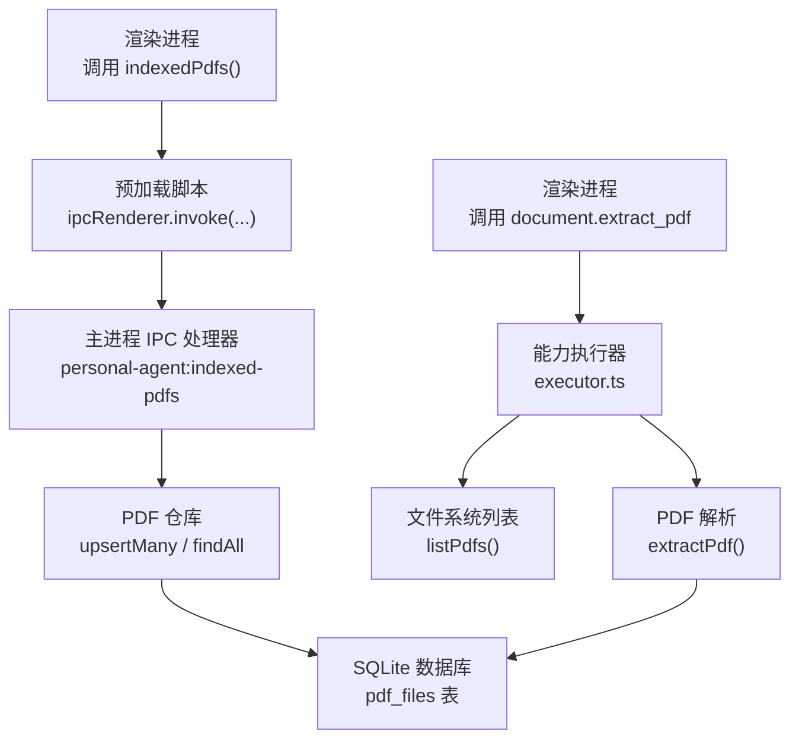
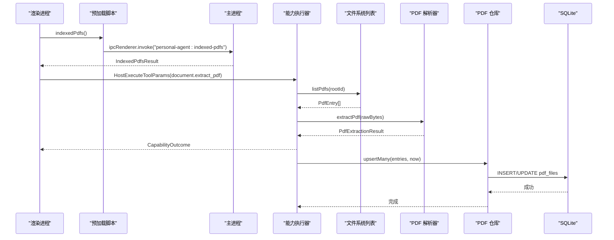
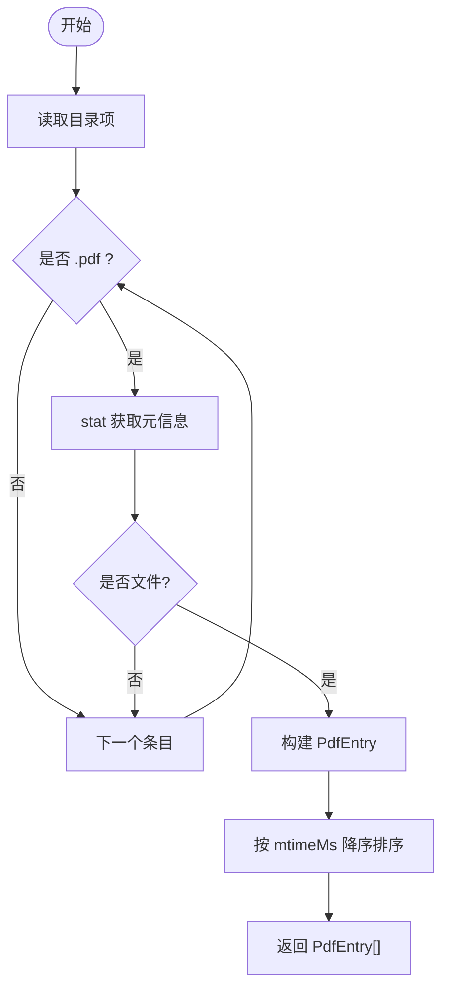
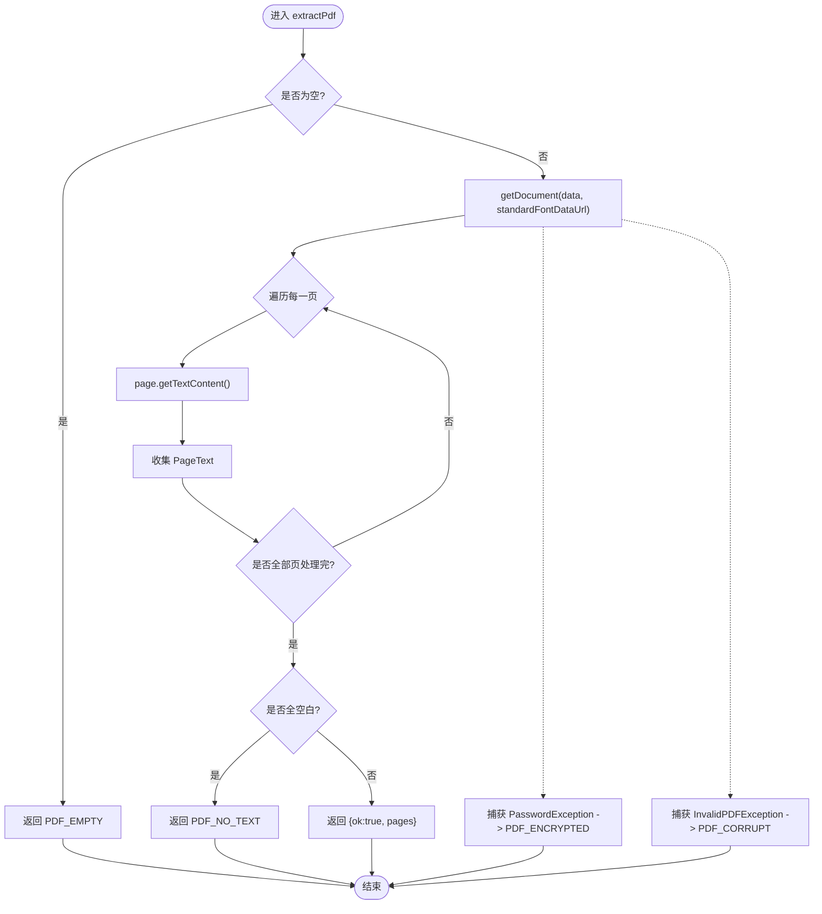
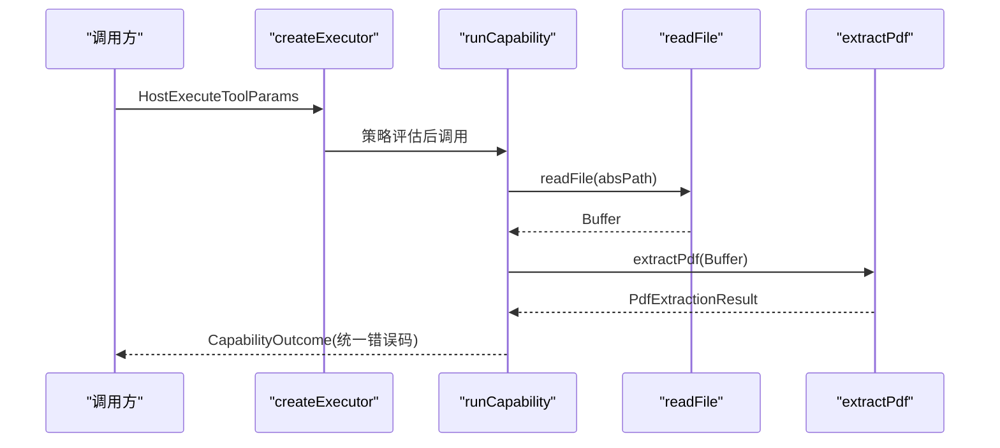
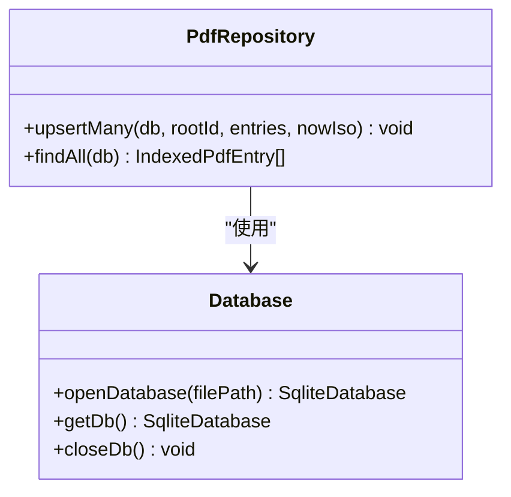
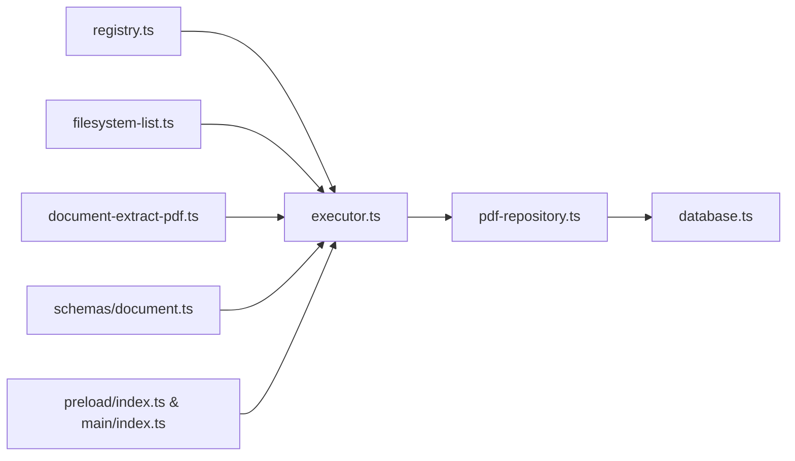

# PDF 索引

<cite>
**本文引用的文件**
- [apps/desktop/src/main/capabilities/document-extract-pdf.ts](file://apps/desktop/src/main/capabilities/document-extract-pdf.ts)
- [apps/desktop/src/main/capabilities/executor.ts](file://apps/desktop/src/main/capabilities/executor.ts)
- [apps/desktop/src/main/capabilities/filesystem-list.ts](file://apps/desktop/src/main/capabilities/filesystem-list.ts)
- [apps/desktop/src/main/capabilities/registry.ts](file://apps/desktop/src/main/capabilities/registry.ts)
- [apps/desktop/src/main/db/database.ts](file://apps/desktop/src/main/db/database.ts)
- [apps/desktop/src/main/db/pdf-repository.ts](file://apps/desktop/src/main/db/pdf-repository.ts)
- [packages/protocol/schemas/document.ts](file://packages/protocol/schemas/document.ts)
- [apps/desktop/src/shared/ipc-contract.ts](file://apps/desktop/src/shared/ipc-contract.ts)
- [apps/desktop/src/preload/index.ts](file://apps/desktop/src/preload/index.ts)
- [apps/desktop/src/main/index.ts](file://apps/desktop/src/main/index.ts)
- [apps/desktop/src/main/capabilities/pdf-fixtures.ts](file://apps/desktop/src/main/capabilities/pdf-fixtures.ts)
</cite>

## 目录
1. [简介](#简介)
2. [项目结构](#项目结构)
3. [核心组件](#核心组件)
4. [架构总览](#架构总览)
5. [详细组件分析](#详细组件分析)
6. [依赖关系分析](#依赖关系分析)
7. [性能与内存优化](#性能与内存优化)
8. [故障排查指南](#故障排查指南)
9. [结论](#结论)
10. [附录：兼容性清单与处理建议](#附录：兼容性清单与处理建议)

## 简介
本文件面向“PDF 索引”能力，系统性说明从扫描、解析到内容提取、持久化与检索的完整链路。重点包括：
- PDF 扫描与发现机制（按根目录递归扫描 .pdf）
- PDF 解析与文本提取（基于 pdfjs-dist）
- 元数据管理与持久化（SQLite 表结构与 upsert 策略）
- 全文搜索与索引现状说明（当前仅维护元数据索引；全文检索需结合外部搜索引擎）
- 大文件处理与内存优化实践
- 流程图示与调优建议
- 常见 PDF 格式兼容性问题及解决方案

## 项目结构
围绕 PDF 索引的关键代码分布在主进程能力层、数据库层与协议契约层：
- 能力注册与执行：capabilities/registry.ts、capabilities/executor.ts
- PDF 扫描：capabilities/filesystem-list.ts
- PDF 解析：capabilities/document-extract-pdf.ts
- 元数据持久化：db/database.ts、db/pdf-repository.ts
- 协议与 IPC：packages/protocol/schemas/document.ts、apps/desktop/src/shared/ipc-contract.ts、preload/index.ts、main/index.ts

**图表来源**
- [apps/desktop/src/main/index.ts](file://apps/desktop/src/main/index.ts)
- [apps/desktop/src/preload/index.ts](file://apps/desktop/src/preload/index.ts)
- [apps/desktop/src/main/capabilities/executor.ts](file://apps/desktop/src/main/capabilities/executor.ts)
- [apps/desktop/src/main/capabilities/filesystem-list.ts](file://apps/desktop/src/main/capabilities/filesystem-list.ts)
- [apps/desktop/src/main/capabilities/document-extract-pdf.ts](file://apps/desktop/src/main/capabilities/document-extract-pdf.ts)
- [apps/desktop/src/main/db/pdf-repository.ts](file://apps/desktop/src/main/db/pdf-repository.ts)
- [apps/desktop/src/main/db/database.ts](file://apps/desktop/src/main/db/database.ts)

**章节来源**
- [apps/desktop/src/main/capabilities/registry.ts:9-40](file://apps/desktop/src/main/capabilities/registry.ts#L9-L40)
- [apps/desktop/src/main/capabilities/executor.ts:121-143](file://apps/desktop/src/main/capabilities/executor.ts#L121-L143)
- [apps/desktop/src/main/capabilities/filesystem-list.ts:6-31](file://apps/desktop/src/main/capabilities/filesystem-list.ts#L6-L31)
- [apps/desktop/src/main/capabilities/document-extract-pdf.ts:31-68](file://apps/desktop/src/main/capabilities/document-extract-pdf.ts#L31-L68)
- [apps/desktop/src/main/db/database.ts:15-40](file://apps/desktop/src/main/db/database.ts#L15-L40)
- [apps/desktop/src/main/db/pdf-repository.ts:15-66](file://apps/desktop/src/main/db/pdf-repository.ts#L15-L66)
- [packages/protocol/schemas/document.ts:5-31](file://packages/protocol/schemas/document.ts#L5-L31)
- [apps/desktop/src/shared/ipc-contract.ts:38-52](file://apps/desktop/src/shared/ipc-contract.ts#L38-L52)
- [apps/desktop/src/preload/index.ts:21-22](file://apps/desktop/src/preload/index.ts#L21-L22)
- [apps/desktop/src/main/index.ts:235-235](file://apps/desktop/src/main/index.ts#L235-L235)

## 核心组件
- PDF 扫描器：按授权根目录列出 .pdf 文件，收集名称、绝对路径、修改时间、大小等元数据，并按修改时间倒序返回。
- PDF 解析器：使用 pdfjs-dist 读取二进制流，逐页提取文本，检测空文本、加密、损坏等异常并返回结构化错误码。
- 能力执行器：将“document.extract_pdf”能力路由到解析流程，统一错误码包装。
- 元数据仓库：通过 SQLite 持久化 PDF 元数据，支持批量 upsert 与按修改时间排序查询。
- 协议与 IPC：定义 PDF 提取参数、结果类型与 IPC 通道，供渲染进程调用。

**章节来源**
- [apps/desktop/src/main/capabilities/filesystem-list.ts:6-31](file://apps/desktop/src/main/capabilities/filesystem-list.ts#L6-L31)
- [apps/desktop/src/main/capabilities/document-extract-pdf.ts:31-68](file://apps/desktop/src/main/capabilities/document-extract-pdf.ts#L31-L68)
- [apps/desktop/src/main/capabilities/executor.ts:157-172](file://apps/desktop/src/main/capabilities/executor.ts#L157-L172)
- [apps/desktop/src/main/db/pdf-repository.ts:32-66](file://apps/desktop/src/main/db/pdf-repository.ts#L32-L66)
- [packages/protocol/schemas/document.ts:5-31](file://packages/protocol/schemas/document.ts#L5-L31)
- [apps/desktop/src/shared/ipc-contract.ts:38-52](file://apps/desktop/src/shared/ipc-contract.ts#L38-L52)

## 架构总览
PDF 索引由“扫描—解析—持久化—查询”四阶段组成，能力执行器作为入口，协调文件系统、解析器与数据库。

**图表来源**
- [apps/desktop/src/main/index.ts:235-235](file://apps/desktop/src/main/index.ts#L235-L235)
- [apps/desktop/src/preload/index.ts:21-22](file://apps/desktop/src/preload/index.ts#L21-L22)
- [apps/desktop/src/main/capabilities/executor.ts:73-113](file://apps/desktop/src/main/capabilities/executor.ts#L73-L113)
- [apps/desktop/src/main/capabilities/filesystem-list.ts:6-31](file://apps/desktop/src/main/capabilities/filesystem-list.ts#L6-L31)
- [apps/desktop/src/main/capabilities/document-extract-pdf.ts:31-68](file://apps/desktop/src/main/capabilities/document-extract-pdf.ts#L31-L68)
- [apps/desktop/src/main/db/pdf-repository.ts:32-66](file://apps/desktop/src/main/db/pdf-repository.ts#L32-L66)

## 详细组件分析

### PDF 扫描与发现
- 行为：遍历授权根目录，筛选以 .pdf 结尾的文件，获取 stat 信息（名称、绝对路径、修改时间、大小），按 mtimeMs 降序返回。
- 容错：stat 失败跳过；非文件跳过。
- 输出：PdfEntry[]，用于后续入库与展示。

**图表来源**
- [apps/desktop/src/main/capabilities/filesystem-list.ts:6-31](file://apps/desktop/src/main/capabilities/filesystem-list.ts#L6-L31)

**章节来源**
- [apps/desktop/src/main/capabilities/filesystem-list.ts:6-31](file://apps/desktop/src/main/capabilities/filesystem-list.ts#L6-L31)

### PDF 解析与内容提取
- 输入：Uint8Array（原始 PDF 字节）。
- 过程：
  - 校验空文件，直接返回错误码。
  - 使用 pdfjs-dist 创建文档任务，设置标准字体数据路径。
  - 逐页获取文本内容，拼接为 PageText[]。
  - 若所有页面文本为空，返回“无文本层”错误码。
  - 捕获密码异常与无效 PDF 异常，映射为结构化错误码。
  - finally 中销毁任务释放资源。
- 输出：{ ok: true, pages } 或 { ok: false, code, reason }。

**图表来源**
- [apps/desktop/src/main/capabilities/document-extract-pdf.ts:31-68](file://apps/desktop/src/main/capabilities/document-extract-pdf.ts#L31-L68)

**章节来源**
- [apps/desktop/src/main/capabilities/document-extract-pdf.ts:31-68](file://apps/desktop/src/main/capabilities/document-extract-pdf.ts#L31-L68)

### 能力执行与错误封装
- 入口：createExecutor 根据 scope 与 retriever 生成执行函数。
- 路由：switch 对 capability.name 分发，其中 document.extract_pdf 调用 runExtractPdf。
- 流程：读取真实绝对路径文件 -> 调用 extractPdf -> 统一错误码包装。
- 兜底：未实现的能力返回 NOT_IMPLEMENTED。

**图表来源**
- [apps/desktop/src/main/capabilities/executor.ts:73-113](file://apps/desktop/src/main/capabilities/executor.ts#L73-L113)
- [apps/desktop/src/main/capabilities/executor.ts:121-143](file://apps/desktop/src/main/capabilities/executor.ts#L121-L143)
- [apps/desktop/src/main/capabilities/executor.ts:157-172](file://apps/desktop/src/main/capabilities/executor.ts#L157-L172)

**章节来源**
- [apps/desktop/src/main/capabilities/executor.ts:73-325](file://apps/desktop/src/main/capabilities/executor.ts#L73-L325)

### 元数据管理与持久化
- 表结构：pdf_files(absolute_path PK, root_id, name, modified_at, size_bytes, first_seen_at, last_seen_at)。
- 写入：upsertMany 使用事务批量插入/更新，避免重复 IO。
- 查询：findAll 按 modified_at 倒序返回 IndexedPdfEntry[]。
- 数据库：better-sqlite3，启用 WAL 模式提升并发写性能。

**图表来源**
- [apps/desktop/src/main/db/pdf-repository.ts:15-66](file://apps/desktop/src/main/db/pdf-repository.ts#L15-L66)
- [apps/desktop/src/main/db/database.ts:15-40](file://apps/desktop/src/main/db/database.ts#L15-L40)

**章节来源**
- [apps/desktop/src/main/db/pdf-repository.ts:15-66](file://apps/desktop/src/main/db/pdf-repository.ts#L15-L66)
- [apps/desktop/src/main/db/database.ts:15-40](file://apps/desktop/src/main/db/database.ts#L15-L40)

### 协议与 IPC 契约
- 协议：DocumentExtractPdfParams、PageText、DocumentExtractPdfResult/Outcome 定义请求与响应结构。
- IPC：IndexedPdfsResult、ListPdfsResult 等类型在 shared 层暴露给渲染进程。
- 预加载：indexedPdfs 方法桥接 IPC 调用。
- 主进程：监听 personal-agent:indexed-pdfs 事件并返回结果。

**章节来源**
- [packages/protocol/schemas/document.ts:5-31](file://packages/protocol/schemas/document.ts#L5-L31)
- [apps/desktop/src/shared/ipc-contract.ts:38-52](file://apps/desktop/src/shared/ipc-contract.ts#L38-L52)
- [apps/desktop/src/preload/index.ts:21-22](file://apps/desktop/src/preload/index.ts#L21-L22)
- [apps/desktop/src/main/index.ts:235-235](file://apps/desktop/src/main/index.ts#L235-L235)

## 依赖关系分析
- 能力注册：registry.ts 声明 document.extract_pdf 能力。
- 执行器：executor.ts 依赖 registry、filesystem-list、document-extract-pdf、policy 等模块。
- 解析器：document-extract-pdf.ts 依赖 pdfjs-dist。
- 持久化：pdf-repository.ts 依赖 database.ts。
- IPC：preload 与 main 通过约定通道通信。

**图表来源**
- [apps/desktop/src/main/capabilities/registry.ts:9-40](file://apps/desktop/src/main/capabilities/registry.ts#L9-L40)
- [apps/desktop/src/main/capabilities/executor.ts:73-143](file://apps/desktop/src/main/capabilities/executor.ts#L73-L143)
- [apps/desktop/src/main/capabilities/filesystem-list.ts:6-31](file://apps/desktop/src/main/capabilities/filesystem-list.ts#L6-L31)
- [apps/desktop/src/main/capabilities/document-extract-pdf.ts:31-68](file://apps/desktop/src/main/capabilities/document-extract-pdf.ts#L31-L68)
- [apps/desktop/src/main/db/pdf-repository.ts:32-66](file://apps/desktop/src/main/db/pdf-repository.ts#L32-L66)
- [apps/desktop/src/main/db/database.ts:15-40](file://apps/desktop/src/main/db/database.ts#L15-L40)
- [packages/protocol/schemas/document.ts:5-31](file://packages/protocol/schemas/document.ts#L5-L31)
- [apps/desktop/src/preload/index.ts:21-22](file://apps/desktop/src/preload/index.ts#L21-L22)
- [apps/desktop/src/main/index.ts:235-235](file://apps/desktop/src/main/index.ts#L235-L235)

**章节来源**
- [apps/desktop/src/main/capabilities/registry.ts:9-40](file://apps/desktop/src/main/capabilities/registry.ts#L9-L40)
- [apps/desktop/src/main/capabilities/executor.ts:73-325](file://apps/desktop/src/main/capabilities/executor.ts#L73-L325)

## 性能与内存优化
- 解析阶段
  - 使用 pdfjs-dist 的 getDocument 流式 API，逐页获取文本，避免一次性加载整个文档对象树。
  - 显式调用 task.destroy() 释放底层资源，防止内存泄漏。
  - 对空 PDF、无文本层 PDF 快速失败，减少无用计算。
- 扫描阶段
  - 仅枚举目录一次，过滤 .pdf 后缀，stat 失败跳过，降低 I/O 开销。
  - 按 mtimeMs 排序便于增量更新与最近优先展示。
- 持久化阶段
  - 使用 better-sqlite3 的事务批量 upsert，减少磁盘同步次数。
  - 开启 WAL 模式提升并发写性能与崩溃恢复能力。
- 大文件处理建议
  - 限制单次解析的最大页数或最大文本长度，避免超大 PDF 导致内存峰值过高。
  - 对超大 PDF 可考虑分块解析（如每 N 页提交一次）或后台队列异步处理。
  - 对扫描结果做分页或懒加载，避免一次性返回大量元数据。
- 缓存策略建议
  - 基于 absolute_path + modified_at 的哈希作为缓存键，当文件未变更时复用上次解析结果。
  - 对频繁访问的 PDF 文本片段进行短期内存缓存（LRU），注意与文件变更信号联动失效。
  - 对索引结果（IndexedPdfEntry）可按根目录与更新时间窗口缓存，减少重复查询。

[本节提供通用指导，不直接分析具体文件]

## 故障排查指南
- 常见问题与定位
  - 空 PDF：extractPdf 会返回 PDF_EMPTY，检查源文件是否为 0 字节。
  - 加密 PDF：捕获 PasswordException 并返回 PDF_ENCRYPTED，提示用户解锁或提供密码。
  - 损坏 PDF：捕获 InvalidPDFException 并返回 PDF_CORRUPT，建议重新下载或修复。
  - 无文本层：所有页面文本为空时返回 PDF_NO_TEXT，可能是扫描件，需要 OCR 补充。
  - 权限与路径：readFile 失败返回 FILE_UNREADABLE，检查路径与权限。
- 调试建议
  - 打印 absolute_path 与 size_bytes，确认扫描到的文件是否正确。
  - 记录解析过程中的异常堆栈与错误码，便于问题归因。
  - 使用测试夹具（buildPdf/buildEncryptedPdf/buildCorruptPdf/buildBlankPdf）复现边界情况。

**章节来源**
- [apps/desktop/src/main/capabilities/document-extract-pdf.ts:31-68](file://apps/desktop/src/main/capabilities/document-extract-pdf.ts#L31-L68)
- [apps/desktop/src/main/capabilities/executor.ts:157-172](file://apps/desktop/src/main/capabilities/executor.ts#L157-L172)
- [apps/desktop/src/main/capabilities/pdf-fixtures.ts:1-59](file://apps/desktop/src/main/capabilities/pdf-fixtures.ts#L1-L59)

## 结论
本项目实现了可靠的 PDF 扫描、解析与元数据索引能力，具备完善的错误分类与资源释放机制。当前索引聚焦于元数据（文件名、路径、修改时间、大小等），全文检索尚未内置。若需全文搜索，可在现有元数据基础上引入外部搜索引擎（如 Elasticsearch、Meilisearch 或本地向量库），将每页文本与元数据联合索引，以实现高效检索。

[本节总结性内容，不直接分析具体文件]

## 附录：兼容性清单与处理建议
- 加密 PDF：检测到密码保护时返回 PDF_ENCRYPTED，建议在 UI 提示用户解锁或提供密码后再解析。
- 损坏 PDF：返回 PDF_CORRUPT，提示重新获取文件或尝试修复工具。
- 无文本层 PDF：返回 PDF_NO_TEXT，建议接入 OCR 服务（如 Tesseract）生成文本层。
- 超大 PDF：建议分页解析与后台任务处理，避免阻塞主线程与内存溢出。
- 扫描件与图片型 PDF：OCR 是必要补充；可在解析失败或无文本层时自动触发 OCR 流程。
- 多语言与字体：确保标准字体数据可用（standardFontDataUrl），避免字符乱码。

[本节为通用建议，不直接分析具体文件]