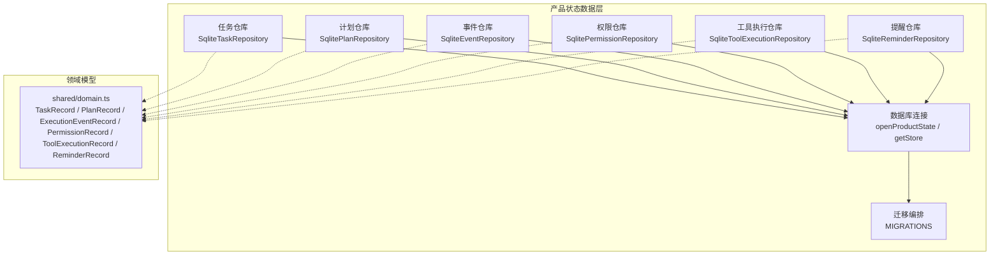
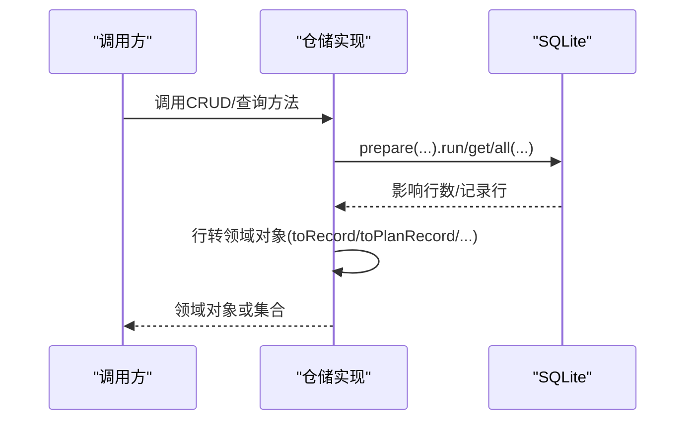
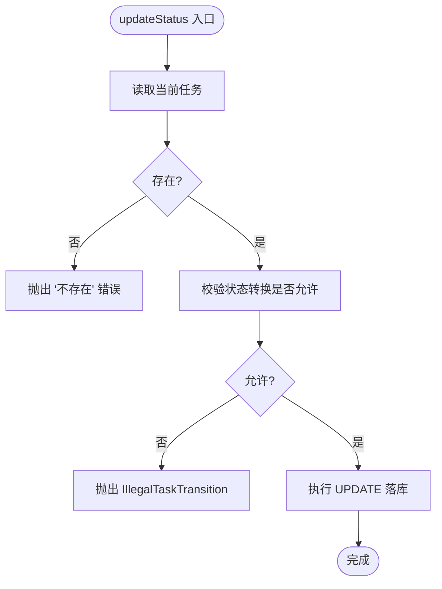
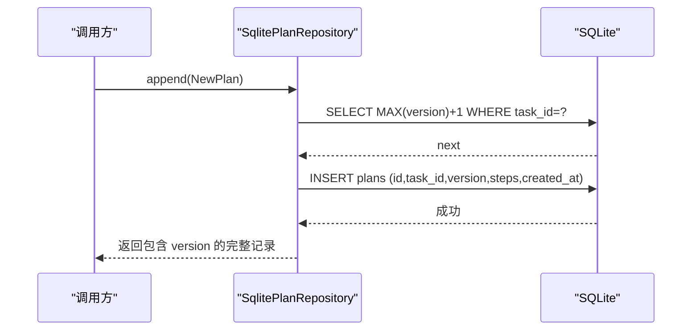
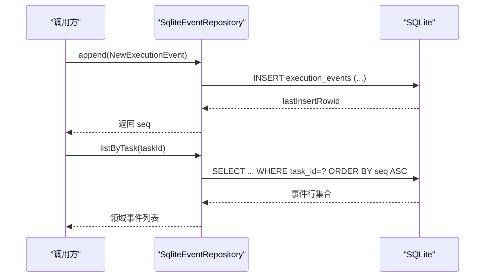
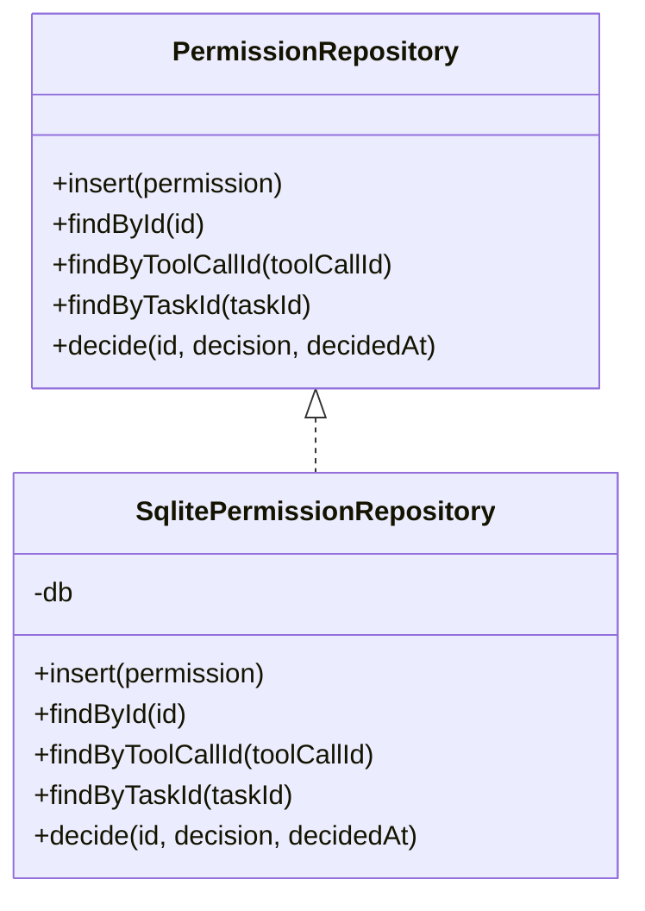
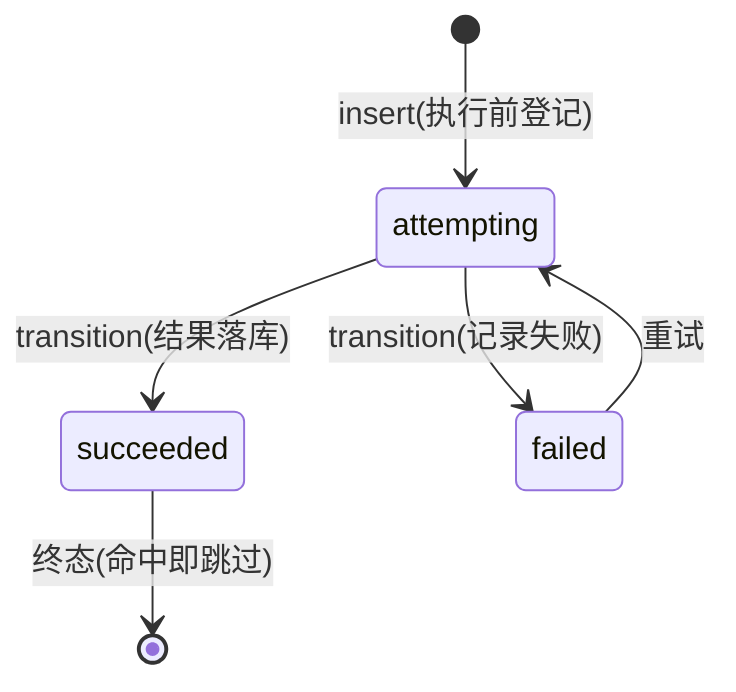
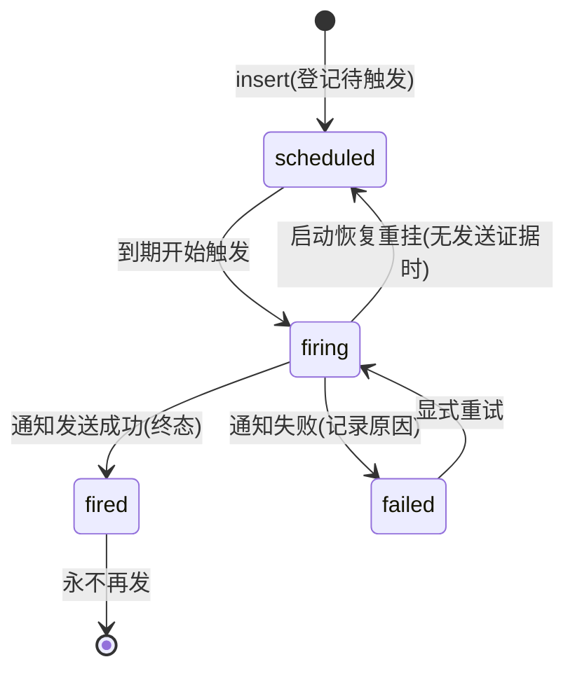
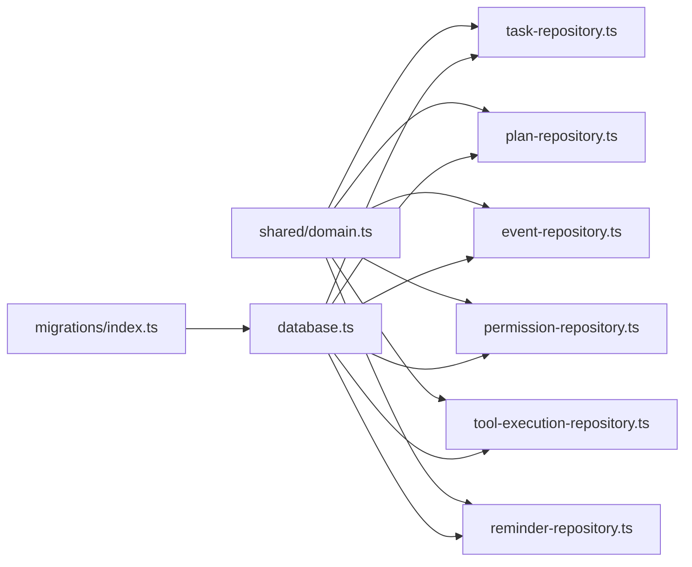

# Repository 模式

<cite>
**本文引用的文件**
- [database.ts](file://apps/desktop/src/main/product-state/database.ts)
- [task-repository.ts](file://apps/desktop/src/main/product-state/task-repository.ts)
- [plan-repository.ts](file://apps/desktop/src/main/product-state/plan-repository.ts)
- [event-repository.ts](file://apps/desktop/src/main/product-state/event-repository.ts)
- [permission-repository.ts](file://apps/desktop/src/main/product-state/permission-repository.ts)
- [tool-execution-repository.ts](file://apps/desktop/src/main/product-state/tool-execution-repository.ts)
- [reminder-repository.ts](file://apps/desktop/src/main/product-state/reminder-repository.ts)
- [domain.ts](file://apps/desktop/src/shared/domain.ts)
- [migrations/index.ts](file://apps/desktop/src/main/product-state/migrations/index.ts)
- [0001-create-tasks.ts](file://apps/desktop/src/main/product-state/migrations/0001-create-tasks.ts)
- [0002-create-plans.ts](file://apps/desktop/src/main/product-state/migrations/0002-create-plans.ts)
- [0003-create-execution-events.ts](file://apps/desktop/src/main/product-state/migrations/0003-create-execution-events.ts)
- [0004-create-permissions.ts](file://apps/desktop/src/main/product-state/migrations/0004-create-permissions.ts)
- [0006-create-tool-executions.ts](file://apps/desktop/src/main/product-state/migrations/0006-create-tool-executions.ts)
- [0007-create-reminders.ts](file://apps/desktop/src/main/product-state/migrations/0007-create-reminders.ts)
- [task-repository.test.ts](file://apps/desktop/src/main/product-state/task-repository.test.ts)
- [plan-repository.test.ts](file://apps/desktop/src/main/product-state/plan-repository.test.ts)
- [event-repository.test.ts](file://apps/desktop/src/main/product-state/event-repository.test.ts)
- [permission-repository.test.ts](file://apps/desktop/src/main/product-state/permission-repository.test.ts)
- [tool-execution-repository.test.ts](file://apps/desktop/src/main/product-state/tool-execution-repository.test.ts)
- [reminder-repository.test.ts](file://apps/desktop/src/main/product-state/reminder-repository.test.ts)
</cite>

## 目录
1. [简介](#简介)
2. [项目结构](#项目结构)
3. [核心组件](#核心组件)
4. [架构总览](#架构总览)
5. [详细组件分析](#详细组件分析)
6. [依赖关系分析](#依赖关系分析)
7. [性能考虑](#性能考虑)
8. [故障排查指南](#故障排查指南)
9. [结论](#结论)
10. [附录：扩展新仓库的指南](#附录扩展新仓库的指南)

## 简介
本文件系统化阐述数据访问层的 Repository 模式实现，覆盖任务、计划、执行事件、权限、工具执行记录与提醒（Reminder）六个领域实体的存储抽象。文档聚焦以下方面：
- 接口定义与职责边界
- CRUD 与查询方法设计
- 数据映射策略（驼峰字段与下划线列名、JSON 序列化）
- 批量操作与事务处理机制
- 错误处理模式与可观测性
- 使用示例与最佳实践
- 扩展新 Repository 的指导原则

## 项目结构
数据访问层位于主进程 product-state 模块中，围绕 better-sqlite3 提供统一的数据库连接、迁移与仓储实现。共享领域模型在 shared/domain.ts 中统一定义，迁移脚本集中管理于 migrations 目录。

图表来源
- [database.ts:17-93](file://apps/desktop/src/main/product-state/database.ts#L17-L93)
- [migrations/index.ts:13-22](file://apps/desktop/src/main/product-state/migrations/index.ts#L13-L22)
- [task-repository.ts:60-102](file://apps/desktop/src/main/product-state/task-repository.ts#L60-L102)
- [plan-repository.ts:9-85](file://apps/desktop/src/main/product-state/plan-repository.ts#L9-L85)
- [event-repository.ts:9-67](file://apps/desktop/src/main/product-state/event-repository.ts#L9-L67)
- [permission-repository.ts:24-134](file://apps/desktop/src/main/product-state/permission-repository.ts#L24-L134)
- [tool-execution-repository.ts:124-166](file://apps/desktop/src/main/product-state/tool-execution-repository.ts#L124-L166)
- [reminder-repository.ts:123-170](file://apps/desktop/src/main/product-state/reminder-repository.ts#L123-L170)
- [domain.ts:13-158](file://apps/desktop/src/shared/domain.ts#L13-L158)

章节来源
- [database.ts:17-93](file://apps/desktop/src/main/product-state/database.ts#L17-L93)
- [migrations/index.ts:13-22](file://apps/desktop/src/main/product-state/migrations/index.ts#L13-L22)
- [domain.ts:13-158](file://apps/desktop/src/shared/domain.ts#L13-L158)

## 核心组件
- 数据库连接与迁移
  - openProductState：打开 SQLite 并设置 WAL 日志模式；内存库使用 memory 模式。
  - migrate：按版本号顺序执行待迁移脚本，使用事务包裹，迁移后校验外键一致性。
  - getStore/closeStore：单例化全局数据库实例，便于测试注入内存库。
- 领域模型
  - TaskRecord、PlanRecord、ExecutionEventRecord、PermissionRecord、ToolExecutionRecord、ReminderRecord 等类型统一在 shared/domain.ts 定义，作为仓储读写契约。
  - 状态枚举（TOOL_EXECUTION_STATUSES、REMINDER_STATUSES 等）以 readonly const 数组为单一事实来源，类型经 typeof X[number] 派生，禁止手写联合类型。
- 仓储实现
  - SqliteTaskRepository：任务插入、查找、全量查询、状态更新（含状态机校验）。
  - SqlitePlanRepository：追加新版本、查询最新版本、查询全部版本（steps JSON 往返）。
  - SqliteEventRepository：追加事件（返回自增 seq）、按任务列出事件（payload JSON 往返）。
  - SqlitePermissionRepository：插入、按 id/toolCallId/taskId 查询、决策写入（幂等与冲突保护）。
  - SqliteToolExecutionRepository：工具执行幂等记录的插入、按 key/任务查询、状态翻转（含转换表校验）。
  - SqliteReminderRepository：Reminder 的插入（task_id 唯一保护）、按 id/任务查询、状态翻转（COALESCE 部分字段更新）。

章节来源
- [database.ts:17-93](file://apps/desktop/src/main/product-state/database.ts#L17-L93)
- [task-repository.ts:60-102](file://apps/desktop/src/main/product-state/task-repository.ts#L60-L102)
- [plan-repository.ts:9-85](file://apps/desktop/src/main/product-state/plan-repository.ts#L9-L85)
- [event-repository.ts:9-67](file://apps/desktop/src/main/product-state/event-repository.ts#L9-L67)
- [permission-repository.ts:24-134](file://apps/desktop/src/main/product-state/permission-repository.ts#L24-L134)
- [tool-execution-repository.ts:1-166](file://apps/desktop/src/main/product-state/tool-execution-repository.ts#L1-L166)
- [reminder-repository.ts:1-170](file://apps/desktop/src/main/product-state/reminder-repository.ts#L1-L170)
- [domain.ts:13-158](file://apps/desktop/src/shared/domain.ts#L13-L158)

## 架构总览
仓储层通过 SQL 语句与 better-sqlite3 交互，将数据库行对象映射为领域记录。迁移系统保证表结构与约束随版本演进。业务侧通过仓储接口进行数据访问，屏蔽底层 SQL 细节。

图表来源
- [task-repository.ts:81-102](file://apps/desktop/src/main/product-state/task-repository.ts#L81-L102)
- [plan-repository.ts:59-85](file://apps/desktop/src/main/product-state/plan-repository.ts#L59-L85)
- [event-repository.ts:52-67](file://apps/desktop/src/main/product-state/event-repository.ts#L52-L67)
- [permission-repository.ts:95-134](file://apps/desktop/src/main/product-state/permission-repository.ts#L95-L134)

## 详细组件分析

### 任务仓储（TaskRepository）
- 接口职责
  - insert：插入任务记录
  - findById：按 id 查找
  - findAll：按创建时间升序全量查询
  - updateStatus：带状态机校验的状态更新
- 数据映射
  - 数据库列 snake_case → 领域对象 camelCase
  - status 合法性双重校验：数据库 CHECK + isTaskStatus
- 状态机
  - 允许转换表 ALLOWED_TRANSITIONS 控制合法流转
  - 非法转换抛出 IllegalTaskTransition
- 典型用法与异常
  - 不存在 id 时 updateStatus 抛错
  - 脏数据绕过 CHECK 时 toRecord 抛错

图表来源
- [task-repository.ts:32-36](file://apps/desktop/src/main/product-state/task-repository.ts#L32-L36)
- [task-repository.ts:94-101](file://apps/desktop/src/main/product-state/task-repository.ts#L94-L101)

章节来源
- [task-repository.ts:9-102](file://apps/desktop/src/main/product-state/task-repository.ts#L9-L102)
- [task-repository.test.ts:36-198](file://apps/desktop/src/main/product-state/task-repository.test.ts#L36-L198)

### 计划仓储（PlanRepository）
- 接口职责
  - append：追加新版本（version 自动计算）
  - findLatest：获取最新版本
  - findAllVersions：按 version 升序获取全部版本
- 数据映射
  - steps 以 JSON 字符串持久化，读回解析为数组
  - 非法 JSON 抛出错误并附带上下文
- 版本策略
  - NEXT_VERSION_SQL 基于 task_id 独立计数
  - UNIQUE(task_id, version) 防重号

图表来源
- [plan-repository.ts:44-74](file://apps/desktop/src/main/product-state/plan-repository.ts#L44-L74)
- [0002-create-plans.ts:3-12](file://apps/desktop/src/main/product-state/migrations/0002-create-plans.ts#L3-L12)

章节来源
- [plan-repository.ts:9-85](file://apps/desktop/src/main/product-state/plan-repository.ts#L9-L85)
- [plan-repository.test.ts:36-130](file://apps/desktop/src/main/product-state/plan-repository.test.ts#L36-L130)
- [0002-create-plans.ts:3-12](file://apps/desktop/src/main/product-state/migrations/0002-create-plans.ts#L3-L12)

### 事件仓储（EventRepository）
- 接口职责
  - append：追加执行事件，返回自增 seq
  - listByTask：按任务列出事件（按 seq 升序）
- 数据映射
  - payload 以 JSON 字符串持久化，读回解析为任意对象
  - 非法 JSON 抛出错误并携带 seq 定位
- 不可变性与索引
  - 触发器禁止 UPDATE/DELETE，确保 append-only
  - 索引 (task_id, seq) 优化查询

图表来源
- [event-repository.ts:41-67](file://apps/desktop/src/main/product-state/event-repository.ts#L41-L67)
- [0003-create-execution-events.ts:3-38](file://apps/desktop/src/main/product-state/migrations/0003-create-execution-events.ts#L3-L38)

章节来源
- [event-repository.ts:9-67](file://apps/desktop/src/main/product-state/event-repository.ts#L9-L67)
- [event-repository.test.ts:35-132](file://apps/desktop/src/main/product-state/event-repository.test.ts#L35-L132)
- [0003-create-execution-events.ts:3-38](file://apps/desktop/src/main/product-state/migrations/0003-create-execution-events.ts#L3-L38)

### 权限仓储（PermissionRepository）
- 接口职责
  - insert：插入授权请求
  - findById/findByToolCallId/findByTaskId：多种查询维度
  - decide：写入批准/拒绝结论（幂等与冲突保护）
- 数据映射
  - sourcePaths 以 JSON 数组持久化，读回解析为数组
  - targetPath 可为 null
  - status 仅存 pending/approved/denied，expired 由查询时投影
- 约束与一致性
  - tool_call_id 唯一约束，一次工具调用仅一次授权机会
  - 重复相同结论幂等返回；不同结论抛出 PermissionAlreadyDecided

图表来源
- [permission-repository.ts:24-134](file://apps/desktop/src/main/product-state/permission-repository.ts#L24-L134)
- [0004-create-permissions.ts:5-38](file://apps/desktop/src/main/product-state/migrations/0004-create-permissions.ts#L5-L38)

章节来源
- [permission-repository.ts:24-134](file://apps/desktop/src/main/product-state/permission-repository.ts#L24-L134)
- [permission-repository.test.ts:50-241](file://apps/desktop/src/main/product-state/permission-repository.test.ts#L50-L241)
- [0004-create-permissions.ts:5-38](file://apps/desktop/src/main/product-state/migrations/0004-create-permissions.ts#L5-L38)

### 工具执行仓储（ToolExecutionRepository）
- 接口职责
  - insert：执行前写入一条 attempting 记录（幂等关由上层先查后决定，仓储直接 INSERT）
  - findByKey：按 idempotency_key 查当前状态，null 表示该副作用从未登记
  - findByTaskId：按任务列出全部执行记录（attempted_at 升序），供 recovery 启动扫描
  - transition：执行后翻转状态；toStatus='succeeded' 时把 resultPayload 序列化落库，命中已执行时原样返回
- 数据映射
  - sourcePaths 以 JSON 数组持久化，resultPayload 以 JSON 持久化（null 表示非 succeeded），读回解析失败抛出带 key 上下文的错误
  - status 合法性双重校验：数据库 CHECK + isToolExecutionStatus
- 状态机（分层原则）
  - DB CHECK 只拦非法值；合法转换由 ALLOWED_TRANSITIONS 转换表校验：attempting→succeeded|failed；succeeded 为终态；failed→attempting（重试）
  - 非法转换抛出领域错误 IllegalToolExecutionTransition
- 防漂移测试
  - 测试遍历 TOOL_EXECUTION_STATUSES 数组做真库插入，确保 SQL CHECK 与 TS 定义同源；并逐格断言 assertTransitionAllowed 与转换表一致

图表来源
- [tool-execution-repository.ts:13-18](file://apps/desktop/src/main/product-state/tool-execution-repository.ts#L13-L18)

章节来源
- [tool-execution-repository.ts:13-166](file://apps/desktop/src/main/product-state/tool-execution-repository.ts#L13-L166)
- [tool-execution-repository.test.ts:96-247](file://apps/desktop/src/main/product-state/tool-execution-repository.test.ts#L96-L247)
- [0006-create-tool-executions.ts:3-31](file://apps/desktop/src/main/product-state/migrations/0006-create-tool-executions.ts#L3-L31)
- [domain.ts:96-102](file://apps/desktop/src/shared/domain.ts#L96-L102)

### 提醒仓储（ReminderRepository）
- 接口职责
  - insert：写入一条 scheduled 记录；同一 Task 已有 Reminder 时抛领域错误 ReminderAlreadyExists（上层 executor 负责先查、决定幂等返回还是拒绝，并映射为稳定错误码）
  - findById/findByTaskId：task_id UNIQUE，按任务查询至多一条
  - findAll：全表读取（按 remind_at 升序）；启动恢复要按四状态分流，不是只挑到期的那些
  - transition：状态翻转，extra 里的 firedAt/failureReason 给了才写——UPDATE 用 COALESCE 保留旧值，实现部分字段更新
- 数据映射
  - 数据库列 snake_case → 领域对象 camelCase；status 合法性双重校验：数据库 CHECK + isReminderStatus
- 状态机（分层原则）
  - DB CHECK 只拦非法值；合法转换由 ALLOWED_TRANSITIONS 转换表校验：scheduled→firing；firing→fired|failed|scheduled（启动恢复重挂）；fired 为终态、永不再发；failed→firing（显式重试的唯一入口）
  - 非法转换抛出领域错误 IllegalReminderTransition
- 唯一性保证
  - 「同一 Task 至多一条 Reminder」由 reminders.task_id 的 UNIQUE 约束在数据库级保证；idempotency_key 故意不设 UNIQUE（key = capability:argsHash 不含 taskId，不同任务参数相同时 key 相等但不算重复）
- 触发与恢复的现状
  - 到期触发（fire-reminder.ts + reminder-timer.ts，TASK-024）与启动恢复（recover-reminders.ts，TASK-025）均已实现：恢复按四状态分流——scheduled 未到点重挂、已过期补发一次后 fired、firing 有 notification_sent 证据只补记 fired 绝不重发、firing 无证据先回滚 scheduled 再按过期分流、fired 与 failed 原样保留（后者只允许显式重试）
  - 恢复扫描用 findAll 全表而不是 status 窄查询（fired/failed 也要进处置报告），idx_reminders_due(status, remind_at) 因此仍未被任何查询使用
- 防漂移测试
  - 测试遍历 REMINDER_STATUSES 数组做真库插入，并逐格断言转换表一致性；还覆盖绕过仓储直接 INSERT 第二条同 task 记录被 UNIQUE 拦截的场景

图表来源
- [reminder-repository.ts:13-24](file://apps/desktop/src/main/product-state/reminder-repository.ts#L13-L24)

章节来源
- [reminder-repository.ts:13-180](file://apps/desktop/src/main/product-state/reminder-repository.ts#L13-L180)
- [reminder-repository.test.ts:100-295](file://apps/desktop/src/main/product-state/reminder-repository.test.ts#L100-L295)
- [recover-reminders.ts:26-77](file://apps/desktop/src/main/scheduler/recover-reminders.ts#L26-L77)
- [recover-reminders.ts:139-209](file://apps/desktop/src/main/scheduler/recover-reminders.ts#L139-L209)
- [0007-create-reminders.ts:3-34](file://apps/desktop/src/main/product-state/migrations/0007-create-reminders.ts#L3-L34)
- [domain.ts:104-136](file://apps/desktop/src/shared/domain.ts#L104-L136)

## 依赖关系分析
- 仓储对数据库连接的依赖
  - 所有仓储通过构造函数注入 SqliteDatabase，便于测试替换为内存库
- 迁移与约束
  - 迁移脚本集中注册，按版本号顺序执行
  - 外键、唯一约束、CHECK 与触发器共同保障数据一致性
- 领域模型解耦
  - 仓储只依赖 shared/domain.ts 的类型定义，不感知 UI 或上层业务

图表来源
- [domain.ts:13-158](file://apps/desktop/src/shared/domain.ts#L13-L158)
- [database.ts:17-93](file://apps/desktop/src/main/product-state/database.ts#L17-L93)
- [migrations/index.ts:13-22](file://apps/desktop/src/main/product-state/migrations/index.ts#L13-L22)

章节来源
- [database.ts:17-93](file://apps/desktop/src/main/product-state/database.ts#L17-L93)
- [migrations/index.ts:13-22](file://apps/desktop/src/main/product-state/migrations/index.ts#L13-L22)
- [domain.ts:13-158](file://apps/desktop/src/shared/domain.ts#L13-L158)

## 性能考虑
- WAL 模式：提升并发写性能与崩溃恢复能力
- 索引策略
  - 事件表 (task_id, seq) 加速按任务拉取
  - 权限表 (task_id, requested_at)、(args_hash) 支持常见查询与去重
  - 执行记录表 idx_tool_executions_task(task_id, attempted_at) 加速启动恢复按任务扫描
  - 提醒表 idx_reminders_due(status, remind_at) 为到期扫描预留；当前恢复走 findAll 全表扫描，该索引尚未被使用
- 最小列选择：SELECT 明确指定列，减少网络与内存开销
- JSON 字段：避免过度反序列化，仅在需要时解析
- 事务边界：跨表写操作应使用 db.transaction 包裹，保证原子性

[本节为通用指导，不直接分析具体文件]

## 故障排查指南
- 任务状态非法转换
  - 现象：updateStatus 抛出 IllegalTaskTransition
  - 排查：检查 ALLOWED_TRANSITIONS 与当前状态
  - 参考用例：[task-repository.test.ts:53-74](file://apps/desktop/src/main/product-state/task-repository.test.ts#L53-L74)
- 计划版本冲突
  - 现象：UNIQUE constraint failed
  - 排查：确认 NEXT_VERSION_SQL 与 task_id 过滤
  - 参考用例：[plan-repository.test.ts:51-73](file://apps/desktop/src/main/product-state/plan-repository.test.ts#L51-L73)
- 事件负载非法 JSON
  - 现象：listByTask 抛出“不是合法 JSON”并携带 seq
  - 排查：定位对应 seq 的事件记录
  - 参考用例：[event-repository.test.ts:121-130](file://apps/desktop/src/main/product-state/event-repository.test.ts#L121-L130)
- 权限重复决定
  - 现象：decide 抛出 PermissionAlreadyDecided
  - 排查：确认当前 status 与目标 decision 是否一致
  - 参考用例：[permission-repository.test.ts:191-215](file://apps/desktop/src/main/product-state/permission-repository.test.ts#L191-L215)
- 执行记录非法状态转换
  - 现象：transition 抛出 IllegalToolExecutionTransition（如 succeeded→attempting）
  - 排查：对照 ALLOWED_TRANSITIONS 转换表；succeeded 是终态，命中即跳过不会再执行
  - 参考用例：[tool-execution-repository.test.ts:202-238](file://apps/desktop/src/main/product-state/tool-execution-repository.test.ts#L202-L238)
- Reminder 重复创建 / 非法转换
  - 现象：insert 抛出 ReminderAlreadyExists，或 transition 抛出 IllegalReminderTransition（如 scheduled→fired 跳级、fired→任意状态）
  - 排查：确认该 Task 是否已有 Reminder（task_id UNIQUE）；触发必须经过 firing，failed 只能显式重试进 firing
  - 参考用例：[reminder-repository.test.ts:154-240](file://apps/desktop/src/main/product-state/reminder-repository.test.ts#L154-L240)
- 事务失败不回滚
  - 现象：部分写入生效
  - 排查：确保多步写在同一 db.transaction 内
  - 参考用例：[event-repository.test.ts:95-119](file://apps/desktop/src/main/product-state/event-repository.test.ts#L95-L119)

章节来源
- [task-repository.test.ts:53-74](file://apps/desktop/src/main/product-state/task-repository.test.ts#L53-L74)
- [plan-repository.test.ts:51-73](file://apps/desktop/src/main/product-state/plan-repository.test.ts#L51-L73)
- [event-repository.test.ts:95-130](file://apps/desktop/src/main/product-state/event-repository.test.ts#L95-L130)
- [permission-repository.test.ts:170-194](file://apps/desktop/src/main/product-state/permission-repository.test.ts#L170-L194)
- [tool-execution-repository.test.ts:202-238](file://apps/desktop/src/main/product-state/tool-execution-repository.test.ts#L202-L238)
- [reminder-repository.test.ts:154-240](file://apps/desktop/src/main/product-state/reminder-repository.test.ts#L154-L240)

## 结论
该数据访问层通过清晰的 Repository 抽象、严格的迁移与约束、以及稳健的错误处理，实现了高内聚、低耦合的任务、计划、事件、权限、工具执行记录与 Reminder 存储。仓储层专注于数据映射与一致性保障，上层业务无需关心 SQL 细节。结合 WAL、索引与事务，系统在正确性与性能之间取得良好平衡。

[本节为总结性内容，不直接分析具体文件]

## 附录：扩展新仓库的指南
- 新增领域模型
  - 在 shared/domain.ts 中定义类型，保持命名与语义清晰
- 新增迁移
  - 在 migrations 目录添加迁移脚本，声明 version/name/up
  - 在 migrations/index.ts 中注册到 MIGRATIONS 数组
- 实现仓储
  - 定义接口与实现类，遵循现有命名与风格
  - 使用 prepare 参数化 SQL，避免注入风险
  - 实现行到领域对象的映射函数，处理 JSON 解析与校验
  - 对外暴露必要的错误类型与辅助函数
- 事务与批量
  - 多步写使用 db.transaction 包裹，保证原子性
  - 批量插入可使用多次 run 或在应用层组织批次
- 测试
  - 使用 MEMORY_DB 与 migrate 初始化环境
  - 覆盖正常路径、边界条件与异常路径
  - 验证约束（如 UNIQUE/CHECK/触发器）与映射正确性
  - 遍历状态枚举数组做真库插入，确保 SQL CHECK 与 TS 定义同源（防双源漂移）；逐格断言 assertTransitionAllowed 与 ALLOWED_TRANSITIONS 转换表一致

章节来源
- [database.ts:17-93](file://apps/desktop/src/main/product-state/database.ts#L17-L93)
- [migrations/index.ts:13-22](file://apps/desktop/src/main/product-state/migrations/index.ts#L13-L22)
- [task-repository.test.ts:19-24](file://apps/desktop/src/main/product-state/task-repository.test.ts#L19-L24)
- [plan-repository.test.ts:15-27](file://apps/desktop/src/main/product-state/plan-repository.test.ts#L15-L27)
- [event-repository.test.ts:13-22](file://apps/desktop/src/main/product-state/event-repository.test.ts#L13-L22)
- [permission-repository.test.ts:18-30](file://apps/desktop/src/main/product-state/permission-repository.test.ts#L18-L30)
- [tool-execution-repository.test.ts:16-40](file://apps/desktop/src/main/product-state/tool-execution-repository.test.ts#L16-L40)
- [reminder-repository.test.ts:17-41](file://apps/desktop/src/main/product-state/reminder-repository.test.ts#L17-L41)