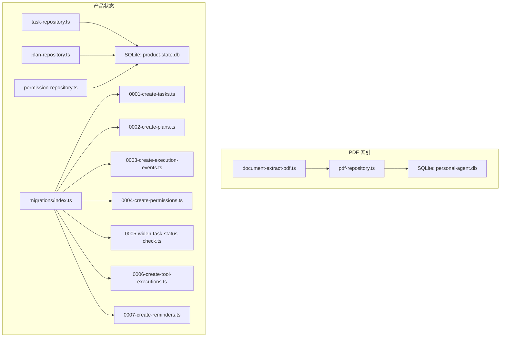
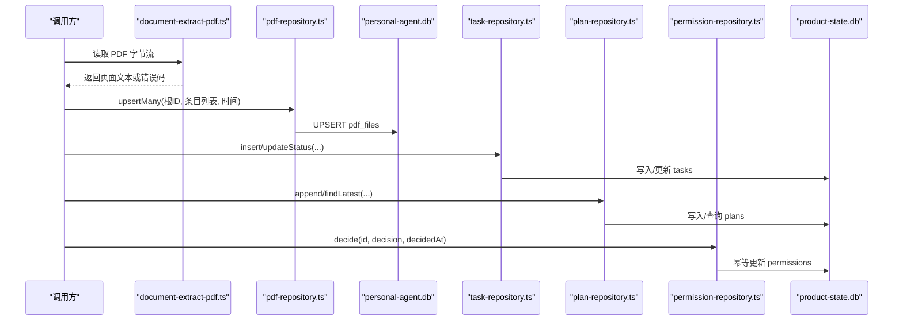
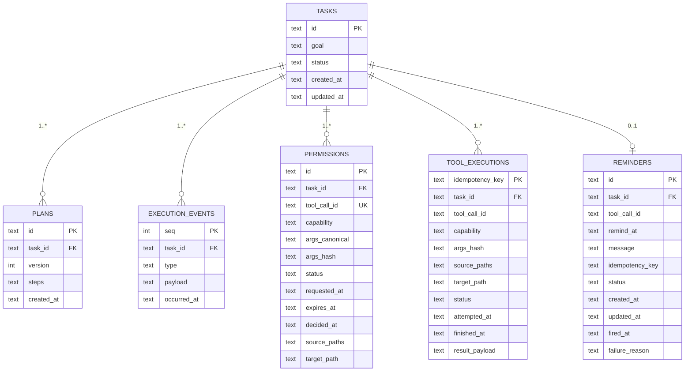
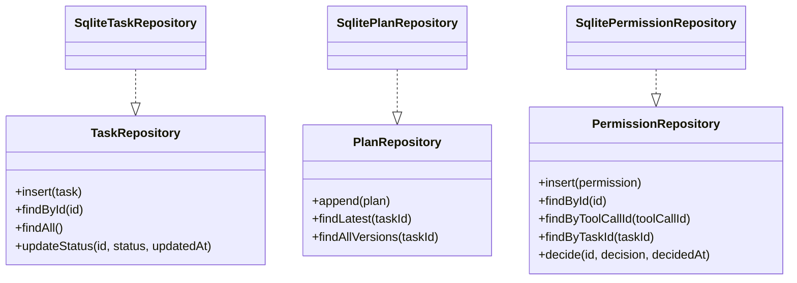
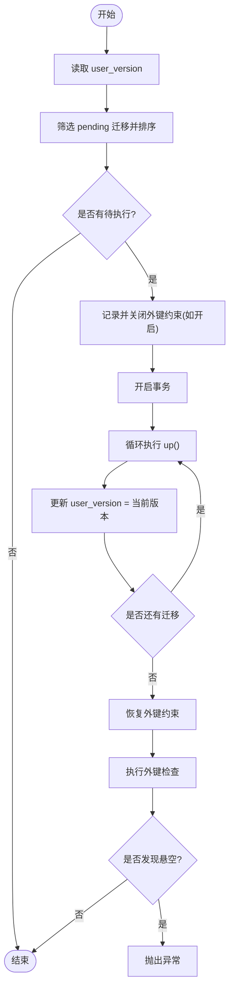
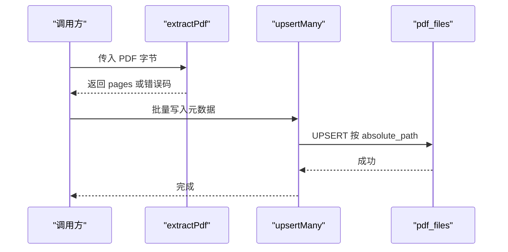
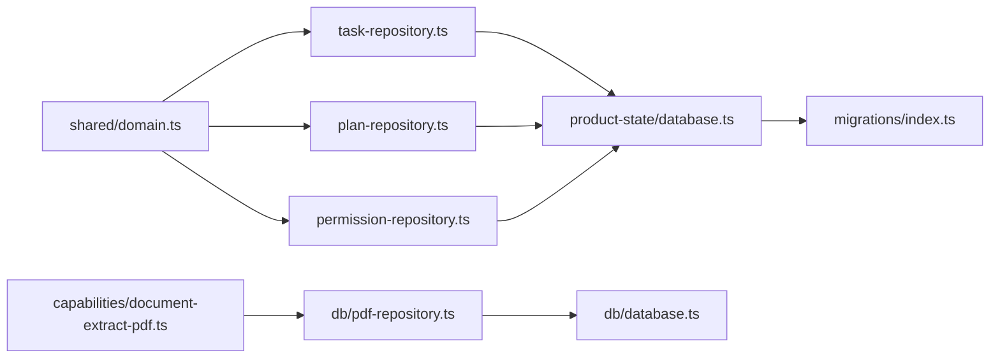

# 数据存储

<cite>
**本文引用的文件**
- [apps/desktop/src/main/db/database.ts](file://apps/desktop/src/main/db/database.ts)
- [apps/desktop/src/main/db/pdf-repository.ts](file://apps/desktop/src/main/db/pdf-repository.ts)
- [apps/desktop/src/main/product-state/database.ts](file://apps/desktop/src/main/product-state/database.ts)
- [apps/desktop/src/main/product-state/migrations/index.ts](file://apps/desktop/src/main/product-state/migrations/index.ts)
- [apps/desktop/src/main/product-state/migrations/0001-create-tasks.ts](file://apps/desktop/src/main/product-state/migrations/0001-create-tasks.ts)
- [apps/desktop/src/main/product-state/migrations/0002-create-plans.ts](file://apps/desktop/src/main/product-state/migrations/0002-create-plans.ts)
- [apps/desktop/src/main/product-state/migrations/0003-create-execution-events.ts](file://apps/desktop/src/main/product-state/migrations/0003-create-execution-events.ts)
- [apps/desktop/src/main/product-state/migrations/0004-create-permissions.ts](file://apps/desktop/src/main/product-state/migrations/0004-create-permissions.ts)
- [apps/desktop/src/main/product-state/migrations/0005-widen-task-status-check.ts](file://apps/desktop/src/main/product-state/migrations/0005-widen-task-status-check.ts)
- [apps/desktop/src/main/product-state/migrations/0006-create-tool-executions.ts](file://apps/desktop/src/main/product-state/migrations/0006-create-tool-executions.ts)
- [apps/desktop/src/main/product-state/migrations/0007-create-reminders.ts](file://apps/desktop/src/main/product-state/migrations/0007-create-reminders.ts)
- [apps/desktop/src/main/product-state/task-repository.ts](file://apps/desktop/src/main/product-state/task-repository.ts)
- [apps/desktop/src/main/product-state/plan-repository.ts](file://apps/desktop/src/main/product-state/plan-repository.ts)
- [apps/desktop/src/main/product-state/permission-repository.ts](file://apps/desktop/src/main/product-state/permission-repository.ts)
- [apps/desktop/src/main/capabilities/document-extract-pdf.ts](file://apps/desktop/src/main/capabilities/document-extract-pdf.ts)
- [apps/desktop/src/shared/domain.ts](file://apps/desktop/src/shared/domain.ts)
</cite>

## 目录
1. [简介](#简介)
2. [项目结构](#项目结构)
3. [核心组件](#核心组件)
4. [架构总览](#架构总览)
5. [详细组件分析](#详细组件分析)
6. [依赖关系分析](#依赖关系分析)
7. [性能考虑](#性能考虑)
8. [故障排除指南](#故障排除指南)
9. [结论](#结论)
10. [附录：SQL 与 ORM 使用示例](#附录sql-与-orm-使用示例)

## 简介
本文件系统性梳理个人代理的数据存储方案，覆盖 SQLite 数据库设计、Repository 模式实现、PDF 文档索引、迁移机制与版本管理、备份恢复策略，以及查询优化与故障排除。目标是帮助开发者快速理解并高效扩展数据层。

## 项目结构
数据相关代码主要分布在两个子系统中：
- PDF 索引子系统：负责 PDF 元数据的持久化与检索（独立数据库）。
- 产品状态子系统：负责任务、计划、执行事件、权限等核心业务数据的持久化与迁移（独立数据库）。

图表来源
- [apps/desktop/src/main/db/database.ts:15-40](file://apps/desktop/src/main/db/database.ts#L15-L40)
- [apps/desktop/src/main/product-state/database.ts:17-30](file://apps/desktop/src/main/product-state/database.ts#L17-L30)
- [apps/desktop/src/main/product-state/migrations/index.ts:12-20](file://apps/desktop/src/main/product-state/migrations/index.ts#L12-L20)

章节来源
- [apps/desktop/src/main/db/database.ts:15-40](file://apps/desktop/src/main/db/database.ts#L15-L40)
- [apps/desktop/src/main/product-state/database.ts:17-30](file://apps/desktop/src/main/product-state/database.ts#L17-L30)

## 核心组件
- SQLite 连接与初始化
  - PDF 索引库：创建表 pdf_files，设置 WAL 日志模式，提供 getDb/closeDb。
  - 产品状态库：打开数据库后运行迁移，维护 user_version 与外键约束。
- Repository 抽象
  - 任务仓库：插入、按 ID 查找、全量查询、受控状态更新。
  - 计划仓库：追加新版本、获取最新版本、列出全部版本。
  - 权限仓库：插入、按 ID/工具调用 ID/任务 ID 查询、幂等决策。
- PDF 内容提取
  - 使用 pdfjs-dist 提取文本页，处理空文件、损坏、加密、无文本层等情况。
- 迁移系统
  - 版本去重校验、事务内顺序执行 up、回滚保护、外键检查。

章节来源
- [apps/desktop/src/main/db/database.ts:27-50](file://apps/desktop/src/main/db/database.ts#L27-L50)
- [apps/desktop/src/main/product-state/database.ts:42-83](file://apps/desktop/src/main/product-state/database.ts#L42-L83)
- [apps/desktop/src/main/product-state/task-repository.ts:60-102](file://apps/desktop/src/main/product-state/task-repository.ts#L60-L102)
- [apps/desktop/src/main/product-state/plan-repository.ts:9-85](file://apps/desktop/src/main/product-state/plan-repository.ts#L9-L85)
- [apps/desktop/src/main/product-state/permission-repository.ts:24-131](file://apps/desktop/src/main/product-state/permission-repository.ts#L24-L131)
- [apps/desktop/src/main/capabilities/document-extract-pdf.ts:31-68](file://apps/desktop/src/main/capabilities/document-extract-pdf.ts#L31-L68)

## 架构总览
下图展示了从 PDF 提取到索引入库，以及任务/计划/权限的读写流程。

图表来源
- [apps/desktop/src/main/capabilities/document-extract-pdf.ts:31-68](file://apps/desktop/src/main/capabilities/document-extract-pdf.ts#L31-L68)
- [apps/desktop/src/main/db/pdf-repository.ts:32-53](file://apps/desktop/src/main/db/pdf-repository.ts#L32-L53)
- [apps/desktop/src/main/product-state/task-repository.ts:81-102](file://apps/desktop/src/main/product-state/task-repository.ts#L81-L102)
- [apps/desktop/src/main/product-state/plan-repository.ts:59-85](file://apps/desktop/src/main/product-state/plan-repository.ts#L59-L85)
- [apps/desktop/src/main/product-state/permission-repository.ts:92-131](file://apps/desktop/src/main/product-state/permission-repository.ts#L92-L131)

## 详细组件分析

### SQLite 数据库设计与索引策略
- PDF 索引库（personal-agent.db）
  - 表 pdf_files：以绝对路径为主键，记录 root_id、名称、修改时间、大小、首次/最近发现时间。
  - 查询排序：按 modified_at 倒序，便于展示最新变更。
  - 写入策略：UPSERT 基于 absolute_path 冲突时更新元数据并刷新 last_seen_at。
- 产品状态库（product-state.db）
  - tasks：id 主键，status 受 CHECK 约束，created_at/updated_at 时间戳。
  - plans：id 主键，task_id 外键引用 tasks，唯一约束 (task_id, version)，steps 为 JSON。
  - execution_events：seq 自增主键，task_id 外键，append-only（触发器禁止 UPDATE/DELETE），索引 (task_id, seq)。
  - permissions：id 主键，task_id 外键，tool_call_id 唯一，status 受 CHECK 约束，索引 (task_id, requested_at)、(args_hash)。
  - tool_executions：idempotency_key 主键，task_id 外键，status 受 CHECK 约束（attempting/succeeded/failed），索引 (task_id, attempted_at)，用于 WRITE 能力的幂等保护。
  - reminders：id 主键，task_id 外键且 UNIQUE（同一任务至多一条 Reminder），status 受 CHECK 约束（scheduled/firing/fired/failed），到期索引 (status, remind_at)。

图表来源
- [apps/desktop/src/main/product-state/migrations/0001-create-tasks.ts:10-18](file://apps/desktop/src/main/product-state/migrations/0001-create-tasks.ts#L10-L18)
- [apps/desktop/src/main/product-state/migrations/0002-create-plans.ts:3-12](file://apps/desktop/src/main/product-state/migrations/0002-create-plans.ts#L3-L12)
- [apps/desktop/src/main/product-state/migrations/0003-create-execution-events.ts:3-15](file://apps/desktop/src/main/product-state/migrations/0003-create-execution-events.ts#L3-L15)
- [apps/desktop/src/main/product-state/migrations/0004-create-permissions.ts:5-28](file://apps/desktop/src/main/product-state/migrations/0004-create-permissions.ts#L5-L28)
- [apps/desktop/src/main/product-state/migrations/0006-create-tool-executions.ts:3-22](file://apps/desktop/src/main/product-state/migrations/0006-create-tool-executions.ts#L3-L22)
- [apps/desktop/src/main/product-state/migrations/0007-create-reminders.ts:6-25](file://apps/desktop/src/main/product-state/migrations/0007-create-reminders.ts#L6-L25)

章节来源
- [apps/desktop/src/main/db/database.ts:15-40](file://apps/desktop/src/main/db/database.ts#L15-L40)
- [apps/desktop/src/main/product-state/migrations/0001-create-tasks.ts:10-18](file://apps/desktop/src/main/product-state/migrations/0001-create-tasks.ts#L10-L18)
- [apps/desktop/src/main/product-state/migrations/0002-create-plans.ts:3-12](file://apps/desktop/src/main/product-state/migrations/0002-create-plans.ts#L3-L12)
- [apps/desktop/src/main/product-state/migrations/0003-create-execution-events.ts:3-15](file://apps/desktop/src/main/product-state/migrations/0003-create-execution-events.ts#L3-L15)
- [apps/desktop/src/main/product-state/migrations/0004-create-permissions.ts:5-28](file://apps/desktop/src/main/product-state/migrations/0004-create-permissions.ts#L5-L28)
- [apps/desktop/src/main/product-state/migrations/0006-create-tool-executions.ts:3-22](file://apps/desktop/src/main/product-state/migrations/0006-create-tool-executions.ts#L3-L22)
- [apps/desktop/src/main/product-state/migrations/0007-create-reminders.ts:6-25](file://apps/desktop/src/main/product-state/migrations/0007-create-reminders.ts#L6-L25)

### Repository 模式实现
- 任务仓库（SqliteTaskRepository）
  - 能力：insert、findById、findAll、updateStatus。
  - 状态机：通过 ALLOWED_TRANSITIONS 限制合法转换；非法转换抛出异常。
  - SQL：参数化语句，避免注入；按 created_at/id 排序保证稳定输出。
- 计划仓库（SqlitePlanRepository）
  - 能力：append（自动计算下一版本）、findLatest、findAllVersions。
  - 并发安全：通过 MAX(version)+1 在单条事务中确保版本单调递增。
  - 序列化：steps 字段以 JSON 字符串存取。
- 权限仓库（SqlitePermissionRepository）
  - 能力：insert、findById、findByToolCallId、findByTaskId、decide。
  - 幂等性：对已决定的权限再次给出相同结论返回原记录；不同结论抛异常。
  - 索引利用：按 task_id/requested_at 排序；按 args_hash 快速去重/匹配。

图表来源
- [apps/desktop/src/main/product-state/task-repository.ts:60-102](file://apps/desktop/src/main/product-state/task-repository.ts#L60-L102)
- [apps/desktop/src/main/product-state/plan-repository.ts:9-85](file://apps/desktop/src/main/product-state/plan-repository.ts#L9-L85)
- [apps/desktop/src/main/product-state/permission-repository.ts:24-131](file://apps/desktop/src/main/product-state/permission-repository.ts#L24-L131)

章节来源
- [apps/desktop/src/main/product-state/task-repository.ts:60-102](file://apps/desktop/src/main/product-state/task-repository.ts#L60-L102)
- [apps/desktop/src/main/product-state/plan-repository.ts:9-85](file://apps/desktop/src/main/product-state/plan-repository.ts#L9-L85)
- [apps/desktop/src/main/product-state/permission-repository.ts:24-131](file://apps/desktop/src/main/product-state/permission-repository.ts#L24-L131)

### 数据库迁移机制与版本管理
- 迁移注册：集中导出 MIGRATIONS 数组，按版本号升序执行。
- 版本去重：启动前校验版本唯一性，防止重复定义。
- 执行流程：
  - 读取 user_version 作为起点。
  - 过滤 pending 迁移并按版本排序。
  - 关闭外键约束（若开启）以避免迁移过程中的临时违规。
  - 事务内依次执行每个 up，并更新 user_version。
  - 恢复外键约束，并执行外键一致性检查，发现悬空则抛错。
- 典型迁移：
  - 建表 tasks/plans/execution_events/permissions/tool_executions/reminders。
  - 为 events 建立 (task_id, seq) 复合索引。
  - 为 permissions 建立 (task_id, requested_at) 与 (args_hash) 索引。
  - 0005 重建 tasks 表以放宽 status CHECK 的合法值集合。
  - 为 tool_executions 建立 (task_id, attempted_at) 索引；为 reminders 建立 (status, remind_at) 到期索引。

图表来源
- [apps/desktop/src/main/product-state/database.ts:42-83](file://apps/desktop/src/main/product-state/database.ts#L42-L83)
- [apps/desktop/src/main/product-state/migrations/index.ts:12-20](file://apps/desktop/src/main/product-state/migrations/index.ts#L12-L20)

章节来源
- [apps/desktop/src/main/product-state/database.ts:42-83](file://apps/desktop/src/main/product-state/database.ts#L42-L83)
- [apps/desktop/src/main/product-state/migrations/index.ts:12-20](file://apps/desktop/src/main/product-state/migrations/index.ts#L12-L20)

### PDF 文档索引：内容提取、全文搜索与缓存策略
- 内容提取
  - 使用 pdfjs-dist 加载 PDF，逐页提取文本项拼接为纯文本。
  - 错误分类：空文件、损坏、加密、无文本层（扫描件）。
  - 资源定位：标准字体数据路径动态解析，确保跨平台可用。
- 索引存储
  - 将 PDF 元数据（路径、根 ID、名称、修改时间、大小、首次/最近发现时间）写入 pdf_files。
  - 批量 Upsert：同一绝对路径多次扫描会刷新元数据与 last_seen_at。
- 全文搜索
  - 当前未实现全文检索；如需扩展，可在 pdf_files 上增加全文列或使用外部搜索引擎。
- 缓存策略
  - 当前无显式内存缓存；可通过应用层缓存“最近 N 个 PDF”或“按根 ID 分组”的结果以提升 UI 响应。
  - 建议：对高频访问的 PDF 元数据做进程内 LRU 缓存，降低磁盘 I/O。

图表来源
- [apps/desktop/src/main/capabilities/document-extract-pdf.ts:31-68](file://apps/desktop/src/main/capabilities/document-extract-pdf.ts#L31-L68)
- [apps/desktop/src/main/db/pdf-repository.ts:32-53](file://apps/desktop/src/main/db/pdf-repository.ts#L32-L53)

章节来源
- [apps/desktop/src/main/capabilities/document-extract-pdf.ts:31-68](file://apps/desktop/src/main/capabilities/document-extract-pdf.ts#L31-L68)
- [apps/desktop/src/main/db/pdf-repository.ts:15-30](file://apps/desktop/src/main/db/pdf-repository.ts#L15-L30)

### 数据备份与恢复机制
- 备份
  - 直接复制 SQLite 文件（personal-agent.db、product-state.db）即可。
  - 建议在应用退出或空闲时进行热备；WAL 模式下可在线备份但需确保一致性。
- 恢复
  - 停止应用后替换数据库文件，重启应用。
  - 产品状态库会在启动时执行迁移，确保 schema 一致。
- 校验
  - 迁移完成后会执行外键检查，有助于早期发现不一致。
- 建议
  - 定期增量备份（结合 WAL 日志）。
  - 备份前可执行 PRAGMA integrity_check 验证完整性。

章节来源
- [apps/desktop/src/main/product-state/database.ts:87-93](file://apps/desktop/src/main/product-state/database.ts#L87-L93)
- [apps/desktop/src/main/product-state/database.ts:75-80](file://apps/desktop/src/main/product-state/database.ts#L75-L80)

## 依赖关系分析
- 模块耦合
  - Repository 仅依赖数据库连接与 SQL，领域模型来自 shared/domain.ts，保持低耦合。
  - 迁移与数据库初始化解耦，便于独立演进。
- 外部依赖
  - better-sqlite3 提供同步 API 与事务支持。
  - pdfjs-dist 用于 PDF 文本提取。
- 潜在循环依赖
  - 迁移之间通过类型导入，不引入运行时循环依赖。

图表来源
- [apps/desktop/src/shared/domain.ts:1-158](file://apps/desktop/src/shared/domain.ts#L1-L158)
- [apps/desktop/src/main/product-state/database.ts:87-93](file://apps/desktop/src/main/product-state/database.ts#L87-L93)
- [apps/desktop/src/main/product-state/migrations/index.ts:12-20](file://apps/desktop/src/main/product-state/migrations/index.ts#L12-L20)
- [apps/desktop/src/main/db/pdf-repository.ts:1-67](file://apps/desktop/src/main/db/pdf-repository.ts#L1-L67)
- [apps/desktop/src/main/capabilities/document-extract-pdf.ts:1-69](file://apps/desktop/src/main/capabilities/document-extract-pdf.ts#L1-L69)

章节来源
- [apps/desktop/src/shared/domain.ts:1-158](file://apps/desktop/src/shared/domain.ts#L1-L158)
- [apps/desktop/src/main/product-state/database.ts:87-93](file://apps/desktop/src/main/product-state/database.ts#L87-L93)

## 性能考虑
- 事务与批处理
  - 使用 db.transaction 包裹批量 UPSERT/写入，减少提交开销。
- 索引策略
  - execution_events 使用 (task_id, seq) 复合索引加速按任务顺序拉取。
  - permissions 使用 (task_id, requested_at) 与 (args_hash) 提升查询与去重效率。
- WAL 模式
  - 两库均启用 WAL，提高并发读性能与崩溃恢复能力。
- 查询优化
  - 明确 SELECT 列，避免 SELECT *。
  - 使用 ORDER BY 与 LIMIT 控制结果集大小。
- 序列化成本
  - plans.steps 与 permissions.source_paths 涉及 JSON 序列化/反序列化，注意大对象场景下的内存占用。

[本节为通用性能建议，无需特定文件引用]

## 故障排除指南
- journal_mode 未生效
  - 现象：日志模式不符合预期。
  - 排查：确认打开数据库时的 PRAGMA 设置与实际值对比。
- 迁移失败
  - 现象：迁移过程中抛错或外键检查失败。
  - 排查：检查迁移脚本中的 DDL/DML 与外键约束；查看 user_version 是否被意外修改。
- 非法状态转换
  - 现象：更新任务状态时报错。
  - 排查：核对 ALLOWED_TRANSITIONS 与当前状态。
- 权限重复决定
  - 现象：对已决定的权限再次尝试不同结论抛错。
  - 排查：确认前端/后端是否重复提交；幂等情况下应返回原记录。
- PDF 提取失败
  - 现象：空文件、损坏、加密、无文本层。
  - 排查：根据错误码定位原因；对扫描件考虑 OCR 方案。

章节来源
- [apps/desktop/src/main/db/database.ts:27-39](file://apps/desktop/src/main/db/database.ts#L27-L39)
- [apps/desktop/src/main/product-state/database.ts:42-83](file://apps/desktop/src/main/product-state/database.ts#L42-L83)
- [apps/desktop/src/main/product-state/task-repository.ts:13-36](file://apps/desktop/src/main/product-state/task-repository.ts#L13-L36)
- [apps/desktop/src/main/product-state/permission-repository.ts:12-22](file://apps/desktop/src/main/product-state/permission-repository.ts#L12-L22)
- [apps/desktop/src/main/capabilities/document-extract-pdf.ts:31-68](file://apps/desktop/src/main/capabilities/document-extract-pdf.ts#L31-L68)

## 结论
本项目采用双库分离的 SQLite 架构：PDF 索引与产品状态各自独立，职责清晰。通过迁移系统保障 Schema 演进，Repository 模式封装数据访问细节并提供领域语义（状态机、幂等决策）。WAL、索引与事务策略共同保障性能与一致性。后续可扩展全文检索与应用层缓存进一步提升体验。

## 附录：SQL 与 ORM 使用示例
说明：以下示例以“路径+行号”形式指向实际实现，避免直接粘贴代码。

- 任务
  - 插入任务：参考 [apps/desktop/src/main/product-state/task-repository.ts:67-70](file://apps/desktop/src/main/product-state/task-repository.ts#L67-L70)
  - 按 ID 查询：参考 [apps/desktop/src/main/product-state/task-repository.ts:71-73](file://apps/desktop/src/main/product-state/task-repository.ts#L71-L73)
  - 全量查询：参考 [apps/desktop/src/main/product-state/task-repository.ts:74-76](file://apps/desktop/src/main/product-state/task-repository.ts#L74-L76)
  - 更新状态：参考 [apps/desktop/src/main/product-state/task-repository.ts:77-79](file://apps/desktop/src/main/product-state/task-repository.ts#L77-L79)
- 计划
  - 追加新版本：参考 [apps/desktop/src/main/product-state/plan-repository.ts:44-50](file://apps/desktop/src/main/product-state/plan-repository.ts#L44-L50)
  - 获取最新版本：参考 [apps/desktop/src/main/product-state/plan-repository.ts:51-54](file://apps/desktop/src/main/product-state/plan-repository.ts#L51-L54)
  - 列出全部版本：参考 [apps/desktop/src/main/product-state/plan-repository.ts:55-58](file://apps/desktop/src/main/product-state/plan-repository.ts#L55-L58)
- 权限
  - 插入权限：参考 [apps/desktop/src/main/product-state/permission-repository.ts:81-85](file://apps/desktop/src/main/product-state/permission-repository.ts#L81-L85)
  - 按任务查询：参考 [apps/desktop/src/main/product-state/permission-repository.ts:88-89](file://apps/desktop/src/main/product-state/permission-repository.ts#L88-L89)
  - 幂等决策：参考 [apps/desktop/src/main/product-state/permission-repository.ts:90-90](file://apps/desktop/src/main/product-state/permission-repository.ts#L90-L90)
- PDF 索引
  - 批量 Upsert：参考 [apps/desktop/src/main/db/pdf-repository.ts:15-25](file://apps/desktop/src/main/db/pdf-repository.ts#L15-L25)
  - 查询所有：参考 [apps/desktop/src/main/db/pdf-repository.ts:26-30](file://apps/desktop/src/main/db/pdf-repository.ts#L26-L30)
- 迁移
  - 迁移入口：参考 [apps/desktop/src/main/product-state/migrations/index.ts:12-20](file://apps/desktop/src/main/product-state/migrations/index.ts#L12-L20)
  - 任务表：参考 [apps/desktop/src/main/product-state/migrations/0001-create-tasks.ts:10-18](file://apps/desktop/src/main/product-state/migrations/0001-create-tasks.ts#L10-L18)
  - 计划表：参考 [apps/desktop/src/main/product-state/migrations/0002-create-plans.ts:3-12](file://apps/desktop/src/main/product-state/migrations/0002-create-plans.ts#L3-L12)
  - 执行事件表与索引：参考 [apps/desktop/src/main/product-state/migrations/0003-create-execution-events.ts:3-15](file://apps/desktop/src/main/product-state/migrations/0003-create-execution-events.ts#L3-L15)
  - 权限表与索引：参考 [apps/desktop/src/main/product-state/migrations/0004-create-permissions.ts:5-28](file://apps/desktop/src/main/product-state/migrations/0004-create-permissions.ts#L5-L28)
  - 任务状态 CHECK 放宽：参考 [apps/desktop/src/main/product-state/migrations/0005-widen-task-status-check.ts:3-27](file://apps/desktop/src/main/product-state/migrations/0005-widen-task-status-check.ts#L3-L27)
  - 幂等执行记录表与索引：参考 [apps/desktop/src/main/product-state/migrations/0006-create-tool-executions.ts:3-22](file://apps/desktop/src/main/product-state/migrations/0006-create-tool-executions.ts#L3-L22)
  - Reminder 表与到期索引：参考 [apps/desktop/src/main/product-state/migrations/0007-create-reminders.ts:6-25](file://apps/desktop/src/main/product-state/migrations/0007-create-reminders.ts#L6-L25)

章节来源
- [apps/desktop/src/main/product-state/task-repository.ts:67-79](file://apps/desktop/src/main/product-state/task-repository.ts#L67-L79)
- [apps/desktop/src/main/product-state/plan-repository.ts:44-58](file://apps/desktop/src/main/product-state/plan-repository.ts#L44-L58)
- [apps/desktop/src/main/product-state/permission-repository.ts:81-90](file://apps/desktop/src/main/product-state/permission-repository.ts#L81-L90)
- [apps/desktop/src/main/db/pdf-repository.ts:15-30](file://apps/desktop/src/main/db/pdf-repository.ts#L15-L30)
- [apps/desktop/src/main/product-state/migrations/index.ts:12-20](file://apps/desktop/src/main/product-state/migrations/index.ts#L12-L20)
- [apps/desktop/src/main/product-state/migrations/0001-create-tasks.ts:10-18](file://apps/desktop/src/main/product-state/migrations/0001-create-tasks.ts#L10-L18)
- [apps/desktop/src/main/product-state/migrations/0002-create-plans.ts:3-12](file://apps/desktop/src/main/product-state/migrations/0002-create-plans.ts#L3-L12)
- [apps/desktop/src/main/product-state/migrations/0003-create-execution-events.ts:3-15](file://apps/desktop/src/main/product-state/migrations/0003-create-execution-events.ts#L3-L15)
- [apps/desktop/src/main/product-state/migrations/0004-create-permissions.ts:5-28](file://apps/desktop/src/main/product-state/migrations/0004-create-permissions.ts#L5-L28)
- [apps/desktop/src/main/product-state/migrations/0005-widen-task-status-check.ts:3-27](file://apps/desktop/src/main/product-state/migrations/0005-widen-task-status-check.ts#L3-L27)
- [apps/desktop/src/main/product-state/migrations/0006-create-tool-executions.ts:3-22](file://apps/desktop/src/main/product-state/migrations/0006-create-tool-executions.ts#L3-L22)
- [apps/desktop/src/main/product-state/migrations/0007-create-reminders.ts:6-25](file://apps/desktop/src/main/product-state/migrations/0007-create-reminders.ts#L6-L25)