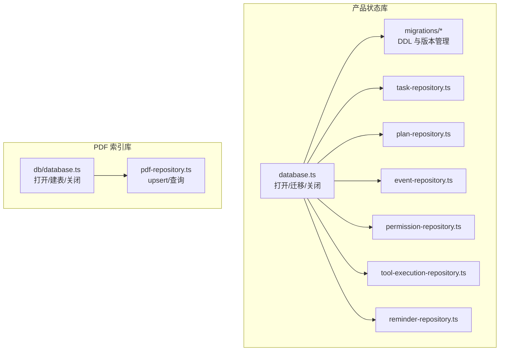
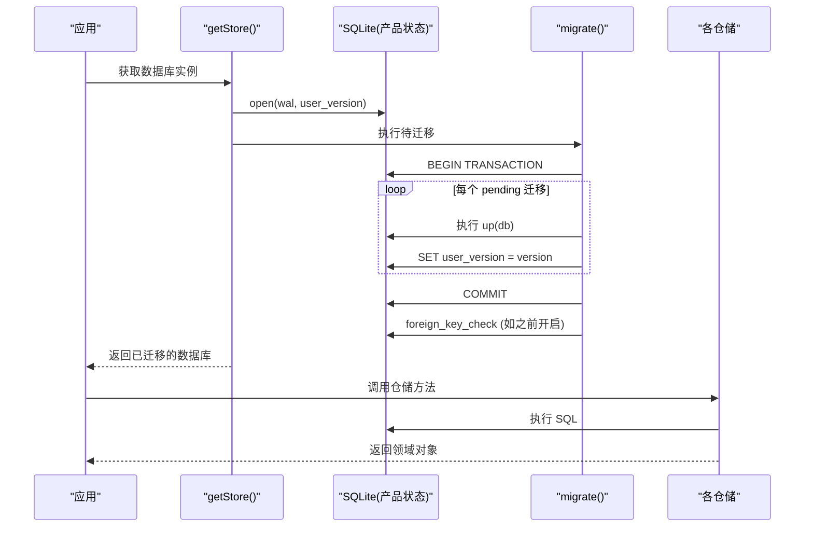
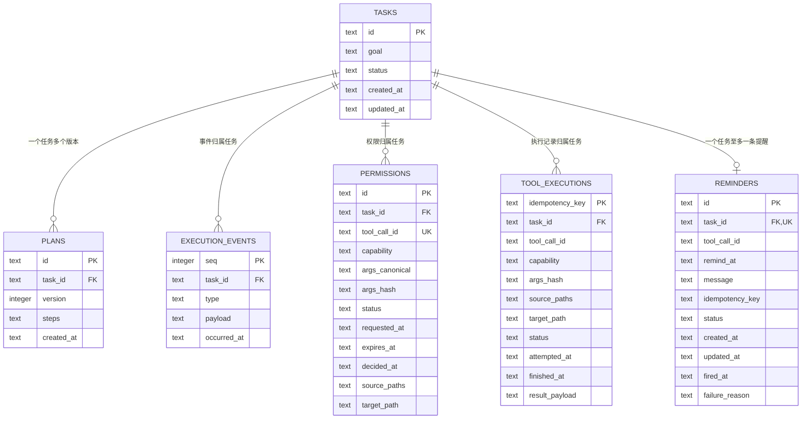
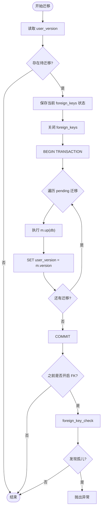
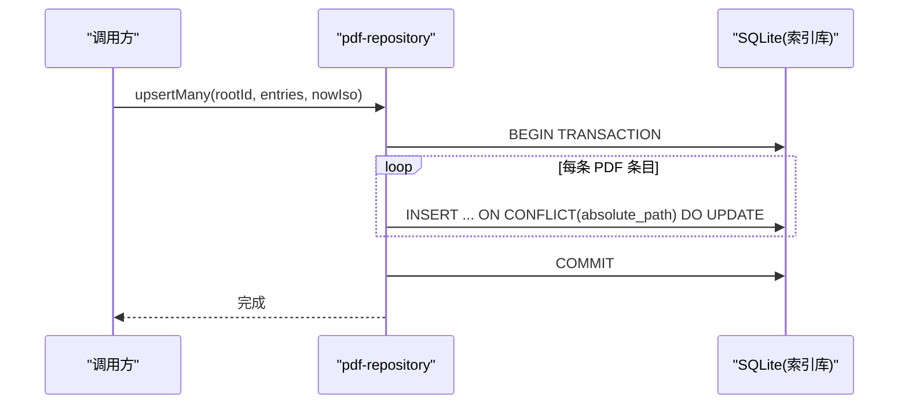
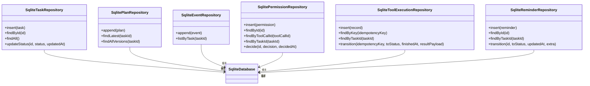
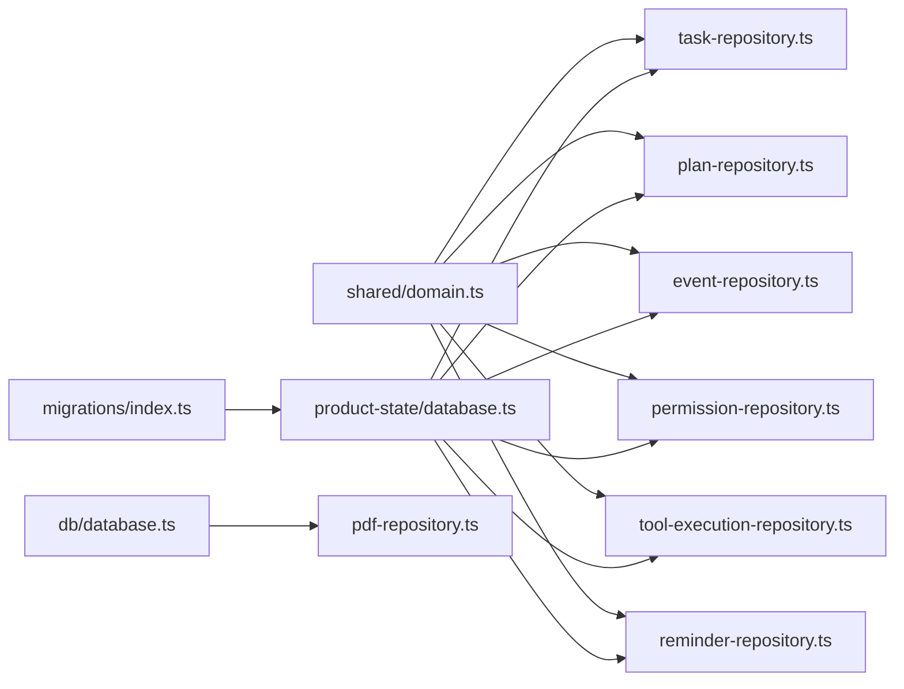
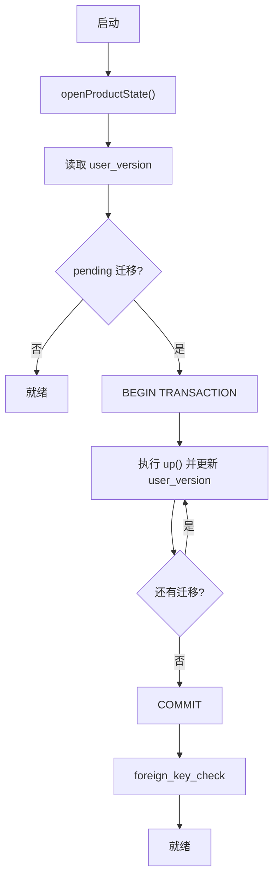

# 数据库设计

<cite>
**本文引用的文件**
- [apps/desktop/src/main/db/database.ts](file://apps/desktop/src/main/db/database.ts)
- [apps/desktop/src/main/product-state/database.ts](file://apps/desktop/src/main/product-state/database.ts)
- [apps/desktop/src/main/product-state/migrations/index.ts](file://apps/desktop/src/main/product-state/migrations/index.ts)
- [apps/desktop/src/main/product-state/migrations/0001-create-tasks.ts](file://apps/desktop/src/main/product-state/migrations/0001-create-tasks.ts)
- [apps/desktop/src/main/product-state/migrations/0002-create-plans.ts](file://apps/desktop/src/main/product-state/migrations/0002-create-plans.ts)
- [apps/desktop/src/main/product-state/migrations/0003-create-execution-events.ts](file://apps/desktop/src/main/product-state/migrations/0003-create-execution-events.ts)
- [apps/desktop/src/main/product-state/migrations/0004-create-permissions.ts](file://apps/desktop/src/main/product-state/migrations/0004-create-permissions.ts)
- [apps/desktop/src/main/product-state/migrations/0005-widen-task-status-check.ts](file://apps/desktop/src/main/product-state/migrations/0005-widen-task-status-check.ts)
- [apps/desktop/src/main/product-state/migrations/0006-create-tool-executions.ts](file://apps/desktop/src/main/product-state/migrations/0006-create-tool-executions.ts)
- [apps/desktop/src/main/product-state/migrations/0007-create-reminders.ts](file://apps/desktop/src/main/product-state/migrations/0007-create-reminders.ts)
- [apps/desktop/src/main/product-state/task-repository.ts](file://apps/desktop/src/main/product-state/task-repository.ts)
- [apps/desktop/src/main/product-state/plan-repository.ts](file://apps/desktop/src/main/product-state/plan-repository.ts)
- [apps/desktop/src/main/product-state/event-repository.ts](file://apps/desktop/src/main/product-state/event-repository.ts)
- [apps/desktop/src/main/product-state/permission-repository.ts](file://apps/desktop/src/main/product-state/permission-repository.ts)
- [apps/desktop/src/main/product-state/tool-execution-repository.ts](file://apps/desktop/src/main/product-state/tool-execution-repository.ts)
- [apps/desktop/src/main/product-state/reminder-repository.ts](file://apps/desktop/src/main/product-state/reminder-repository.ts)
- [apps/desktop/src/main/db/pdf-repository.ts](file://apps/desktop/src/main/db/pdf-repository.ts)
- [apps/desktop/src/shared/domain.ts](file://apps/desktop/src/shared/domain.ts)
</cite>

## 目录
1. [简介](#简介)
2. [项目结构](#项目结构)
3. [核心组件](#核心组件)
4. [架构总览](#架构总览)
5. [详细组件分析](#详细组件分析)
6. [依赖关系分析](#依赖关系分析)
7. [性能考量](#性能考量)
8. [故障排查指南](#故障排查指南)
9. [结论](#结论)
10. [附录](#附录)

## 简介
本文件面向本项目中的 SQLite 数据库设计与实现，覆盖两个独立数据库：
- 产品状态库（product-state.db）：持久化任务、计划、执行事件与权限等核心业务数据。
- PDF 索引库（personal-agent.db）：用于索引本地 PDF 文件元数据，支持增量更新与查询。

文档重点包括：表结构与字段定义、数据类型选择、外键与完整性约束、WAL 日志模式与 PRAGMA 配置、连接管理与事务机制、初始化流程与最佳实践，并提供 ER 图与关键流程图。

## 项目结构
- 产品状态库位于 product-state 模块，采用迁移脚本驱动版本演进，并通过 Repository 层封装 SQL。
- PDF 索引库位于 db 模块，提供简单的建表与 upsert/查询能力。
- 共享领域类型在 shared/domain.ts 中统一定义，Repository 层据此映射行记录。

图表来源
- [apps/desktop/src/main/product-state/database.ts:17-93](file://apps/desktop/src/main/product-state/database.ts#L17-L93)
- [apps/desktop/src/main/product-state/migrations/index.ts:12-20](file://apps/desktop/src/main/product-state/migrations/index.ts#L12-L20)
- [apps/desktop/src/main/product-state/tool-execution-repository.ts:124-166](file://apps/desktop/src/main/product-state/tool-execution-repository.ts#L124-L166)
- [apps/desktop/src/main/product-state/reminder-repository.ts:123-170](file://apps/desktop/src/main/product-state/reminder-repository.ts#L123-L170)
- [apps/desktop/src/main/db/database.ts:27-40](file://apps/desktop/src/main/db/database.ts#L27-L40)
- [apps/desktop/src/main/db/pdf-repository.ts:32-53](file://apps/desktop/src/main/db/pdf-repository.ts#L32-L53)

章节来源
- [apps/desktop/src/main/product-state/database.ts:17-93](file://apps/desktop/src/main/product-state/database.ts#L17-L93)
- [apps/desktop/src/main/db/database.ts:27-40](file://apps/desktop/src/main/db/database.ts#L27-L40)

## 核心组件
- 数据库连接与生命周期管理
  - 产品状态库：openProductState 设置 WAL；getStore 懒加载并自动迁移；closeStore 安全关闭。
  - PDF 索引库：openDatabase 设置 WAL；getDb 懒加载；closeDb 安全关闭。
- 迁移系统
  - MIGRATIONS 注册表按版本号顺序执行；迁移内使用事务保证一致性；迁移后校验外键完整性。
- 仓储层（Repository）
  - Task/Plan/Event/Permission/ToolExecution/Reminder 六个仓储分别封装 CRUD，负责 JSON 序列化/反序列化与状态机校验。
- 共享领域模型
  - 统一的任务状态、权限决策、计划步骤等类型，确保跨层一致。

章节来源
- [apps/desktop/src/main/product-state/database.ts:17-93](file://apps/desktop/src/main/product-state/database.ts#L17-L93)
- [apps/desktop/src/main/db/database.ts:27-40](file://apps/desktop/src/main/db/database.ts#L27-L40)
- [apps/desktop/src/main/product-state/migrations/index.ts:12-20](file://apps/desktop/src/main/product-state/migrations/index.ts#L12-L20)
- [apps/desktop/src/main/product-state/task-repository.ts:13-36](file://apps/desktop/src/main/product-state/task-repository.ts#L13-L36)
- [apps/desktop/src/main/product-state/plan-repository.ts:62-74](file://apps/desktop/src/main/product-state/plan-repository.ts#L62-L74)
- [apps/desktop/src/main/product-state/event-repository.ts:54-62](file://apps/desktop/src/main/product-state/event-repository.ts#L54-L62)
- [apps/desktop/src/main/product-state/permission-repository.ts:117-130](file://apps/desktop/src/main/product-state/permission-repository.ts#L117-L130)
- [apps/desktop/src/main/product-state/tool-execution-repository.ts:92-166](file://apps/desktop/src/main/product-state/tool-execution-repository.ts#L92-L166)
- [apps/desktop/src/main/product-state/reminder-repository.ts:90-170](file://apps/desktop/src/main/product-state/reminder-repository.ts#L90-L170)
- [apps/desktop/src/shared/domain.ts:1-158](file://apps/desktop/src/shared/domain.ts#L1-L158)

## 架构总览
整体采用“连接管理 + 迁移 + 仓储”的分层设计：
- 连接层：负责 WAL 开启、目录创建、用户版本读取与恢复。
- 迁移层：以幂等的 up 函数推进 schema 版本，并在事务中批量应用。
- 仓储层：将领域对象与数据库行映射，处理 JSON 字段与状态机约束。

图表来源
- [apps/desktop/src/main/product-state/database.ts:42-83](file://apps/desktop/src/main/product-state/database.ts#L42-L83)
- [apps/desktop/src/main/product-state/migrations/index.ts:12-20](file://apps/desktop/src/main/product-state/migrations/index.ts#L12-L20)

## 详细组件分析

### 产品状态库：表结构与 ER 关系
- tasks：任务主表，包含 id、goal、status、created_at、updated_at。status 受 CHECK 约束，后续通过迁移扩展了状态集合。
- plans：计划表，包含 id、task_id、version、steps、created_at。task_id 外键关联 tasks(id)，且对 (task_id, version) 有唯一约束，实现“一任务多版本计划”。
- execution_events：执行事件表，seq 自增主键，task_id 外键关联 tasks(id)。追加只写，禁止 UPDATE/DELETE（触发器保护）。
- permissions：权限表，包含 id、task_id、tool_call_id、capability、args_canonical、args_hash、status、requested_at、expires_at、decided_at、source_paths、target_path。tool_call_id 唯一，限制一次工具调用仅一次授权机会。
- tool_executions：工具执行幂等记录表（migration 0006），以 idempotency_key 为主键，task_id 外键关联 tasks(id)。status 受 CHECK 约束限定为 attempting/succeeded/failed；索引 idx_tool_executions_task(task_id, attempted_at) 供启动恢复扫描按任务捞遗留的 attempting 记录。
- reminders：提醒表（migration 0007），id 主键，task_id 外键关联 tasks(id) 且带 UNIQUE——「同一 Task 至多一条 Reminder」由数据库级保证。status 受 CHECK 约束限定为 scheduled/firing/fired/failed；索引 idx_reminders_due(status, remind_at) 为到期扫描预留，当前未被使用——启动恢复（TASK-025）走 findAll 全表扫描，因为 fired/failed 也要进处置报告。idempotency_key 故意不设 UNIQUE：key = capability:argsHash 不含 taskId，两个不同任务参数恰好相同时 key 相等，但那不算重复 Reminder。

图表来源
- [apps/desktop/src/main/product-state/migrations/0001-create-tasks.ts:10-18](file://apps/desktop/src/main/product-state/migrations/0001-create-tasks.ts#L10-L18)
- [apps/desktop/src/main/product-state/migrations/0002-create-plans.ts:3-12](file://apps/desktop/src/main/product-state/migrations/0002-create-plans.ts#L3-L12)
- [apps/desktop/src/main/product-state/migrations/0003-create-execution-events.ts:3-15](file://apps/desktop/src/main/product-state/migrations/0003-create-execution-events.ts#L3-L15)
- [apps/desktop/src/main/product-state/migrations/0004-create-permissions.ts:5-28](file://apps/desktop/src/main/product-state/migrations/0004-create-permissions.ts#L5-L28)
- [apps/desktop/src/main/product-state/migrations/0005-widen-task-status-check.ts:3-10](file://apps/desktop/src/main/product-state/migrations/0005-widen-task-status-check.ts#L3-L10)
- [apps/desktop/src/main/product-state/migrations/0006-create-tool-executions.ts:3-22](file://apps/desktop/src/main/product-state/migrations/0006-create-tool-executions.ts#L3-L22)
- [apps/desktop/src/main/product-state/migrations/0007-create-reminders.ts:6-25](file://apps/desktop/src/main/product-state/migrations/0007-create-reminders.ts#L6-L25)

章节来源
- [apps/desktop/src/main/product-state/migrations/0001-create-tasks.ts:10-18](file://apps/desktop/src/main/product-state/migrations/0001-create-tasks.ts#L10-L18)
- [apps/desktop/src/main/product-state/migrations/0002-create-plans.ts:3-12](file://apps/desktop/src/main/product-state/migrations/0002-create-plans.ts#L3-L12)
- [apps/desktop/src/main/product-state/migrations/0003-create-execution-events.ts:3-29](file://apps/desktop/src/main/product-state/migrations/0003-create-execution-events.ts#L3-L29)
- [apps/desktop/src/main/product-state/migrations/0004-create-permissions.ts:5-28](file://apps/desktop/src/main/product-state/migrations/0004-create-permissions.ts#L5-L28)
- [apps/desktop/src/main/product-state/migrations/0005-widen-task-status-check.ts:3-26](file://apps/desktop/src/main/product-state/migrations/0005-widen-task-status-check.ts#L3-L26)
- [apps/desktop/src/main/product-state/migrations/0006-create-tool-executions.ts:3-31](file://apps/desktop/src/main/product-state/migrations/0006-create-tool-executions.ts#L3-L31)
- [apps/desktop/src/main/product-state/migrations/0007-create-reminders.ts:3-34](file://apps/desktop/src/main/product-state/migrations/0007-create-reminders.ts#L3-L34)

### 产品状态库：连接、迁移与事务
- WAL 模式：打开时强制设置 journal_mode=wal；内存库回退为 memory。
- 迁移事务：迁移期间临时关闭外键检查，批量执行 up 并递增 user_version，提交后恢复外键检查并执行 foreign_key_check 验证。
- 幂等与可重入：重复启动不会重复应用已存在的迁移。

图表来源
- [apps/desktop/src/main/product-state/database.ts:42-83](file://apps/desktop/src/main/product-state/database.ts#L42-L83)

章节来源
- [apps/desktop/src/main/product-state/database.ts:17-30](file://apps/desktop/src/main/product-state/database.ts#L17-L30)
- [apps/desktop/src/main/product-state/database.ts:42-83](file://apps/desktop/src/main/product-state/database.ts#L42-L83)

### PDF 索引库：表结构与写入流程
- pdf_files：以 absolute_path 为主键，存储 root_id、name、modified_at、size_bytes、first_seen_at、last_seen_at。
- 写入策略：使用 UPSERT（ON CONFLICT DO UPDATE），按 absolute_path 去重更新最新元数据；批量写入使用事务包装。

图表来源
- [apps/desktop/src/main/db/pdf-repository.ts:15-53](file://apps/desktop/src/main/db/pdf-repository.ts#L15-L53)

章节来源
- [apps/desktop/src/main/db/database.ts:15-40](file://apps/desktop/src/main/db/database.ts#L15-L40)
- [apps/desktop/src/main/db/pdf-repository.ts:15-53](file://apps/desktop/src/main/db/pdf-repository.ts#L15-L53)

### 仓储层：状态机与数据映射
- TaskRepository：维护任务状态转换规则，非法转换抛错；读写任务记录。
- PlanRepository：计算下一版本号并追加计划；JSON 序列化/反序列化 steps。
- EventRepository：追加执行事件，返回自增 seq；按任务列出事件序列。
- PermissionRepository：插入权限请求；根据 tool_call_id 唯一性避免重复授权；决定权限时进行幂等与冲突检测。
- ToolExecutionRepository：执行前写入 attempting 记录、按 idempotency_key 查询、按任务列出执行记录；transition 先经转换表校验再 UPDATE，非法转换抛 IllegalToolExecutionTransition。转换表：attempting→succeeded|failed；succeeded 为终态；failed→attempting（重试）。
- ReminderRepository：写入 scheduled 记录，同一 Task 已有记录时抛 ReminderAlreadyExists；transition 用 COALESCE 做部分字段更新（firedAt/failureReason 给了才写），非法转换抛 IllegalReminderTransition。转换表：scheduled→firing；firing→fired|failed|scheduled（恢复重挂）；fired 为终态；failed→firing（显式重试）。
- 状态机分层原则：DB CHECK 只拦截非法值，合法转换规则由 Repository 层的 ALLOWED_TRANSITIONS 转换表校验；状态枚举以 shared/domain.ts 的 readonly const 数组为单一事实来源，类型经 typeof X[number] 派生。

图表来源
- [apps/desktop/src/main/product-state/task-repository.ts:81-102](file://apps/desktop/src/main/product-state/task-repository.ts#L81-L102)
- [apps/desktop/src/main/product-state/plan-repository.ts:59-85](file://apps/desktop/src/main/product-state/plan-repository.ts#L59-L85)
- [apps/desktop/src/main/product-state/event-repository.ts:52-67](file://apps/desktop/src/main/product-state/event-repository.ts#L52-L67)
- [apps/desktop/src/main/product-state/permission-repository.ts:92-131](file://apps/desktop/src/main/product-state/permission-repository.ts#L92-L131)
- [apps/desktop/src/main/product-state/tool-execution-repository.ts:124-166](file://apps/desktop/src/main/product-state/tool-execution-repository.ts#L124-L166)
- [apps/desktop/src/main/product-state/reminder-repository.ts:123-170](file://apps/desktop/src/main/product-state/reminder-repository.ts#L123-L170)

章节来源
- [apps/desktop/src/main/product-state/task-repository.ts:13-36](file://apps/desktop/src/main/product-state/task-repository.ts#L13-L36)
- [apps/desktop/src/main/product-state/plan-repository.ts:62-74](file://apps/desktop/src/main/product-state/plan-repository.ts#L62-L74)
- [apps/desktop/src/main/product-state/event-repository.ts:54-62](file://apps/desktop/src/main/product-state/event-repository.ts#L54-L62)
- [apps/desktop/src/main/product-state/permission-repository.ts:117-130](file://apps/desktop/src/main/product-state/permission-repository.ts#L117-L130)
- [apps/desktop/src/main/product-state/tool-execution-repository.ts:13-36](file://apps/desktop/src/main/product-state/tool-execution-repository.ts#L13-L36)
- [apps/desktop/src/main/product-state/reminder-repository.ts:13-54](file://apps/desktop/src/main/product-state/reminder-repository.ts#L13-L54)
- [apps/desktop/src/shared/domain.ts:96-158](file://apps/desktop/src/shared/domain.ts#L96-L158)

## 依赖关系分析
- 产品状态库依赖迁移脚本集合，迁移脚本之间无循环依赖，按版本号线性推进。
- 仓储层依赖共享领域类型，保证类型一致性与可读性。
- 两个数据库彼此独立，职责清晰：产品状态库承载业务状态，索引库承载文件元数据。

图表来源
- [apps/desktop/src/shared/domain.ts:1-158](file://apps/desktop/src/shared/domain.ts#L1-L158)
- [apps/desktop/src/main/product-state/migrations/index.ts:12-20](file://apps/desktop/src/main/product-state/migrations/index.ts#L12-L20)
- [apps/desktop/src/main/product-state/database.ts:87-93](file://apps/desktop/src/main/product-state/database.ts#L87-L93)
- [apps/desktop/src/main/db/database.ts:45-50](file://apps/desktop/src/main/db/database.ts#L45-L50)

章节来源
- [apps/desktop/src/main/product-state/migrations/index.ts:12-20](file://apps/desktop/src/main/product-state/migrations/index.ts#L12-L20)
- [apps/desktop/src/shared/domain.ts:1-158](file://apps/desktop/src/shared/domain.ts#L1-L158)

## 性能考量
- WAL 日志模式
  - 产品状态库与 PDF 索引库均在打开时设置 journal_mode=wal（内存库使用 memory），提升并发读性能与崩溃恢复能力。
- 索引与查询
  - execution_events 建立 (task_id, seq) 复合索引，优化按任务时间序查询。
  - permissions 建立 task_id 与 args_hash 索引，加速按任务列表与哈希去重查询。
  - tool_executions 建立 idx_tool_executions_task(task_id, attempted_at) 复合索引，供启动恢复扫描按任务捞遗留的 attempting 记录。
  - reminders 建立 idx_reminders_due(status, remind_at) 复合索引，为到期扫描预留；当前恢复走 findAll 全表扫描，尚未有查询用它。
- 事务与批处理
  - PDF 批量 upsert 使用事务包裹，减少磁盘同步次数。
  - 迁移在单一事务中执行，保证 schema 变更原子性。
- JSON 字段
  - plans.steps、execution_events.payload、permissions.source_paths、tool_executions.source_paths 与 tool_executions.result_payload 以 TEXT 存储 JSON，读写时需序列化/反序列化，注意错误处理。

章节来源
- [apps/desktop/src/main/product-state/database.ts:23-28](file://apps/desktop/src/main/product-state/database.ts#L23-L28)
- [apps/desktop/src/main/db/database.ts:33-38](file://apps/desktop/src/main/db/database.ts#L33-L38)
- [apps/desktop/src/main/product-state/migrations/0003-create-execution-events.ts:13-15](file://apps/desktop/src/main/product-state/migrations/0003-create-execution-events.ts#L13-L15)
- [apps/desktop/src/main/product-state/migrations/0004-create-permissions.ts:22-28](file://apps/desktop/src/main/product-state/migrations/0004-create-permissions.ts#L22-L28)
- [apps/desktop/src/main/product-state/migrations/0006-create-tool-executions.ts:19-22](file://apps/desktop/src/main/product-state/migrations/0006-create-tool-executions.ts#L19-L22)
- [apps/desktop/src/main/product-state/migrations/0007-create-reminders.ts:22-25](file://apps/desktop/src/main/product-state/migrations/0007-create-reminders.ts#L22-L25)
- [apps/desktop/src/main/db/pdf-repository.ts:40-52](file://apps/desktop/src/main/db/pdf-repository.ts#L40-L52)
- [apps/desktop/src/main/product-state/plan-repository.ts:66-73](file://apps/desktop/src/main/product-state/plan-repository.ts#L66-L73)
- [apps/desktop/src/main/product-state/event-repository.ts:54-62](file://apps/desktop/src/main/product-state/event-repository.ts#L54-L62)
- [apps/desktop/src/main/product-state/permission-repository.ts:95-99](file://apps/desktop/src/main/product-state/permission-repository.ts#L95-L99)

## 故障排查指南
- WAL 未生效
  - 现象：journal_mode 实际值与期望不一致。
  - 定位：打开数据库后读取 journal_mode 并与预期比较，若不一致会输出错误日志。
  - 建议：确认进程权限与文件系统支持 WAL；内存库应使用 memory。
- 迁移失败或外键悬空
  - 现象：迁移后检测到孤儿外键。
  - 定位：迁移完成后执行 foreign_key_check，如有结果则抛出异常。
  - 建议：检查迁移脚本的外键引用与数据一致性。
- 非法任务状态转换
  - 现象：尝试从非允许的状态跳转到目标状态。
  - 定位：仓储层在更新前校验 ALLOWED_TRANSITIONS，非法则抛错。
  - 建议：遵循状态机规则，必要时先回到允许的前驱状态。
- 权限重复决定
  - 现象：对已决定的权限再次给出不同结论。
  - 定位：仓储层 detect 非 pending 且结论不同则抛错。
  - 建议：UI 侧幂等处理，相同结论重复调用视为成功。
- 非法执行/提醒状态转换
  - 现象：tool_executions 或 reminders 的 transition 抛出 IllegalToolExecutionTransition / IllegalReminderTransition。
  - 定位：DB CHECK 只拦非法值，转换合法性由各仓储的 ALLOWED_TRANSITIONS 转换表校验；succeeded 与 fired 均为终态，翻到任何状态都非法。
  - 建议：对照转换表检查当前状态；failed 只能通过显式重试翻回 attempting/firing。
- Reminder 重复创建
  - 现象：同一 Task 再次 insert Reminder 抛 ReminderAlreadyExists。
  - 定位：reminders.task_id 的 UNIQUE 约束在数据库级保证「一任务至多一条」，仓储层 insert 前先查并抛领域错误。
  - 建议：上层（executor）捕获后映射为稳定错误码，或按幂等命中处理。
- JSON 解析失败
  - 现象：plans.steps、execution_events.payload、permissions.source_paths 不是合法 JSON。
  - 定位：仓储层解析时捕获异常并附带上下文信息。
  - 建议：写入前严格校验 JSON 格式，或在迁移中修复脏数据。

章节来源
- [apps/desktop/src/main/product-state/database.ts:23-28](file://apps/desktop/src/main/product-state/database.ts#L23-L28)
- [apps/desktop/src/main/product-state/database.ts:75-80](file://apps/desktop/src/main/product-state/database.ts#L75-L80)
- [apps/desktop/src/main/product-state/task-repository.ts:32-36](file://apps/desktop/src/main/product-state/task-repository.ts#L32-L36)
- [apps/desktop/src/main/product-state/permission-repository.ts:117-130](file://apps/desktop/src/main/product-state/permission-repository.ts#L117-L130)
- [apps/desktop/src/main/product-state/plan-repository.ts:26-42](file://apps/desktop/src/main/product-state/plan-repository.ts#L26-L42)
- [apps/desktop/src/main/product-state/event-repository.ts:23-39](file://apps/desktop/src/main/product-state/event-repository.ts#L23-L39)
- [apps/desktop/src/main/product-state/permission-repository.ts:55-79](file://apps/desktop/src/main/product-state/permission-repository.ts#L55-L79)
- [apps/desktop/src/main/product-state/tool-execution-repository.ts:13-36](file://apps/desktop/src/main/product-state/tool-execution-repository.ts#L13-L36)
- [apps/desktop/src/main/product-state/reminder-repository.ts:13-54](file://apps/desktop/src/main/product-state/reminder-repository.ts#L13-L54)

## 结论
本项目采用清晰的 SQLite 数据库分层设计：WAL 提升性能与可靠性；迁移系统保障 schema 演进的可控与可回滚；仓储层封装领域语义与约束，降低上层复杂度。通过外键、CHECK、UNIQUE 与触发器等多重约束，结合事务与索引，实现了高内聚、低耦合的数据访问方案。建议在新增功能时优先通过迁移扩展，保持仓储层的类型安全与业务规则集中。

## 附录

### 数据库初始化流程（产品状态库）
- 打开数据库并设置 WAL。
- 读取 user_version，筛选 pending 迁移。
- 在事务中依次执行 up 并递增 user_version。
- 恢复外键检查并执行完整性校验。
- 暴露 getStore/closeStore 供上层使用。

图表来源
- [apps/desktop/src/main/product-state/database.ts:17-30](file://apps/desktop/src/main/product-state/database.ts#L17-L30)
- [apps/desktop/src/main/product-state/database.ts:42-83](file://apps/desktop/src/main/product-state/database.ts#L42-L83)

章节来源
- [apps/desktop/src/main/product-state/database.ts:17-30](file://apps/desktop/src/main/product-state/database.ts#L17-L30)
- [apps/desktop/src/main/product-state/database.ts:42-83](file://apps/desktop/src/main/product-state/database.ts#L42-L83)

### 最佳实践建议
- 始终通过迁移脚本修改 schema，避免手工 ALTER。
- 对频繁查询的列建立合适索引（如 task_id、seq、args_hash）。
- 对复杂 JSON 字段在写入前做校验，并在仓储层提供健壮的错误信息。
- 使用事务聚合多次写入，减少 I/O 开销。
- 对外部不可信输入进行白名单校验（如状态枚举、权限决策）。
- 定期备份 WAL 模式下的数据库文件，确保一致性。

[本节为通用指导，不直接分析具体文件]