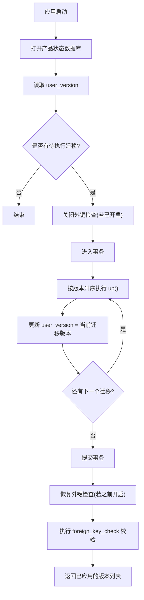
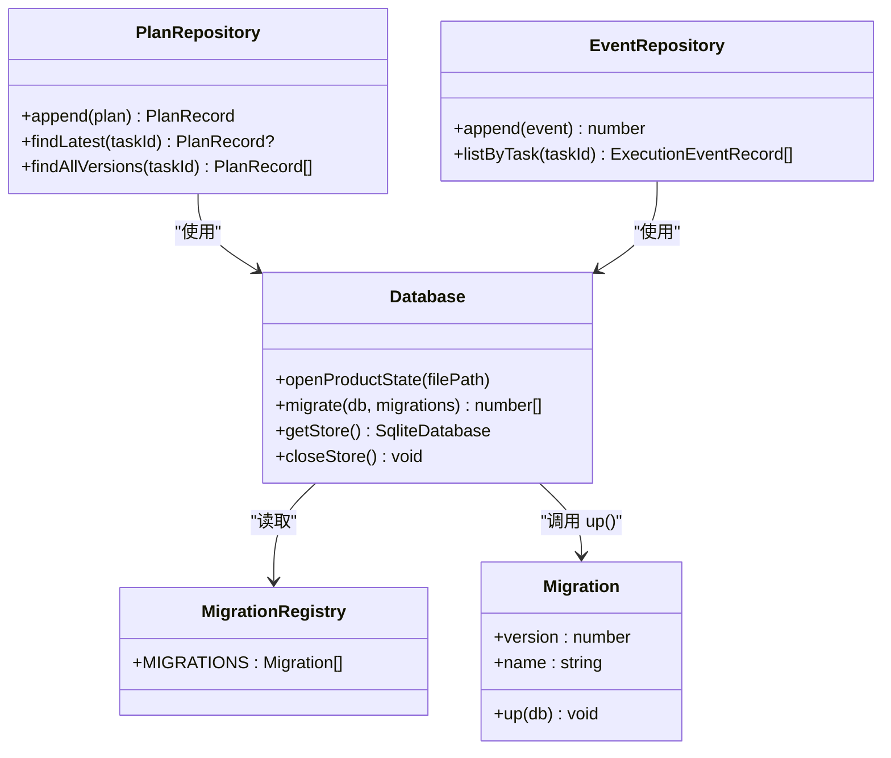
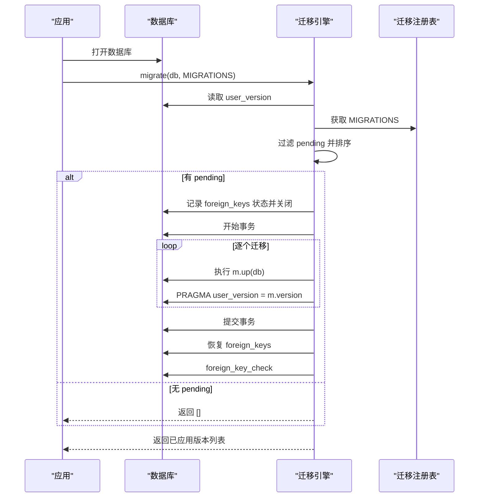
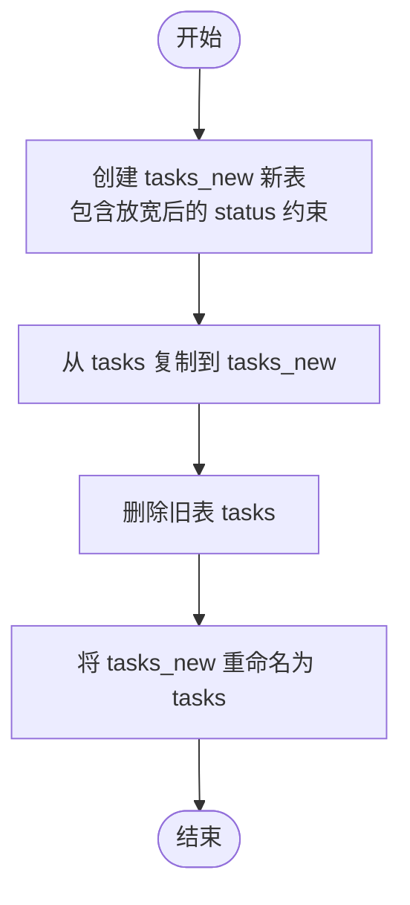
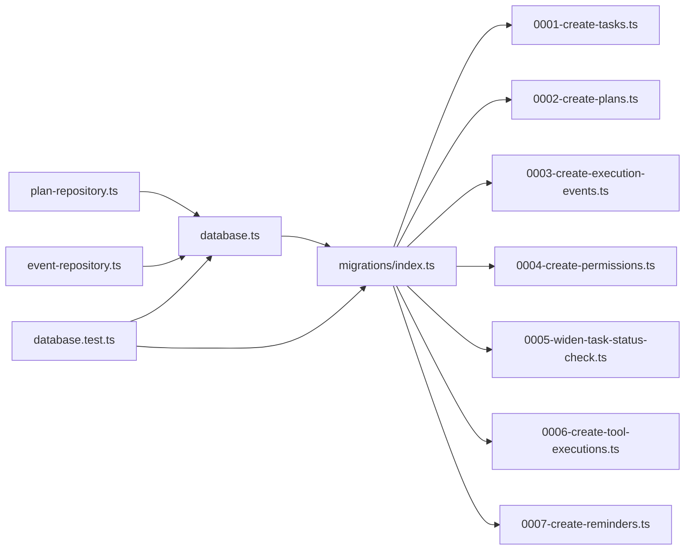

# 数据迁移

<cite>
**本文引用的文件**
- [apps/desktop/src/main/product-state/database.ts](file://apps/desktop/src/main/product-state/database.ts)
- [apps/desktop/src/main/product-state/migrations/index.ts](file://apps/desktop/src/main/product-state/migrations/index.ts)
- [apps/desktop/src/main/product-state/migrations/0001-create-tasks.ts](file://apps/desktop/src/main/product-state/migrations/0001-create-tasks.ts)
- [apps/desktop/src/main/product-state/migrations/0002-create-plans.ts](file://apps/desktop/src/main/product-state/migrations/0002-create-plans.ts)
- [apps/desktop/src/main/product-state/migrations/0003-create-execution-events.ts](file://apps/desktop/src/main/product-state/migrations/0003-create-execution-events.ts)
- [apps/desktop/src/main/product-state/migrations/0004-create-permissions.ts](file://apps/desktop/src/main/product-state/migrations/0004-create-permissions.ts)
- [apps/desktop/src/main/product-state/migrations/0005-widen-task-status-check.ts](file://apps/desktop/src/main/product-state/migrations/0005-widen-task-status-check.ts)
- [apps/desktop/src/main/product-state/migrations/0006-create-tool-executions.ts](file://apps/desktop/src/main/product-state/migrations/0006-create-tool-executions.ts)
- [apps/desktop/src/main/product-state/migrations/0007-create-reminders.ts](file://apps/desktop/src/main/product-state/migrations/0007-create-reminders.ts)
- [apps/desktop/src/main/product-state/database.test.ts](file://apps/desktop/src/main/product-state/database.test.ts)
- [apps/desktop/src/main/product-state/plan-repository.ts](file://apps/desktop/src/main/product-state/plan-repository.ts)
- [apps/desktop/src/main/product-state/event-repository.ts](file://apps/desktop/src/main/product-state/event-repository.ts)
</cite>

## 目录
1. [简介](#简介)
2. [项目结构](#项目结构)
3. [核心组件](#核心组件)
4. [架构总览](#架构总览)
5. [详细组件分析](#详细组件分析)
6. [依赖关系分析](#依赖关系分析)
7. [性能与并发特性](#性能与并发特性)
8. [故障恢复与调试指南](#故障恢复与调试指南)
9. [结论](#结论)
10. [附录：迁移脚本编写规范与最佳实践](#附录：迁移脚本编写规范与最佳实践)

## 简介
本系统为桌面端应用的产品状态数据库提供基于 SQLite 的数据迁移能力。通过版本化的迁移脚本，将数据库从当前 user_version 推进到最新版本；在迁移过程中采用事务、外键开关控制与迁移后校验，确保一致性、可回滚性与数据完整性。同时，系统对执行事件表采用“仅追加”约束，并通过 CHECK 约束与索引强化状态机与查询性能。

## 项目结构
- 迁移注册中心：集中声明所有迁移及其顺序，供迁移器按序执行。
- 迁移引擎：负责读取当前 user_version、筛选待执行迁移、在事务中依次执行 up、更新 user_version，并在必要时关闭/开启外键检查与最终校验。
- 迁移脚本：每个脚本定义一个 version、name 与 up(db) 函数，描述一次增量变更（建表、加列、重建表等）。
- 仓库层：PlanRepository 与 EventRepository 封装业务表的读写，配合迁移后的 schema 使用。

图表来源
- [apps/desktop/src/main/product-state/database.ts:42-83](file://apps/desktop/src/main/product-state/database.ts#L42-L83)
- [apps/desktop/src/main/product-state/migrations/index.ts:12-20](file://apps/desktop/src/main/product-state/migrations/index.ts#L12-L20)

章节来源
- [apps/desktop/src/main/product-state/database.ts:17-101](file://apps/desktop/src/main/product-state/database.ts#L17-L101)
- [apps/desktop/src/main/product-state/migrations/index.ts:1-21](file://apps/desktop/src/main/product-state/migrations/index.ts#L1-L21)

## 核心组件
- 迁移接口与注册表
  - Migration 接口：包含 version、name、up(db)。
  - MIGRATIONS 数组：按版本号升序注册全部迁移，当前共 7 条（0001~0007）。
- 迁移引擎 migrate
  - 去重校验：迁移版本必须唯一。
  - 版本推进：根据 user_version 计算 pending 列表并排序。
  - 事务执行：将所有 up 与 user_version 更新包裹在同一事务中，失败整体回滚。
  - 外键安全：迁移期间临时关闭外键检查，结束后恢复并执行外键校验，发现悬空引用即报错。
- 数据库连接与存储
  - openProductState：创建或打开数据库，设置 WAL/memory journal 模式。
  - getStore/closeStore：单例化本地文件数据库并自动触发迁移。

章节来源
- [apps/desktop/src/main/product-state/migrations/0001-create-tasks.ts:3-7](file://apps/desktop/src/main/product-state/migrations/0001-create-tasks.ts#L3-L7)
- [apps/desktop/src/main/product-state/migrations/index.ts:1-21](file://apps/desktop/src/main/product-state/migrations/index.ts#L1-L21)
- [apps/desktop/src/main/product-state/database.ts:17-101](file://apps/desktop/src/main/product-state/database.ts#L17-L101)

## 架构总览

图表来源
- [apps/desktop/src/main/product-state/database.ts:17-101](file://apps/desktop/src/main/product-state/database.ts#L17-L101)
- [apps/desktop/src/main/product-state/migrations/index.ts:1-21](file://apps/desktop/src/main/product-state/migrations/index.ts#L1-L21)
- [apps/desktop/src/main/product-state/plan-repository.ts:59-85](file://apps/desktop/src/main/product-state/plan-repository.ts#L59-L85)
- [apps/desktop/src/main/product-state/event-repository.ts:52-67](file://apps/desktop/src/main/product-state/event-repository.ts#L52-L67)

## 详细组件分析

### 迁移版本管理机制
- 版本标识：每个迁移对象包含 version 与 name，用于识别与日志定位。
- 版本唯一性：迁移注册阶段检测重复 version，避免漏跑或覆盖。
- 版本推进：以数据库 user_version 为准，仅执行大于当前版本的迁移，并按版本升序执行。
- 幂等性：同一库多次运行 migrate，若无待执行迁移则直接返回空数组。

章节来源
- [apps/desktop/src/main/product-state/database.ts:32-51](file://apps/desktop/src/main/product-state/database.ts#L32-L51)
- [apps/desktop/src/main/product-state/migrations/index.ts:12-20](file://apps/desktop/src/main/product-state/migrations/index.ts#L12-L20)

### 迁移执行流程与回滚策略
- 事务边界：所有 up 与 user_version 更新在同一事务内执行，任一异常均整体回滚，保证“要么全量成功，要么完全无影响”。
- 外键开关：迁移前记录 foreign_keys 状态，迁移期间关闭以避免复杂迁移中的暂时性不一致；迁移完成后恢复并执行外键检查，若存在悬空引用则抛出错误。
- 日志与诊断：journal_mode 未生效时会输出告警信息，便于排查环境差异。

图表来源
- [apps/desktop/src/main/product-state/database.ts:42-83](file://apps/desktop/src/main/product-state/database.ts#L42-L83)
- [apps/desktop/src/main/product-state/migrations/index.ts:12-20](file://apps/desktop/src/main/product-state/migrations/index.ts#L12-L20)

章节来源
- [apps/desktop/src/main/product-state/database.ts:42-83](file://apps/desktop/src/main/product-state/database.ts#L42-L83)

### 数据验证与外键检查机制
- 行级约束：
  - tasks.status 使用 CHECK 约束限定合法状态集合，非法值由数据库拒绝。
  - execution_events 通过触发器禁止 UPDATE/DELETE，实现“仅追加”语义。
  - permissions.tool_call_id 设置 UNIQUE，限制工具调用授权次数。
  - tool_executions.status 使用 CHECK 限定 attempting/succeeded/failed；idempotency_key 为主键。CHECK 只拦非法值，合法转换规则在 Repository 层的转换表校验（分层原则）。
  - reminders.status 使用 CHECK 限定 scheduled/firing/fired/failed；task_id 设置 UNIQUE，在数据库级保证「同一 Task 至多一条 Reminder」；idempotency_key 故意不设 UNIQUE（key = capability:argsHash 不含 taskId，不同任务参数相同时 key 相等但不算重复）。
- 外键约束：
  - plans.task_id、execution_events.task_id、permissions.task_id、tool_executions.task_id、reminders.task_id 引用 tasks.id。
  - 迁移期间短暂关闭外键检查，迁移结束后统一校验，防止悬空引用。
- JSON 字段校验：
  - plan.steps 与 event.payload 在读取时进行 JSON.parse，解析失败会抛出明确错误，便于快速定位数据损坏。

章节来源
- [apps/desktop/src/main/product-state/migrations/0001-create-tasks.ts:10-18](file://apps/desktop/src/main/product-state/migrations/0001-create-tasks.ts#L10-L18)
- [apps/desktop/src/main/product-state/migrations/0003-create-execution-events.ts:3-29](file://apps/desktop/src/main/product-state/migrations/0003-create-execution-events.ts#L3-L29)
- [apps/desktop/src/main/product-state/migrations/0004-create-permissions.ts:5-28](file://apps/desktop/src/main/product-state/migrations/0004-create-permissions.ts#L5-L28)
- [apps/desktop/src/main/product-state/migrations/0006-create-tool-executions.ts:3-22](file://apps/desktop/src/main/product-state/migrations/0006-create-tool-executions.ts#L3-L22)
- [apps/desktop/src/main/product-state/migrations/0007-create-reminders.ts:3-25](file://apps/desktop/src/main/product-state/migrations/0007-create-reminders.ts#L3-L25)
- [apps/desktop/src/main/product-state/plan-repository.ts:26-42](file://apps/desktop/src/main/product-state/plan-repository.ts#L26-L42)
- [apps/desktop/src/main/product-state/event-repository.ts:23-39](file://apps/desktop/src/main/product-state/event-repository.ts#L23-L39)
- [apps/desktop/src/main/product-state/database.ts:55-80](file://apps/desktop/src/main/product-state/database.ts#L55-L80)

### 迁移冲突解决与并发安全
- 版本冲突：迁移注册阶段检测重复 version，立即抛错，阻止潜在覆盖。
- 并发安全：
  - 迁移过程使用单一事务，保证原子性。
  - 通过关闭/恢复外键检查的临界区保护，避免中间态破坏引用完整性。
  - 测试覆盖了“中途失败整批回滚”“外键泄漏防护”“重复版本拒绝”等场景。
- 注意：当前实现未引入分布式锁或多进程互斥；在多进程/多实例并发写入同一数据库文件时需额外协调（例如外部锁或队列），否则可能遇到 SQLite 层面的并发限制。

章节来源
- [apps/desktop/src/main/product-state/database.ts:32-83](file://apps/desktop/src/main/product-state/database.ts#L32-L83)
- [apps/desktop/src/main/product-state/database.test.ts:117-145](file://apps/desktop/src/main/product-state/database.test.ts#L117-L145)
- [apps/desktop/src/main/product-state/database.test.ts:244-256](file://apps/desktop/src/main/product-state/database.test.ts#L244-L256)
- [apps/desktop/src/main/product-state/database.test.ts:364-406](file://apps/desktop/src/main/product-state/database.test.ts#L364-L406)

### 迁移脚本示例与演进路径
- 0001：创建 tasks 表，定义基础任务模型与状态约束。
- 0002：创建 plans 表，关联 tasks，维护计划版本与步骤。
- 0003：创建 execution_events 表，建立索引与“仅追加”触发器。
- 0004：创建 permissions 表，增加权限请求与哈希索引。
- 0005：通过“新建-复制-删除-重命名”的方式放宽 tasks.status 的 CHECK 约束，兼容旧数据并保留子表引用。
- 0006：创建 tool_executions 表（幂等保护机制），idempotency_key 主键、task_id 外键、status CHECK（attempting/succeeded/failed），并建立 idx_tool_executions_task(task_id, attempted_at) 索引供启动恢复扫描。
- 0007：创建 reminders 表（Reminder 持久化），id 主键、task_id UNIQUE + 外键、status CHECK（scheduled/firing/fired/failed），并建立 idx_reminders_due(status, remind_at) 到期扫描索引（启动恢复 TASK-025 规划中，当前为预留）。

章节来源
- [apps/desktop/src/main/product-state/migrations/0001-create-tasks.ts:9-26](file://apps/desktop/src/main/product-state/migrations/0001-create-tasks.ts#L9-L26)
- [apps/desktop/src/main/product-state/migrations/0002-create-plans.ts:3-20](file://apps/desktop/src/main/product-state/migrations/0002-create-plans.ts#L3-L20)
- [apps/desktop/src/main/product-state/migrations/0003-create-execution-events.ts:3-38](file://apps/desktop/src/main/product-state/migrations/0003-create-execution-events.ts#L3-L38)
- [apps/desktop/src/main/product-state/migrations/0004-create-permissions.ts:5-38](file://apps/desktop/src/main/product-state/migrations/0004-create-permissions.ts#L5-L38)
- [apps/desktop/src/main/product-state/migrations/0005-widen-task-status-check.ts:3-27](file://apps/desktop/src/main/product-state/migrations/0005-widen-task-status-check.ts#L3-L27)
- [apps/desktop/src/main/product-state/migrations/0006-create-tool-executions.ts:1-31](file://apps/desktop/src/main/product-state/migrations/0006-create-tool-executions.ts#L1-L31)
- [apps/desktop/src/main/product-state/migrations/0007-create-reminders.ts:1-34](file://apps/desktop/src/main/product-state/migrations/0007-create-reminders.ts#L1-L34)

### 关键流程图：任务状态放宽迁移（0005）

图表来源
- [apps/desktop/src/main/product-state/migrations/0005-widen-task-status-check.ts:3-27](file://apps/desktop/src/main/product-state/migrations/0005-widen-task-status-check.ts#L3-L27)

## 依赖关系分析
- database.ts 依赖 migrations/index.ts 提供的 MIGRATIONS 与 Migration 类型。
- 各迁移脚本依赖 Migration 类型定义（来自 0001 迁移文件）。
- 仓库层依赖 database.ts 暴露的 SqliteDatabase 类型与连接。
- 测试文件覆盖迁移行为、约束与仓库读写，作为正确性保障。

图表来源
- [apps/desktop/src/main/product-state/database.ts:1-101](file://apps/desktop/src/main/product-state/database.ts#L1-L101)
- [apps/desktop/src/main/product-state/migrations/index.ts:1-21](file://apps/desktop/src/main/product-state/migrations/index.ts#L1-L21)
- [apps/desktop/src/main/product-state/plan-repository.ts:1-86](file://apps/desktop/src/main/product-state/plan-repository.ts#L1-L86)
- [apps/desktop/src/main/product-state/event-repository.ts:1-68](file://apps/desktop/src/main/product-state/event-repository.ts#L1-L68)
- [apps/desktop/src/main/product-state/database.test.ts:1-408](file://apps/desktop/src/main/product-state/database.test.ts#L1-L408)

章节来源
- [apps/desktop/src/main/product-state/database.ts:1-101](file://apps/desktop/src/main/product-state/database.ts#L1-L101)
- [apps/desktop/src/main/product-state/migrations/index.ts:1-21](file://apps/desktop/src/main/product-state/migrations/index.ts#L1-L21)
- [apps/desktop/src/main/product-state/plan-repository.ts:1-86](file://apps/desktop/src/main/product-state/plan-repository.ts#L1-L86)
- [apps/desktop/src/main/product-state/event-repository.ts:1-68](file://apps/desktop/src/main/product-state/event-repository.ts#L1-L68)
- [apps/desktop/src/main/product-state/database.test.ts:1-408](file://apps/desktop/src/main/product-state/database.test.ts#L1-L408)

## 性能与并发特性
- 持久化与一致性
  - 文件库启用 WAL 模式，内存库使用 memory journal，兼顾性能与可靠性。
  - 迁移事务保证原子性，避免部分应用导致的中间态。
- 索引优化
  - execution_events 针对 (task_id, seq) 建立索引，提升按任务查询效率。
  - permissions 针对 task_id、args_hash 建立索引，支持按任务与参数哈希检索。
  - tool_executions 针对 (task_id, attempted_at) 建立索引（idx_tool_executions_task），供启动恢复扫描按任务捞遗留的 attempting 记录。
  - reminders 针对 (status, remind_at) 建立索引（idx_reminders_due），供到期扫描；启动恢复（TASK-025）尚属规划，当前为预留索引。
- 并发注意事项
  - SQLite 本身对并发写有限制；当前实现未内置分布式锁。多进程/多实例场景建议通过外部协调机制（如文件锁、消息队列）串行化迁移与写操作。
  - 迁移期间短暂关闭外键检查，但通过事务与迁移后校验降低风险；仍应避免高并发下对同一库文件的随机写入。

[本节为通用指导，不直接分析具体文件]

## 故障恢复与调试指南
- 常见错误与定位
  - 迁移失败：由于事务包裹，失败会整体回滚，user_version 不变，不会留下半成品表。可通过测试用例复现并修复迁移脚本后重试。
  - 外键悬空：迁移结束后执行 foreign_key_check，若检测到悬空引用会抛出错误。需检查迁移逻辑是否破坏了引用关系。
  - 非法状态：tasks.status、tool_executions.status、reminders.status 均受 CHECK 约束限制，插入非法值会被数据库拒绝；合法转换规则由各 Repository 层的转换表另行校验，非法转换抛领域错误（IllegalToolExecutionTransition / IllegalReminderTransition）。
  - JSON 解析失败：plan.steps 或 event.payload 非合法 JSON 会在读取时报错，需修正数据或上游写入逻辑。
- 调试建议
  - 使用内存数据库快速验证迁移逻辑与约束。
  - 利用测试用例覆盖边界情况（如中途失败、重复版本、外键泄漏等）。
  - 关注 journal_mode 告警，确认实际生效模式是否符合预期。
- 恢复策略
  - 若迁移失败，修复脚本后重新运行 migrate，因事务回滚，无需手动清理。
  - 对于需要重建表的迁移（如 0005），确保复制逻辑完整且子表引用未被改写。

章节来源
- [apps/desktop/src/main/product-state/database.test.ts:117-145](file://apps/desktop/src/main/product-state/database.test.ts#L117-L145)
- [apps/desktop/src/main/product-state/database.test.ts:147-166](file://apps/desktop/src/main/product-state/database.test.ts#L147-L166)
- [apps/desktop/src/main/product-state/database.test.ts:178-217](file://apps/desktop/src/main/product-state/database.test.ts#L178-L217)
- [apps/desktop/src/main/product-state/database.test.ts:364-406](file://apps/desktop/src/main/product-state/database.test.ts#L364-L406)
- [apps/desktop/src/main/product-state/plan-repository.ts:26-42](file://apps/desktop/src/main/product-state/plan-repository.ts#L26-L42)
- [apps/desktop/src/main/product-state/event-repository.ts:23-39](file://apps/desktop/src/main/product-state/event-repository.ts#L23-L39)

## 结论
该数据迁移系统以简洁清晰的版本化迁移为核心，结合事务、外键开关与迁移后校验，提供了可靠的增量升级能力。通过严格的约束与“仅追加”设计，保障了状态机与审计事件的完整性。建议在多进程环境下配合外部锁机制，以确保并发安全。新增迁移时应遵循规范，优先选择幂等与可回滚的实现方式，并补充相应测试覆盖。

## 附录：迁移脚本编写规范与最佳实践
- 基本规范
  - 每个迁移必须包含唯一的 version、可读的 name 与 up(db) 方法。
  - 迁移应按版本升序注册，不得出现重复 version。
  - 尽量保持幂等：避免重复建表或重复插入导致失败。
- 数据变更策略
  - 增删列：优先使用 ALTER TABLE 添加列；删除列需谨慎，必要时采用“新建-复制-重命名”方案。
  - 变更约束：如放宽 CHECK 约束，采用“新建表-复制-替换”的方式，确保子表引用不被破坏。
  - 数据迁移：在 up 中完成必要的数据转换，并确保事务内完成。
- 性能与可维护性
  - 为高频查询字段建立合适索引（如任务 ID、时间戳、哈希字段）。
  - 对大表变更分批处理，避免长事务阻塞。
  - 在迁移中记录必要的日志或注释，便于后续维护。
- 安全与一致性
  - 谨慎关闭外键检查：仅在必要时短暂关闭，并在迁移后执行外键校验。
  - 对 JSON 字段进行写入前校验，读取时捕获解析异常并给出明确上下文。
- 测试与回归
  - 为新迁移编写单元测试，覆盖正常路径、异常路径与边界条件。
  - 验证 user_version 推进、表结构变化、约束生效与数据完整性。
  - 模拟中途失败场景，确保事务回滚干净。

[本节为通用指导，不直接分析具体文件]