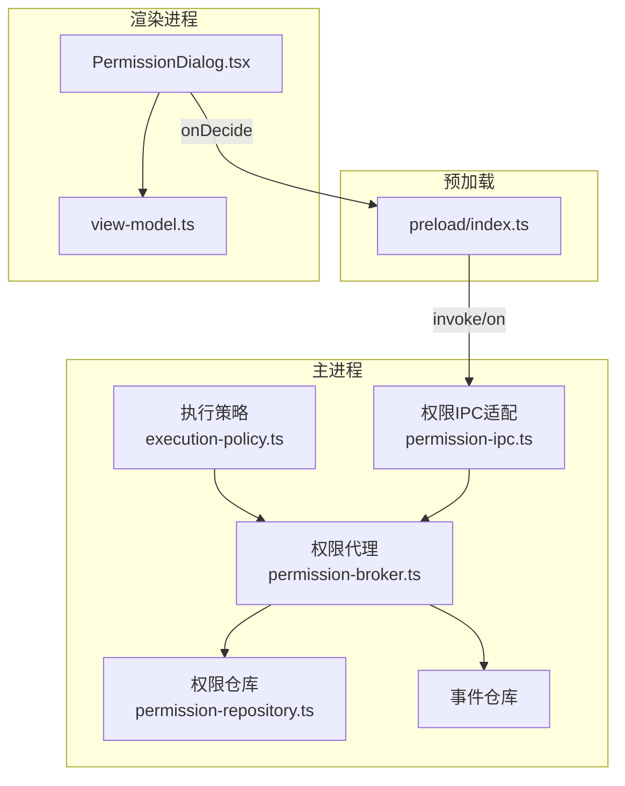
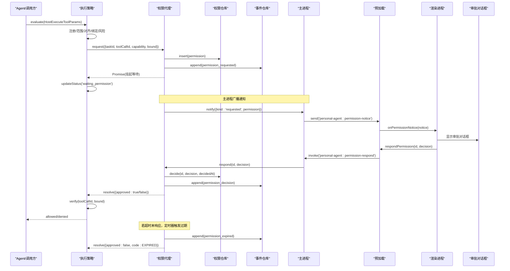
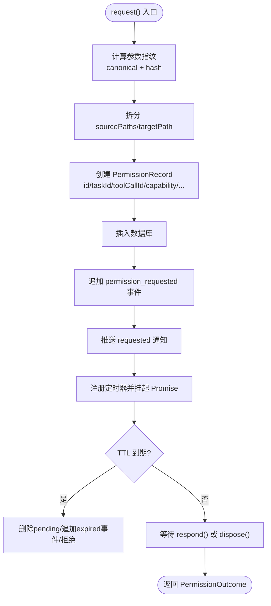
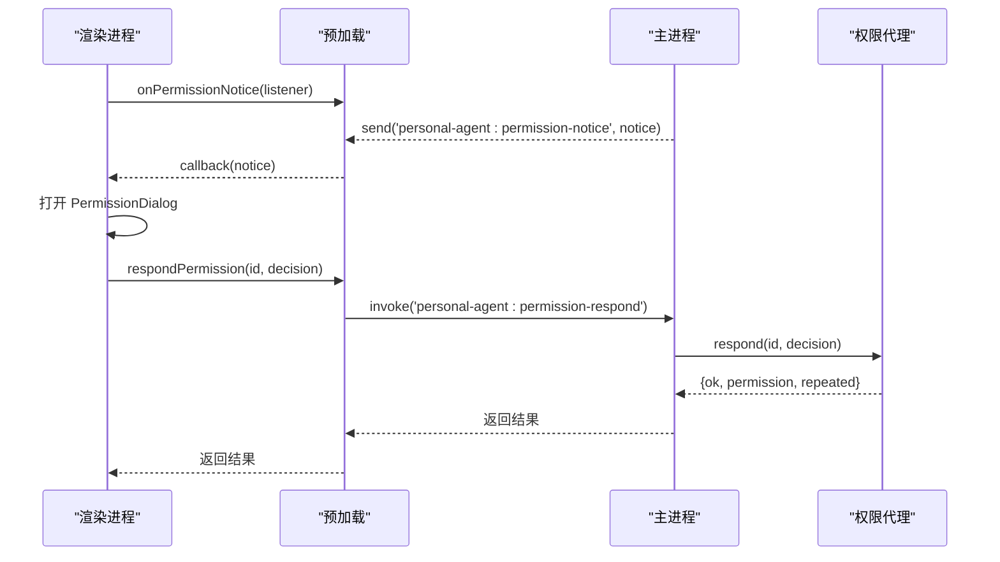
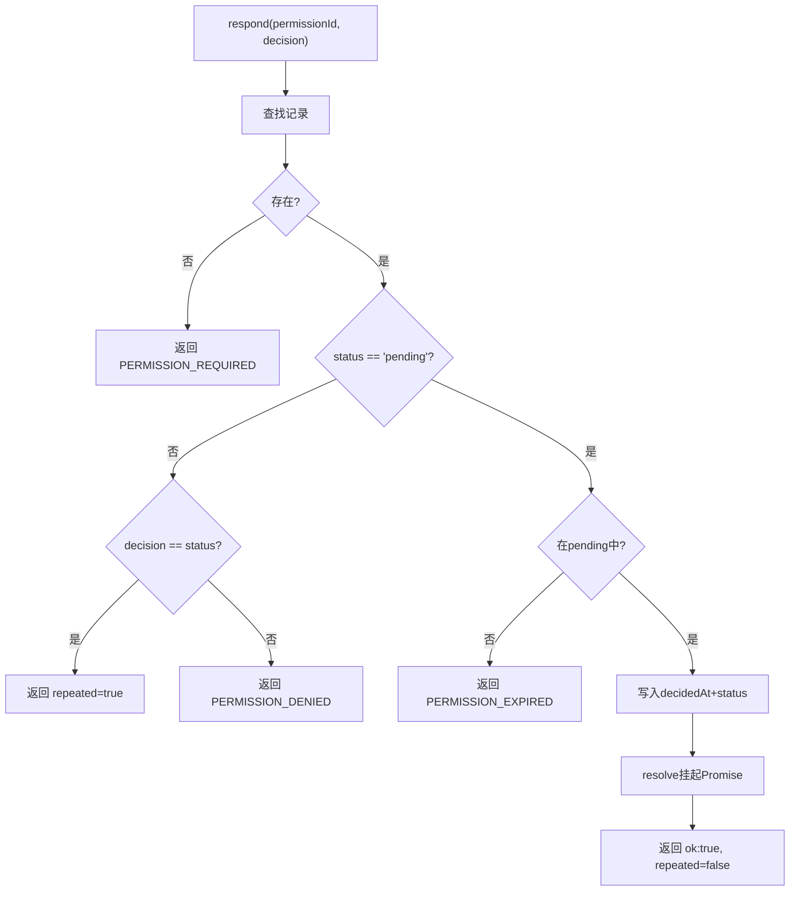
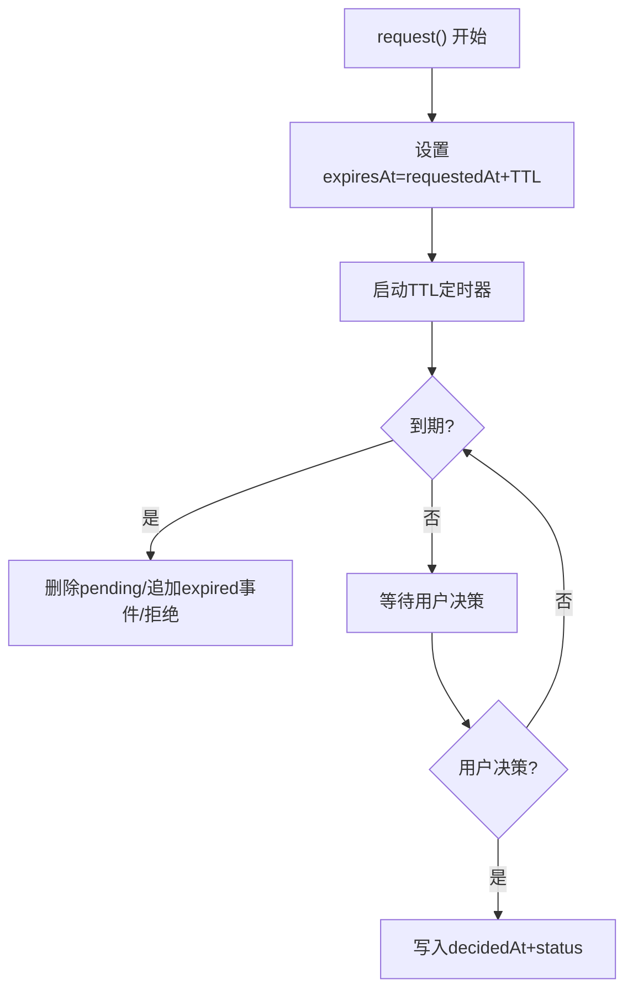
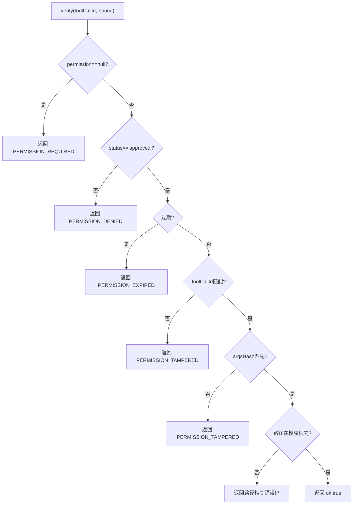
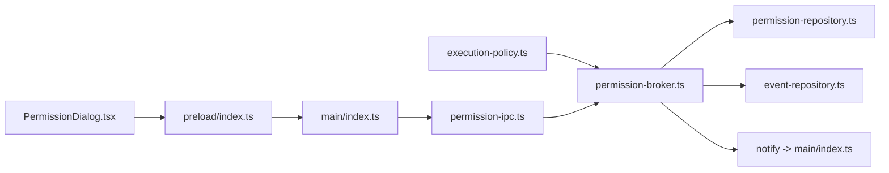

# 审批流程

<cite>
**本文引用的文件**
- [apps/desktop/src/main/permission/permission-broker.ts](file://apps/desktop/src/main/permission/permission-broker.ts)
- [apps/desktop/src/main/permission/permission-ipc.ts](file://apps/desktop/src/main/permission/permission-ipc.ts)
- [apps/desktop/src/main/permission/args-hash.ts](file://apps/desktop/src/main/permission/args-hash.ts)
- [apps/desktop/src/main/permission/expiry.ts](file://apps/desktop/src/main/permission/expiry.ts)
- [apps/desktop/src/main/policy/execution-policy.ts](file://apps/desktop/src/main/policy/execution-policy.ts)
- [apps/desktop/src/main/product-state/permission-repository.ts](file://apps/desktop/src/main/product-state/permission-repository.ts)
- [apps/desktop/src/shared/domain.ts](file://apps/desktop/src/shared/domain.ts)
- [apps/desktop/src/shared/ipc-contract.ts](file://apps/desktop/src/shared/ipc-contract.ts)
- [apps/desktop/src/preload/index.ts](file://apps/desktop/src/preload/index.ts)
- [apps/desktop/src/renderer/src/App.tsx](file://apps/desktop/src/renderer/src/App.tsx)
- [apps/desktop/src/renderer/src/components/PermissionDialog.tsx](file://apps/desktop/src/renderer/src/components/PermissionDialog.tsx)
- [apps/desktop/src/renderer/src/view-model.ts](file://apps/desktop/src/renderer/src/view-model.ts)
- [apps/desktop/src/main/index.ts](file://apps/desktop/src/main/index.ts)
</cite>

## 目录
1. [简介](#简介)
2. [项目结构](#项目结构)
3. [核心组件](#核心组件)
4. [架构总览](#架构总览)
5. [详细组件分析](#详细组件分析)
6. [依赖关系分析](#依赖关系分析)
7. [性能与可靠性](#性能与可靠性)
8. [故障排查指南](#故障排查指南)
9. [结论](#结论)
10. [附录：使用示例与最佳实践](#附录使用示例与最佳实践)

## 简介
本文件系统性说明权限审批的完整生命周期：从工具调用触发、策略评估、创建权限请求、挂起等待用户审批，到最终决策、执行前校验、过期处理与内存清理。文档同时覆盖渲染层对话框交互、IPC 通信、幂等性保证、TTL 超时与自动拒绝、以及调试方法与常见问题。

## 项目结构
审批流程横跨主进程、预加载脚本与渲染进程，涉及策略、权限、持久化与 UI 四个层次：
- 主进程策略层：评估是否需审批，挂起并桥接到权限模块。
- 主进程权限层：创建权限记录、生成参数指纹、设置 TTL、维护挂起等待、推送通知、响应决策、执行前校验。
- 持久化层：SQLite 存储权限记录与事件。
- 渲染层：展示审批对话框、倒计时、提交批准/拒绝。
- IPC 层：主进程与渲染进程之间的命令与事件通道。

图表来源
- [apps/desktop/src/main/policy/execution-policy.ts:88-157](file://apps/desktop/src/main/policy/execution-policy.ts#L88-L157)
- [apps/desktop/src/main/permission/permission-broker.ts:100-257](file://apps/desktop/src/main/permission/permission-broker.ts#L100-L257)
- [apps/desktop/src/main/permission/permission-ipc.ts:44-83](file://apps/desktop/src/main/permission/permission-ipc.ts#L44-L83)
- [apps/desktop/src/main/product-state/permission-repository.ts:95-134](file://apps/desktop/src/main/product-state/permission-repository.ts#L95-L134)
- [apps/desktop/src/preload/index.ts:29-45](file://apps/desktop/src/preload/index.ts#L29-L45)
- [apps/desktop/src/renderer/src/components/PermissionDialog.tsx:167-197](file://apps/desktop/src/renderer/src/components/PermissionDialog.tsx#L167-L197)

章节来源
- [apps/desktop/src/main/index.ts:120-129](file://apps/desktop/src/main/index.ts#L120-L129)
- [apps/desktop/src/main/index.ts:296-321](file://apps/desktop/src/main/index.ts#L296-L321)

## 核心组件
- 执行策略（ExecutionPolicy）：负责八级检查管道，识别是否需要审批；需要时挂起任务状态并委托权限模块。
- 权限代理（PermissionBroker）：创建权限记录、计算参数指纹与过期时间、维护挂起等待、推送通知、响应决策、执行前六步校验。
- 权限IPC适配（PermissionIpc）：对渲染进程传入的参数一律按不可信先收窄——permissionId 必须是非空字符串、decision 必须属于 PERMISSION_DECISIONS（approved|denied），否则返回 PROTOCOL_INVALID_REQUEST；broker.respond 的失败码只放行 PERMISSION_REQUIRED / PERMISSION_DENIED / PERMISSION_EXPIRED / PERMISSION_TAMPERED 四条白名单，白名单之外一律映射为 RUNTIME_DB_FAILED。
- 权限仓库（PermissionRepository）：基于 SQLite 的权限记录增删查改，确保同一 toolCallId 唯一、重复决策幂等。
- 参数指纹（ArgsHash）：规范化参数后生成 canonical JSON 与哈希，用于防篡改与幂等匹配。
- 过期管理（Expiry）：默认 TTL 为 5 分钟，提供过期时间计算与视图状态投影。
- 渲染对话框（PermissionDialog）：展示能力、影响文件（sourcePaths 数量与逐条列表）、目标位置、参数摘要（argsCanonical）、参数指纹（argsHash 前 12 位）、请求时间、过期时间（expiresAt）与剩余时间倒计时，支持批准/拒绝；对 scheduler.create 改为展示解析后的「提醒时间 / 提醒内容」预览。
- 预加载（Preload）：暴露 respondPermission、listPermissions、onPermissionNotice 给渲染进程。
- 领域模型（Domain）：定义任务状态、权限状态、通知类型等共享类型。PermissionNotice 定义在 shared/domain.ts（permission-broker 仅 re-export），两种载荷：kind:'requested' 携带完整 PermissionRecord；kind:'resolved' 携带 permissionId 与投影状态（PermissionViewState，含 expired）。

章节来源
- [apps/desktop/src/main/policy/execution-policy.ts:15-83](file://apps/desktop/src/main/policy/execution-policy.ts#L15-L83)
- [apps/desktop/src/main/permission/permission-broker.ts:27-76](file://apps/desktop/src/main/permission/permission-broker.ts#L27-L76)
- [apps/desktop/src/main/permission/permission-ipc.ts:13-41](file://apps/desktop/src/main/permission/permission-ipc.ts#L13-L41)
- [apps/desktop/src/main/product-state/permission-repository.ts:24-35](file://apps/desktop/src/main/product-state/permission-repository.ts#L24-L35)
- [apps/desktop/src/main/permission/args-hash.ts:6-32](file://apps/desktop/src/main/permission/args-hash.ts#L6-L32)
- [apps/desktop/src/main/permission/expiry.ts:1-26](file://apps/desktop/src/main/permission/expiry.ts#L1-L26)
- [apps/desktop/src/renderer/src/components/PermissionDialog.tsx:15-19](file://apps/desktop/src/renderer/src/components/PermissionDialog.tsx#L15-L19)
- [apps/desktop/src/preload/index.ts:29-45](file://apps/desktop/src/preload/index.ts#L29-L45)
- [apps/desktop/src/shared/domain.ts:52-94](file://apps/desktop/src/shared/domain.ts#L52-L94)

## 架构总览
下图展示了从工具调用到最终决策的端到端时序：

图表来源
- [apps/desktop/src/main/policy/execution-policy.ts:161-196](file://apps/desktop/src/main/policy/execution-policy.ts#L161-L196)
- [apps/desktop/src/main/permission/permission-broker.ts:133-181](file://apps/desktop/src/main/permission/permission-broker.ts#L133-L181)
- [apps/desktop/src/main/permission/permission-broker.ts:183-234](file://apps/desktop/src/main/permission/permission-broker.ts#L183-L234)
- [apps/desktop/src/main/permission/permission-broker.ts:283-327](file://apps/desktop/src/main/permission/permission-broker.ts#L283-L327)
- [apps/desktop/src/main/index.ts:50-54](file://apps/desktop/src/main/index.ts#L50-L54)
- [apps/desktop/src/preload/index.ts:29-45](file://apps/desktop/src/preload/index.ts#L29-L45)

## 详细组件分析

### 权限请求创建与挂起等待
- 创建权限记录：
  - 生成唯一 id、关联 taskId、toolCallId、capability。
  - 通过参数绑定结果计算参数指纹（canonical + hash），写入 argsCanonical、argsHash。
  - 计算 expiresAt = requestedAt + TTL（默认 5 分钟）。
  - 根据 capability 拆分 sourcePaths/targetPath，便于 UI 展示。
  - 落库并追加 permission_requested 事件，推送 requested 通知。
- 挂起等待：
  - 返回 Promise，内部维护 pending Map，键为 permissionId，值为 {resolve, timer}。
  - 启动 TTL 定时器，到期后删除 pending、追加 expired 事件、推送 resolved 通知，并以 PERMISSION_EXPIRED 拒绝。
  - dispose() 在应用退出时清理所有定时器与 pending。

图表来源
- [apps/desktop/src/main/permission/permission-broker.ts:133-181](file://apps/desktop/src/main/permission/permission-broker.ts#L133-L181)
- [apps/desktop/src/main/permission/args-hash.ts:23-32](file://apps/desktop/src/main/permission/args-hash.ts#L23-L32)
- [apps/desktop/src/main/permission/expiry.ts:11-13](file://apps/desktop/src/main/permission/expiry.ts#L11-L13)

章节来源
- [apps/desktop/src/main/permission/permission-broker.ts:100-181](file://apps/desktop/src/main/permission/permission-broker.ts#L100-L181)
- [apps/desktop/src/main/permission/args-hash.ts:1-32](file://apps/desktop/src/main/permission/args-hash.ts#L1-L32)
- [apps/desktop/src/main/permission/expiry.ts:1-26](file://apps/desktop/src/main/permission/expiry.ts#L1-L26)

### 用户审批界面交互
- 通知推送：
  - broker 产出 PermissionNotice 后，主进程通过 broadcastPermissionNotice 向所有窗口广播 personal-agent:permission-notice——这是全应用唯一一个 main → renderer 的推送通道。
  - 预加载监听该事件并把载荷原样转发，渲染进程不做二次解析。
  - App 收到 kind:'requested' 时把完整 PermissionRecord 存入 pendingPermission；收到 kind:'resolved' 时用函数式 setState 按 permissionId 比对当前记录再关面板，避免读到订阅那一刻的闭包旧值。
- 对话框显示：
  - 渲染进程收到 notice 后，打开 PermissionDialog，展示能力、影响文件（sourcePaths 数量与逐条列表）、目标位置（targetPath）、参数摘要（argsCanonical 原文）、参数指纹（argsHash 前 12 位）、请求时间、过期时间（expiresAt 的本地化格式）与剩余时间。
  - scheduler.create 的请求经 describeReminderPreview 从 argsCanonical 解析出 remindAt 与 message，改以「提醒时间 / 提醒内容」两行替代文件路径区——用户在批准前能看见「今晚」被解析成了哪个具体时刻；解析失败则退回文件路径展示。
  - 剩余时间每秒刷新；窗口关闭后只禁用按钮并提示“批准窗口已关闭，等待主进程结算”，不替主进程下结论，过期事件与结算都由 broker 推送。
- 用户操作：
  - 点击“批准”或“拒绝”，调用 onDecide(decision)，经 preload 的 personal-agent:permission-respond 通道调用主进程 respond。
  - 主进程先收窄入参（permissionId 非空字符串、decision 为 approved|denied，否则 PROTOCOL_INVALID_REQUEST），再调用 broker.respond；失败码经四选白名单映射，白名单外收成 DB_FAILED。
  - broker 更新状态、追加决策事件、推送 resolved 通知，并 resolve 挂起的 Promise。
  - 时间线渲染 permission_requested / permission_decision 事件时，view-model 对载荷做类型收窄（sourcePaths 非数组按空处理并过滤非字符串项，capability/decision 缺失时退回默认文案），脏数据不会让事件流崩溃或显示 'undefined'。

图表来源
- [apps/desktop/src/main/index.ts:35-54](file://apps/desktop/src/main/index.ts#L35-L54)
- [apps/desktop/src/preload/index.ts:29-45](file://apps/desktop/src/preload/index.ts#L29-L45)
- [apps/desktop/src/main/permission/permission-ipc.ts:44-68](file://apps/desktop/src/main/permission/permission-ipc.ts#L44-L68)
- [apps/desktop/src/renderer/src/components/PermissionDialog.tsx:52-59](file://apps/desktop/src/renderer/src/components/PermissionDialog.tsx#L52-L59)

章节来源
- [apps/desktop/src/main/index.ts:35-54](file://apps/desktop/src/main/index.ts#L35-L54)
- [apps/desktop/src/preload/index.ts:29-45](file://apps/desktop/src/preload/index.ts#L29-L45)
- [apps/desktop/src/main/permission/permission-ipc.ts:17-32](file://apps/desktop/src/main/permission/permission-ipc.ts#L17-L32)
- [apps/desktop/src/main/permission/permission-ipc.ts:44-83](file://apps/desktop/src/main/permission/permission-ipc.ts#L44-L83)
- [apps/desktop/src/renderer/src/App.tsx:94-133](file://apps/desktop/src/renderer/src/App.tsx#L94-L133)
- [apps/desktop/src/renderer/src/components/PermissionDialog.tsx:31-165](file://apps/desktop/src/renderer/src/components/PermissionDialog.tsx#L31-L165)
- [apps/desktop/src/renderer/src/view-model.ts:215-240](file://apps/desktop/src/renderer/src/view-model.ts#L215-L240)
- [apps/desktop/src/renderer/src/view-model.ts:257-277](file://apps/desktop/src/renderer/src/view-model.ts#L257-L277)
- [apps/desktop/src/shared/domain.ts:86-94](file://apps/desktop/src/shared/domain.ts#L86-L94)

### 重复请求与幂等性
- 同一条权限记录的多次 respond：
  - 若状态已是 pending 且不在 pending Map（已过期结算），返回 PERMISSION_EXPIRED。
  - 若状态已是 approved/denied 且与本次决策一致，返回 repeated=true，无副作用。
  - 若状态已是其他值且与本次决策不同，返回 PERMISSION_DENIED。
- 同一 toolCallId 的唯一性：
  - 仓库按 tool_call_id 建唯一约束，确保一次工具调用仅对应一条权限记录。
- 执行前校验：
  - 再次比对 toolCallId、argsHash 与路径根目录，防止篡改与越权。

图表来源
- [apps/desktop/src/main/permission/permission-broker.ts:183-234](file://apps/desktop/src/main/permission/permission-broker.ts#L183-L234)
- [apps/desktop/src/main/product-state/permission-repository.ts:120-134](file://apps/desktop/src/main/product-state/permission-repository.ts#L120-L134)
- [apps/desktop/src/main/permission/permission-broker.ts:283-327](file://apps/desktop/src/main/permission/permission-broker.ts#L283-L327)

章节来源
- [apps/desktop/src/main/permission/permission-broker.ts:183-234](file://apps/desktop/src/main/permission/permission-broker.ts#L183-L234)
- [apps/desktop/src/main/product-state/permission-repository.ts:120-134](file://apps/desktop/src/main/product-state/permission-repository.ts#L120-L134)

### 权限过期与自动拒绝
- TTL 配置：默认 5 分钟，可通过 deps.ttlMs 注入。
- 过期检测：
  - 创建时计算 expiresAt。
  - 挂起 Promise 时启动定时器，到期后删除 pending、追加 expired 事件、推送 resolved 通知，并以 PERMISSION_EXPIRED 拒绝。
  - 列表查询时通过 permissionState 将 pending + now > expiresAt 投影为 expired。
- 执行前校验：
  - verify 会检查 status 是否为 approved，且当前时间未超过 expiresAt。

图表来源
- [apps/desktop/src/main/permission/permission-broker.ts:133-181](file://apps/desktop/src/main/permission/permission-broker.ts#L133-L181)
- [apps/desktop/src/main/permission/expiry.ts:11-26](file://apps/desktop/src/main/permission/expiry.ts#L11-L26)
- [apps/desktop/src/main/permission/permission-broker.ts:283-327](file://apps/desktop/src/main/permission/permission-broker.ts#L283-L327)

章节来源
- [apps/desktop/src/main/permission/expiry.ts:1-26](file://apps/desktop/src/main/permission/expiry.ts#L1-L26)
- [apps/desktop/src/main/permission/permission-broker.ts:133-181](file://apps/desktop/src/main/permission/permission-broker.ts#L133-L181)

### 执行前六步校验
verify 在执行阶段被调用，确保权限未被篡改且仍在有效期内：
1. 必须存在权限记录。
2. 状态必须为 approved。
3. 未过期。
4. toolCallId 匹配。
5. argsHash 匹配。
6. 路径必须在授权根内（sourcePaths/targetPath）。

图表来源
- [apps/desktop/src/main/permission/permission-broker.ts:283-327](file://apps/desktop/src/main/permission/permission-broker.ts#L283-L327)

章节来源
- [apps/desktop/src/main/permission/permission-broker.ts:283-327](file://apps/desktop/src/main/permission/permission-broker.ts#L283-L327)

### 任务状态与挂起前后切换
- 当风险等级为 PERMISSION_REQUIRED 时，策略将任务状态更新为 waiting_permission。
- 无论批准、拒绝还是过期，finally 块都会尝试恢复为 running，避免任务卡在等待态。

章节来源
- [apps/desktop/src/main/policy/execution-policy.ts:161-196](file://apps/desktop/src/main/policy/execution-policy.ts#L161-L196)

## 依赖关系分析
- 策略依赖权限门（PermissionGate），实现松耦合；测试可替换为模拟实现。
- 权限代理依赖仓库与事件仓库，并通过可选 notify 回调推送到渲染进程。
- 渲染进程通过 preload 暴露的 API 与主进程通信，不直接访问 Node/Electron。
- 领域类型集中在 shared 目录，保证主进程与渲染进程类型一致。

图表来源
- [apps/desktop/src/main/policy/execution-policy.ts:69-83](file://apps/desktop/src/main/policy/execution-policy.ts#L69-L83)
- [apps/desktop/src/main/permission/permission-broker.ts:46-59](file://apps/desktop/src/main/permission/permission-broker.ts#L46-L59)
- [apps/desktop/src/main/index.ts:120-129](file://apps/desktop/src/main/index.ts#L120-L129)
- [apps/desktop/src/main/permission/permission-ipc.ts:13-15](file://apps/desktop/src/main/permission/permission-ipc.ts#L13-L15)
- [apps/desktop/src/preload/index.ts:29-45](file://apps/desktop/src/preload/index.ts#L29-L45)
- [apps/desktop/src/renderer/src/components/PermissionDialog.tsx:167-197](file://apps/desktop/src/renderer/src/components/PermissionDialog.tsx#L167-L197)

章节来源
- [apps/desktop/src/main/policy/execution-policy.ts:69-83](file://apps/desktop/src/main/policy/execution-policy.ts#L69-L83)
- [apps/desktop/src/main/permission/permission-broker.ts:46-59](file://apps/desktop/src/main/permission/permission-broker.ts#L46-L59)
- [apps/desktop/src/main/index.ts:120-129](file://apps/desktop/src/main/index.ts#L120-L129)

## 性能与可靠性
- 挂起等待采用内存 Map + 定时器，O(1) 查找与清理，适合短期审批场景。
- 参数指纹使用 SHA-256 与规范化 JSON，避免参数顺序差异导致的误判。
- 过期时间以毫秒精度计算，UI 每秒刷新倒计时，用户体验友好。
- 应用退出时统一 dispose，避免悬挂定时器导致内存泄漏。
- 策略层在 finally 中恢复任务状态，提高鲁棒性。

[本节为通用指导，不直接分析具体文件]

## 故障排查指南
- 常见错误码与含义：
  - PERMISSION_REQUIRED：未找到权限记录或无需审批却进入审批通道。
  - PERMISSION_DENIED：权限已被拒绝或状态不一致。
  - PERMISSION_EXPIRED：审批窗口已关闭或执行前校验发现过期。
  - PERMISSION_TAMPERED：toolCallId 或 argsHash 不匹配，疑似篡改。
  - PROTOCOL_INVALID_REQUEST：IPC 入参非法（permissionId 为空或 decision 不在 approved|denied 白名单）。
  - DB_FAILED（RUNTIME_DB_FAILED）：数据库不可用或异常。它同时是 permission-ipc 错误码白名单的兜底——broker.respond 返回四条 PERMISSION_* 之外的码一律收成它；启动时 product-state 库没打开、broker 未构造，permission-respond / list-permissions 两个通道也直接返回它（“批准通道未就绪”）。
- 定位步骤：
  - 查看事件流中的 permission_requested / permission_decision / permission_expired 三条事件，确认生命周期。
  - 核对 toolCallId 是否与执行调用一致。
  - 核对 argsHash 是否与执行前重算一致。
  - 检查 sourcePaths/targetPath 是否在授权根内。
  - 检查 TTL 配置与系统时间是否正确。
- 调试建议：
  - 在渲染侧打印 onPermissionNotice 的 payload，确认通知到达。
  - 在 IPC 层捕获并打印入参与错误码。
  - 在策略层打印 waiting_permission 与 running 的状态切换。

章节来源
- [apps/desktop/src/main/permission/permission-ipc.ts:17-32](file://apps/desktop/src/main/permission/permission-ipc.ts#L17-L32)
- [apps/desktop/src/main/permission/permission-broker.ts:183-234](file://apps/desktop/src/main/permission/permission-broker.ts#L183-L234)
- [apps/desktop/src/main/permission/permission-broker.ts:283-327](file://apps/desktop/src/main/permission/permission-broker.ts#L283-L327)
- [apps/desktop/src/main/index.ts:296-321](file://apps/desktop/src/main/index.ts#L296-L321)
- [apps/desktop/src/renderer/src/view-model.ts:60-71](file://apps/desktop/src/renderer/src/view-model.ts#L60-L71)

## 结论
本审批流程通过策略层与权限层的解耦设计，实现了安全、可审计、可配置的权限控制。参数指纹与执行前校验保障了幂等性与防篡改；TTL 与自动拒绝避免了资源长期占用；IPC 与渲染层交互提供了直观的用户审批体验。整体架构清晰、职责明确，易于扩展与维护。

[本节为总结，不直接分析具体文件]

## 附录：使用示例与最佳实践

- 自定义审批界面
  - 订阅 onPermissionNotice，获取 PermissionRecord，渲染自定义对话框；组件卸载时必须调用返回的取消订阅函数。
  - 在用户确认后调用 respondPermission(permissionId, decision)。
  - 处理 resolved 通知时用函数式 setState 按 permissionId 比对，直接读订阅时刻的 state 会拿到闭包旧值。
  - 参考 PermissionDialog 的剩余时间计算与禁用逻辑。

- 处理审批回调
  - 根据 respond 返回的 repeated 字段判断是否重复提交。
  - 根据 ok 与 code 区分成功、过期、拒绝等分支。

- 管理权限会话
  - 使用 listPermissions(taskId) 观察任务的所有权限记录及其投影状态。
  - 结合事件流中的 permission_* 事件构建时间线。

- 最佳实践
  - 始终在 finally 中恢复任务状态，避免卡死。
  - 合理设置 TTL，平衡用户体验与安全。
  - 对路径进行根限制，避免越权访问。
  - 对 IPC 入参做严格校验，防止恶意输入。

章节来源
- [apps/desktop/src/preload/index.ts:29-45](file://apps/desktop/src/preload/index.ts#L29-L45)
- [apps/desktop/src/main/permission/permission-ipc.ts:44-83](file://apps/desktop/src/main/permission/permission-ipc.ts#L44-L83)
- [apps/desktop/src/renderer/src/App.tsx:94-108](file://apps/desktop/src/renderer/src/App.tsx#L94-L108)
- [apps/desktop/src/renderer/src/components/PermissionDialog.tsx:31-165](file://apps/desktop/src/renderer/src/components/PermissionDialog.tsx#L31-L165)
- [apps/desktop/src/main/policy/execution-policy.ts:161-196](file://apps/desktop/src/main/policy/execution-policy.ts#L161-L196)