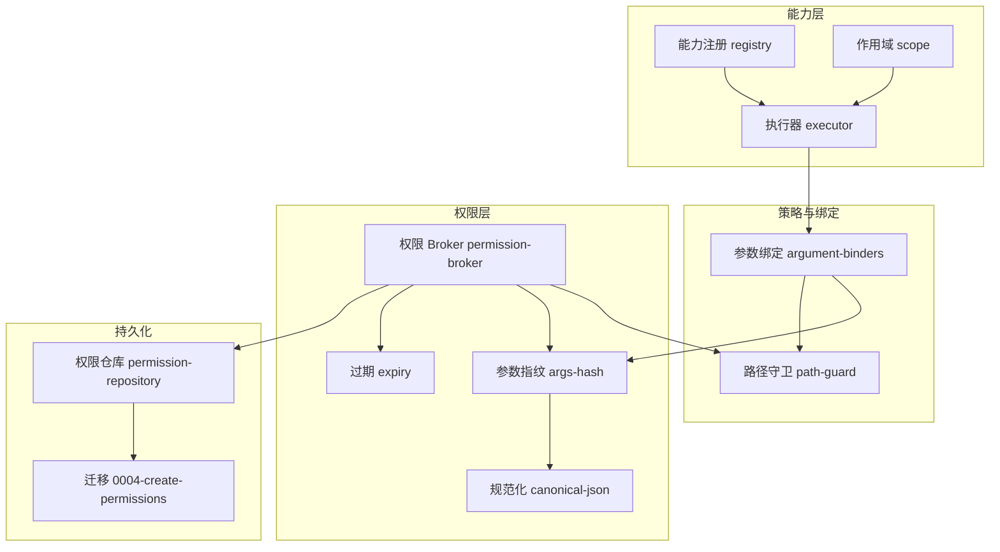
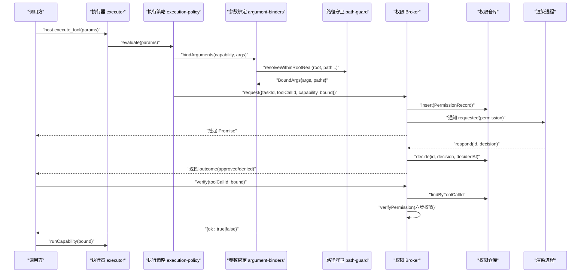
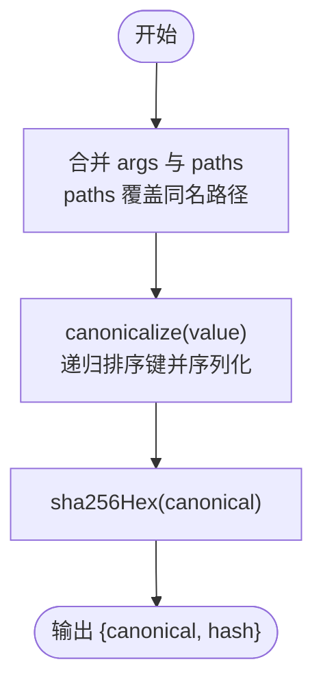
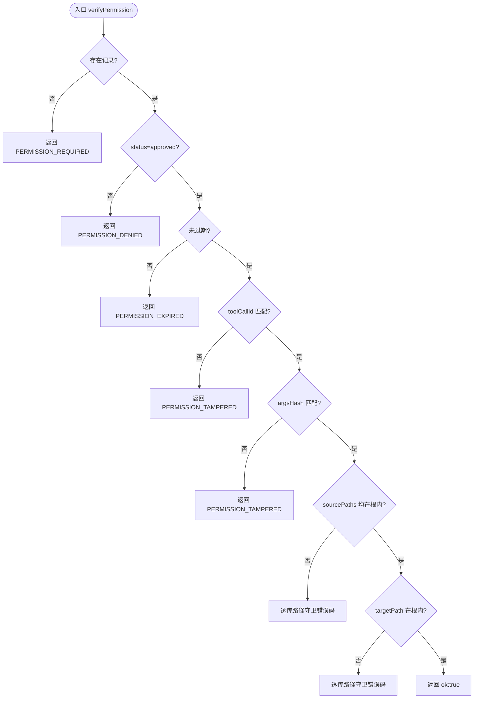
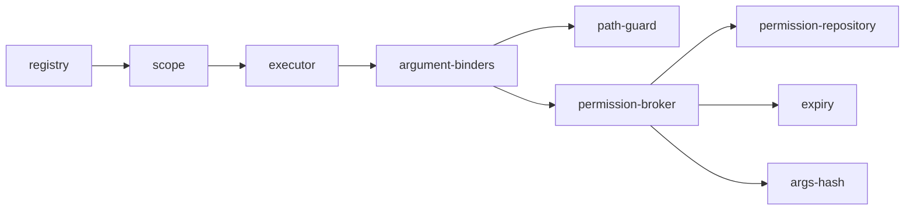

# 权限模型设计

<cite>
**本文引用的文件**
- [apps/desktop/src/shared/domain.ts](file://apps/desktop/src/shared/domain.ts)
- [apps/desktop/src/main/permission/permission-broker.ts](file://apps/desktop/src/main/permission/permission-broker.ts)
- [apps/desktop/src/main/permission/args-hash.ts](file://apps/desktop/src/main/permission/args-hash.ts)
- [apps/desktop/src/main/permission/canonical-json.ts](file://apps/desktop/src/main/permission/canonical-json.ts)
- [apps/desktop/src/main/permission/expiry.ts](file://apps/desktop/src/main/permission/expiry.ts)
- [apps/desktop/src/main/product-state/permission-repository.ts](file://apps/desktop/src/main/product-state/permission-repository.ts)
- [apps/desktop/src/main/product-state/migrations/0004-create-permissions.ts](file://apps/desktop/src/main/product-state/migrations/0004-create-permissions.ts)
- [apps/desktop/src/main/policy/argument-binders.ts](file://apps/desktop/src/main/policy/argument-binders.ts)
- [apps/desktop/src/main/capabilities/path-guard.ts](file://apps/desktop/src/main/capabilities/path-guard.ts)
- [apps/desktop/src/main/capabilities/registry.ts](file://apps/desktop/src/main/capabilities/registry.ts)
- [apps/desktop/src/main/capabilities/scope.ts](file://apps/desktop/src/main/capabilities/scope.ts)
- [apps/desktop/src/main/capabilities/executor.ts](file://apps/desktop/src/main/capabilities/executor.ts)
- [apps/desktop/src/main/permission/permission-broker.test.ts](file://apps/desktop/src/main/permission/permission-broker.test.ts)
</cite>

## 目录
1. [简介](#简介)
2. [项目结构](#项目结构)
3. [核心组件](#核心组件)
4. [架构总览](#架构总览)
5. [详细组件分析](#详细组件分析)
6. [依赖关系分析](#依赖关系分析)
7. [性能考虑](#性能考虑)
8. [故障排查指南](#故障排查指南)
9. [结论](#结论)
10. [附录：扩展与最佳实践](#附录：扩展与最佳实践)

## 简介
本文件系统性阐述基于能力的访问控制（Capability-Based Access Control）在个人代理桌面端中的设计与实现。重点覆盖：
- PermissionRecord 数据模型字段、状态机与生命周期
- 参数指纹计算 argsHash 与规范化 argsCanonical
- sourcePaths 与 targetPath 的提取逻辑与在不同能力下的行为
- 权限状态转换规则（pending、approved、denied、expired）及约束
- 如何扩展新的权限类型、数据结构与验证逻辑
- 安全与最佳实践建议

## 项目结构
权限相关代码主要分布在以下模块：
- 领域模型与共享类型：shared/domain.ts
- 权限编排与执行前校验：main/permission/*
- 持久化与迁移：main/product-state/*
- 参数绑定与路径守卫：main/policy/argument-binders.ts、main/capabilities/path-guard.ts
- 能力注册与作用域：main/capabilities/registry.ts、scope.ts
- 执行器集成：main/capabilities/executor.ts

图表来源
- [apps/desktop/src/main/capabilities/registry.ts:9-40](file://apps/desktop/src/main/capabilities/registry.ts#L9-L40)
- [apps/desktop/src/main/capabilities/scope.ts:3-17](file://apps/desktop/src/main/capabilities/scope.ts#L3-L17)
- [apps/desktop/src/main/capabilities/executor.ts:73-113](file://apps/desktop/src/main/capabilities/executor.ts#L73-L113)
- [apps/desktop/src/main/policy/argument-binders.ts:15-26](file://apps/desktop/src/main/policy/argument-binders.ts#L15-L26)
- [apps/desktop/src/main/capabilities/path-guard.ts:70-125](file://apps/desktop/src/main/capabilities/path-guard.ts#L70-L125)
- [apps/desktop/src/main/permission/permission-broker.ts:99-256](file://apps/desktop/src/main/permission/permission-broker.ts#L99-L256)
- [apps/desktop/src/main/permission/args-hash.ts:6-32](file://apps/desktop/src/main/permission/args-hash.ts#L6-L32)
- [apps/desktop/src/main/permission/canonical-json.ts:1-21](file://apps/desktop/src/main/permission/canonical-json.ts#L1-L21)
- [apps/desktop/src/main/permission/expiry.ts:1-27](file://apps/desktop/src/main/permission/expiry.ts#L1-L27)
- [apps/desktop/src/main/product-state/permission-repository.ts:24-131](file://apps/desktop/src/main/product-state/permission-repository.ts#L24-L131)
- [apps/desktop/src/main/product-state/migrations/0004-create-permissions.ts:5-28](file://apps/desktop/src/main/product-state/migrations/0004-create-permissions.ts#L5-L28)

章节来源
- [apps/desktop/src/shared/domain.ts:52-84](file://apps/desktop/src/shared/domain.ts#L52-L84)
- [apps/desktop/src/main/permission/permission-broker.ts:99-256](file://apps/desktop/src/main/permission/permission-broker.ts#L99-L256)
- [apps/desktop/src/main/product-state/permission-repository.ts:24-131](file://apps/desktop/src/main/product-state/permission-repository.ts#L24-L131)
- [apps/desktop/src/main/product-state/migrations/0004-create-permissions.ts:5-28](file://apps/desktop/src/main/product-state/migrations/0004-create-permissions.ts#L5-L28)

## 核心组件
- 领域模型 PermissionRecord：定义一次工具调用的授权记录，包含能力名、参数指纹、状态、时间戳、路径等。
- 权限 Broker：负责创建权限请求、等待用户决策、执行前六步校验、列表查询与资源清理。
- 参数指纹：将绑定后的参数规范化并哈希，确保“批准的内容”与“执行的内容”一致。
- 路径守卫：对 sourcePaths/targetPath 进行根内校验与链接解析，防止越界访问。
- 过期处理：默认 TTL 为 5 分钟；过期不写库，仅投影为 expired。
- 权限仓库：SQLite 持久化，提供插入、查找、决定等操作，保证幂等与一致性。

章节来源
- [apps/desktop/src/shared/domain.ts:52-84](file://apps/desktop/src/shared/domain.ts#L52-L84)
- [apps/desktop/src/main/permission/permission-broker.ts:99-256](file://apps/desktop/src/main/permission/permission-broker.ts#L99-L256)
- [apps/desktop/src/main/permission/args-hash.ts:6-32](file://apps/desktop/src/main/permission/args-hash.ts#L6-L32)
- [apps/desktop/src/main/permission/expiry.ts:1-27](file://apps/desktop/src/main/permission/expiry.ts#L1-L27)
- [apps/desktop/src/main/product-state/permission-repository.ts:24-131](file://apps/desktop/src/main/product-state/permission-repository.ts#L24-L131)

## 架构总览
下图展示从能力调用到权限审批再到执行的完整流程，以及关键的数据流与校验点。

图表来源
- [apps/desktop/src/main/capabilities/executor.ts:73-113](file://apps/desktop/src/main/capabilities/executor.ts#L73-L113)
- [apps/desktop/src/main/policy/argument-binders.ts:175-184](file://apps/desktop/src/main/policy/argument-binders.ts#L175-L184)
- [apps/desktop/src/main/capabilities/path-guard.ts:70-125](file://apps/desktop/src/main/capabilities/path-guard.ts#L70-L125)
- [apps/desktop/src/main/permission/permission-broker.ts:132-179](file://apps/desktop/src/main/permission/permission-broker.ts#L132-L179)
- [apps/desktop/src/main/permission/permission-broker.ts:182-233](file://apps/desktop/src/main/permission/permission-broker.ts#L182-L233)
- [apps/desktop/src/main/permission/permission-broker.ts:235-256](file://apps/desktop/src/main/permission/permission-broker.ts#L235-L256)
- [apps/desktop/src/main/product-state/permission-repository.ts:95-130](file://apps/desktop/src/main/product-state/permission-repository.ts#L95-L130)

## 详细组件分析

### 数据模型：PermissionRecord 与状态
- 关键字段
  - id、taskId、toolCallId：唯一标识与关联任务、工具调用
  - capability：能力名称，如 filesystem.move
  - argsCanonical、argsHash：参数的规范化字符串与 SHA-256 哈希，用于防篡改与重放
  - status：pending | approved | denied；expired 由查询时根据 expiresAt 投影得出
  - requestedAt、expiresAt、decidedAt：时间线
  - sourcePaths、targetPath：UI 展示的源/目标路径集合，来源于绑定阶段的路径规范化结果
- 状态机
  - pending：等待用户决策或超时
  - approved：用户批准，后续 verify 通过则允许执行
  - denied：用户拒绝，永久不可用
  - expired：查询时若 now > expiresAt 且 status 非 denied，则视为 expired；不写库
- 生命周期
  - request：创建记录、写入事件、推送通知、挂起等待
  - respond：幂等更新状态，触发事件与通知，唤醒挂起
  - verify：执行前六步校验，确保参数、路径、时效、身份一致
  - listForTask：按任务列出权限并附带过期投影

章节来源
- [apps/desktop/src/shared/domain.ts:52-84](file://apps/desktop/src/shared/domain.ts#L52-L84)
- [apps/desktop/src/main/permission/expiry.ts:1-27](file://apps/desktop/src/main/permission/expiry.ts#L1-L27)
- [apps/desktop/src/main/permission/permission-broker.ts:132-256](file://apps/desktop/src/main/permission/permission-broker.ts#L132-L256)
- [apps/desktop/src/main/product-state/permission-repository.ts:95-130](file://apps/desktop/src/main/product-state/permission-repository.ts#L95-L130)

### 参数指纹：argsHash 与 argsCanonical
- effectiveArgs：合并 args 与 paths，paths 覆盖同名路径字段，确保哈希基于执行体实际使用的值
- canonicalize：递归排序键后 JSON.stringify，生成稳定序列化串
- fingerprintArguments：先规范化再哈希，得到 argsCanonical 与 argsHash
- 目的：确保“被批准的参数”与“实际执行的参数”严格一致，任何变更都会导致哈希不同，从而拒绝执行

图表来源
- [apps/desktop/src/main/permission/args-hash.ts:18-32](file://apps/desktop/src/main/permission/args-hash.ts#L18-L32)
- [apps/desktop/src/main/permission/canonical-json.ts:1-21](file://apps/desktop/src/main/permission/canonical-json.ts#L1-L21)

章节来源
- [apps/desktop/src/main/permission/args-hash.ts:6-32](file://apps/desktop/src/main/permission/args-hash.ts#L6-L32)
- [apps/desktop/src/main/permission/canonical-json.ts:1-21](file://apps/desktop/src/main/permission/canonical-json.ts#L1-L21)

### 路径提取：sourcePaths 与 targetPath
- splitPaths 根据 capability 提取 UI 展示路径：
  - filesystem.move：source 放入 sourcePaths，target 放入 targetPath
  - filesystem.create_dir：无 sourcePaths，path 放入 targetPath
  - 其他能力：将所有 paths 值收集为 sourcePaths，targetPath 为空
- 这些路径来自 argument-binders 中 resolveWithinRootReal 的结果，已规范化为绝对路径

章节来源
- [apps/desktop/src/main/permission/permission-broker.ts:77-97](file://apps/desktop/src/main/permission/permission-broker.ts#L77-L97)
- [apps/desktop/src/main/policy/argument-binders.ts:43-117](file://apps/desktop/src/main/policy/argument-binders.ts#L43-L117)

### 执行前六步校验：verifyPermission
- 步骤
  1. 是否存在对应权限记录
  2. 状态是否为 approved
  3. 是否过期（基于 expiresAt 与当前时间）
  4. toolCallId 是否匹配
  5. argsHash 是否匹配
  6. 复查 sourcePaths 与 targetPath 是否在授权根内（含链接解析）
- 任一失败返回对应错误码与原因；全部通过返回 ok:true

图表来源
- [apps/desktop/src/main/permission/permission-broker.ts:274-319](file://apps/desktop/src/main/permission/permission-broker.ts#L274-L319)
- [apps/desktop/src/main/capabilities/path-guard.ts:70-125](file://apps/desktop/src/main/capabilities/path-guard.ts#L70-L125)

章节来源
- [apps/desktop/src/main/permission/permission-broker.ts:274-319](file://apps/desktop/src/main/permission/permission-broker.ts#L274-L319)

### 过期与状态投影
- 默认 TTL 为 5 分钟；request 时设置 expiresAt
- 过期不会修改数据库 status，仅在查询时投影为 expired
- 响应窗口关闭后，即使收到延迟的 respond，也不会写库或写事件

章节来源
- [apps/desktop/src/main/permission/expiry.ts:1-27](file://apps/desktop/src/main/permission/expiry.ts#L1-L27)
- [apps/desktop/src/main/permission/permission-broker.ts:167-179](file://apps/desktop/src/main/permission/permission-broker.ts#L167-L179)
- [apps/desktop/src/main/permission/permission-broker.ts:204-210](file://apps/desktop/src/main/permission/permission-broker.ts#L204-L210)

### 持久化与约束
- permissions 表字段与约束：
  - tool_call_id 唯一：一次工具调用仅一次授权机会
  - status CHECK：仅允许 pending、approved、denied
  - 索引：task_id、args_hash
- 行转记录时解析 source_paths JSON，非法格式抛出错误

章节来源
- [apps/desktop/src/main/product-state/migrations/0004-create-permissions.ts:5-28](file://apps/desktop/src/main/product-state/migrations/0004-create-permissions.ts#L5-L28)
- [apps/desktop/src/main/product-state/permission-repository.ts:35-79](file://apps/desktop/src/main/product-state/permission-repository.ts#L35-L79)

## 依赖关系分析
- 能力注册 registry 定义了可用能力及其读写属性，供作用域与策略使用
- 参数绑定 argument-binders 将原始参数转换为 BoundArgs，并对路径进行守卫检查
- 路径守卫 path-guard 确保所有路径在授权根内，并处理符号链接/连接点
- 权限 Broker 依赖上述模块完成请求、决策、校验与事件通知
- 仓库 layer 提供幂等的 decide 操作，避免重复决策冲突

图表来源
- [apps/desktop/src/main/capabilities/registry.ts:9-40](file://apps/desktop/src/main/capabilities/registry.ts#L9-L40)
- [apps/desktop/src/main/capabilities/scope.ts:3-17](file://apps/desktop/src/main/capabilities/scope.ts#L3-L17)
- [apps/desktop/src/main/capabilities/executor.ts:73-113](file://apps/desktop/src/main/capabilities/executor.ts#L73-L113)
- [apps/desktop/src/main/policy/argument-binders.ts:175-184](file://apps/desktop/src/main/policy/argument-binders.ts#L175-L184)
- [apps/desktop/src/main/capabilities/path-guard.ts:70-125](file://apps/desktop/src/main/capabilities/path-guard.ts#L70-L125)
- [apps/desktop/src/main/permission/permission-broker.ts:99-256](file://apps/desktop/src/main/permission/permission-broker.ts#L99-L256)
- [apps/desktop/src/main/product-state/permission-repository.ts:95-130](file://apps/desktop/src/main/product-state/permission-repository.ts#L95-L130)

章节来源
- [apps/desktop/src/main/capabilities/registry.ts:9-40](file://apps/desktop/src/main/capabilities/registry.ts#L9-L40)
- [apps/desktop/src/main/policy/argument-binders.ts:175-184](file://apps/desktop/src/main/policy/argument-binders.ts#L175-L184)
- [apps/desktop/src/main/permission/permission-broker.ts:99-256](file://apps/desktop/src/main/permission/permission-broker.ts#L99-L256)

## 性能考虑
- 参数规范化与哈希：JSON 键排序与 SHA-256 计算开销较小，适合每次请求计算
- 路径守卫 realpath：仅在必要时对最近存在的祖先做 realpath，减少系统调用
- 过期投影：不写库，仅查询时比较时间戳，降低写入压力
- 数据库索引：task_id、args_hash 提升查询与去重效率

[本节为通用指导，无需具体文件引用]

## 故障排查指南
- 常见错误码与含义
  - PERMISSION_REQUIRED：缺少权限记录或未找到
  - PERMISSION_DENIED：状态不是 approved 或被拒绝
  - PERMISSION_EXPIRED：超过有效期或响应窗口关闭
  - PERMISSION_TAMPERED：toolCallId 或 argsHash 不匹配
  - PATH_OUT_OF_ROOT / PATH_ESCAPES_ROOT_VIA_LINK / PATH_UNC_NOT_ALLOWED：路径越界或不安全
- 定位要点
  - 检查 request 是否正确生成 argsCanonical 与 argsHash
  - 确认 respond 在 TTL 内且状态仍为 pending
  - 核查 sourcePaths/targetPath 是否经 resolveWithinRootReal 校验
  - 查看事件日志 permission_requested、permission_decision、permission_expired

章节来源
- [apps/desktop/src/main/permission/permission-broker.test.ts:362-468](file://apps/desktop/src/main/permission/permission-broker.test.ts#L362-L468)
- [apps/desktop/src/main/permission/permission-broker.test.ts:470-666](file://apps/desktop/src/main/permission/permission-broker.test.ts#L470-L666)

## 结论
该权限模型以能力为中心，结合严格的参数指纹与路径守卫，实现了细粒度、可审计、可回滚的访问控制。通过状态机与过期投影，既保证了安全性，又兼顾了用户体验与性能。扩展新能力时，只需遵循参数绑定、路径守卫与权限提取规范，即可无缝接入。

[本节为总结性内容，无需具体文件引用]

## 附录：扩展与最佳实践

### 新增权限类型的步骤
- 注册能力：在 registry 中添加 CapabilityDescriptor，指定 kind（READ/WRITE）
- 实现参数绑定：在 argument-binders 中新增 Binder，完成契约校验与路径规范化
- 提取路径：如需区分 source/target，在 broker.splitPaths 中增加分支
- 执行体实现：在 executor 中 switch 新增 case，消费 BoundArgs
- 测试覆盖：编写用例覆盖正常、越界、过期、篡改等场景

章节来源
- [apps/desktop/src/main/capabilities/registry.ts:9-40](file://apps/desktop/src/main/capabilities/registry.ts#L9-L40)
- [apps/desktop/src/main/policy/argument-binders.ts:43-117](file://apps/desktop/src/main/policy/argument-binders.ts#L43-L117)
- [apps/desktop/src/main/permission/permission-broker.ts:77-97](file://apps/desktop/src/main/permission/permission-broker.ts#L77-L97)
- [apps/desktop/src/main/capabilities/executor.ts:121-143](file://apps/desktop/src/main/capabilities/executor.ts#L121-L143)

### 扩展权限数据结构
- 如需新增字段，需同步更新：
  - shared/domain.ts 中的 PermissionRecord
  - product-state 迁移脚本与 toRecord 映射
  - permission-repository 的 INSERT/SELECT 列集
  - 可能的 UI 展示与事件载荷
- 保持向后兼容：新增字段可为空或带默认值

章节来源
- [apps/desktop/src/shared/domain.ts:65-84](file://apps/desktop/src/shared/domain.ts#L65-L84)
- [apps/desktop/src/main/product-state/migrations/0004-create-permissions.ts:5-28](file://apps/desktop/src/main/product-state/migrations/0004-create-permissions.ts#L5-L28)
- [apps/desktop/src/main/product-state/permission-repository.ts:51-90](file://apps/desktop/src/main/product-state/permission-repository.ts#L51-L90)

### 自定义权限验证逻辑
- 在执行前校验阶段，可在 verifyPermission 中追加步骤，例如：
  - 额外白名单/黑名单检查
  - 基于时间的动态策略（如工作日限制）
  - 外部服务鉴权（注意超时与降级）
- 注意：新增校验应尽早失败，避免副作用

章节来源
- [apps/desktop/src/main/permission/permission-broker.ts:274-319](file://apps/desktop/src/main/permission/permission-broker.ts#L274-L319)

### 安全与最佳实践
- 始终使用 BoundArgs.paths 作为执行路径，禁止直接使用原始参数
- 对所有路径进行 resolveWithinRootReal 校验，防范符号链接逃逸
- 使用 argsCanonical 与 argsHash 锁定“批准即执行”的参数快照
- 严格控制 TTL，避免长窗口带来的风险
- 对敏感能力采用最小权限原则（只授予必要能力）
- 记录并审计所有 permission 事件，便于追溯与合规

[本节为通用指导，无需具体文件引用]