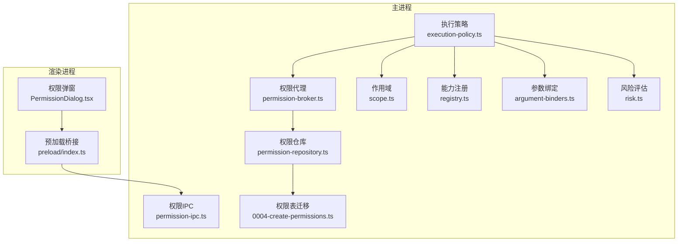
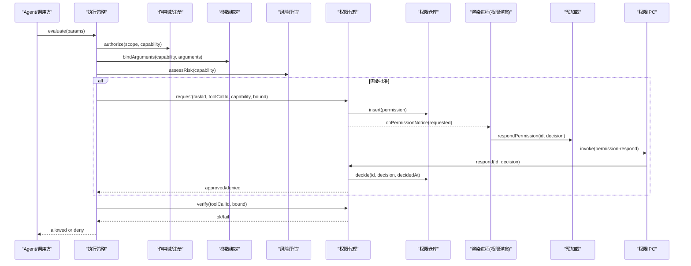
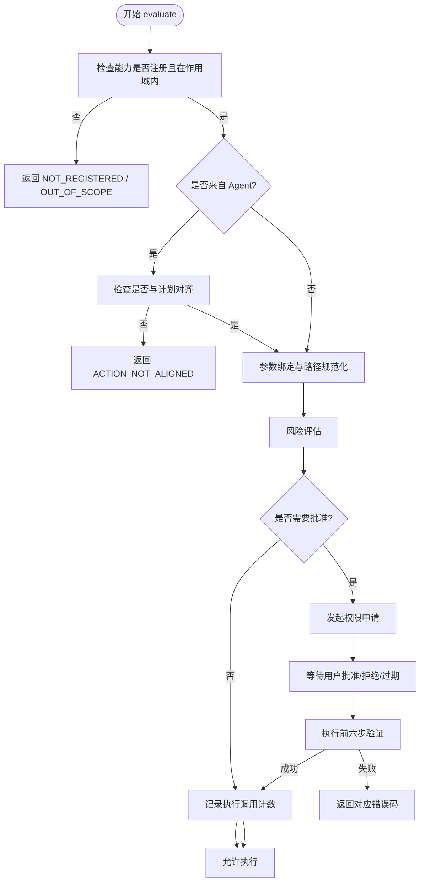
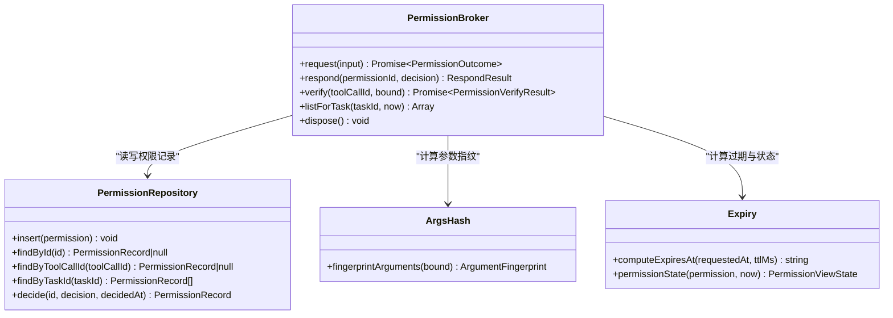
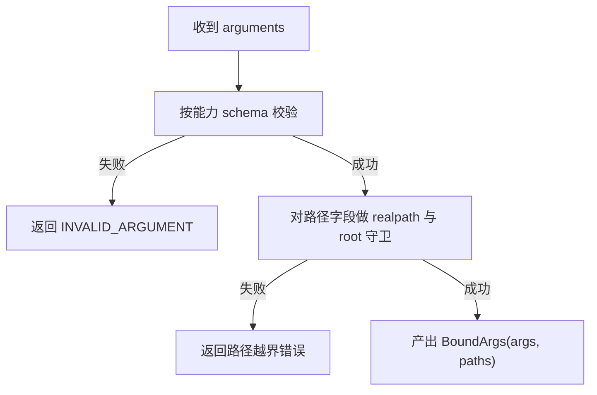
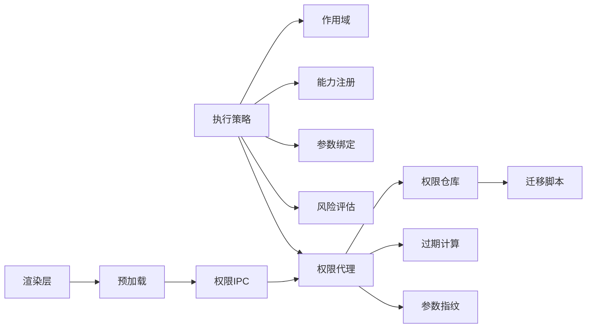

# 权限管理系统

<cite>
**本文引用的文件**
- [apps/desktop/src/main/permission/permission-broker.ts](file://apps/desktop/src/main/permission/permission-broker.ts)
- [apps/desktop/src/main/permission/permission-ipc.ts](file://apps/desktop/src/main/permission/permission-ipc.ts)
- [apps/desktop/src/main/policy/execution-policy.ts](file://apps/desktop/src/main/policy/execution-policy.ts)
- [apps/desktop/src/main/product-state/permission-repository.ts](file://apps/desktop/src/main/product-state/permission-repository.ts)
- [apps/desktop/src/main/capabilities/scope.ts](file://apps/desktop/src/main/capabilities/scope.ts)
- [apps/desktop/src/main/capabilities/registry.ts](file://apps/desktop/src/main/capabilities/registry.ts)
- [apps/desktop/src/main/permission/args-hash.ts](file://apps/desktop/src/main/permission/args-hash.ts)
- [apps/desktop/src/main/permission/expiry.ts](file://apps/desktop/src/main/permission/expiry.ts)
- [apps/desktop/src/main/policy/risk.ts](file://apps/desktop/src/main/policy/risk.ts)
- [apps/desktop/src/main/policy/argument-binders.ts](file://apps/desktop/src/main/policy/argument-binders.ts)
- [apps/desktop/src/shared/domain.ts](file://apps/desktop/src/shared/domain.ts)
- [apps/desktop/src/main/product-state/migrations/0004-create-permissions.ts](file://apps/desktop/src/main/product-state/migrations/0004-create-permissions.ts)
- [apps/desktop/src/renderer/src/components/PermissionDialog.tsx](file://apps/desktop/src/renderer/src/components/PermissionDialog.tsx)
- [apps/desktop/src/preload/index.ts](file://apps/desktop/src/preload/index.ts)
</cite>

## 目录
1. [简介](#简介)
2. [项目结构](#项目结构)
3. [核心组件](#核心组件)
4. [架构总览](#架构总览)
5. [详细组件分析](#详细组件分析)
6. [依赖关系分析](#依赖关系分析)
7. [性能考量](#性能考量)
8. [故障排查指南](#故障排查指南)
9. [结论](#结论)
10. [附录：使用示例与最佳实践](#附录：使用示例与最佳实践)

## 简介
本系统实现了一套面向桌面应用的细粒度权限管理，围绕“基于能力的访问控制”和“最小权限原则”构建。核心思想是：
- 将能力（capability）按只读/写分类，写入类能力默认需要用户批准；
- 通过参数绑定、路径规范化与根目录守卫，确保执行体只能访问授权范围内的真实路径；
- 以“权限记录 + 过期窗口 + 审批通道”的机制完成申请、审批、验证闭环；
- 通过事件与持久化存储提供审计追踪；
- 在策略层进行八级校验，保证调用从注册、范围、计划对齐、参数契约、风险到批准的完整安全链。

## 项目结构
权限相关代码主要分布在 main 进程的策略、权限、能力、产品状态以及渲染层的 UI 与预加载桥接中：
- 策略层：执行策略评估、参数绑定、风险评估、任务上下文
- 权限层：权限申请、审批、过期、验证、IPC 暴露
- 能力层：能力注册、作用域限定
- 数据层：权限表迁移、仓库读写
- 前端层：权限弹窗、倒计时、提交决策
- 桥接层：preload 暴露 IPC 接口给渲染进程

图表来源
- [apps/desktop/src/main/policy/execution-policy.ts:82-147](file://apps/desktop/src/main/policy/execution-policy.ts#L82-L147)
- [apps/desktop/src/main/permission/permission-broker.ts:99-257](file://apps/desktop/src/main/permission/permission-broker.ts#L99-L257)
- [apps/desktop/src/main/permission/permission-ipc.ts:44-84](file://apps/desktop/src/main/permission/permission-ipc.ts#L44-L84)
- [apps/desktop/src/main/capabilities/scope.ts:3-17](file://apps/desktop/src/main/capabilities/scope.ts#L3-L17)
- [apps/desktop/src/main/capabilities/registry.ts:9-55](file://apps/desktop/src/main/capabilities/registry.ts#L9-L55)
- [apps/desktop/src/main/policy/argument-binders.ts:152-170](file://apps/desktop/src/main/policy/argument-binders.ts#L152-L170)
- [apps/desktop/src/main/policy/risk.ts:13-21](file://apps/desktop/src/main/policy/risk.ts#L13-L21)
- [apps/desktop/src/main/product-state/permission-repository.ts:92-132](file://apps/desktop/src/main/product-state/permission-repository.ts#L92-L132)
- [apps/desktop/src/main/product-state/migrations/0004-create-permissions.ts:5-39](file://apps/desktop/src/main/product-state/migrations/0004-create-permissions.ts#L5-L39)
- [apps/desktop/src/renderer/src/components/PermissionDialog.tsx:136-165](file://apps/desktop/src/renderer/src/components/PermissionDialog.tsx#L136-L165)
- [apps/desktop/src/preload/index.ts:29-45](file://apps/desktop/src/preload/index.ts#L29-L45)

章节来源
- [apps/desktop/src/main/policy/execution-policy.ts:82-147](file://apps/desktop/src/main/policy/execution-policy.ts#L82-L147)
- [apps/desktop/src/main/permission/permission-broker.ts:99-257](file://apps/desktop/src/main/permission/permission-broker.ts#L99-L257)
- [apps/desktop/src/main/permission/permission-ipc.ts:44-84](file://apps/desktop/src/main/permission/permission-ipc.ts#L44-L84)
- [apps/desktop/src/main/capabilities/scope.ts:3-17](file://apps/desktop/src/main/capabilities/scope.ts#L3-L17)
- [apps/desktop/src/main/capabilities/registry.ts:9-55](file://apps/desktop/src/main/capabilities/registry.ts#L9-L55)
- [apps/desktop/src/main/policy/argument-binders.ts:152-170](file://apps/desktop/src/main/policy/argument-binders.ts#L152-L170)
- [apps/desktop/src/main/policy/risk.ts:13-21](file://apps/desktop/src/main/policy/risk.ts#L13-L21)
- [apps/desktop/src/main/product-state/permission-repository.ts:92-132](file://apps/desktop/src/main/product-state/permission-repository.ts#L92-L132)
- [apps/desktop/src/main/product-state/migrations/0004-create-permissions.ts:5-39](file://apps/desktop/src/main/product-state/migrations/0004-create-permissions.ts#L5-L39)
- [apps/desktop/src/renderer/src/components/PermissionDialog.tsx:136-165](file://apps/desktop/src/renderer/src/components/PermissionDialog.tsx#L136-L165)
- [apps/desktop/src/preload/index.ts:29-45](file://apps/desktop/src/preload/index.ts#L29-L45)

## 核心组件
- 执行策略（ExecutionPolicy）：统一入口，负责注册检查、作用域检查、计划对齐、参数绑定、风险评估、权限门控、放行计数等。
- 权限代理（PermissionBroker）：维护待决权限、过期定时器、审批响应、执行前六步验证、任务维度查询。
- 权限仓库（PermissionRepository）：对 permissions 表的增删改查，包含幂等决定与约束保护。
- 参数绑定器（ArgumentBinders）：按能力解析并规范化参数与路径，产出不可篡改的 BoundArgs。
- 风险评估（Risk）：根据能力种类判定是否需要用户批准。
- 能力与作用域（Registry/Scope）：声明能力清单与任务可调用集合。
- 权限IPC（PermissionIPC）：对外暴露批准/拒绝与列表查询，严格校验入参。
- 过期与指纹（Expiry/ArgsHash）：计算过期时间、生成参数规范串与哈希，用于防篡改比对。
- 迁移（Migration）：创建权限表、索引与约束。
- 渲染层（PermissionDialog）：展示请求详情、倒计时、提交决策。
- 预加载（Preload）：向渲染进程暴露权限相关 IPC。

章节来源
- [apps/desktop/src/main/policy/execution-policy.ts:82-147](file://apps/desktop/src/main/policy/execution-policy.ts#L82-L147)
- [apps/desktop/src/main/permission/permission-broker.ts:99-257](file://apps/desktop/src/main/permission/permission-broker.ts#L99-L257)
- [apps/desktop/src/main/product-state/permission-repository.ts:92-132](file://apps/desktop/src/main/product-state/permission-repository.ts#L92-L132)
- [apps/desktop/src/main/policy/argument-binders.ts:152-170](file://apps/desktop/src/main/policy/argument-binders.ts#L152-L170)
- [apps/desktop/src/main/policy/risk.ts:13-21](file://apps/desktop/src/main/policy/risk.ts#L13-L21)
- [apps/desktop/src/main/capabilities/registry.ts:9-55](file://apps/desktop/src/main/capabilities/registry.ts#L9-L55)
- [apps/desktop/src/main/capabilities/scope.ts:3-17](file://apps/desktop/src/main/capabilities/scope.ts#L3-L17)
- [apps/desktop/src/main/permission/permission-ipc.ts:44-84](file://apps/desktop/src/main/permission/permission-ipc.ts#L44-L84)
- [apps/desktop/src/main/permission/expiry.ts:1-27](file://apps/desktop/src/main/permission/expiry.ts#L1-L27)
- [apps/desktop/src/main/permission/args-hash.ts:1-33](file://apps/desktop/src/main/permission/args-hash.ts#L1-L33)
- [apps/desktop/src/main/product-state/migrations/0004-create-permissions.ts:5-39](file://apps/desktop/src/main/product-state/migrations/0004-create-permissions.ts#L5-L39)
- [apps/desktop/src/renderer/src/components/PermissionDialog.tsx:136-165](file://apps/desktop/src/renderer/src/components/PermissionDialog.tsx#L136-L165)
- [apps/desktop/src/preload/index.ts:29-45](file://apps/desktop/src/preload/index.ts#L29-L45)

## 架构总览
下图展示了从工具调用到最终执行的完整流程，包括策略评估、权限申请、UI 审批、执行前验证与放行。

图表来源
- [apps/desktop/src/main/policy/execution-policy.ts:82-147](file://apps/desktop/src/main/policy/execution-policy.ts#L82-L147)
- [apps/desktop/src/main/permission/permission-broker.ts:132-257](file://apps/desktop/src/main/permission/permission-broker.ts#L132-L257)
- [apps/desktop/src/main/permission/permission-ipc.ts:44-84](file://apps/desktop/src/main/permission/permission-ipc.ts#L44-L84)
- [apps/desktop/src/preload/index.ts:29-45](file://apps/desktop/src/preload/index.ts#L29-L45)
- [apps/desktop/src/renderer/src/components/PermissionDialog.tsx:136-165](file://apps/desktop/src/renderer/src/components/PermissionDialog.tsx#L136-L165)

## 详细组件分析

### 执行策略（八级检验管道）
- 注册与范围：先检查能力是否已注册且在当前任务作用域内。
- 计划对齐（仅 Agent 源）：若来自 Agent，需核对是否在计划步骤中。
- 参数绑定与路径规范化：将原始参数解析为 BoundArgs，并对路径做 realpath 与根目录守卫。
- 风险评估：WRITE 能力标记为需要批准，READ 无需批准。
- 权限门控：如需批准则挂起等待用户决策，并在批准后再次验证。
- 放行计数：仅在全部拒绝通过后计数，避免被拒调用占用序号。

图表来源
- [apps/desktop/src/main/policy/execution-policy.ts:82-147](file://apps/desktop/src/main/policy/execution-policy.ts#L82-L147)
- [apps/desktop/src/main/policy/argument-binders.ts:152-170](file://apps/desktop/src/main/policy/argument-binders.ts#L152-L170)
- [apps/desktop/src/main/policy/risk.ts:13-21](file://apps/desktop/src/main/policy/risk.ts#L13-L21)

章节来源
- [apps/desktop/src/main/policy/execution-policy.ts:82-147](file://apps/desktop/src/main/policy/execution-policy.ts#L82-L147)

### 权限代理（申请、审批、验证、过期）
- 申请：生成唯一 ID、计算参数指纹、插入权限记录、推送通知、设置过期定时器。
- 审批：幂等处理重复决策，拒绝非 pending 或已过期窗口，更新状态并结算等待者。
- 验证：执行前六步检查（存在性、已批准、未过期、toolCallId 匹配、参数哈希匹配、路径复查）。
- 过期：超时后发出过期事件并通知渲染进程。

图表来源
- [apps/desktop/src/main/permission/permission-broker.ts:99-257](file://apps/desktop/src/main/permission/permission-broker.ts#L99-L257)
- [apps/desktop/src/main/product-state/permission-repository.ts:92-132](file://apps/desktop/src/main/product-state/permission-repository.ts#L92-L132)
- [apps/desktop/src/main/permission/args-hash.ts:1-33](file://apps/desktop/src/main/permission/args-hash.ts#L1-L33)
- [apps/desktop/src/main/permission/expiry.ts:1-27](file://apps/desktop/src/main/permission/expiry.ts#L1-L27)

章节来源
- [apps/desktop/src/main/permission/permission-broker.ts:99-257](file://apps/desktop/src/main/permission/permission-broker.ts#L99-L257)
- [apps/desktop/src/main/product-state/permission-repository.ts:92-132](file://apps/desktop/src/main/product-state/permission-repository.ts#L92-L132)
- [apps/desktop/src/main/permission/args-hash.ts:1-33](file://apps/desktop/src/main/permission/args-hash.ts#L1-L33)
- [apps/desktop/src/main/permission/expiry.ts:1-27](file://apps/desktop/src/main/permission/expiry.ts#L1-L27)

### 参数绑定与路径守卫
- 每个能力有专属绑定器，先用 schema 校验参数，再对路径字段调用 resolveWithinRootReal 获取规范化绝对路径。
- 输出 BoundArgs：保留原始字段名用于日志，paths 保存规范化后的路径用于执行与哈希。
- 路径守卫确保所有路径都在授权根目录下，防止越权访问。

图表来源
- [apps/desktop/src/main/policy/argument-binders.ts:38-113](file://apps/desktop/src/main/policy/argument-binders.ts#L38-L113)
- [apps/desktop/src/main/policy/argument-binders.ts:152-170](file://apps/desktop/src/main/policy/argument-binders.ts#L152-L170)

章节来源
- [apps/desktop/src/main/policy/argument-binders.ts:38-113](file://apps/desktop/src/main/policy/argument-binders.ts#L38-L113)
- [apps/desktop/src/main/policy/argument-binders.ts:152-170](file://apps/desktop/src/main/policy/argument-binders.ts#L152-L170)

### 风险评估与最小权限
- READ 能力：无副作用，直接放行。
- WRITE 能力：可能产生副作用，必须走权限审批流程。
- 该设计体现最小权限原则：默认不授予写入能力，除非用户明确批准。

章节来源
- [apps/desktop/src/main/policy/risk.ts:13-21](file://apps/desktop/src/main/policy/risk.ts#L13-L21)

### 能力与作用域
- 能力注册表集中声明能力名称、种类与描述。
- 任务作用域限制当前任务可使用的能力集合，支持只读作用域快速构造。
- 策略层依据作用域判断是否允许调用某能力。

章节来源
- [apps/desktop/src/main/capabilities/registry.ts:9-55](file://apps/desktop/src/main/capabilities/registry.ts#L9-L55)
- [apps/desktop/src/main/capabilities/scope.ts:3-17](file://apps/desktop/src/main/capabilities/scope.ts#L3-L17)

### 权限持久化与迁移
- 权限表包含任务关联、能力、参数指纹、状态、时间戳、影响路径等字段。
- 通过 UNIQUE 约束保证一次工具调用仅有一次授权机会。
- 索引优化按任务与哈希查询性能。

章节来源
- [apps/desktop/src/main/product-state/migrations/0004-create-permissions.ts:5-39](file://apps/desktop/src/main/product-state/migrations/0004-create-permissions.ts#L5-L39)
- [apps/desktop/src/main/product-state/permission-repository.ts:51-90](file://apps/desktop/src/main/product-state/permission-repository.ts#L51-L90)

### 渲染层与 IPC 交互
- 渲染进程通过 preload 暴露 respondPermission 与 listPermissions 等方法。
- 权限弹窗显示能力、影响文件、目标位置、参数指纹、剩余时间，并提供批准/拒绝按钮。
- 主进程通过 permission-notice 推送请求与结果，渲染进程订阅并更新 UI。

章节来源
- [apps/desktop/src/preload/index.ts:29-45](file://apps/desktop/src/preload/index.ts#L29-L45)
- [apps/desktop/src/renderer/src/components/PermissionDialog.tsx:31-134](file://apps/desktop/src/renderer/src/components/PermissionDialog.tsx#L31-L134)
- [apps/desktop/src/main/permission/permission-ipc.ts:44-84](file://apps/desktop/src/main/permission/permission-ipc.ts#L44-L84)

## 依赖关系分析
- 执行策略依赖：作用域、工具检索、参数绑定、风险评估、任务上下文、可选的权限门控与任务状态端口。
- 权限代理依赖：权限仓库、事件仓库、过期计算、参数指纹、路径守卫。
- 权限仓库依赖：SQLite 数据库与迁移脚本。
- 渲染层依赖：preload 暴露的 IPC 方法。

图表来源
- [apps/desktop/src/main/policy/execution-policy.ts:82-147](file://apps/desktop/src/main/policy/execution-policy.ts#L82-L147)
- [apps/desktop/src/main/permission/permission-broker.ts:99-257](file://apps/desktop/src/main/permission/permission-broker.ts#L99-L257)
- [apps/desktop/src/main/product-state/permission-repository.ts:92-132](file://apps/desktop/src/main/product-state/permission-repository.ts#L92-L132)
- [apps/desktop/src/main/product-state/migrations/0004-create-permissions.ts:5-39](file://apps/desktop/src/main/product-state/migrations/0004-create-permissions.ts#L5-L39)
- [apps/desktop/src/preload/index.ts:29-45](file://apps/desktop/src/preload/index.ts#L29-L45)
- [apps/desktop/src/main/permission/permission-ipc.ts:44-84](file://apps/desktop/src/main/permission/permission-ipc.ts#L44-L84)

## 性能考量
- 参数指纹与哈希：使用规范化 JSON 与 SHA-256 哈希，避免重复比较开销，同时保障一致性。
- 数据库索引：针对 task_id、requested_at 与 args_hash 建立索引，提升查询与去重效率。
- 过期定时器：单条权限一个定时器，应用退出时统一清理，避免内存泄漏。
- 幂等审批：重复审批不会造成额外副作用，减少重试成本。
- 路径守卫：realpath 与 root 校验在绑定阶段完成，避免后续重复计算。

[本节为通用性能建议，不直接分析具体文件]

## 故障排查指南
常见错误码与定位要点：
- PERMISSION_REQUIRED：缺少权限记录或未配置批准通道。检查策略是否启用权限门控，以及是否存在 pending 权限。
- PERMISSION_DENIED：权限已被拒绝或状态不一致。检查仓库中的 status 与决策历史。
- PERMISSION_EXPIRED：超过 TTL 未审批。检查渲染层是否及时响应，或延长 TTL。
- PERMISSION_TAMPERED：toolCallId 或参数哈希不匹配。检查参数绑定与指纹计算是否一致。
- NOT_IMPLEMENTED：能力未实现。检查能力注册与绑定器映射。
- INVALID_ARGUMENT：参数不符合 schema。检查传入参数结构与类型。
- NO_ACTIVE_TASK：Agent 调用时无活动任务。检查任务上下文初始化。
- ACTION_NOT_ALIGNED：能力不在计划中。检查计划步骤与执行顺序。

章节来源
- [apps/desktop/src/main/permission/permission-broker.ts:182-233](file://apps/desktop/src/main/permission/permission-broker.ts#L182-L233)
- [apps/desktop/src/main/permission/permission-broker.ts:275-319](file://apps/desktop/src/main/permission/permission-broker.ts#L275-L319)
- [apps/desktop/src/main/policy/execution-policy.ts:82-147](file://apps/desktop/src/main/policy/execution-policy.ts#L82-L147)
- [apps/desktop/src/main/policy/argument-binders.ts:152-170](file://apps/desktop/src/main/policy/argument-binders.ts#L152-L170)

## 结论
本权限管理系统通过“能力 + 作用域 + 参数绑定 + 风险评估 + 审批门控 + 执行前验证”的多层防护，实现了细粒度的访问控制与最小权限原则。借助持久化与事件机制，提供了完整的审计追踪能力。整体设计清晰、可扩展，便于新增能力与规则，同时保证了安全性与可维护性。

[本节为总结性内容，不直接分析具体文件]

## 附录：使用示例与最佳实践

### 定义新的权限类型（能力）
- 在能力注册表中添加新能力条目，指定名称、种类（READ/WRITE）与描述。
- 在参数绑定器中为该能力实现绑定逻辑，完成 schema 校验与路径规范化。
- 若为 WRITE 能力，系统将自动要求用户批准；READ 能力可直接放行。

章节来源
- [apps/desktop/src/main/capabilities/registry.ts:9-55](file://apps/desktop/src/main/capabilities/registry.ts#L9-L55)
- [apps/desktop/src/main/policy/argument-binders.ts:38-113](file://apps/desktop/src/main/policy/argument-binders.ts#L38-L113)
- [apps/desktop/src/main/policy/risk.ts:13-21](file://apps/desktop/src/main/policy/risk.ts#L13-L21)

### 配置权限规则
- 通过任务作用域限制可用能力集合，例如只读模式仅包含 READ 能力。
- 在策略层结合计划对齐，确保 Agent 调用的能力在计划步骤中。
- 使用风险评估区分 READ/WRITE，WRITE 强制走审批流程。

章节来源
- [apps/desktop/src/main/capabilities/scope.ts:3-17](file://apps/desktop/src/main/capabilities/scope.ts#L3-L17)
- [apps/desktop/src/main/policy/execution-policy.ts:82-147](file://apps/desktop/src/main/policy/execution-policy.ts#L82-L147)
- [apps/desktop/src/main/policy/risk.ts:13-21](file://apps/desktop/src/main/policy/risk.ts#L13-L21)

### 处理权限拒绝场景
- 渲染层收到 denied 或 expired 通知后，禁用操作并提示用户。
- 主进程在 respond 时若发现权限不存在、已决定或窗口关闭，返回相应错误码。
- 策略层在 verify 失败时返回具体错误码，调用方可据此降级或重试。

章节来源
- [apps/desktop/src/renderer/src/components/PermissionDialog.tsx:113-134](file://apps/desktop/src/renderer/src/components/PermissionDialog.tsx#L113-L134)
- [apps/desktop/src/main/permission/permission-ipc.ts:44-84](file://apps/desktop/src/main/permission/permission-ipc.ts#L44-L84)
- [apps/desktop/src/main/permission/permission-broker.ts:182-233](file://apps/desktop/src/main/permission/permission-broker.ts#L182-L233)
- [apps/desktop/src/main/permission/permission-broker.ts:275-319](file://apps/desktop/src/main/permission/permission-broker.ts#L275-L319)

### 权限过期机制与安全令牌管理
- 每条权限记录包含 expiresAt，默认 TTL 为固定时长；过期后状态投影为 expired。
- 过期定时器在 broker 中维护，到期后发出过期事件并通知渲染层。
- 安全令牌体现在 toolCallId 与参数哈希的强绑定，执行前必须完全匹配，防止篡改。

章节来源
- [apps/desktop/src/main/permission/expiry.ts:1-27](file://apps/desktop/src/main/permission/expiry.ts#L1-L27)
- [apps/desktop/src/main/permission/permission-broker.ts:120-179](file://apps/desktop/src/main/permission/permission-broker.ts#L120-L179)
- [apps/desktop/src/main/permission/args-hash.ts:1-33](file://apps/desktop/src/main/permission/args-hash.ts#L1-L33)
- [apps/desktop/src/main/permission/permission-broker.ts:275-319](file://apps/desktop/src/main/permission/permission-broker.ts#L275-L319)

### 执行策略的配置与评估过程
- 配置来源：作用域（任务可调用能力）、注册表（能力元信息）、策略开关（是否启用权限门控）。
- 评估流程：注册检查 → 作用域检查 → 计划对齐 → 参数绑定 → 风险评估 → 权限门控 → 执行前验证 → 放行计数。
- 关键断点：任何一步失败都会返回明确的错误码与原因，便于调试与审计。

章节来源
- [apps/desktop/src/main/policy/execution-policy.ts:82-147](file://apps/desktop/src/main/policy/execution-policy.ts#L82-L147)
- [apps/desktop/src/main/capabilities/registry.ts:9-55](file://apps/desktop/src/main/capabilities/registry.ts#L9-L55)
- [apps/desktop/src/main/capabilities/scope.ts:3-17](file://apps/desktop/src/main/capabilities/scope.ts#L3-L17)

### 权限审计与日志记录
- 事件类型：请求、决策、过期，均附带时间戳与必要负载。
- 持久化：权限记录落库，包含能力、参数指纹、影响路径、状态与时间线。
- 可视化：渲染层展示剩余时间与参数指纹，便于用户理解与追溯。

章节来源
- [apps/desktop/src/main/permission/permission-broker.ts:120-179](file://apps/desktop/src/main/permission/permission-broker.ts#L120-L179)
- [apps/desktop/src/main/product-state/permission-repository.ts:51-90](file://apps/desktop/src/main/product-state/permission-repository.ts#L51-L90)
- [apps/desktop/src/renderer/src/components/PermissionDialog.tsx:63-110](file://apps/desktop/src/renderer/src/components/PermissionDialog.tsx#L63-L110)

### 安全最佳实践
- 始终使用参数绑定与路径规范化，禁止直接使用原始路径执行。
- 对所有 WRITE 能力强制审批，遵循最小权限原则。
- 使用 toolCallId 与参数哈希进行强绑定，防止参数篡改。
- 合理设置 TTL，避免过长窗口导致安全风险。
- 在渲染层禁用过期窗口的操作按钮，避免误操作。
- 对未知或非法输入进行严格校验，返回明确的错误码。

[本节为通用安全建议，不直接分析具体文件]