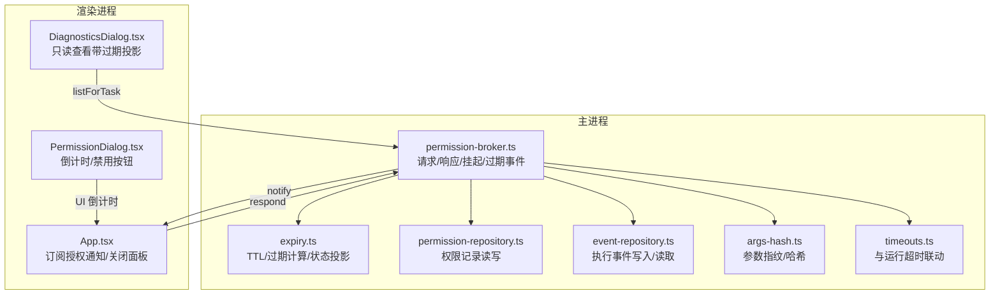
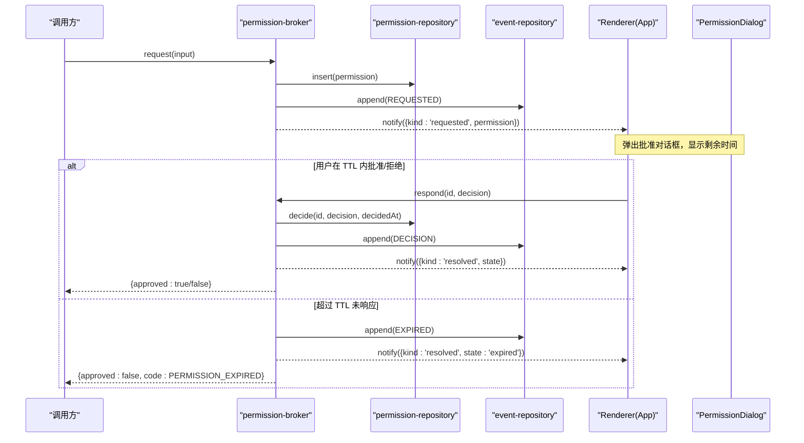
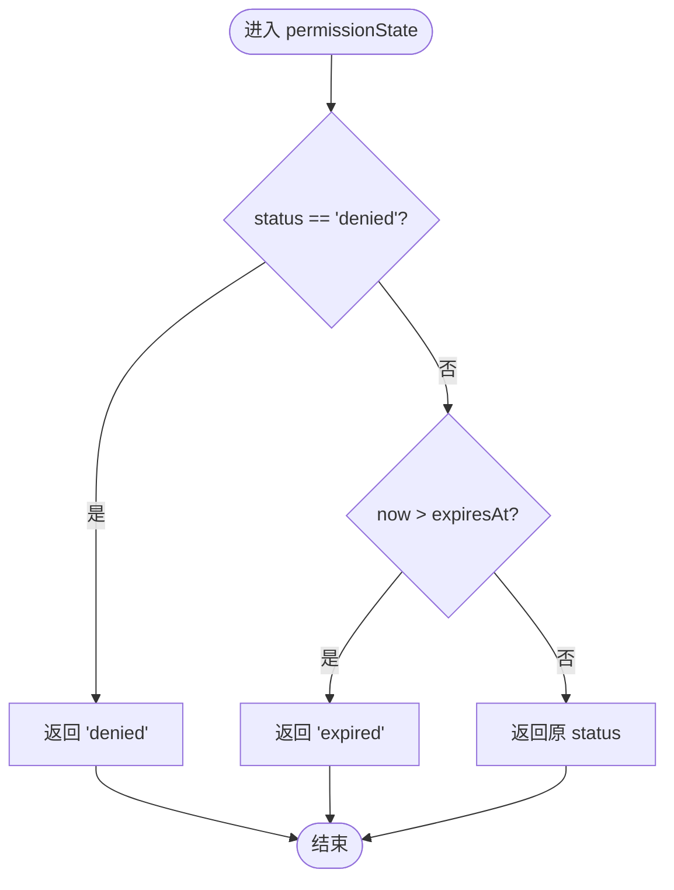
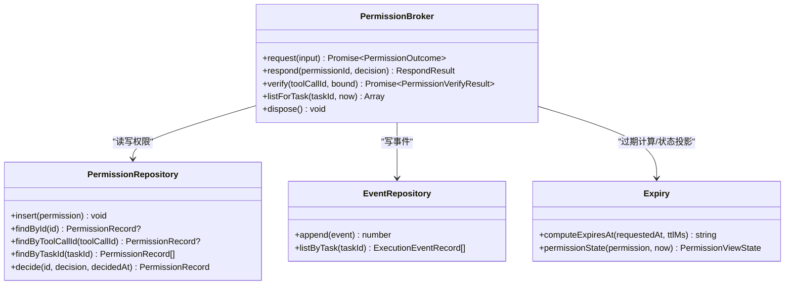
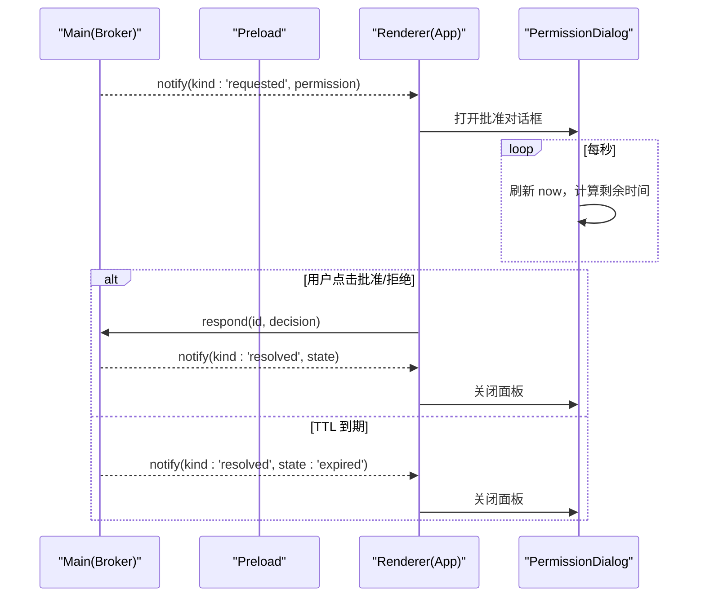
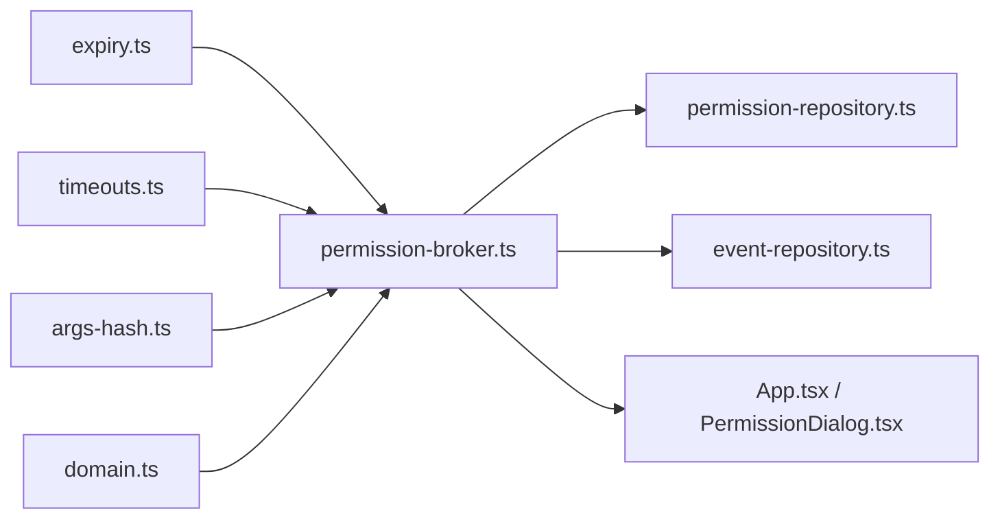

# 过期管理

<cite>
**本文引用的文件**
- [expiry.ts](file://apps/desktop/src/main/permission/expiry.ts)
- [permission-broker.ts](file://apps/desktop/src/main/permission/permission-broker.ts)
- [permission-repository.ts](file://apps/desktop/src/main/product-state/permission-repository.ts)
- [event-repository.ts](file://apps/desktop/src/main/product-state/event-repository.ts)
- [domain.ts](file://apps/desktop/src/shared/domain.ts)
- [args-hash.ts](file://apps/desktop/src/main/permission/args-hash.ts)
- [timeouts.ts](file://apps/desktop/src/main/runtime/timeouts.ts)
- [App.tsx](file://apps/desktop/src/renderer/src/App.tsx)
- [PermissionDialog.tsx](file://apps/desktop/src/renderer/src/components/PermissionDialog.tsx)
- [DiagnosticsDialog.tsx](file://apps/desktop/src/renderer/src/components/DiagnosticsDialog.tsx)
- [view-model.ts](file://apps/desktop/src/renderer/src/view-model.ts)
- [preload/index.ts](file://apps/desktop/src/preload/index.ts)
- [expiry.test.ts](file://apps/desktop/src/main/permission/expiry.test.ts)
- [permission-broker.test.ts](file://apps/desktop/src/main/permission/permission-broker.test.ts)
</cite>

## 目录
1. [简介](#简介)
2. [项目结构](#项目结构)
3. [核心组件](#核心组件)
4. [架构总览](#架构总览)
5. [详细组件分析](#详细组件分析)
6. [依赖关系分析](#依赖关系分析)
7. [性能与监控](#性能与监控)
8. [故障排查指南](#故障排查指南)
9. [结论](#结论)
10. [附录：自定义策略与示例](#附录：自定义策略与示例)

## 简介
本文件系统性阐述权限过期管理机制，覆盖 TTL 配置、过期时间计算、状态投影、事件通知、清理策略以及可观测性与优化建议。目标是帮助读者理解“为什么这样设计”和“如何扩展或调整”。

## 项目结构
权限过期管理主要分布在主进程（main）的权限模块与产品状态层，渲染进程（renderer）负责 UI 展示与用户交互。关键路径如下：
- 过期计算与状态投影：expiry.ts
- 权限生命周期与事件：permission-broker.ts
- 持久化与查询：permission-repository.ts、event-repository.ts
- 领域模型与类型：domain.ts
- 参数指纹与防篡改校验：args-hash.ts
- 超时联动：timeouts.ts
- UI 展示与交互：App.tsx、PermissionDialog.tsx、DiagnosticsDialog.tsx

图表来源
- [expiry.ts:1-26](file://apps/desktop/src/main/permission/expiry.ts#L1-L26)
- [permission-broker.ts:1-327](file://apps/desktop/src/main/permission/permission-broker.ts#L1-L327)
- [permission-repository.ts:1-134](file://apps/desktop/src/main/product-state/permission-repository.ts#L1-L134)
- [event-repository.ts:1-67](file://apps/desktop/src/main/product-state/event-repository.ts#L1-L67)
- [args-hash.ts:1-32](file://apps/desktop/src/main/permission/args-hash.ts#L1-L32)
- [timeouts.ts:1-16](file://apps/desktop/src/main/runtime/timeouts.ts#L1-L16)
- [App.tsx:117-156](file://apps/desktop/src/renderer/src/App.tsx#L117-L156)
- [PermissionDialog.tsx:38-59](file://apps/desktop/src/renderer/src/components/PermissionDialog.tsx#L38-L59)
- [DiagnosticsDialog.tsx:106-125](file://apps/desktop/src/renderer/src/components/DiagnosticsDialog.tsx#L106-L125)

章节来源
- [expiry.ts:1-26](file://apps/desktop/src/main/permission/expiry.ts#L1-L26)
- [permission-broker.ts:1-327](file://apps/desktop/src/main/permission/permission-broker.ts#L1-L327)
- [permission-repository.ts:1-134](file://apps/desktop/src/main/product-state/permission-repository.ts#L1-L134)
- [event-repository.ts:1-67](file://apps/desktop/src/main/product-state/event-repository.ts#L1-L67)
- [domain.ts:52-94](file://apps/desktop/src/shared/domain.ts#L52-L94)
- [args-hash.ts:1-32](file://apps/desktop/src/main/permission/args-hash.ts#L1-L32)
- [timeouts.ts:1-16](file://apps/desktop/src/main/runtime/timeouts.ts#L1-L16)
- [App.tsx:117-156](file://apps/desktop/src/renderer/src/App.tsx#L117-L156)
- [PermissionDialog.tsx:38-59](file://apps/desktop/src/renderer/src/components/PermissionDialog.tsx#L38-L59)
- [DiagnosticsDialog.tsx:106-125](file://apps/desktop/src/renderer/src/components/DiagnosticsDialog.tsx#L106-L125)

## 核心组件
- 过期计算与状态投影（expiry.ts）
  - 提供默认 TTL 常量与 computeExpiresAt()、permissionState()。
  - 过期时间基于 requestedAt + TTL；状态投影将 pending/approved 在 now > expiresAt 时投影为 expired，denied 不受过期影响。
- 权限代理（permission-broker.ts）
  - 创建权限记录、落库、写事件、推送 UI、挂起等待用户决策、到期自动结算并触发 EXPIRED 事件。
  - verify() 在执行前进行六步校验，包含过期检查。
- 数据持久化（permission-repository.ts、event-repository.ts）
  - 权限表不存储 expired 状态，仅存 status 与 expiresAt；expired 由查询时投影得出。
  - 事件表记录 REQUESTED、DECISION、EXPIRED 等事件。
- 参数指纹（args-hash.ts）
  - 规范化参数并生成哈希，用于防篡改校验。
- 运行时超时联动（timeouts.ts）
  - HOST_TOOL_TIMEOUT_MS = PERMISSION_TTL_MS + 余量，确保 Python 侧不会早于 TS 侧结束。
- UI（App.tsx、PermissionDialog.tsx、DiagnosticsDialog.tsx）
  - 订阅授权通知，处理 resolved（含 expired），显示倒计时，禁用过期窗口按钮，诊断页展示带过期投影的状态。
  - PermissionDialog 明确展示「过期时间」（expiresAt 的本地化格式）与「剩余时间」（formatRemaining 的 mm:ss 倒计时）两行；窗口已过时提示“批准窗口已关闭，等待主进程结算。这个操作不会被执行。”

章节来源
- [expiry.ts:1-26](file://apps/desktop/src/main/permission/expiry.ts#L1-L26)
- [permission-broker.ts:1-327](file://apps/desktop/src/main/permission/permission-broker.ts#L1-L327)
- [permission-repository.ts:1-134](file://apps/desktop/src/main/product-state/permission-repository.ts#L1-L134)
- [event-repository.ts:1-67](file://apps/desktop/src/main/product-state/event-repository.ts#L1-L67)
- [args-hash.ts:1-32](file://apps/desktop/src/main/permission/args-hash.ts#L1-L32)
- [timeouts.ts:1-16](file://apps/desktop/src/main/runtime/timeouts.ts#L1-L16)
- [App.tsx:117-156](file://apps/desktop/src/renderer/src/App.tsx#L117-L156)
- [PermissionDialog.tsx:38-59](file://apps/desktop/src/renderer/src/components/PermissionDialog.tsx#L38-L59)
- [PermissionDialog.tsx:123-148](file://apps/desktop/src/renderer/src/components/PermissionDialog.tsx#L123-L148)
- [view-model.ts:106-118](file://apps/desktop/src/renderer/src/view-model.ts#L106-L118)
- [DiagnosticsDialog.tsx:106-125](file://apps/desktop/src/renderer/src/components/DiagnosticsDialog.tsx#L106-L125)

## 架构总览
下图展示了从发起权限请求到过期处理的完整时序，包括 UI 通知、事件记录与挂起任务结算。

图表来源
- [permission-broker.ts:133-181](file://apps/desktop/src/main/permission/permission-broker.ts#L133-L181)
- [permission-broker.ts:183-234](file://apps/desktop/src/main/permission/permission-broker.ts#L183-L234)
- [event-repository.ts:52-67](file://apps/desktop/src/main/product-state/event-repository.ts#L52-L67)
- [App.tsx:117-156](file://apps/desktop/src/renderer/src/App.tsx#L117-L156)

## 详细组件分析

### 过期计算与状态投影（expiry.ts）
- 默认 TTL：PERMISSION_TTL_MS 为 5 分钟。
- computeExpiresAt(requestedAt, ttlMs)：以 requestedAt 为基准，加上 ttlMs 得到 ISO 字符串形式的 expiresAt。支持任意 TTL，包括 0 或负数场景（由调用方控制）。
- permissionState(permission, now)：
  - denied 始终返回 denied（终局结论不被过期改写）。
  - 若 now > expiresAt，则返回 expired。
  - 否则返回原始 status（pending/approved）。

图表来源
- [expiry.ts:18-26](file://apps/desktop/src/main/permission/expiry.ts#L18-L26)

章节来源
- [expiry.ts:1-26](file://apps/desktop/src/main/permission/expiry.ts#L1-L26)
- [expiry.test.ts:25-91](file://apps/desktop/src/main/permission/expiry.test.ts#L25-L91)

### 权限代理与生命周期（permission-broker.ts）
- request(input)：
  - 生成唯一 id、参数指纹、source/target 路径，构造 PermissionRecord。
  - 使用 computeExpiresAt(requestedAt, ttlMs) 计算 expiresAt。
  - 写入权限表与 REQUESTED 事件，推送 UI。
  - 设置 setTimeout(ttlMs) 挂起等待；若超时则删除挂起项、记录 EXPIRED 事件、推送 UI 并返回失败结果。
- respond(permissionId, decision)：
  - 幂等性：重复提交相同结论无副作用。
  - 已决定且不同结论：拒绝。
  - 不在 pending 中：返回过期错误。
  - 成功：更新状态、写 DECISION 事件、推送 UI、结算挂起 Promise。
- verify(toolCallId, bound)：
  - 六步校验：存在性、approved、过期、toolCallId 匹配、参数哈希匹配、路径安全。
- listForTask(taskId, now)：
  - 返回该任务的所有权限记录，并附加 projection 后的 state。
- dispose()：
  - 清理所有挂起定时器与 Map，避免内存泄漏。

图表来源
- [permission-broker.ts:61-76](file://apps/desktop/src/main/permission/permission-broker.ts#L61-L76)
- [permission-broker.ts:133-257](file://apps/desktop/src/main/permission/permission-broker.ts#L133-L257)
- [permission-repository.ts:24-35](file://apps/desktop/src/main/product-state/permission-repository.ts#L24-L35)
- [event-repository.ts:9-12](file://apps/desktop/src/main/product-state/event-repository.ts#L9-L12)
- [expiry.ts:11-26](file://apps/desktop/src/main/permission/expiry.ts#L11-L26)

章节来源
- [permission-broker.ts:1-327](file://apps/desktop/src/main/permission/permission-broker.ts#L1-L327)
- [permission-repository.ts:1-134](file://apps/desktop/src/main/product-state/permission-repository.ts#L1-L134)
- [event-repository.ts:1-67](file://apps/desktop/src/main/product-state/event-repository.ts#L1-L67)
- [args-hash.ts:1-32](file://apps/desktop/src/main/permission/args-hash.ts#L1-L32)

### 事件与 UI 通知
- 事件类型：
  - REQUESTED：权限申请时写入。
  - DECISION：用户批准后写入。
  - EXPIRED：TTL 到期未响应时写入。
- UI 通知：
  - Renderer 订阅 onPermissionNotice（personal-agent:permission-notice，全应用唯一一个 main → renderer 推送通道；PermissionNotice 载荷定义在 shared/domain.ts，preload 原样转发）：requested 时把完整 PermissionRecord 存入 pendingPermission 并弹出对话框；resolved 时用函数式 setState 按 permissionId 比对当前记录再关闭面板，避免读到订阅那一刻的闭包旧值。
  - PermissionDialog 每秒刷新当前时间，用 formatRemaining 计算 mm:ss 剩余时间；过期后只禁用按钮并显示警示，不替主进程下结论——结算等待 broker 推送的 resolved（state:'expired'）。
  - 对话框同时展示「过期时间」一行（expiresAt 的本地化格式，解析失败时原样显示字符串），用户可核对绝对截止时刻而不仅依赖倒计时。
  - DiagnosticsDialog 在选中会话时调用 listPermissions（走 broker.listForTask），状态列显示带过期投影的 PermissionViewState（含「已过期」），便于观察。

图表来源
- [permission-broker.ts:153-180](file://apps/desktop/src/main/permission/permission-broker.ts#L153-L180)
- [permission-broker.ts:213-234](file://apps/desktop/src/main/permission/permission-broker.ts#L213-L234)
- [App.tsx:117-156](file://apps/desktop/src/renderer/src/App.tsx#L117-L156)
- [PermissionDialog.tsx:38-59](file://apps/desktop/src/renderer/src/components/PermissionDialog.tsx#L38-L59)

章节来源
- [permission-broker.ts:153-234](file://apps/desktop/src/main/permission/permission-broker.ts#L153-L234)
- [App.tsx:117-156](file://apps/desktop/src/renderer/src/App.tsx#L117-L156)
- [PermissionDialog.tsx:38-59](file://apps/desktop/src/renderer/src/components/PermissionDialog.tsx#L38-L59)
- [PermissionDialog.tsx:123-148](file://apps/desktop/src/renderer/src/components/PermissionDialog.tsx#L123-L148)
- [view-model.ts:106-118](file://apps/desktop/src/renderer/src/view-model.ts#L106-L118)
- [preload/index.ts:45-55](file://apps/desktop/src/preload/index.ts#L45-L55)
- [domain.ts:86-94](file://apps/desktop/src/shared/domain.ts#L86-L94)
- [DiagnosticsDialog.tsx:106-125](file://apps/desktop/src/renderer/src/components/DiagnosticsDialog.tsx#L106-L125)
- [DiagnosticsDialog.tsx:156-171](file://apps/desktop/src/renderer/src/components/DiagnosticsDialog.tsx#L156-L171)

### 过期权限的清理策略
- 内存清理：
  - dispose() 会清除所有挂起的定时器与 pending Map，防止应用退出或窗口关闭后继续触发过期逻辑。
- 数据库处理：
  - 过期不修改数据库中的 status 与 decidedAt，保持 pending/null。expired 仅在查询时通过 permissionState() 投影得出。
  - 这避免了将“瞬时状态”持久化导致的约束冲突与语义不一致。
- 执行前校验：
  - verify() 会在执行前再次检查过期，确保即使批准过期的权限也不会被放行。

章节来源
- [permission-broker.ts:253-256](file://apps/desktop/src/main/permission/permission-broker.ts#L253-L256)
- [permission-broker.ts:283-327](file://apps/desktop/src/main/permission/permission-broker.ts#L283-L327)
- [permission-repository.ts:57-81](file://apps/desktop/src/main/product-state/permission-repository.ts#L57-L81)
- [expiry.ts:18-26](file://apps/desktop/src/main/permission/expiry.ts#L18-L26)

### 可配置的 TTL 机制
- 默认值：
  - PERMISSION_TTL_MS = 5 分钟。
  - HOST_TOOL_TIMEOUT_MS = PERMISSION_TTL_MS + 5 秒余量，保证 Python 侧不会早于 TS 侧结束。
- 注入点：
  - createPermissionBroker(deps) 支持 deps.ttlMs 覆盖默认 TTL。
  - computeExpiresAt(requestedAt, ttlMs) 允许按能力或场景传入不同 TTL。
- 环境特定配置建议：
  - 可通过环境变量或配置文件在启动时注入不同的 ttlMs，例如测试环境缩短 TTL 以加速用例。
  - 对耗时较长的能力，可在调用处传入更大的 TTL，但需同步评估 RUN_TASK_TIMEOUT_MS 是否仍满足不等式。

章节来源
- [expiry.ts:6-12](file://apps/desktop/src/main/permission/expiry.ts#L6-L12)
- [permission-broker.ts:46-59](file://apps/desktop/src/main/permission/permission-broker.ts#L46-L59)
- [permission-broker.ts:100-104](file://apps/desktop/src/main/permission/permission-broker.ts#L100-L104)
- [timeouts.ts:1-16](file://apps/desktop/src/main/runtime/timeouts.ts#L1-L16)

## 依赖关系分析
- expiry.ts 被 permission-broker.ts 与 timeouts.ts 引用，作为 TTL 与过期计算的单一事实源。
- permission-broker.ts 依赖：
  - permission-repository.ts：读写权限记录。
  - event-repository.ts：写入/读取事件。
  - args-hash.ts：参数指纹与哈希。
  - domain.ts：类型定义。
- renderer 通过 IPC 与 main 通信，订阅通知并驱动 UI。

图表来源
- [expiry.ts:1-26](file://apps/desktop/src/main/permission/expiry.ts#L1-L26)
- [permission-broker.ts:1-327](file://apps/desktop/src/main/permission/permission-broker.ts#L1-L327)
- [timeouts.ts:1-16](file://apps/desktop/src/main/runtime/timeouts.ts#L1-L16)
- [args-hash.ts:1-32](file://apps/desktop/src/main/permission/args-hash.ts#L1-L32)
- [domain.ts:52-94](file://apps/desktop/src/shared/domain.ts#L52-L94)

章节来源
- [permission-broker.ts:1-327](file://apps/desktop/src/main/permission/permission-broker.ts#L1-L327)
- [expiry.ts:1-26](file://apps/desktop/src/main/permission/expiry.ts#L1-L26)
- [timeouts.ts:1-16](file://apps/desktop/src/main/runtime/timeouts.ts#L1-L16)
- [args-hash.ts:1-32](file://apps/desktop/src/main/permission/args-hash.ts#L1-L32)
- [domain.ts:52-94](file://apps/desktop/src/shared/domain.ts#L52-L94)

## 性能与监控
- 性能要点
  - 过期判定为 O(1) 比较，开销极低。
  - 每个 pending 请求一个定时器，批量请求时需关注定时器数量与清理时机（dispose）。
  - 参数指纹与哈希计算为 CPU 密集型，但通常单次调用开销可忽略。
- 监控指标建议
  - 过期率：EXPIRED 事件数 / REQUESTED 事件数。
  - 平均响应时间：DECISION 事件 occurredAt - REQUESTED 事件 occurredAt。
  - 超时分布：统计各能力的 TTL 与实际响应时长分位。
  - 资源占用：pending Map 大小与活跃定时器数量。
- 优化建议
  - 合理设置 TTL：高频短操作可缩短 TTL，降低 UI 负担；长耗时能力适当延长 TTL。
  - 批量化 UI 更新：合并多次通知，减少重绘。
  - 延迟加载诊断数据：按需拉取 listForTask，避免频繁查询。
  - 定期清理历史事件与权限记录：归档或压缩旧数据，控制数据库体积。

[本节为通用指导，不直接分析具体文件]

## 故障排查指南
- 常见问题
  - 批准窗口已关闭：respond 返回 PERMISSION_EXPIRED，检查是否在 TTL 内响应。
  - 状态冲突：同一权限已被决定为不同结论，需确认 UI 去重与幂等。
  - 参数不匹配：verify 报 PERMISSION_TAMPERED，检查 argsCanonical 与 argsHash 一致性。
  - 路径越界：verify 路径复查失败，检查 root 与 source/target 路径。
- 定位步骤
  - 查看事件流：REQUESTED -> DECISION/EXPIRED，确认时间线。
  - 检查过期投影：listForTask 返回的 state 是否为 expired。
  - 核对 TTL：确认注入的 ttlMs 与预期一致。
  - 验证 dispose：应用退出时是否清除了定时器。

章节来源
- [permission-broker.ts:183-234](file://apps/desktop/src/main/permission/permission-broker.ts#L183-L234)
- [permission-broker.ts:283-327](file://apps/desktop/src/main/permission/permission-broker.ts#L283-L327)
- [permission-broker.test.ts:362-468](file://apps/desktop/src/main/permission/permission-broker.test.ts#L362-L468)

## 结论
本系统采用“落库不存过期状态、查询时投影”的设计，既保证了数据完整性，又简化了状态机复杂度。通过可注入 TTL、严格的事件记录与 UI 通知，实现了可控、可观测、可扩展的权限过期管理。结合运行时超时联动，确保跨进程协作的一致性。

[本节为总结，不直接分析具体文件]

## 附录：自定义策略与示例
- 自定义 TTL
  - 在 createPermissionBroker 中注入 deps.ttlMs，实现全局策略切换。
  - 在 computeExpiresAt 中传入不同 ttlMs，实现按能力差异化 TTL。
- 过期重试逻辑
  - 建议在调用方捕获 PERMISSION_EXPIRED，根据业务策略决定是否重试（如重新发起请求）。
  - 注意避免无限重试，应加入退避与上限。
- 不同 TTL 策略示例思路
  - 快速工具调用：TTL=1s，提升用户体验。
  - 复杂文件操作：TTL=30s，给予用户足够审批时间。
  - 后台任务：TTL=0 或极短，立即失败以便快速反馈。
- 监控与告警
  - 当过期率突增时，触发告警，提示 UI 或网络问题。
  - 跟踪不同能力的 TTL 命中率，优化策略。

[本节为概念性内容，不直接分析具体文件]