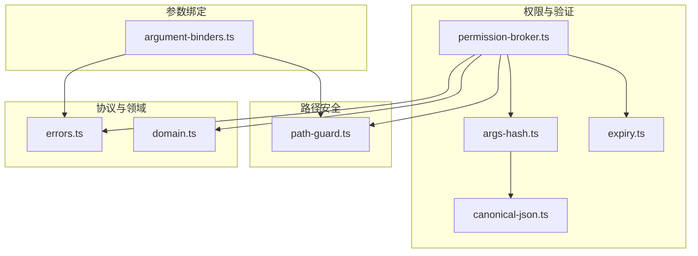
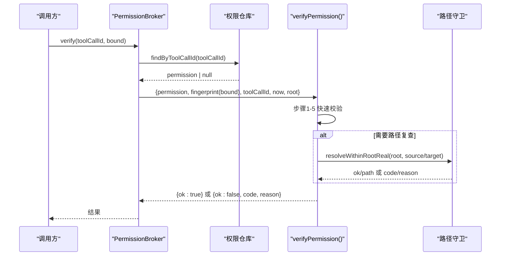
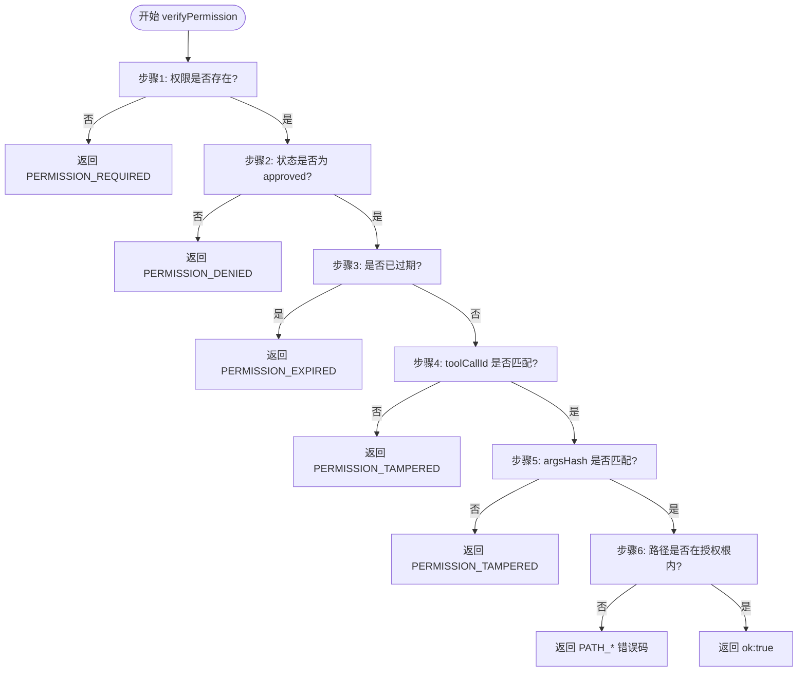
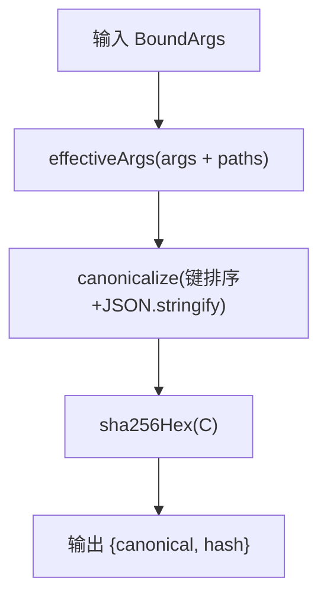
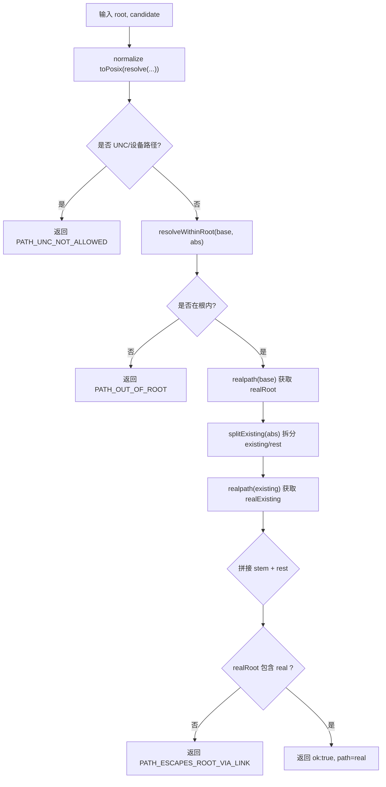
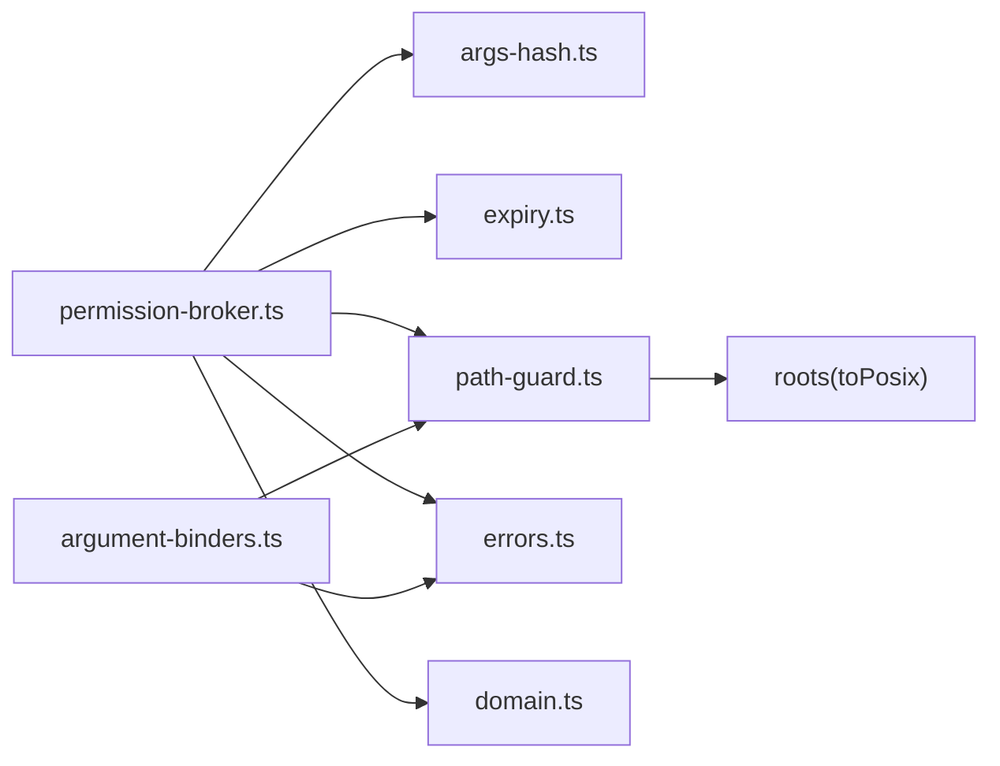

# 验证引擎

<cite>
**本文引用的文件**
- [apps/desktop/src/main/permission/permission-broker.ts](file://apps/desktop/src/main/permission/permission-broker.ts)
- [apps/desktop/src/main/permission/args-hash.ts](file://apps/desktop/src/main/permission/args-hash.ts)
- [apps/desktop/src/main/permission/canonical-json.ts](file://apps/desktop/src/main/permission/canonical-json.ts)
- [apps/desktop/src/main/permission/expiry.ts](file://apps/desktop/src/main/permission/expiry.ts)
- [apps/desktop/src/main/capabilities/path-guard.ts](file://apps/desktop/src/main/capabilities/path-guard.ts)
- [packages/protocol/schemas/errors.ts](file://packages/protocol/schemas/errors.ts)
- [apps/desktop/src/shared/domain.ts](file://apps/desktop/src/shared/domain.ts)
- [apps/desktop/src/main/policy/argument-binders.ts](file://apps/desktop/src/main/policy/argument-binders.ts)
- [apps/desktop/src/main/permission/permission-broker.test.ts](file://apps/desktop/src/main/permission/permission-broker.test.ts)
- [apps/desktop/src/main/capabilities/path-guard.test.ts](file://apps/desktop/src/main/capabilities/path-guard.test.ts)
</cite>

## 目录
1. [简介](#简介)
2. [项目结构](#项目结构)
3. [核心组件](#核心组件)
4. [架构总览](#架构总览)
5. [详细组件分析](#详细组件分析)
6. [依赖关系分析](#依赖关系分析)
7. [性能考虑](#性能考虑)
8. [故障排除指南](#故障排除指南)
9. [结论](#结论)
10. [附录：扩展与自定义示例](#附录：扩展与自定义示例)

## 简介
本文件围绕“执行前的六步验证机制”展开，系统性说明权限存在性检查、状态验证、过期检查、工具调用ID匹配、参数哈希验证和路径安全检查的实现原理与安全意义。重点解释 verifyPermission() 的逐层校验流程、参数指纹重算机制（确保执行时参数与审批时完全一致）、路径安全验证（根目录限制、路径解析与越权防护），以及不同错误码的含义与处理策略。文末提供扩展自定义规则、优化建议与故障排除方法。

## 项目结构
验证引擎位于桌面端主进程，围绕“权限请求—批准—执行前验证”的主线组织代码：
- 权限代理与验证：permission-broker.ts
- 参数指纹与规范化：args-hash.ts、canonical-json.ts
- 有效期与状态投影：expiry.ts
- 路径安全守卫：path-guard.ts
- 错误码定义：errors.ts
- 领域模型：domain.ts
- 参数绑定器（为权限指纹提供规范化后的路径）：argument-binders.ts
- 测试用例覆盖关键分支：permission-broker.test.ts、path-guard.test.ts

图表来源
- [apps/desktop/src/main/permission/permission-broker.ts:235-319](file://apps/desktop/src/main/permission/permission-broker.ts#L235-L319)
- [apps/desktop/src/main/permission/args-hash.ts:18-32](file://apps/desktop/src/main/permission/args-hash.ts#L18-L32)
- [apps/desktop/src/main/permission/canonical-json.ts:1-21](file://apps/desktop/src/main/permission/canonical-json.ts#L1-L21)
- [apps/desktop/src/main/permission/expiry.ts:1-27](file://apps/desktop/src/main/permission/expiry.ts#L1-L27)
- [apps/desktop/src/main/capabilities/path-guard.ts:1-126](file://apps/desktop/src/main/capabilities/path-guard.ts#L1-L126)
- [packages/protocol/schemas/errors.ts:1-30](file://packages/protocol/schemas/errors.ts#L1-L30)
- [apps/desktop/src/shared/domain.ts:52-95](file://apps/desktop/src/shared/domain.ts#L52-L95)
- [apps/desktop/src/main/policy/argument-binders.ts:15-26](file://apps/desktop/src/main/policy/argument-binders.ts#L15-L26)

章节来源
- [apps/desktop/src/main/permission/permission-broker.ts:235-319](file://apps/desktop/src/main/permission/permission-broker.ts#L235-L319)
- [apps/desktop/src/main/capabilities/path-guard.ts:1-126](file://apps/desktop/src/main/capabilities/path-guard.ts#L1-L126)
- [apps/desktop/src/main/permission/args-hash.ts:18-32](file://apps/desktop/src/main/permission/args-hash.ts#L18-L32)
- [apps/desktop/src/main/permission/expiry.ts:1-27](file://apps/desktop/src/main/permission/expiry.ts#L1-L27)
- [packages/protocol/schemas/errors.ts:1-30](file://packages/protocol/schemas/errors.ts#L1-L30)
- [apps/desktop/src/shared/domain.ts:52-95](file://apps/desktop/src/shared/domain.ts#L52-L95)
- [apps/desktop/src/main/policy/argument-binders.ts:15-26](file://apps/desktop/src/main/policy/argument-binders.ts#L15-L26)

## 核心组件
- 权限代理 PermissionBroker：负责创建权限记录、等待用户决策、执行前验证、列表查询与资源清理。
- 参数指纹 ArgumentFingerprint：对规范化后的参数计算唯一字符串与哈希，用于审批与执行一致性校验。
- 路径守卫 PathGuard：在授权根内做路径合法性检查，防止越界、UNC/设备路径、符号链接逃逸等风险。
- 过期与状态 Expiry：计算有效期与视图状态（pending/approved/denied/expired）。
- 错误码 Errors：统一错误码常量，贯穿各模块。
- 领域 Domain：权限记录、通知、任务状态等类型定义。
- 参数绑定 ArgumentBinders：将原始参数契约化并规范化路径，产出 BoundArgs 供权限与执行使用。

章节来源
- [apps/desktop/src/main/permission/permission-broker.ts:27-75](file://apps/desktop/src/main/permission/permission-broker.ts#L27-L75)
- [apps/desktop/src/main/permission/args-hash.ts:6-32](file://apps/desktop/src/main/permission/args-hash.ts#L6-L32)
- [apps/desktop/src/main/capabilities/path-guard.ts:6-126](file://apps/desktop/src/main/capabilities/path-guard.ts#L6-L126)
- [apps/desktop/src/main/permission/expiry.ts:1-27](file://apps/desktop/src/main/permission/expiry.ts#L1-L27)
- [packages/protocol/schemas/errors.ts:1-30](file://packages/protocol/schemas/errors.ts#L1-L30)
- [apps/desktop/src/shared/domain.ts:52-95](file://apps/desktop/src/shared/domain.ts#L52-L95)
- [apps/desktop/src/main/policy/argument-binders.ts:15-26](file://apps/desktop/src/main/policy/argument-binders.ts#L15-L26)

## 架构总览
执行前验证由 PermissionBroker.verify() 委托给 verifyPermission() 完成，后者按顺序执行六步校验：
1) 权限存在性检查
2) 状态验证（必须为 approved）
3) 过期检查（基于 now 与 expiresAt）
4) 工具调用ID匹配（toolCallId）
5) 参数哈希验证（argsHash vs 当前指纹）
6) 路径安全检查（sourcePaths 与 targetPath 均在授权根内）

图表来源
- [apps/desktop/src/main/permission/permission-broker.ts:235-319](file://apps/desktop/src/main/permission/permission-broker.ts#L235-L319)
- [apps/desktop/src/main/capabilities/path-guard.ts:70-126](file://apps/desktop/src/main/capabilities/path-guard.ts#L70-L126)

## 详细组件分析

### 执行前的六步验证机制（verifyPermission）
- 步骤1：权限存在性检查
  - 若 permission 为 null，返回 PERMISSION_REQUIRED。
  - 安全意义：防止未申请或未落库的调用被放行。
- 步骤2：状态验证
  - 仅当 status === 'approved' 才继续；否则返回 PERMISSION_DENIED。
  - 安全意义：拒绝被明确拒绝的记录，避免误用。
- 步骤3：过期检查
  - 使用 expiry.permissionState(permission, now) 判断是否 expired。
  - 安全意义：防止过期权限被重用。
- 步骤4：工具调用ID匹配
  - 比较 permission.toolCallId 与本次调用的 toolCallId。
  - 安全意义：防止跨调用复用权限（防重放/串用）。
- 步骤5：参数哈希验证
  - 对当前 bound 重新计算指纹，对比 permission.argsHash。
  - 安全意义：确保执行时的参数与审批时完全一致，防止参数篡改。
- 步骤6：路径安全检查
  - 遍历 sourcePaths，必要时检查 targetPath，均须通过 resolveWithinRootReal。
  - 安全意义：确保所有受控路径在授权根内，防止越权访问。

图表来源
- [apps/desktop/src/main/permission/permission-broker.ts:275-319](file://apps/desktop/src/main/permission/permission-broker.ts#L275-L319)
- [apps/desktop/src/main/permission/expiry.ts:18-26](file://apps/desktop/src/main/permission/expiry.ts#L18-L26)
- [apps/desktop/src/main/capabilities/path-guard.ts:70-126](file://apps/desktop/src/main/capabilities/path-guard.ts#L70-L126)

章节来源
- [apps/desktop/src/main/permission/permission-broker.ts:275-319](file://apps/desktop/src/main/permission/permission-broker.ts#L275-L319)
- [apps/desktop/src/main/permission/expiry.ts:18-26](file://apps/desktop/src/main/permission/expiry.ts#L18-L26)
- [apps/desktop/src/main/capabilities/path-guard.ts:70-126](file://apps/desktop/src/main/capabilities/path-guard.ts#L70-L126)

### 参数指纹重算机制（fingerprintArguments）
- 目标：生成稳定、可复现的参数指纹，使“审批时”与“执行时”的参数具有可比性。
- 实现要点：
  - effectiveArgs：合并 args 与 paths，paths 覆盖同名路径字段，保证以规范化路径为准。
  - canonicalize：对对象键排序后序列化，消除键序差异导致的哈希变化。
  - sha256Hex：对规范化字符串计算 SHA-256 十六进制哈希。
- 安全意义：任何参数变更都会导致哈希不一致，从而触发 PERMISSION_TAMPERED，阻断执行。

图表来源
- [apps/desktop/src/main/permission/args-hash.ts:18-32](file://apps/desktop/src/main/permission/args-hash.ts#L18-L32)
- [apps/desktop/src/main/permission/canonical-json.ts:1-21](file://apps/desktop/src/main/permission/canonical-json.ts#L1-L21)

章节来源
- [apps/desktop/src/main/permission/args-hash.ts:18-32](file://apps/desktop/src/main/permission/args-hash.ts#L18-L32)
- [apps/desktop/src/main/permission/canonical-json.ts:1-21](file://apps/desktop/src/main/permission/canonical-json.ts#L1-L21)

### 路径安全验证（resolveWithinRootReal）
- 目标：确保所有受控路径严格位于授权根内，即使存在符号链接/junction/UNC/设备路径也不得逃逸。
- 关键逻辑：
  - 拒绝 UNC 和设备路径（PATH_UNC_NOT_ALLOWED）。
  - 先做字符串级归属检查（resolveWithinRoot），不在根内直接拒绝（PATH_OUT_OF_ROOT）。
  - 对根和目标分别 realpath：根不可用则拒绝；目标不存在时只对最近存在的祖先做 realpath，未存在段原样拼接。
  - 再次比对 realpath 后的路径是否在 realRoot 内，防止链接逃逸（PATH_ESCAPES_ROOT_VIA_LINK）。
  - 返回真实路径，便于下游直接使用，避免二次 resolve 造成日志与实际不一致。
- 安全意义：从词法到物理层面双重保障，抵御路径穿越、链接逃逸、UNC 滥用等攻击面。

图表来源
- [apps/desktop/src/main/capabilities/path-guard.ts:7-17](file://apps/desktop/src/main/capabilities/path-guard.ts#L7-L17)
- [apps/desktop/src/main/capabilities/path-guard.ts:44-59](file://apps/desktop/src/main/capabilities/path-guard.ts#L44-L59)
- [apps/desktop/src/main/capabilities/path-guard.ts:70-126](file://apps/desktop/src/main/capabilities/path-guard.ts#L70-L126)

章节来源
- [apps/desktop/src/main/capabilities/path-guard.ts:7-17](file://apps/desktop/src/main/capabilities/path-guard.ts#L7-L17)
- [apps/desktop/src/main/capabilities/path-guard.ts:44-59](file://apps/desktop/src/main/capabilities/path-guard.ts#L44-L59)
- [apps/desktop/src/main/capabilities/path-guard.ts:70-126](file://apps/desktop/src/main/capabilities/path-guard.ts#L70-L126)

### 错误码含义与处理策略
- PERMISSION_REQUIRED：未找到对应权限记录（步骤1失败）。处理：提示需先申请权限。
- PERMISSION_DENIED：权限状态不是 approved（步骤2失败）。处理：告知用户已被拒绝。
- PERMISSION_EXPIRED：权限已过期（步骤3失败）。处理：引导重新申请。
- PERMISSION_TAMPERED：toolCallId 不匹配或参数哈希不一致（步骤4/5失败）。处理：视为篡改，立即终止并告警。
- PATH_OUT_OF_ROOT / PATH_ESCAPES_ROOT_VIA_LINK / PATH_UNC_NOT_ALLOWED：路径越界或非法（步骤6失败）。处理：拒绝执行并记录审计信息。

章节来源
- [packages/protocol/schemas/errors.ts:1-30](file://packages/protocol/schemas/errors.ts#L1-L30)
- [apps/desktop/src/main/permission/permission-broker.ts:275-319](file://apps/desktop/src/main/permission/permission-broker.ts#L275-L319)

### verifyPermission() 函数实现逻辑与安全意义
- 实现要点：
  - 严格按顺序执行六步，短路返回，避免后续不必要开销。
  - 使用 expiry.permissionState 进行过期判定，兼顾 denied 与 pending 的不同语义。
  - 对 sourcePaths 逐一检查，targetPath 可选检查。
- 安全意义：
  - 顺序设计确保更严格的条件优先拦截（如 denied 优先于 expired）。
  - 结合 toolCallId 与 argsHash 双重绑定，有效防止重放与参数替换。
  - 路径守卫在真实文件系统层面二次校验，防御复杂绕过手段。

章节来源
- [apps/desktop/src/main/permission/permission-broker.ts:275-319](file://apps/desktop/src/main/permission/permission-broker.ts#L275-L319)
- [apps/desktop/src/main/permission/expiry.ts:18-26](file://apps/desktop/src/main/permission/expiry.ts#L18-L26)

### 参数绑定与权限记录的关联
- 参数绑定阶段（argument-binders）：
  - 对每个能力进行契约校验，并将路径规范化为绝对路径写入 BoundArgs.paths。
  - 权限创建时（broker.request）使用 fingerprintArguments(bound) 生成 argsCanonical 与 argsHash。
- 安全意义：
  - 审批时绑定的正是规范化后的路径与参数，执行时再重算指纹，确保“批什么、执什么”。

章节来源
- [apps/desktop/src/main/policy/argument-binders.ts:15-26](file://apps/desktop/src/main/policy/argument-binders.ts#L15-L26)
- [apps/desktop/src/main/permission/permission-broker.ts:132-179](file://apps/desktop/src/main/permission/permission-broker.ts#L132-L179)

## 依赖关系分析
- 模块耦合：
  - permission-broker 依赖 args-hash、expiry、path-guard、errors、domain。
  - argument-binders 依赖 path-guard、errors，并在绑定阶段即做路径安全校验。
  - path-guard 依赖 roots（toPosix）与文件系统 API。
- 外部依赖：
  - node:crypto（哈希）、node:fs/promises（stat/realpath）、node:path（resolve）。
- 循环依赖：无显式循环，职责清晰分层。

图表来源
- [apps/desktop/src/main/permission/permission-broker.ts:1-18](file://apps/desktop/src/main/permission/permission-broker.ts#L1-L18)
- [apps/desktop/src/main/policy/argument-binders.ts:1-12](file://apps/desktop/src/main/policy/argument-binders.ts#L1-L12)
- [apps/desktop/src/main/capabilities/path-guard.ts:1-5](file://apps/desktop/src/main/capabilities/path-guard.ts#L1-L5)

章节来源
- [apps/desktop/src/main/permission/permission-broker.ts:1-18](file://apps/desktop/src/main/permission/permission-broker.ts#L1-L18)
- [apps/desktop/src/main/policy/argument-binders.ts:1-12](file://apps/desktop/src/main/policy/argument-binders.ts#L1-L12)
- [apps/desktop/src/main/capabilities/path-guard.ts:1-5](file://apps/desktop/src/main/capabilities/path-guard.ts#L1-L5)

## 性能考虑
- 哈希计算：SHA-256 对小对象开销极低；确保 canonicalize 的键排序复杂度可控（参数规模通常很小）。
- I/O 最小化：路径检查仅在必要时进行（步骤6），且 splitExisting 仅对最近存在祖先做 stat/realpath，减少系统调用。
- 缓存与幂等：返回的真实路径可直接用于下游读取，避免重复 resolve。
- 超时控制：权限窗口默认 TTL 为 5 分钟，可通过注入 ttlMs 调整，避免长时间挂起。
- 并发安全：verifyPermission 无共享可变状态，线程安全；PermissionBroker 内部 pending Map 与定时器在 dispose 时清理。

[本节为通用指导，无需特定文件引用]

## 故障排除指南
- 常见问题定位：
  - 始终报 PERMISSION_REQUIRED：检查是否正确传入 toolCallId，以及权限是否已创建并落库。
  - 始终报 PERMISSION_DENIED：确认用户是否批准，或是否存在重复响应冲突。
  - 总是报 PERMISSION_EXPIRED：检查 now 与 expiresAt 的关系，确认时间源注入正确。
  - 总是报 PERMISSION_TAMPERED：核对 bound 是否与审批时一致，尤其是 paths 覆盖后的值。
  - 路径相关错误：检查授权根配置、符号链接/junction 指向、UNC/设备路径是否被误用。
- 调试建议：
  - 打印/记录 fingerprintArguments 的 canonical 与 hash，对比审批与执行两次的值。
  - 使用 path-guard 的单元测试场景构造边界用例（如 ..、兄弟目录、链接逃逸）。
  - 在 broker.respond 中关注 repeated 标志，避免重复写事件与推送。
- 恢复策略：
  - 对于过期或被拒：引导重新发起权限申请。
  - 对于 TAMPERED：回滚操作，记录审计日志，提示参数不一致。
  - 对于路径错误：修正路径或调整授权根范围。

章节来源
- [apps/desktop/src/main/permission/permission-broker.test.ts:470-712](file://apps/desktop/src/main/permission/permission-broker.test.ts#L470-L712)
- [apps/desktop/src/main/capabilities/path-guard.test.ts:140-293](file://apps/desktop/src/main/capabilities/path-guard.test.ts#L140-L293)

## 结论
验证引擎通过“六步验证 + 参数指纹 + 路径守卫”的组合，构建了强约束的执行前置防线。每一步都有明确的安全目标与错误码映射，既保证了安全性，又具备良好的可观测性与可扩展性。配合参数绑定阶段的规范化与路径守卫的物理层校验，能有效抵御重放、篡改、越权等常见威胁。

[本节为总结性内容，无需特定文件引用]

## 附录：扩展与自定义示例
以下示例展示如何在现有框架上扩展验证规则与路径检查逻辑。请根据实际业务需求调整。

- 自定义验证规则（在 verifyPermission 之后追加）
  - 思路：在 PermissionBroker.verify 中组装入参后，可在 verifyPermission 之外增加额外校验钩子，或在 broker.verify 中包装一层。
  - 示例要点：
    - 新增一个校验函数 checkCustomRule(bound, permission)，返回 { ok: true } 或 { ok: false, code, reason }。
    - 在 verifyPermission 返回之前调用该函数，若失败则透传错误码。
  - 参考位置：
    - [apps/desktop/src/main/permission/permission-broker.ts:235-243](file://apps/desktop/src/main/permission/permission-broker.ts#L235-L243)
    - [apps/desktop/src/main/permission/permission-broker.ts:275-319](file://apps/desktop/src/main/permission/permission-broker.ts#L275-L319)

- 扩展路径检查逻辑（在 path-guard 中新增规则）
  - 思路：在 resolveWithinRootReal 中增加新的白名单/黑名单规则，例如禁止特定后缀或特定目录。
  - 示例要点：
    - 在 realpath 前后插入额外检查，若命中则返回新的错误码（可在 errors.ts 中扩展）。
    - 保持返回路径的稳定形式，便于下游直接使用。
  - 参考位置：
    - [apps/desktop/src/main/capabilities/path-guard.ts:70-126](file://apps/desktop/src/main/capabilities/path-guard.ts#L70-L126)
    - [packages/protocol/schemas/errors.ts:1-30](file://packages/protocol/schemas/errors.ts#L1-L30)

- 添加额外的安全约束（在参数绑定阶段）
  - 思路：在 argument-binders 中为新能力增加更严格的约束，例如限制文件大小、MIME 类型、目录深度等。
  - 示例要点：
    - 在 safeParse 通过后，增加业务校验，失败返回 INVALID_ARGUMENT 或自定义错误码。
    - 将规范化后的路径写入 BoundArgs.paths，确保权限指纹一致。
  - 参考位置：
    - [apps/desktop/src/main/policy/argument-binders.ts:38-113](file://apps/desktop/src/main/policy/argument-binders.ts#L38-L113)

- 性能优化建议
  - 批量路径检查：若一次调用涉及多个路径，可并行调用 realpath/stat，但注意错误聚合。
  - 缓存 realpath 结果：对频繁访问的路径建立短期缓存，注意失效策略（如目录变动监听）。
  - 减少 JSON 序列化开销：对大型参数集合考虑分块哈希或增量校验。
  - 合理设置 TTL：根据业务交互时长调整 PERMISSION_TTL_MS，平衡用户体验与安全窗口。

- 故障排除清单
  - 确认 now 注入与系统时间一致，避免时钟漂移导致误判过期。
  - 检查 BoundArgs.paths 是否覆盖了 args 中的路径字段，确保指纹一致。
  - 对符号链接/junction 场景，优先使用 resolveWithinRootReal，避免仅做字符串比较。
  - 记录每次失败的 code 与 reason，便于快速定位问题。

章节来源
- [apps/desktop/src/main/permission/permission-broker.ts:235-319](file://apps/desktop/src/main/permission/permission-broker.ts#L235-L319)
- [apps/desktop/src/main/capabilities/path-guard.ts:70-126](file://apps/desktop/src/main/capabilities/path-guard.ts#L70-L126)
- [apps/desktop/src/main/policy/argument-binders.ts:38-113](file://apps/desktop/src/main/policy/argument-binders.ts#L38-L113)
- [packages/protocol/schemas/errors.ts:1-30](file://packages/protocol/schemas/errors.ts#L1-L30)