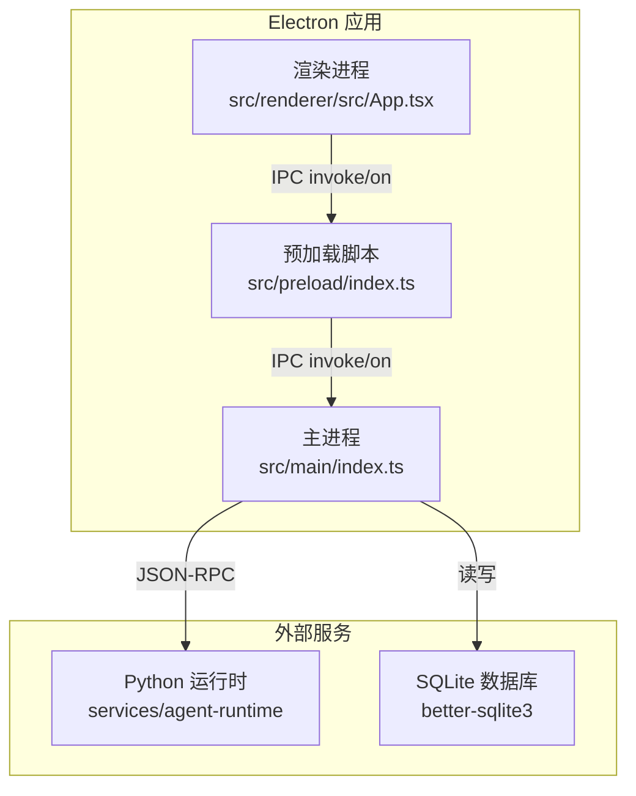
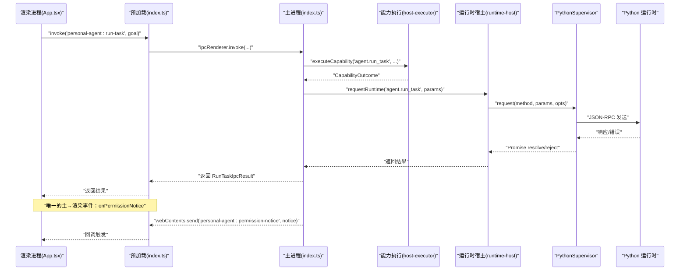
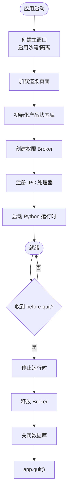
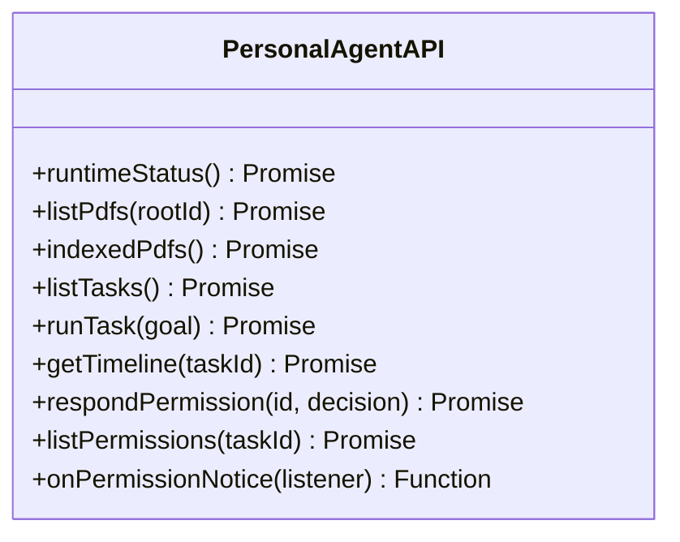
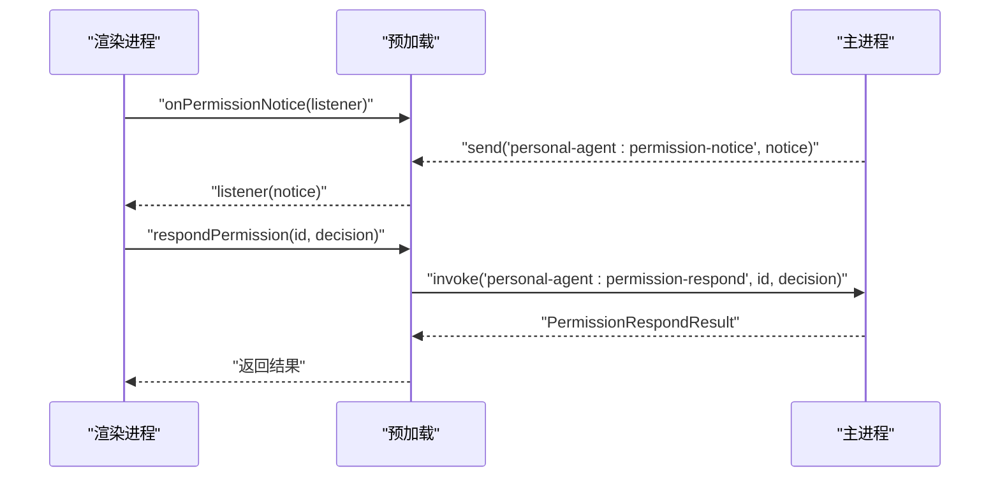
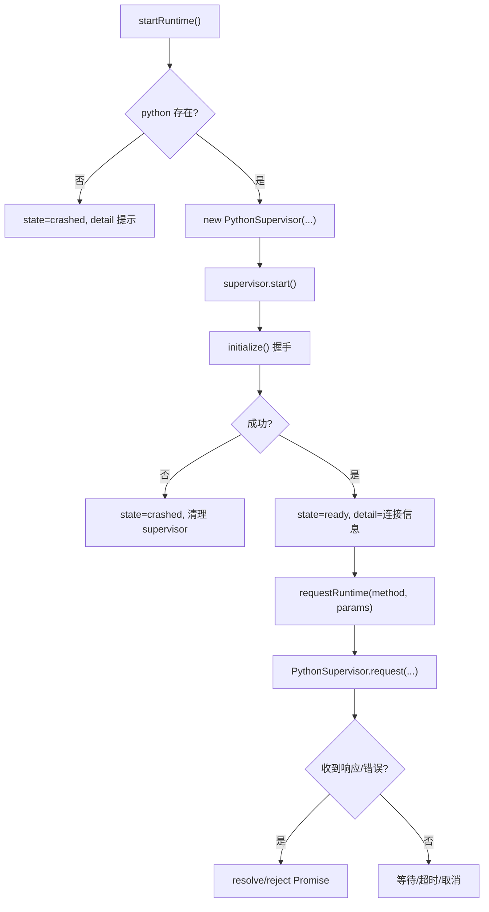
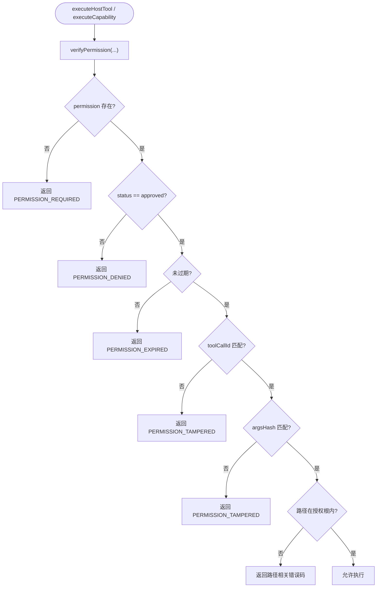
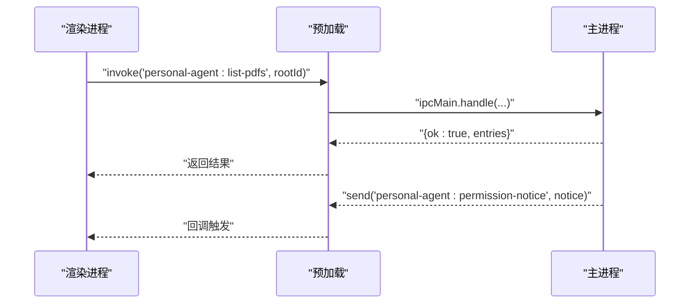
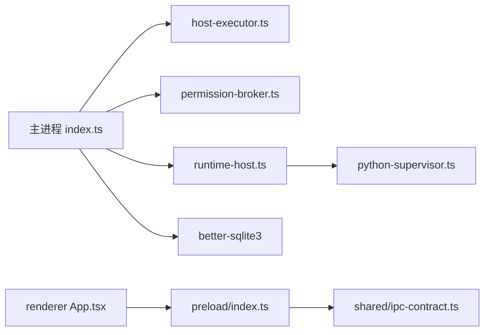

# Electron 应用架构

<cite>
**本文引用的文件**
- [apps/desktop/src/main/index.ts](file://apps/desktop/src/main/index.ts)
- [apps/desktop/src/preload/index.ts](file://apps/desktop/src/preload/index.ts)
- [apps/desktop/src/renderer/src/App.tsx](file://apps/desktop/src/renderer/src/App.tsx)
- [apps/desktop/src/shared/ipc-contract.ts](file://apps/desktop/src/shared/ipc-contract.ts)
- [apps/desktop/src/shared/domain.ts](file://apps/desktop/src/shared/domain.ts)
- [apps/desktop/src/main/runtime/runtime-host.ts](file://apps/desktop/src/main/runtime/runtime-host.ts)
- [apps/desktop/src/main/runtime/python-supervisor.ts](file://apps/desktop/src/main/runtime/python-supervisor.ts)
- [apps/desktop/src/main/permission/permission-broker.ts](file://apps/desktop/src/main/permission/permission-broker.ts)
- [apps/desktop/src/main/capabilities/host-executor.ts](file://apps/desktop/src/main/capabilities/host-executor.ts)
- [apps/desktop/electron.vite.config.ts](file://apps/desktop/electron.vite.config.ts)
- [apps/desktop/electron-builder.yml](file://apps/desktop/electron-builder.yml)
</cite>

## 目录
1. [简介](#简介)
2. [项目结构](#项目结构)
3. [核心组件](#核心组件)
4. [架构总览](#架构总览)
5. [详细组件分析](#详细组件分析)
6. [依赖关系分析](#依赖关系分析)
7. [性能与内存优化](#性能与内存优化)
8. [故障排查指南](#故障排查指南)
9. [结论](#结论)

## 简介
本仓库是一个基于 Electron 的桌面应用，采用主进程与渲染进程分离设计，通过预加载脚本暴露最小、安全的 API 给渲染进程。应用包含：
- 主进程：窗口管理、IPC 网关、权限审批、Python 运行时生命周期管理、能力执行编排、本地数据库访问。
- 预加载脚本：在隔离上下文内桥接 IPC，仅暴露必要方法。
- 渲染进程：React UI，发起请求并订阅事件（如权限通知）。
- Python 运行时：作为子进程运行 Agent 逻辑，通过 JSON-RPC 与主进程通信。

该架构强调安全沙箱、最小权限原则、严格的参数校验与路径守卫，以及清晰的进程间通信契约。

## 项目结构
Electron 应用位于 apps/desktop，关键目录职责如下：
- src/main：主进程入口、能力执行、权限审批、运行时宿主、产品状态存储等。
- src/preload：预加载脚本，使用 contextBridge 暴露受限 API。
- src/renderer：React 渲染进程代码。
- src/shared：共享类型与 IPC 契约定义。
- packages/protocol：与 Python 运行时共享的协议与模式定义（通过别名引入）。
- services/agent-runtime：Python 侧 Agent 运行时（由主进程启动并通过 JSON-RPC 通信）。

图表来源
- [apps/desktop/src/main/index.ts:56-89](file://apps/desktop/src/main/index.ts#L56-L89)
- [apps/desktop/src/preload/index.ts:1-50](file://apps/desktop/src/preload/index.ts#L1-L50)
- [apps/desktop/src/renderer/src/App.tsx:43-125](file://apps/desktop/src/renderer/src/App.tsx#L43-L125)
- [apps/desktop/src/main/runtime/runtime-host.ts:87-129](file://apps/desktop/src/main/runtime/runtime-host.ts#L87-L129)

章节来源
- [apps/desktop/src/main/index.ts:56-89](file://apps/desktop/src/main/index.ts#L56-L89)
- [apps/desktop/electron.vite.config.ts:6-22](file://apps/desktop/electron.vite.config.ts#L6-L22)

## 核心组件
- 主进程入口：创建窗口、注册 IPC 处理器、启动 Python 运行时、处理退出清理。
- 预加载脚本：通过 contextBridge 暴露 runtimeStatus、listPdfs、runTask、getTimeline、权限相关方法，以及唯一的主→渲染事件订阅 onPermissionNotice。
- 渲染进程：调用 window.personalAgent.* 完成业务交互；订阅权限通知并展示对话框。
- 运行时宿主：封装 PythonSupervisor，负责启动、握手、请求转发、崩溃恢复与状态上报。
- 权限审批：Broker 维护待决审批、过期策略、事件推送与最终决议，确保工具调用前六步验证。
- 能力执行：统一入口 executeCapability，对 UI 与 Agent 两条通道分别施加 Scope、Policy、Binder、Path-Guard 等约束。

章节来源
- [apps/desktop/src/main/index.ts:133-324](file://apps/desktop/src/main/index.ts#L133-L324)
- [apps/desktop/src/preload/index.ts:1-50](file://apps/desktop/src/preload/index.ts#L1-L50)
- [apps/desktop/src/renderer/src/App.tsx:43-125](file://apps/desktop/src/renderer/src/App.tsx#L43-L125)
- [apps/desktop/src/main/runtime/runtime-host.ts:87-154](file://apps/desktop/src/main/runtime/runtime-host.ts#L87-L154)
- [apps/desktop/src/main/permission/permission-broker.ts:100-258](file://apps/desktop/src/main/permission/permission-broker.ts#L100-L258)
- [apps/desktop/src/main/capabilities/host-executor.ts:52-117](file://apps/desktop/src/main/capabilities/host-executor.ts#L52-L117)

## 架构总览
下图展示了主进程、预加载脚本、渲染进程与 Python 运行时的通信路径，以及数据流向。

图表来源
- [apps/desktop/src/renderer/src/App.tsx:164-196](file://apps/desktop/src/renderer/src/App.tsx#L164-L196)
- [apps/desktop/src/preload/index.ts:23-45](file://apps/desktop/src/preload/index.ts#L23-L45)
- [apps/desktop/src/main/index.ts:254-296](file://apps/desktop/src/main/index.ts#L254-L296)
- [apps/desktop/src/main/capabilities/host-executor.ts:79-117](file://apps/desktop/src/main/capabilities/host-executor.ts#L79-L117)
- [apps/desktop/src/main/runtime/runtime-host.ts:143-154](file://apps/desktop/src/main/runtime/runtime-host.ts#L143-L154)
- [apps/desktop/src/main/runtime/python-supervisor.ts:156-200](file://apps/desktop/src/main/runtime/python-supervisor.ts#L156-L200)

## 详细组件分析

### 主进程与窗口管理
- 单窗口策略：应用启动时创建单一 BrowserWindow，macOS 下无窗口时点击 Dock 会重建窗口。
- 安全配置：启用 sandbox、contextIsolation，关闭 nodeIntegration；通过 preload 注入受限 API。
- 生命周期：before-quit 中停止 Python 运行时、释放权限 Broker、关闭数据库后退出。
- 新窗口拦截：setWindowOpenHandler 将外链转至系统浏览器，防止内部打开。

图表来源
- [apps/desktop/src/main/index.ts:56-89](file://apps/desktop/src/main/index.ts#L56-L89)
- [apps/desktop/src/main/index.ts:338-348](file://apps/desktop/src/main/index.ts#L338-L348)

章节来源
- [apps/desktop/src/main/index.ts:56-89](file://apps/desktop/src/main/index.ts#L56-L89)
- [apps/desktop/src/main/index.ts:338-348](file://apps/desktop/src/main/index.ts#L338-L348)

### 预加载脚本与安全 API 暴露
- 仅在 contextIsolated 环境下通过 contextBridge.exposeInMainWorld 暴露 personalAgent。
- 暴露的方法均为受控 IPC 调用，参数类型由共享契约约束。
- 唯一的事件订阅 onPermissionNotice 返回取消函数，避免内存泄漏。

图表来源
- [apps/desktop/src/preload/index.ts:10-45](file://apps/desktop/src/preload/index.ts#L10-L45)
- [apps/desktop/src/shared/ipc-contract.ts:24-74](file://apps/desktop/src/shared/ipc-contract.ts#L24-L74)

章节来源
- [apps/desktop/src/preload/index.ts:1-50](file://apps/desktop/src/preload/index.ts#L1-L50)
- [apps/desktop/src/shared/ipc-contract.ts:24-74](file://apps/desktop/src/shared/ipc-contract.ts#L24-L74)

### 渲染进程与事件订阅
- 渲染进程通过 window.personalAgent.* 发起请求，统一处理 ok/code/message 结构。
- 订阅 onPermissionNotice 处理“请求”和“已决”两类通知，驱动权限对话框显示与关闭。
- 任务执行完成后刷新任务列表与时间线，保证 UI 与后端一致。

图表来源
- [apps/desktop/src/renderer/src/App.tsx:111-150](file://apps/desktop/src/renderer/src/App.tsx#L111-L150)
- [apps/desktop/src/preload/index.ts:29-45](file://apps/desktop/src/preload/index.ts#L29-L45)
- [apps/desktop/src/main/index.ts:298-323](file://apps/desktop/src/main/index.ts#L298-L323)

章节来源
- [apps/desktop/src/renderer/src/App.tsx:111-150](file://apps/desktop/src/renderer/src/App.tsx#L111-L150)
- [apps/desktop/src/preload/index.ts:29-45](file://apps/desktop/src/preload/index.ts#L29-L45)
- [apps/desktop/src/main/index.ts:298-323](file://apps/desktop/src/main/index.ts#L298-L323)

### 运行时宿主与 Python 子进程
- 启动流程：检查运行时命令是否存在（按布局解析：PERSONAL_AGENT_RUNTIME 覆盖 / 打包冻结产物 / 仓库 venv），构造 PythonSupervisor，设置 hostHandler 与可见能力清单，initialize 握手成功后标记 ready。
- 请求模型：request 支持超时与 AbortSignal，维护 pending 队列，按 id 路由响应或错误。
- 崩溃处理：子进程异常退出时记录 crashInfo，拒绝所有未决请求，并向主进程广播 runtime.crashed 事件。
- 优雅关闭：stop 写入 stdin 结束信号，等待退出并在超时后强制 kill。

图表来源
- [apps/desktop/src/main/runtime/runtime-host.ts:87-129](file://apps/desktop/src/main/runtime/runtime-host.ts#L87-L129)
- [apps/desktop/src/main/runtime/python-supervisor.ts:103-153](file://apps/desktop/src/main/runtime/python-supervisor.ts#L103-L153)
- [apps/desktop/src/main/runtime/python-supervisor.ts:156-200](file://apps/desktop/src/main/runtime/python-supervisor.ts#L156-L200)
- [apps/desktop/src/main/runtime/python-supervisor.ts:203-222](file://apps/desktop/src/main/runtime/python-supervisor.ts#L203-L222)

章节来源
- [apps/desktop/src/main/runtime/runtime-host.ts:87-154](file://apps/desktop/src/main/runtime/runtime-host.ts#L87-L154)
- [apps/desktop/src/main/runtime/python-supervisor.ts:103-222](file://apps/desktop/src/main/runtime/python-supervisor.ts#L103-L222)
- [apps/desktop/src/main/runtime/python-supervisor.ts:225-356](file://apps/desktop/src/main/runtime/python-supervisor.ts#L225-L356)

### 权限审批与执行前验证
- 审批生命周期：request 创建 PermissionRecord，落库并推送 requested 通知；等待用户 respond 或过期；respond 更新状态并推送 resolved 通知。
- 执行前六步验证：检查 permission 存在、状态为 approved、未过期、toolCallId 匹配、参数哈希匹配、路径在授权根内。
- 事件与投影：过期不持久化，查询时根据 now 计算 expired；事件记录 REQUESTED、DECISION、EXPIRED。

图表来源
- [apps/desktop/src/main/permission/permission-broker.ts:236-327](file://apps/desktop/src/main/permission/permission-broker.ts#L236-L327)
- [apps/desktop/src/main/capabilities/host-executor.ts:79-117](file://apps/desktop/src/main/capabilities/host-executor.ts#L79-L117)

章节来源
- [apps/desktop/src/main/permission/permission-broker.ts:100-258](file://apps/desktop/src/main/permission/permission-broker.ts#L100-L258)
- [apps/desktop/src/main/permission/permission-broker.ts:282-327](file://apps/desktop/src/main/permission/permission-broker.ts#L282-L327)
- [apps/desktop/src/main/capabilities/host-executor.ts:52-117](file://apps/desktop/src/main/capabilities/host-executor.ts#L52-L117)

### IPC 通信设计模式
- 请求-响应模式：渲染进程通过 ipcRenderer.invoke 调用主进程处理器，主进程返回统一的结果结构 {ok, code?, message?}。
- 事件推送模式：主进程通过 webContents.send 向所有窗口推送权限通知，预加载脚本提供 onPermissionNotice 订阅并返回取消函数。
- 契约与类型：共享 ipc-contract 与 domain 定义统一的数据结构与错误码，确保前后端一致性。

图表来源
- [apps/desktop/src/preload/index.ts:10-45](file://apps/desktop/src/preload/index.ts#L10-L45)
- [apps/desktop/src/main/index.ts:133-231](file://apps/desktop/src/main/index.ts#L133-L231)
- [apps/desktop/src/main/index.ts:298-323](file://apps/desktop/src/main/index.ts#L298-L323)

章节来源
- [apps/desktop/src/shared/ipc-contract.ts:24-74](file://apps/desktop/src/shared/ipc-contract.ts#L24-L74)
- [apps/desktop/src/shared/domain.ts:52-95](file://apps/desktop/src/shared/domain.ts#L52-L95)

### 安全沙箱与配置
- 窗口安全选项：sandbox=true、contextIsolation=true、nodeIntegration=false，阻断渲染进程直接访问 Node API。
- 预加载白名单：仅通过 contextBridge 暴露 minimal API，限制 IPC 通道名与方法名。
- 构建与打包：electron-builder 排除源码与配置文件，asarUnpack 保留 native 模块与资源。

章节来源
- [apps/desktop/src/main/index.ts:66-71](file://apps/desktop/src/main/index.ts#L66-L71)
- [apps/desktop/src/preload/index.ts:1-50](file://apps/desktop/src/preload/index.ts#L1-L50)
- [apps/desktop/electron-builder.yml:1-34](file://apps/desktop/electron-builder.yml#L1-L34)

## 依赖关系分析
- 主进程依赖：
  - 运行时宿主：启动/停止 Python 子进程，转发 RPC。
  - 能力执行：统一入口，结合 Scope、Retriever、Binder、Executor、Path-Guard 进行安全执行。
  - 权限 Broker：维护审批状态机与事件推送。
  - 数据库：better-sqlite3 用于 PDF 索引与产品状态存储。
- 预加载脚本依赖：共享类型与 IPC 通道名。
- 渲染进程依赖：共享类型与 window.personalAgent API。

图表来源
- [apps/desktop/src/main/index.ts:1-31](file://apps/desktop/src/main/index.ts#L1-L31)
- [apps/desktop/src/main/capabilities/host-executor.ts:1-117](file://apps/desktop/src/main/capabilities/host-executor.ts#L1-L117)
- [apps/desktop/src/main/runtime/runtime-host.ts:1-154](file://apps/desktop/src/main/runtime/runtime-host.ts#L1-L154)
- [apps/desktop/src/preload/index.ts:1-50](file://apps/desktop/src/preload/index.ts#L1-L50)
- [apps/desktop/src/renderer/src/App.tsx:1-20](file://apps/desktop/src/renderer/src/App.tsx#L1-L20)

章节来源
- [apps/desktop/src/main/index.ts:1-31](file://apps/desktop/src/main/index.ts#L1-L31)
- [apps/desktop/src/main/runtime/runtime-host.ts:1-154](file://apps/desktop/src/main/runtime/runtime-host.ts#L1-L154)
- [apps/desktop/src/main/permission/permission-broker.ts:1-76](file://apps/desktop/src/main/permission/permission-broker.ts#L1-L76)
- [apps/desktop/src/main/capabilities/host-executor.ts:1-117](file://apps/desktop/src/main/capabilities/host-executor.ts#L1-L117)

## 性能与内存优化
- 子进程资源管理：
  - PythonSupervisor 维护 pending 请求映射与定时器，确保请求完成后清理，避免内存泄漏。
  - 崩溃时集中拒绝所有未决请求，防止悬挂 Promise。
  - stop 优雅关闭，带超时保护，避免僵尸进程。
- 数据库访问：
  - 只读通道（如 list-tasks、get-timeline）避免不必要的事务与写锁竞争。
  - 批量 upsert 减少 IO 次数（PDF 索引）。
- 事件与订阅：
  - onPermissionNotice 返回取消函数，组件卸载时及时移除监听，降低内存占用。
- 能力执行：
  - 通过 Scope 与 Retriever 限制可见能力，减少无效解析与校验开销。
  - Binder 与 Path-Guard 提前失败，避免深层执行成本。

[本节为通用指导，无需特定文件引用]

## 故障排查指南
- 运行时未启动：
  - 现象：请求抛出 NOT_STARTED。
  - 排查：确认运行时命令路径存在（打包版看 resources/agent-runtime，开发版看 .venv）；检查 startRuntime 是否被调用；查看 stderr 日志。
- 运行时崩溃：
  - 现象：state=crashed，detail 包含 reason 与 detail。
  - 排查：查看 Python 子进程 stderr；检查 initialize 握手失败原因；确认 hostHandler 可用。
- 权限过期：
  - 现象：respond 返回 PERMISSION_EXPIRED；通知 resolved state=expired。
  - 排查：调整 TTL；确保 UI 在有效期内响应用户操作。
- 路径越界：
  - 现象：verifyPermission 返回路径相关错误码。
  - 排查：检查授权根配置；确认 source/target 路径在根内且非符号链接逃逸。
- IPC 通道错误：
  - 现象：preload 捕获到 IPC 错误；渲染进程收到 code=message。
  - 排查：核对通道名与方法签名；确认主进程已注册对应 handler。

章节来源
- [apps/desktop/src/main/runtime/runtime-host.ts:87-129](file://apps/desktop/src/main/runtime/runtime-host.ts#L87-L129)
- [apps/desktop/src/main/runtime/python-supervisor.ts:156-200](file://apps/desktop/src/main/runtime/python-supervisor.ts#L156-L200)
- [apps/desktop/src/main/runtime/python-supervisor.ts:341-356](file://apps/desktop/src/main/runtime/python-supervisor.ts#L341-L356)
- [apps/desktop/src/main/permission/permission-broker.ts:183-234](file://apps/desktop/src/main/permission/permission-broker.ts#L183-L234)
- [apps/desktop/src/main/permission/permission-broker.ts:282-327](file://apps/desktop/src/main/permission/permission-broker.ts#L282-L327)
- [apps/desktop/src/preload/index.ts:47-49](file://apps/desktop/src/preload/index.ts#L47-L49)

## 结论
该 Electron 应用通过严格的安全沙箱、最小权限的预加载 API、清晰的 IPC 契约与健壮的错误处理，实现了主进程与渲染进程的解耦。Python 运行时以子进程形式隔离执行，配合权限审批与路径守卫，确保敏感操作可控可审计。整体架构具备良好的可扩展性与可维护性，适合在桌面环境中安全地执行本地任务与数据处理。