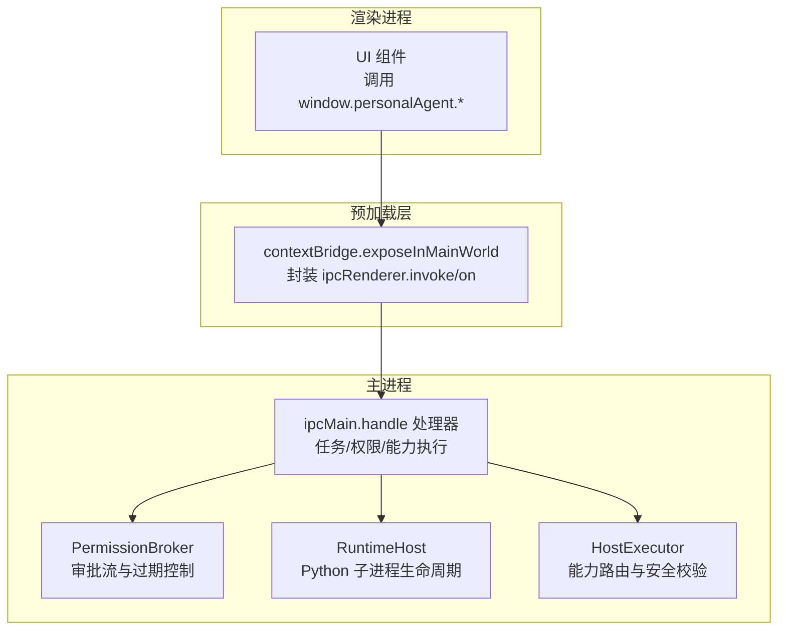
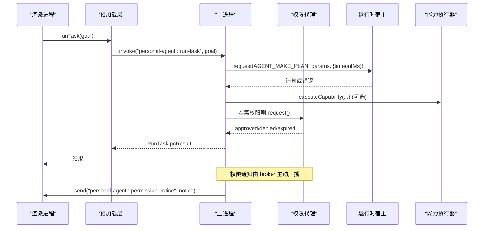
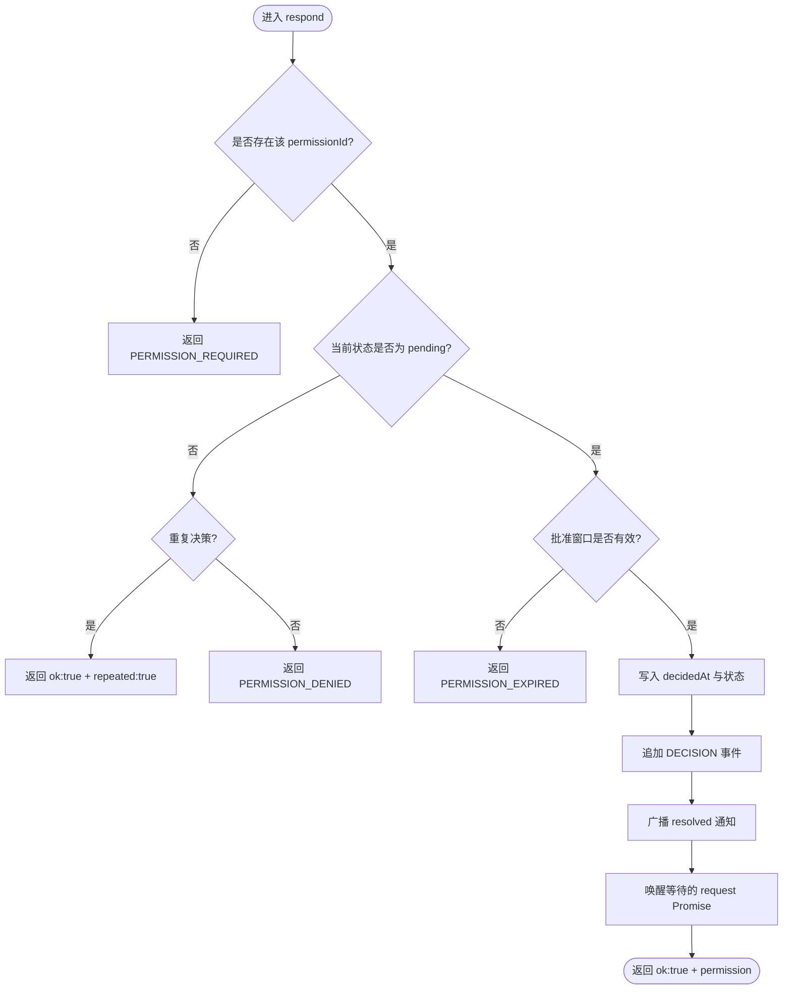
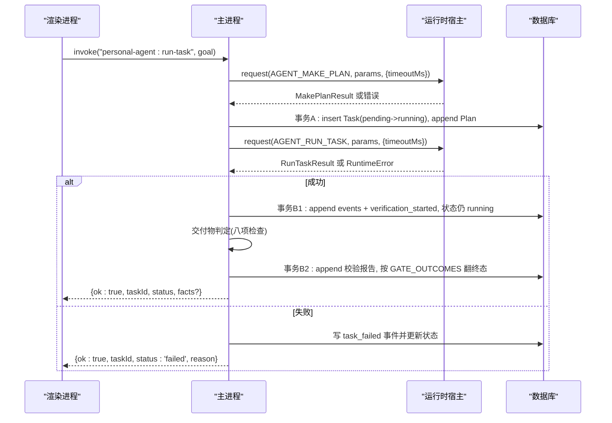
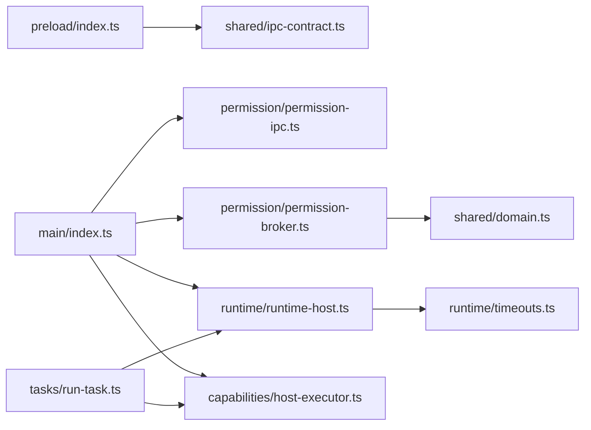

# IPC 通信机制

<cite>
**本文引用的文件**
- [apps/desktop/src/preload/index.ts](file://apps/desktop/src/preload/index.ts)
- [apps/desktop/src/main/index.ts](file://apps/desktop/src/main/index.ts)
- [apps/desktop/src/shared/ipc-contract.ts](file://apps/desktop/src/shared/ipc-contract.ts)
- [apps/desktop/src/shared/domain.ts](file://apps/desktop/src/shared/domain.ts)
- [apps/desktop/src/main/permission/permission-ipc.ts](file://apps/desktop/src/main/permission/permission-ipc.ts)
- [apps/desktop/src/main/permission/permission-broker.ts](file://apps/desktop/src/main/permission/permission-broker.ts)
- [apps/desktop/src/main/runtime/runtime-host.ts](file://apps/desktop/src/main/runtime/runtime-host.ts)
- [apps/desktop/src/main/tasks/run-task.ts](file://apps/desktop/src/main/tasks/run-task.ts)
- [apps/desktop/src/main/capabilities/host-executor.ts](file://apps/desktop/src/main/capabilities/host-executor.ts)
- [apps/desktop/src/main/runtime/timeouts.ts](file://apps/desktop/src/main/runtime/timeouts.ts)
- [packages/protocol/schemas/index.ts](file://packages/protocol/schemas/index.ts)
- [apps/desktop/src/renderer/src/view-model.ts](file://apps/desktop/src/renderer/src/view-model.ts)
</cite>

## 目录
1. [简介](#简介)
2. [项目结构](#项目结构)
3. [核心组件](#核心组件)
4. [架构总览](#架构总览)
5. [详细组件分析](#详细组件分析)
6. [依赖关系分析](#依赖关系分析)
7. [性能与超时](#性能与超时)
8. [故障排查指南](#故障排查指南)
9. [结论](#结论)
10. [附录：通道与错误码规范](#附录通道与错误码规范)

## 简介
本文件系统化说明本项目中 Electron IPC 通信机制的设计与实践，覆盖以下要点：
- handle 模式与 channel 模式的使用场景与边界
- 请求-响应模式的实现（异步调用、错误处理、超时）
- 事件推送模式的应用（权限通知、状态更新等实时通信）
- IPC 消息的序列化机制（类型校验、转换规则）
- 通道命名规范（前缀约定与命名空间管理）
- 错误处理策略（统一错误码、异常传播）
- 主进程与渲染进程间的数据流转时序图

## 项目结构
IPC 相关代码主要分布在四个层次：
- 渲染层：通过 preload 暴露安全 API，使用 invoke/on 进行请求与订阅
- 预加载层：桥接 contextBridge 与 ipcRenderer，封装通道名与参数
- 主进程：注册 ipcMain.handle 处理器，编排业务逻辑，维护运行时与权限状态
- 共享契约：定义跨进程传输的类型与结果形态，保证两端一致

图表来源
- [apps/desktop/src/preload/index.ts:1-51](file://apps/desktop/src/preload/index.ts#L1-L51)
- [apps/desktop/src/main/index.ts:131-321](file://apps/desktop/src/main/index.ts#L131-L321)
- [apps/desktop/src/main/permission/permission-broker.ts:100-258](file://apps/desktop/src/main/permission/permission-broker.ts#L100-L258)
- [apps/desktop/src/main/runtime/runtime-host.ts:22-87](file://apps/desktop/src/main/runtime/runtime-host.ts#L22-L87)
- [apps/desktop/src/main/capabilities/host-executor.ts:62-117](file://apps/desktop/src/main/capabilities/host-executor.ts#L62-L117)

章节来源
- [apps/desktop/src/preload/index.ts:1-51](file://apps/desktop/src/preload/index.ts#L1-L51)
- [apps/desktop/src/main/index.ts:1-355](file://apps/desktop/src/main/index.ts#L1-L355)

## 核心组件
- 预加载桥接：将 IPC 通道封装为安全的 window.personalAgent.* 方法，仅暴露必要接口；唯一的主→渲染推送通道用于权限通知。
- 主进程处理器：集中注册 handle，负责参数校验、持久化、能力执行、运行时协调与权限审批。
- 权限代理：维护待决审批、过期时间、事件落库与广播，提供 verify/respond/listForTask 等能力。
- 运行时宿主：启动/停止 Python 子进程，提供 request 网关并透传超时与错误码。
- 能力执行器：对 UI 与 Agent 两条路径分别做安全校验与能力路由，确保最小权限。

章节来源
- [apps/desktop/src/preload/index.ts:1-51](file://apps/desktop/src/preload/index.ts#L1-L51)
- [apps/desktop/src/main/index.ts:131-321](file://apps/desktop/src/main/index.ts#L131-L321)
- [apps/desktop/src/main/permission/permission-broker.ts:100-258](file://apps/desktop/src/main/permission/permission-broker.ts#L100-L258)
- [apps/desktop/src/main/runtime/runtime-host.ts:22-87](file://apps/desktop/src/main/runtime/runtime-host.ts#L22-L87)
- [apps/desktop/src/main/capabilities/host-executor.ts:62-117](file://apps/desktop/src/main/capabilities/host-executor.ts#L62-L117)

## 架构总览
IPC 通信采用“请求-响应 + 事件推送”的组合模式：
- 请求-响应：渲染进程通过 preload 暴露的方法发起 invoke，主进程在对应 channel 上返回结构化结果（ok/code/message）。
- 事件推送：主进程通过 send 向所有窗口广播权限通知，渲染进程通过 on 订阅并取消订阅。

图表来源
- [apps/desktop/src/main/index.ts:252-294](file://apps/desktop/src/main/index.ts#L252-L294)
- [apps/desktop/src/main/runtime/runtime-host.ts:77-87](file://apps/desktop/src/main/runtime/runtime-host.ts#L77-L87)
- [apps/desktop/src/main/permission/permission-broker.ts:133-181](file://apps/desktop/src/main/permission/permission-broker.ts#L133-L181)
- [apps/desktop/src/main/capabilities/host-executor.ts:79-117](file://apps/desktop/src/main/capabilities/host-executor.ts#L79-L117)

## 详细组件分析

### 预加载层：handle 与 channel 的统一封装
- 使用 contextBridge 暴露 window.personalAgent.* 方法，内部统一调用 ipcRenderer.invoke 与 ipcRenderer.on。
- 所有请求通道均以 personal-agent: 为前缀，形成清晰的命名空间。
- 唯一的事件推送通道 personal-agent:permission-notice 通过 on 订阅，并提供返回函数以移除监听。

章节来源
- [apps/desktop/src/preload/index.ts:1-51](file://apps/desktop/src/preload/index.ts#L1-L51)

### 主进程：handle 模式与通道注册
- 集中注册多个 handle 通道：runtime-status、list-pdfs、indexed-pdfs、list-tasks、run-task、get-timeline、permission-respond、list-permissions。
- 每个处理器负责参数校验、领域逻辑、持久化与错误映射，最终返回统一的 ok/code/message 结构。
- 权限通知通过 broadcastPermissionNotice 向所有窗口发送事件。

章节来源
- [apps/desktop/src/main/index.ts:131-321](file://apps/desktop/src/main/index.ts#L131-L321)

### 权限代理：请求-响应与事件推送的结合
- request：创建 PermissionRecord，写入数据库与事件表，设置过期定时器，挂起等待用户决策。
- respond：根据 permissionId 与 decision 更新状态，记录事件，触发已挂起的 Promise 并广播 resolved 通知。
- verify：在执行工具前进行六步验证（存在性、状态、过期、防篡改、参数指纹、路径白名单）。
- listForTask：按任务查询权限列表，附带过期投影状态。

图表来源
- [apps/desktop/src/main/permission/permission-broker.ts:183-234](file://apps/desktop/src/main/permission/permission-broker.ts#L183-L234)

章节来源
- [apps/desktop/src/main/permission/permission-broker.ts:100-258](file://apps/desktop/src/main/permission/permission-broker.ts#L100-L258)
- [apps/desktop/src/main/permission/permission-ipc.ts:44-83](file://apps/desktop/src/main/permission/permission-ipc.ts#L44-L83)

### 运行时宿主：异步调用、错误与超时
- startRuntime：启动 Python 子进程，初始化后标记 ready，失败则标记 crashed。
- stopRuntime：优雅停止并清理状态。
- request：统一网关，未启动时抛出 NOT_STARTED，否则委托给 supervisor.request，透传 timeoutMs。
- 错误码映射：将子进程错误 envelope 中的 code 原样透传，未知码收敛为 CRASHED，避免 UI 收到不可识别字符串。

章节来源
- [apps/desktop/src/main/runtime/runtime-host.ts:22-87](file://apps/desktop/src/main/runtime/runtime-host.ts#L22-L87)
- [apps/desktop/src/main/tasks/run-task.ts:25-37](file://apps/desktop/src/main/tasks/run-task.ts#L25-L37)

### 能力执行器：安全边界与通道入口
- listVisibleCapabilities：列出当前 scope 可见的能力，供运行时下发清单。
- executeHostTool：Agent 路径，受 beginTask 上下文保护，必须对齐计划。
- executeCapability：UI 路径，走 ui origin，不要求计划对齐，但同样经过注册、Scope、风险、契约、路径五关照。

章节来源
- [apps/desktop/src/main/capabilities/host-executor.ts:62-117](file://apps/desktop/src/main/capabilities/host-executor.ts#L62-L117)

### 任务运行流程：从请求到结果
- 入参校验：RunTaskParams.safeParse 确保 goal 合法。
- 计划阶段：调用 AGENT_MAKE_PLAN，带独立超时，失败直接返回错误码。
- 建槽与持久化：beginTask 占槽，事务 A 写入 Task/Plan。
- 执行阶段：调用 AGENT_RUN_TASK，带整体超时；捕获运行时错误并持久化为 task_failed。
- 收尾阶段：事务 B1 写入 events 与 verification_started（状态仍是 running）→ 交付物判定 → 事务 B2 写校验报告并按 GATE_OUTCOMES 翻终态；返回统一结果。

图表来源
- [apps/desktop/src/main/tasks/run-task.ts:105-341](file://apps/desktop/src/main/tasks/run-task.ts#L105-L341)
- [apps/desktop/src/main/runtime/runtime-host.ts:77-87](file://apps/desktop/src/main/runtime/runtime-host.ts#L77-L87)

章节来源
- [apps/desktop/src/main/tasks/run-task.ts:105-341](file://apps/desktop/src/main/tasks/run-task.ts#L105-L341)

## 依赖关系分析
- 预加载层依赖 shared 契约类型，确保渲染侧调用签名正确。
- 主进程处理器依赖权限代理、运行时宿主、能力执行器与数据库仓库。
- 权限代理依赖事件与权限仓库、路径守卫、过期计算与广播回调。
- 运行时宿主依赖 PythonSupervisor，并通过 hostHandler 与能力执行器对接。
- 能力执行器依赖 retriever、scope、execution-policy，确保最小权限。

图表来源
- [apps/desktop/src/preload/index.ts:1-51](file://apps/desktop/src/preload/index.ts#L1-L51)
- [apps/desktop/src/main/index.ts:131-321](file://apps/desktop/src/main/index.ts#L131-L321)
- [apps/desktop/src/main/permission/permission-broker.ts:100-258](file://apps/desktop/src/main/permission/permission-broker.ts#L100-L258)
- [apps/desktop/src/main/runtime/runtime-host.ts:22-87](file://apps/desktop/src/main/runtime/runtime-host.ts#L22-L87)
- [apps/desktop/src/main/capabilities/host-executor.ts:62-117](file://apps/desktop/src/main/capabilities/host-executor.ts#L62-L117)
- [apps/desktop/src/main/tasks/run-task.ts:105-341](file://apps/desktop/src/main/tasks/run-task.ts#L105-L341)

章节来源
- [apps/desktop/src/preload/index.ts:1-51](file://apps/desktop/src/preload/index.ts#L1-L51)
- [apps/desktop/src/main/index.ts:131-321](file://apps/desktop/src/main/index.ts#L131-L321)
- [apps/desktop/src/main/permission/permission-broker.ts:100-258](file://apps/desktop/src/main/permission/permission-broker.ts#L100-L258)
- [apps/desktop/src/main/runtime/runtime-host.ts:22-87](file://apps/desktop/src/main/runtime/runtime-host.ts#L22-L87)
- [apps/desktop/src/main/capabilities/host-executor.ts:62-117](file://apps/desktop/src/main/capabilities/host-executor.ts#L62-L117)
- [apps/desktop/src/main/tasks/run-task.ts:105-341](file://apps/desktop/src/main/tasks/run-task.ts#L105-L341)

## 性能与超时
- 超时分层设计：
  - 计划构建：MAKE_PLAN_TIMEOUT_MS=10s，快速失败避免长时间无反馈。
  - 单次工具调用：HOST_TOOL_TIMEOUT_MS = PERMISSION_TTL_MS + 余量，防止单步卡死。
  - 整体任务：RUN_TASK_TIMEOUT_MS = 最大工具调用次数 × HOST_TOOL_TIMEOUT_MS + MODEL_SLACK_MS，兼顾长任务与模型延迟。
- 资源释放：应用退出时依次停止运行时、释放权限代理、关闭数据库连接，避免泄漏。
- 并发控制：单槽设计，beginTask/endTask 确保同一时刻只有一个任务执行，避免 ActionAlignment 基准错乱。

章节来源
- [apps/desktop/src/main/runtime/timeouts.ts:1-17](file://apps/desktop/src/main/runtime/timeouts.ts#L1-L17)
- [apps/desktop/src/main/tasks/run-task.ts:20-23](file://apps/desktop/src/main/tasks/run-task.ts#L20-L23)
- [apps/desktop/src/main/index.ts:337-346](file://apps/desktop/src/main/index.ts#L337-L346)

## 故障排查指南
- 常见错误码与含义：
  - RUNTIME_NOT_STARTED：Python 运行时未启动，检查 startRuntime 是否成功。
  - RUNTIME_TIMEOUT：任务或工具调用超时，检查超时配置与下游响应。
  - RUNTIME_RESPONSE_INVALID：返回数据不符合契约，检查协议 schema 与解析。
  - RUNTIME_DB_FAILED：数据库操作失败，检查 getStore/getDb 与事务。
  - PERMISSION_REQUIRED/DENIED/EXPIRED/TAMPERED：权限相关问题，检查权限记录、状态机与参数指纹。
- 定位步骤：
  - 查看主进程日志与 Python stderr（开发模式下输出）。
  - 检查权限面板与事件时间线，确认是否有 permission_requested/decision/expired。
  - 核对通道名与参数类型，确保 preload 与 main 端一致。
  - 对于崩溃场景，关注 runtime-host 的状态变更与 detail 信息。

章节来源
- [apps/desktop/src/main/runtime/error-code.ts:1-18](file://apps/desktop/src/main/runtime/error-code.ts#L1-L18)
- [apps/desktop/src/main/permission/permission-ipc.ts:17-36](file://apps/desktop/src/main/permission/permission-ipc.ts#L17-L36)
- [apps/desktop/src/main/tasks/run-task.ts:59-84](file://apps/desktop/src/main/tasks/run-task.ts#L59-L84)

## 结论
本项目采用清晰的分层与职责划分，结合 handle 模式与 channel 模式，实现了稳定可靠的 IPC 通信：
- 请求-响应：通过 preload 封装与主进程 handle 处理，统一返回结构与错误码。
- 事件推送：权限代理主动广播通知，渲染进程按需订阅与取消。
- 序列化与校验：共享契约与 schema 校验贯穿全链路，保障数据类型与一致性。
- 超时与容错：分层超时与健壮的错误映射，提升用户体验与可观测性。
- 安全与最小权限：能力执行器与权限代理共同约束工具调用范围与路径。

## 附录：通道与错误码规范

### 通道命名规范
- 前缀约定：所有 IPC 通道均以 personal-agent: 开头，形成统一命名空间。
- 命名风格：小写短横线分隔，语义清晰，如 personal-agent:run-task、personal-agent:permission-notice。
- 方向约定：
  - 请求-响应：renderer → main，使用 invoke。
  - 事件推送：main → renderer，使用 send，renderer 通过 on 订阅。

章节来源
- [apps/desktop/src/preload/index.ts:11-45](file://apps/desktop/src/preload/index.ts#L11-L45)
- [apps/desktop/src/main/index.ts:35-54](file://apps/desktop/src/main/index.ts#L35-L54)

### 错误码与结果结构
- 统一结果结构：{ ok: true/false; ... } | { ok: false; code: IpcErrorCode; message: string }
- 错误码来源：
  - 协议错误：ERROR_CODE（来自 @personal-agent/protocol）
  - 运行时错误：RUNTIME_ERROR_CODE（本地定义）
  - 权限错误：PERMISSION_*（由权限代理与协议共同定义）
- 映射策略：
  - 已知错误码原样透传，未知码收敛为 CRASHED，避免 UI 显示不可识别字符串。
  - 参数非法统一映射为 PROTOCOL_INVALID_REQUEST。

章节来源
- [apps/desktop/src/shared/ipc-contract.ts:31-75](file://apps/desktop/src/shared/ipc-contract.ts#L31-L75)
- [apps/desktop/src/main/runtime/error-code.ts:1-18](file://apps/desktop/src/main/runtime/error-code.ts#L1-L18)
- [apps/desktop/src/main/tasks/run-task.ts:25-37](file://apps/desktop/src/main/tasks/run-task.ts#L25-L37)
- [apps/desktop/src/main/permission/permission-ipc.ts:17-36](file://apps/desktop/src/main/permission/permission-ipc.ts#L17-L36)

### 序列化与验证规则
- 类型校验：使用 safeParse 对入参与返回值进行严格校验，确保契约一致。
- 字段约束：
  - 任务目标 goal 必须为非空字符串。
  - 权限决策 decision 必须为 approved 或 denied。
  - 路径参数需通过路径守卫校验，确保在授权根内。
- 事件载荷：ExecutionEventRecord.payload 为 unknown，读方按 type 窄化展示。

章节来源
- [apps/desktop/src/shared/domain.ts:1-158](file://apps/desktop/src/shared/domain.ts#L1-L158)
- [apps/desktop/src/main/tasks/run-task.ts:105-162](file://apps/desktop/src/main/tasks/run-task.ts#L105-L162)
- [apps/desktop/src/main/permission/permission-broker.ts:283-327](file://apps/desktop/src/main/permission/permission-broker.ts#L283-L327)

### 渲染侧视图与展示
- 结果描述：describeRunOutcome 将 RunTaskIpcResult 转换为 success/failed/error 三态文案。
- 事件标签：EVENT_LABELS 将事件类型映射为中文，未知类型回退显示原始 type。
- 时间格式化：formatOccurredAt 与 formatRemaining 提供稳健的时间展示与剩余时间计算。

章节来源
- [apps/desktop/src/renderer/src/view-model.ts:27-53](file://apps/desktop/src/renderer/src/view-model.ts#L27-L53)
- [apps/desktop/src/renderer/src/view-model.ts:61-90](file://apps/desktop/src/renderer/src/view-model.ts#L61-L90)
- [apps/desktop/src/renderer/src/view-model.ts:94-115](file://apps/desktop/src/renderer/src/view-model.ts#L94-L115)