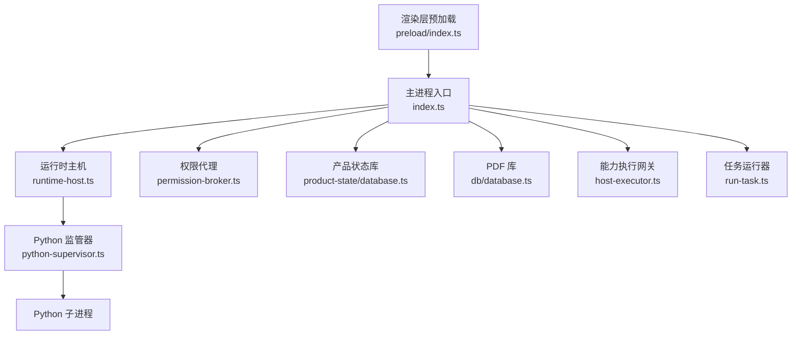
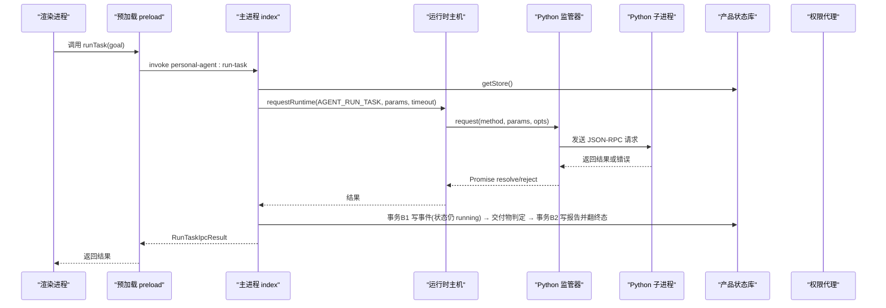
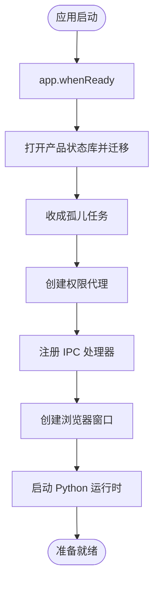
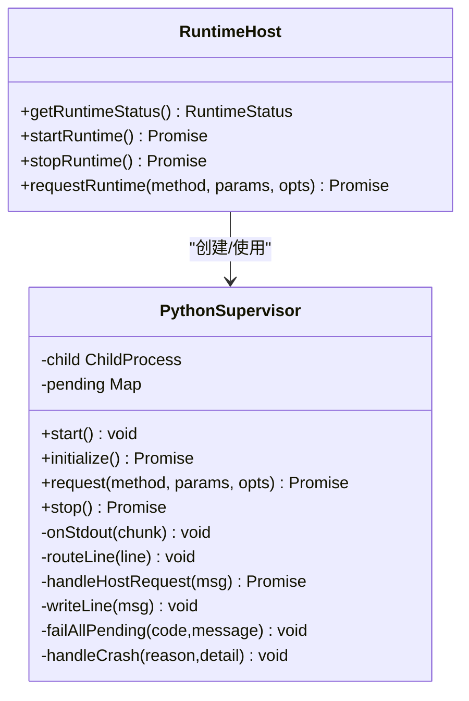
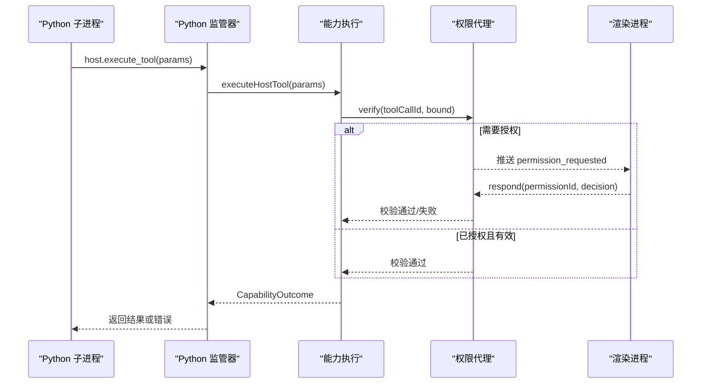
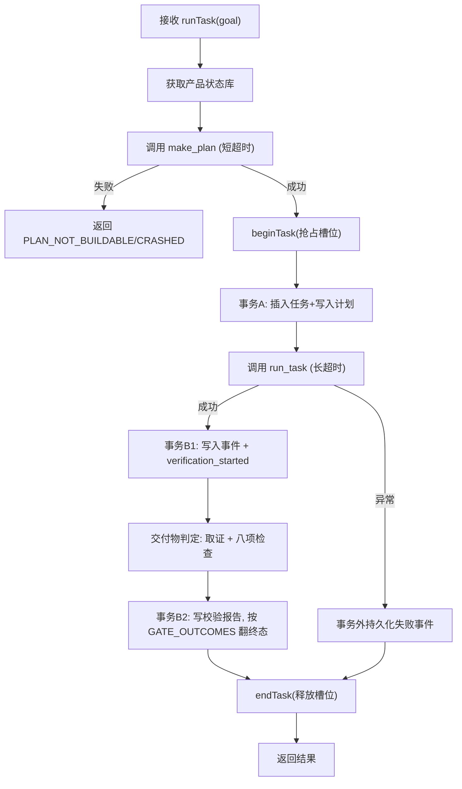
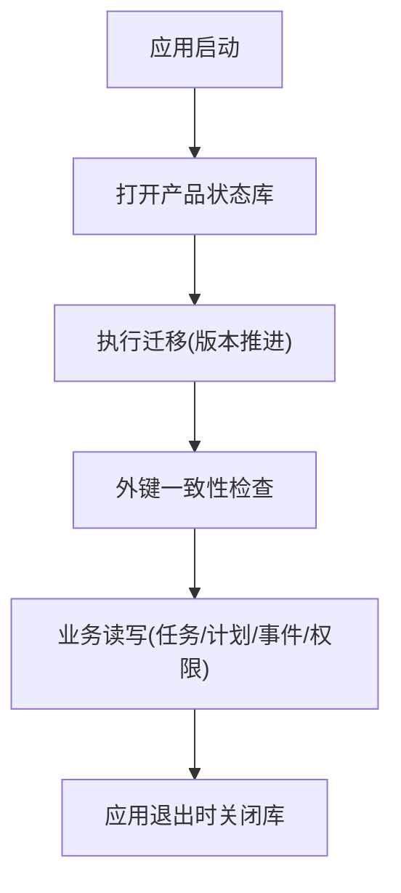
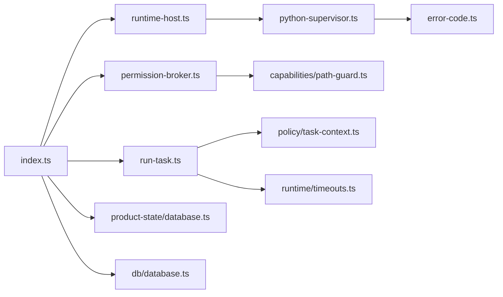

# 主进程架构

<cite>
**本文引用的文件**
- [apps/desktop/src/main/index.ts](file://apps/desktop/src/main/index.ts)
- [apps/desktop/src/main/runtime/runtime-host.ts](file://apps/desktop/src/main/runtime/runtime-host.ts)
- [apps/desktop/src/main/runtime/python-supervisor.ts](file://apps/desktop/src/main/runtime/python-supervisor.ts)
- [apps/desktop/src/main/runtime/error-code.ts](file://apps/desktop/src/main/runtime/error-code.ts)
- [apps/desktop/src/main/runtime/timeouts.ts](file://apps/desktop/src/main/runtime/timeouts.ts)
- [apps/desktop/src/main/db/database.ts](file://apps/desktop/src/main/db/database.ts)
- [apps/desktop/src/main/product-state/database.ts](file://apps/desktop/src/main/product-state/database.ts)
- [apps/desktop/src/main/permission/permission-broker.ts](file://apps/desktop/src/main/permission/permission-broker.ts)
- [apps/desktop/src/main/tasks/run-task.ts](file://apps/desktop/src/main/tasks/run-task.ts)
- [apps/desktop/src/main/capabilities/host-executor.ts](file://apps/desktop/src/main/capabilities/host-executor.ts)
- [apps/desktop/src/preload/index.ts](file://apps/desktop/src/preload/index.ts)
- [apps/desktop/src/shared/ipc-contract.ts](file://apps/desktop/src/shared/ipc-contract.ts)
</cite>

## 目录
1. [简介](#简介)
2. [项目结构](#项目结构)
3. [核心组件](#核心组件)
4. [架构总览](#架构总览)
5. [详细组件分析](#详细组件分析)
6. [依赖关系分析](#依赖关系分析)
7. [性能考量](#性能考量)
8. [故障排查指南](#故障排查指南)
9. [结论](#结论)
10. [附录](#附录)

## 简介
本文件面向 Electron 主进程，系统性说明应用启动、窗口创建、IPC 处理器注册、Python 运行时管理、权限控制、数据库连接与迁移、错误码体系、生命周期管理等关键主题。文档同时提供架构图与时序图，帮助读者快速理解各模块职责边界与数据流向。

## 项目结构
主进程代码集中在 apps/desktop/src/main 下，按职责划分为：
- 入口与生命周期：index.ts
- Python 运行时管理：runtime/*（supervisor、host 封装、错误码、超时）
- 能力执行与权限：capabilities/*、permission/*
- 任务编排与持久化：tasks/*、product-state/*、db/*
- 渲染层桥接：preload/index.ts
- IPC 契约类型：shared/ipc-contract.ts

图表来源
- [apps/desktop/src/main/index.ts:56-333](file://apps/desktop/src/main/index.ts#L56-L333)
- [apps/desktop/src/main/runtime/runtime-host.ts:15-161](file://apps/desktop/src/main/runtime/runtime-host.ts#L15-L161)
- [apps/desktop/src/main/runtime/python-supervisor.ts:96-153](file://apps/desktop/src/main/runtime/python-supervisor.ts#L96-L153)
- [apps/desktop/src/main/capabilities/host-executor.ts:62-117](file://apps/desktop/src/main/capabilities/host-executor.ts#L62-L117)
- [apps/desktop/src/main/tasks/run-task.ts:105-162](file://apps/desktop/src/main/tasks/run-task.ts#L105-L162)
- [apps/desktop/src/preload/index.ts:10-45](file://apps/desktop/src/preload/index.ts#L10-L45)

章节来源
- [apps/desktop/src/main/index.ts:56-333](file://apps/desktop/src/main/index.ts#L56-L333)
- [apps/desktop/src/main/runtime/runtime-host.ts:15-161](file://apps/desktop/src/main/runtime/runtime-host.ts#L15-L161)
- [apps/desktop/src/main/runtime/python-supervisor.ts:96-153](file://apps/desktop/src/main/runtime/python-supervisor.ts#L96-L153)
- [apps/desktop/src/main/capabilities/host-executor.ts:62-117](file://apps/desktop/src/main/capabilities/host-executor.ts#L62-L117)
- [apps/desktop/src/main/tasks/run-task.ts:105-162](file://apps/desktop/src/main/tasks/run-task.ts#L105-L162)
- [apps/desktop/src/preload/index.ts:10-45](file://apps/desktop/src/preload/index.ts#L10-L45)

## 核心组件
- 主进程入口 index.ts：负责应用初始化、窗口创建、IPC 处理器注册、启动/关闭流程协调、孤儿任务收成与权限通道就绪检查。
- 运行时主机 runtime-host.ts：封装 Python 子进程的启动、握手、状态管理与请求转发。
- Python 监管器 python-supervisor.ts：基于 JSON-RPC 行协议与 Python 子进程通信，处理请求/响应、超时、取消、崩溃恢复与 host.execute_tool 反向调用。
- 权限代理 permission-broker.ts：维护授权申请、过期、用户决策、执行前校验与事件推送。
- 任务运行器 run-task.ts：编排“要计划→建任务→写计划→调 Python→落事件→更新状态”的完整流程，并保证并发安全与幂等清理。
- 能力执行 host-executor.ts：将 IPC 或 Python 侧的工具调用接入策略、作用域、风险与路径守卫。
- 数据库 product-state/database.ts 与 db/database.ts：分别管理产品状态（任务/计划/事件/权限）与 PDF 索引，含 WAL 模式与迁移。
- 预加载 preload/index.ts：向渲染进程暴露安全的 IPC 方法，唯一的主→渲染推送通道用于权限通知。
- 错误码 error-code.ts：统一运行时错误码，供 supervisor、任务运行器等模块复用。

章节来源
- [apps/desktop/src/main/index.ts:95-348](file://apps/desktop/src/main/index.ts#L95-L348)
- [apps/desktop/src/main/runtime/runtime-host.ts:90-161](file://apps/desktop/src/main/runtime/runtime-host.ts#L90-L161)
- [apps/desktop/src/main/runtime/python-supervisor.ts:66-153](file://apps/desktop/src/main/runtime/python-supervisor.ts#L66-L153)
- [apps/desktop/src/main/permission/permission-broker.ts:100-257](file://apps/desktop/src/main/permission/permission-broker.ts#L100-L257)
- [apps/desktop/src/main/tasks/run-task.ts:105-341](file://apps/desktop/src/main/tasks/run-task.ts#L105-L341)
- [apps/desktop/src/main/capabilities/host-executor.ts:28-117](file://apps/desktop/src/main/capabilities/host-executor.ts#L28-L117)
- [apps/desktop/src/main/product-state/database.ts:17-101](file://apps/desktop/src/main/product-state/database.ts#L17-L101)
- [apps/desktop/src/main/db/database.ts:27-58](file://apps/desktop/src/main/db/database.ts#L27-L58)
- [apps/desktop/src/preload/index.ts:10-45](file://apps/desktop/src/preload/index.ts#L10-L45)
- [apps/desktop/src/main/runtime/error-code.ts:1-18](file://apps/desktop/src/main/runtime/error-code.ts#L1-L18)

## 架构总览
主进程作为系统资源与外部系统的唯一入口，承担以下职责：
- 生命周期：应用启动时完成数据库打开与迁移、权限通道构建、IPC 注册；退出时停止运行时、释放权限定时器、关闭数据库。
- 窗口与渲染隔离：启用沙箱与上下文隔离，仅通过 preload 暴露最小 API。
- 运行时管理：启动 Python 子进程，进行协议握手，维护运行状态与日志输出。
- 权限控制：对敏感能力执行前发起授权请求，支持过期、拒绝与篡改检测。
- 任务编排：确保单任务并发、计划对齐、事务性落库与失败回滚。
- 错误处理：统一错误码映射，异常捕获与降级策略。

图表来源
- [apps/desktop/src/preload/index.ts:23-25](file://apps/desktop/src/preload/index.ts#L23-L25)
- [apps/desktop/src/main/index.ts:254-277](file://apps/desktop/src/main/index.ts#L254-L277)
- [apps/desktop/src/main/tasks/run-task.ts:105-341](file://apps/desktop/src/main/tasks/run-task.ts#L105-L341)
- [apps/desktop/src/main/runtime/runtime-host.ts:150-161](file://apps/desktop/src/main/runtime/runtime-host.ts#L150-L161)
- [apps/desktop/src/main/runtime/python-supervisor.ts:156-200](file://apps/desktop/src/main/runtime/python-supervisor.ts#L156-L200)

## 详细组件分析

### 应用启动与窗口创建
- 在 app.whenReady 后设置应用标识、开发工具快捷键监听。
- 启动时优先“收尸”：尝试打开产品状态库并修复孤儿任务，避免残留 running 状态影响后续任务。
- 构造权限代理，若失败则记录错误但继续启动，保证其他功能可用。
- 注册所有 IPC 处理器（运行时状态、PDF 列表、任务列表、运行任务、时间线、权限批准等）。
- 创建 BrowserWindow，配置沙箱与上下文隔离，按需加载开发 URL 或本地 HTML。
- 启动 Python 运行时，并在 macOS 上处理 activate 事件以重建窗口。

图表来源
- [apps/desktop/src/main/index.ts:95-131](file://apps/desktop/src/main/index.ts#L95-L131)
- [apps/desktop/src/main/index.ts:133-324](file://apps/desktop/src/main/index.ts#L133-L324)
- [apps/desktop/src/main/index.ts:326-333](file://apps/desktop/src/main/index.ts#L326-L333)

章节来源
- [apps/desktop/src/main/index.ts:95-333](file://apps/desktop/src/main/index.ts#L95-L333)

### Python 运行时管理器设计
- 启动：解析 venv 路径与命令，创建 PythonSupervisor，注入 hostHandler 与可见能力清单，启动子进程并执行 initialize 握手。
- 状态：维护 stopped/starting/ready/crashed 四种状态与详情，崩溃时自动降级。
- 通信：基于 JSON-RPC 行协议，维护 pending 请求队列，支持超时、取消信号、崩溃恢复。
- 反向 RPC：Python 侧通过 host.execute_tool 回调主进程能力，由 host-executor 执行并返回结果。
- 停止：优雅关闭 stdin，等待退出或在超时后强制 kill，清理未决请求。

图表来源
- [apps/desktop/src/main/runtime/runtime-host.ts:15-161](file://apps/desktop/src/main/runtime/runtime-host.ts#L15-L161)
- [apps/desktop/src/main/runtime/python-supervisor.ts:66-200](file://apps/desktop/src/main/runtime/python-supervisor.ts#L66-L200)
- [apps/desktop/src/main/runtime/python-supervisor.ts:224-355](file://apps/desktop/src/main/runtime/python-supervisor.ts#L224-L355)

章节来源
- [apps/desktop/src/main/runtime/runtime-host.ts:15-161](file://apps/desktop/src/main/runtime/runtime-host.ts#L15-L161)
- [apps/desktop/src/main/runtime/python-supervisor.ts:96-153](file://apps/desktop/src/main/runtime/python-supervisor.ts#L96-L153)
- [apps/desktop/src/main/runtime/python-supervisor.ts:156-200](file://apps/desktop/src/main/runtime/python-supervisor.ts#L156-L200)
- [apps/desktop/src/main/runtime/python-supervisor.ts:224-355](file://apps/desktop/src/main/runtime/python-supervisor.ts#L224-L355)

### 权限控制与代理
- 授权申请：为每次敏感能力调用生成 PermissionRecord，写入产品状态库，记录请求时间与过期时间，并向 UI 推送通知。
- 用户决策：UI 通过 IPC 调用 respond，代理更新状态、记录决策事件、唤醒等待中的请求。
- 执行前校验：六步验证包括存在性、状态、过期、toolCallId 一致性、参数指纹一致性与路径白名单复查。
- 过期与清理：到期自动标记 expired 并推送事件；应用退出时清理所有定时器。

图表来源
- [apps/desktop/src/main/capabilities/host-executor.ts:79-95](file://apps/desktop/src/main/capabilities/host-executor.ts#L79-L95)
- [apps/desktop/src/main/permission/permission-broker.ts:133-181](file://apps/desktop/src/main/permission/permission-broker.ts#L133-L181)
- [apps/desktop/src/main/permission/permission-broker.ts:183-234](file://apps/desktop/src/main/permission/permission-broker.ts#L183-L234)
- [apps/desktop/src/main/permission/permission-broker.ts:236-327](file://apps/desktop/src/main/permission/permission-broker.ts#L236-L327)

章节来源
- [apps/desktop/src/main/permission/permission-broker.ts:100-327](file://apps/desktop/src/main/permission/permission-broker.ts#L100-L327)
- [apps/desktop/src/main/capabilities/host-executor.ts:28-117](file://apps/desktop/src/main/capabilities/host-executor.ts#L28-L117)

### 任务编排与生命周期
- 并发控制：全局单任务槽位，beginTask 时若已有任务则抛出 TaskBusyError，endTask 在 finally 中确保清理。
- 计划阶段：先调用 agent.make_plan，失败直接返回不可构建的错误码，不产生脏任务。
- 事务落库：事务 A 插入任务并写入计划；事务 B1 写入事件与校验开始标记（状态**仍是 running**）；判定跑完由事务 B2 写校验报告与终态——completed 只能由交付物闸口翻转（TASK-026，判定器异常按未通过处理）。
- 超时与取消：make_plan 与 run_task 分别设置超时；支持 AbortSignal 取消请求。
- 失败处理：统一转换为 ok:false 并携带可识别错误码，持久化失败事件。

图表来源
- [apps/desktop/src/main/tasks/run-task.ts:105-341](file://apps/desktop/src/main/tasks/run-task.ts#L105-L341)
- [apps/desktop/src/main/policy/task-context.ts:23-51](file://apps/desktop/src/main/policy/task-context.ts#L23-L51)
- [apps/desktop/src/main/runtime/timeouts.ts:1-17](file://apps/desktop/src/main/runtime/timeouts.ts#L1-L17)

章节来源
- [apps/desktop/src/main/tasks/run-task.ts:105-341](file://apps/desktop/src/main/tasks/run-task.ts#L105-L341)
- [apps/desktop/src/main/policy/task-context.ts:23-51](file://apps/desktop/src/main/policy/task-context.ts#L23-L51)
- [apps/desktop/src/main/runtime/timeouts.ts:1-17](file://apps/desktop/src/main/runtime/timeouts.ts#L1-L17)

### 数据库连接与迁移
- 产品状态库：使用 better-sqlite3，开启 WAL 模式，按版本迁移表结构，迁移完成后进行外键一致性检查。
- PDF 库：独立 SQLite 文件，存储 PDF 元数据，支持 upsert 与查询。
- 生命周期：应用退出时依次关闭运行时、权限代理、PDF 库与产品状态库，确保资源释放。

图表来源
- [apps/desktop/src/main/product-state/database.ts:17-101](file://apps/desktop/src/main/product-state/database.ts#L17-L101)
- [apps/desktop/src/main/db/database.ts:27-58](file://apps/desktop/src/main/db/database.ts#L27-L58)
- [apps/desktop/src/main/index.ts:338-348](file://apps/desktop/src/main/index.ts#L338-L348)

章节来源
- [apps/desktop/src/main/product-state/database.ts:17-101](file://apps/desktop/src/main/product-state/database.ts#L17-L101)
- [apps/desktop/src/main/db/database.ts:27-58](file://apps/desktop/src/main/db/database.ts#L27-L58)
- [apps/desktop/src/main/index.ts:338-348](file://apps/desktop/src/main/index.ts#L338-L348)

### IPC 处理器与渲染层桥接
- 预加载层：通过 contextBridge 暴露受限 API，包括运行时状态、PDF 列表、任务列表、运行任务、时间线、权限批准与订阅权限通知。
- 主进程侧：统一 handle 函数校验入参、调用能力执行或任务编排、落库并返回标准化结果。
- 推送通道：唯一 main→renderer 推送用于权限通知，支持多窗口广播。

章节来源
- [apps/desktop/src/preload/index.ts:10-45](file://apps/desktop/src/preload/index.ts#L10-L45)
- [apps/desktop/src/main/index.ts:133-324](file://apps/desktop/src/main/index.ts#L133-L324)

## 依赖关系分析
- 主进程入口依赖运行时主机、权限代理、任务编排、能力执行与两个数据库。
- 运行时主机依赖 Python 监管器与能力清单；监管器依赖协议定义与错误码。
- 任务编排依赖策略上下文（单任务槽位）、产品状态库与运行时请求。
- 权限代理依赖产品状态库、事件仓库与路径守卫。
- 能力执行依赖规则检索器、作用域与策略。

图表来源
- [apps/desktop/src/main/index.ts:95-333](file://apps/desktop/src/main/index.ts#L95-L333)
- [apps/desktop/src/main/runtime/runtime-host.ts:15-161](file://apps/desktop/src/main/runtime/runtime-host.ts#L15-L161)
- [apps/desktop/src/main/runtime/python-supervisor.ts:66-200](file://apps/desktop/src/main/runtime/python-supervisor.ts#L66-L200)
- [apps/desktop/src/main/tasks/run-task.ts:105-341](file://apps/desktop/src/main/tasks/run-task.ts#L105-L341)
- [apps/desktop/src/main/product-state/database.ts:17-101](file://apps/desktop/src/main/product-state/database.ts#L17-L101)
- [apps/desktop/src/main/db/database.ts:27-58](file://apps/desktop/src/main/db/database.ts#L27-L58)
- [apps/desktop/src/main/policy/task-context.ts:23-51](file://apps/desktop/src/main/policy/task-context.ts#L23-L51)
- [apps/desktop/src/main/runtime/timeouts.ts:1-17](file://apps/desktop/src/main/runtime/timeouts.ts#L1-L17)

章节来源
- [apps/desktop/src/main/index.ts:95-333](file://apps/desktop/src/main/index.ts#L95-L333)
- [apps/desktop/src/main/runtime/runtime-host.ts:15-161](file://apps/desktop/src/main/runtime/runtime-host.ts#L15-L161)
- [apps/desktop/src/main/runtime/python-supervisor.ts:66-200](file://apps/desktop/src/main/runtime/python-supervisor.ts#L66-L200)
- [apps/desktop/src/main/tasks/run-task.ts:105-341](file://apps/desktop/src/main/tasks/run-task.ts#L105-L341)
- [apps/desktop/src/main/product-state/database.ts:17-101](file://apps/desktop/src/main/product-state/database.ts#L17-L101)
- [apps/desktop/src/main/db/database.ts:27-58](file://apps/desktop/src/main/db/database.ts#L27-L58)
- [apps/desktop/src/main/policy/task-context.ts:23-51](file://apps/desktop/src/main/policy/task-context.ts#L23-L51)
- [apps/desktop/src/main/runtime/timeouts.ts:1-17](file://apps/desktop/src/main/runtime/timeouts.ts#L1-L17)

## 性能考量
- 数据库 WAL 模式提升并发读性能与稳定性。
- 任务级超时与模型计算余量结合，避免长时间阻塞。
- 权限 TTL 与 host 超时联动，防止审批窗口过长导致安全风险。
- 单任务并发限制降低资源竞争与计划对齐复杂度。
- 子进程 stderr 仅在开发环境输出，减少生产开销。

[本节为通用指导，不直接分析具体文件]

## 故障排查指南
- 运行时未启动：检查 venv 路径是否存在、Python 子进程是否成功 spawn 与 initialize。
- 握手失败：核对协议版本与能力清单是否匹配。
- 任务繁忙：确认上一个任务是否正确 endTask；检查 beginTask 是否被正确包裹在 try/finally。
- 权限过期：调整 PERMISSION_TTL_MS 或 HOST_TOOL_TIMEOUT_MS；检查 UI 是否在窗口内及时响应。
- 数据库失败：检查 WAL 模式是否生效、迁移是否成功、外键约束是否满足。
- 崩溃恢复：查看 supervisor 的 runtime.crashed 事件与 stderr 日志，定位崩溃原因。

章节来源
- [apps/desktop/src/main/runtime/runtime-host.ts:90-161](file://apps/desktop/src/main/runtime/runtime-host.ts#L90-L161)
- [apps/desktop/src/main/runtime/python-supervisor.ts:128-153](file://apps/desktop/src/main/runtime/python-supervisor.ts#L128-L153)
- [apps/desktop/src/main/runtime/python-supervisor.ts:341-355](file://apps/desktop/src/main/runtime/python-supervisor.ts#L341-L355)
- [apps/desktop/src/main/tasks/run-task.ts:105-162](file://apps/desktop/src/main/tasks/run-task.ts#L105-L162)
- [apps/desktop/src/main/product-state/database.ts:42-83](file://apps/desktop/src/main/product-state/database.ts#L42-L83)
- [apps/desktop/src/main/db/database.ts:27-58](file://apps/desktop/src/main/db/database.ts#L27-L58)

## 结论
该主进程架构以清晰的职责边界组织：入口负责生命周期与集成，运行时管理子进程通信与状态，权限代理保障安全，任务编排确保一致性与并发控制，数据库提供可靠持久化。统一的错误码与超时策略提升了健壮性，预加载层保证了渲染进程的安全访问。整体设计兼顾了可扩展性与可维护性。

[本节为总结性内容，不直接分析具体文件]

## 附录
- IPC 契约类型集中定义于 shared/ipc-contract.ts，统一了主进程与渲染进程之间的数据结构与错误码范围。
- 错误码分为协议错误码与运行时错误码，任务运行器会将其映射为可识别的 IPC 错误码，便于前端展示与诊断。

章节来源
- [apps/desktop/src/shared/ipc-contract.ts:24-75](file://apps/desktop/src/shared/ipc-contract.ts#L24-L75)
- [apps/desktop/src/main/runtime/error-code.ts:1-18](file://apps/desktop/src/main/runtime/error-code.ts#L1-L18)
- [apps/desktop/src/main/tasks/run-task.ts:25-37](file://apps/desktop/src/main/tasks/run-task.ts#L25-L37)