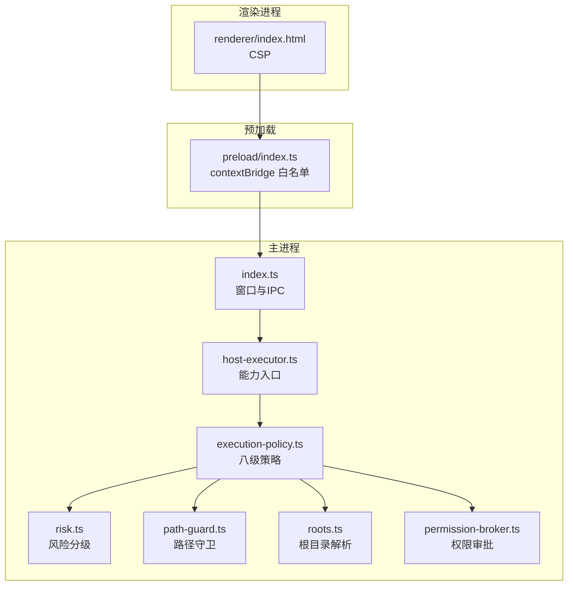
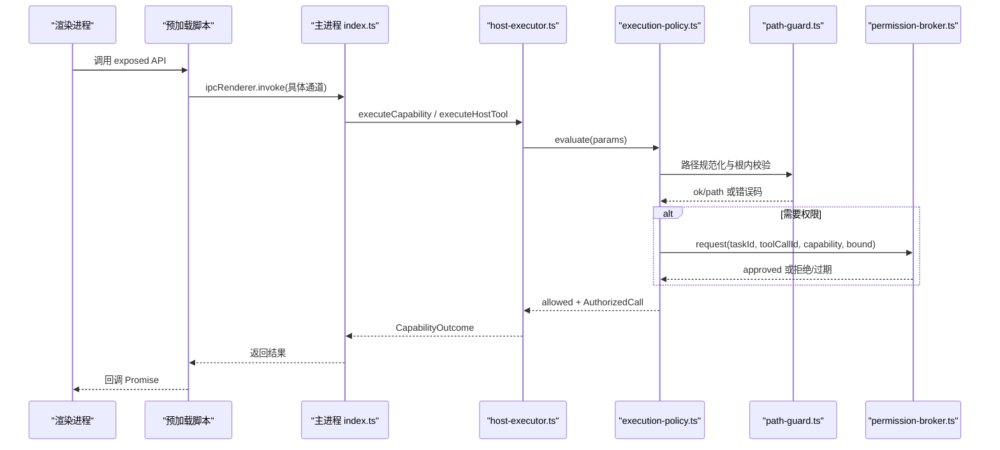
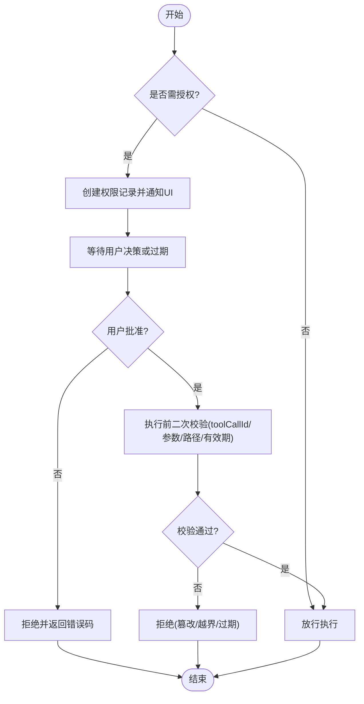
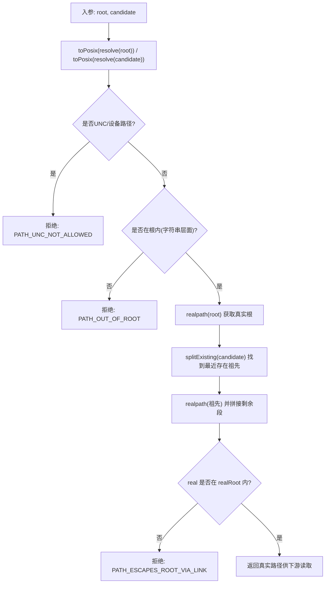
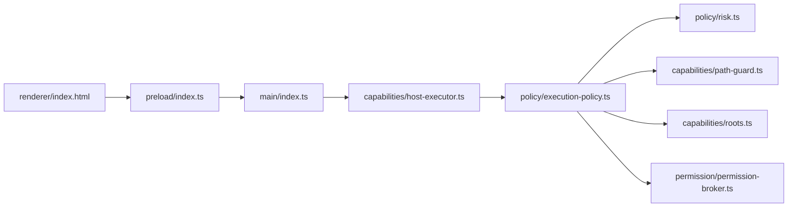

# 安全配置

<cite>
**本文引用的文件**
- [apps/desktop/src/main/index.ts](file://apps/desktop/src/main/index.ts)
- [apps/desktop/src/preload/index.ts](file://apps/desktop/src/preload/index.ts)
- [apps/desktop/src/renderer/index.html](file://apps/desktop/src/renderer/index.html)
- [apps/desktop/src/main/capabilities/host-executor.ts](file://apps/desktop/src/main/capabilities/host-executor.ts)
- [apps/desktop/src/main/policy/execution-policy.ts](file://apps/desktop/src/main/policy/execution-policy.ts)
- [apps/desktop/src/main/policy/risk.ts](file://apps/desktop/src/main/policy/risk.ts)
- [apps/desktop/src/main/capabilities/path-guard.ts](file://apps/desktop/src/main/capabilities/path-guard.ts)
- [apps/desktop/src/main/capabilities/roots.ts](file://apps/desktop/src/main/capabilities/roots.ts)
- [apps/desktop/src/main/permission/permission-broker.ts](file://apps/desktop/src/main/permission/permission-broker.ts)
- [apps/desktop/src/shared/ipc-contract.ts](file://apps/desktop/src/shared/ipc-contract.ts)
</cite>

## 目录
1. [简介](#简介)
2. [项目结构](#项目结构)
3. [核心组件](#核心组件)
4. [架构总览](#架构总览)
5. [详细组件分析](#详细组件分析)
6. [依赖关系分析](#依赖关系分析)
7. [性能与安全权衡](#性能与安全权衡)
8. [故障排查指南](#故障排查指南)
9. [结论](#结论)
10. [附录：安全配置清单与最佳实践](#附录：安全配置清单与最佳实践)

## 简介
本文件面向 Electron 应用的安全配置，聚焦沙箱、上下文隔离、预加载脚本边界、权限模型、外部资源访问控制、跨域与内容安全策略（CSP），以及调试模式下的安全注意事项。文档基于仓库中的主进程窗口创建、预加载桥接、能力执行策略、路径守卫与权限审批等实现进行说明，并提供可视化图示与可操作的安全清单。

## 项目结构
本项目采用多进程架构：
- 主进程负责窗口创建、IPC 路由、能力执行编排、权限审批与持久化。
- 预加载脚本通过 contextBridge 暴露最小 API 给渲染进程。
- 渲染进程仅通过受限 API 与主进程通信，不直接持有 Node.js 能力。
- 能力执行层对工具调用进行注册、作用域、参数绑定、风险评估、路径守卫与权限校验。

图表来源
- [apps/desktop/src/main/index.ts:56-90](file://apps/desktop/src/main/index.ts#L56-L90)
- [apps/desktop/src/preload/index.ts:1-51](file://apps/desktop/src/preload/index.ts#L1-L51)
- [apps/desktop/src/renderer/index.html:1-17](file://apps/desktop/src/renderer/index.html#L1-L17)
- [apps/desktop/src/main/capabilities/host-executor.ts:1-118](file://apps/desktop/src/main/capabilities/host-executor.ts#L1-L118)
- [apps/desktop/src/main/policy/execution-policy.ts:85-157](file://apps/desktop/src/main/policy/execution-policy.ts#L85-L157)
- [apps/desktop/src/main/policy/risk.ts:1-22](file://apps/desktop/src/main/policy/risk.ts#L1-L22)
- [apps/desktop/src/main/capabilities/path-guard.ts:1-126](file://apps/desktop/src/main/capabilities/path-guard.ts#L1-L126)
- [apps/desktop/src/main/capabilities/roots.ts:1-27](file://apps/desktop/src/main/capabilities/roots.ts#L1-L27)
- [apps/desktop/src/main/permission/permission-broker.ts:100-258](file://apps/desktop/src/main/permission/permission-broker.ts#L100-L258)

章节来源
- [apps/desktop/src/main/index.ts:56-90](file://apps/desktop/src/main/index.ts#L56-L90)
- [apps/desktop/src/preload/index.ts:1-51](file://apps/desktop/src/preload/index.ts#L1-L51)
- [apps/desktop/src/renderer/index.html:1-17](file://apps/desktop/src/renderer/index.html#L1-L17)

## 核心组件
- 窗口与沙箱：在创建 BrowserWindow 时启用 sandbox、contextIsolation，并关闭 nodeIntegration；限制新窗口打开为系统浏览器；开发/生产分别加载远程或本地页面。
- 预加载桥接：仅通过 contextBridge.exposeInMainWorld 暴露有限方法，所有 IPC 通道命名明确且受控。
- 能力执行与策略：统一入口 host-executor 将 UI 与 Agent 两条调用路径接入执行策略；策略包含注册检查、作用域、计划对齐、参数绑定、风险评估、路径守卫、权限验证等。
- 权限模型：permission-broker 负责请求、存储、通知、过期处理与最终裁决；UI 通过 IPC 响应批准/拒绝。
- 路径守卫：roots 提供根目录解析；path-guard 做 UNC 拒绝、根内判定、符号链接/连接点二次校验，防止越界访问。
- CSP：渲染页面通过 meta 标签声明内容安全策略，限制脚本、样式与图片来源。

章节来源
- [apps/desktop/src/main/index.ts:56-90](file://apps/desktop/src/main/index.ts#L56-L90)
- [apps/desktop/src/preload/index.ts:1-51](file://apps/desktop/src/preload/index.ts#L1-L51)
- [apps/desktop/src/main/capabilities/host-executor.ts:1-118](file://apps/desktop/src/main/capabilities/host-executor.ts#L1-L118)
- [apps/desktop/src/main/policy/execution-policy.ts:85-157](file://apps/desktop/src/main/policy/execution-policy.ts#L85-L157)
- [apps/desktop/src/main/permission/permission-broker.ts:100-258](file://apps/desktop/src/main/permission/permission-broker.ts#L100-L258)
- [apps/desktop/src/main/capabilities/path-guard.ts:1-126](file://apps/desktop/src/main/capabilities/path-guard.ts#L1-L126)
- [apps/desktop/src/main/capabilities/roots.ts:1-27](file://apps/desktop/src/main/capabilities/roots.ts#L1-L27)
- [apps/desktop/src/renderer/index.html:1-17](file://apps/desktop/src/renderer/index.html#L1-L17)

## 架构总览
下图展示从渲染进程到主进程能力执行的完整调用链，包括策略评估、路径守卫与权限审批的交互。

图表来源
- [apps/desktop/src/main/index.ts:133-323](file://apps/desktop/src/main/index.ts#L133-L323)
- [apps/desktop/src/preload/index.ts:10-46](file://apps/desktop/src/preload/index.ts#L10-L46)
- [apps/desktop/src/main/capabilities/host-executor.ts:78-117](file://apps/desktop/src/main/capabilities/host-executor.ts#L78-L117)
- [apps/desktop/src/main/policy/execution-policy.ts:88-157](file://apps/desktop/src/main/policy/execution-policy.ts#L88-L157)
- [apps/desktop/src/main/capabilities/path-guard.ts:70-125](file://apps/desktop/src/main/capabilities/path-guard.ts#L70-L125)
- [apps/desktop/src/main/permission/permission-broker.ts:133-181](file://apps/desktop/src/main/permission/permission-broker.ts#L133-L181)

## 详细组件分析

### 沙箱与上下文隔离
- 关键设置：
  - sandbox: true：启用 Chromium 沙箱，限制渲染进程能力。
  - contextIsolation: true：隔离渲染上下文，禁止直接访问 Node 全局。
  - nodeIntegration: false：禁用渲染进程直接访问 Node.js。
- 效果：
  - 渲染进程只能通过预加载脚本暴露的白名单 API 与主进程通信。
  - 新窗口打开被强制使用系统浏览器，避免在应用内加载不可信 URL。
  - 开发环境可通过环境变量加载远程页面，但生产环境始终加载本地 HTML。

章节来源
- [apps/desktop/src/main/index.ts:56-90](file://apps/desktop/src/main/index.ts#L56-L90)

### 预加载脚本的安全边界
- 通过 contextBridge.exposeInMainWorld 仅暴露必要方法，如运行时状态查询、PDF 列表、任务运行、时间线、权限响应与监听。
- 唯一的主→渲染推送通道用于权限通知，并提供取消订阅函数，避免内存泄漏。
- 所有 IPC 通道名集中定义，便于审计与最小权限控制。

章节来源
- [apps/desktop/src/preload/index.ts:1-51](file://apps/desktop/src/preload/index.ts#L1-L51)
- [apps/desktop/src/shared/ipc-contract.ts:24-75](file://apps/desktop/src/shared/ipc-contract.ts#L24-L75)

### 权限模型与用户确认机制
- 风险分级：WRITE 类能力标记为需授权，READ 类无需授权。
- 审批流程：
  - 策略评估发现需授权时，向 permission-broker 发起请求，记录权限条目并推送到 UI。
  - UI 通过 IPC 响应批准或拒绝；broker 更新状态、写入事件、清理等待者。
  - 执行前再次 verify：校验 toolCallId、参数指纹、路径范围与有效期。
- 超时与过期：默认 TTL 内未响应则自动过期并拒绝。

图表来源
- [apps/desktop/src/main/policy/risk.ts:13-21](file://apps/desktop/src/main/policy/risk.ts#L13-L21)
- [apps/desktop/src/main/policy/execution-policy.ts:119-139](file://apps/desktop/src/main/policy/execution-policy.ts#L119-L139)
- [apps/desktop/src/main/permission/permission-broker.ts:133-181](file://apps/desktop/src/main/permission/permission-broker.ts#L133-L181)
- [apps/desktop/src/main/permission/permission-broker.ts:283-327](file://apps/desktop/src/main/permission/permission-broker.ts#L283-L327)

章节来源
- [apps/desktop/src/main/policy/risk.ts:1-22](file://apps/desktop/src/main/policy/risk.ts#L1-L22)
- [apps/desktop/src/main/policy/execution-policy.ts:85-157](file://apps/desktop/src/main/policy/execution-policy.ts#L85-L157)
- [apps/desktop/src/main/permission/permission-broker.ts:100-258](file://apps/desktop/src/main/permission/permission-broker.ts#L100-L258)
- [apps/desktop/src/main/permission/permission-broker.ts:283-327](file://apps/desktop/src/main/permission/permission-broker.ts#L283-L327)

### 外部资源访问控制（文件系统）
- 根目录解析：通过 roots.resolveRoot 将 rootId 映射到环境变量或默认下载目录，统一为正斜杠绝对路径。
- 路径守卫：
  - 拒绝 UNC 与设备路径。
  - 先做字符串层面的根内判断，再对存在祖先进行 realpath 解析，防止符号链接/连接点逃逸。
  - 若目标不存在，仅对最近存在的祖先做 realpath，避免误判。
- 结合权限：WRITE 能力在执行前必须通过路径守卫与权限校验。

图表来源
- [apps/desktop/src/main/capabilities/roots.ts:18-26](file://apps/desktop/src/main/capabilities/roots.ts#L18-L26)
- [apps/desktop/src/main/capabilities/path-guard.ts:7-17](file://apps/desktop/src/main/capabilities/path-guard.ts#L7-L17)
- [apps/desktop/src/main/capabilities/path-guard.ts:70-125](file://apps/desktop/src/main/capabilities/path-guard.ts#L70-L125)

章节来源
- [apps/desktop/src/main/capabilities/roots.ts:1-27](file://apps/desktop/src/main/capabilities/roots.ts#L1-L27)
- [apps/desktop/src/main/capabilities/path-guard.ts:1-126](file://apps/desktop/src/main/capabilities/path-guard.ts#L1-L126)

### 跨域安全与 CSP 配置
- 渲染页面通过 meta 标签声明 CSP：
  - default-src 'self'
  - script-src 'self'
  - style-src 'self' 'unsafe-inline'
  - img-src 'self' data:
- 影响：
  - 阻止加载外部脚本，降低注入风险。
  - 允许内联样式以支持框架样式方案。
  - 图片允许同源与 data URI。
- 建议：
  - 谨慎放宽 script-src，避免 unsafe-eval 与 inline script。
  - 如需加载远程资源，应使用白名单域名与严格 CSP 组合。

章节来源
- [apps/desktop/src/renderer/index.html:1-17](file://apps/desktop/src/renderer/index.html#L1-L17)

### 调试模式下的安全考虑
- 开发环境：
  - 当存在远程渲染 URL 环境变量时，主进程加载远程页面以便热重载。
  - 使用优化器监听窗口快捷键，便于调试。
- 生产环境：
  - 始终加载本地 HTML，避免远程代码注入。
  - 保持沙箱与上下文隔离开启，确保最小攻击面。
- 建议：
  - 在生产构建中移除远程加载逻辑，仅保留本地加载分支。
  - 限制 DevTools 仅在开发环境可用。

章节来源
- [apps/desktop/src/main/index.ts:78-106](file://apps/desktop/src/main/index.ts#L78-L106)

## 依赖关系分析
- 主进程入口 index.ts 负责窗口创建、IPC 路由与生命周期管理。
- host-executor 作为能力入口，区分 agent 与 ui 两种来源，复用同一 scope 与 retriever。
- execution-policy 串联注册、作用域、计划对齐、参数绑定、风险评估、路径守卫与权限验证。
- path-guard 与 roots 共同保障文件系统访问在授权根内。
- permission-broker 管理权限生命周期并与 UI 双向通信。

图表来源
- [apps/desktop/src/main/index.ts:56-90](file://apps/desktop/src/main/index.ts#L56-L90)
- [apps/desktop/src/main/capabilities/host-executor.ts:1-118](file://apps/desktop/src/main/capabilities/host-executor.ts#L1-L118)
- [apps/desktop/src/main/policy/execution-policy.ts:85-157](file://apps/desktop/src/main/policy/execution-policy.ts#L85-L157)
- [apps/desktop/src/main/policy/risk.ts:1-22](file://apps/desktop/src/main/policy/risk.ts#L1-L22)
- [apps/desktop/src/main/capabilities/path-guard.ts:1-126](file://apps/desktop/src/main/capabilities/path-guard.ts#L1-L126)
- [apps/desktop/src/main/capabilities/roots.ts:1-27](file://apps/desktop/src/main/capabilities/roots.ts#L1-L27)
- [apps/desktop/src/main/permission/permission-broker.ts:100-258](file://apps/desktop/src/main/permission/permission-broker.ts#L100-L258)
- [apps/desktop/src/preload/index.ts:1-51](file://apps/desktop/src/preload/index.ts#L1-L51)
- [apps/desktop/src/renderer/index.html:1-17](file://apps/desktop/src/renderer/index.html#L1-L17)

章节来源
- [apps/desktop/src/main/index.ts:56-90](file://apps/desktop/src/main/index.ts#L56-L90)
- [apps/desktop/src/main/capabilities/host-executor.ts:1-118](file://apps/desktop/src/main/capabilities/host-executor.ts#L1-L118)
- [apps/desktop/src/main/policy/execution-policy.ts:85-157](file://apps/desktop/src/main/policy/execution-policy.ts#L85-L157)

## 性能与安全权衡
- 沙箱与上下文隔离带来额外 IPC 开销，但显著降低攻击面。
- 路径守卫涉及 realpath 与 stat 调用，建议在批量操作中合并或缓存已解析路径。
- 权限审批会引入用户交互延迟，应在 UI 上提供清晰反馈与快速操作。
- 策略评估顺序将参数绑定与路径守卫置于批准之前，减少无效的用户确认。

[本节为通用指导，不直接分析具体文件]

## 故障排查指南
- 权限通道不可用：
  - 现象：响应“批准通道未就绪”。
  - 原因：product-state 数据库未成功初始化。
  - 处理：检查数据库启动与 broker 构造日志。
- 路径访问失败：
  - 现象：PATH_OUT_OF_ROOT、PATH_ESCAPES_ROOT_VIA_LINK、PATH_UNC_NOT_ALLOWED。
  - 原因：路径不在授权根、符号链接逃逸、UNC 路径。
  - 处理：修正 rootId 与环境变量，或使用相对路径并确保在授权根内。
- 参数非法：
  - 现象：INVALID_ARGUMENT。
  - 原因：capability 或 arguments 不符合契约。
  - 处理：核对协议定义与入参类型。
- 权限过期或被篡改：
  - 现象：PERMISSION_EXPIRED、PERMISSION_TAMPERED。
  - 原因：TTL 超时、toolCallId 或 argsHash 不一致。
  - 处理：重新发起请求，确保调用链一致。

章节来源
- [apps/desktop/src/main/index.ts:298-323](file://apps/desktop/src/main/index.ts#L298-L323)
- [apps/desktop/src/main/capabilities/path-guard.ts:70-125](file://apps/desktop/src/main/capabilities/path-guard.ts#L70-L125)
- [apps/desktop/src/main/permission/permission-broker.ts:183-234](file://apps/desktop/src/main/permission/permission-broker.ts#L183-L234)
- [apps/desktop/src/main/permission/permission-broker.ts:283-327](file://apps/desktop/src/main/permission/permission-broker.ts#L283-L327)

## 结论
该 Electron 应用在窗口级别启用了沙箱与上下文隔离，并通过预加载脚本建立最小化的 IPC 白名单。能力执行层采用严格的策略管道，结合路径守卫与权限审批，有效限制了文件系统与副作用操作的访问面。CSP 进一步约束了渲染进程的脚本与资源加载。建议在后续迭代中持续收紧 CSP、最小化预加载暴露面，并对开发环境的远程加载进行更严格的管控。

[本节为总结性内容，不直接分析具体文件]

## 附录：安全配置清单与最佳实践
- 窗口与沙箱
  - 启用 sandbox: true
  - 启用 contextIsolation: true
  - 关闭 nodeIntegration: false
  - 限制新窗口打开为系统浏览器
  - 生产环境仅加载本地 HTML
- 预加载脚本
  - 仅通过 contextBridge 暴露必要方法
  - 集中管理 IPC 通道名
  - 为推送通道提供取消订阅
- 能力与策略
  - 所有能力通过统一入口进入策略评估
  - 参数绑定与路径守卫优先于权限审批
  - WRITE 能力强制要求权限
- 路径守卫
  - 拒绝 UNC 与设备路径
  - 根内字符串判定 + realpath 二次校验
  - 使用环境变量配置授权根
- 权限模型
  - 记录 toolCallId、参数指纹、源/目标路径
  - 设置 TTL，超时自动过期
  - 执行前二次校验，防篡改
- CSP
  - 限制脚本来源为自身
  - 谨慎使用 unsafe-inline
  - 图片允许同源与 data URI
- 调试模式
  - 开发环境可加载远程页面，生产环境禁用
  - 限制 DevTools 仅在开发环境可用

[本节为通用清单，不直接分析具体文件]