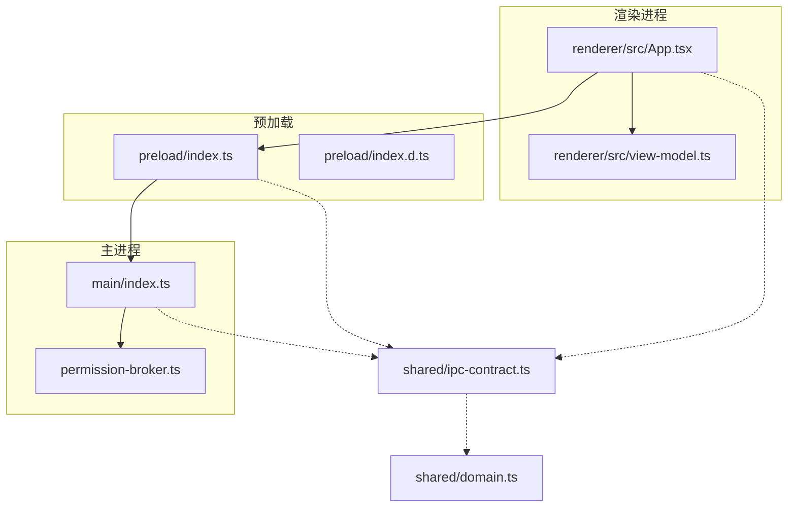
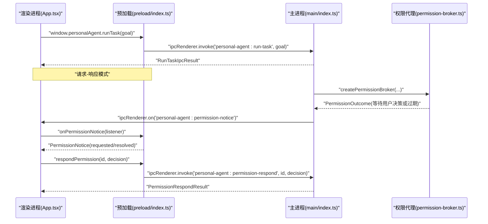
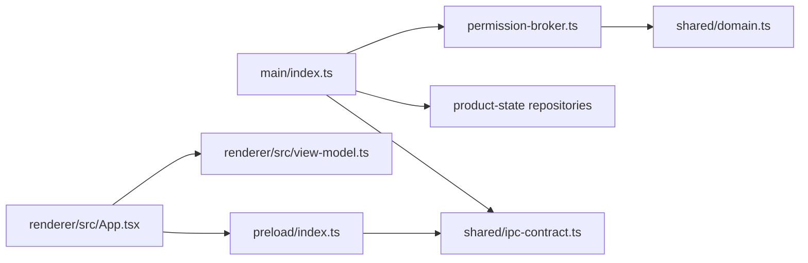

# 渲染进程架构

<cite>
**本文引用的文件**
- [apps/desktop/src/main/index.ts](file://apps/desktop/src/main/index.ts)
- [apps/desktop/src/preload/index.ts](file://apps/desktop/src/preload/index.ts)
- [apps/desktop/src/preload/index.d.ts](file://apps/desktop/src/preload/index.d.ts)
- [apps/desktop/src/shared/ipc-contract.ts](file://apps/desktop/src/shared/ipc-contract.ts)
- [apps/desktop/src/shared/domain.ts](file://apps/desktop/src/shared/domain.ts)
- [apps/desktop/src/renderer/src/App.tsx](file://apps/desktop/src/renderer/src/App.tsx)
- [apps/desktop/src/renderer/src/view-model.ts](file://apps/desktop/src/renderer/src/view-model.ts)
- [apps/desktop/src/main/permission/permission-broker.ts](file://apps/desktop/src/main/permission/permission-broker.ts)
- [apps/desktop/electron.vite.config.ts](file://apps/desktop/electron.vite.config.ts)
</cite>

## 目录
1. [简介](#简介)
2. [项目结构](#项目结构)
3. [核心组件](#核心组件)
4. [架构总览](#架构总览)
5. [详细组件分析](#详细组件分析)
6. [依赖关系分析](#依赖关系分析)
7. [性能与可维护性](#性能与可维护性)
8. [故障排查指南](#故障排查指南)
9. [结论](#结论)

## 简介
本文档聚焦 Electron 渲染进程的架构设计，围绕安全沙箱、预加载脚本、IPC 通信、数据契约以及组件与主进程的交互模式展开。目标是帮助读者理解如何在受限的渲染环境中暴露最小且安全的 API，并通过事件驱动与请求-响应机制实现状态同步与界面更新。

## 项目结构
本项目的渲染相关代码主要分布在以下位置：
- 主进程入口与窗口配置：定义 BrowserWindow 的安全选项、预加载脚本路径、IPC 通道注册。
- 预加载脚本：通过 contextBridge 向渲染进程暴露受控 API，封装 IPC 调用与事件订阅。
- 共享类型与契约：集中定义 IPC 层与领域模型的数据结构，保证主进程、预加载、渲染三端类型一致。
- 渲染应用（React）：通过 window.personalAgent 调用预加载暴露的 API，管理 UI 状态并处理权限审批等交互。

图表来源
- [apps/desktop/src/main/index.ts:56-72](file://apps/desktop/src/main/index.ts#L56-L72)
- [apps/desktop/src/preload/index.ts:1-51](file://apps/desktop/src/preload/index.ts#L1-L51)
- [apps/desktop/src/preload/index.d.ts:1-58](file://apps/desktop/src/preload/index.d.ts#L1-L58)
- [apps/desktop/src/shared/ipc-contract.ts:1-75](file://apps/desktop/src/shared/ipc-contract.ts#L1-L75)
- [apps/desktop/src/shared/domain.ts:1-158](file://apps/desktop/src/shared/domain.ts#L1-L158)
- [apps/desktop/src/renderer/src/App.tsx:1-294](file://apps/desktop/src/renderer/src/App.tsx#L1-L294)
- [apps/desktop/src/renderer/src/view-model.ts:1-360](file://apps/desktop/src/renderer/src/view-model.ts#L1-L360)

章节来源
- [apps/desktop/src/main/index.ts:56-72](file://apps/desktop/src/main/index.ts#L56-L72)
- [apps/desktop/src/preload/index.ts:1-51](file://apps/desktop/src/preload/index.ts#L1-L51)
- [apps/desktop/src/preload/index.d.ts:1-58](file://apps/desktop/src/preload/index.d.ts#L1-L58)
- [apps/desktop/src/shared/ipc-contract.ts:1-75](file://apps/desktop/src/shared/ipc-contract.ts#L1-L75)
- [apps/desktop/src/shared/domain.ts:1-158](file://apps/desktop/src/shared/domain.ts#L1-L158)
- [apps/desktop/src/renderer/src/App.tsx:1-294](file://apps/desktop/src/renderer/src/App.tsx#L1-L294)
- [apps/desktop/src/renderer/src/view-model.ts:1-360](file://apps/desktop/src/renderer/src/view-model.ts#L1-L360)

## 核心组件
- 安全沙箱配置：在创建 BrowserWindow 时启用 sandbox、contextIsolation，并关闭 nodeIntegration，仅通过预加载脚本暴露最小 API。
- 预加载脚本：使用 contextBridge.exposeInMainWorld 暴露 personalAgent 对象，包含请求-响应方法（invoke）和事件订阅（onPermissionNotice）。
- IPC 客户端：渲染进程通过 window.personalAgent 调用方法，内部基于 ipcRenderer.invoke；事件监听通过 onPermissionNotice 返回取消函数。
- 数据契约：ipc-contract 与 domain 定义了任务、计划、事件、权限记录、IPC 结果等类型，确保跨进程类型安全。
- 组件通信：App 组件负责发起任务、读取时间线、订阅批准通知、提交批准决定，并通过 view-model 进行展示层数据转换。

章节来源
- [apps/desktop/src/main/index.ts:56-72](file://apps/desktop/src/main/index.ts#L56-L72)
- [apps/desktop/src/preload/index.ts:1-51](file://apps/desktop/src/preload/index.ts#L1-L51)
- [apps/desktop/src/preload/index.d.ts:1-58](file://apps/desktop/src/preload/index.d.ts#L1-L58)
- [apps/desktop/src/shared/ipc-contract.ts:1-75](file://apps/desktop/src/shared/ipc-contract.ts#L1-L75)
- [apps/desktop/src/shared/domain.ts:1-158](file://apps/desktop/src/shared/domain.ts#L1-L158)
- [apps/desktop/src/renderer/src/App.tsx:1-294](file://apps/desktop/src/renderer/src/App.tsx#L1-L294)
- [apps/desktop/src/renderer/src/view-model.ts:1-360](file://apps/desktop/src/renderer/src/view-model.ts#L1-L360)

## 架构总览
渲染进程采用“受限环境 + 预加载桥接”的模式：
- 渲染进程无法直接访问 Node/Electron 能力，必须通过预加载脚本暴露的方法。
- 预加载脚本将渲染进程的请求转发到主进程 IPC，并将主进程推送的事件回调给渲染进程。
- 主进程负责业务逻辑、数据库访问、权限审批流程以及与 Python 运行时的通信。
- 数据契约集中在 shared 目录，供主进程、预加载、渲染进程共同引用，保证类型一致。

图表来源
- [apps/desktop/src/preload/index.ts:1-51](file://apps/desktop/src/preload/index.ts#L1-L51)
- [apps/desktop/src/main/index.ts:134-323](file://apps/desktop/src/main/index.ts#L134-L323)
- [apps/desktop/src/main/permission/permission-broker.ts:100-258](file://apps/desktop/src/main/permission/permission-broker.ts#L100-L258)
- [apps/desktop/src/renderer/src/App.tsx:111-150](file://apps/desktop/src/renderer/src/App.tsx#L111-L150)

## 详细组件分析

### 安全沙箱配置
- 在 BrowserWindow 中启用 sandbox、contextIsolation，并禁用 nodeIntegration，确保渲染进程处于受限环境。
- 通过 preload 指定预加载脚本路径，使渲染进程只能通过 contextBridge 暴露的 API 与主进程通信。
- 开发模式下支持 HMR 与远程 URL 加载，生产模式加载本地 HTML。

章节来源
- [apps/desktop/src/main/index.ts:56-89](file://apps/desktop/src/main/index.ts#L56-L89)
- [apps/desktop/electron.vite.config.ts:1-24](file://apps/desktop/electron.vite.config.ts#L1-L24)

### 预加载脚本设计模式
- 使用 contextBridge.exposeInMainWorld 暴露 personalAgent 对象，包含：
  - 请求-响应方法：runtimeStatus、listPdfs、indexedPdfs、listTasks、runTask、getTimeline、respondPermission、listPermissions。
  - 事件订阅：onPermissionNotice，返回取消订阅函数，避免内存泄漏。
- 所有方法均通过 ipcRenderer.invoke 调用主进程 IPC 处理器，事件通过 ipcRenderer.on 接收主进程推送。
- 类型声明文件 index.d.ts 扩展 Window 接口，提供完整的 TypeScript 类型提示。

章节来源
- [apps/desktop/src/preload/index.ts:1-51](file://apps/desktop/src/preload/index.ts#L1-L51)
- [apps/desktop/src/preload/index.d.ts:1-58](file://apps/desktop/src/preload/index.d.ts#L1-L58)

### IPC 客户端实现
- 请求-响应模式：渲染进程调用 window.personalAgent.* 方法，内部使用 ipcRenderer.invoke 发送消息，主进程通过 ipcMain.handle 处理并返回结果。
- 事件监听机制：onPermissionNotice 在主进程通过 BrowserWindow.webContents.send 推送 PermissionNotice，渲染进程通过回调处理 requested 与 resolved 两种事件。
- 错误处理：所有 IPC 调用返回统一的结果类型，包含 ok 标志、错误码与消息，便于渲染进程统一处理成功与失败分支。

章节来源
- [apps/desktop/src/preload/index.ts:1-51](file://apps/desktop/src/preload/index.ts#L1-L51)
- [apps/desktop/src/main/index.ts:134-323](file://apps/desktop/src/main/index.ts#L134-L323)
- [apps/desktop/src/shared/ipc-contract.ts:24-75](file://apps/desktop/src/shared/ipc-contract.ts#L24-L75)

### 数据契约与验证规则
- 领域模型：domain.ts 定义了 TaskRecord、PlanRecord、ExecutionEventRecord、PermissionRecord 等核心数据结构，以及状态枚举与视图投影。
- IPC 契约：ipc-contract.ts 定义了 IPC 层的结果类型，如 ListPdfsResult、RunTaskIpcResult、TimelineIpcResult、PermissionRespondResult 等，统一错误码与消息格式。
- 类型复用：预加载与渲染进程通过 shared 类型保持契约一致，避免类型漂移。

章节来源
- [apps/desktop/src/shared/domain.ts:1-158](file://apps/desktop/src/shared/domain.ts#L1-L158)
- [apps/desktop/src/shared/ipc-contract.ts:1-75](file://apps/desktop/src/shared/ipc-contract.ts#L1-L75)

### 组件与主进程的通信模式
- 状态同步：App 组件通过 listTasks、getTimeline、indexedPdfs 等方法获取数据，并更新 React 状态。
- 事件驱动更新：通过 onPermissionNotice 订阅主进程推送的权限申请与决议事件，动态显示权限对话框并处理用户决策。
- 展示层转换：view-model.ts 提供 describeRunOutcome、describeEvent、formatRemaining、timelineToMarkdown 等工具函数，将原始数据转换为 UI 友好的展示内容。

章节来源
- [apps/desktop/src/renderer/src/App.tsx:21-294](file://apps/desktop/src/renderer/src/App.tsx#L21-L294)
- [apps/desktop/src/renderer/src/view-model.ts:1-360](file://apps/desktop/src/renderer/src/view-model.ts#L1-L360)

## 依赖关系分析
- 主进程依赖：
  - 数据库与仓库：product-state 下的 task、plan、event、permission 仓库。
  - 权限代理：permission-broker 负责权限生命周期管理与事件广播。
  - 能力执行：capabilities/host-executor 用于文件系统等操作。
- 预加载依赖：
  - electron 的 contextBridge 与 ipcRenderer。
  - shared/ipc-contract 类型定义。
- 渲染进程依赖：
  - React 与 UI 组件。
  - shared/ipc-contract 与 view-model 工具函数。

图表来源
- [apps/desktop/src/main/index.ts:1-32](file://apps/desktop/src/main/index.ts#L1-L32)
- [apps/desktop/src/main/permission/permission-broker.ts:1-18](file://apps/desktop/src/main/permission/permission-broker.ts#L1-L18)
- [apps/desktop/src/preload/index.ts:1-4](file://apps/desktop/src/preload/index.ts#L1-L4)
- [apps/desktop/src/renderer/src/App.tsx:1-20](file://apps/desktop/src/renderer/src/App.tsx#L1-L20)
- [apps/desktop/src/renderer/src/view-model.ts:1-10](file://apps/desktop/src/renderer/src/view-model.ts#L1-L10)
- [apps/desktop/src/shared/ipc-contract.ts:1-14](file://apps/desktop/src/shared/ipc-contract.ts#L1-L14)
- [apps/desktop/src/shared/domain.ts:1-14](file://apps/desktop/src/shared/domain.ts#L1-L14)

章节来源
- [apps/desktop/src/main/index.ts:1-32](file://apps/desktop/src/main/index.ts#L1-L32)
- [apps/desktop/src/main/permission/permission-broker.ts:1-18](file://apps/desktop/src/main/permission/permission-broker.ts#L1-L18)
- [apps/desktop/src/preload/index.ts:1-4](file://apps/desktop/src/preload/index.ts#L1-L4)
- [apps/desktop/src/renderer/src/App.tsx:1-20](file://apps/desktop/src/renderer/src/App.tsx#L1-L20)
- [apps/desktop/src/renderer/src/view-model.ts:1-10](file://apps/desktop/src/renderer/src/view-model.ts#L1-L10)
- [apps/desktop/src/shared/ipc-contract.ts:1-14](file://apps/desktop/src/shared/ipc-contract.ts#L1-L14)
- [apps/desktop/src/shared/domain.ts:1-14](file://apps/desktop/src/shared/domain.ts#L1-L14)

## 性能与可维护性
- 预加载脚本仅暴露必要 API，减少攻击面，提升安全性。
- 事件订阅返回取消函数，避免内存泄漏，提高长期运行稳定性。
- 统一的结果类型与错误码便于前端统一处理异常，降低调试成本。
- 数据契约集中管理，便于多端类型同步与重构。

[本节为通用指导，不直接分析具体文件]

## 故障排查指南
- 预加载脚本错误：检查 contextBridge.exposeInMainWorld 是否成功，确认 process.contextIsolated 条件分支。
- IPC 调用失败：查看主进程 ipcMain.handle 是否正确注册，确认通道名称一致。
- 权限通知未收到：确认主进程 broadcastPermissionNotice 是否被调用，检查 BrowserWindow.getAllWindows 列表。
- 数据库连接失败：检查 product-state 数据库初始化与仓库实例化，关注 RUNTIME_ERROR_CODE.DB_FAILED 分支。

章节来源
- [apps/desktop/src/preload/index.ts:47-49](file://apps/desktop/src/preload/index.ts#L47-L49)
- [apps/desktop/src/main/index.ts:134-323](file://apps/desktop/src/main/index.ts#L134-L323)
- [apps/desktop/src/main/index.ts:49-54](file://apps/desktop/src/main/index.ts#L49-L54)

## 结论
该渲染进程架构通过严格的安全沙箱、最小化的预加载 API 暴露、统一的 IPC 契约与事件驱动更新机制，实现了安全、可维护且可扩展的桌面应用前端。组件与主进程的通信清晰明确，数据契约集中管理，便于团队协作与后续演进。

[本节为总结性内容，不直接分析具体文件]