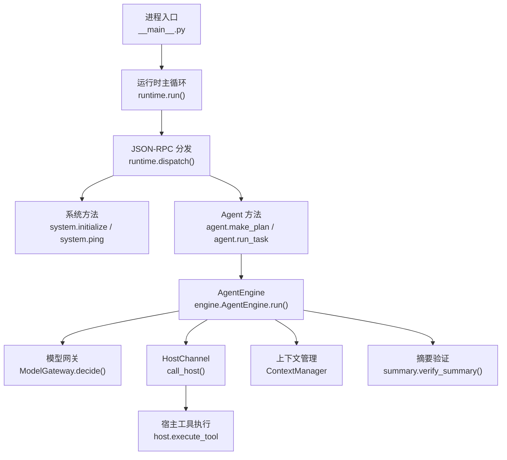
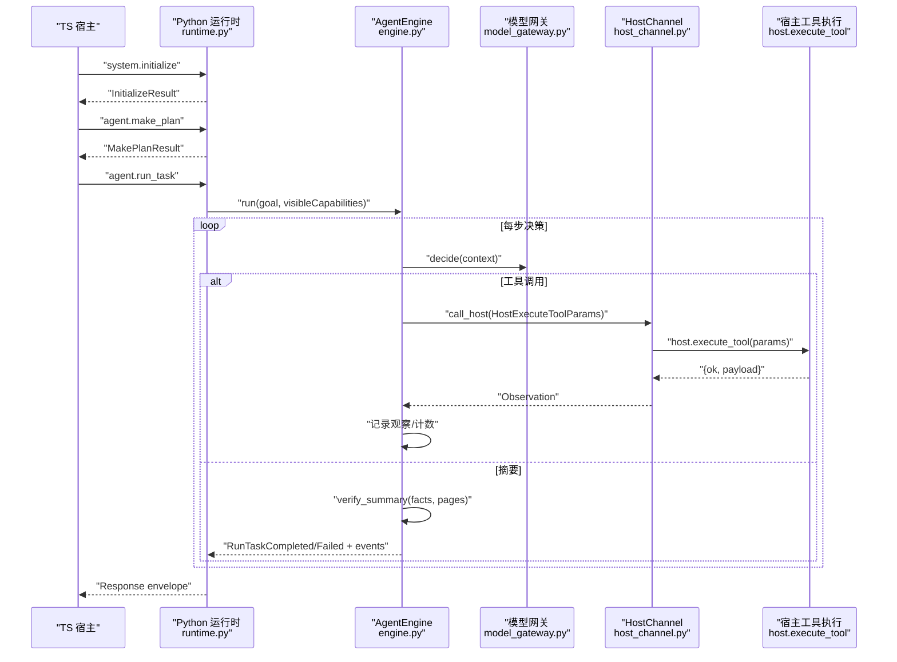
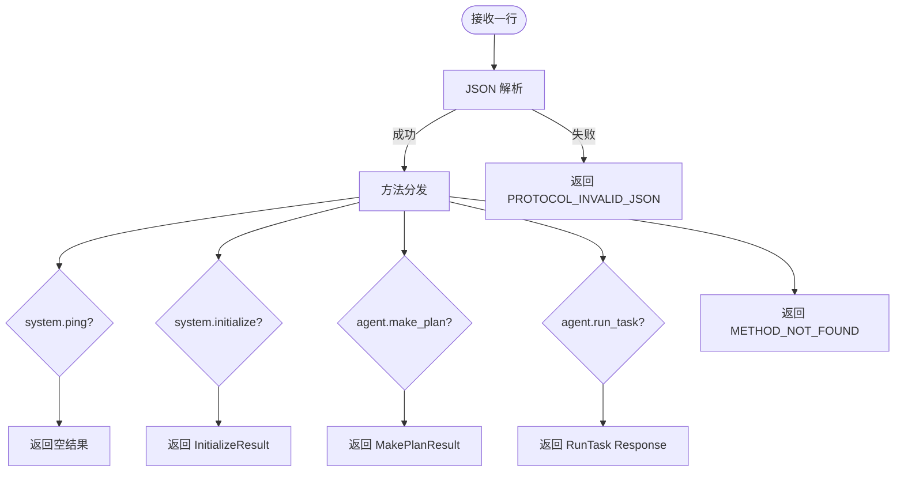
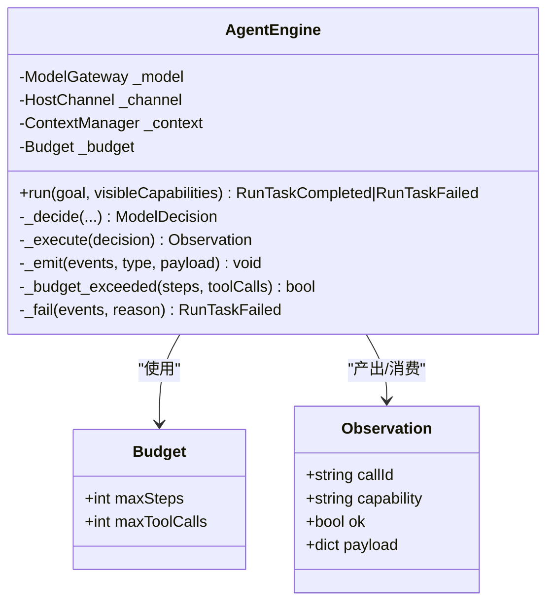
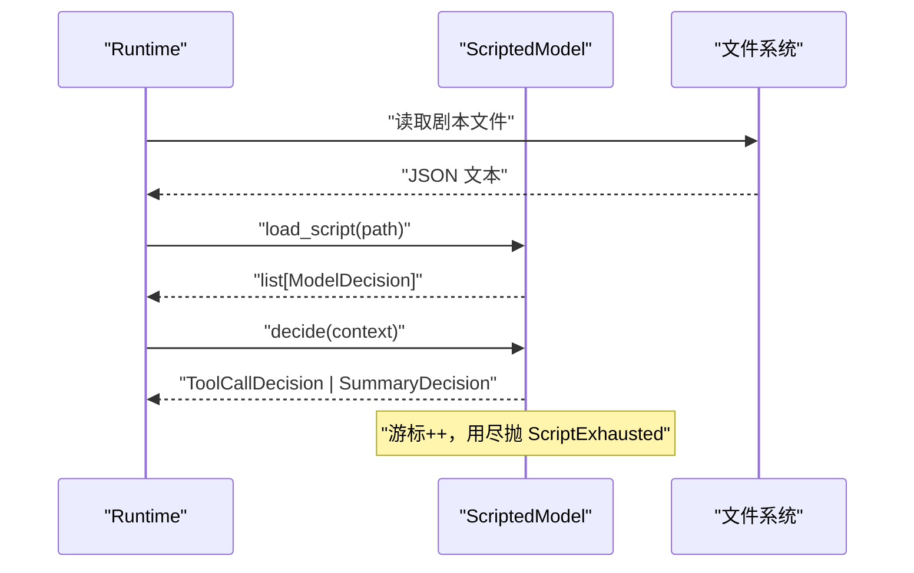
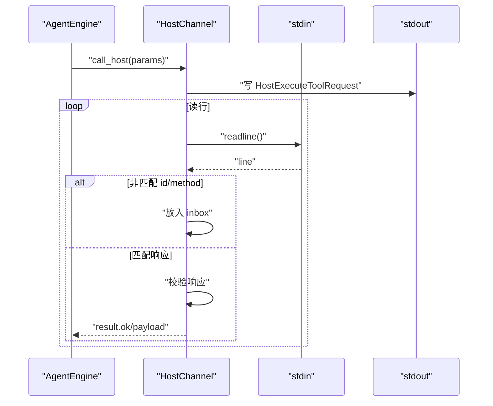
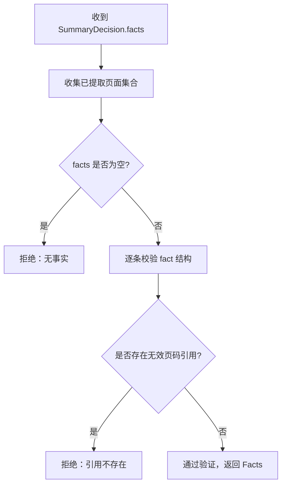
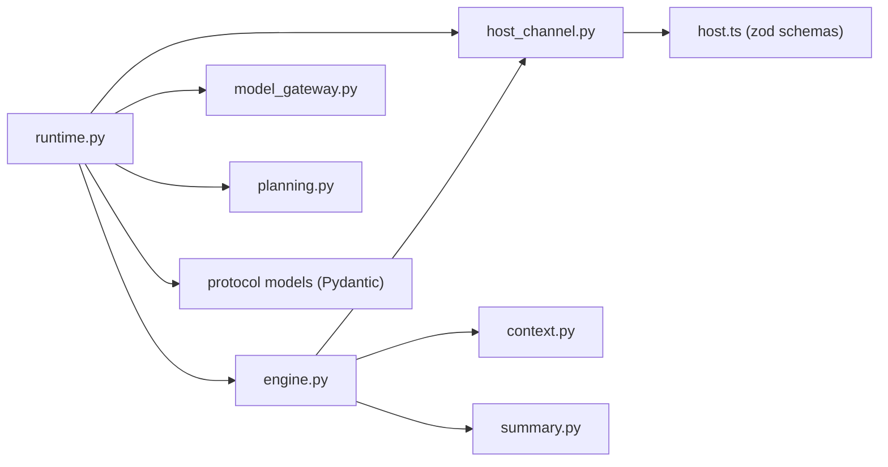

# Python 运行时架构

<cite>
**本文引用的文件**
- [runtime.py](file://services/agent-runtime/src/personal_agent/runtime.py)
- [engine.py](file://services/agent-runtime/src/personal_agent/engine.py)
- [model_gateway.py](file://services/agent-runtime/src/personal_agent/model_gateway.py)
- [host_channel.py](file://services/agent-runtime/src/personal_agent/host_channel.py)
- [context.py](file://services/agent-runtime/src/personal_agent/context.py)
- [scripted_model.py](file://services/agent-runtime/src/personal_agent/scripted_model.py)
- [planning.py](file://services/agent-runtime/src/personal_agent/planning.py)
- [summary.py](file://services/agent-runtime/src/personal_agent/summary.py)
- [__main__.py](file://services/agent-runtime/src/personal_agent/__main__.py)
- [host.ts](file://packages/protocol/schemas/host.ts)
- [test_runtime.py](file://services/agent-runtime/tests/test_runtime.py)
- [test_engine.py](file://services/agent-runtime/tests/test_engine.py)
</cite>

## 目录
1. [简介](#简介)
2. [项目结构](#项目结构)
3. [核心组件](#核心组件)
4. [架构总览](#架构总览)
5. [详细组件分析](#详细组件分析)
6. [依赖关系分析](#依赖关系分析)
7. [性能与并发特性](#性能与并发特性)
8. [故障排查指南](#故障排查指南)
9. [结论](#结论)
10. [附录](#附录)

## 简介
本文件面向 Python 运行时（Agent Runtime）的内部架构设计，聚焦以下目标：
- 运行时引擎、模型网关、工具执行通道等核心组件的职责与交互
- 异步任务处理机制（基于行式 JSON-RPC 的 I/O 循环、请求分派、错误恢复）
- JSON-RPC 协议实现（消息序列化、方法路由、错误码与响应契约）
- 外部 AI 模型的集成方式（模型适配器与连接管理）
- 工具执行框架（能力注册、参数校验、执行上下文管理）
- 日志记录与监控（事件流与时间戳）
- 运行时架构图与各组件调用关系、数据流

## 项目结构
Python 运行时位于 services/agent-runtime/src/personal_agent，采用“按职责划分”的模块组织：
- runtime.py：进程入口、JSON-RPC 分发、I/O 循环、配置解析
- engine.py：Agent 主循环、预算控制、事件生成、工具执行编排
- model_gateway.py：模型抽象接口与决策类型定义
- scripted_model.py：默认确定性模型（脚本驱动）
- host_channel.py：与宿主（TS 侧）的工具执行通道（JSON-RPC over stdin/stdout）
- context.py：观察历史与模型上下文构建、字符串截断
- planning.py：计划生成（能力可见性校验）
- summary.py：摘要验证器（页码引用校验）
- __main__.py：命令行入口

图表来源
- [__main__.py:1-5](file://services/agent-runtime/src/personal_agent/__main__.py#L1-L5)
- [runtime.py:238-257](file://services/agent-runtime/src/personal_agent/runtime.py#L238-L257)
- [runtime.py:69-93](file://services/agent-runtime/src/personal_agent/runtime.py#L69-L93)
- [engine.py:85-238](file://services/agent-runtime/src/personal_agent/engine.py#L85-L238)
- [host_channel.py:36-91](file://services/agent-runtime/src/personal_agent/host_channel.py#L36-L91)
- [context.py:45-79](file://services/agent-runtime/src/personal_agent/context.py#L45-L79)
- [summary.py:55-85](file://services/agent-runtime/src/personal_agent/summary.py#L55-L85)

章节来源
- [__main__.py:1-5](file://services/agent-runtime/src/personal_agent/__main__.py#L1-L5)
- [runtime.py:238-257](file://services/agent-runtime/src/personal_agent/runtime.py#L238-L257)

## 核心组件
- 运行时（Runtime）
  - 负责 JSON-RPC 行式 I/O 循环、请求解析、方法路由、错误封装与响应输出
  - 维护进程级依赖（通道、模型工厂、能力清单），为每个任务构造独立 Engine 与 Context
- Agent 引擎（AgentEngine）
  - 实现最小 Agent 循环：决策→执行→记录→预算检查→完成/失败
  - 统一事件构造与输出，保证失败路径也携带完整事件
- 模型网关（ModelGateway）
  - 抽象模型决策接口；当前默认实现为 ScriptedModel（确定性脚本驱动）
- Host 通道（HostChannel）
  - 通过 stdin/stdout 与 TS 宿主通信，发送 host.execute_tool 请求并等待响应
  - 处理非匹配行入队、非法 JSON 丢弃、响应契约校验与错误转换
- 上下文（ContextManager）
  - 保存原始观察，按需构建带截断的 ModelContext 供模型消费
- 计划（Planning）
  - 基于可见能力生成固定三步计划，缺失能力时返回明确错误码
- 摘要验证（Summary）
  - 校验模型给出的事实是否包含有效页码引用，且可追溯到实际提取页面

章节来源
- [runtime.py:49-93](file://services/agent-runtime/src/personal_agent/runtime.py#L49-L93)
- [engine.py:76-238](file://services/agent-runtime/src/personal_agent/engine.py#L76-L238)
- [model_gateway.py:6-100](file://services/agent-runtime/src/personal_agent/model_gateway.py#L6-L100)
- [host_channel.py:18-91](file://services/agent-runtime/src/personal_agent/host_channel.py#L18-L91)
- [context.py:45-79](file://services/agent-runtime/src/personal_agent/context.py#L45-L79)
- [planning.py:25-45](file://services/agent-runtime/src/personal_agent/planning.py#L25-L45)
- [summary.py:30-85](file://services/agent-runtime/src/personal_agent/summary.py#L30-L85)

## 架构总览
下图展示 Python 运行时与宿主（TS）之间的 JSON-RPC 交互、Agent 循环与模型适配器的协作关系。

图表来源
- [runtime.py:69-184](file://services/agent-runtime/src/personal_agent/runtime.py#L69-L184)
- [engine.py:98-171](file://services/agent-runtime/src/personal_agent/engine.py#L98-L171)
- [host_channel.py:45-85](file://services/agent-runtime/src/personal_agent/host_channel.py#L45-L85)
- [host.ts:28-67](file://packages/protocol/schemas/host.ts#L28-L67)

## 详细组件分析

### 运行时（Runtime）—— JSON-RPC 分发与 I/O 循环
- 行式 I/O：从 stdin 读取一行 JSON，解析后进入 dispatch；空行返回 None，EOF 退出循环
- 方法路由：支持 system.ping、system.initialize、agent.make_plan、agent.run_task；未知方法返回 METHOD_NOT_FOUND
- 参数校验：使用 Pydantic 对请求参数进行强校验，不合法返回 PROTOCOL_INVALID_REQUEST
- 错误封装：统一 build_error 返回标准 JSON-RPC 错误体
- 模型装配：根据环境变量加载脚本化模型工厂；未配置时 run_task 返回 RUNTIME_MODEL_NOT_CONFIGURED
- 日志：stderr 输出结构化日志，级别由环境变量控制

图表来源
- [runtime.py:96-106](file://services/agent-runtime/src/personal_agent/runtime.py#L96-L106)
- [runtime.py:69-93](file://services/agent-runtime/src/personal_agent/runtime.py#L69-L93)
- [runtime.py:109-184](file://services/agent-runtime/src/personal_agent/runtime.py#L109-L184)

章节来源
- [runtime.py:69-184](file://services/agent-runtime/src/personal_agent/runtime.py#L69-L184)
- [runtime.py:187-257](file://services/agent-runtime/src/personal_agent/runtime.py#L187-L257)

### Agent 引擎（AgentEngine）—— 主循环与预算控制
- 预算维度：步骤数与工具调用次数两维上限，任一达到即触发预算耗尽事件并失败
- 决策与执行：调用模型 decide，若为工具调用则通过 HostChannel 执行；若为摘要则验证后完成
- 事件体系：task_started、tool_called、tool_result、budget_exhausted、task_completed、task_failed
- 失败路径：统一 _fail 收集事件并返回 RunTaskFailed；异常被捕获并转为协议错误
- 上下文：每次任务新建 ContextManager，避免跨任务污染；观察记录用于后续决策与摘要验证

图表来源
- [engine.py:76-238](file://services/agent-runtime/src/personal_agent/engine.py#L76-L238)

章节来源
- [engine.py:76-238](file://services/agent-runtime/src/personal_agent/engine.py#L76-L238)
- [test_engine.py:138-182](file://services/agent-runtime/tests/test_engine.py#L138-L182)

### 模型网关与脚本化模型（ModelGateway & ScriptedModel）
- 模型抽象：ModelGateway.decide(context) 返回 ToolCallDecision 或 SummaryDecision
- 脚本化实现：ScriptedModel 按预设序列逐步返回决策，游标推进；用尽时抛出 ScriptExhausted
- 加载流程：load_script 读取 JSON 文件并校验为 ModelDecision 数组；失败抛 ScriptLoadError
- 进程装配：resolve_model_factory 根据环境变量决定是否启用脚本化模型；每次调用返回新实例

图表来源
- [scripted_model.py:18-57](file://services/agent-runtime/src/personal_agent/scripted_model.py#L18-L57)
- [runtime.py:208-235](file://services/agent-runtime/src/personal_agent/runtime.py#L208-L235)

章节来源
- [model_gateway.py:6-100](file://services/agent-runtime/src/personal_agent/model_gateway.py#L6-L100)
- [scripted_model.py:18-57](file://services/agent-runtime/src/personal_agent/scripted_model.py#L18-L57)
- [runtime.py:208-235](file://services/agent-runtime/src/personal_agent/runtime.py#L208-L235)

### Host 通道（HostChannel）—— 工具执行与响应路由
- 请求格式：构造 HostExecuteToolRequest（jsonrpc 2.0），写入 stdout
- 响应等待：循环读取 stdin 行，忽略非匹配 id 或 method 行（入 inbox）
- 契约校验：使用 Pydantic 校验 HostExecuteToolResponse；缺少 result/error 或 error 存在均视为失败
- 错误分类：HostRequestFailed（系统级失败）、HostChannelClosed（stdin EOF）

图表来源
- [host_channel.py:36-91](file://services/agent-runtime/src/personal_agent/host_channel.py#L36-L91)
- [host.ts:28-67](file://packages/protocol/schemas/host.ts#L28-L67)

章节来源
- [host_channel.py:18-91](file://services/agent-runtime/src/personal_agent/host_channel.py#L18-L91)

### 上下文与摘要验证（ContextManager & Summary）
- 上下文构建：ContextManager.build 将原始观察中的字符串按白名单键截断，生成 ModelContext
- 摘要验证：collect_extracted_pages 汇总所有成功的 extract_pdf 页面号；verify_summary 逐条校验 fact 结构与页码引用
- 失败语义：无事实、无效页码引用、未提取任何页面均导致任务失败

图表来源
- [context.py:45-79](file://services/agent-runtime/src/personal_agent/context.py#L45-L79)
- [summary.py:30-85](file://services/agent-runtime/src/personal_agent/summary.py#L30-L85)

章节来源
- [context.py:45-79](file://services/agent-runtime/src/personal_agent/context.py#L45-L79)
- [summary.py:30-85](file://services/agent-runtime/src/personal_agent/summary.py#L30-L85)

### 计划生成（Planning）
- 输入：目标文本与可见能力清单
- 规则：必须包含 filesystem.list 与 document.extract_pdf，否则返回 PLAN_NOT_BUILDABLE
- 输出：三步计划（列出 PDF、提取页面、生成摘要）

章节来源
- [planning.py:25-45](file://services/agent-runtime/src/personal_agent/planning.py#L25-L45)

## 依赖关系分析
- 运行时依赖
  - 协议层：Pydantic 模型（Request/Response/HostExecuteTool*）
  - 宿主协议：host.execute_tool 的请求/响应 schema（TS 侧 zod 定义）
  - 内部模块：engine、model_gateway、host_channel、context、planning、summary
- 耦合点
  - engine 与 host_channel：工具执行强依赖通道契约
  - engine 与 model_gateway：决策类型联合（discriminator）
  - runtime 与 protocol models：方法名常量与参数/结果模型
- 外部依赖
  - TS 宿主：提供能力清单、工具执行实现、超时与权限策略
  - 文件系统/PDF：通过宿主能力间接访问

图表来源
- [runtime.py:69-184](file://services/agent-runtime/src/personal_agent/runtime.py#L69-L184)
- [engine.py:85-238](file://services/agent-runtime/src/personal_agent/engine.py#L85-L238)
- [host_channel.py:36-91](file://services/agent-runtime/src/personal_agent/host_channel.py#L36-L91)
- [host.ts:28-67](file://packages/protocol/schemas/host.ts#L28-L67)

章节来源
- [runtime.py:69-184](file://services/agent-runtime/src/personal_agent/runtime.py#L69-L184)
- [engine.py:85-238](file://services/agent-runtime/src/personal_agent/engine.py#L85-L238)
- [host_channel.py:36-91](file://services/agent-runtime/src/personal_agent/host_channel.py#L36-L91)
- [host.ts:28-67](file://packages/protocol/schemas/host.ts#L28-L67)

## 性能与并发特性
- 单进程串行 I/O：主循环逐行处理请求，避免竞态；每个任务独立 Engine/Context，天然隔离
- 预算控制：两维预算防止无限循环与资源耗尽；预算耗尽事件便于 UI 区分“未完成”和“失败”
- 上下文截断：仅对可截断键（text/reason）做长度限制，避免大对象阻塞模型窗口
- 模型实例复用：通过工厂模式每次任务创建新模型实例，避免状态泄漏（如 ScriptedModel 游标）
- 通道缓冲：HostChannel.inbox 暂存非匹配行，确保响应正确路由

[本节为通用指导，无需特定文件来源]

## 故障排查指南
- 常见错误码
  - PROTOCOL_INVALID_JSON：无法解析 JSON
  - PROTOCOL_INVALID_REQUEST：参数不符合契约或版本不匹配
  - METHOD_NOT_FOUND：未知方法
  - RUNTIME_MODEL_NOT_CONFIGURED：未配置模型（未设置脚本路径）
  - PLAN_NOT_BUILDABLE：计划所需能力不可见
  - CAPABILITY_NOT_REGISTERED：请求了未在协议枚举内的 capability
  - RUNTIME_INTERNAL：未预期异常（被捕获并转协议错误）
- 通道异常
  - HostChannelClosed：stdin EOF，宿主进程可能已退出
  - HostRequestFailed：宿主返回 error 或响应不合契约
- 调试建议
  - 检查 stderr 日志（PERSONAL_AGENT_LOG_LEVEL）
  - 确认 initialize 下发的 capabilities 是否包含计划所需能力
  - 校验脚本化模型文件是否为合法 JSON 且符合 ModelDecision 数组
  - 在测试中替换 Channel 与 Model，定位问题层次

章节来源
- [runtime.py:65-93](file://services/agent-runtime/src/personal_agent/runtime.py#L65-L93)
- [runtime.py:109-184](file://services/agent-runtime/src/personal_agent/runtime.py#L109-L184)
- [engine.py:168-238](file://services/agent-runtime/src/personal_agent/engine.py#L168-L238)
- [host_channel.py:18-91](file://services/agent-runtime/src/personal_agent/host_channel.py#L18-L91)
- [test_runtime.py:162-634](file://services/agent-runtime/tests/test_runtime.py#L162-L634)
- [test_engine.py:138-732](file://services/agent-runtime/tests/test_engine.py#L138-L732)

## 结论
该 Python 运行时以简洁的 JSON-RPC 行式 I/O 为核心，结合明确的组件边界与严格的契约校验，实现了稳定的 Agent 执行环境。通过预算控制、上下文截断与摘要验证，保障了任务的可控性与结果的可追溯性。模型适配器以工厂模式解耦，便于未来接入真实模型。HostChannel 将工具执行委托给宿主，保持 Python 侧专注编排与治理。整体架构清晰、可测试性强，适合持续演进。

[本节为总结，无需特定文件来源]

## 附录
- 关键常量与事件类型
  - 事件：task_started、tool_called、tool_result、budget_exhausted、task_completed、task_failed
  - 预算默认：maxSteps=8，maxToolCalls=5
  - 发生时间格式：毫秒三位 + Z 结尾
- 协议要点
  - 方法名：system.*、agent.*、host.execute_tool
  - 能力枚举：filesystem.list、document.extract_pdf、filesystem.create_dir、filesystem.move、scheduler.create、notification.send
  - 请求/响应：严格遵循 jsonrpc 2.0 信封，result 与 error 互斥

章节来源
- [engine.py:46-74](file://services/agent-runtime/src/personal_agent/engine.py#L46-L74)
- [host.ts:7-14](file://packages/protocol/schemas/host.ts#L7-L14)
- [host.ts:40-67](file://packages/protocol/schemas/host.ts#L40-L67)