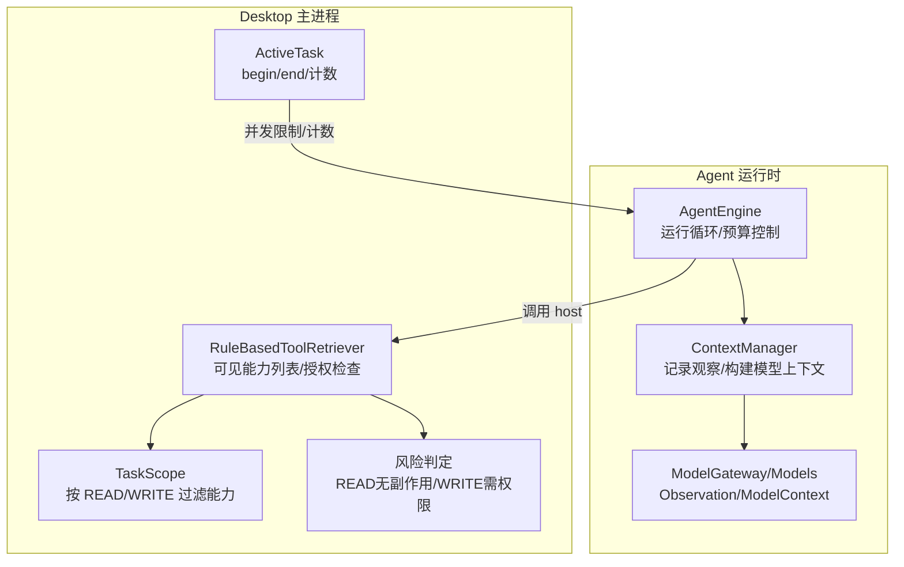
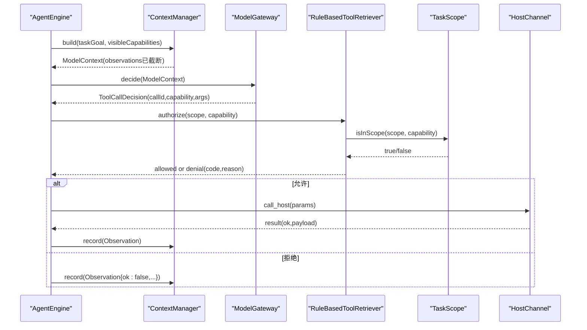
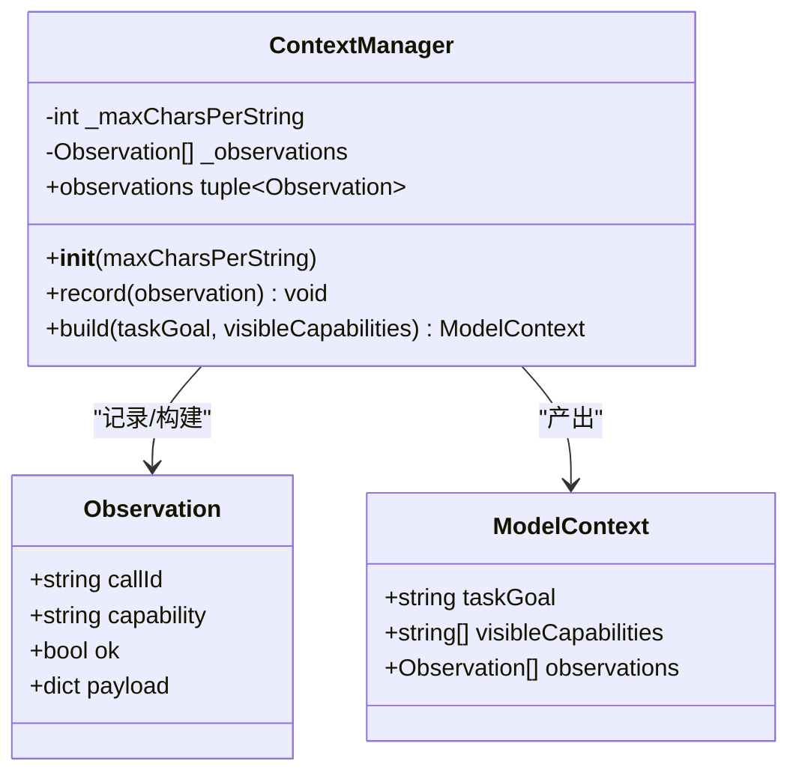
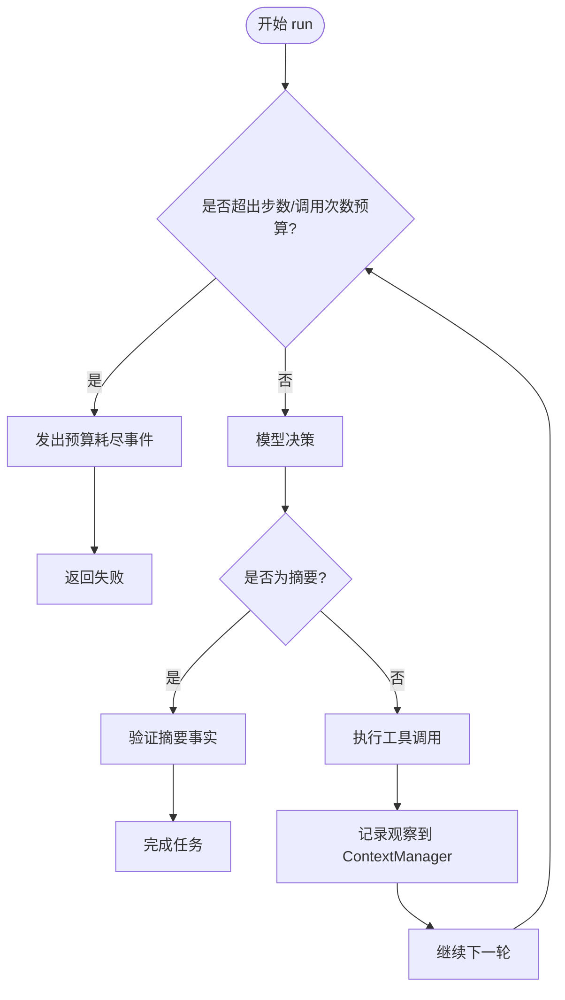
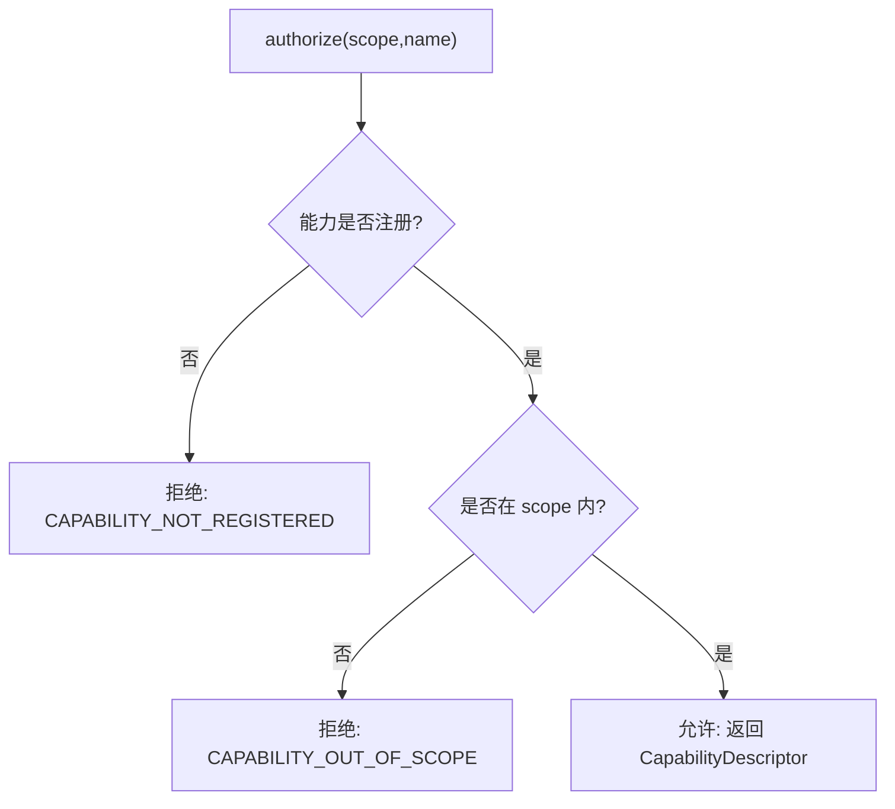
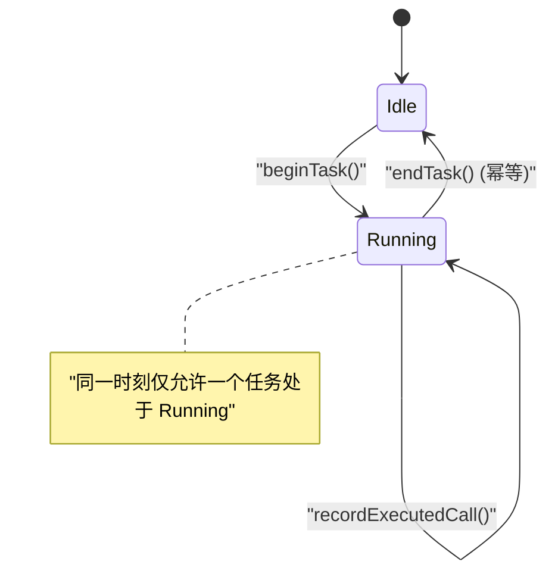
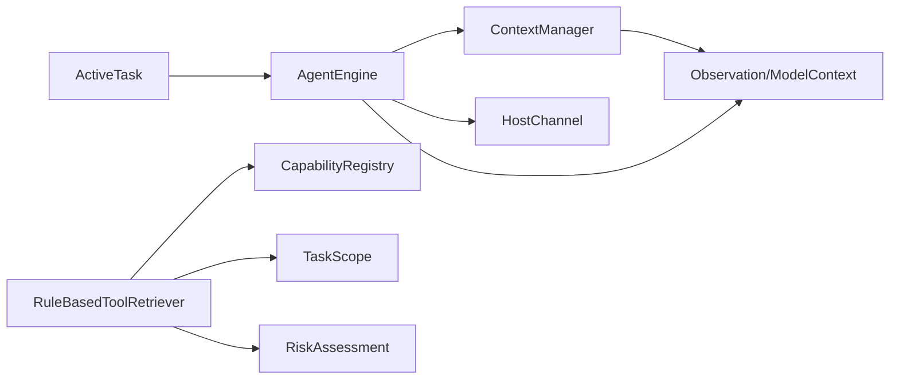

# 上下文管理器

<cite>
**本文引用的文件**
- [context.py](file://services/agent-runtime/src/personal_agent/context.py)
- [engine.py](file://services/agent-runtime/src/personal_agent/engine.py)
- [model_gateway.py](file://services/agent-runtime/src/personal_agent/model_gateway.py)
- [task-context.ts](file://apps/desktop/src/main/policy/task-context.ts)
- [scope.ts](file://apps/desktop/src/main/capabilities/scope.ts)
- [registry.ts](file://apps/desktop/src/main/capabilities/registry.ts)
- [retriever.ts](file://apps/desktop/src/main/capabilities/retriever.ts)
- [risk.ts](file://apps/desktop/src/main/policy/risk.ts)
- [test_context.py](file://services/agent-runtime/tests/test_context.py)
</cite>

## 目录
1. [简介](#简介)
2. [项目结构](#项目结构)
3. [核心组件](#核心组件)
4. [架构总览](#架构总览)
5. [详细组件分析](#详细组件分析)
6. [依赖关系分析](#依赖关系分析)
7. [性能考量](#性能考量)
8. [故障排查指南](#故障排查指南)
9. [结论](#结论)
10. [附录：使用示例与最佳实践](#附录使用示例与最佳实践)

## 简介
本文件围绕“上下文管理器”展开，系统性说明 ContextManager 类的设计与职责、任务上下文生命周期管理、观察记录的收集/存储/检索、能力可见性控制（基于 Scope 的过滤与权限检查）、上下文隔离机制、持久化策略（状态保存、恢复与清理），以及上下文数据结构设计与约束。文末提供在工具执行中正确获取和使用上下文信息的示例路径与流程说明。

## 项目结构
本项目将“上下文管理”拆分为两部分：
- Python Agent 运行时侧：ContextManager 负责记录并构建模型上下文，包含观察历史与截断策略。
- Desktop 主进程侧：TaskScope、ToolRetriever、RiskAssessment 等负责能力可见性与权限判定；ActiveTask 维护当前任务的生命周期与计数。

图表来源
- [engine.py:85-208](file://services/agent-runtime/src/personal_agent/engine.py#L85-L208)
- [context.py:45-78](file://services/agent-runtime/src/personal_agent/context.py#L45-L78)
- [model_gateway.py:6-24](file://services/agent-runtime/src/personal_agent/model_gateway.py#L6-L24)
- [retriever.ts:11-47](file://apps/desktop/src/main/capabilities/retriever.ts#L11-L47)
- [scope.ts:3-17](file://apps/desktop/src/main/capabilities/scope.ts#L3-L17)
- [risk.ts:13-21](file://apps/desktop/src/main/policy/risk.ts#L13-L21)
- [task-context.ts:6-50](file://apps/desktop/src/main/policy/task-context.ts#L6-L50)

章节来源
- [engine.py:85-208](file://services/agent-runtime/src/personal_agent/engine.py#L85-L208)
- [context.py:45-78](file://services/agent-runtime/src/personal_agent/context.py#L45-L78)
- [retriever.ts:11-47](file://apps/desktop/src/main/capabilities/retriever.ts#L11-L47)
- [scope.ts:3-17](file://apps/desktop/src/main/capabilities/scope.ts#L3-L17)
- [risk.ts:13-21](file://apps/desktop/src/main/policy/risk.ts#L13-L21)
- [task-context.ts:6-50](file://apps/desktop/src/main/policy/task-context.ts#L6-L50)

## 核心组件
- ContextManager：保存原始 Observation，按需构建带截断的 ModelContext，供模型决策使用。
- AgentEngine：驱动单任务运行循环，维护步数与工具调用次数预算，协调 ContextManager 与 HostChannel。
- TaskScope/RuleBasedToolRetriever/RiskAssessment：定义能力集合、按 Scope 过滤可见能力、对具体能力进行授权检查与风险评估。
- ActiveTask：维护当前任务的开始/结束与执行计数，确保并发安全与幂等清理。

章节来源
- [context.py:45-78](file://services/agent-runtime/src/personal_agent/context.py#L45-L78)
- [engine.py:85-208](file://services/agent-runtime/src/personal_agent/engine.py#L85-L208)
- [retriever.ts:11-47](file://apps/desktop/src/main/capabilities/retriever.ts#L11-L47)
- [scope.ts:3-17](file://apps/desktop/src/main/capabilities/scope.ts#L3-L17)
- [risk.ts:13-21](file://apps/desktop/src/main/policy/risk.ts#L13-L21)
- [task-context.ts:6-50](file://apps/desktop/src/main/policy/task-context.ts#L6-L50)

## 架构总览
下图展示一次工具调用的端到端流程，包括上下文构建、能力可见性过滤、授权检查、执行与观察记录。

图表来源
- [engine.py:98-166](file://services/agent-runtime/src/personal_agent/engine.py#L98-L166)
- [context.py:62-78](file://services/agent-runtime/src/personal_agent/context.py#L62-L78)
- [retriever.ts:25-47](file://apps/desktop/src/main/capabilities/retriever.ts#L25-L47)
- [scope.ts:8-17](file://apps/desktop/src/main/capabilities/scope.ts#L8-L17)

## 详细组件分析

### ContextManager：观察历史与模型上下文构建
- 设计要点
  - 只保留原始 Observation，不在此处做滑动窗口裁剪；长度控制通过“字符串字符上限”旋钮实现。
  - 截断策略仅作用于 payload 中的特定键（如 text、reason），标识符字段不被截断，避免破坏错误码与路径。
  - observations 属性返回只读快照（tuple），防止外部修改内部状态。
  - build() 每次生成新的 ModelContext，不会污染已存储的原始观察。
- 关键行为
  - record(observation)：追加一条原始观察。
  - build(taskGoal, visibleCapabilities)：遍历所有观察，对 payload 递归截断后组装为 ModelContext。
  - 默认每字符串最大字符数常量用于控制上下文大小，构造时校验必须 >= 1。
- 复杂度
  - record：O(1)。
  - build：O(N×K)，N 为观察条数，K 为 payload 树深度/宽度；截断为纯函数，不修改原数据。

图表来源
- [context.py:45-78](file://services/agent-runtime/src/personal_agent/context.py#L45-L78)
- [model_gateway.py:6-24](file://services/agent-runtime/src/personal_agent/model_gateway.py#L6-L24)

章节来源
- [context.py:45-78](file://services/agent-runtime/src/personal_agent/context.py#L45-L78)
- [model_gateway.py:6-24](file://services/agent-runtime/src/personal_agent/model_gateway.py#L6-L24)
- [test_context.py:151-266](file://services/agent-runtime/tests/test_context.py#L151-L266)

### AgentEngine：任务上下文生命周期与预算控制
- 生命周期
  - run(goal, visibleCapabilities)：同步阻塞执行，维护 steps 与 toolCalls 双维度预算。
  - 每轮：先判断是否超预算；再调用模型决策；若为工具调用则执行并通过 Channel 与宿主交互；将结果作为 Observation 记录到 ContextManager；若为摘要则验证并完成任务。
  - 失败路径统一封装，保证事件回传。
- 与 ContextManager 的协作
  - 每步调用 context.build() 传入当前目标与可见能力，得到带截断的观察序列供模型决策。
  - 每次工具执行后调用 context.record() 追加观察。
- 异常与边界
  - 未注册 capability 会生成 ok=false 的观察，便于模型感知并调整后续步骤。
  - 通道关闭或请求失败会转为 RunTaskFailed。

图表来源
- [engine.py:98-208](file://services/agent-runtime/src/personal_agent/engine.py#L98-L208)

章节来源
- [engine.py:98-208](file://services/agent-runtime/src/personal_agent/engine.py#L98-L208)

### 能力可见性控制：基于 Scope 的过滤与权限检查
- 能力注册与分类
  - CAPABILITIES 清单定义了各能力的名称、种类（READ/WRITE）与描述。
  - listByKind(kind) 可按种类筛选能力。
- 任务范围（TaskScope）
  - readOnlyScope(taskId) 生成仅包含 READ 能力的范围。
  - isInScope(scope, name) 判断某能力是否在范围内。
- 检索器（RuleBasedToolRetriever）
  - listVisible(scope)：返回 scope 内可见的能力集合。
  - authorize(scope, name)：先检查是否注册，再检查是否在 scope 内，返回允许或拒绝原因。
- 风险评估（RiskAssessment）
  - WRITE 能力需要权限，READ 无需额外权限。

图表来源
- [retriever.ts:25-47](file://apps/desktop/src/main/capabilities/retriever.ts#L25-L47)
- [scope.ts:8-17](file://apps/desktop/src/main/capabilities/scope.ts#L8-L17)
- [registry.ts:9-50](file://apps/desktop/src/main/capabilities/registry.ts#L9-L50)
- [risk.ts:13-21](file://apps/desktop/src/main/policy/risk.ts#L13-L21)

章节来源
- [registry.ts:9-50](file://apps/desktop/src/main/capabilities/registry.ts#L9-L50)
- [scope.ts:3-17](file://apps/desktop/src/main/capabilities/scope.ts#L3-L17)
- [retriever.ts:11-47](file://apps/desktop/src/main/capabilities/retriever.ts#L11-L47)
- [risk.ts:13-21](file://apps/desktop/src/main/policy/risk.ts#L13-L21)

### 上下文隔离机制：确保不同任务间的数据独立性
- Desktop 侧：ActiveTask 以模块级单槽维护当前任务，beginTask 若已有任务则抛出 TaskBusyError，阻止并发覆盖；endTask 幂等清空；recordExecutedCall 仅在放行后累加。
- Agent 侧：ContextManager 实例绑定单个 Engine 实例，每个 Engine 对应一个任务；run 期间通过局部变量维护步骤与调用计数，避免跨任务串扰。
- 观察快照：observations 属性返回 tuple 快照，避免外部篡改内部列表。

图表来源
- [task-context.ts:23-50](file://apps/desktop/src/main/policy/task-context.ts#L23-L50)
- [test_context.ts:18-112](file://apps/desktop/src/main/policy/task-context.test.ts#L18-L112)

章节来源
- [task-context.ts:23-50](file://apps/desktop/src/main/policy/task-context.ts#L23-L50)
- [test_context.ts:18-112](file://apps/desktop/src/main/policy/task-context.test.ts#L18-L112)

### 上下文持久化策略：状态保存、恢复与清理
- 当前实现定位
  - ContextManager 与 AgentEngine 均为内存态：ContextManager 持有 observations 列表，Engine 在 run 过程中维护步骤与调用计数；这些状态随任务生命周期存在，不跨进程持久化。
  - Desktop 侧 ActiveTask 同样为内存态，通过 begin/end 管理生命周期。
- 建议的持久化方案（概念性）
  - 保存：在任务完成或失败时，将 ContextManager 的 observations 与 Engine 的事件序列持久化至产品状态数据库（例如 tasks/plans/events 表）。
  - 恢复：重启后从数据库加载最近任务的事件与观察，重建 ContextManager 与 Engine 的状态以便调试或回放。
  - 清理：任务结束后清理临时上下文对象，释放内存；必要时归档历史上下文到冷存储。
- 注意
  - 由于当前代码未实现持久化逻辑，本节为概念性指导，实际落地需结合 product-state 层扩展。

[本节为概念性说明，不直接分析具体文件，故无“章节来源”]

### 上下文数据结构设计：字段定义、验证规则与约束
- Observation
  - callId：非空字符串，用于关联调用与结果。
  - capability：非空字符串，标识工具能力名。
  - ok：布尔值，表示工具调用成功与否。
  - payload：任意字典，承载工具返回数据。
- ModelContext
  - taskGoal：任务目标文本。
  - visibleCapabilities：可见能力列表，由上层根据 Scope 过滤后传入。
  - observations：Observation 列表，由 ContextManager 构建并截断。
- 约束与验证
  - Observation 的 callId/capability 非空，否则验证失败。
  - ContextManager 构造时 maxCharsPerString 必须 >= 1。
  - 截断仅针对白名单键（text、reason），保护标识符字段不被破坏。

章节来源
- [model_gateway.py:6-24](file://services/agent-runtime/src/personal_agent/model_gateway.py#L6-L24)
- [context.py:45-78](file://services/agent-runtime/src/personal_agent/context.py#L45-L78)
- [test_context.py:103-141](file://services/agent-runtime/tests/test_context.py#L103-L141)

## 依赖关系分析
- ContextManager 依赖 model_gateway 中的 Observation 与 ModelContext。
- AgentEngine 依赖 ContextManager、ModelGateway、HostChannel，并在失败路径中构造特殊 Observation。
- Desktop 侧 RuleBasedToolRetriever 依赖 registry、scope、risk，实现能力可见性与授权。
- ActiveTask 独立维护任务槽位与计数，被上层策略调用。

图表来源
- [context.py:45-78](file://services/agent-runtime/src/personal_agent/context.py#L45-L78)
- [engine.py:85-208](file://services/agent-runtime/src/personal_agent/engine.py#L85-L208)
- [retriever.ts:11-47](file://apps/desktop/src/main/capabilities/retriever.ts#L11-L47)
- [registry.ts:9-50](file://apps/desktop/src/main/capabilities/registry.ts#L9-L50)
- [scope.ts:3-17](file://apps/desktop/src/main/capabilities/scope.ts#L3-L17)
- [risk.ts:13-21](file://apps/desktop/src/main/policy/risk.ts#L13-L21)
- [task-context.ts:23-50](file://apps/desktop/src/main/policy/task-context.ts#L23-L50)

章节来源
- [context.py:45-78](file://services/agent-runtime/src/personal_agent/context.py#L45-L78)
- [engine.py:85-208](file://services/agent-runtime/src/personal_agent/engine.py#L85-L208)
- [retriever.ts:11-47](file://apps/desktop/src/main/capabilities/retriever.ts#L11-L47)
- [registry.ts:9-50](file://apps/desktop/src/main/capabilities/registry.ts#L9-L50)
- [scope.ts:3-17](file://apps/desktop/src/main/capabilities/scope.ts#L3-L17)
- [risk.ts:13-21](file://apps/desktop/src/main/policy/risk.ts#L13-L21)
- [task-context.ts:23-50](file://apps/desktop/src/main/policy/task-context.ts#L23-L50)

## 性能考量
- 截断策略
  - 采用白名单键的递归遍历，避免整包 JSON 切割导致页码等元数据丢失。
  - 默认每字符串 2000 字符，兼顾 PDF 多页场景与模型上下文容量。
- 无滑动窗口
  - 不丢弃早期观察，避免模型丢失必要信息；整体长度由引擎预算控制。
- 快照与不可变
  - observations 返回 tuple 快照，避免并发修改；build 不修改原始数据，多次构建一致。
- 预算控制
  - 步数与工具调用次数双重上限，防止无限循环与资源耗尽。

[本节为通用性能讨论，不直接分析具体文件，故无“章节来源”]

## 故障排查指南
- 常见错误与定位
  - 未注册能力：authorize 返回 CAPABILITY_NOT_REGISTERED；Engine 会记录 ok=false 的观察，便于模型识别并调整。
  - 能力不在 Scope：authorize 返回 CAPABILITY_OUT_OF_SCOPE；检查 TaskScope 是否正确限定 READ/WRITE。
  - 上下文过长：检查 ContextManager 的 maxCharsPerString 配置与 TRUNCATABLE_KEYS 白名单。
  - 并发冲突：beginTask 抛出 TaskBusyError；确认上一个任务已调用 endTask。
- 调试建议
  - 查看 Engine 事件序列，确认每一步的 decision 与 observation。
  - 打印 ModelContext 的 visibleCapabilities 与 observations 数量，确认截断效果。
  - 使用测试用例中的断言模式复现问题（如 test_context.py）。

章节来源
- [engine.py:210-236](file://services/agent-runtime/src/personal_agent/engine.py#L210-L236)
- [retriever.ts:25-47](file://apps/desktop/src/main/capabilities/retriever.ts#L25-L47)
- [test_context.py:103-141](file://services/agent-runtime/tests/test_context.py#L103-L141)
- [task-context.ts:26-39](file://apps/desktop/src/main/policy/task-context.ts#L26-L39)

## 结论
ContextManager 以“原始记录 + 按需截断”的方式提供稳定、可预测的模型上下文；AgentEngine 通过预算控制与事件驱动保障任务执行的健壮性；Desktop 侧通过 Scope 与授权机制实现细粒度的能力可见性与权限控制；ActiveTask 确保任务并发隔离与幂等清理。整体设计在保证安全性的同时，兼顾了可扩展性与可观测性。

[本节为总结性内容，不直接分析具体文件，故无“章节来源”]

## 附录：使用示例与最佳实践
- 在工具执行中获取并使用上下文信息
  - 步骤 1：创建 ContextManager 实例，设置合适的 maxCharsPerString。
  - 步骤 2：在 Engine 运行循环中，每次决策前调用 context.build(taskGoal, visibleCapabilities) 获取 ModelContext。
  - 步骤 3：工具执行成功后，将结果包装为 Observation 并调用 context.record()。
  - 步骤 4：通过 Desktop 侧的 RuleBasedToolRetriever 获取可见能力列表并进行授权检查，确保 capability 在 Scope 内。
  - 步骤 5：使用 ActiveTask 管理任务生命周期，确保 begin/end 成对调用，避免并发冲突。
- 参考路径
  - 上下文构建与记录：[context.py:45-78](file://services/agent-runtime/src/personal_agent/context.py#L45-L78)
  - 引擎运行循环与预算：[engine.py:98-208](file://services/agent-runtime/src/personal_agent/engine.py#L98-L208)
  - 能力可见性与授权：[retriever.ts:11-47](file://apps/desktop/src/main/capabilities/retriever.ts#L11-L47)
  - 任务生命周期管理：[task-context.ts:23-50](file://apps/desktop/src/main/policy/task-context.ts#L23-L50)

章节来源
- [context.py:45-78](file://services/agent-runtime/src/personal_agent/context.py#L45-L78)
- [engine.py:89-165](file://services/agent-runtime/src/personal_agent/engine.py#L89-L165)
- [retriever.ts:11-47](file://apps/desktop/src/main/capabilities/retriever.ts#L11-L47)
- [task-context.ts:23-50](file://apps/desktop/src/main/policy/task-context.ts#L23-L50)