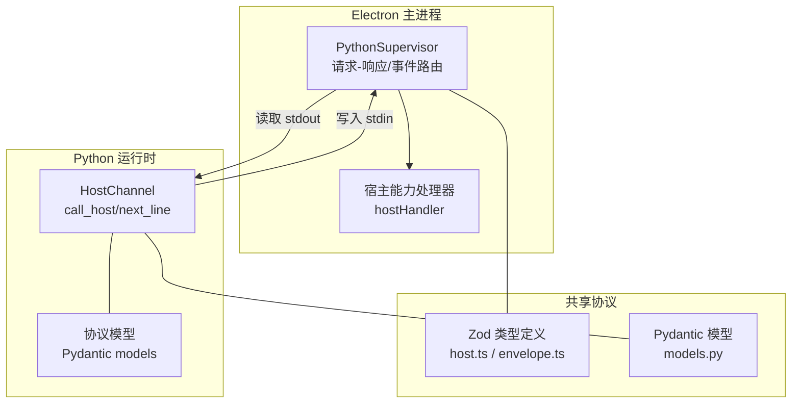
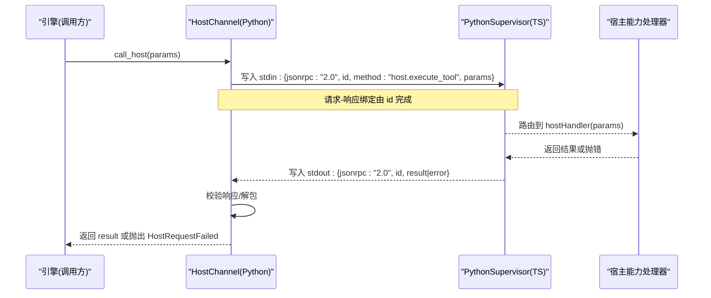
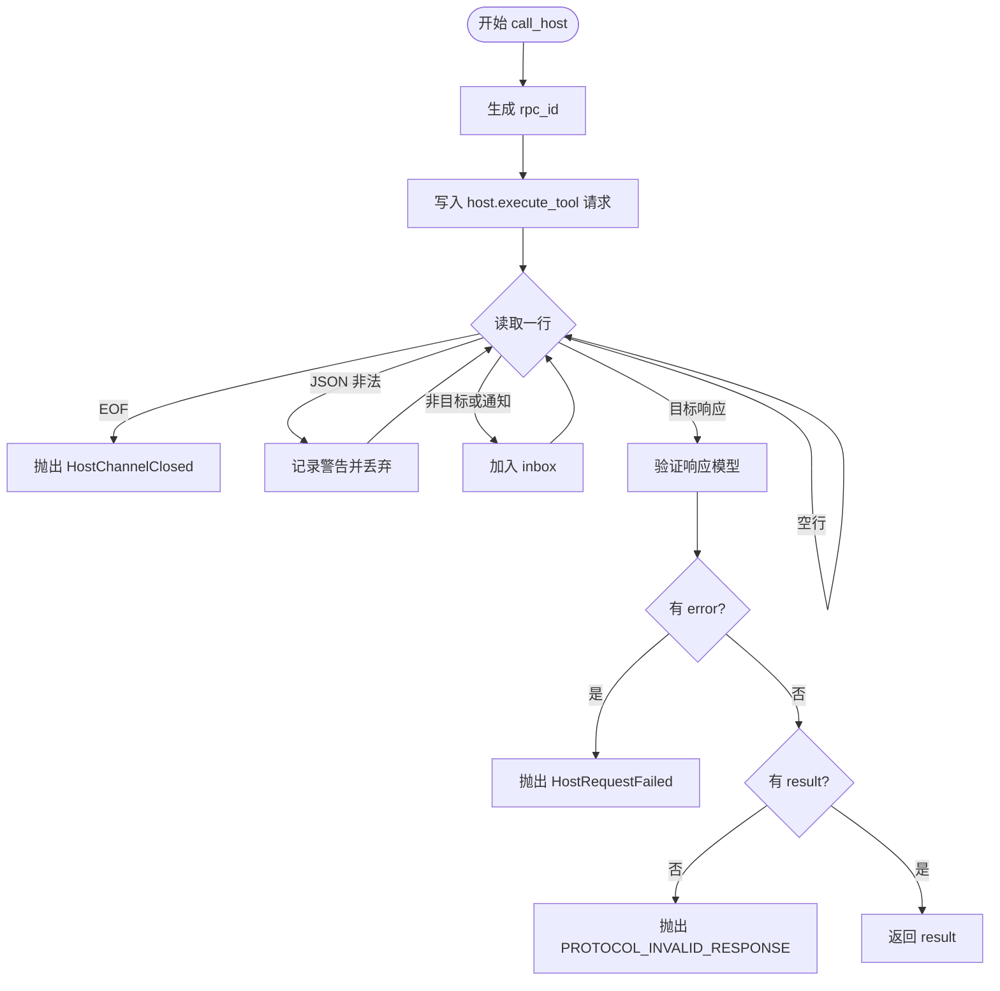
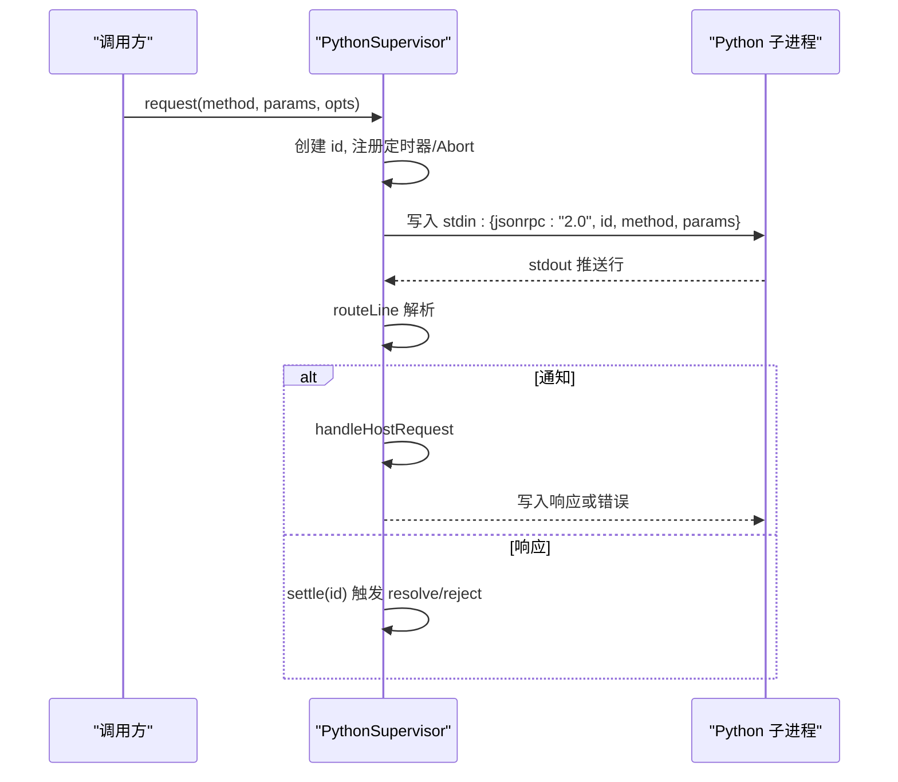
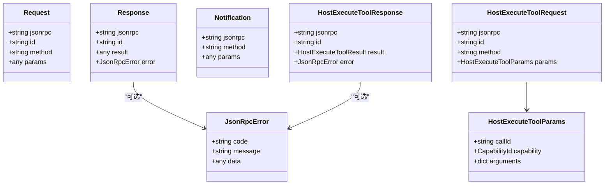
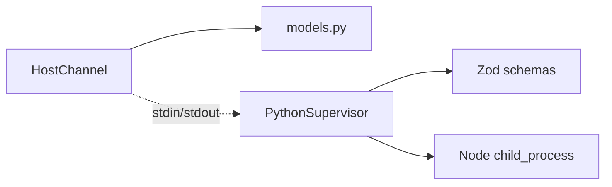

# 主机通道

<cite>
**本文引用的文件**
- [host_channel.py](file://services/agent-runtime/src/personal_agent/host_channel.py)
- [models.py](file://services/agent-runtime/src/personal_agent/protocol/models.py)
- [python-supervisor.ts](file://apps/desktop/src/main/runtime/python-supervisor.ts)
- [host.ts](file://packages/protocol/schemas/host.ts)
- [envelope.ts](file://packages/protocol/schemas/envelope.ts)
- [timeouts.ts](file://apps/desktop/src/main/runtime/timeouts.ts)
- [error-code.ts](file://apps/desktop/src/main/runtime/error-code.ts)
- [initialize.request.json](file://packages/protocol/fixtures/initialize.request.json)
- [ping.request.json](file://packages/protocol/fixtures/ping.request.json)
</cite>

## 目录
1. [简介](#简介)
2. [项目结构](#项目结构)
3. [核心组件](#核心组件)
4. [架构总览](#架构总览)
5. [详细组件分析](#详细组件分析)
6. [依赖关系分析](#依赖关系分析)
7. [性能考量](#性能考量)
8. [故障排查指南](#故障排查指南)
9. [结论](#结论)
10. [附录](#附录)

## 简介
本文件围绕“主机通道”展开，聚焦 Python 侧 HostChannel 类与主进程（Electron 主进程）之间的通信机制。内容涵盖：
- JSON-RPC 协议实现：消息序列化、反序列化与协议版本管理
- 异步消息处理：请求-响应模式与事件驱动架构
- 错误处理与重试策略：网络异常、超时与连接恢复
- 日志记录与调试：消息追踪与性能监控
- 通道配置选项：连接参数、缓冲区大小与超时设置
- 扩展指南：如何实现自定义传输层与协议适配器

## 项目结构
主机通道涉及两端代码与共享协议定义：
- Python 运行时（Agent Runtime）：HostChannel 负责向 TS 发起 host.execute_tool 调用并消费响应
- Electron 主进程：PythonSupervisor 负责启动/管理 Python 子进程、收发 JSON-RPC 行式消息、路由 host.execute_tool 到宿主能力处理器
- 协议契约：TS 与 Python 两侧分别用 Zod 与 Pydantic 描述同一份 JSON-RPC 协议，确保两端一致

**图表来源**
- [python-supervisor.ts:96-133](file://apps/desktop/src/main/runtime/python-supervisor.ts#L96-L133)
- [host_channel.py:36-90](file://services/agent-runtime/src/personal_agent/host_channel.py#L36-L90)
- [models.py:75-119](file://services/agent-runtime/src/personal_agent/protocol/models.py#L75-L119)
- [host.ts:1-76](file://packages/protocol/schemas/host.ts#L1-L76)
- [envelope.ts:1-41](file://packages/protocol/schemas/envelope.ts#L1-L41)

**章节来源**
- [python-supervisor.ts:96-133](file://apps/desktop/src/main/runtime/python-supervisor.ts#L96-L133)
- [host_channel.py:36-90](file://services/agent-runtime/src/personal_agent/host_channel.py#L36-L90)
- [models.py:75-119](file://services/agent-runtime/src/personal_agent/protocol/models.py#L75-L119)
- [host.ts:1-76](file://packages/protocol/schemas/host.ts#L1-L76)
- [envelope.ts:1-41](file://packages/protocol/schemas/envelope.ts#L1-L41)

## 核心组件
- HostChannel（Python 侧）
  - 通过注入的 readline/write_msg 抽象底层 I/O，发送 host.execute_tool 请求并等待对应 id 的响应
  - 将非目标响应或通知暂存至 inbox，供 next_line 顺序消费
  - 对非法 JSON、不合法响应、业务 error 进行严格校验与异常抛出
- PythonSupervisor（TS 侧）
  - 管理 Python 子进程生命周期，维护 pending 请求映射与超时
  - 解析 stdout 行，区分通知与请求-响应，路由 host.execute_tool 到宿主处理器
  - 统一写管道 writeLine，保证单写出点
- 协议模型（两端）
  - 使用 Zod（TS）与 Pydantic（Python）定义一致的 JSON-RPC 信封与领域模型
  - 强制 jsonrpc="2.0"、id 匹配、result/error 互斥等约束

**章节来源**
- [host_channel.py:36-90](file://services/agent-runtime/src/personal_agent/host_channel.py#L36-L90)
- [python-supervisor.ts:162-207](file://apps/desktop/src/main/runtime/python-supervisor.ts#L162-L207)
- [python-supervisor.ts:232-263](file://apps/desktop/src/main/runtime/python-supervisor.ts#L232-L263)
- [python-supervisor.ts:265-321](file://apps/desktop/src/main/runtime/python-supervisor.ts#L265-L321)
- [models.py:75-119](file://services/agent-runtime/src/personal_agent/protocol/models.py#L75-L119)
- [host.ts:1-76](file://packages/protocol/schemas/host.ts#L1-L76)
- [envelope.ts:1-41](file://packages/protocol/schemas/envelope.ts#L1-L41)

## 架构总览
下图展示一次 host.execute_tool 调用的端到端流程，包括请求-响应与事件/通知分流。

**图表来源**
- [host_channel.py:45-85](file://services/agent-runtime/src/personal_agent/host_channel.py#L45-L85)
- [python-supervisor.ts:265-321](file://apps/desktop/src/main/runtime/python-supervisor.ts#L265-L321)
- [models.py:75-119](file://services/agent-runtime/src/personal_agent/protocol/models.py#L75-L119)

## 详细组件分析

### HostChannel（Python 侧）
- 设计要点
  - 通过构造函数注入读写函数，屏蔽底层 stdin/stdout 细节，便于测试与替换传输层
  - 自增计数器生成唯一 rpc_id，格式遵循 HOST_CALL_ID_PATTERN
  - 循环读取行，跳过空行；非法 JSON 丢弃并记录警告
  - 非目标 id 或包含 method 的消息视为通知/其他请求，进入 inbox 队列
  - 响应按 HostExecuteToolResponse 校验，若存在 error 则抛出 HostRequestFailed；否则返回 result
- 复杂度
  - 每次调用为 O(n) 行扫描，n 为直到收到目标响应前的行数；内存占用受 inbox 长度影响
- 优化机会
  - 可引入超时控制避免无限阻塞
  - 可对 inbox 做容量上限与丢弃策略（如 LRU）

**图表来源**
- [host_channel.py:45-90](file://services/agent-runtime/src/personal_agent/host_channel.py#L45-L90)

**章节来源**
- [host_channel.py:18-34](file://services/agent-runtime/src/personal_agent/host_channel.py#L18-L34)
- [host_channel.py:45-90](file://services/agent-runtime/src/personal_agent/host_channel.py#L45-L90)

### PythonSupervisor（TS 侧）
- 设计要点
  - 启动子进程，监听 stdout/stderr/exit/error，统一封装 stderr 事件
  - initialize 握手：构造 InitializeParams，发送 system.initialize，校验 InitializeResult
  - request 方法：维护 pending Map，设置超时与 AbortSignal 取消，写入 stdin
  - routeLine：解析行，区分通知与请求-响应；通知走 handleHostRequest，响应走 settle
  - handleHostRequest：校验 HostExecuteToolRequest，调用宿主处理器，超时或异常回写 error
  - writeLine：单写出点，捕获写入异常并上报 stderr
- 错误与恢复
  - 崩溃时 failAllPending 并广播 runtime.crashed
  - 停止时优雅关闭 stdin，等待 exit，清理 pending
- 性能特性
  - 基于缓冲区的行切分，避免半包问题
  - 单写出点减少竞争

**图表来源**
- [python-supervisor.ts:135-160](file://apps/desktop/src/main/runtime/python-supervisor.ts#L135-L160)
- [python-supervisor.ts:162-207](file://apps/desktop/src/main/runtime/python-supervisor.ts#L162-L207)
- [python-supervisor.ts:232-263](file://apps/desktop/src/main/runtime/python-supervisor.ts#L232-L263)
- [python-supervisor.ts:265-321](file://apps/desktop/src/main/runtime/python-supervisor.ts#L265-L321)
- [python-supervisor.ts:322-337](file://apps/desktop/src/main/runtime/python-supervisor.ts#L322-L337)

**章节来源**
- [python-supervisor.ts:96-133](file://apps/desktop/src/main/runtime/python-supervisor.ts#L96-L133)
- [python-supervisor.ts:135-160](file://apps/desktop/src/main/runtime/python-supervisor.ts#L135-L160)
- [python-supervisor.ts:162-207](file://apps/desktop/src/main/runtime/python-supervisor.ts#L162-L207)
- [python-supervisor.ts:232-263](file://apps/desktop/src/main/runtime/python-supervisor.ts#L232-L263)
- [python-supervisor.ts:265-321](file://apps/desktop/src/main/runtime/python-supervisor.ts#L265-L321)
- [python-supervisor.ts:322-337](file://apps/desktop/src/main/runtime/python-supervisor.ts#L322-L337)

### 协议与数据模型
- JSON-RPC 信封
  - 固定 jsonrpc="2.0"
  - Request/Response/Notification 三态，Response 要求 result 与 error 互斥
  - 方法名与方法段遵循 METHOD_PATTERN
- 主机通道协议
  - 方法名：host.execute_tool
  - 请求参数：capability、arguments、callId
  - 响应：result.ok 或 error.code/message/data
- 协议版本
  - initialize 携带 protocolVersion，两端需一致；不一致时返回错误

**图表来源**
- [models.py:8-37](file://services/agent-runtime/src/personal_agent/protocol/models.py#L8-L37)
- [models.py:75-119](file://services/agent-runtime/src/personal_agent/protocol/models.py#L75-L119)
- [host.ts:1-76](file://packages/protocol/schemas/host.ts#L1-L76)
- [envelope.ts:1-41](file://packages/protocol/schemas/envelope.ts#L1-L41)

**章节来源**
- [models.py:8-37](file://services/agent-runtime/src/personal_agent/protocol/models.py#L8-L37)
- [models.py:75-119](file://services/agent-runtime/src/personal_agent/protocol/models.py#L75-L119)
- [host.ts:1-76](file://packages/protocol/schemas/host.ts#L1-L76)
- [envelope.ts:1-41](file://packages/protocol/schemas/envelope.ts#L1-L41)

### 异步消息处理机制
- 请求-响应
  - TS 侧通过 pending Map 以 id 关联 Promise，配合定时器实现超时
  - Python 侧通过 while 循环等待目标 id 响应，支持并行多请求（不同 id）
- 事件驱动
  - 通知（含 method 字段）不入 pending，直接路由到宿主处理器
  - Python 侧将非目标消息入 inbox，next_line 优先消费，保持顺序性

**章节来源**
- [python-supervisor.ts:162-207](file://apps/desktop/src/main/runtime/python-supervisor.ts#L162-L207)
- [python-supervisor.ts:232-263](file://apps/desktop/src/main/runtime/python-supervisor.ts#L232-L263)
- [host_channel.py:57-90](file://services/agent-runtime/src/personal_agent/host_channel.py#L57-L90)

### 错误处理与重试策略
- 错误分类
  - 协议级：非法 JSON、字段缺失、result/error 同时存在、方法名不合法
  - 运行时：子进程崩溃、未启动、握手失败、响应无效
  - 业务级：宿主处理器抛错、能力拒绝、路径越界等
- 超时与取消
  - 通用请求默认超时，可通过 opts.timeoutMs 覆盖
  - 支持 AbortSignal 取消请求
  - host.execute_tool 单独超时 hostTimeoutMs，与权限有效期联动
- 连接恢复
  - 子进程退出/错误时，failAllPending 并广播 runtime.crashed
  - stop() 优雅关闭 stdin，等待 exit 后清理资源
- 重试建议
  - 当前实现未内置自动重试；可在上层根据错误码决定重试（如 CRASHED、TIMEOUT），注意幂等性与去重

**章节来源**
- [python-supervisor.ts:162-207](file://apps/desktop/src/main/runtime/python-supervisor.ts#L162-L207)
- [python-supervisor.ts:209-229](file://apps/desktop/src/main/runtime/python-supervisor.ts#L209-L229)
- [python-supervisor.ts:339-352](file://apps/desktop/src/main/runtime/python-supervisor.ts#L339-L352)
- [timeouts.ts:1-17](file://apps/desktop/src/main/runtime/timeouts.ts#L1-L17)
- [error-code.ts:1-18](file://apps/desktop/src/main/runtime/error-code.ts#L1-L18)

### 日志记录与调试
- Python 侧
  - 使用 logging.getLogger("personal_agent") 记录非法 JSON 等警告
- TS 侧
  - 通过 'stderr' 事件输出诊断信息（非法 JSON、写入失败、子进程错误/退出）
  - 可订阅该事件进行集中日志采集与可视化
- 调试建议
  - 在开发环境开启更详细的 stderr 输出
  - 结合请求 id 与时间戳进行链路追踪

**章节来源**
- [host_channel.py:66-70](file://services/agent-runtime/src/personal_agent/host_channel.py#L66-L70)
- [python-supervisor.ts:118-132](file://apps/desktop/src/main/runtime/python-supervisor.ts#L118-L132)
- [python-supervisor.ts:244-263](file://apps/desktop/src/main/runtime/python-supervisor.ts#L244-L263)
- [python-supervisor.ts:322-337](file://apps/desktop/src/main/runtime/python-supervisor.ts#L322-L337)

### 通道配置选项
- 连接参数
  - command、args、cwd、env：控制 Python 子进程启动与环境
  - spawnFn：可替换进程创建逻辑，便于测试与容器化
- 缓冲区与超时
  - defaultTimeoutMs：通用请求超时
  - hostTimeoutMs：host.execute_tool 单次超时，基于权限有效期推导
  - PYTHON_MAX_TOOL_CALLS、MODEL_SLACK_MS：用于计算任务级超时
- 能力与协议
  - capabilities：声明可用能力清单
  - PROTOCOL_VERSION：握手时协商协议版本

**章节来源**
- [python-supervisor.ts:18-32](file://apps/desktop/src/main/runtime/python-supervisor.ts#L18-L32)
- [python-supervisor.ts:83-94](file://apps/desktop/src/main/runtime/python-supervisor.ts#L83-L94)
- [timeouts.ts:1-17](file://apps/desktop/src/main/runtime/timeouts.ts#L1-L17)
- [initialize.request.json:1-22](file://packages/protocol/fixtures/initialize.request.json#L1-L22)

### 扩展指南：自定义传输层与协议适配器
- 自定义传输层（Python 侧）
  - 为 HostChannel 提供新的 readline/write_msg 实现，例如基于 WebSocket、gRPC 或内存队列
  - 保持行式 JSON 语义与 id 匹配规则不变
- 协议适配器（TS 侧）
  - 在 PythonSupervisor 中注入自定义 hostHandler，适配不同宿主能力（文件系统、通知、调度器等）
  - 如需新协议，扩展 Zod 模型并在两端保持一致
- 最佳实践
  - 保持幂等：上层重试不应改变业务状态
  - 明确错误码：区分协议错误、运行时错误与业务错误
  - 可观测性：为每条消息附加 traceId，串联两端日志

**章节来源**
- [host_channel.py:36-44](file://services/agent-runtime/src/personal_agent/host_channel.py#L36-L44)
- [python-supervisor.ts:265-321](file://apps/desktop/src/main/runtime/python-supervisor.ts#L265-L321)
- [host.ts:1-76](file://packages/protocol/schemas/host.ts#L1-L76)

## 依赖关系分析
- 模块耦合
  - HostChannel 仅依赖协议模型与标准库，低耦合，易于替换传输层
  - PythonSupervisor 依赖 Node 子进程 API、事件系统与协议 Zod 模型
- 外部依赖
  - 协议层通过 Zod/Pydantic 强约束，降低两端漂移风险
- 潜在环依赖
  - 无直接循环依赖；HostChannel 与 PythonSupervisor 通过标准输入输出解耦

**图表来源**
- [host_channel.py:36-90](file://services/agent-runtime/src/personal_agent/host_channel.py#L36-L90)
- [models.py:75-119](file://services/agent-runtime/src/personal_agent/protocol/models.py#L75-L119)
- [python-supervisor.ts:1-15](file://apps/desktop/src/main/runtime/python-supervisor.ts#L1-L15)

**章节来源**
- [host_channel.py:36-90](file://services/agent-runtime/src/personal_agent/host_channel.py#L36-L90)
- [python-supervisor.ts:1-15](file://apps/desktop/src/main/runtime/python-supervisor.ts#L1-L15)
- [models.py:75-119](file://services/agent-runtime/src/personal_agent/protocol/models.py#L75-L119)

## 性能考量
- 行式协议
  - 简单高效，适合跨进程通信；需注意大消息时的行分割开销
- 缓冲区
  - TS 侧 onStdout 累积缓冲并按行切分，避免半包；合理设置编码与流控
- 超时与并发
  - 合理设置 defaultTimeoutMs 与 hostTimeoutMs，避免长尾请求拖垮系统
  - 多请求并发依赖 id 路由，注意内存中的 pending 表增长
- 日志与监控
  - 统计请求耗时、错误率、inbox 长度等指标，辅助容量规划

[本节为通用指导，不直接分析具体文件]

## 故障排查指南
- 常见症状与定位
  - 子进程崩溃：检查 'runtime.crashed' 事件与 stderr 输出
  - 请求超时：确认 hostTimeoutMs/defaultTimeoutMs 是否过短，查看 pending 表
  - 协议不匹配：核对 initialize 的 protocolVersion 与能力清单
  - 非法 JSON：关注 stderr 中的非法 JSON 告警
- 快速步骤
  - 启用详细 stderr 日志
  - 打印请求 id 与时间戳，定位卡点
  - 复现最小用例，隔离问题域

**章节来源**
- [python-supervisor.ts:118-132](file://apps/desktop/src/main/runtime/python-supervisor.ts#L118-L132)
- [python-supervisor.ts:244-263](file://apps/desktop/src/main/runtime/python-supervisor.ts#L244-L263)
- [python-supervisor.ts:339-352](file://apps/desktop/src/main/runtime/python-supervisor.ts#L339-L352)

## 结论
主机通道通过严格的 JSON-RPC 协议与两端模型校验，实现了稳定可靠的跨进程通信。HostChannel 与 PythonSupervisor 职责清晰、解耦良好，支持灵活的传输层与协议扩展。通过合理的超时、错误码与日志体系，可在生产环境中获得良好的可观测性与可维护性。建议在扩展时遵循幂等、可观测与强契约原则，持续完善监控与自动化测试。

[本节为总结性内容，不直接分析具体文件]

## 附录
- 示例消息
  - 初始化请求：参见 initialize.request.json
  - Ping 请求：参见 ping.request.json

**章节来源**
- [initialize.request.json:1-22](file://packages/protocol/fixtures/initialize.request.json#L1-L22)
- [ping.request.json:1-7](file://packages/protocol/fixtures/ping.request.json#L1-L7)