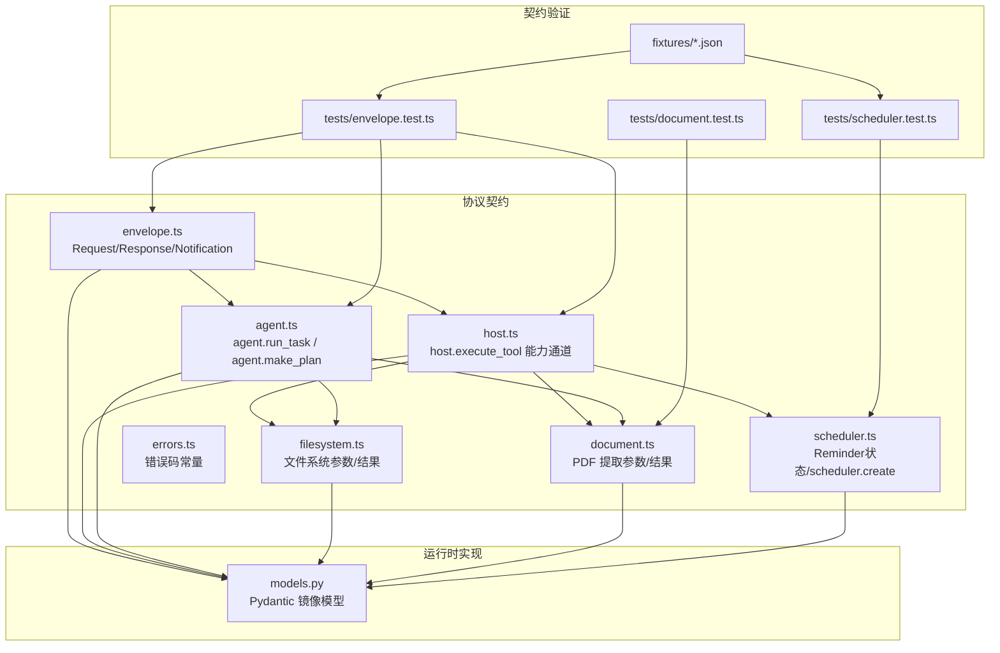
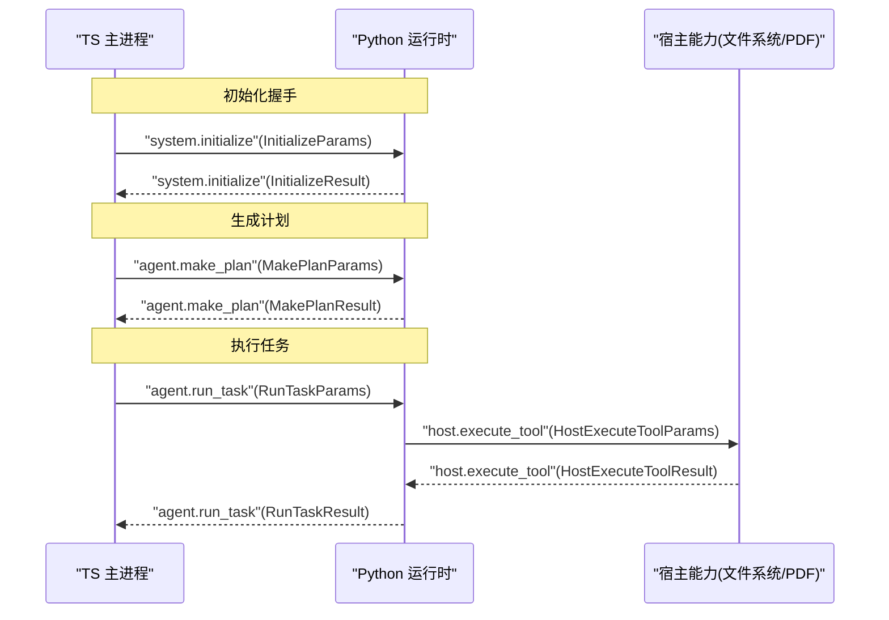
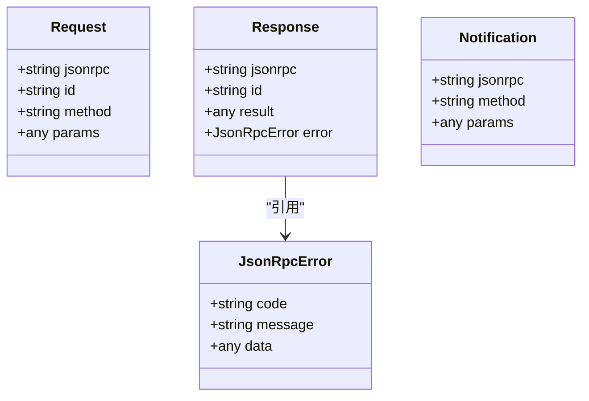
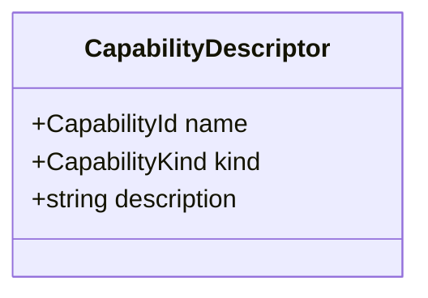
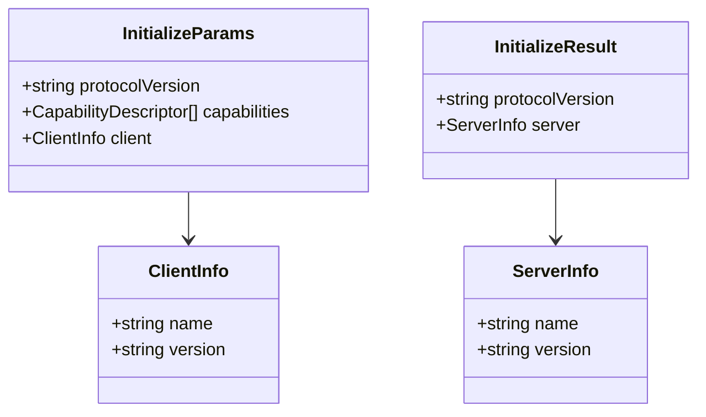
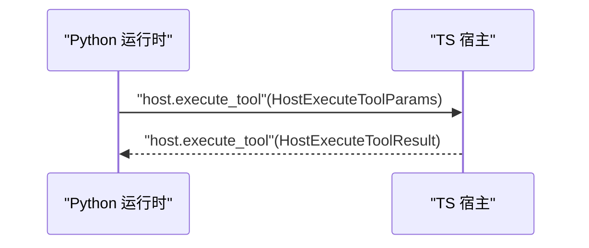
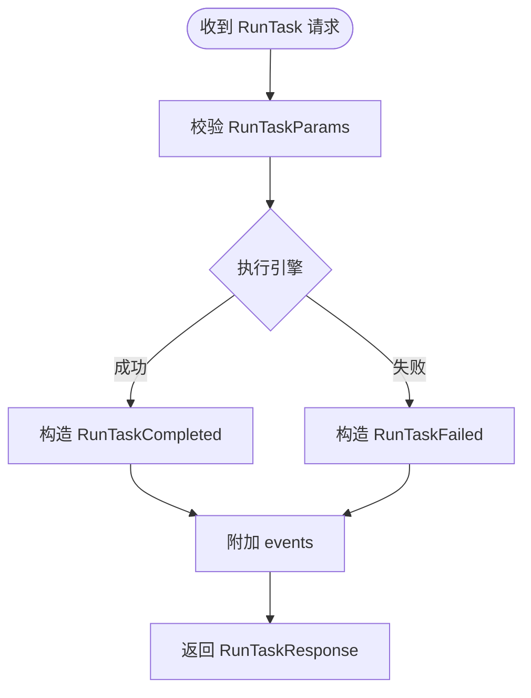
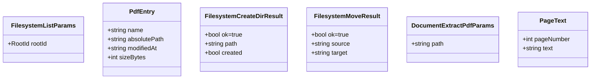
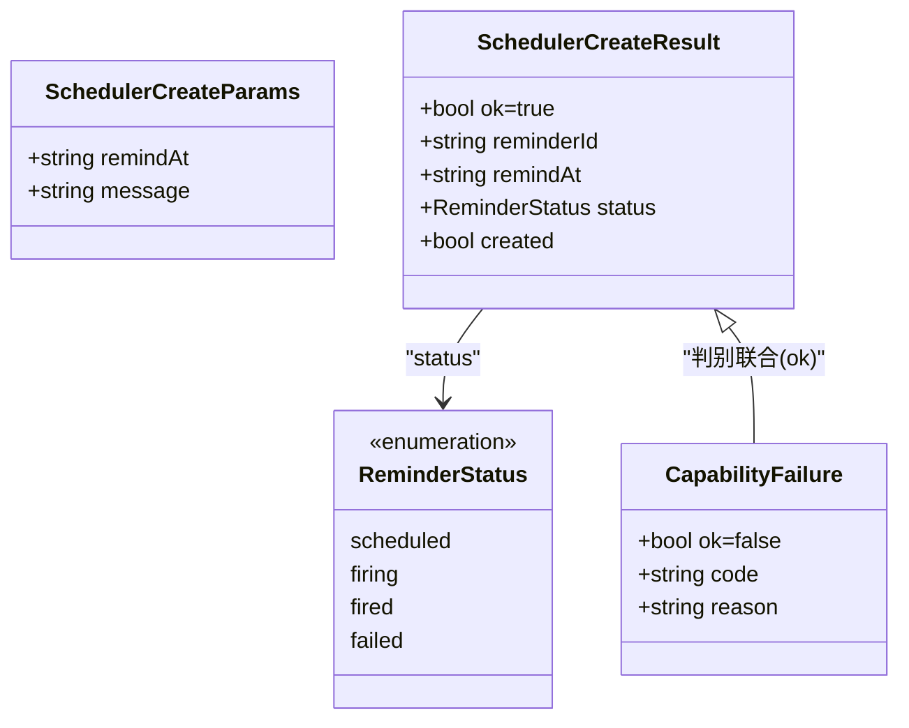
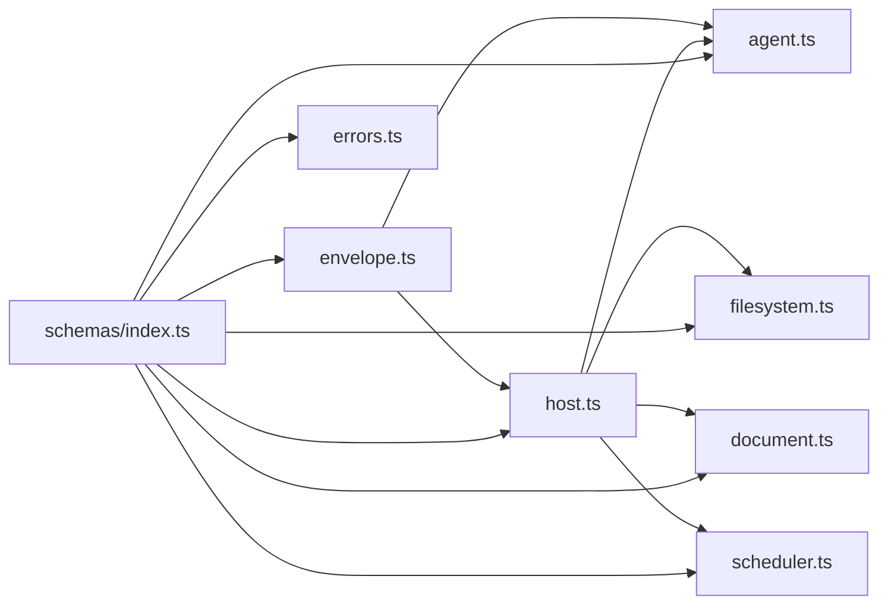

# 协议模型

<cite>
**本文引用的文件**
- [packages/protocol/schemas/envelope.ts](file://packages/protocol/schemas/envelope.ts)
- [packages/protocol/schemas/errors.ts](file://packages/protocol/schemas/errors.ts)
- [packages/protocol/schemas/host.ts](file://packages/protocol/schemas/host.ts)
- [packages/protocol/schemas/agent.ts](file://packages/protocol/schemas/agent.ts)
- [packages/protocol/schemas/filesystem.ts](file://packages/protocol/schemas/filesystem.ts)
- [packages/protocol/schemas/scheduler.ts](file://packages/protocol/schemas/scheduler.ts)
- [packages/protocol/schemas/document.ts](file://packages/protocol/schemas/document.ts)
- [packages/protocol/schemas/index.ts](file://packages/protocol/schemas/index.ts)
- [services/agent-runtime/src/personal_agent/protocol/models.py](file://services/agent-runtime/src/personal_agent/protocol/models.py)
- [packages/protocol/fixtures/initialize.request.json](file://packages/protocol/fixtures/initialize.request.json)
- [packages/protocol/fixtures/initialize.response.json](file://packages/protocol/fixtures/initialize.response.json)
- [packages/protocol/fixtures/ping.request.json](file://packages/protocol/fixtures/ping.request.json)
- [packages/protocol/fixtures/ping.response.json](file://packages/protocol/fixtures/ping.response.json)
- [packages/protocol/fixtures/host-execute-tool.request.json](file://packages/protocol/fixtures/host-execute-tool.request.json)
- [packages/protocol/fixtures/host-execute-tool.response.json](file://packages/protocol/fixtures/host-execute-tool.response.json)
- [packages/protocol/fixtures/agent-run-task.request.json](file://packages/protocol/fixtures/agent-run-task.request.json)
- [packages/protocol/fixtures/agent-make-plan.request.json](file://packages/protocol/fixtures/agent-make-plan.request.json)
- [packages/protocol/fixtures/host-filesystem-create-dir.response.json](file://packages/protocol/fixtures/host-filesystem-create-dir.response.json)
- [packages/protocol/fixtures/host-filesystem-move.response.json](file://packages/protocol/fixtures/host-filesystem-move.response.json)
- [packages/protocol/fixtures/host-scheduler-create.request.json](file://packages/protocol/fixtures/host-scheduler-create.request.json)
- [packages/protocol/fixtures/host-scheduler-create.response.json](file://packages/protocol/fixtures/host-scheduler-create.response.json)
- [packages/protocol/tests/envelope.test.ts](file://packages/protocol/tests/envelope.test.ts)
- [packages/protocol/tests/document.test.ts](file://packages/protocol/tests/document.test.ts)
- [packages/protocol/tests/scheduler.test.ts](file://packages/protocol/tests/scheduler.test.ts)
- [services/agent-runtime/tests/test_protocol_fixtures.py](file://services/agent-runtime/tests/test_protocol_fixtures.py)
</cite>

## 目录
1. [简介](#简介)
2. [项目结构](#项目结构)
3. [核心组件](#核心组件)
4. [架构总览](#架构总览)
5. [详细组件分析](#详细组件分析)
6. [依赖关系分析](#依赖关系分析)
7. [性能考虑](#性能考虑)
8. [故障排查指南](#故障排查指南)
9. [结论](#结论)
10. [附录：协议扩展指南](#附录协议扩展指南)

## 简介
本文件系统化梳理 PersonalAgent 的协议模型，覆盖 JSON-RPC 消息封装、方法定义、能力描述符、服务器信息模型、错误码规范、数据验证规则与扩展方式。协议在 TypeScript（Zod）与 Python（Pydantic）两端保持一致的契约，并通过 fixtures 与测试用例进行回归保障。

## 项目结构
协议相关代码主要位于 packages/protocol/schemas（TS 侧 Zod 定义）与 services/agent-runtime/src/personal_agent/protocol/models.py（Python 侧 Pydantic 定义），并以 fixtures 和 tests 作为契约的“可执行文档”。

图表来源
- [packages/protocol/schemas/envelope.ts:1-41](file://packages/protocol/schemas/envelope.ts#L1-L41)
- [packages/protocol/schemas/host.ts:1-76](file://packages/protocol/schemas/host.ts#L1-L76)
- [packages/protocol/schemas/agent.ts:1-138](file://packages/protocol/schemas/agent.ts#L1-L138)
- [packages/protocol/schemas/filesystem.ts:1-71](file://packages/protocol/schemas/filesystem.ts#L1-L71)
- [packages/protocol/schemas/scheduler.ts:1-42](file://packages/protocol/schemas/scheduler.ts#L1-L42)
- [packages/protocol/schemas/document.ts:1-31](file://packages/protocol/schemas/document.ts#L1-L31)
- [services/agent-runtime/src/personal_agent/protocol/models.py:1-368](file://services/agent-runtime/src/personal_agent/protocol/models.py#L1-L368)
- [packages/protocol/tests/envelope.test.ts:1-627](file://packages/protocol/tests/envelope.test.ts#L1-L627)
- [packages/protocol/tests/document.test.ts:1-162](file://packages/protocol/tests/document.test.ts#L1-L162)
- [packages/protocol/tests/scheduler.test.ts:1-161](file://packages/protocol/tests/scheduler.test.ts#L1-L161)

章节来源
- [packages/protocol/schemas/index.ts:1-8](file://packages/protocol/schemas/index.ts#L1-L8)

## 核心组件
- JSON-RPC 信封：统一的 Request/Response/Notification 结构与校验规则，确保 jsonrpc 版本、id 非空、method 命名规范、result/error 互斥。
- 能力通道 host.execute_tool：Python → TS 的反向 RPC，承载具体能力调用（如 PDF 提取、文件系统操作）。
- Agent 方法：agent.run_task（触发任务）、agent.make_plan（生成计划步骤）。
- 领域参数/结果：文件系统（list/create_dir/move）、文档提取、调度器（scheduler.create 与 Reminder 状态枚举）等。
- 错误码：集中定义标准与业务错误码（现共 28 个）。
- 服务器信息与初始化：InitializeParams/InitializeResult 用于握手与能力协商。

章节来源
- [packages/protocol/schemas/envelope.ts:1-41](file://packages/protocol/schemas/envelope.ts#L1-L41)
- [packages/protocol/schemas/host.ts:1-76](file://packages/protocol/schemas/host.ts#L1-L76)
- [packages/protocol/schemas/agent.ts:1-138](file://packages/protocol/schemas/agent.ts#L1-L138)
- [packages/protocol/schemas/filesystem.ts:1-71](file://packages/protocol/schemas/filesystem.ts#L1-L71)
- [packages/protocol/schemas/document.ts:1-31](file://packages/protocol/schemas/document.ts#L1-L31)
- [packages/protocol/schemas/errors.ts:1-30](file://packages/protocol/schemas/errors.ts#L1-L30)
- [services/agent-runtime/src/personal_agent/protocol/models.py:1-368](file://services/agent-runtime/src/personal_agent/protocol/models.py#L1-L368)

## 架构总览
协议采用“信封 + 载荷”的分层设计：
- 信封层：统一处理 jsonrpc 版本、id、method、result/error 互斥等通用约束。
- 载荷层：按方法域（host/agent/filesystem/document）定义强类型入参与出参。
- 双向通道：TS→Python 通过 agent.*；Python→TS 通过 host.execute_tool。

图表来源
- [packages/protocol/fixtures/initialize.request.json:1-22](file://packages/protocol/fixtures/initialize.request.json#L1-L22)
- [packages/protocol/fixtures/initialize.response.json:1-5](file://packages/protocol/fixtures/initialize.response.json#L1-L5)
- [packages/protocol/fixtures/agent-make-plan.request.json:1-10](file://packages/protocol/fixtures/agent-make-plan.request.json#L1-L10)
- [packages/protocol/fixtures/agent-run-task.request.json:1-10](file://packages/protocol/fixtures/agent-run-task.request.json#L1-L10)
- [packages/protocol/fixtures/host-execute-tool.request.json:1-13](file://packages/protocol/fixtures/host-execute-tool.request.json#L1-L13)
- [packages/protocol/fixtures/host-execute-tool.response.json:1-18](file://packages/protocol/fixtures/host-execute-tool.response.json#L1-L18)

## 详细组件分析

### JSON-RPC 信封与通知
- Request：固定 jsonrpc 为 "2.0"，id 非空字符串，method 遵循命名规范（小写字母开头、由点分隔的多段标识），params 可为任意值。
- Response：result 与 error 二选一且必须存在其一；error 包含 code/message/data。
- Notification：无 id，仅 method 与 params。

图表来源
- [packages/protocol/schemas/envelope.ts:1-41](file://packages/protocol/schemas/envelope.ts#L1-L41)
- [services/agent-runtime/src/personal_agent/protocol/models.py:8-37](file://services/agent-runtime/src/personal_agent/protocol/models.py#L8-L37)

章节来源
- [packages/protocol/schemas/envelope.ts:1-41](file://packages/protocol/schemas/envelope.ts#L1-L41)
- [services/agent-runtime/src/personal_agent/protocol/models.py:8-37](file://services/agent-runtime/src/personal_agent/protocol/models.py#L8-L37)

### 能力描述符 CapabilityDescriptor
- name：能力标识枚举（如 filesystem.list、document.extract_pdf 等）。
- kind：READ 或 WRITE。
- description：非空描述文本。
用途：在 initialize 阶段声明客户端可用能力，供服务端做权限与路由决策。

图表来源
- [packages/protocol/schemas/host.ts:7-26](file://packages/protocol/schemas/host.ts#L7-L26)
- [services/agent-runtime/src/personal_agent/protocol/models.py:79-119](file://services/agent-runtime/src/personal_agent/protocol/models.py#L79-L119)
- [services/agent-runtime/src/personal_agent/protocol/models.py:244-261](file://services/agent-runtime/src/personal_agent/protocol/models.py#L244-L261)

章节来源
- [packages/protocol/schemas/host.ts:7-26](file://packages/protocol/schemas/host.ts#L7-L26)
- [services/agent-runtime/src/personal_agent/protocol/models.py:79-119](file://services/agent-runtime/src/personal_agent/protocol/models.py#L79-L119)
- [services/agent-runtime/src/personal_agent/protocol/models.py:244-261](file://services/agent-runtime/src/personal_agent/protocol/models.py#L244-L261)

### 服务器信息模型 ServerInfo 与初始化
- InitializeParams：包含 protocolVersion、capabilities、client。
- InitializeResult：返回 protocolVersion 与 server（ServerInfo）。
- ServerInfo：name、version。
兼容性检查：双方通过 protocolVersion 字段进行版本对齐，当前固定为 "0.1"。

图表来源
- [packages/protocol/fixtures/initialize.request.json:1-22](file://packages/protocol/fixtures/initialize.request.json#L1-L22)
- [packages/protocol/fixtures/initialize.response.json:1-5](file://packages/protocol/fixtures/initialize.response.json#L1-L5)
- [services/agent-runtime/src/personal_agent/protocol/models.py:64-119](file://services/agent-runtime/src/personal_agent/protocol/models.py#L64-L119)
- [services/agent-runtime/src/personal_agent/protocol/models.py:244-261](file://services/agent-runtime/src/personal_agent/protocol/models.py#L244-L261)

章节来源
- [packages/protocol/fixtures/initialize.request.json:1-22](file://packages/protocol/fixtures/initialize.request.json#L1-L22)
- [packages/protocol/fixtures/initialize.response.json:1-5](file://packages/protocol/fixtures/initialize.response.json#L1-L5)
- [services/agent-runtime/src/personal_agent/protocol/models.py:64-119](file://services/agent-runtime/src/personal_agent/protocol/models.py#L64-L119)
- [services/agent-runtime/src/personal_agent/protocol/models.py:244-261](file://services/agent-runtime/src/personal_agent/protocol/models.py#L244-L261)

### host.execute_tool 反向 RPC
- 方法名：host.execute_tool。
- 请求参数：callId（匹配模式）、capability（白名单：filesystem.list、document.extract_pdf、filesystem.create_dir、filesystem.move、scheduler.create、notification.send）、arguments（动态键值）。
- 响应结果：ok 布尔；成功时携带具体 payload（如 PDF 页面列表、create_dir/move 结果 DTO、Reminder 创建结果），失败时使用 CapabilityFailure（ok=false, code, reason）。
- 与信封一致性：同时满足通用 Request/Response 校验。

图表来源
- [packages/protocol/schemas/host.ts:1-76](file://packages/protocol/schemas/host.ts#L1-L76)
- [packages/protocol/fixtures/host-execute-tool.request.json:1-13](file://packages/protocol/fixtures/host-execute-tool.request.json#L1-L13)
- [packages/protocol/fixtures/host-execute-tool.response.json:1-18](file://packages/protocol/fixtures/host-execute-tool.response.json#L1-L18)
- [packages/protocol/tests/envelope.test.ts:236-260](file://packages/protocol/tests/envelope.test.ts#L236-L260)

章节来源
- [packages/protocol/schemas/host.ts:1-76](file://packages/protocol/schemas/host.ts#L1-L76)
- [packages/protocol/fixtures/host-execute-tool.request.json:1-13](file://packages/protocol/fixtures/host-execute-tool.request.json#L1-L13)
- [packages/protocol/fixtures/host-execute-tool.response.json:1-18](file://packages/protocol/fixtures/host-execute-tool.response.json#L1-L18)
- [packages/protocol/tests/envelope.test.ts:236-260](file://packages/protocol/tests/envelope.test.ts#L236-L260)

### agent.run_task 与 agent.make_plan
- agent.make_plan：输入 taskId/goal，返回至少一步的计划 steps（每步含 description，可选 capability）。
- agent.run_task：输入 taskId/goal，返回 completed/failed 两种状态的结果，包含 facts/events 等。
- 事件时间戳：occurredAt 严格格式（毫秒+Z）。

图表来源
- [packages/protocol/schemas/agent.ts:1-138](file://packages/protocol/schemas/agent.ts#L1-L138)
- [packages/protocol/fixtures/agent-run-task.request.json:1-10](file://packages/protocol/fixtures/agent-run-task.request.json#L1-L10)
- [packages/protocol/tests/envelope.test.ts:268-455](file://packages/protocol/tests/envelope.test.ts#L268-L455)

章节来源
- [packages/protocol/schemas/agent.ts:1-138](file://packages/protocol/schemas/agent.ts#L1-L138)
- [packages/protocol/fixtures/agent-run-task.request.json:1-10](file://packages/protocol/fixtures/agent-run-task.request.json#L1-L10)
- [packages/protocol/tests/envelope.test.ts:268-455](file://packages/protocol/tests/envelope.test.ts#L268-L455)

### 文件系统与文档提取
- 文件系统：
  - list：rootId 限定为 downloads，返回 entries（PdfEntry 数组）。
  - create_dir：入参 path 非空；结果 FilesystemCreateDirResult { ok: true, path, created }。**幂等**——目录已存在不算失败，created 区分「本次新建/本就存在」；path 是 realpath 规范化后的绝对路径。
  - move：入参 source/target 非空（字段名与 PermissionRecord 的 sourcePaths/targetPath 对齐）；结果 FilesystemMoveResult { ok: true, source, target }。**不幂等**——target 已存在直接拒（MOVE_TARGET_EXISTS）。
  - 两个 Outcome 均为成功结果或 CapabilityFailure 的判别联合（按 ok 判别）。
- 文档提取：DocumentExtractPdfOutcome 为判别联合，成功分支包含 pages（pageNumber 为正整数），失败分支使用 CapabilityFailure。

图表来源
- [packages/protocol/schemas/filesystem.ts:1-71](file://packages/protocol/schemas/filesystem.ts#L1-L71)
- [packages/protocol/schemas/document.ts:1-31](file://packages/protocol/schemas/document.ts#L1-L31)
- [packages/protocol/tests/document.test.ts:1-162](file://packages/protocol/tests/document.test.ts#L1-L162)

章节来源
- [packages/protocol/schemas/filesystem.ts:1-71](file://packages/protocol/schemas/filesystem.ts#L1-L71)
- [packages/protocol/schemas/document.ts:1-31](file://packages/protocol/schemas/document.ts#L1-L31)
- [packages/protocol/fixtures/host-filesystem-create-dir.response.json:1-9](file://packages/protocol/fixtures/host-filesystem-create-dir.response.json#L1-L9)
- [packages/protocol/fixtures/host-filesystem-move.response.json:1-9](file://packages/protocol/fixtures/host-filesystem-move.response.json#L1-L9)
- [packages/protocol/tests/document.test.ts:1-162](file://packages/protocol/tests/document.test.ts#L1-L162)

### 调度器契约（scheduler.create）
- ReminderStatus：z.enum(["scheduled", "firing", "fired", "failed"])，与 apps/desktop shared/domain.ts 的 REMINDER_STATUSES 及 reminders 表 CHECK 约束同源（防漂移测试遍历数组做真库插入）。
- SchedulerCreateParams { remindAt, message }：均非空字符串。契约层**只钉形状**——remindAt 能否解析、是否在未来由 host 侧 binder 判定（过去时刻拒以 REMINDER_TIME_IN_PAST），与 DocumentExtractPdfParams 不校验路径越界是同一个分层原则：契约钉形状，语义归执行链。
- SchedulerCreateResult { ok, reminderId, remindAt, status, created }：
  - created 区分「本次新建」与「命中同任务已有 Reminder 的幂等返回」。
  - remindAt 是 binder 规范化后的 UTC ISO（毫秒三位 + Z），与 reminders.remind_at、批准面板展示的时间是同一个串——用户确认的就是落库的。
- SchedulerCreateOutcome：成功结果或 CapabilityFailure 的判别联合。
- Pydantic 镜像：models.py 中 ReminderStatus（Literal 四值）、SchedulerCreateParams、SchedulerCreateResult、SchedulerCreateOutcome 逐字段镜像，ConfigDict(extra="allow") 防静默丢数据。
- Fixtures 交叉验证：host-scheduler-create.request.json / host-scheduler-create.response.json 双端各自 parse；TS 侧 tests/scheduler.test.ts 与 Python 侧 test_protocol_fixtures.py 的对称用例逐条对应。
- 范围说明：Reminder 的创建、持久化、到期触发（fire-reminder.ts + reminder-timer.ts）与启动恢复（recover-reminders.ts）均已实现；生产接线尚未接上，见 docs/adr/0001-file-boundaries-deviations.md。

图表来源
- [packages/protocol/schemas/scheduler.ts:1-42](file://packages/protocol/schemas/scheduler.ts#L1-L42)
- [services/agent-runtime/src/personal_agent/protocol/models.py:166-204](file://services/agent-runtime/src/personal_agent/protocol/models.py#L166-L204)

章节来源
- [packages/protocol/schemas/scheduler.ts:1-42](file://packages/protocol/schemas/scheduler.ts#L1-L42)
- [services/agent-runtime/src/personal_agent/protocol/models.py:166-204](file://services/agent-runtime/src/personal_agent/protocol/models.py#L166-L204)
- [packages/protocol/fixtures/host-scheduler-create.request.json:1-1](file://packages/protocol/fixtures/host-scheduler-create.request.json#L1-L1)
- [packages/protocol/fixtures/host-scheduler-create.response.json:1-1](file://packages/protocol/fixtures/host-scheduler-create.response.json#L1-L1)
- [packages/protocol/tests/scheduler.test.ts:1-161](file://packages/protocol/tests/scheduler.test.ts#L1-L161)
- [services/agent-runtime/tests/test_protocol_fixtures.py:525-625](file://services/agent-runtime/tests/test_protocol_fixtures.py#L525-L625)

### 错误码定义与使用规范
- 标准错误码：集中在 errors.ts，涵盖协议、主机、文件系统、权限、PDF 等场景，现共 28 个；其中文件系统写入类 CREATE_DIR_FAILED、MOVE_SOURCE_MISSING、MOVE_TARGET_EXISTS、MOVE_FAILED，Reminder 调度类 REMINDER_TIME_IN_PAST、REMINDER_ALREADY_EXISTS、SCHEDULER_CREATE_FAILED。
- 使用规范：
  - 协议层错误（如非法请求、未找到方法）使用 PROTOCOL_* 类错误码。
  - 能力执行失败优先走 result 中的 CapabilityFailure（ok=false），而非 envelope 的 error。
  - 业务异常（如 PDF 损坏）使用专用错误码（如 PDF_EXTRACTION_FAILED）。
  - 权限相关错误使用 PERMISSION_* 系列。
  - 注意：幂等关 reject 时构造的 IDEMPOTENCY_CONFLICT 不在 ERROR_CODE 表中，只出现在 capabilities/idempotency.ts 的结果载荷里。

章节来源
- [packages/protocol/schemas/errors.ts:1-30](file://packages/protocol/schemas/errors.ts#L1-L30)
- [packages/protocol/schemas/host.ts:69-76](file://packages/protocol/schemas/host.ts#L69-L76)
- [packages/protocol/tests/document.test.ts:129-139](file://packages/protocol/tests/document.test.ts#L129-L139)

### 数据验证规则
- 字段约束：非空字符串、最小长度、数值范围、正数/整数等。
- 类型检查：严格类型（如 pageNumber 为正整数）。
- 业务规则：
  - result 与 error 互斥且必居其一。
  - PlanStepDto.capability 缺失合法但 null 不合法（与 exclude_none 序列化约定一致）。
  - SummaryFact.pageRefs 允许为空数组，但元素必须 ≥ 1。
  - occurredAt 时间戳严格格式（毫秒+Z）。

章节来源
- [packages/protocol/schemas/envelope.ts:12-34](file://packages/protocol/schemas/envelope.ts#L12-L34)
- [packages/protocol/schemas/agent.ts:15-24](file://packages/protocol/schemas/agent.ts#L15-L24)
- [packages/protocol/schemas/agent.ts:68-76](file://packages/protocol/schemas/agent.ts#L68-L76)
- [packages/protocol/tests/envelope.test.ts:427-455](file://packages/protocol/tests/envelope.test.ts#L427-L455)
- [packages/protocol/tests/document.test.ts:55-83](file://packages/protocol/tests/document.test.ts#L55-L83)

## 依赖关系分析
- schemas/index.ts 聚合导出所有子模块（含 scheduler.ts），便于统一引入。
- host.ts 被 agent.ts、document.ts、filesystem.ts 与 scheduler.ts 引用（CapabilityId、CapabilityFailure）。
- envelope.ts 提供通用 Request/Response/Notification，被各方法请求/响应复用。
- models.py 与 TS schemas 保持一一对应，保证双端一致性。

图表来源
- [packages/protocol/schemas/index.ts:1-8](file://packages/protocol/schemas/index.ts#L1-L8)
- [packages/protocol/schemas/host.ts:1-76](file://packages/protocol/schemas/host.ts#L1-L76)
- [packages/protocol/schemas/agent.ts:1-138](file://packages/protocol/schemas/agent.ts#L1-L138)
- [packages/protocol/schemas/document.ts:1-31](file://packages/protocol/schemas/document.ts#L1-L31)

章节来源
- [packages/protocol/schemas/index.ts:1-8](file://packages/protocol/schemas/index.ts#L1-L8)

## 性能考虑
- 使用强类型校验在边界快速失败，减少无效数据处理。
- 判别联合（discriminated union）提升解析效率与类型收窄精度。
- 限制能力白名单与参数范围，降低路由与执行成本。
- 事件与摘要的结构化存储利于后续查询与回放。

## 故障排查指南
- 常见校验失败：
  - result 与 error 同时出现或缺失：检查 Response 构造逻辑。
  - method 字面值不匹配：确认请求方法名与 schema 字面量一致。
  - occurredAt 格式不符：确保毫秒级 UTC 时间戳。
  - pageRefs 包含 0 或非整数：修正页码生成逻辑。
  - remindAt 为空串或非字符串：SchedulerCreateParams 直接拒绝；注意「今晚八点」这类未解析文本或非未来时刻能通过契约层，由 host 侧 binder 拒（INVALID_ARGUMENT / REMINDER_TIME_IN_PAST）。
  - status 不在 Reminder 四状态枚举内（如 expired/pending 是 Permission 的词表）：ReminderStatus 拒绝，串进来就是契约漂移。
- 定位方式：
  - 使用 fixtures 与 tests 复现问题。
  - 对照 envelope.test.ts、document.test.ts 与 scheduler.test.ts 的断言用例（Python 侧对称用例在 test_protocol_fixtures.py）。

章节来源
- [packages/protocol/tests/envelope.test.ts:427-455](file://packages/protocol/tests/envelope.test.ts#L427-L455)
- [packages/protocol/tests/document.test.ts:55-83](file://packages/protocol/tests/document.test.ts#L55-L83)

## 结论
本协议以“信封 + 载荷”的分层设计，结合严格的 Zod/Pydantic 校验与完备的 fixtures/tests，确保了 TS 与 Python 双端的一致性与可维护性。通过能力描述符与错误码体系，实现了清晰的权限控制与错误语义。

## 附录：协议扩展指南
- 新增能力（遵循三步同步约定：Zod schema ↔ Pydantic 镜像 ↔ fixtures 交叉验证，缺一不可）：
  - 在 host.ts 的能力枚举中增加新能力名。
  - 在 filesystem.ts、document.ts 或独立的 schema 文件（如 scheduler.ts）中定义对应的参数/结果模型，并在 index.ts 导出。
  - 在 models.py 中同步新增 Pydantic 镜像模型（ConfigDict(extra="allow") 防静默丢数据）。
  - 新增 fixtures/*.json 共享样本，TS 与 Python 两侧测试各自 parse 做交叉验证（先例：host-scheduler-create.request/response.json）。
- 新增方法：
  - 在 agent.ts 中定义新的 Request/Response/Params/Result 模型。
  - 在 models.py 中镜像新增对应模型。
  - 在 tests 中添加 fixtures 与用例，确保两端一致性。
- 新增错误码：
  - 在 errors.ts 中追加错误码常量。
  - 在业务逻辑中使用相应错误码，并在 CapabilityFailure 或 envelope error 中体现。
- 兼容性：
  - 若涉及协议版本变更，更新 InitializeParams/InitializeResult 的 protocolVersion 并补充迁移策略。

章节来源
- [packages/protocol/schemas/host.ts:7-14](file://packages/protocol/schemas/host.ts#L7-L14)
- [packages/protocol/schemas/agent.ts:1-138](file://packages/protocol/schemas/agent.ts#L1-L138)
- [packages/protocol/schemas/errors.ts:1-30](file://packages/protocol/schemas/errors.ts#L1-L30)
- [services/agent-runtime/src/personal_agent/protocol/models.py:1-368](file://services/agent-runtime/src/personal_agent/protocol/models.py#L1-L368)