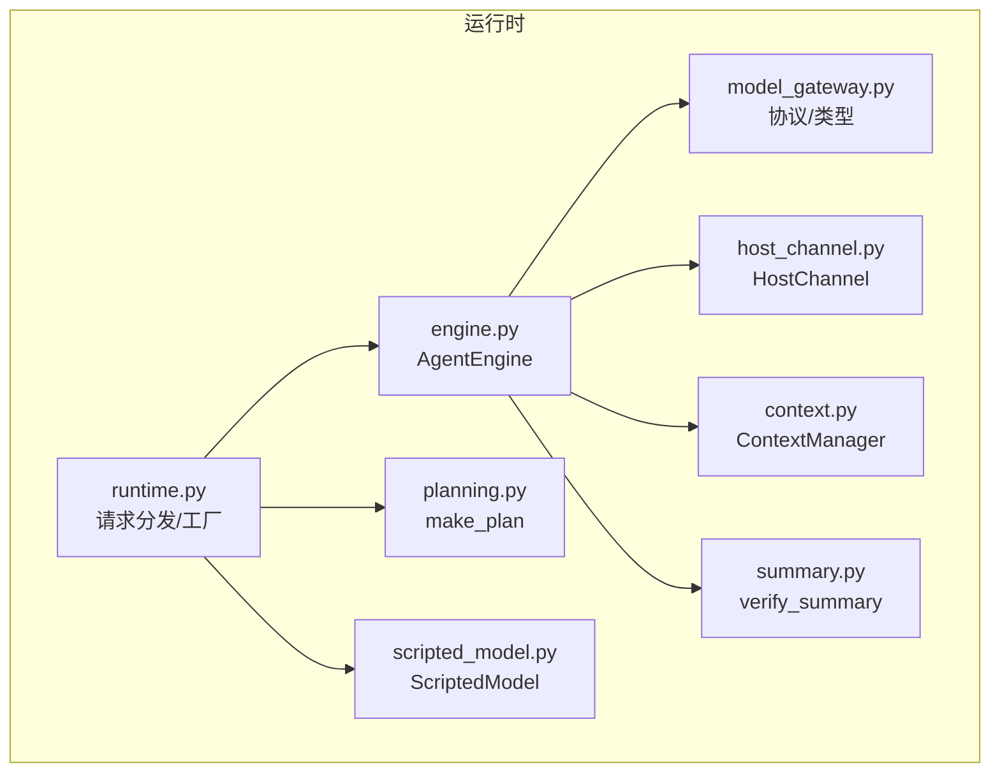
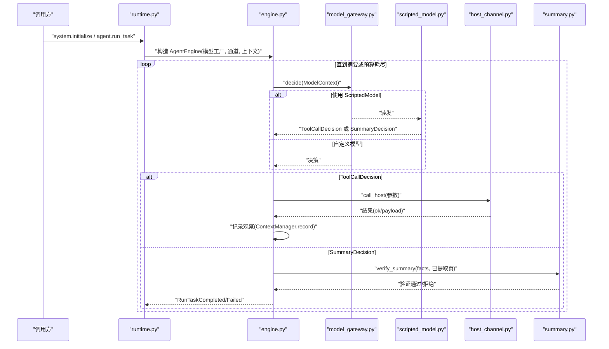
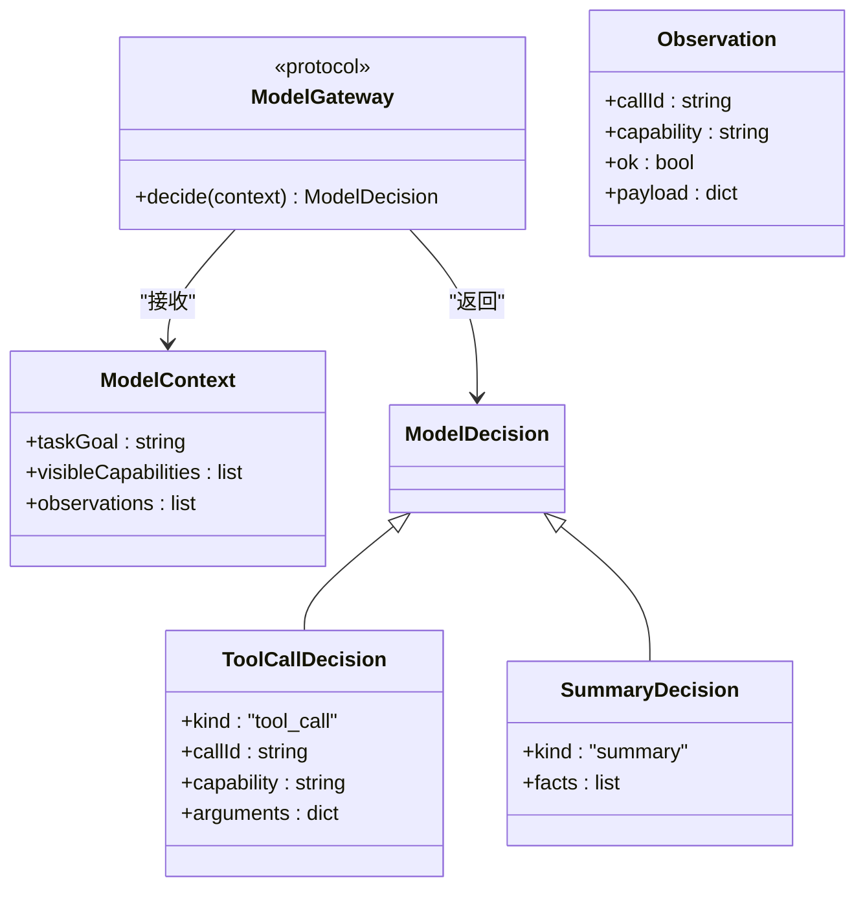
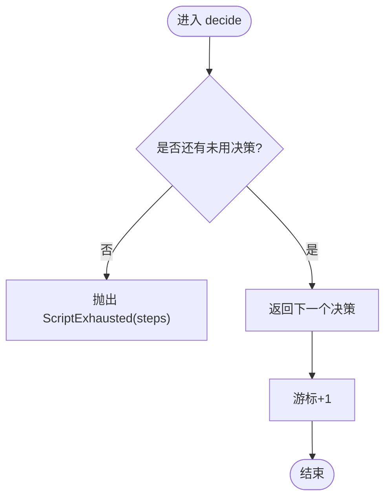
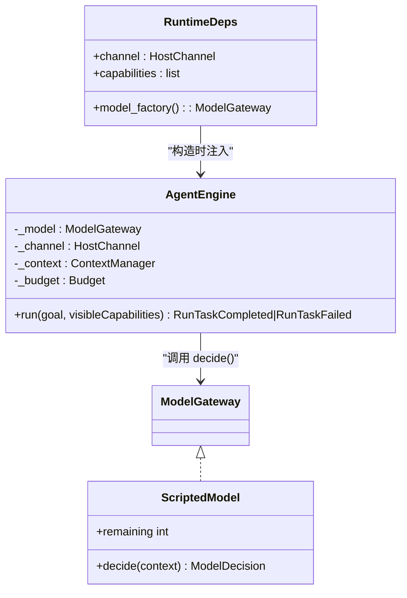
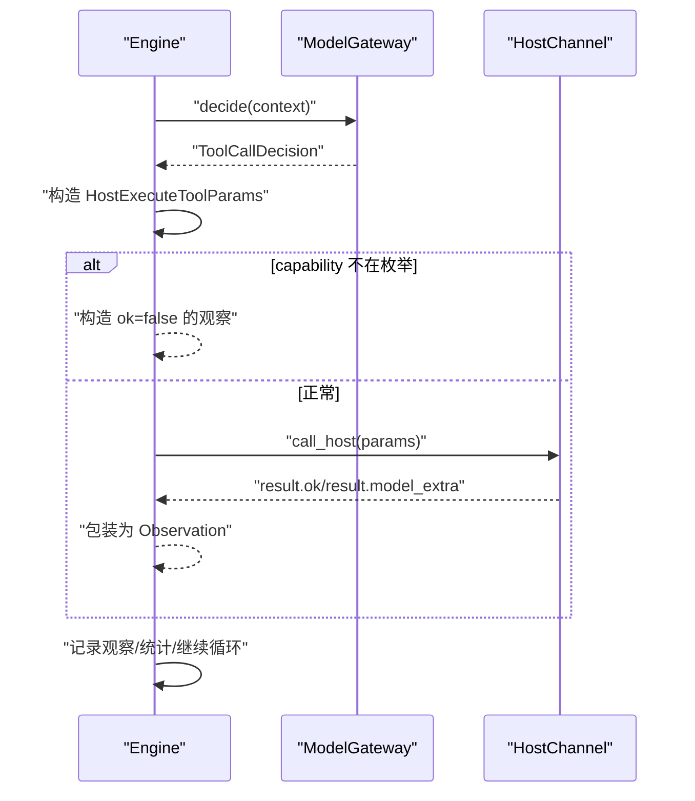
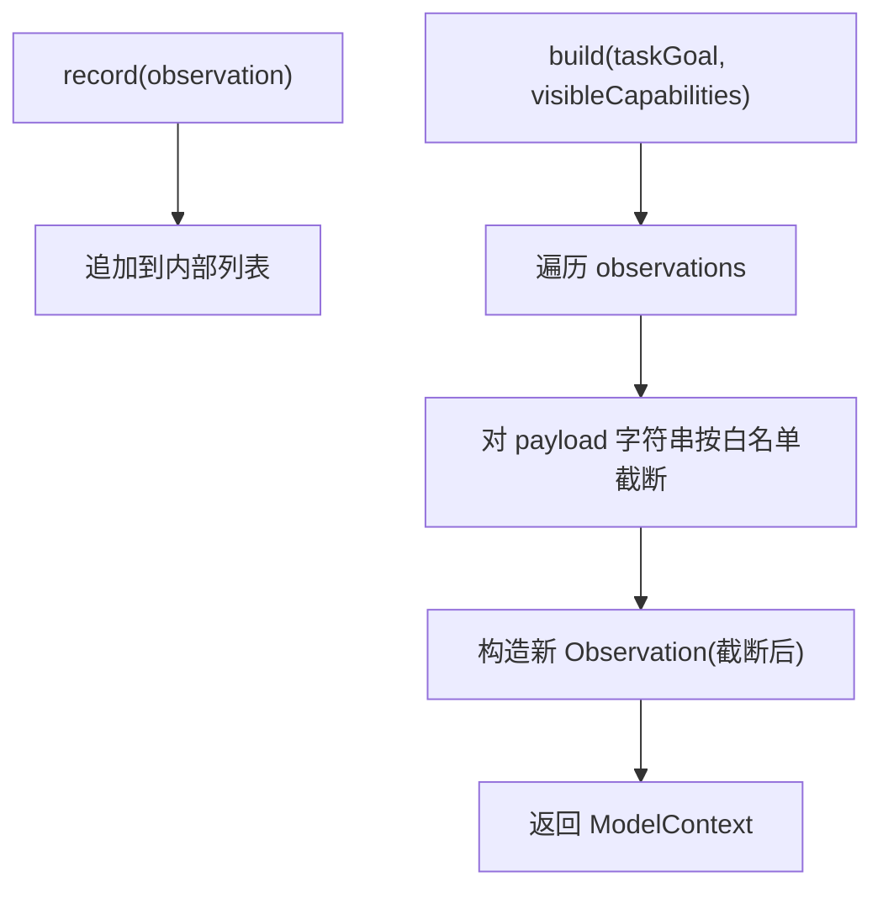
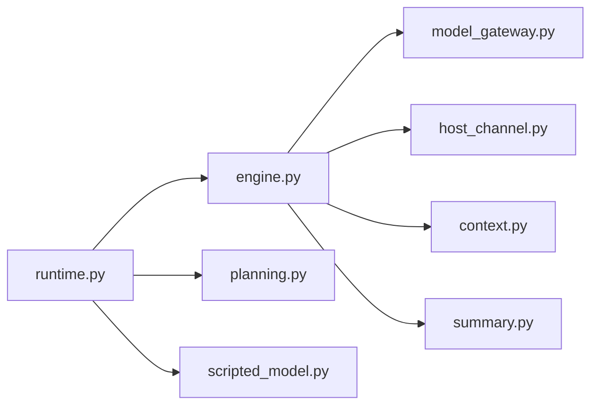

# 模型网关

<cite>
**本文引用的文件**
- [model_gateway.py](file://services/agent-runtime/src/personal_agent/model_gateway.py)
- [scripted_model.py](file://services/agent-runtime/src/personal_agent/scripted_model.py)
- [context.py](file://services/agent-runtime/src/personal_agent/context.py)
- [engine.py](file://services/agent-runtime/src/personal_agent/engine.py)
- [runtime.py](file://services/agent-runtime/src/personal_agent/runtime.py)
- [host_channel.py](file://services/agent-runtime/src/personal_agent/host_channel.py)
- [planning.py](file://services/agent-runtime/src/personal_agent/planning.py)
- [summary.py](file://services/agent-runtime/src/personal_agent/summary.py)
- [test_model_gateway.py](file://services/agent-runtime/tests/test_model_gateway.py)
- [test_scripted_model.py](file://services/agent-runtime/tests/test_scripted_model.py)
</cite>

## 目录
1. [简介](#简介)
2. [项目结构](#项目结构)
3. [核心组件](#核心组件)
4. [架构总览](#架构总览)
5. [详细组件分析](#详细组件分析)
6. [依赖关系分析](#依赖关系分析)
7. [性能考虑](#性能考虑)
8. [故障排查指南](#故障排查指南)
9. [结论](#结论)
10. [附录：适配器开发指南与最佳实践](#附录：适配器开发指南与最佳实践)

## 简介
本仓库的“模型网关”是 Agent 运行时中负责将“任务目标 + 工具调用结果（观察）”转化为下一步决策的抽象层。它通过一个协议接口 ModelGateway 解耦具体模型实现，当前默认提供 ScriptedModel（基于 JSON 剧本的确定性执行），并配合 Engine、ContextManager、HostChannel 等模块完成完整的“计划—执行—摘要”闭环。本文面向希望理解或扩展该网关的开发者，覆盖接口设计、实现原理、调用流程、上下文管理、错误处理与性能优化策略，并提供适配器开发指南与示例路径。

## 项目结构
Agent 运行时的核心位于 services/agent-runtime/src/personal_agent，围绕“网关—引擎—通道—上下文”组织：
- model_gateway.py：定义数据契约与 ModelGateway 协议
- scripted_model.py：默认实现（按脚本顺序返回决策）
- context.py：观察记录与上下文构建（含字符串截断）
- engine.py：Agent 主循环、预算控制、事件输出
- runtime.py：进程入口、请求分发、模型工厂解析
- host_channel.py：与宿主（TS 侧）的工具调用通信
- planning.py：固定三步计划生成
- summary.py：摘要有效性校验

图表来源
- [runtime.py:67-182](file://services/agent-runtime/src/personal_agent/runtime.py#L67-L182)
- [engine.py:76-195](file://services/agent-runtime/src/personal_agent/engine.py#L76-L195)
- [context.py:45-79](file://services/agent-runtime/src/personal_agent/context.py#L45-L79)
- [host_channel.py:36-91](file://services/agent-runtime/src/personal_agent/host_channel.py#L36-L91)
- [planning.py:25-45](file://services/agent-runtime/src/personal_agent/planning.py#L25-L45)
- [scripted_model.py:18-57](file://services/agent-runtime/src/personal_agent/scripted_model.py#L18-L57)
- [model_gateway.py:6-58](file://services/agent-runtime/src/personal_agent/model_gateway.py#L6-L58)
- [summary.py:30-85](file://services/agent-runtime/src/personal_agent/summary.py#L30-L85)

章节来源
- [runtime.py:67-182](file://services/agent-runtime/src/personal_agent/runtime.py#L67-L182)
- [engine.py:76-195](file://services/agent-runtime/src/personal_agent/engine.py#L76-L195)

## 核心组件
- ModelGateway 协议：统一 decide(context) -> decision 的抽象端口，便于替换不同模型实现。
- ScriptedModel：按预设序列逐步返回决策，支持从 JSON 脚本加载，具备游标与剩余计数。
- ContextManager：维护原始 Observation 列表，按需构建带截断的 ModelContext。
- AgentEngine：驱动“决策—执行—记录—再决策”的主循环，内置步数与工具调用次数预算。
- HostChannel：封装与宿主进程的 RPC 式工具调用，处理响应队列与异常。
- Planning：根据可见能力生成固定三步计划（列出 PDF、提取文本、生成摘要）。
- Summary：对模型提交的摘要进行严格校验，确保事实可追溯到已提取页面。

章节来源
- [model_gateway.py:6-58](file://services/agent-runtime/src/personal_agent/model_gateway.py#L6-L58)
- [scripted_model.py:18-57](file://services/agent-runtime/src/personal_agent/scripted_model.py#L18-L57)
- [context.py:45-79](file://services/agent-runtime/src/personal_agent/context.py#L45-L79)
- [engine.py:76-195](file://services/agent-runtime/src/personal_agent/engine.py#L76-L195)
- [host_channel.py:36-91](file://services/agent-runtime/src/personal_agent/host_channel.py#L36-L91)
- [planning.py:25-45](file://services/agent-runtime/src/personal_agent/planning.py#L25-L45)
- [summary.py:30-85](file://services/agent-runtime/src/personal_agent/summary.py#L30-L85)

## 架构总览
下图展示了从请求到任务完成的端到端流程，包括模型适配器的接入点、上下文组装、工具调用与摘要校验。

图表来源
- [runtime.py:156-182](file://services/agent-runtime/src/personal_agent/runtime.py#L156-L182)
- [engine.py:89-147](file://services/agent-runtime/src/personal_agent/engine.py#L89-L147)
- [scripted_model.py:26-32](file://services/agent-runtime/src/personal_agent/scripted_model.py#L26-L32)
- [host_channel.py:45-85](file://services/agent-runtime/src/personal_agent/host_channel.py#L45-L85)
- [summary.py:55-78](file://services/agent-runtime/src/personal_agent/summary.py#L55-L78)

## 详细组件分析

### ModelGateway 接口设计
- 职责：定义统一的决策入口 decide(context)，屏蔽具体模型差异。
- 输入：ModelContext，包含任务目标、可见能力清单、历史观察。
- 输出：ModelDecision，为判别联合类型，区分 tool_call 与 summary。
- 扩展性：任何满足该协议的类均可作为模型适配器注入 Engine。

图表来源
- [model_gateway.py:6-58](file://services/agent-runtime/src/personal_agent/model_gateway.py#L6-L58)

章节来源
- [model_gateway.py:6-58](file://services/agent-runtime/src/personal_agent/model_gateway.py#L6-L58)
- [test_model_gateway.py:19-152](file://services/agent-runtime/tests/test_model_gateway.py#L19-L152)

### ScriptedModel 实现原理
- 剧本加载：load_script 读取 JSON 文件，使用 TypeAdapter 校验为 ModelDecision 数组，失败抛出 ScriptLoadError。
- 决策执行：每次 decide 返回下一个预置决策，维护内部游标；耗尽后抛出 ScriptExhausted。
- 状态管理：记录 receivedContexts 用于测试探针；remaining 属性暴露剩余步数。

图表来源
- [scripted_model.py:26-32](file://services/agent-runtime/src/personal_agent/scripted_model.py#L26-L32)
- [scripted_model.py:39-57](file://services/agent-runtime/src/personal_agent/scripted_model.py#L39-L57)

章节来源
- [scripted_model.py:18-57](file://services/agent-runtime/src/personal_agent/scripted_model.py#L18-L57)
- [test_scripted_model.py:43-119](file://services/agent-runtime/tests/test_scripted_model.py#L43-L119)
- [test_scripted_model.py:142-203](file://services/agent-runtime/tests/test_scripted_model.py#L142-L203)

### 模型适配器设计模式
- 适配器模式：Engine 仅依赖 ModelGateway 协议，不关心具体实现。
- 工厂注入：RuntimeDeps.model_factory 在运行时决定使用哪个模型实现，避免跨任务状态污染。
- 可扩展性：新增 AI 提供商只需实现 decide(context) 并注册到工厂即可。

图表来源
- [runtime.py:47-60](file://services/agent-runtime/src/personal_agent/runtime.py#L47-L60)
- [engine.py:76-88](file://services/agent-runtime/src/personal_agent/engine.py#L76-L88)
- [scripted_model.py:18-36](file://services/agent-runtime/src/personal_agent/scripted_model.py#L18-L36)

章节来源
- [runtime.py:47-60](file://services/agent-runtime/src/personal_agent/runtime.py#L47-L60)
- [engine.py:76-88](file://services/agent-runtime/src/personal_agent/engine.py#L76-L88)

### 模型调用流程（参数验证、响应解析、错误处理）
- 参数验证：Engine 将 ToolCallDecision 转为 HostExecuteToolParams，若 capability 不在协议枚举内则就地构造失败观察。
- 响应解析：HostChannel 发送请求并等待匹配 id 的响应，校验协议合法性，错误则抛 HostRequestFailed。
- 错误处理：Engine 捕获 HostRequestFailed、HostChannelClosed、ScriptExhausted、SummaryRejected 等，统一走 _fail 输出事件与失败结果。

图表来源
- [engine.py:167-193](file://services/agent-runtime/src/personal_agent/engine.py#L167-L193)
- [host_channel.py:45-85](file://services/agent-runtime/src/personal_agent/host_channel.py#L45-L85)

章节来源
- [engine.py:89-195](file://services/agent-runtime/src/personal_agent/engine.py#L89-L195)
- [host_channel.py:18-91](file://services/agent-runtime/src/personal_agent/host_channel.py#L18-L91)

### 上下文管理机制（观察记录、记忆存储、会话状态）
- 观察记录：ContextManager 保存原始 Observation 列表，对外暴露只读快照。
- 记忆存储：build 时遍历观察，对 payload 中的字符串按白名单键进行截断，防止上下文过大。
- 会话状态：每个 run_task 新建 ContextManager，避免跨任务污染；Engine 维护步骤与工具调用次数预算。

图表来源
- [context.py:45-79](file://services/agent-runtime/src/personal_agent/context.py#L45-L79)

章节来源
- [context.py:45-79](file://services/agent-runtime/src/personal_agent/context.py#L45-L79)
- [engine.py:89-147](file://services/agent-runtime/src/personal_agent/engine.py#L89-L147)

### 摘要校验与任务完成
- 收集已提取页：collect_extracted_pages 从成功执行的 extract_pdf 观察中提取有效页码集合。
- 验证摘要：verify_summary 要求 facts 非空、每条 fact 有 pageRefs 且引用必须在已提取页集合内。
- 完成/失败：验证通过则返回 RunTaskCompleted，否则返回 RunTaskFailed。

章节来源
- [summary.py:30-85](file://services/agent-runtime/src/personal_agent/summary.py#L30-L85)
- [engine.py:111-120](file://services/agent-runtime/src/personal_agent/engine.py#L111-L120)

## 依赖关系分析
- Engine 依赖 ModelGateway、HostChannel、ContextManager、Summary 与 Protocol 模型。
- Runtime 负责装配依赖：解析环境变量获取脚本路径，构造模型工厂，创建 Engine 并运行。
- ScriptedModel 依赖 Pydantic 的类型适配器进行强校验。
- HostChannel 依赖 Protocol 的请求/响应模型，维护 inbox 队列以处理异步消息。

图表来源
- [runtime.py:67-182](file://services/agent-runtime/src/personal_agent/runtime.py#L67-L182)
- [engine.py:16-40](file://services/agent-runtime/src/personal_agent/engine.py#L16-L40)

章节来源
- [runtime.py:67-182](file://services/agent-runtime/src/personal_agent/runtime.py#L67-L182)
- [engine.py:16-40](file://services/agent-runtime/src/personal_agent/engine.py#L16-L40)

## 性能考虑
- 连接池：当前 HostChannel 为单通道同步阻塞调用，适合轻量场景；如需高并发，可在 HostChannel 上层引入连接池或异步 I/O。
- 缓存机制：ContextManager 对 payload 字符串进行截断，减少上下文大小；可进一步在 Engine 层缓存最近 N 条观察或结果以提升重复查询效率。
- 并发控制：Engine 使用预算（maxSteps、maxToolCalls）限制循环次数，避免无限重试；建议在高负载下增加超时与限流。
- 序列化开销：大量 JSON 解析与 Pydantic 校验带来 CPU 开销，可通过批量处理或复用适配器实例降低。
- 内存占用：Observations 可能增长较大，建议在业务允许时采用滑动窗口或分页策略。

[本节为通用指导，不直接分析具体文件]

## 故障排查指南
- 剧本不可用：resolve_model_factory 会记录警告并返回 None，导致 run_task 报 RUNTIME_MODEL_NOT_CONFIGURED。检查环境变量 PERSONAL_AGENT_SCRIPT 指向的文件是否存在且为合法 JSON。
- 协议无效请求：dispatch 层捕获 ValidationError 返回 PROTOCOL_INVALID_REQUEST；核对请求结构与字段。
- 工具调用失败：HostChannel 抛出 HostRequestFailed 或 HostChannelClosed；检查 TS 侧宿主进程是否存活、响应是否符合协议。
- 摘要被拒绝：SummaryRejected 表示事实缺少页码引用或引用了不存在的页；核对 extract_pdf 是否成功以及 pageRefs 是否正确。
- 预算耗尽：当 steps 或 toolCalls 达到上限，Engine 返回预算耗尽失败；调整 Budget 或优化脚本/模型逻辑。

章节来源
- [runtime.py:206-223](file://services/agent-runtime/src/personal_agent/runtime.py#L206-L223)
- [runtime.py:67-91](file://services/agent-runtime/src/personal_agent/runtime.py#L67-L91)
- [host_channel.py:18-34](file://services/agent-runtime/src/personal_agent/host_channel.py#L18-L34)
- [summary.py:20-28](file://services/agent-runtime/src/personal_agent/summary.py#L20-L28)
- [engine.py:97-105](file://services/agent-runtime/src/personal_agent/engine.py#L97-L105)

## 结论
模型网关通过清晰的协议与默认实现，提供了稳定可控的决策执行环境。Engine 的预算控制与上下文截断保障了鲁棒性与可观测性；HostChannel 与 Summary 模块确保了外部交互与结果可信度。未来扩展新模型适配器仅需实现 decide 方法并通过工厂注入，即可无缝集成。

[本节为总结性内容，不直接分析具体文件]

## 附录：适配器开发指南与最佳实践
- 实现规范
  - 实现 ModelGateway.decide(context) 方法，返回 ToolCallDecision 或 SummaryDecision。
  - 保证输入输出符合 Pydantic 模型约束，避免运行时类型错误。
  - 对于多轮对话或状态机，注意在适配器内部维护状态或使用外部存储，避免跨任务污染。
- 工厂注入
  - 在 RuntimeDeps.model_factory 中返回新的适配器实例，确保每次 run_task 使用独立状态。
  - 参考 resolve_model_factory 的实现方式，按环境变量或配置动态选择实现。
- 错误处理
  - 对网络、鉴权、限流等异常进行捕获与转换，向上抛出明确错误以便 Engine 统一处理。
  - 对于业务失败（如工具不可用），应返回结构化错误信息，便于上层展示与重试。
- 性能优化
  - 合理使用缓存（如最近上下文、工具结果缓存）以减少重复计算。
  - 对大对象（如 PDF 文本）进行裁剪或分页，避免上下文爆炸。
  - 在高并发场景下，考虑异步化 HostChannel 与连接池。
- 测试建议
  - 使用类似 ScriptedModel 的确定性实现进行回归测试，覆盖边界条件与异常路径。
  - 针对适配器编写单元测试，验证 decide 在不同上下文下的行为一致性。

章节来源
- [runtime.py:47-60](file://services/agent-runtime/src/personal_agent/runtime.py#L47-L60)
- [runtime.py:206-223](file://services/agent-runtime/src/personal_agent/runtime.py#L206-L223)
- [model_gateway.py:53-58](file://services/agent-runtime/src/personal_agent/model_gateway.py#L53-L58)
- [scripted_model.py:18-57](file://services/agent-runtime/src/personal_agent/scripted_model.py#L18-L57)
- [test_scripted_model.py:43-119](file://services/agent-runtime/tests/test_scripted_model.py#L43-L119)