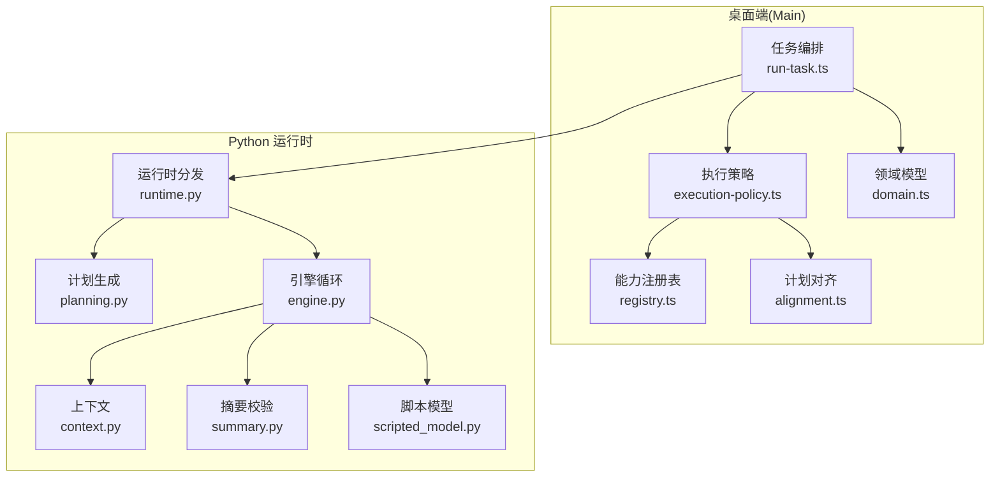
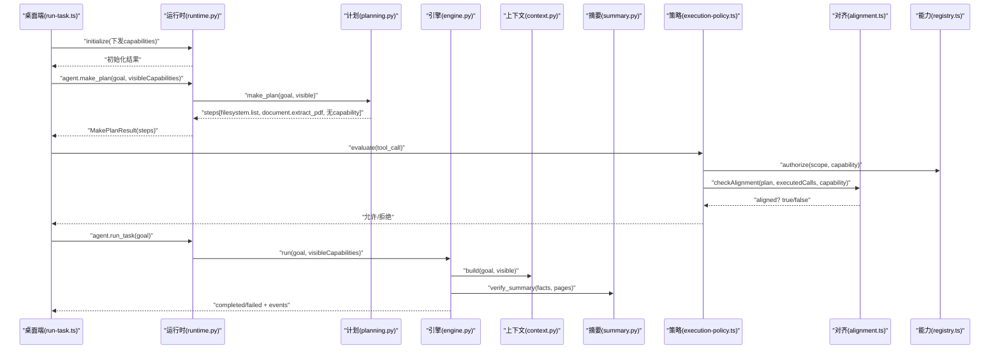
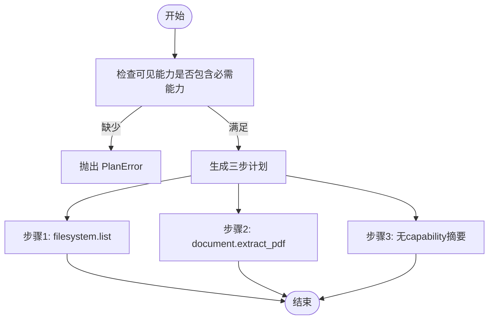
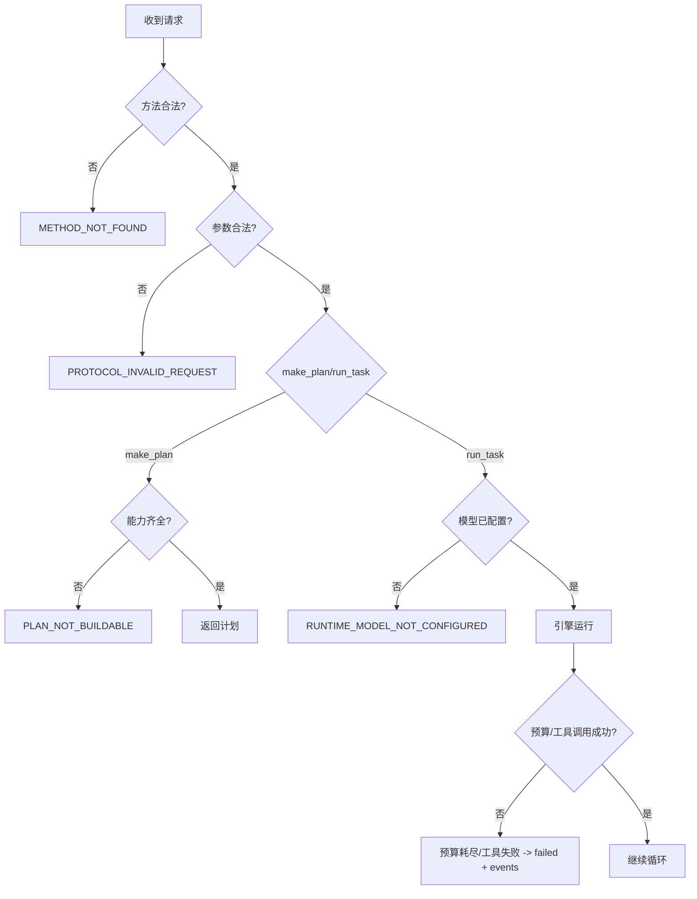
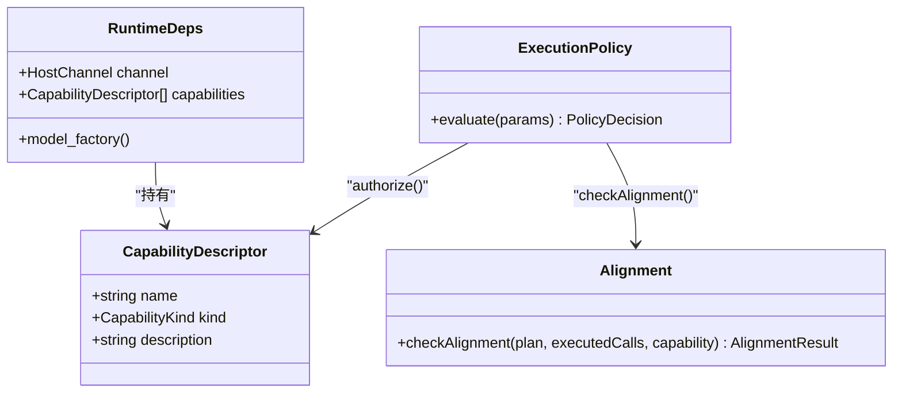
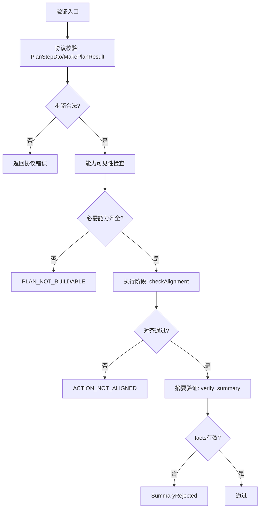
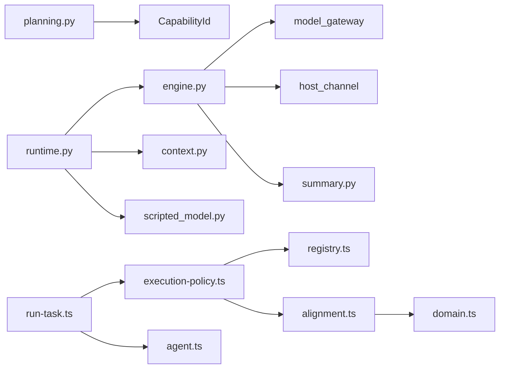

# 规划系统

<cite>
**本文引用的文件**
- [planning.py](file://services/agent-runtime/src/personal_agent/planning.py)
- [runtime.py](file://services/agent-runtime/src/personal_agent/runtime.py)
- [engine.py](file://services/agent-runtime/src/personal_agent/engine.py)
- [context.py](file://services/agent-runtime/src/personal_agent/context.py)
- [scripted_model.py](file://services/agent-runtime/src/personal_agent/scripted_model.py)
- [summary.py](file://services/agent-runtime/src/personal_agent/summary.py)
- [agent.ts](file://packages/protocol/schemas/agent.ts)
- [errors.ts](file://packages/protocol/schemas/errors.ts)
- [registry.ts](file://apps/desktop/src/main/capabilities/registry.ts)
- [execution-policy.ts](file://apps/desktop/src/main/policy/execution-policy.ts)
- [alignment.ts](file://apps/desktop/src/main/policy/alignment.ts)
- [domain.ts](file://apps/desktop/src/shared/domain.ts)
- [run-task.ts](file://apps/desktop/src/main/tasks/run-task.ts)
</cite>

## 目录
1. [简介](#简介)
2. [项目结构](#项目结构)
3. [核心组件](#核心组件)
4. [架构总览](#架构总览)
5. [详细组件分析](#详细组件分析)
6. [依赖关系分析](#依赖关系分析)
7. [性能考量](#性能考量)
8. [故障排查指南](#故障排查指南)
9. [结论](#结论)
10. [附录：扩展指南](#附录扩展指南)

## 简介
本规划系统为个人代理提供“目标到步骤”的确定性计划生成、执行顺序约束与校验、异常分类与恢复、能力依赖检查、计划验证与优化策略，以及动态重规划与扩展点。系统由 Python 运行时（Agent Runtime）与桌面端（Main）协作完成：Python 侧负责计划生成与任务执行循环；桌面端负责能力注册、权限审批、计划对齐校验与事件持久化。

## 项目结构
- Python 运行时
  - planning.py：计划生成与 PlanError 定义
  - runtime.py：协议分发、make_plan/run_task 处理、错误码与能力可见性传递
  - engine.py：Agent 主循环、预算控制、工具调用与事件输出
  - context.py：观察历史与上下文构建、字符串截断
  - scripted_model.py：脚本化模型（测试用），按固定序列产出决策
  - summary.py：摘要事实校验（页码引用有效性）
- 协议与类型
  - packages/protocol/schemas/agent.ts：计划与任务请求/响应契约、事件结构
  - packages/protocol/schemas/errors.ts：错误码常量
- 桌面端
  - apps/desktop/src/main/capabilities/registry.ts：能力清单与查询
  - apps/desktop/src/main/policy/execution-policy.ts：八级执行策略管道（含计划对齐）
  - apps/desktop/src/main/policy/alignment.ts：计划对齐检查（执行顺序与能力匹配）
  - apps/desktop/src/shared/domain.ts：领域模型（PlanStep、Task 状态等）
  - apps/desktop/src/main/tasks/run-task.ts：任务编排、超时与错误映射

**图表来源**
- [runtime.py:69-184](file://services/agent-runtime/src/personal_agent/runtime.py#L69-L184)
- [planning.py:12-44](file://services/agent-runtime/src/personal_agent/planning.py#L12-L44)
- [engine.py:85-238](file://services/agent-runtime/src/personal_agent/engine.py#L85-L238)
- [execution-policy.ts:82-147](file://apps/desktop/src/main/policy/execution-policy.ts#L82-L147)
- [alignment.ts:24-44](file://apps/desktop/src/main/policy/alignment.ts#L24-L44)
- [registry.ts:9-40](file://apps/desktop/src/main/capabilities/registry.ts#L9-L40)
- [domain.ts:30-42](file://apps/desktop/src/shared/domain.ts#L30-L42)

**章节来源**
- [runtime.py:69-184](file://services/agent-runtime/src/personal_agent/runtime.py#L69-L184)
- [agent.ts:7-24](file://packages/protocol/schemas/agent.ts#L7-L24)
- [registry.ts:9-40](file://apps/desktop/src/main/capabilities/registry.ts#L9-L40)
- [execution-policy.ts:82-147](file://apps/desktop/src/main/policy/execution-policy.ts#L82-L147)
- [alignment.ts:24-44](file://apps/desktop/src/main/policy/alignment.ts#L24-L44)
- [domain.ts:30-42](file://apps/desktop/src/shared/domain.ts#L30-L42)

## 核心组件
- 计划生成器：根据目标与可见能力生成有序三步计划，并强制要求关键能力可用。
- 运行时分发器：解析协议请求，维护能力可见性，调用计划生成与任务执行。
- Agent 引擎：带预算控制的执行循环，决定下一步是工具调用还是总结，并记录事件。
- 上下文管理器：收集观察结果，按需截断长文本，组装模型输入上下文。
- 摘要校验器：确保总结事实包含有效页码引用，且可追溯到实际提取的页面。
- 执行策略与对齐：在桌面端对每次工具调用进行八级校验，包括计划对齐、参数绑定、风险与权限审批。
- 协议与错误码：TS 与 Python 共享的数据结构与错误码约定，保证两端一致性。

**章节来源**
- [planning.py:12-44](file://services/agent-runtime/src/personal_agent/planning.py#L12-L44)
- [runtime.py:128-184](file://services/agent-runtime/src/personal_agent/runtime.py#L128-L184)
- [engine.py:85-238](file://services/agent-runtime/src/personal_agent/engine.py#L85-L238)
- [context.py:45-79](file://services/agent-runtime/src/personal_agent/context.py#L45-L79)
- [summary.py:20-85](file://services/agent-runtime/src/personal_agent/summary.py#L20-L85)
- [execution-policy.ts:82-147](file://apps/desktop/src/main/policy/execution-policy.ts#L82-L147)
- [alignment.ts:24-44](file://apps/desktop/src/main/policy/alignment.ts#L24-L44)
- [agent.ts:7-24](file://packages/protocol/schemas/agent.ts#L7-L24)
- [errors.ts:1-30](file://packages/protocol/schemas/errors.ts#L1-L30)

## 架构总览
下图展示了从用户目标到计划生成、再到执行与校验的整体流程，涵盖 Python 运行时与桌面端的交互。

**图表来源**
- [runtime.py:109-184](file://services/agent-runtime/src/personal_agent/runtime.py#L109-L184)
- [planning.py:25-44](file://services/agent-runtime/src/personal_agent/planning.py#L25-L44)
- [engine.py:98-238](file://services/agent-runtime/src/personal_agent/engine.py#L98-L238)
- [context.py:62-79](file://services/agent-runtime/src/personal_agent/context.py#L62-L79)
- [summary.py:55-85](file://services/agent-runtime/src/personal_agent/summary.py#L55-L85)
- [execution-policy.ts:82-147](file://apps/desktop/src/main/policy/execution-policy.ts#L82-L147)
- [alignment.ts:24-44](file://apps/desktop/src/main/policy/alignment.ts#L24-L44)
- [registry.ts:44-55](file://apps/desktop/src/main/capabilities/registry.ts#L44-L55)

## 详细组件分析

### 计划生成算法（目标分解、步骤生成、执行顺序）
- 目标分解：当前实现为确定性三步计划，分别对应“列出 PDF”、“提取 PDF 每页文本”、“基于内容生成带页码引用的摘要”。
- 步骤生成：通过 make_plan 返回有序的 PlanStep 列表，前两步绑定具体能力，最后一步不绑定能力（由模型自行产出摘要）。
- 执行顺序确定：计划顺序即执行顺序，桌面端通过 ActionAlignment 严格比对第 i 次工具调用与第 i 个带 capability 的步骤。

**图表来源**
- [planning.py:25-44](file://services/agent-runtime/src/personal_agent/planning.py#L25-L44)

**章节来源**
- [planning.py:12-44](file://services/agent-runtime/src/personal_agent/planning.py#L12-L44)
- [alignment.ts:24-44](file://apps/desktop/src/main/policy/alignment.ts#L24-L44)
- [agent.ts:15-24](file://packages/protocol/schemas/agent.ts#L15-L24)

### PlanError 异常处理机制（失败原因分类与恢复策略）
- 失败原因分类
  - PLAN_NOT_BUILDABLE：握手下发的能力清单缺失计划所需能力（如 filesystem.list 或 document.extract_pdf）。
  - RUNTIME_MODEL_NOT_CONFIGURED：未配置模型，无法执行任务。
  - PROTOCOL_INVALID_REQUEST：请求不符合协议契约。
  - METHOD_NOT_FOUND：未知方法。
  - CAPABILITY_NOT_REGISTERED：模型请求了不在协议枚举内的 capability。
- 恢复策略
  - 计划阶段：若能力不足，返回 PLAN_NOT_BUILDABLE，提示补充能力或调整目标。
  - 执行阶段：若预算耗尽或工具调用失败，统一走 _fail 路径，附带事件与原因。
  - 协议层：非法请求直接返回错误码，避免进入业务逻辑。

**图表来源**
- [runtime.py:69-184](file://services/agent-runtime/src/personal_agent/runtime.py#L69-L184)
- [engine.py:98-238](file://services/agent-runtime/src/personal_agent/engine.py#L98-L238)
- [errors.ts:1-30](file://packages/protocol/schemas/errors.ts#L1-L30)

**章节来源**
- [runtime.py:69-184](file://services/agent-runtime/src/personal_agent/runtime.py#L69-L184)
- [engine.py:98-238](file://services/agent-runtime/src/personal_agent/engine.py#L98-L238)
- [errors.ts:1-30](file://packages/protocol/schemas/errors.ts#L1-L30)

### 能力依赖分析（工具可用性检查与依赖关系解析）
- 能力清单：桌面端 registry.ts 定义可用能力及其种类（READ/WRITE）。
- 可见能力传递：initialize 时 Main 将能力清单下发给 Python 运行时，运行时将其转为名称列表传给 make_plan 与 engine.run。
- 可用性检查：
  - 计划阶段：make_plan 检查必需能力是否在 visibleCapabilities 中。
  - 执行阶段：execution-policy.ts 先 authorize(scope, capability)，再 checkAlignment 校验计划顺序。
- 依赖关系解析：当前计划为固定三步，依赖关系显式体现在步骤顺序与能力绑定上。

**图表来源**
- [registry.ts:9-40](file://apps/desktop/src/main/capabilities/registry.ts#L9-L40)
- [runtime.py:49-63](file://services/agent-runtime/src/personal_agent/runtime.py#L49-L63)
- [execution-policy.ts:82-147](file://apps/desktop/src/main/policy/execution-policy.ts#L82-L147)
- [alignment.ts:24-44](file://apps/desktop/src/main/policy/alignment.ts#L24-L44)

**章节来源**
- [registry.ts:9-40](file://apps/desktop/src/main/capabilities/registry.ts#L9-L40)
- [runtime.py:109-145](file://services/agent-runtime/src/personal_agent/runtime.py#L109-L145)
- [execution-policy.ts:82-147](file://apps/desktop/src/main/policy/execution-policy.ts#L82-L147)
- [alignment.ts:24-44](file://apps/desktop/src/main/policy/alignment.ts#L24-L44)

### 计划验证机制（步骤合法性检查与约束条件验证）
- 步骤合法性：
  - 协议层：PlanStepDto 要求 description 非空，capability 可选但必须为枚举值。
  - 计划结果：MakePlanResult 要求 steps 至少一项，防止空计划导致对齐基准缺失。
- 约束条件验证：
  - 能力可见性：make_plan 强制检查必需能力。
  - 计划对齐：桌面端 checkAlignment 确保第 i 次 tool call 与第 i 个带 capability 的步骤一致。
  - 摘要事实：summary.verify_summary 要求每条 fact 有有效 pageRefs，且引用必须在本次提取到的页面集合内。

**图表来源**
- [agent.ts:15-24](file://packages/protocol/schemas/agent.ts#L15-L24)
- [planning.py:25-44](file://services/agent-runtime/src/personal_agent/planning.py#L25-L44)
- [execution-policy.ts:82-147](file://apps/desktop/src/main/policy/execution-policy.ts#L82-L147)
- [alignment.ts:24-44](file://apps/desktop/src/main/policy/alignment.ts#L24-L44)
- [summary.py:55-85](file://services/agent-runtime/src/personal_agent/summary.py#L55-L85)

**章节来源**
- [agent.ts:15-24](file://packages/protocol/schemas/agent.ts#L15-L24)
- [planning.py:25-44](file://services/agent-runtime/src/personal_agent/planning.py#L25-L44)
- [execution-policy.ts:82-147](file://apps/desktop/src/main/policy/execution-policy.ts#L82-L147)
- [alignment.ts:24-44](file://apps/desktop/src/main/policy/alignment.ts#L24-L44)
- [summary.py:55-85](file://services/agent-runtime/src/personal_agent/summary.py#L55-L85)

### 计划优化策略（并行执行机会识别与资源利用率优化）
- 当前实现为串行三步计划，未实现自动并行化。
- 可扩展点：
  - 步骤间依赖图：若某步骤不依赖其他步骤的结果，可标记为可并行。
  - 资源池与限流：为工具调用引入并发度限制与重试策略。
  - 预算感知：结合 Budget.maxSteps 与 maxToolCalls 动态调整并行度。
- 注意：并行化需保持计划对齐语义，避免打乱执行序号与校验基准。

[本节为概念性讨论，不直接分析具体文件]

### 计划调整机制（动态重规划与异常情况下的计划修正）
- 动态重规划：当前 make_plan 为确定性三步，未实现运行时重规划。可在异常分支（如工具失败、摘要被拒）触发重新生成计划。
- 异常修正：
  - 工具失败：engine._execute 捕获 HostRequestFailed/HostChannelClosed，统一走 _fail 返回失败事件。
  - 摘要被拒：summary.SummaryRejected 携带原因，engine 直接返回失败。
  - 预算耗尽：engine 在每步开始前检查预算，超限则返回失败事件。
- 建议：在失败路径中加入“重试/替换步骤”的策略，例如更换工具或调整参数后重新生成计划。

**章节来源**
- [engine.py:98-238](file://services/agent-runtime/src/personal_agent/engine.py#L98-L238)
- [summary.py:20-85](file://services/agent-runtime/src/personal_agent/summary.py#L20-L85)
- [runtime.py:128-184](file://services/agent-runtime/src/personal_agent/runtime.py#L128-L184)

### 扩展指南（添加新规划规则与约束条件）
- 新增能力
  - 在 registry.ts 中添加 CapabilityDescriptor。
  - 在 protocol schemas 中更新 CapabilityId 枚举（若需要）。
  - 在 execution-policy.ts 的 authorize 中确保新能力可被授权。
- 新增计划步骤
  - 修改 planning.py 的 make_plan，增加步骤与能力绑定。
  - 更新协议 schema（若步骤结构变化）。
  - 确保桌面端 plan 存储与对齐逻辑兼容。
- 新增约束条件
  - 在 alignment.ts 中增强 checkAlignment 逻辑。
  - 在 execution-policy.ts 中增加新的校验阶段。
  - 在 summary.py 中扩展摘要事实的验证规则。
- 新增错误码
  - 在 errors.ts 中登记新错误码。
  - 在 runtime.py 中映射 Python 内部错误到协议错误码。

**章节来源**
- [registry.ts:9-40](file://apps/desktop/src/main/capabilities/registry.ts#L9-L40)
- [agent.ts:15-24](file://packages/protocol/schemas/agent.ts#L15-L24)
- [execution-policy.ts:82-147](file://apps/desktop/src/main/policy/execution-policy.ts#L82-L147)
- [planning.py:25-44](file://services/agent-runtime/src/personal_agent/planning.py#L25-L44)
- [alignment.ts:24-44](file://apps/desktop/src/main/policy/alignment.ts#L24-L44)
- [summary.py:55-85](file://services/agent-runtime/src/personal_agent/summary.py#L55-L85)
- [errors.ts:1-30](file://packages/protocol/schemas/errors.ts#L1-L30)

## 依赖关系分析
- Python 运行时依赖
  - planning.py 依赖协议中的 CapabilityId。
  - runtime.py 依赖 engine、context、planning、scripted_model。
  - engine.py 依赖 model_gateway、host_channel、context、summary。
  - context.py 依赖 model_gateway 的 Observation 与 ModelContext。
  - summary.py 依赖 protocol models 的 SummaryFact。
- 桌面端依赖
  - execution-policy.ts 依赖 registry、alignment、argument-binders、risk、task-context。
  - alignment.ts 依赖 shared domain 的 PlanStep。
  - run-task.ts 依赖 protocol schemas、policy、product-state 仓库。

**图表来源**
- [planning.py:9-10](file://services/agent-runtime/src/personal_agent/planning.py#L9-L10)
- [runtime.py:10-29](file://services/agent-runtime/src/personal_agent/runtime.py#L10-L29)
- [engine.py:16-42](file://services/agent-runtime/src/personal_agent/engine.py#L16-L42)
- [context.py:12-13](file://services/agent-runtime/src/personal_agent/context.py#L12-L13)
- [summary.py:14-15](file://services/agent-runtime/src/personal_agent/summary.py#L14-L15)
- [execution-policy.ts:1-13](file://apps/desktop/src/main/policy/execution-policy.ts#L1-L13)
- [alignment.ts:1-4](file://apps/desktop/src/main/policy/alignment.ts#L1-L4)
- [domain.ts:30-42](file://apps/desktop/src/shared/domain.ts#L30-L42)
- [run-task.ts:1-18](file://apps/desktop/src/main/tasks/run-task.ts#L1-L18)
- [agent.ts:1-24](file://packages/protocol/schemas/agent.ts#L1-L24)

**章节来源**
- [runtime.py:10-29](file://services/agent-runtime/src/personal_agent/runtime.py#L10-L29)
- [engine.py:16-42](file://services/agent-runtime/src/personal_agent/engine.py#L16-L42)
- [execution-policy.ts:1-13](file://apps/desktop/src/main/policy/execution-policy.ts#L1-L13)
- [agent.ts:1-24](file://packages/protocol/schemas/agent.ts#L1-L24)

## 性能考量
- 预算控制：engine 使用 Budget.maxSteps 与 maxToolCalls 限制执行长度，避免无限循环。
- 上下文截断：context.py 对 observation payload 中的 text/reason 字段进行截断，防止上下文过大。
- 超时管理：run-task.ts 设置 MAKE_PLAN_TIMEOUT_MS 与 RUN_TASK_TIMEOUT_MS，确保快速失败与资源释放。
- 日志级别：runtime.py 支持通过环境变量调整日志级别，便于生产环境调优。

**章节来源**
- [engine.py:76-83](file://services/agent-runtime/src/personal_agent/engine.py#L76-L83)
- [context.py:14-24](file://services/agent-runtime/src/personal_agent/context.py#L14-L24)
- [run-task.ts:20-23](file://apps/desktop/src/main/tasks/run-task.ts#L20-L23)
- [runtime.py:193-202](file://services/agent-runtime/src/personal_agent/runtime.py#L193-L202)

## 故障排查指南
- 计划构建失败
  - 现象：返回 PLAN_NOT_BUILDABLE。
  - 排查：检查 initialize 下发的 capabilities 是否包含 filesystem.list 与 document.extract_pdf。
- 模型未配置
  - 现象：返回 RUNTIME_MODEL_NOT_CONFIGURED。
  - 排查：确认环境变量 PERSONAL_AGENT_SCRIPT 指向有效的脚本文件。
- 计划对齐失败
  - 现象：返回 ACTION_NOT_ALIGNED。
  - 排查：检查桌面端 checkAlignment 的 executedCalls 计数是否与计划步骤一致。
- 摘要验证失败
  - 现象：返回 SummaryRejected。
  - 排查：确认 facts 中的 pageRefs 是否为正整数且在本次提取的页面集合中。
- 工具调用失败
  - 现象：返回 failed 事件，reason 包含具体错误。
  - 排查：检查 host 工具返回值与错误码，确认权限与路径是否合法。

**章节来源**
- [runtime.py:128-184](file://services/agent-runtime/src/personal_agent/runtime.py#L128-L184)
- [engine.py:98-238](file://services/agent-runtime/src/personal_agent/engine.py#L98-L238)
- [alignment.ts:24-44](file://apps/desktop/src/main/policy/alignment.ts#L24-L44)
- [summary.py:55-85](file://services/agent-runtime/src/personal_agent/summary.py#L55-L85)
- [errors.ts:1-30](file://packages/protocol/schemas/errors.ts#L1-L30)

## 结论
本规划系统以确定性三步计划为核心，结合严格的协议校验、能力依赖检查与计划对齐机制，确保任务执行的正确性与可追溯性。通过预算控制、超时管理与错误分类，系统在稳定性与可维护性方面具备良好基础。未来可扩展并行执行、动态重规划与更丰富的约束条件，以提升灵活性与效率。

## 附录：扩展指南
- 添加新能力
  - 在 registry.ts 中注册新能力描述。
  - 更新 protocol schemas 中的 CapabilityId。
  - 在 execution-policy.ts 中确保新能力可被授权与对齐。
- 添加新计划步骤
  - 修改 planning.py 的 make_plan，增加步骤与能力绑定。
  - 更新协议 schema 与桌面端领域模型（如需）。
  - 确保计划存储与对齐逻辑兼容新步骤。
- 添加新约束条件
  - 在 alignment.ts 中增强 checkAlignment 逻辑。
  - 在 execution-policy.ts 中增加新的校验阶段。
  - 在 summary.py 中扩展摘要事实的验证规则。
- 添加新错误码
  - 在 errors.ts 中登记新错误码。
  - 在 runtime.py 中映射 Python 内部错误到协议错误码。
  - 在桌面端错误处理中适配新错误码。

**章节来源**
- [registry.ts:9-40](file://apps/desktop/src/main/capabilities/registry.ts#L9-L40)
- [agent.ts:15-24](file://packages/protocol/schemas/agent.ts#L15-L24)
- [execution-policy.ts:82-147](file://apps/desktop/src/main/policy/execution-policy.ts#L82-L147)
- [planning.py:25-44](file://services/agent-runtime/src/personal_agent/planning.py#L25-L44)
- [alignment.ts:24-44](file://apps/desktop/src/main/policy/alignment.ts#L24-L44)
- [summary.py:55-85](file://services/agent-runtime/src/personal_agent/summary.py#L55-L85)
- [errors.ts:1-30](file://packages/protocol/schemas/errors.ts#L1-L30)