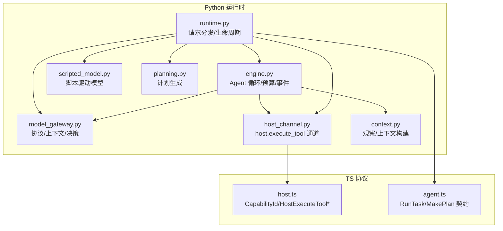
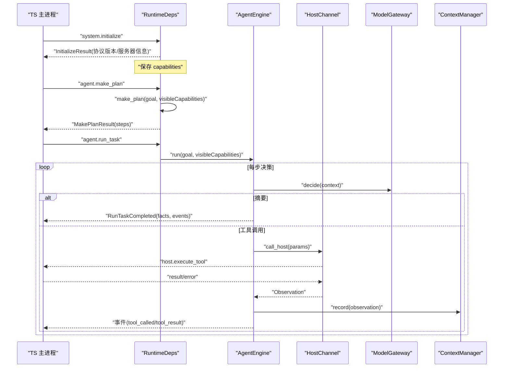
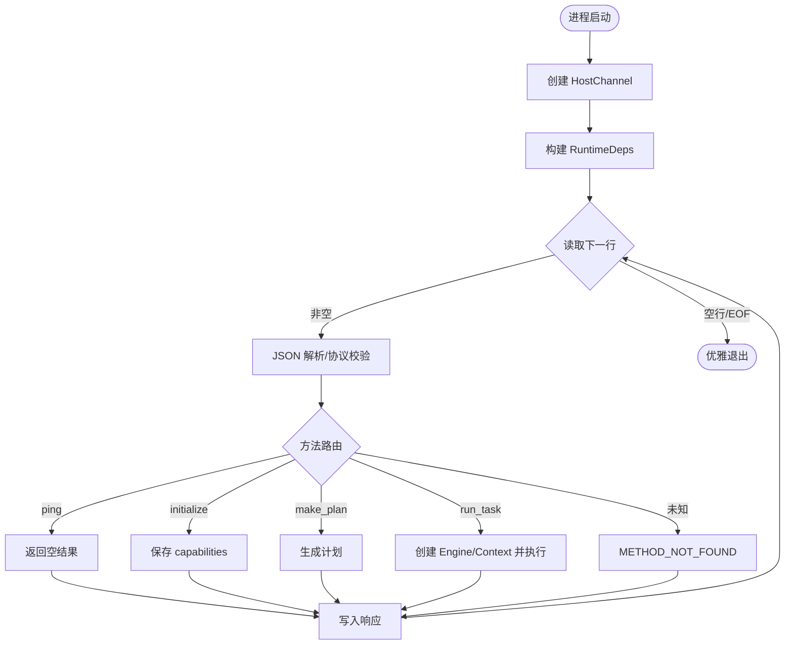
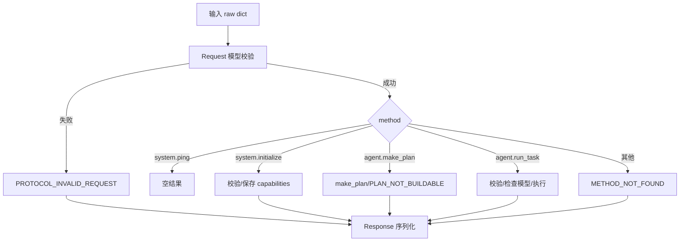
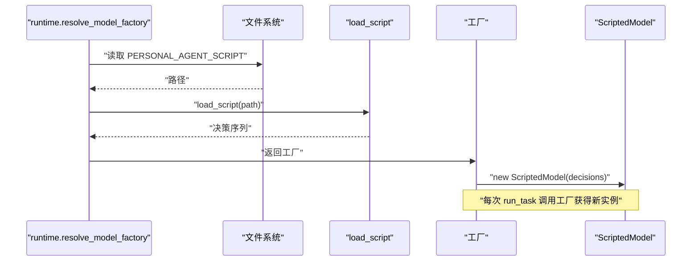
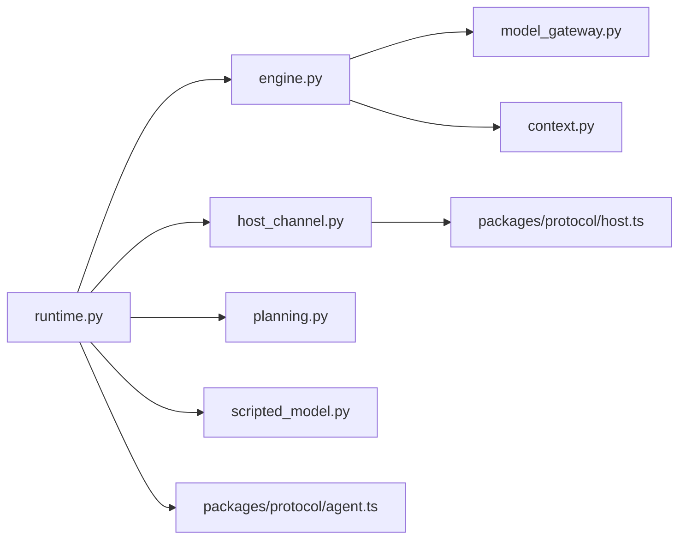

# 运行时引擎

<cite>
**本文引用的文件**
- [runtime.py](file://services/agent-runtime/src/personal_agent/runtime.py)
- [engine.py](file://services/agent-runtime/src/personal_agent/engine.py)
- [scripted_model.py](file://services/agent-runtime/src/personal_agent/scripted_model.py)
- [model_gateway.py](file://services/agent-runtime/src/personal_agent/model_gateway.py)
- [host_channel.py](file://services/agent-runtime/src/personal_agent/host_channel.py)
- [context.py](file://services/agent-runtime/src/personal_agent/context.py)
- [planning.py](file://services/agent-runtime/src/personal_agent/planning.py)
- [__main__.py](file://services/agent-runtime/src/personal_agent/__main__.py)
- [host.ts](file://packages/protocol/schemas/host.ts)
- [agent.ts](file://packages/protocol/schemas/agent.ts)
- [test_runtime.py](file://services/agent-runtime/tests/test_runtime.py)
- [test_scripted_model.py](file://services/agent-runtime/tests/test_scripted_model.py)
</cite>

## 目录
1. [简介](#简介)
2. [项目结构](#项目结构)
3. [核心组件](#核心组件)
4. [架构总览](#架构总览)
5. [详细组件分析](#详细组件分析)
6. [依赖关系分析](#依赖关系分析)
7. [性能考量](#性能考量)
8. [故障排查指南](#故障排查指南)
9. [结论](#结论)
10. [附录：扩展示例与配置清单](#附录：扩展示例与配置清单)

## 简介
本仓库的 Python 运行时引擎负责以 JSON-RPC over stdio 的方式，接收来自主进程（Electron Main）的请求，完成计划生成、任务执行、工具调用与结果汇总。其设计要点包括：
- 通过 RuntimeDeps 管理 channel、模型工厂与能力清单，确保跨任务隔离与可测试性。
- 使用 AgentEngine 实现最小 Agent Loop，包含预算控制、事件上报与错误收敛。
- 通过 ModelGateway 抽象模型决策，默认提供 ScriptedModel 基于脚本文件的确定性执行路径。
- 通过 HostChannel 封装与宿主（TS 侧）的工具调用协议，处理响应匹配、异常与关闭。
- 通过 ContextManager 维护观察历史并裁剪字符串大小，避免上下文膨胀。
- 通过 planning 模块生成确定性三步计划，并在握手阶段校验可见能力。

## 项目结构
Python 运行时位于 services/agent-runtime/src/personal_agent，核心文件职责如下：
- runtime.py：请求分发、生命周期入口、环境变量装配、能力存储。
- engine.py：Agent 循环、预算控制、事件构造、工具执行与失败统一处理。
- model_gateway.py：模型接口协议、上下文与决策类型定义。
- scripted_model.py：默认模型实现，按脚本顺序返回决策。
- host_channel.py：与 TS 侧的 host.execute_tool 通道，读写 stdin/stdout 并解析响应。
- context.py：观察记录与上下文构建，含字符串截断策略。
- planning.py：计划生成逻辑，依赖可见能力集合。
- __main__.py：命令行入口，启动运行时主循环。

图表来源
- [runtime.py:67-182](file://services/agent-runtime/src/personal_agent/runtime.py#L67-L182)
- [engine.py:76-195](file://services/agent-runtime/src/personal_agent/engine.py#L76-L195)
- [model_gateway.py:6-59](file://services/agent-runtime/src/personal_agent/model_gateway.py#L6-L59)
- [scripted_model.py:18-57](file://services/agent-runtime/src/personal_agent/scripted_model.py#L18-L57)
- [host_channel.py:36-91](file://services/agent-runtime/src/personal_agent/host_channel.py#L36-L91)
- [context.py:45-79](file://services/agent-runtime/src/personal_agent/context.py#L45-L79)
- [planning.py:25-45](file://services/agent-runtime/src/personal_agent/planning.py#L25-L45)
- [host.ts:7-76](file://packages/protocol/schemas/host.ts#L7-L76)
- [agent.ts:4-138](file://packages/protocol/schemas/agent.ts#L4-L138)

章节来源
- [runtime.py:1-245](file://services/agent-runtime/src/personal_agent/runtime.py#L1-L245)
- [engine.py:1-195](file://services/agent-runtime/src/personal_agent/engine.py#L1-L195)
- [model_gateway.py:1-59](file://services/agent-runtime/src/personal_agent/model_gateway.py#L1-L59)
- [scripted_model.py:1-57](file://services/agent-runtime/src/personal_agent/scripted_model.py#L1-L57)
- [host_channel.py:1-91](file://services/agent-runtime/src/personal_agent/host_channel.py#L1-L91)
- [context.py:1-79](file://services/agent-runtime/src/personal_agent/context.py#L1-L79)
- [planning.py:1-45](file://services/agent-runtime/src/personal_agent/planning.py#L1-L45)
- [host.ts:1-76](file://packages/protocol/schemas/host.ts#L1-L76)
- [agent.ts:1-138](file://packages/protocol/schemas/agent.ts#L1-L138)

## 核心组件
- RuntimeDeps：进程级依赖容器，持有 channel、model_factory 与 capabilities。每次 run_task 现场构造 Engine 与 ContextManager，避免状态泄漏。
- AgentEngine：单任务执行器，维护步骤与工具调用预算，产出事件流，统一失败路径。
- ModelGateway/ScriptedModel：模型抽象与默认实现，支持从脚本加载决策序列，游标逐条消费，耗尽抛错。
- HostChannel：封装 host.execute_tool 请求/响应匹配、非法 JSON 丢弃、EOF 检测与协议校验。
- ContextManager：记录观察，构建带截断的 ModelContext，限制字符串长度防止上下文爆炸。
- Planning：根据可见能力生成固定三步计划，缺能力时抛出 PlanError。

章节来源
- [runtime.py:47-61](file://services/agent-runtime/src/personal_agent/runtime.py#L47-L61)
- [engine.py:67-195](file://services/agent-runtime/src/personal_agent/engine.py#L67-L195)
- [model_gateway.py:6-59](file://services/agent-runtime/src/personal_agent/model_gateway.py#L6-L59)
- [scripted_model.py:18-57](file://services/agent-runtime/src/personal_agent/scripted_model.py#L18-L57)
- [host_channel.py:36-91](file://services/agent-runtime/src/personal_agent/host_channel.py#L36-L91)
- [context.py:45-79](file://services/agent-runtime/src/personal_agent/context.py#L45-L79)
- [planning.py:25-45](file://services/agent-runtime/src/personal_agent/planning.py#L25-L45)

## 架构总览
运行时以“请求-分发-执行”为主线：
- 主循环读取一行 JSON，解析为 Request，按 method 路由到 ping/initialize/make_plan/run_task。
- initialize 保存能力清单；make_plan 基于可见能力生成计划；run_task 创建 Engine 与 ContextManager，调用模型决策并执行工具。
- 工具调用通过 HostChannel 发送到 TS 侧，等待匹配的响应或捕获错误。
- 事件在 Engine 内集中构造，最终随 RunTaskCompleted/Failed 一并返回。

图表来源
- [runtime.py:67-182](file://services/agent-runtime/src/personal_agent/runtime.py#L67-L182)
- [engine.py:89-195](file://services/agent-runtime/src/personal_agent/engine.py#L89-L195)
- [host_channel.py:45-85](file://services/agent-runtime/src/personal_agent/host_channel.py#L45-L85)
- [planning.py:25-45](file://services/agent-runtime/src/personal_agent/planning.py#L25-L45)
- [agent.ts:4-138](file://packages/protocol/schemas/agent.ts#L4-L138)
- [host.ts:28-76](file://packages/protocol/schemas/host.ts#L28-L76)

## 详细组件分析

### RuntimeDeps 设计与能力管理
- 字段说明：
  - channel：与 TS 侧通信的 HostChannel，负责行级读写与消息匹配。
  - model_factory：可选工厂函数，每次 run_task 调用时创建新的模型实例，避免游标共享导致的状态污染。
  - capabilities：握手后保存的能力描述符列表，用于 make_plan 与 run_task 的可见能力传递。
- 生命周期：
  - 进程启动时 resolve_model_factory 读取 PERSONAL_AGENT_SCRIPT 环境变量，若存在则加载脚本并返回工厂；否则为 None。
  - handle_initialize 将参数中的 capabilities 存入 deps.capabilities，供后续流程使用。
  - handle_run_task 检查 deps.model_factory 是否存在，不存在则返回明确错误码 RUNTIME_MODEL_NOT_CONFIGURED。
- 关键约束：
  - 不在此处存放 engine 与 ContextManager，因为每个任务需要独立上下文与观察历史。
  - 存工厂而非实例，保证连续多次任务不会复用已耗尽的模型游标。

章节来源
- [runtime.py:47-61](file://services/agent-runtime/src/personal_agent/runtime.py#L47-L61)
- [runtime.py:107-123](file://services/agent-runtime/src/personal_agent/runtime.py#L107-L123)
- [runtime.py:156-182](file://services/agent-runtime/src/personal_agent/runtime.py#L156-L182)
- [runtime.py:206-223](file://services/agent-runtime/src/personal_agent/runtime.py#L206-L223)

### 运行时生命周期管理
- 进程启动：
  - __main__.py 调用 personal_agent.main（由 pyproject.scripts 暴露），实际入口为 runtime.run。
  - run 创建 HostChannel（默认绑定 stdin/stdout），组装 RuntimeDeps，进入主循环。
- 初始化流程：
  - system.initialize：验证 InitializeParams，保存 capabilities，返回 InitializeResult。
  - 未传入 deps 时仍返回正确结果，保持无状态直调兼容。
- 优雅关闭：
  - 主循环读取空行（EOF）即退出，避免忙等死循环。
  - 日志输出停止原因，便于诊断。

图表来源
- [__main__.py:1-5](file://services/agent-runtime/src/personal_agent/__main__.py#L1-L5)
- [runtime.py:226-245](file://services/agent-runtime/src/personal_agent/runtime.py#L226-L245)
- [runtime.py:67-104](file://services/agent-runtime/src/personal_agent/runtime.py#L67-L104)

章节来源
- [__main__.py:1-5](file://services/agent-runtime/src/personal_agent/__main__.py#L1-L5)
- [runtime.py:226-245](file://services/agent-runtime/src/personal_agent/runtime.py#L226-L245)

### 任务调度机制：请求分发、方法路由与错误处理
- 请求分发：
  - dispatch 接收已解析的 dict，使用 Request 模型校验，再按 method 路由。
  - 未知方法返回 METHOD_NOT_FOUND；无效 JSON 返回 PROTOCOL_INVALID_JSON。
- 方法路由：
  - system.ping：直接返回空结果。
  - system.initialize：校验参数并保存 capabilities。
  - agent.make_plan：基于可见能力生成计划，缺能力返回 PLAN_NOT_BUILDABLE。
  - agent.run_task：校验参数，检查模型配置，创建 Engine 与 ContextManager 执行。
- 错误处理策略：
  - 协议层：Pydantic 校验失败统一转为 PROTOCOL_INVALID_REQUEST。
  - 运行时内部：捕获未预期异常，返回 RUNTIME_INTERNAL，避免 traceback 泄露。
  - 主机通道：HostRequestFailed/HostChannelClosed 转换为失败事件与结果。

图表来源
- [runtime.py:67-104](file://services/agent-runtime/src/personal_agent/runtime.py#L67-L104)
- [runtime.py:107-182](file://services/agent-runtime/src/personal_agent/runtime.py#L107-L182)

章节来源
- [runtime.py:67-182](file://services/agent-runtime/src/personal_agent/runtime.py#L67-L182)

### 脚本模型加载机制与 PERSONAL_AGENT_SCRIPT
- 环境变量：
  - PERSONAL_AGENT_SCRIPT：指定脚本文件路径，默认不配置；设置后才启用模型。
- 加载流程：
  - resolve_model_factory 读取环境变量，调用 load_script 解析 JSON 为决策序列。
  - 若脚本不可用（文件缺失、JSON 非法、不符合契约），返回 None，进程仍可启动，但 run_task 会返回 RUNTIME_MODEL_NOT_CONFIGURED。
- ScriptedModel 集成：
  - 工厂每次调用返回新实例，游标独立，支持连续多次任务。
  - decide 按序返回决策，耗尽后抛出 ScriptExhausted，Engine 捕获并转为失败。

图表来源
- [runtime.py:206-223](file://services/agent-runtime/src/personal_agent/runtime.py#L206-L223)
- [scripted_model.py:39-57](file://services/agent-runtime/src/personal_agent/scripted_model.py#L39-L57)

章节来源
- [runtime.py:206-223](file://services/agent-runtime/src/personal_agent/runtime.py#L206-L223)
- [scripted_model.py:18-57](file://services/agent-runtime/src/personal_agent/scripted_model.py#L18-L57)

### 运行时配置选项与环境变量
- PERSONAL_AGENT_LOG_LEVEL：控制日志级别，默认 INFO。
- PERSONAL_AGENT_SCRIPT：启用脚本模型的路径。
- 其他：
  - 协议版本与服务器信息在 InitializeResult 中固定。
  - 能力清单由 TS 侧下发，Python 侧仅存储与透传。

章节来源
- [runtime.py:191-203](file://services/agent-runtime/src/personal_agent/runtime.py#L191-L203)
- [runtime.py:30-44](file://services/agent-runtime/src/personal_agent/runtime.py#L30-L44)

## 依赖关系分析
- 模块耦合：
  - runtime.py 依赖 engine、host_channel、model_gateway、planning、scripted_model。
  - engine.py 依赖 model_gateway、host_channel、context、summary。
  - host_channel.py 依赖 protocol 的 HostExecuteTool 相关类型。
  - scripting_model.py 依赖 model_gateway 的类型与 Pydantic 适配器。
- 外部依赖：
  - packages/protocol 的 TS schema 定义了 CapabilityId、HostExecuteTool*、RunTask* 等契约，Python 侧通过 Pydantic 镜像与 fixtures 对齐。
- 潜在循环：
  - 当前依赖方向清晰，无循环导入迹象。
- 接口契约：
  - ModelGateway 为 Protocol，ScriptedModel 实现该接口，便于替换与扩展。

图表来源
- [runtime.py:10-28](file://services/agent-runtime/src/personal_agent/runtime.py#L10-L28)
- [engine.py:16-40](file://services/agent-runtime/src/personal_agent/engine.py#L16-L40)
- [host_channel.py:8-13](file://services/agent-runtime/src/personal_agent/host_channel.py#L8-L13)
- [host.ts:7-76](file://packages/protocol/schemas/host.ts#L7-L76)
- [agent.ts:4-138](file://packages/protocol/schemas/agent.ts#L4-L138)

章节来源
- [runtime.py:10-28](file://services/agent-runtime/src/personal_agent/runtime.py#L10-L28)
- [engine.py:16-40](file://services/agent-runtime/src/personal_agent/engine.py#L16-L40)
- [host_channel.py:8-13](file://services/agent-runtime/src/personal_agent/host_channel.py#L8-L13)
- [host.ts:7-76](file://packages/protocol/schemas/host.ts#L7-L76)
- [agent.ts:4-138](file://packages/protocol/schemas/agent.ts#L4-L138)

## 性能考量
- 预算控制：
  - AgentEngine 内置 maxSteps 与 maxToolCalls，防止无限循环与资源耗尽。
- 上下文裁剪：
  - ContextManager 对 payload 中的 text/reason 进行长度截断，避免单次观察过大导致上下文膨胀。
- 模型实例化：
  - 每次 run_task 通过工厂创建新模型实例，避免游标共享导致的重复消费与状态泄漏。
- I/O 效率：
  - HostChannel 使用队列缓存非匹配行，减少阻塞；EOF 及时退出避免忙等。

[本节为通用指导，不直接分析具体文件]

## 故障排查指南
- 常见错误码：
  - PROTOCOL_INVALID_REQUEST：参数不符合契约或协议版本不匹配。
  - PROTOCOL_INVALID_JSON：无法解析 JSON。
  - METHOD_NOT_FOUND：未知方法。
  - RUNTIME_MODEL_NOT_CONFIGURED：未配置模型（未设置 PERSONAL_AGENT_SCRIPT）。
  - PLAN_NOT_BUILDABLE：计划所需能力不在可见清单。
  - RUNTIME_INTERNAL：未预期异常，需检查日志。
  - CAPABILITY_NOT_REGISTERED：模型请求了协议枚举外的 capability。
- 定位建议：
  - 查看 stderr 日志，确认 PERSONAL_AGENT_LOG_LEVEL 是否合适。
  - 检查 PERSONAL_AGENT_SCRIPT 指向的脚本是否为合法 JSON 且符合 ModelDecision 数组。
  - 核对 TS 侧下发的 capabilities 是否包含计划所需能力。
  - 检查 HostChannel 是否收到 EOF 或非法 JSON，确认 TS 侧进程状态。

章节来源
- [runtime.py:63-91](file://services/agent-runtime/src/personal_agent/runtime.py#L63-L91)
- [runtime.py:126-153](file://services/agent-runtime/src/personal_agent/runtime.py#L126-L153)
- [engine.py:148-195](file://services/agent-runtime/src/personal_agent/engine.py#L148-L195)
- [host_channel.py:18-34](file://services/agent-runtime/src/personal_agent/host_channel.py#L18-L34)

## 结论
该运行时引擎以清晰的职责划分与严格的契约校验，实现了稳定可靠的 Agent 执行环境。通过 RuntimeDeps 管理依赖、AgentEngine 控制流程、ModelGateway 抽象模型、HostChannel 对接宿主、ContextManager 管理上下文，整体具备高内聚、低耦合与易扩展的特性。配合脚本模型与能力清单，可在不修改代码的情况下调整执行路径，满足测试与演示需求。

[本节为总结，不直接分析具体文件]

## 附录：扩展示例与配置清单

### 扩展自定义模型工厂
- 目标：实现一个自定义模型，替代 ScriptedModel，例如基于真实 LLM 的适配器。
- 步骤：
  - 实现 ModelGateway 协议，提供 decide(context) -> ModelDecision。
  - 在运行时环境中注入 model_factory，使其每次调用返回新实例。
  - 确保返回的决策符合 ToolCallDecision 或 SummaryDecision 的结构。
- 参考路径：
  - 模型接口定义：[model_gateway.py:53-59](file://services/agent-runtime/src/personal_agent/model_gateway.py#L53-L59)
  - 默认脚本模型实现：[scripted_model.py:18-37](file://services/agent-runtime/src/personal_agent/scripted_model.py#L18-L37)
  - 工厂装配位置：[runtime.py:206-223](file://services/agent-runtime/src/personal_agent/runtime.py#L206-L223)

章节来源
- [model_gateway.py:53-59](file://services/agent-runtime/src/personal_agent/model_gateway.py#L53-L59)
- [scripted_model.py:18-37](file://services/agent-runtime/src/personal_agent/scripted_model.py#L18-L37)
- [runtime.py:206-223](file://services/agent-runtime/src/personal_agent/runtime.py#L206-L223)

### 处理特殊任务类型
- 目标：在 Engine 中新增一种任务类型，例如“批量处理”。
- 步骤：
  - 在 protocol 中定义新的方法名与参数/结果契约（TS 侧）。
  - 在 runtime.dispatch 中添加路由分支，调用对应处理器。
  - 在 Engine 中扩展决策类型或事件类型，确保事件流一致。
  - 更新测试用例，覆盖新路径与错误分支。
- 参考路径：
  - 方法路由：[runtime.py:67-91](file://services/agent-runtime/src/personal_agent/runtime.py#L67-L91)
  - 事件构造：[engine.py:153-159](file://services/agent-runtime/src/personal_agent/engine.py#L153-L159)
  - 协议定义：[agent.ts:4-138](file://packages/protocol/schemas/agent.ts#L4-L138)

章节来源
- [runtime.py:67-91](file://services/agent-runtime/src/personal_agent/runtime.py#L67-L91)
- [engine.py:153-159](file://services/agent-runtime/src/personal_agent/engine.py#L153-L159)
- [agent.ts:4-138](file://packages/protocol/schemas/agent.ts#L4-L138)

### 配置清单与环境变量
- PERSONAL_AGENT_LOG_LEVEL：日志级别，默认 INFO。
- PERSONAL_AGENT_SCRIPT：脚本模型路径，可选。
- 能力清单：由 TS 侧在 initialize 中下发，Python 侧存储并透传。
- 协议版本：InitializeResult 中固定为 0.1。

章节来源
- [runtime.py:191-203](file://services/agent-runtime/src/personal_agent/runtime.py#L191-L203)
- [runtime.py:30-44](file://services/agent-runtime/src/personal_agent/runtime.py#L30-L44)

### 测试与验证参考
- 运行任务全流程测试：
  - 初始化、计划、任务执行、事件与结果校验。
  - 连续 20 次任务稳定性与事实一致性。
- 脚本模型行为测试：
  - 决策顺序、耗尽抛错、上下文记录、剩余计数。
- 参考路径：
  - 运行时测试：[test_runtime.py:161-605](file://services/agent-runtime/tests/test_runtime.py#L161-L605)
  - 脚本模型测试：[test_scripted_model.py:43-203](file://services/agent-runtime/tests/test_scripted_model.py#L43-L203)

章节来源
- [test_runtime.py:161-605](file://services/agent-runtime/tests/test_runtime.py#L161-L605)
- [test_scripted_model.py:43-203](file://services/agent-runtime/tests/test_scripted_model.py#L43-L203)