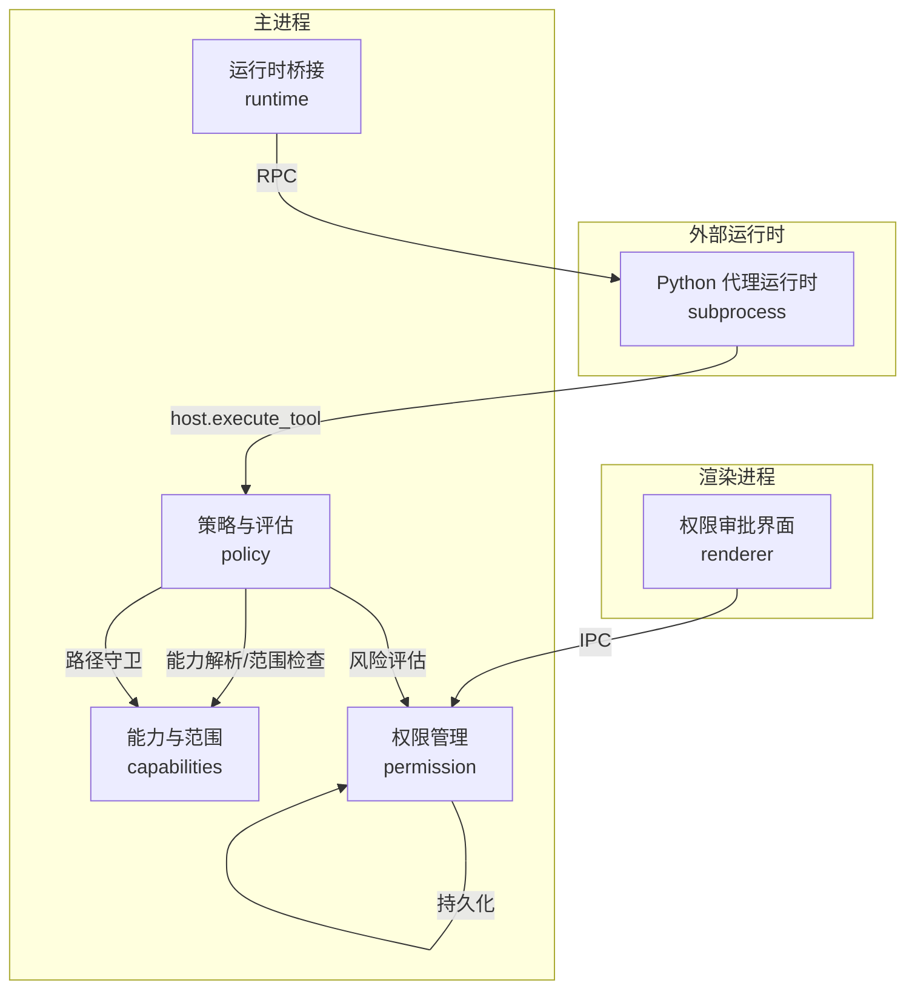
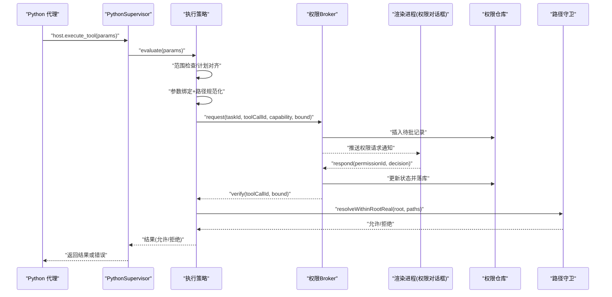
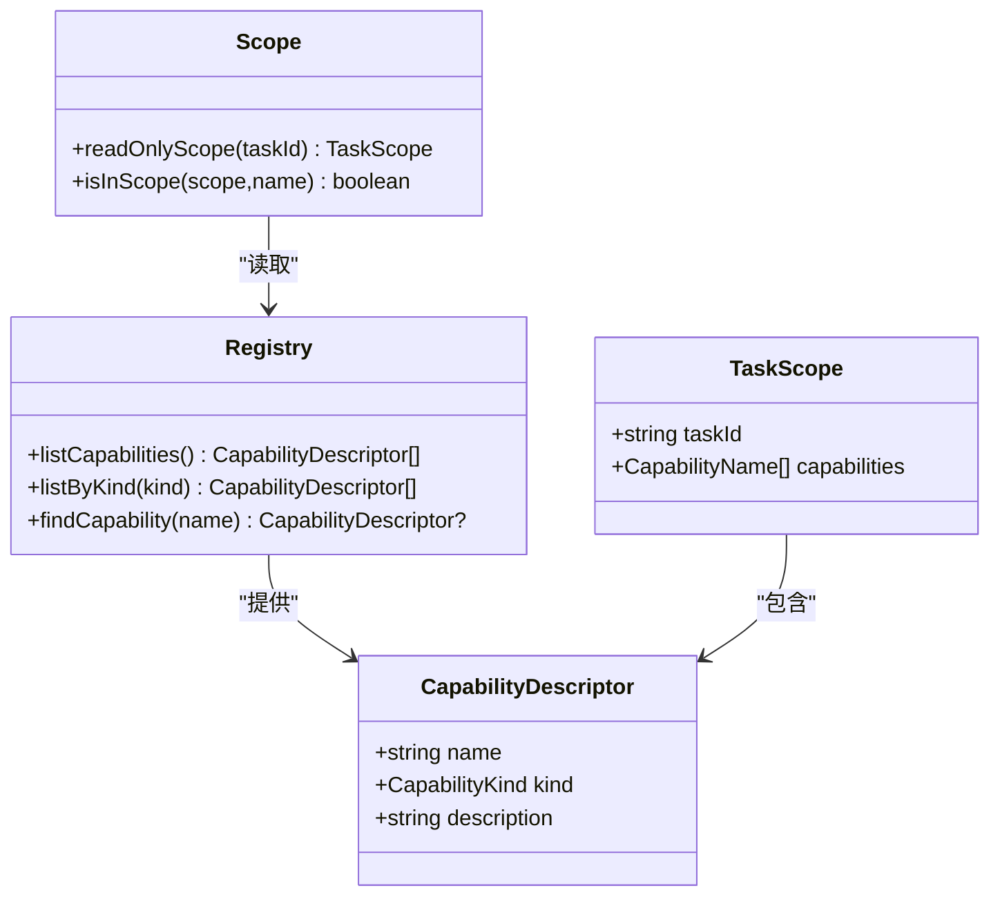
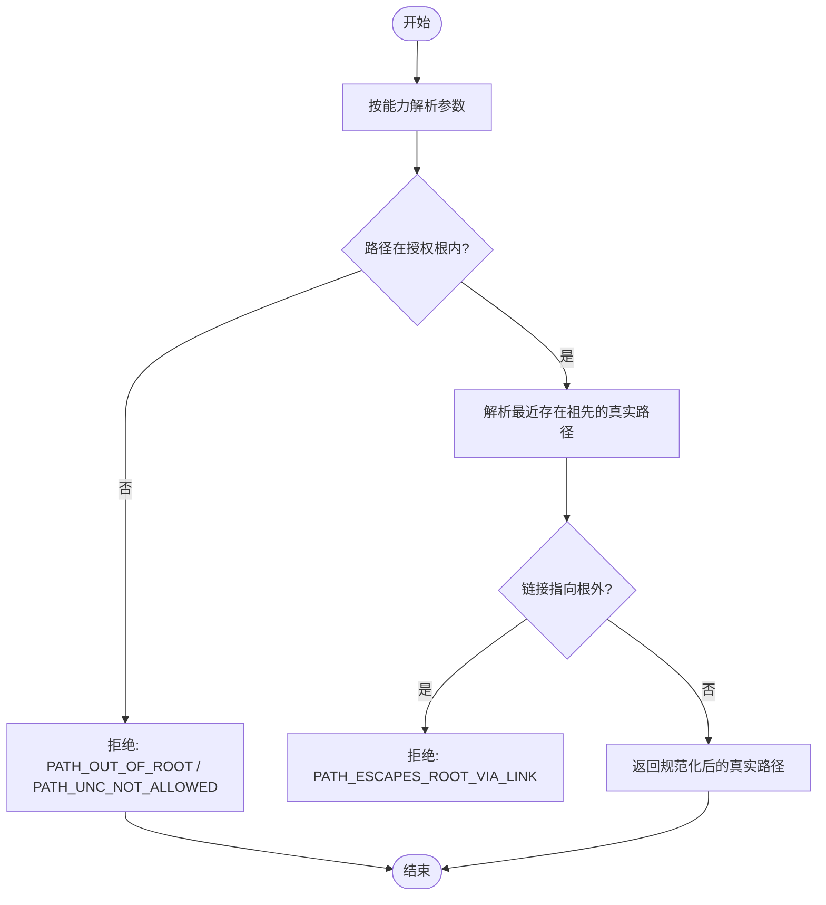
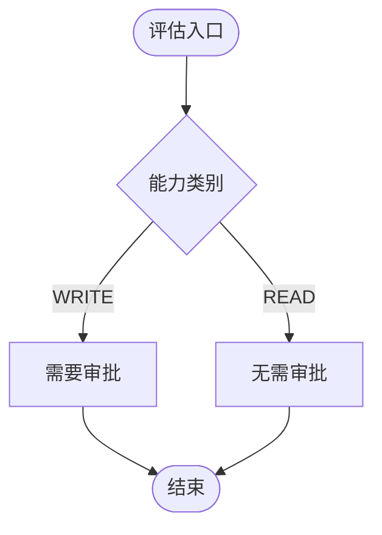
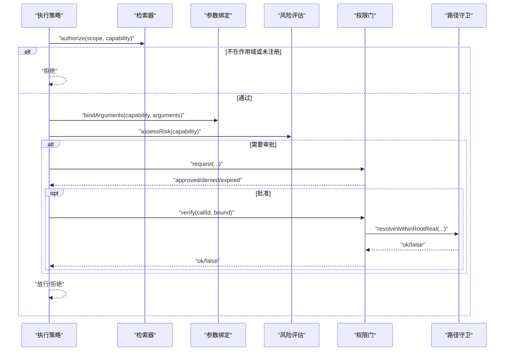
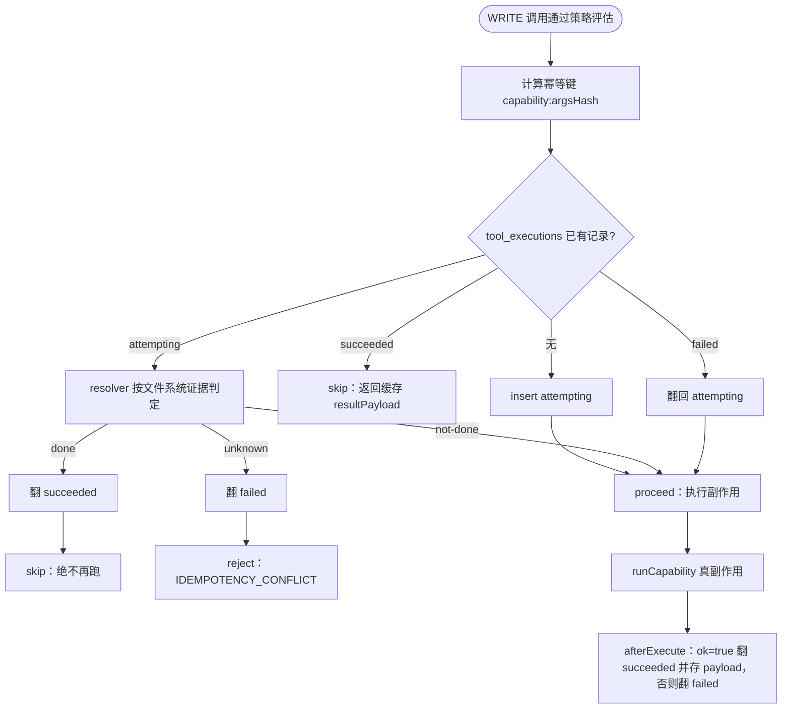
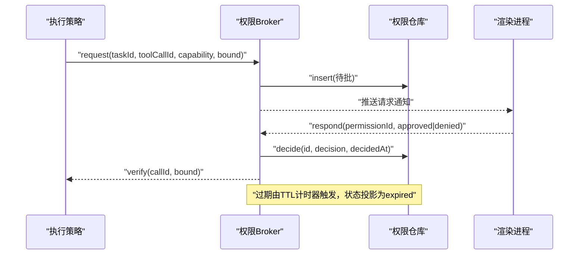
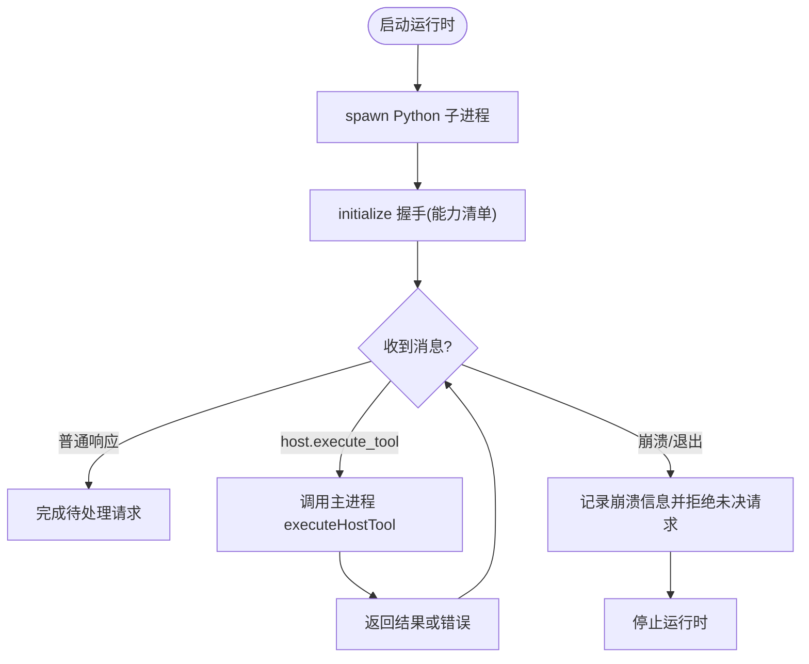
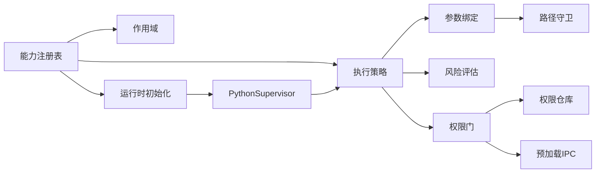

# 安全架构设计

<cite>
**本文引用的文件**
- [path-guard.ts](file://apps/desktop/src/main/capabilities/path-guard.ts)
- [roots.ts](file://apps/desktop/src/main/capabilities/roots.ts)
- [registry.ts](file://apps/desktop/src/main/capabilities/registry.ts)
- [scope.ts](file://apps/desktop/src/main/capabilities/scope.ts)
- [argument-binders.ts](file://apps/desktop/src/main/policy/argument-binders.ts)
- [risk.ts](file://apps/desktop/src/main/policy/risk.ts)
- [execution-policy.ts](file://apps/desktop/src/main/policy/execution-policy.ts)
- [permission-broker.ts](file://apps/desktop/src/main/permission/permission-broker.ts)
- [permission-repository.ts](file://apps/desktop/src/main/product-state/permission-repository.ts)
- [domain.ts](file://apps/desktop/src/shared/domain.ts)
- [host-executor.ts](file://apps/desktop/src/main/capabilities/host-executor.ts)
- [idempotency.ts](file://apps/desktop/src/main/capabilities/idempotency.ts)
- [executor.ts](file://apps/desktop/src/main/capabilities/executor.ts)
- [tool-execution-repository.ts](file://apps/desktop/src/main/product-state/tool-execution-repository.ts)
- [0006-create-tool-executions.ts](file://apps/desktop/src/main/product-state/migrations/0006-create-tool-executions.ts)
- [security-matrix.test.ts](file://apps/desktop/src/main/e2e/security-matrix.test.ts)
- [python-supervisor.ts](file://apps/desktop/src/main/runtime/python-supervisor.ts)
- [runtime-host.ts](file://apps/desktop/src/main/runtime/runtime-host.ts)
- [PermissionDialog.tsx](file://apps/desktop/src/renderer/src/components/PermissionDialog.tsx)
- [preload/index.ts](file://apps/desktop/src/preload/index.ts)
</cite>

## 目录
1. [简介](#简介)
2. [项目结构](#项目结构)
3. [核心组件](#核心组件)
4. [架构总览](#架构总览)
5. [详细组件分析](#详细组件分析)
6. [依赖关系分析](#依赖关系分析)
7. [性能与安全权衡](#性能与安全权衡)
8. [故障排查指南](#故障排查指南)
9. [结论](#结论)
10. [附录：最佳实践与攻击防护](#附录最佳实践与攻击防护)

## 简介
本安全架构文档围绕“基于能力的访问控制”展开，覆盖权限模型、路径守卫、风险评估、审批流程与沙箱隔离等关键安全边界。系统通过能力注册表限定可调用的操作集合；在执行前进行参数契约校验与路径规范化，并在写入类能力上强制用户审批；对产生文件系统副作用的 WRITE 能力，还在 Executor 环节内设置幂等保护关，杜绝重试与崩溃恢复导致的重复副作用；所有敏感路径在真实文件系统层面进行根域限制与链接逃逸检测；Python 运行时以子进程方式运行，仅能通过受控的 host.execute_tool 通道回调主进程执行能力，从而形成清晰的渲染/代理/主机三层安全边界。

## 项目结构
安全相关代码主要分布在以下模块：
- 能力与范围：capabilities（能力注册、作用域、路径守卫）
- 策略与评估：policy（参数绑定、风险评估、执行策略）
- 权限管理：permission（请求、审批、持久化、过期）
- 运行时：runtime（Python 子进程生命周期、host 回调）
- 界面：renderer（权限审批对话框）
- 桥接：preload（主进程到渲染进程的受限 IPC）

图表来源
- [host-executor.ts:12-33](file://apps/desktop/src/main/capabilities/host-executor.ts#L12-L33)
- [execution-policy.ts:82-145](file://apps/desktop/src/main/policy/execution-policy.ts#L82-L145)
- [permission-broker.ts:99-256](file://apps/desktop/src/main/permission/permission-broker.ts#L99-L256)
- [python-supervisor.ts:244-300](file://apps/desktop/src/main/runtime/python-supervisor.ts#L244-L300)
- [PermissionDialog.tsx:136-165](file://apps/desktop/src/renderer/src/components/PermissionDialog.tsx#L136-L165)

章节来源
- [host-executor.ts:12-33](file://apps/desktop/src/main/capabilities/host-executor.ts#L12-L33)
- [execution-policy.ts:82-145](file://apps/desktop/src/main/policy/execution-policy.ts#L82-L145)
- [permission-broker.ts:99-256](file://apps/desktop/src/main/permission/permission-broker.ts#L99-L256)
- [python-supervisor.ts:244-300](file://apps/desktop/src/main/runtime/python-supervisor.ts#L244-L300)
- [PermissionDialog.tsx:136-165](file://apps/desktop/src/renderer/src/components/PermissionDialog.tsx#L136-L165)

## 核心组件
- 能力注册与作用域：集中声明可用能力及其读写类别，按任务作用域限制可见能力集合。
- 参数绑定与路径守卫：对入参做严格契约校验，并将路径归一化为授权根内的绝对路径，同时检测链接逃逸与 UNC 路径。
- 风险评估：根据能力类别（读/写）判定是否需要用户审批。
- 执行策略：串联范围检查、计划对齐、参数绑定、风险评估与批准验证，最终放行或拒绝。
- 幂等保护关：在 Executor 环节内对 WRITE 能力登记执行记录（attempting/succeeded/failed 三态），执行前决策跑不跑、执行后翻转状态，崩溃后按文件系统证据判定能否重跑，防止重试导致重复副作用。
- 权限审批：创建待批记录、展示给用户、持久化决定、支持过期与重放保护。
- 运行时沙箱：Python 代理作为子进程运行，仅能通过 host.execute_tool 反向调用主进程能力，且受超时与错误码约束。

章节来源
- [registry.ts:9-55](file://apps/desktop/src/main/capabilities/registry.ts#L9-L55)
- [scope.ts:3-18](file://apps/desktop/src/main/capabilities/scope.ts#L3-L18)
- [argument-binders.ts:13-170](file://apps/desktop/src/main/policy/argument-binders.ts#L13-L170)
- [risk.ts:1-22](file://apps/desktop/src/main/policy/risk.ts#L1-L22)
- [execution-policy.ts:82-145](file://apps/desktop/src/main/policy/execution-policy.ts#L82-L145)
- [idempotency.ts:103-204](file://apps/desktop/src/main/capabilities/idempotency.ts#L103-L204)
- [executor.ts:105-121](file://apps/desktop/src/main/capabilities/executor.ts#L105-L121)
- [permission-broker.ts:99-319](file://apps/desktop/src/main/permission/permission-broker.ts#L99-L319)
- [python-supervisor.ts:18-32](file://apps/desktop/src/main/runtime/python-supervisor.ts#L18-L32)

## 架构总览
下图展示了从 Python 代理发起工具调用到主进程安全策略与权限审批的完整链路，以及渲染进程的用户确认交互。

图表来源
- [python-supervisor.ts:244-300](file://apps/desktop/src/main/runtime/python-supervisor.ts#L244-L300)
- [execution-policy.ts:82-145](file://apps/desktop/src/main/policy/execution-policy.ts#L82-L145)
- [permission-broker.ts:132-233](file://apps/desktop/src/main/permission/permission-broker.ts#L132-L233)
- [path-guard.ts:70-125](file://apps/desktop/src/main/capabilities/path-guard.ts#L70-L125)
- [PermissionDialog.tsx:136-165](file://apps/desktop/src/renderer/src/components/PermissionDialog.tsx#L136-L165)

## 详细组件分析

### 基于能力的访问控制模型
- 能力清单：集中定义能力名称、类别（READ/WRITE）、描述，供作用域过滤与风险判定使用。
- 作用域：为每个任务维护一个能力白名单，默认只暴露 READ 能力；WRITE 能力需额外授权。
- 检索器：依据作用域与规则决定某次调用是否可被该任务使用。

图表来源
- [registry.ts:9-55](file://apps/desktop/src/main/capabilities/registry.ts#L9-L55)
- [scope.ts:3-18](file://apps/desktop/src/main/capabilities/scope.ts#L3-L18)

章节来源
- [registry.ts:9-55](file://apps/desktop/src/main/capabilities/registry.ts#L9-L55)
- [scope.ts:3-18](file://apps/desktop/src/main/capabilities/scope.ts#L3-L18)

### 参数绑定与路径守卫
- 参数绑定：针对每种能力进行严格的 schema 校验，提取并规范化路径字段，输出不可变的 BoundArgs。
- 路径守卫：将候选路径解析为绝对路径后，判断是否在授权根内；若存在符号链接或 junction，会先解析最近存在的祖先再二次校验，防止链接逃逸；拒绝 UNC/设备路径。

图表来源
- [argument-binders.ts:38-170](file://apps/desktop/src/main/policy/argument-binders.ts#L38-L170)
- [path-guard.ts:7-17](file://apps/desktop/src/main/capabilities/path-guard.ts#L7-L17)
- [path-guard.ts:70-125](file://apps/desktop/src/main/capabilities/path-guard.ts#L70-L125)
- [roots.ts:18-26](file://apps/desktop/src/main/capabilities/roots.ts#L18-L26)

章节来源
- [argument-binders.ts:13-170](file://apps/desktop/src/main/policy/argument-binders.ts#L13-L170)
- [path-guard.ts:7-17](file://apps/desktop/src/main/capabilities/path-guard.ts#L7-L17)
- [path-guard.ts:70-125](file://apps/desktop/src/main/capabilities/path-guard.ts#L70-L125)
- [roots.ts:18-26](file://apps/desktop/src/main/capabilities/roots.ts#L18-L26)

### 风险评估算法
- 输入：能力描述符（含类别）。
- 规则：WRITE 类能力一律要求审批；READ 类能力无需审批。
- 输出：风险等级与原因，用于后续决定是否进入审批流程。

图表来源
- [risk.ts:13-21](file://apps/desktop/src/main/policy/risk.ts#L13-L21)

章节来源
- [risk.ts:1-22](file://apps/desktop/src/main/policy/risk.ts#L1-L22)

### 执行策略（八级检验管道）
- 步骤概览：
  1) 能力是否已注册
  2) 是否在任务作用域内
  3) 是否存在当前任务（仅代理侧）
  4) 是否与计划对齐（仅代理侧）
  5) 风险评估与审批门控
  6) 参数契约校验与路径绑定
  7) 路径守卫复查（执行前再次验证）
  8) 计数与放行
- 关键点：审批通过后会在执行前用相同 BoundArgs 重新校验路径，避免“批准即执行”的竞态与篡改。

图表来源
- [execution-policy.ts:82-145](file://apps/desktop/src/main/policy/execution-policy.ts#L82-L145)
- [argument-binders.ts:152-170](file://apps/desktop/src/main/policy/argument-binders.ts#L152-L170)
- [risk.ts:13-21](file://apps/desktop/src/main/policy/risk.ts#L13-L21)
- [permission-broker.ts:235-319](file://apps/desktop/src/main/permission/permission-broker.ts#L235-L319)
- [path-guard.ts:70-125](file://apps/desktop/src/main/capabilities/path-guard.ts#L70-L125)

章节来源
- [execution-policy.ts:82-145](file://apps/desktop/src/main/policy/execution-policy.ts#L82-L145)

### 幂等保护关（Executor 环节内）
- 位置：在五层安全链 Scope → Retriever → Binder → Executor → Path-Guard 中，幂等保护位于第④层 Executor 环节内部——executor 在 policy.evaluate 放行之后、分发真副作用（runCapability）之前调用 beginAttempt，执行结束后调用 afterExecute 翻转状态。幂等关通过可选接线口 ExecutorIdempotencyWiring 注入执行记录仓库；未注入时 WRITE 能力照常执行，但不登记、不查重复。
- 保护范围：只保护会产生文件系统副作用的 WRITE 能力——WRITE_CAPABILITIES 集合当前只含 filesystem.move 与 filesystem.create_dir；只读能力（filesystem.list、document.extract_pdf）不进这道关。scheduler.create 虽属 WRITE 也不进幂等关：它的副作用是库内一行而不是文件系统，reminders.task_id UNIQUE 加执行体内按 idempotencyKey 比对，已覆盖「同参重试幂等返回、异参拒绝」，没有需要恢复 resolver 复查的中间态。
- 幂等键：格式固定 `capability:argsHash`，argsHash 由规范化后的绑定参数（BoundArgs）派生指纹，与权限审批绑定的参数指纹同源。
- beginAttempt 的三种决策：
  - proceed：副作用还没发生，让 executor 去跑——无记录时先 insert 一条 attempting；上次 failed 时翻回 attempting 重试；崩溃恢复判定 not-done 时直接重跑。
  - skip：副作用确认已发生，绝不再跑——已 succeeded 时原样返回缓存的 resultPayload；记录停在 attempting 但文件系统证明已做完时，翻 succeeded 并返回 `{ ok:true, idempotent:true }`。
  - reject：文件系统处于矛盾态，不敢跑也不敢跳——翻 failed，返回结果载荷 `{ ok:false, code:'IDEMPOTENCY_CONFLICT', reason }`。注意 IDEMPOTENCY_CONFLICT 不在协议层 ERROR_CODE 注册表内，只出现在幂等关的结果载荷中。
- 崩溃恢复判定（resolver）：对停在 attempting 的记录按文件系统证据判 done / not-done / unknown——filesystem.move 看 source/target 存在性组合（源不在且目标在 = done；源在且目标不在 = not-done；同时在或同时不在 = unknown 矛盾态）；filesystem.create_dir 看 target 是否为目录（已是目录 = done；不存在 = not-done；是同名文件 = unknown）；没有恢复判定的能力一律 unknown 交上层处理。
- 状态机：attempting / succeeded / failed 三态落 tool_executions 表（0006 migration），合法转换由 Repository 层 ALLOWED_TRANSITIONS 转换表约束（attempting→succeeded/failed，failed→attempting，succeeded 为终态），表外转换抛 IllegalToolExecutionTransition——CHECK 约束只拦非法值，转换规则在 Repository 层。
- 接线现状：生产 bootstrap executor（host-executor）为只读 scope，尚未注入幂等仓库；含幂等关的完整 WRITE 链路已在 e2e 安全矩阵（security-matrix.test.ts，真 broker + 真四仓库 + 内存 SQLite + 真临时文件系统）与 idempotency-guard.test.ts 中以真组件组装验证。

图表来源
- [idempotency.ts:130-190](file://apps/desktop/src/main/capabilities/idempotency.ts#L130-L190)
- [idempotency.ts:192-204](file://apps/desktop/src/main/capabilities/idempotency.ts#L192-L204)
- [executor.ts:105-121](file://apps/desktop/src/main/capabilities/executor.ts#L105-L121)

章节来源
- [idempotency.ts:21-111](file://apps/desktop/src/main/capabilities/idempotency.ts#L21-L111)
- [idempotency.ts:113-204](file://apps/desktop/src/main/capabilities/idempotency.ts#L113-L204)
- [executor.ts:115-120](file://apps/desktop/src/main/capabilities/executor.ts#L115-L120)
- [executor.ts:105-121](file://apps/desktop/src/main/capabilities/executor.ts#L105-L121)
- [tool-execution-repository.ts:13-36](file://apps/desktop/src/main/product-state/tool-execution-repository.ts#L13-L36)
- [0006-create-tool-executions.ts:1-31](file://apps/desktop/src/main/product-state/migrations/0006-create-tool-executions.ts#L1-L31)
- [host-executor.ts:19-20](file://apps/desktop/src/main/capabilities/host-executor.ts#L19-L20)
- [security-matrix.test.ts:1-24](file://apps/desktop/src/main/e2e/security-matrix.test.ts#L1-L24)

### 权限审批流程与持久化
- 请求阶段：生成唯一 ID、计算参数指纹、持久化待批记录、推送通知至渲染进程。
- 决策阶段：渲染进程展示影响文件与目标位置、剩余时间；用户点击批准后，主进程幂等更新状态并记录决定时间。
- 过期处理：超过 TTL 自动标记过期并通知渲染进程；等待者超时返回错误码。
- 防篡改：执行前用 toolCallId 与 argsHash 双重校验，确保“批准的参数”与“执行的参数”一致。

图表来源
- [permission-broker.ts:132-233](file://apps/desktop/src/main/permission/permission-broker.ts#L132-L233)
- [permission-repository.ts:92-132](file://apps/desktop/src/main/product-state/permission-repository.ts#L92-L132)
- [domain.ts:52-84](file://apps/desktop/src/shared/domain.ts#L52-L84)
- [PermissionDialog.tsx:31-134](file://apps/desktop/src/renderer/src/components/PermissionDialog.tsx#L31-L134)

章节来源
- [permission-broker.ts:132-233](file://apps/desktop/src/main/permission/permission-broker.ts#L132-L233)
- [permission-repository.ts:92-132](file://apps/desktop/src/main/product-state/permission-repository.ts#L92-L132)
- [domain.ts:52-84](file://apps/desktop/src/shared/domain.ts#L52-L84)
- [PermissionDialog.tsx:31-134](file://apps/desktop/src/renderer/src/components/PermissionDialog.tsx#L31-L134)

### 沙箱隔离机制（Python 运行时）
- 子进程隔离：Python 代理以独立子进程运行，标准输出/错误流分离，崩溃时统一上报。
- 最小接口：仅暴露 system.initialize 与 host.execute_tool 两种方法；其他方法直接拒绝。
- 超时与取消：每次请求带超时与可选 AbortSignal，避免挂起与资源泄漏。
- 能力下发：initialize 时下发能力清单，确保代理端所见能力与主进程实际放行一致。

图表来源
- [python-supervisor.ts:97-147](file://apps/desktop/src/main/runtime/python-supervisor.ts#L97-L147)
- [python-supervisor.ts:244-300](file://apps/desktop/src/main/runtime/python-supervisor.ts#L244-L300)
- [runtime-host.ts:26-63](file://apps/desktop/src/main/runtime/runtime-host.ts#L26-L63)

章节来源
- [python-supervisor.ts:97-147](file://apps/desktop/src/main/runtime/python-supervisor.ts#L97-L147)
- [python-supervisor.ts:244-300](file://apps/desktop/src/main/runtime/python-supervisor.ts#L244-L300)
- [runtime-host.ts:26-63](file://apps/desktop/src/main/runtime/runtime-host.ts#L26-L63)

## 依赖关系分析
- 能力注册表被作用域、策略、运行时初始化共同依赖，保证“可见能力”与“可执行能力”一致。
- 参数绑定强依赖路径守卫，确保所有涉及路径的能力都经过根域限制。
- 执行策略依赖风险评估与权限门，WRITE 能力必须通过审批才能继续。
- 权限 Broker 依赖仓库持久化与事件推送，渲染进程通过 preload 暴露的最小 API 与之交互。
- 运行时 Supervisor 仅暴露有限 RPC，并通过 hostHandler 将 host.execute_tool 路由到主进程执行策略。

图表来源
- [registry.ts:9-55](file://apps/desktop/src/main/capabilities/registry.ts#L9-L55)
- [scope.ts:3-18](file://apps/desktop/src/main/capabilities/scope.ts#L3-L18)
- [execution-policy.ts:82-145](file://apps/desktop/src/main/policy/execution-policy.ts#L82-L145)
- [argument-binders.ts:152-170](file://apps/desktop/src/main/policy/argument-binders.ts#L152-L170)
- [path-guard.ts:70-125](file://apps/desktop/src/main/capabilities/path-guard.ts#L70-L125)
- [permission-broker.ts:99-256](file://apps/desktop/src/main/permission/permission-broker.ts#L99-L256)
- [permission-repository.ts:92-132](file://apps/desktop/src/main/product-state/permission-repository.ts#L92-L132)
- [preload/index.ts:29-45](file://apps/desktop/src/preload/index.ts#L29-L45)
- [python-supervisor.ts:123-147](file://apps/desktop/src/main/runtime/python-supervisor.ts#L123-L147)

章节来源
- [registry.ts:9-55](file://apps/desktop/src/main/capabilities/registry.ts#L9-L55)
- [execution-policy.ts:82-145](file://apps/desktop/src/main/policy/execution-policy.ts#L82-L145)
- [permission-broker.ts:99-256](file://apps/desktop/src/main/permission/permission-broker.ts#L99-L256)
- [python-supervisor.ts:123-147](file://apps/desktop/src/main/runtime/python-supervisor.ts#L123-L147)

## 性能与安全权衡
- 路径守卫在“不存在路径”场景下仅对最近存在的祖先做 realpath，减少不必要的 I/O 与失败开销。
- 审批窗口设置 TTL，避免长期阻塞；渲染进程倒计时提示，提升用户体验。
- 执行前二次路径校验确保批准与执行一致性，代价是少量额外 I/O，但显著降低越权风险。
- Python 子进程超时与崩溃恢复保障整体稳定性，避免单点阻塞影响主进程。

[本节为通用指导，不直接分析具体文件]

## 故障排查指南
- 权限过期：检查 TTL 与用户操作耗时；关注“过期”事件与渲染进程提示。
- 路径越界：核对授权根环境变量配置；查看路径守卫返回的错误码（越界/链接逃逸/UNC 禁止）。
- 参数不一致：确认 BoundArgs 的 argsHash 与存储一致；检查参数绑定器是否对路径做了规范化。
- 运行时崩溃：查看 stderr 日志与崩溃信息；确认 initialize 握手成功与能力清单一致。
- 审批无响应：确认渲染进程订阅了权限通知；检查 preload 暴露的 respond 接口是否被调用。
- 幂等冲突（结果载荷码 IDEMPOTENCY_CONFLICT）：执行记录停在 attempting 且文件系统处于矛盾态（如 move 的 source/target 同时存在或同时不存在、create_dir 的目标是同名文件）；核对 tool_executions 记录的 sourcePaths/targetPath 与磁盘实况，人工消除矛盾态后重试。

章节来源
- [permission-broker.ts:167-179](file://apps/desktop/src/main/permission/permission-broker.ts#L167-L179)
- [path-guard.ts:70-125](file://apps/desktop/src/main/capabilities/path-guard.ts#L70-L125)
- [argument-binders.ts:152-170](file://apps/desktop/src/main/policy/argument-binders.ts#L152-L170)
- [idempotency.ts:39-83](file://apps/desktop/src/main/capabilities/idempotency.ts#L39-L83)
- [idempotency.ts:130-190](file://apps/desktop/src/main/capabilities/idempotency.ts#L130-L190)
- [python-supervisor.ts:110-119](file://apps/desktop/src/main/runtime/python-supervisor.ts#L110-L119)
- [preload/index.ts:29-45](file://apps/desktop/src/preload/index.ts#L29-L45)

## 结论
本架构通过“能力注册—作用域—参数绑定—路径守卫—风险评估—用户审批—执行前复核—幂等保护—子进程沙箱”的多层防线，实现了细粒度、可审计、可恢复的安全模型。关键优势包括：
- 明确的安全边界：渲染进程、主进程、Python 代理各司其职，最小权限原则贯穿始终。
- 强一致性与可追溯性：审批记录、事件流水与参数指纹确保事后审计与问题定位。
- 鲁棒性：超时、崩溃、过期等异常均有兜底处理，不影响主进程稳定运行。

[本节为总结性内容，不直接分析具体文件]

## 附录：最佳实践与攻击防护
- 最小权限：默认仅暴露 READ 能力；WRITE 能力必须经用户审批。
- 路径白名单：所有路径必须位于授权根内；拒绝 UNC/设备路径；对符号链接/junction 进行真实路径二次校验。
- 参数契约：严格 schema 校验，禁止任意对象透传；BoundArgs 作为执行唯一可信源。
- 防重放与防篡改：toolCallId 与 argsHash 双重校验；同一审批只能生效一次。
- 幂等与崩溃恢复：WRITE 能力以 `capability:argsHash` 幂等键登记执行记录，attempting/succeeded/failed 三态转换由 Repository 层转换表约束；记录停在 attempting 时按文件系统证据判定能否重跑，矛盾态拒绝（结果载荷码 IDEMPOTENCY_CONFLICT）而不是猜测执行。
- 超时与限流：所有远程调用与审批窗口均设超时；避免长时间阻塞。
- 审计与可视化：事件流水与时间线记录，便于追踪“为什么被拦”。
- 常见攻击防护：
  - 路径穿越/链接逃逸：通过 resolveWithinRootReal 防御。
  - 越权调用：通过作用域与能力注册表限制。
  - 恶意参数注入：通过参数绑定与 schema 校验拦截。
  - 代理越权：通过 host.execute_tool 单向通道与能力下发限制。
  - 重试/崩溃导致重复副作用：通过幂等关 beginAttempt 的 skip/reject 决策与恢复 resolver 的文件系统证据判定防御。
  - 长时间挂起：通过 TTL 与超时机制释放资源。

[本节为通用指导，不直接分析具体文件]