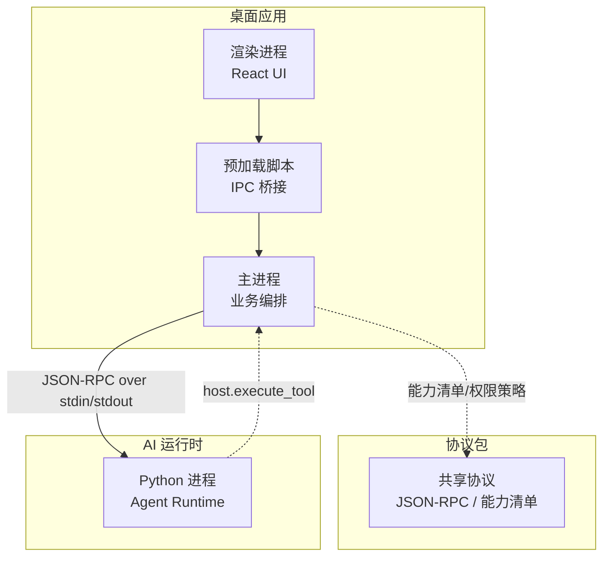
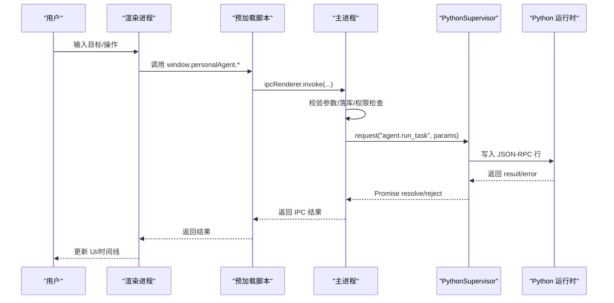
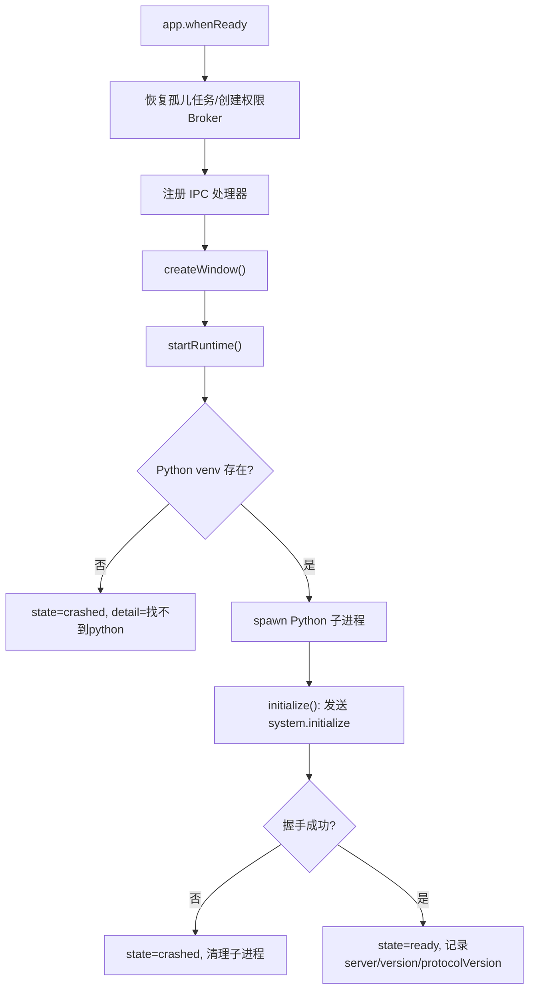
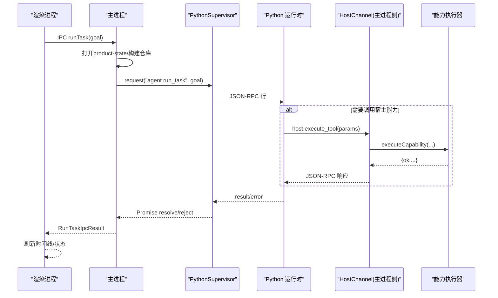
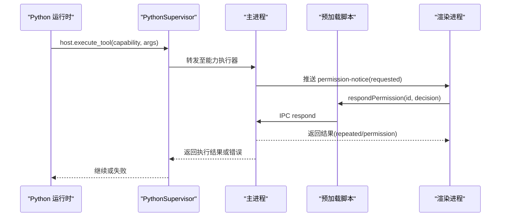
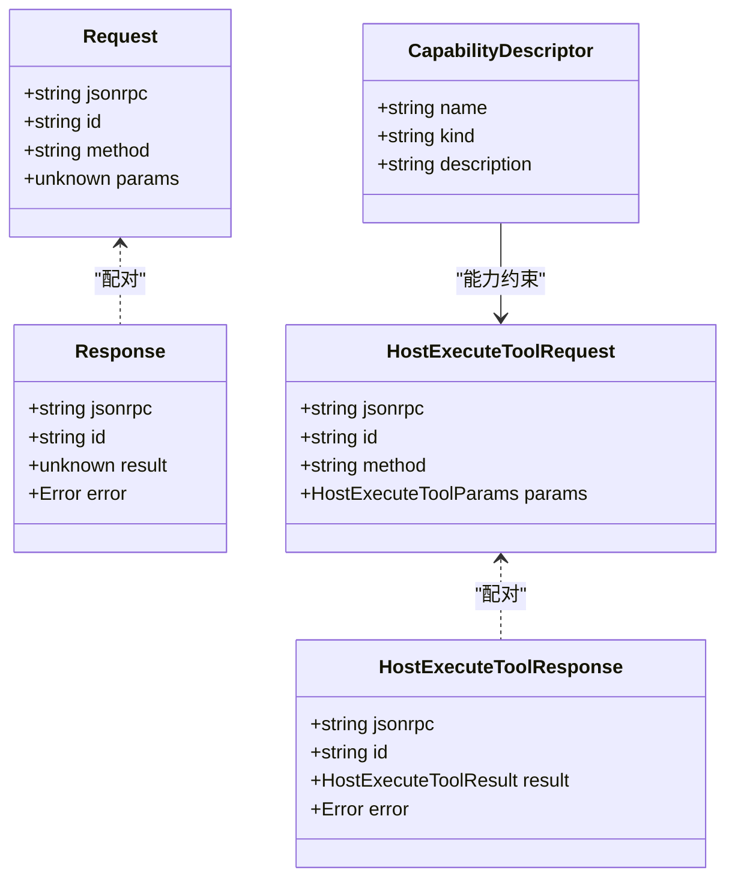
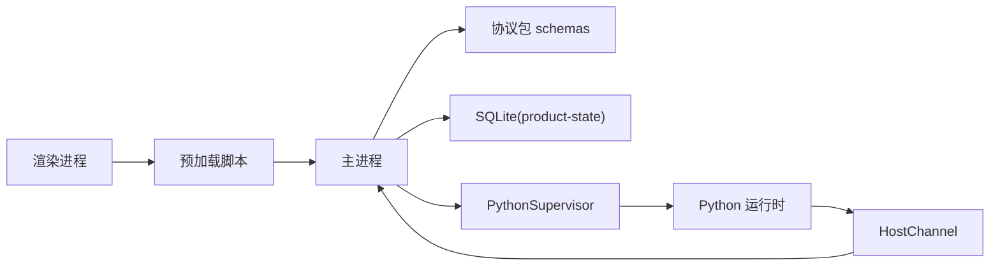
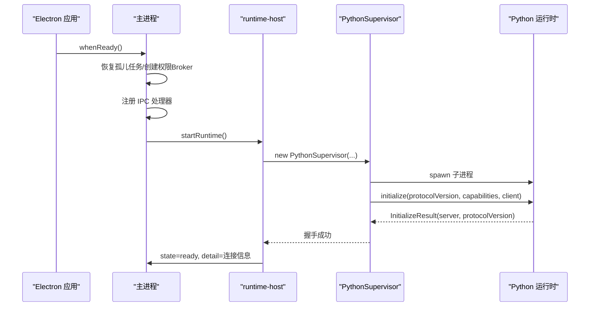

# 整体架构概览

<cite>
**本文引用的文件**
- [apps/desktop/src/main/index.ts](file://apps/desktop/src/main/index.ts)
- [apps/desktop/src/main/runtime/runtime-host.ts](file://apps/desktop/src/main/runtime/runtime-host.ts)
- [apps/desktop/src/main/runtime/python-supervisor.ts](file://apps/desktop/src/main/runtime/python-supervisor.ts)
- [apps/desktop/src/preload/index.ts](file://apps/desktop/src/preload/index.ts)
- [apps/desktop/src/renderer/src/App.tsx](file://apps/desktop/src/renderer/src/App.tsx)
- [apps/desktop/src/shared/ipc-contract.ts](file://apps/desktop/src/shared/ipc-contract.ts)
- [packages/protocol/schemas/envelope.ts](file://packages/protocol/schemas/envelope.ts)
- [packages/protocol/schemas/host.ts](file://packages/protocol/schemas/host.ts)
- [services/agent-runtime/src/personal_agent/__main__.py](file://services/agent-runtime/src/personal_agent/__main__.py)
- [services/agent-runtime/src/personal_agent/__init__.py](file://services/agent-runtime/src/personal_agent/__init__.py)
- [services/agent-runtime/src/personal_agent/runtime.py](file://services/agent-runtime/src/personal_agent/runtime.py)
- [services/agent-runtime/src/personal_agent/host_channel.py](file://services/agent-runtime/src/personal_agent/host_channel.py)
</cite>

## 目录
1. [简介](#简介)
2. [项目结构](#项目结构)
3. [核心组件](#核心组件)
4. [架构总览](#架构总览)
5. [详细组件分析](#详细组件分析)
6. [依赖关系分析](#依赖关系分析)
7. [性能与可靠性](#性能与可靠性)
8. [故障排查指南](#故障排查指南)
9. [结论](#结论)
10. [附录：启动流程时序图](#附录启动流程时序图)

## 简介
本文件为 Personal Agent 的整体架构概览，聚焦三层架构模式：UI 层（React 渲染进程）、业务逻辑层（Electron 主进程）、AI 推理层（Python 运行时）。文档解释各层职责、组件间依赖与数据流向，描述从 Electron 应用初始化到 Python 运行时启动的完整过程，并给出系统架构图与关键流程图。该设计通过明确的边界与共享协议包，使 UI、业务编排与 AI 推理解耦，便于扩展与维护。

## 项目结构
仓库采用多包/多应用组织：
- apps/desktop：Electron 桌面应用，包含主进程、渲染进程、预加载脚本与共享类型契约。
- packages/protocol：跨语言共享协议包，定义 JSON-RPC 信封、能力清单、错误码等。
- services/agent-runtime：Python 实现的 AI 推理运行时，提供任务规划与执行能力。

图表来源
- [apps/desktop/src/main/index.ts:109-347](file://apps/desktop/src/main/index.ts#L109-L347)
- [apps/desktop/src/main/runtime/runtime-host.ts:24-202](file://apps/desktop/src/main/runtime/runtime-host.ts#L24-L202)
- [packages/protocol/schemas/envelope.ts:1-41](file://packages/protocol/schemas/envelope.ts#L1-L41)
- [packages/protocol/schemas/host.ts:1-76](file://packages/protocol/schemas/host.ts#L1-L76)
- [services/agent-runtime/src/personal_agent/runtime.py:69-184](file://services/agent-runtime/src/personal_agent/runtime.py#L69-L184)

章节来源
- [apps/desktop/package.json:1-61](file://apps/desktop/package.json#L1-L61)

## 核心组件
- 渲染进程（React）：用户交互、状态展示、发起 IPC 调用、订阅权限通知。
- 预加载脚本：安全暴露 IPC 方法给渲染进程，屏蔽底层通道细节。
- 主进程：注册 IPC 处理器、管理产品状态（SQLite）、协调 Python 运行时、执行业务编排（任务、计划、时间线、权限）。
- Python 运行时：解析 JSON-RPC 请求、调度 Agent Engine、通过 HostChannel 反向调用宿主能力（文件系统、PDF 提取等）。
- 共享协议包：统一请求/响应信封、能力清单、错误码，确保 TS 与 Python 两端契约一致。

章节来源
- [apps/desktop/src/renderer/src/App.tsx:22-305](file://apps/desktop/src/renderer/src/App.tsx#L22-L305)
- [apps/desktop/src/preload/index.ts:1-61](file://apps/desktop/src/preload/index.ts#L1-L61)
- [apps/desktop/src/main/index.ts:109-347](file://apps/desktop/src/main/index.ts#L109-L347)
- [services/agent-runtime/src/personal_agent/runtime.py:69-184](file://services/agent-runtime/src/personal_agent/runtime.py#L69-L184)
- [packages/protocol/schemas/envelope.ts:1-41](file://packages/protocol/schemas/envelope.ts#L1-L41)

## 架构总览
三层职责分离清晰：
- UI 层（渲染进程）：专注界面与交互，不直接访问系统资源或 AI 模型。
- 业务逻辑层（主进程）：负责持久化、权限审批、任务编排、与 Python 运行时的通信。
- AI 推理层（Python 运行时）：实现 Agent 循环、计划生成、工具调用与结果汇总。

图表来源
- [apps/desktop/src/renderer/src/App.tsx:170-202](file://apps/desktop/src/renderer/src/App.tsx#L170-L202)
- [apps/desktop/src/preload/index.ts:14-38](file://apps/desktop/src/preload/index.ts#L14-L38)
- [apps/desktop/src/main/index.ts:268-291](file://apps/desktop/src/main/index.ts#L268-L291)
- [apps/desktop/src/main/runtime/python-supervisor.ts:163-207](file://apps/desktop/src/main/runtime/python-supervisor.ts#L163-L207)
- [services/agent-runtime/src/personal_agent/runtime.py:158-184](file://services/agent-runtime/src/personal_agent/runtime.py#L158-L184)

## 详细组件分析

### 启动流程：从 Electron 初始化到 Python 运行时就绪
- 主进程在 app.whenReady 中完成：
  - 恢复孤儿任务、创建权限 Broker。
  - 注册所有 IPC 处理器（任务、时间线、PDF 索引、权限等）。
  - 创建窗口并调用 startRuntime()。
- runtime-host 解析 Python 可执行路径与环境，构造 PythonSupervisor 并启动子进程。
- Supervisor 发送 system.initialize，携带协议版本与能力清单；Python 侧返回 InitializeResult。
- 主进程将状态置为 ready，并记录连接信息。

图表来源
- [apps/desktop/src/main/index.ts:109-145](file://apps/desktop/src/main/index.ts#L109-L145)
- [apps/desktop/src/main/index.ts:338-347](file://apps/desktop/src/main/index.ts#L338-L347)
- [apps/desktop/src/main/runtime/runtime-host.ts:24-181](file://apps/desktop/src/main/runtime/runtime-host.ts#L24-L181)
- [apps/desktop/src/main/runtime/python-supervisor.ts:136-160](file://apps/desktop/src/main/runtime/python-supervisor.ts#L136-L160)
- [services/agent-runtime/src/personal_agent/runtime.py:109-125](file://services/agent-runtime/src/personal_agent/runtime.py#L109-L125)

章节来源
- [apps/desktop/src/main/index.ts:109-347](file://apps/desktop/src/main/index.ts#L109-L347)
- [apps/desktop/src/main/runtime/runtime-host.ts:24-202](file://apps/desktop/src/main/runtime/runtime-host.ts#L24-L202)
- [apps/desktop/src/main/runtime/python-supervisor.ts:96-160](file://apps/desktop/src/main/runtime/python-supervisor.ts#L96-L160)
- [services/agent-runtime/src/personal_agent/runtime.py:109-125](file://services/agent-runtime/src/personal_agent/runtime.py#L109-L125)

### 任务执行：runTask 端到端流程
- 渲染进程调用 runTask(goal)，主进程通过 IPC 接收。
- 主进程打开 product-state 数据库，调用 run-task 编排器，传入任务、计划、事件仓库以及 requestRuntime。
- requestRuntime 透传到 PythonSupervisor.request，以 JSON-RPC 方式调用 agent.run_task。
- Python 侧校验参数，若未配置模型则返回特定错误；否则构造 ContextManager 与 AgentEngine 执行。
- 执行过程中可能触发 host.execute_tool，由 Python 通过 HostChannel 反向请求主进程执行能力。
- 主进程能力执行器执行具体能力（如文件系统列表），返回结果；Python 侧聚合结果并返回给主进程。
- 主进程将结果写回 IPC，渲染进程更新 UI 与时间线。

图表来源
- [apps/desktop/src/main/index.ts:268-291](file://apps/desktop/src/main/index.ts#L268-L291)
- [apps/desktop/src/main/runtime/runtime-host.ts:205-214](file://apps/desktop/src/main/runtime/runtime-host.ts#L205-L214)
- [apps/desktop/src/main/runtime/python-supervisor.ts:163-207](file://apps/desktop/src/main/runtime/python-supervisor.ts#L163-L207)
- [services/agent-runtime/src/personal_agent/runtime.py:158-184](file://services/agent-runtime/src/personal_agent/runtime.py#L158-L184)
- [services/agent-runtime/src/personal_agent/host_channel.py:45-85](file://services/agent-runtime/src/personal_agent/host_channel.py#L45-L85)

章节来源
- [apps/desktop/src/renderer/src/App.tsx:170-202](file://apps/desktop/src/renderer/src/App.tsx#L170-L202)
- [apps/desktop/src/main/index.ts:268-291](file://apps/desktop/src/main/index.ts#L268-L291)
- [services/agent-runtime/src/personal_agent/runtime.py:158-184](file://services/agent-runtime/src/personal_agent/runtime.py#L158-L184)
- [services/agent-runtime/src/personal_agent/host_channel.py:45-85](file://services/agent-runtime/src/personal_agent/host_channel.py#L45-L85)

### 权限审批流：主进程推送与渲染进程决策
- 当 AI 推理需要访问受限能力时，Python 通过 host.execute_tool 请求主进程执行。
- 主进程能力执行器根据策略决定是否申请权限，并通过 IPC 向渲染进程推送 PermissionNotice。
- 用户在渲染进程中做出批准/拒绝决策，调用 respondPermission。
- 主进程更新权限状态并回传结果，必要时继续执行能力。

图表来源
- [apps/desktop/src/main/runtime/python-supervisor.ts:265-321](file://apps/desktop/src/main/runtime/python-supervisor.ts#L265-L321)
- [apps/desktop/src/preload/index.ts:33-55](file://apps/desktop/src/preload/index.ts#L33-L55)
- [apps/desktop/src/renderer/src/App.tsx:117-156](file://apps/desktop/src/renderer/src/App.tsx#L117-L156)

章节来源
- [apps/desktop/src/renderer/src/App.tsx:117-156](file://apps/desktop/src/renderer/src/App.tsx#L117-L156)
- [apps/desktop/src/preload/index.ts:33-55](file://apps/desktop/src/preload/index.ts#L33-L55)
- [apps/desktop/src/main/runtime/python-supervisor.ts:265-321](file://apps/desktop/src/main/runtime/python-supervisor.ts#L265-L321)

### 数据契约与协议
- JSON-RPC 信封：统一 jsonrpc、id、method、params/result/error 字段，禁止同时出现 result 与 error。
- 能力清单：声明可用能力名称、读写类别与描述，用于握手与可见性控制。
- 错误码：TS 与 Python 共享 ERROR_CODE，运行时特有错误码作为不透明字符串透传。

图表来源
- [packages/protocol/schemas/envelope.ts:1-41](file://packages/protocol/schemas/envelope.ts#L1-L41)
- [packages/protocol/schemas/host.ts:1-76](file://packages/protocol/schemas/host.ts#L1-L76)

章节来源
- [packages/protocol/schemas/envelope.ts:1-41](file://packages/protocol/schemas/envelope.ts#L1-L41)
- [packages/protocol/schemas/host.ts:1-76](file://packages/protocol/schemas/host.ts#L1-L76)

## 依赖关系分析
- 渲染进程依赖预加载脚本暴露的 API，间接依赖主进程的 IPC 处理器。
- 主进程依赖共享协议包进行参数校验与能力清单管理，依赖 SQLite 存储产品状态。
- Python 运行时依赖共享协议包的 Pydantic 模型进行请求/响应校验，通过 HostChannel 与主进程双向通信。
- 主进程与 Python 运行时之间通过 JSON-RPC 行式消息通信，具备超时、取消、崩溃处理机制。

图表来源
- [apps/desktop/src/main/index.ts:109-347](file://apps/desktop/src/main/index.ts#L109-L347)
- [apps/desktop/src/main/runtime/python-supervisor.ts:1-363](file://apps/desktop/src/main/runtime/python-supervisor.ts#L1-L363)
- [services/agent-runtime/src/personal_agent/runtime.py:1-257](file://services/agent-runtime/src/personal_agent/runtime.py#L1-L257)
- [services/agent-runtime/src/personal_agent/host_channel.py:1-91](file://services/agent-runtime/src/personal_agent/host_channel.py#L1-L91)

章节来源
- [apps/desktop/src/main/runtime/python-supervisor.ts:1-363](file://apps/desktop/src/main/runtime/python-supervisor.ts#L1-L363)
- [services/agent-runtime/src/personal_agent/runtime.py:1-257](file://services/agent-runtime/src/personal_agent/runtime.py#L1-L257)

## 性能与可靠性
- 子进程隔离：Python 运行时独立进程，崩溃不影响主进程稳定性；Supervisor 捕获退出信号并广播崩溃事件。
- 超时与取消：请求级超时、host.execute_tool 超时、AbortSignal 支持取消，避免阻塞。
- 健壮握手：initialize 阶段严格校验协议版本与能力清单，失败即进入 crashed 状态。
- 幂等与重试：权限通知去重（repeated），避免重复副作用。
- 日志与诊断：stderr 输出、运行时状态查询、时间线导出，便于问题定位。

[本节为通用指导，无需具体文件引用]

## 故障排查指南
- 运行时未启动：requestRuntime 抛出 NOT_STARTED，需先确认 startRuntime 是否成功。
- 握手失败：initialize 参数不符合契约或协议版本不匹配，检查能力清单与协议版本。
- 子进程崩溃：supervisor 触发 runtime.crashed，查看 stderr 与退出码。
- host.execute_tool 超时：检查能力执行器耗时与超时阈值设置。
- 权限相关：确认 permission broker 已创建且通知通道正常，渲染进程是否正确订阅与响应。

章节来源
- [apps/desktop/src/main/runtime/runtime-host.ts:92-214](file://apps/desktop/src/main/runtime/runtime-host.ts#L92-L214)
- [apps/desktop/src/main/runtime/python-supervisor.ts:136-207](file://apps/desktop/src/main/runtime/python-supervisor.ts#L136-L207)
- [apps/desktop/src/main/runtime/python-supervisor.ts:265-321](file://apps/desktop/src/main/runtime/python-supervisor.ts#L265-L321)
- [apps/desktop/src/main/runtime/python-supervisor.ts:339-361](file://apps/desktop/src/main/runtime/python-supervisor.ts#L339-L361)

## 结论
该架构通过清晰的三层分离与共享协议包，实现了 UI、业务编排与 AI 推理的解耦。Electron 主进程承担资源与权限管控，Python 运行时专注 AI 能力，渲染进程专注用户体验。这种设计具备良好的可扩展性与维护性：新增能力只需在协议包中声明并在主进程实现执行器；新增模型或脚本只需在 Python 运行时注入工厂函数。同时，严格的契约校验与完善的错误处理保障了系统的稳定性与可观测性。

## 附录：启动流程时序图

图表来源
- [apps/desktop/src/main/index.ts:109-145](file://apps/desktop/src/main/index.ts#L109-L145)
- [apps/desktop/src/main/runtime/runtime-host.ts:136-181](file://apps/desktop/src/main/runtime/runtime-host.ts#L136-L181)
- [apps/desktop/src/main/runtime/python-supervisor.ts:136-160](file://apps/desktop/src/main/runtime/python-supervisor.ts#L136-L160)
- [services/agent-runtime/src/personal_agent/runtime.py:109-125](file://services/agent-runtime/src/personal_agent/runtime.py#L109-L125)