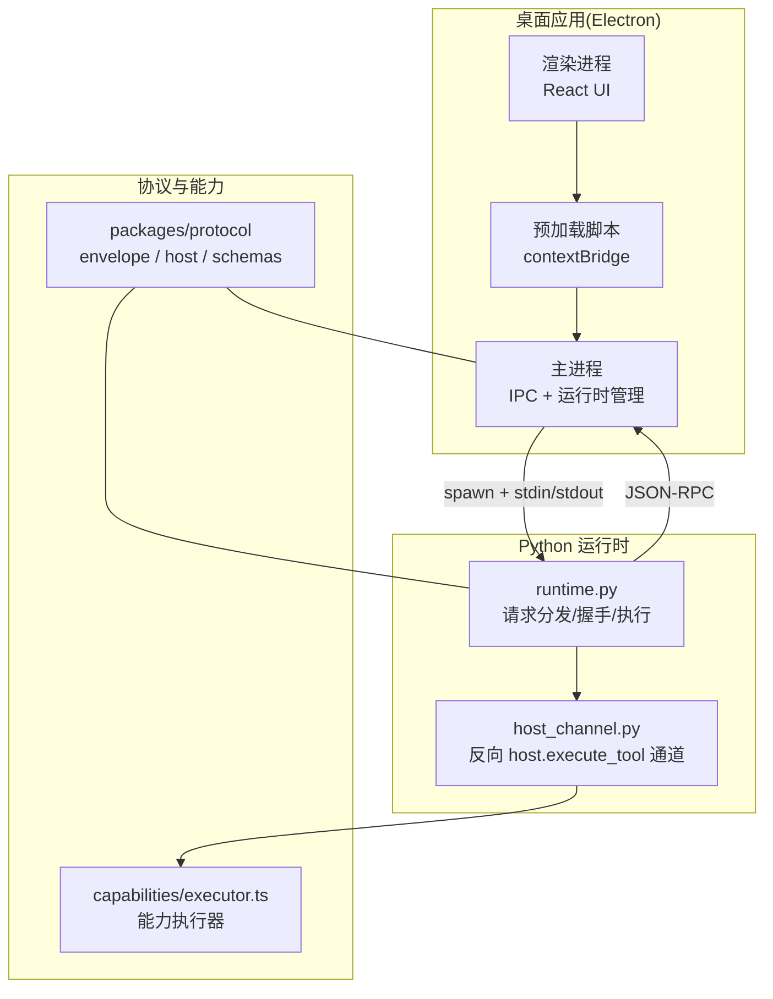
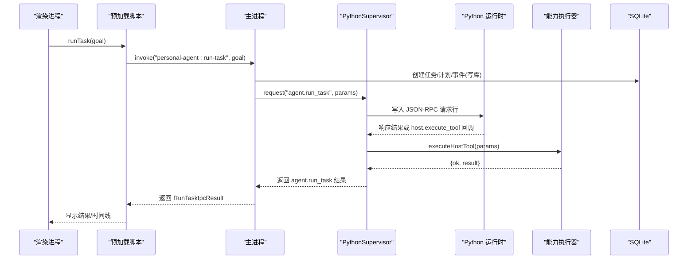
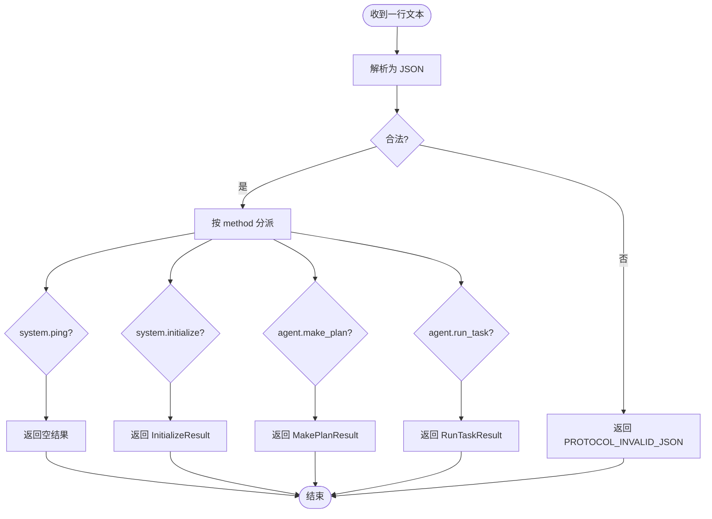
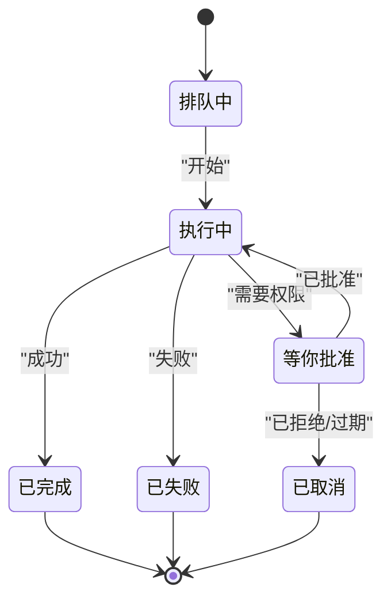
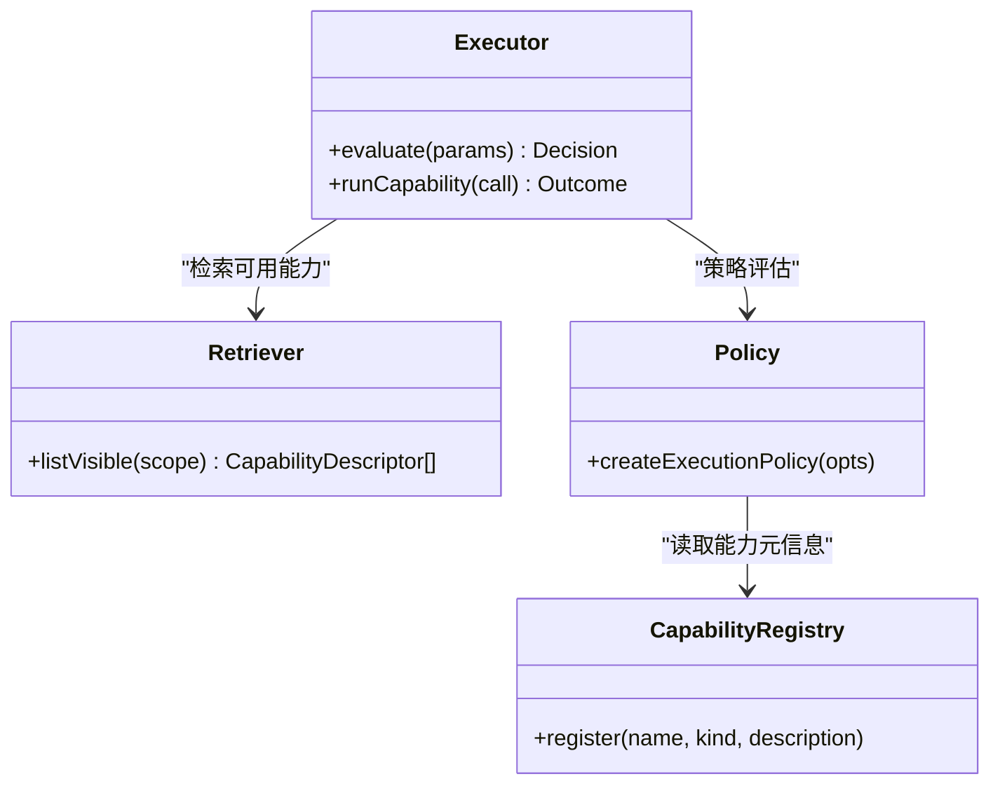
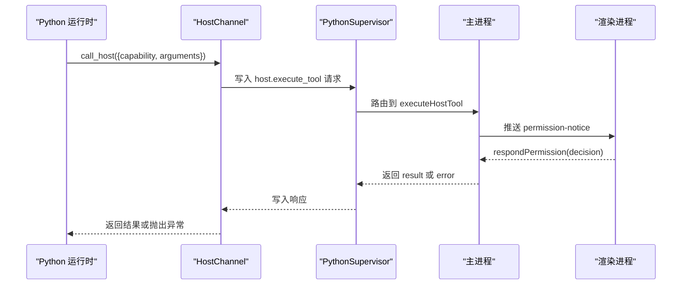
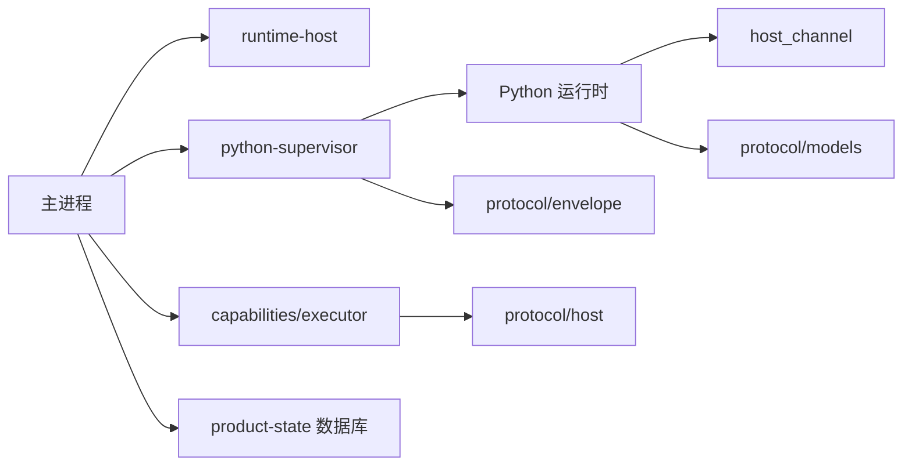

# 架构设计

<cite>
**本文引用的文件**
- [apps/desktop/src/main/index.ts](file://apps/desktop/src/main/index.ts)
- [apps/desktop/src/preload/index.ts](file://apps/desktop/src/preload/index.ts)
- [apps/desktop/src/shared/ipc-contract.ts](file://apps/desktop/src/shared/ipc-contract.ts)
- [apps/desktop/src/shared/domain.ts](file://apps/desktop/src/shared/domain.ts)
- [apps/desktop/src/renderer/src/view-model.ts](file://apps/desktop/src/renderer/src/view-model.ts)
- [apps/desktop/src/main/runtime/runtime-host.ts](file://apps/desktop/src/main/runtime/runtime-host.ts)
- [apps/desktop/src/main/runtime/python-supervisor.ts](file://apps/desktop/src/main/runtime/python-supervisor.ts)
- [services/agent-runtime/src/personal_agent/__main__.py](file://services/agent-runtime/src/personal_agent/__main__.py)
- [services/agent-runtime/src/personal_agent/runtime.py](file://services/agent-runtime/src/personal_agent/runtime.py)
- [services/agent-runtime/src/personal_agent/host_channel.py](file://services/agent-runtime/src/personal_agent/host_channel.py)
- [packages/protocol/schemas/envelope.ts](file://packages/protocol/schemas/envelope.ts)
- [packages/protocol/schemas/host.ts](file://packages/protocol/schemas/host.ts)
- [apps/desktop/src/main/capabilities/host-executor.ts](file://apps/desktop/src/main/capabilities/host-executor.ts)
- [apps/desktop/src/main/capabilities/executor.ts](file://apps/desktop/src/main/capabilities/executor.ts)
</cite>

## 目录
1. [简介](#简介)
2. [项目结构](#项目结构)
3. [核心组件](#核心组件)
4. [架构总览](#架构总览)
5. [详细组件分析](#详细组件分析)
6. [依赖关系分析](#依赖关系分析)
7. [性能考虑](#性能考虑)
8. [故障排查指南](#故障排查指南)
9. [结论](#结论)
10. [附录](#附录)

## 简介
本架构设计文档面向 Personal Agent 桌面应用，系统性阐述 Electron 主进程、渲染进程与 Python 运行时服务之间的交互关系；解释分层架构（UI 层、业务逻辑层、数据访问层）的职责分离；说明 IPC 通信机制与 JSON-RPC 协议的设计原理；描述事件驱动架构的实现方式（异步任务处理与状态更新）；并讨论插件化设计与可扩展性、安全架构（权限控制模型与沙箱）。

## 项目结构
Personal Agent 采用多包多应用的多仓库式组织：
- apps/desktop：Electron 桌面应用，包含 main、preload、renderer、shared 等模块。
- services/agent-runtime：Python 实现的 Agent 运行时，通过标准输入输出与主进程进行 JSON-RPC 通信。
- packages/protocol：前后端共享的协议定义（JSON-RPC envelope、能力清单、错误码等）。

**图表来源**
- [apps/desktop/src/main/index.ts:51-85](file://apps/desktop/src/main/index.ts#L51-L85)
- [apps/desktop/src/preload/index.ts:8-46](file://apps/desktop/src/preload/index.ts#L8-L46)
- [apps/desktop/src/main/runtime/runtime-host.ts:15-59](file://apps/desktop/src/main/runtime/runtime-host.ts#L15-L59)
- [apps/desktop/src/main/runtime/python-supervisor.ts:96-147](file://apps/desktop/src/main/runtime/python-supervisor.ts#L96-L147)
- [services/agent-runtime/src/personal_agent/runtime.py:67-182](file://services/agent-runtime/src/personal_agent/runtime.py#L67-L182)
- [services/agent-runtime/src/personal_agent/host_channel.py:36-91](file://services/agent-runtime/src/personal_agent/host_channel.py#L36-L91)
- [packages/protocol/schemas/envelope.ts:5-41](file://packages/protocol/schemas/envelope.ts#L5-L41)
- [packages/protocol/schemas/host.ts:1-76](file://packages/protocol/schemas/host.ts#L1-L76)
- [apps/desktop/src/main/capabilities/executor.ts:73-143](file://apps/desktop/src/main/capabilities/executor.ts#L73-L143)

**章节来源**
- [apps/desktop/src/main/index.ts:51-85](file://apps/desktop/src/main/index.ts#L51-L85)
- [apps/desktop/src/preload/index.ts:8-46](file://apps/desktop/src/preload/index.ts#L8-L46)
- [apps/desktop/src/main/runtime/runtime-host.ts:15-59](file://apps/desktop/src/main/runtime/runtime-host.ts#L15-L59)
- [apps/desktop/src/main/runtime/python-supervisor.ts:96-147](file://apps/desktop/src/main/runtime/python-supervisor.ts#L96-L147)
- [services/agent-runtime/src/personal_agent/runtime.py:67-182](file://services/agent-runtime/src/personal_agent/runtime.py#L67-L182)
- [services/agent-runtime/src/personal_agent/host_channel.py:36-91](file://services/agent-runtime/src/personal_agent/host_channel.py#L36-L91)
- [packages/protocol/schemas/envelope.ts:5-41](file://packages/protocol/schemas/envelope.ts#L5-L41)
- [packages/protocol/schemas/host.ts:1-76](file://packages/protocol/schemas/host.ts#L1-L76)
- [apps/desktop/src/main/capabilities/executor.ts:73-143](file://apps/desktop/src/main/capabilities/executor.ts#L73-L143)

## 核心组件
- 渲染进程（UI 层）：React 界面，通过 preload 暴露的 API 调用主进程能力，展示任务、时间线、权限审批等。
- 预加载脚本（桥接层）：使用 contextBridge 暴露最小化的 IPC 方法，仅允许受控通道。
- 主进程（业务逻辑层）：注册 IPC 处理器，协调任务生命周期、数据库读写、权限审批、Python 运行时管理、能力执行。
- Python 运行时（Agent 引擎）：实现 JSON-RPC 协议，负责计划生成、任务执行、工具调用、与主进程的双向通信。
- 协议与能力（契约层）：统一 Request/Response/Notification 信封、能力清单、错误码，确保两端一致性。
- 数据访问层：SQLite 持久化任务、计划、事件、权限记录等。

**章节来源**
- [apps/desktop/src/shared/ipc-contract.ts:24-75](file://apps/desktop/src/shared/ipc-contract.ts#L24-L75)
- [apps/desktop/src/shared/domain.ts:1-158](file://apps/desktop/src/shared/domain.ts#L1-L158)
- [apps/desktop/src/main/index.ts:127-269](file://apps/desktop/src/main/index.ts#L127-L269)
- [services/agent-runtime/src/personal_agent/runtime.py:67-182](file://services/agent-runtime/src/personal_agent/runtime.py#L67-L182)
- [packages/protocol/schemas/envelope.ts:5-41](file://packages/protocol/schemas/envelope.ts#L5-L41)
- [packages/protocol/schemas/host.ts:1-76](file://packages/protocol/schemas/host.ts#L1-L76)

## 架构总览
系统采用分层架构与事件驱动模式：
- UI 层：渲染进程负责用户交互与视图呈现。
- 业务逻辑层：主进程编排任务、权限、能力执行、运行时管理。
- 数据访问层：SQLite 存储任务、计划、事件、权限等。
- 外部运行时：Python Agent 通过 JSON-RPC 与主进程通信，提供智能规划与执行能力。

**图表来源**
- [apps/desktop/src/preload/index.ts:23-25](file://apps/desktop/src/preload/index.ts#L23-L25)
- [apps/desktop/src/main/index.ts:200-223](file://apps/desktop/src/main/index.ts#L200-L223)
- [apps/desktop/src/main/runtime/python-supervisor.ts:149-194](file://apps/desktop/src/main/runtime/python-supervisor.ts#L149-L194)
- [services/agent-runtime/src/personal_agent/runtime.py:156-182](file://services/agent-runtime/src/personal_agent/runtime.py#L156-L182)
- [apps/desktop/src/main/capabilities/host-executor.ts:30-33](file://apps/desktop/src/main/capabilities/host-executor.ts#L30-L33)
- [apps/desktop/src/main/capabilities/executor.ts:121-143](file://apps/desktop/src/main/capabilities/executor.ts#L121-L143)

## 详细组件分析

### 分层架构与职责分离
- UI 层（渲染进程）
  - 展示任务列表、时间线、权限对话框、诊断面板。
  - 通过 view-model 将领域对象转换为视图数据。
- 业务逻辑层（主进程）
  - 注册 IPC 处理器，协调任务生命周期、权限审批、能力执行、运行时管理。
  - 维护运行时状态（starting/ready/crashed/stopped），处理崩溃与恢复。
- 数据访问层
  - SQLite 持久化任务、计划、事件、权限记录。
  - 提供只读查询（如 list-tasks、get-timeline）与写操作（run-task）。
- 外部运行时（Python）
  - 解析 JSON-RPC 请求，分派到 make_plan/run_task/system.initialize。
  - 通过 HostChannel 发起 host.execute_tool 反向 RPC，等待主进程执行能力并返回结果。

**章节来源**
- [apps/desktop/src/renderer/src/view-model.ts:26-52](file://apps/desktop/src/renderer/src/view-model.ts#L26-L52)
- [apps/desktop/src/main/index.ts:127-269](file://apps/desktop/src/main/index.ts#L127-L269)
- [apps/desktop/src/main/runtime/runtime-host.ts:22-87](file://apps/desktop/src/main/runtime/runtime-host.ts#L22-L87)
- [services/agent-runtime/src/personal_agent/runtime.py:67-182](file://services/agent-runtime/src/personal_agent/runtime.py#L67-L182)
- [services/agent-runtime/src/personal_agent/host_channel.py:36-91](file://services/agent-runtime/src/personal_agent/host_channel.py#L36-L91)

### IPC 通信机制与 JSON-RPC 协议
- IPC 通道
  - 渲染进程通过 preload 暴露的方法调用主进程 IPC 处理器。
  - 主进程集中注册 handle/invoke/on 通道，统一入口。
- JSON-RPC 信封
  - Request/Response/Notification 使用 Zod 校验，保证字段合法性。
  - 方法名遵循命名规范，id 用于关联请求与响应。
- 双向通信
  - 主进程 → Python：通过 PythonSupervisor 写入标准输入，读取标准输出。
  - Python → 主进程：通过 HostChannel 发起 host.execute_tool 反向 RPC，主进程执行能力后回写响应。

**图表来源**
- [services/agent-runtime/src/personal_agent/runtime.py:67-182](file://services/agent-runtime/src/personal_agent/runtime.py#L67-L182)
- [packages/protocol/schemas/envelope.ts:5-41](file://packages/protocol/schemas/envelope.ts#L5-L41)

**章节来源**
- [apps/desktop/src/preload/index.ts:8-46](file://apps/desktop/src/preload/index.ts#L8-L46)
- [apps/desktop/src/main/index.ts:127-269](file://apps/desktop/src/main/index.ts#L127-L269)
- [apps/desktop/src/main/runtime/python-supervisor.ts:149-194](file://apps/desktop/src/main/runtime/python-supervisor.ts#L149-L194)
- [services/agent-runtime/src/personal_agent/runtime.py:67-182](file://services/agent-runtime/src/personal_agent/runtime.py#L67-L182)
- [packages/protocol/schemas/envelope.ts:5-41](file://packages/protocol/schemas/envelope.ts#L5-L41)

### 事件驱动架构与状态更新
- 事件类型
  - 任务开始、工具调用、工具结果、预算耗尽、任务完成、任务失败、权限请求、批准结论、批准过期。
- 状态机
  - 任务状态包括 pending、running、waiting_permission、completed、failed、cancelled。
  - 权限状态包括 pending、approved、denied，并在查询时投影 expired。
- 事件流
  - 主进程在任务执行过程中写入 execution_events，渲染进程通过 get-timeline 拉取并按 seq 排序展示。
  - 权限通知通过专用通道从主进程推送到渲染进程。

**图表来源**
- [apps/desktop/src/shared/domain.ts:1-158](file://apps/desktop/src/shared/domain.ts#L1-L158)
- [apps/desktop/src/renderer/src/view-model.ts:72-89](file://apps/desktop/src/renderer/src/view-model.ts#L72-L89)

**章节来源**
- [apps/desktop/src/shared/domain.ts:1-158](file://apps/desktop/src/shared/domain.ts#L1-L158)
- [apps/desktop/src/renderer/src/view-model.ts:56-89](file://apps/desktop/src/renderer/src/view-model.ts#L56-L89)

### 插件化设计与可扩展性
- 能力注册与检索
  - 通过 RuleBasedToolRetriever 注册能力，createExecutor 根据 scope、origin、策略评估是否允许执行。
  - 新增能力只需注册 binder 与执行体，并在 executor 的 switch 中添加分支。
- 能力清单
  - 主进程向 Python 运行时下发可见能力清单，确保模型只能调用已授权的能力。
- 扩展点
  - 能力执行器支持 READ/WRITE 分类，便于细粒度权限控制。
  - 策略层可注入自定义规则（如计划对齐、风险等级）。

**图表来源**
- [apps/desktop/src/main/capabilities/executor.ts:73-143](file://apps/desktop/src/main/capabilities/executor.ts#L73-L143)
- [apps/desktop/src/main/capabilities/host-executor.ts:15-28](file://apps/desktop/src/main/capabilities/host-executor.ts#L15-L28)
- [packages/protocol/schemas/host.ts:7-26](file://packages/protocol/schemas/host.ts#L7-L26)

**章节来源**
- [apps/desktop/src/main/capabilities/executor.ts:73-143](file://apps/desktop/src/main/capabilities/executor.ts#L73-L143)
- [apps/desktop/src/main/capabilities/host-executor.ts:15-28](file://apps/desktop/src/main/capabilities/host-executor.ts#L15-L28)
- [packages/protocol/schemas/host.ts:7-26](file://packages/protocol/schemas/host.ts#L7-L26)

### 安全架构设计
- 沙箱与上下文隔离
  - 渲染进程启用 sandbox 与 contextIsolation，禁用 nodeIntegration，仅通过 preload 暴露受限 API。
- 权限控制模型
  - 基于 Scope、Origin、Risk、契约校验、路径白名单的策略评估。
  - 权限审批流程：Python 侧发起 host.execute_tool，主进程拦截并推送 PermissionNotice，渲染进程收集用户决策后回写。
- 超时与取消
  - PythonSupervisor 对请求设置超时，支持 AbortSignal 取消。
  - host.execute_tool 有独立超时限制，避免长时间阻塞。

**图表来源**
- [apps/desktop/src/main/index.ts:45-49](file://apps/desktop/src/main/index.ts#L45-L49)
- [apps/desktop/src/preload/index.ts:35-45](file://apps/desktop/src/preload/index.ts#L35-L45)
- [apps/desktop/src/main/runtime/python-supervisor.ts:244-300](file://apps/desktop/src/main/runtime/python-supervisor.ts#L244-L300)
- [services/agent-runtime/src/personal_agent/host_channel.py:45-85](file://services/agent-runtime/src/personal_agent/host_channel.py#L45-L85)

**章节来源**
- [apps/desktop/src/main/index.ts:51-67](file://apps/desktop/src/main/index.ts#L51-L67)
- [apps/desktop/src/main/runtime/python-supervisor.ts:149-194](file://apps/desktop/src/main/runtime/python-supervisor.ts#L149-L194)
- [apps/desktop/src/main/runtime/python-supervisor.ts:244-300](file://apps/desktop/src/main/runtime/python-supervisor.ts#L244-L300)
- [services/agent-runtime/src/personal_agent/host_channel.py:45-85](file://services/agent-runtime/src/personal_agent/host_channel.py#L45-L85)

## 依赖关系分析
- 主进程依赖
  - runtime-host：启动/停止 Python 运行时，维护状态。
  - python-supervisor：管理子进程生命周期、JSON-RPC 请求/响应、反向 host.execute_tool。
  - capabilities：能力注册、检索、执行、策略评估。
  - product-state：任务、计划、事件、权限的持久化。
- Python 运行时依赖
  - runtime：请求分发、握手、计划与任务执行。
  - host_channel：反向 RPC 通道，封装 host.execute_tool 调用。
  - protocol/models：Pydantic 模型校验。
- 协议依赖
  - envelope：Request/Response/Notification 校验。
  - host：能力清单、参数、响应校验。

**图表来源**
- [apps/desktop/src/main/runtime/runtime-host.ts:15-59](file://apps/desktop/src/main/runtime/runtime-host.ts#L15-L59)
- [apps/desktop/src/main/runtime/python-supervisor.ts:96-147](file://apps/desktop/src/main/runtime/python-supervisor.ts#L96-L147)
- [apps/desktop/src/main/capabilities/executor.ts:73-143](file://apps/desktop/src/main/capabilities/executor.ts#L73-L143)
- [services/agent-runtime/src/personal_agent/runtime.py:67-182](file://services/agent-runtime/src/personal_agent/runtime.py#L67-L182)
- [services/agent-runtime/src/personal_agent/host_channel.py:36-91](file://services/agent-runtime/src/personal_agent/host_channel.py#L36-L91)
- [packages/protocol/schemas/envelope.ts:5-41](file://packages/protocol/schemas/envelope.ts#L5-L41)
- [packages/protocol/schemas/host.ts:1-76](file://packages/protocol/schemas/host.ts#L1-L76)

**章节来源**
- [apps/desktop/src/main/runtime/runtime-host.ts:15-59](file://apps/desktop/src/main/runtime/runtime-host.ts#L15-L59)
- [apps/desktop/src/main/runtime/python-supervisor.ts:96-147](file://apps/desktop/src/main/runtime/python-supervisor.ts#L96-L147)
- [apps/desktop/src/main/capabilities/executor.ts:73-143](file://apps/desktop/src/main/capabilities/executor.ts#L73-L143)
- [services/agent-runtime/src/personal_agent/runtime.py:67-182](file://services/agent-runtime/src/personal_agent/runtime.py#L67-L182)
- [services/agent-runtime/src/personal_agent/host_channel.py:36-91](file://services/agent-runtime/src/personal_agent/host_channel.py#L36-L91)
- [packages/protocol/schemas/envelope.ts:5-41](file://packages/protocol/schemas/envelope.ts#L5-L41)
- [packages/protocol/schemas/host.ts:1-76](file://packages/protocol/schemas/host.ts#L1-L76)

## 性能考虑
- 子进程管理
  - PythonSupervisor 使用标准输入输出行协议，避免额外序列化开销。
  - 启动时进行 initialize 握手，建立能力清单，减少后续校验成本。
- 超时与取消
  - 请求级超时与 host.execute_tool 超时分别配置，防止长时间阻塞。
  - 支持 AbortSignal 取消，及时释放资源。
- 数据访问
  - 只读查询（list-tasks、get-timeline）不写库，降低锁竞争。
  - 批量插入（upsertMany）减少数据库往返。

[本节为通用指导，无需特定文件引用]

## 故障排查指南
- 运行时未启动或崩溃
  - 检查 Python venv 路径是否存在，查看 runtime-host 的状态与 detail。
  - 监听 runtime.crashed 事件，获取 reason 与 detail。
- 握手失败
  - 检查 initialize 参数是否符合 InitializeParams，确认协议版本匹配。
- 能力执行失败
  - 检查能力注册与策略评估结果，确认 scope、origin、路径白名单。
  - 查看 host.execute_tool 超时与错误码。
- 权限审批超时
  - 确认 PermissionNotice 是否正确推送，渲染进程是否正确订阅。
  - 检查审批窗口有效期与 now 比较逻辑。

**章节来源**
- [apps/desktop/src/main/runtime/runtime-host.ts:22-87](file://apps/desktop/src/main/runtime/runtime-host.ts#L22-L87)
- [apps/desktop/src/main/runtime/python-supervisor.ts:122-147](file://apps/desktop/src/main/runtime/python-supervisor.ts#L122-L147)
- [apps/desktop/src/main/runtime/python-supervisor.ts:244-300](file://apps/desktop/src/main/runtime/python-supervisor.ts#L244-L300)
- [apps/desktop/src/main/index.ts:45-49](file://apps/desktop/src/main/index.ts#L45-L49)

## 结论
Personal Agent 采用清晰的分层架构与事件驱动模式，通过 JSON-RPC 协议实现 Electron 主进程与 Python 运行时的稳定通信。权限控制与沙箱机制保障安全性，插件化能力设计提升可扩展性。建议在后续迭代中持续完善策略层与能力注册表，优化超时与错误处理，增强监控与诊断能力。

[本节为总结性内容，无需特定文件引用]

## 附录
- 关键数据类型
  - 任务状态、权限状态、时间线投影等定义于 shared/domain.ts。
  - IPC 契约与错误码定义于 shared/ipc-contract.ts。
- 协议定义
  - JSON-RPC 信封与能力清单定义于 packages/protocol/schemas。

**章节来源**
- [apps/desktop/src/shared/domain.ts:1-158](file://apps/desktop/src/shared/domain.ts#L1-L158)
- [apps/desktop/src/shared/ipc-contract.ts:24-75](file://apps/desktop/src/shared/ipc-contract.ts#L24-L75)
- [packages/protocol/schemas/envelope.ts:5-41](file://packages/protocol/schemas/envelope.ts#L5-L41)
- [packages/protocol/schemas/host.ts:1-76](file://packages/protocol/schemas/host.ts#L1-L76)