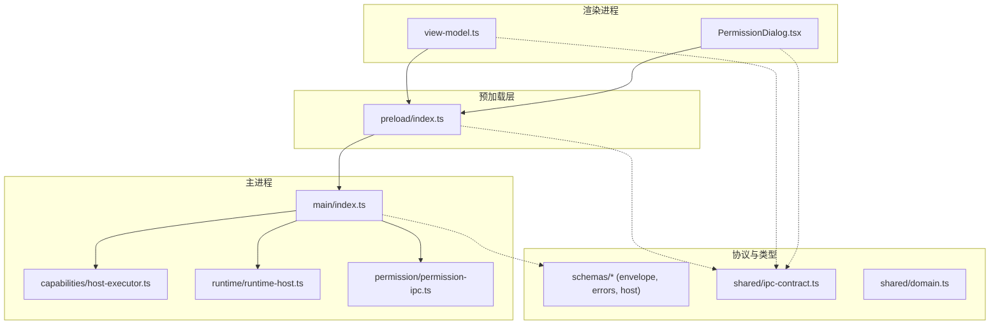
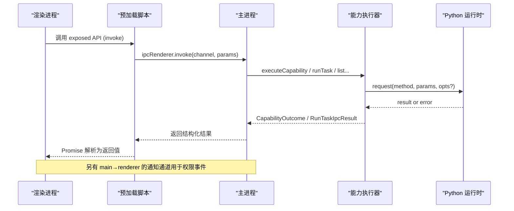
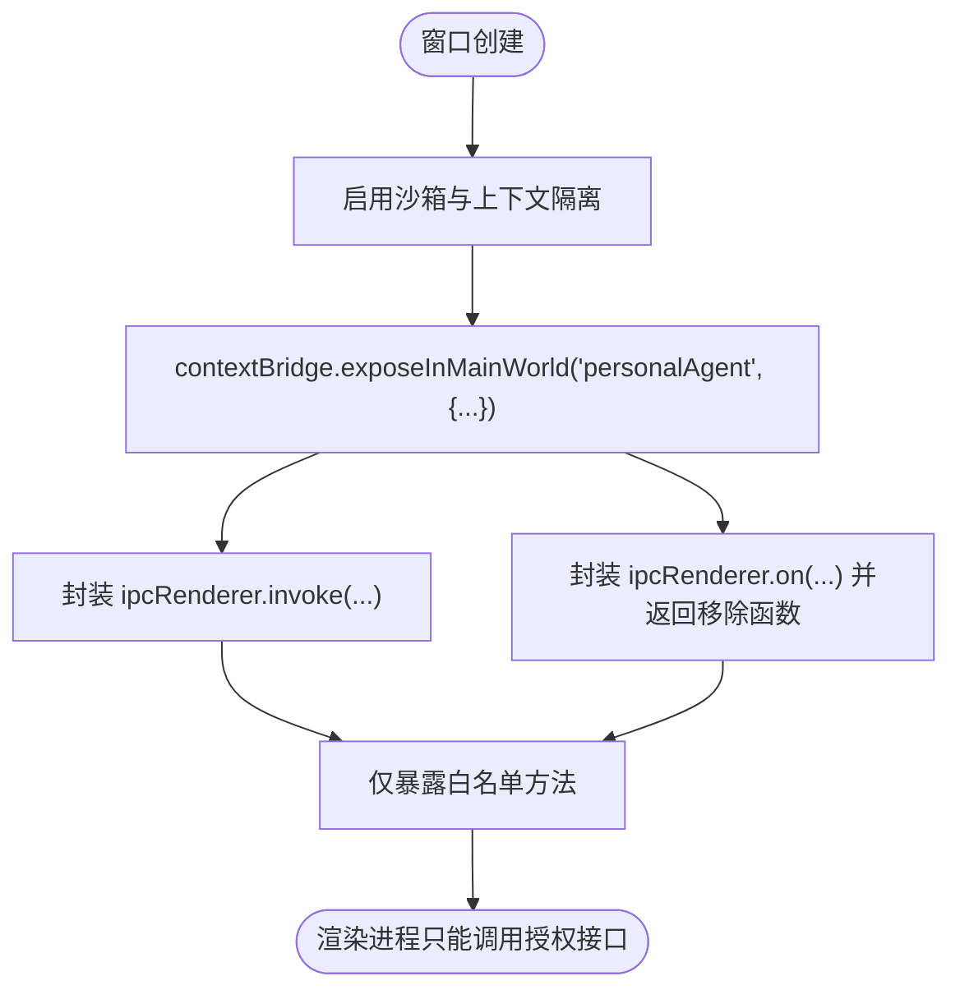
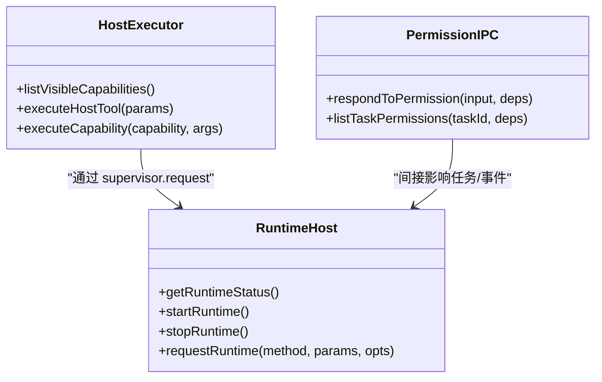
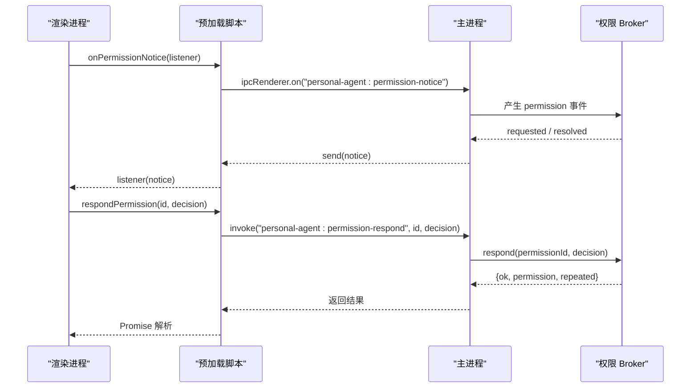
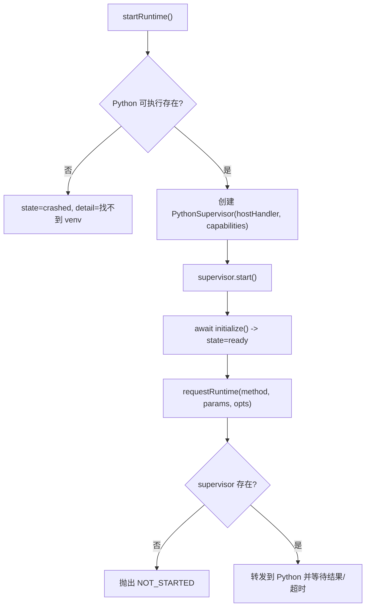
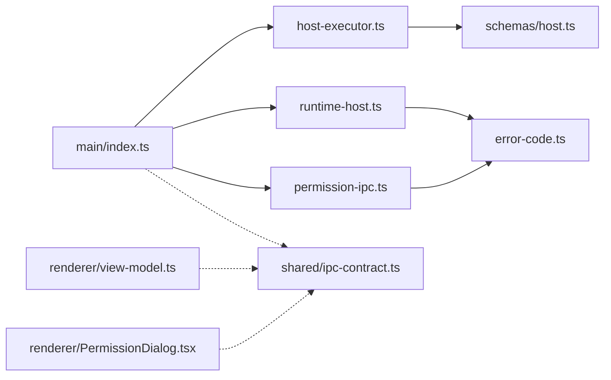

# IPC 通信协议

<cite>
**本文引用的文件**
- [apps/desktop/src/main/index.ts](file://apps/desktop/src/main/index.ts)
- [apps/desktop/src/preload/index.ts](file://apps/desktop/src/preload/index.ts)
- [apps/desktop/src/shared/ipc-contract.ts](file://apps/desktop/src/shared/ipc-contract.ts)
- [apps/desktop/src/shared/domain.ts](file://apps/desktop/src/shared/domain.ts)
- [packages/protocol/schemas/envelope.ts](file://packages/protocol/schemas/envelope.ts)
- [packages/protocol/schemas/errors.ts](file://packages/protocol/schemas/errors.ts)
- [packages/protocol/schemas/host.ts](file://packages/protocol/schemas/host.ts)
- [apps/desktop/src/main/capabilities/host-executor.ts](file://apps/desktop/src/main/capabilities/host-executor.ts)
- [apps/desktop/src/main/runtime/runtime-host.ts](file://apps/desktop/src/main/runtime/runtime-host.ts)
- [apps/desktop/src/main/runtime/error-code.ts](file://apps/desktop/src/main/runtime/error-code.ts)
- [apps/desktop/src/main/permission/permission-ipc.ts](file://apps/desktop/src/main/permission/permission-ipc.ts)
- [apps/desktop/src/renderer/src/view-model.ts](file://apps/desktop/src/renderer/src/view-model.ts)
- [apps/desktop/src/renderer/src/components/PermissionDialog.tsx](file://apps/desktop/src/renderer/src/components/PermissionDialog.tsx)
</cite>

## 目录
1. [简介](#简介)
2. [项目结构](#项目结构)
3. [核心组件](#核心组件)
4. [架构总览](#架构总览)
5. [详细组件分析](#详细组件分析)
6. [依赖关系分析](#依赖关系分析)
7. [性能与超时](#性能与超时)
8. [故障排查指南](#故障排查指南)
9. [结论](#结论)
10. [附录：IPC 方法清单](#附录ipc-方法清单)

## 简介
本文件系统化说明 Electron 主进程与渲染进程之间的 IPC 通信协议，覆盖消息格式、事件监听、异步调用模式、通道注册与管理、安全边界（预加载脚本）、错误处理与超时机制，并给出完整的 IPC 方法清单及在渲染进程中调用的示例路径。

## 项目结构
- 主进程入口负责创建窗口、注册 IPC 处理器、启动 Python 运行时、管理权限通道。
- 预加载脚本通过 contextBridge 暴露最小化 API 给渲染进程，仅允许受控的 invoke/on 调用。
- 共享类型定义统一了 IPC 契约与领域模型。
- 协议包提供 JSON-RPC 信封、能力描述、错误码等跨语言契约。
- 渲染进程通过 view-model 将 IPC 结果转换为 UI 展示数据。

图表来源
- [apps/desktop/src/main/index.ts:56-89](file://apps/desktop/src/main/index.ts#L56-L89)
- [apps/desktop/src/preload/index.ts:8-46](file://apps/desktop/src/preload/index.ts#L8-L46)
- [apps/desktop/src/main/capabilities/host-executor.ts:54-117](file://apps/desktop/src/main/capabilities/host-executor.ts#L54-L117)
- [apps/desktop/src/main/runtime/runtime-host.ts:90-160](file://apps/desktop/src/main/runtime/runtime-host.ts#L90-L160)
- [apps/desktop/src/main/permission/permission-ipc.ts:43-83](file://apps/desktop/src/main/permission/permission-ipc.ts#L43-L83)
- [packages/protocol/schemas/envelope.ts:1-41](file://packages/protocol/schemas/envelope.ts#L1-L41)
- [packages/protocol/schemas/host.ts:1-76](file://packages/protocol/schemas/host.ts#L1-L76)
- [apps/desktop/src/shared/ipc-contract.ts:24-75](file://apps/desktop/src/shared/ipc-contract.ts#L24-L75)
- [apps/desktop/src/shared/domain.ts:52-95](file://apps/desktop/src/shared/domain.ts#L52-L95)

章节来源
- [apps/desktop/src/main/index.ts:56-89](file://apps/desktop/src/main/index.ts#L56-L89)
- [apps/desktop/src/preload/index.ts:8-46](file://apps/desktop/src/preload/index.ts#L8-L46)

## 核心组件
- 主进程 IPC 注册器：集中注册所有 ipcMain.handle 处理器，完成参数校验、能力执行、数据库读写、权限决策与状态查询。
- 预加载桥接器：通过 contextBridge.exposeInMainWorld 暴露受限 API，封装 ipcRenderer.invoke 和 on，确保渲染进程无法直接访问底层模块。
- 能力执行器：对文件系统、文档提取等能力进行注册、作用域限制、风险判定与契约校验，再转发到 Python 运行时或本地实现。
- 运行时宿主：管理 Python 子进程生命周期、握手、请求转发与错误映射。
- 权限通道：基于 broker 的授权请求、响应、列表与广播通知。
- 协议与类型：JSON-RPC 信封、能力 ID、错误码、IPC 返回体与领域模型。

章节来源
- [apps/desktop/src/main/index.ts:134-323](file://apps/desktop/src/main/index.ts#L134-L323)
- [apps/desktop/src/preload/index.ts:8-46](file://apps/desktop/src/preload/index.ts#L8-L46)
- [apps/desktop/src/main/capabilities/host-executor.ts:54-117](file://apps/desktop/src/main/capabilities/host-executor.ts#L54-L117)
- [apps/desktop/src/main/runtime/runtime-host.ts:90-160](file://apps/desktop/src/main/runtime/runtime-host.ts#L90-L160)
- [apps/desktop/src/main/permission/permission-ipc.ts:43-83](file://apps/desktop/src/main/permission/permission-ipc.ts#L43-L83)
- [packages/protocol/schemas/envelope.ts:1-41](file://packages/protocol/schemas/envelope.ts#L1-L41)
- [packages/protocol/schemas/host.ts:1-76](file://packages/protocol/schemas/host.ts#L1-L76)
- [apps/desktop/src/shared/ipc-contract.ts:24-75](file://apps/desktop/src/shared/ipc-contract.ts#L24-L75)
- [apps/desktop/src/shared/domain.ts:52-95](file://apps/desktop/src/shared/domain.ts#L52-L95)

## 架构总览
IPC 采用“请求-响应”与“推送通知”两种模式：
- 请求-响应：渲染进程通过 preload 暴露的方法调用 ipcRenderer.invoke，主进程对应 ipcMain.handle 处理并返回结构化结果 { ok, ... } 或 { ok:false, code, message }。
- 推送通知：主进程通过 BrowserWindow.webContents.send 向所有窗口发送 permission 相关通知，渲染进程通过 preload 暴露的 onPermissionNotice 订阅。

图表来源
- [apps/desktop/src/preload/index.ts:10-46](file://apps/desktop/src/preload/index.ts#L10-L46)
- [apps/desktop/src/main/index.ts:134-323](file://apps/desktop/src/main/index.ts#L134-L323)
- [apps/desktop/src/main/capabilities/host-executor.ts:79-117](file://apps/desktop/src/main/capabilities/host-executor.ts#L79-L117)
- [apps/desktop/src/main/runtime/runtime-host.ts:151-160](file://apps/desktop/src/main/runtime/runtime-host.ts#L151-L160)

## 详细组件分析

### 预加载脚本与安全边界
- 使用 contextIsolation + sandbox + nodeIntegration=false 的安全窗口配置。
- 仅暴露必要方法：运行时状态、PDF 列表、任务运行、时间线、权限批准与观察、权限通知订阅。
- 唯一的主→渲染推送通道：onPermissionNotice，返回取消订阅函数，避免内存泄漏。

图表来源
- [apps/desktop/src/main/index.ts:66-71](file://apps/desktop/src/main/index.ts#L66-L71)
- [apps/desktop/src/preload/index.ts:8-46](file://apps/desktop/src/preload/index.ts#L8-L46)

章节来源
- [apps/desktop/src/main/index.ts:66-71](file://apps/desktop/src/main/index.ts#L66-L71)
- [apps/desktop/src/preload/index.ts:8-46](file://apps/desktop/src/preload/index.ts#L8-L46)

### 能力执行与通道注册
- 主进程在应用启动时注册多个 ipcMain.handle，形成稳定的 IPC 通道集合。
- 能力执行器根据 origin（UI 或 Agent）与 scope 决定放行策略，并对入参进行 Zod 校验。
- 文件系统类能力通过 executeCapability 路由到 ui executor，保证只读或受限写入。

图表来源
- [apps/desktop/src/main/capabilities/host-executor.ts:54-117](file://apps/desktop/src/main/capabilities/host-executor.ts#L54-L117)
- [apps/desktop/src/main/permission/permission-ipc.ts:43-83](file://apps/desktop/src/main/permission/permission-ipc.ts#L43-L83)
- [apps/desktop/src/main/runtime/runtime-host.ts:90-160](file://apps/desktop/src/main/runtime/runtime-host.ts#L90-L160)

章节来源
- [apps/desktop/src/main/index.ts:134-323](file://apps/desktop/src/main/index.ts#L134-L323)
- [apps/desktop/src/main/capabilities/host-executor.ts:54-117](file://apps/desktop/src/main/capabilities/host-executor.ts#L54-L117)

### 权限通道与通知
- 三个通道：
  - personal-agent:permission-respond：渲染进程提交批准/拒绝。
  - personal-agent:list-permissions：查询某任务的权限记录投影。
  - personal-agent:permission-notice：主进程主动推送 requested/resolved 事件。
- 主进程通过 broadcastPermissionNotice 向所有窗口广播；渲染进程通过 onPermissionNotice 订阅并返回取消订阅函数。

图表来源
- [apps/desktop/src/main/index.ts:35-54](file://apps/desktop/src/main/index.ts#L35-L54)
- [apps/desktop/src/main/index.ts:298-323](file://apps/desktop/src/main/index.ts#L298-L323)
- [apps/desktop/src/preload/index.ts:29-45](file://apps/desktop/src/preload/index.ts#L29-L45)
- [apps/desktop/src/main/permission/permission-ipc.ts:43-83](file://apps/desktop/src/main/permission/permission-ipc.ts#L43-L83)

章节来源
- [apps/desktop/src/main/index.ts:35-54](file://apps/desktop/src/main/index.ts#L35-L54)
- [apps/desktop/src/main/index.ts:298-323](file://apps/desktop/src/main/index.ts#L298-L323)
- [apps/desktop/src/preload/index.ts:29-45](file://apps/desktop/src/preload/index.ts#L29-L45)
- [apps/desktop/src/main/permission/permission-ipc.ts:43-83](file://apps/desktop/src/main/permission/permission-ipc.ts#L43-L83)

### 运行时与 Python 子进程
- 主进程启动 Python 子进程，建立握手，维护状态 starting/ready/crashed/stopped。
- 通过 runtime-host.requestRuntime 透传 method/params/timeoutMs 到 Python 侧。
- 能力执行器在 agent 上下文中通过 host.execute_tool 调用具体能力，并在 UI 上下文中通过 executeCapability 调用受限能力。

图表来源
- [apps/desktop/src/main/runtime/runtime-host.ts:94-160](file://apps/desktop/src/main/runtime/runtime-host.ts#L94-L160)
- [apps/desktop/src/main/runtime/error-code.ts:1-18](file://apps/desktop/src/main/runtime/error-code.ts#L1-L18)

章节来源
- [apps/desktop/src/main/runtime/runtime-host.ts:94-160](file://apps/desktop/src/main/runtime/runtime-host.ts#L94-L160)
- [apps/desktop/src/main/runtime/error-code.ts:1-18](file://apps/desktop/src/main/runtime/error-code.ts#L1-L18)

### 渲染进程调用示例
- 获取运行时状态：调用 personalAgent.runtimeStatus()。
- 列出 PDF：personalAgent.listPdfs('downloads')。
- 运行任务：personalAgent.runTask(goal)。
- 获取时间线：personalAgent.getTimeline(taskId)。
- 权限操作：personalAgent.respondPermission(id, decision)、personalAgent.listPermissions(taskId)。
- 订阅通知：const remove = personalAgent.onPermissionNotice(listener); 后续调用 remove() 取消订阅。

章节来源
- [apps/desktop/src/preload/index.ts:10-46](file://apps/desktop/src/preload/index.ts#L10-L46)
- [apps/desktop/src/renderer/src/components/PermissionDialog.tsx:52-59](file://apps/desktop/src/renderer/src/components/PermissionDialog.tsx#L52-L59)

## 依赖关系分析
- 主进程依赖能力执行器与运行时宿主，二者共同构成对外暴露的 API 后端。
- 权限通道依赖 broker 与持久化存储，并通过通知通道与渲染进程联动。
- 协议包提供统一的 JSON-RPC 信封与方法命名规范，确保跨进程/跨语言一致性。
- 共享类型约束 IPC 载荷与领域对象，降低耦合。

图表来源
- [apps/desktop/src/main/index.ts:134-323](file://apps/desktop/src/main/index.ts#L134-L323)
- [apps/desktop/src/main/capabilities/host-executor.ts:54-117](file://apps/desktop/src/main/capabilities/host-executor.ts#L54-L117)
- [apps/desktop/src/main/runtime/runtime-host.ts:90-160](file://apps/desktop/src/main/runtime/runtime-host.ts#L90-L160)
- [apps/desktop/src/main/permission/permission-ipc.ts:43-83](file://apps/desktop/src/main/permission/permission-ipc.ts#L43-L83)
- [packages/protocol/schemas/host.ts:1-76](file://packages/protocol/schemas/host.ts#L1-L76)
- [apps/desktop/src/main/runtime/error-code.ts:1-18](file://apps/desktop/src/main/runtime/error-code.ts#L1-L18)
- [apps/desktop/src/shared/ipc-contract.ts:24-75](file://apps/desktop/src/shared/ipc-contract.ts#L24-L75)
- [apps/desktop/src/renderer/src/view-model.ts:27-53](file://apps/desktop/src/renderer/src/view-model.ts#L27-L53)
- [apps/desktop/src/renderer/src/components/PermissionDialog.tsx:52-59](file://apps/desktop/src/renderer/src/components/PermissionDialog.tsx#L52-L59)

章节来源
- [apps/desktop/src/main/index.ts:134-323](file://apps/desktop/src/main/index.ts#L134-L323)
- [apps/desktop/src/main/capabilities/host-executor.ts:54-117](file://apps/desktop/src/main/capabilities/host-executor.ts#L54-L117)
- [apps/desktop/src/main/runtime/runtime-host.ts:90-160](file://apps/desktop/src/main/runtime/runtime-host.ts#L90-L160)
- [apps/desktop/src/main/permission/permission-ipc.ts:43-83](file://apps/desktop/src/main/permission/permission-ipc.ts#L43-L83)
- [packages/protocol/schemas/host.ts:1-76](file://packages/protocol/schemas/host.ts#L1-L76)
- [apps/desktop/src/main/runtime/error-code.ts:1-18](file://apps/desktop/src/main/runtime/error-code.ts#L1-L18)
- [apps/desktop/src/shared/ipc-contract.ts:24-75](file://apps/desktop/src/shared/ipc-contract.ts#L24-L75)
- [apps/desktop/src/renderer/src/view-model.ts:27-53](file://apps/desktop/src/renderer/src/view-model.ts#L27-L53)
- [apps/desktop/src/renderer/src/components/PermissionDialog.tsx:52-59](file://apps/desktop/src/renderer/src/components/PermissionDialog.tsx#L52-L59)

## 性能与超时
- 请求-响应模式：所有渲染进程发起的调用均通过 ipcRenderer.invoke 走 Promise 语义，适合一次性 RPC。
- 推送通知模式：权限事件通过 webContents.send 推送，渲染进程需自行管理订阅与取消，避免重复监听。
- 超时控制：
  - 运行时请求支持 timeoutMs 选项，由 runtime-host.requestRuntime 透传到 Python 侧。
  - 权限窗口倒计时由渲染进程计算 expiresAt 与 now，过期后禁用交互，最终由主进程结算。
- 资源清理：onPermissionNotice 返回取消函数，应在组件卸载时调用以避免内存泄漏。

章节来源
- [apps/desktop/src/main/runtime/runtime-host.ts:151-160](file://apps/desktop/src/main/runtime/runtime-host.ts#L151-L160)
- [apps/desktop/src/preload/index.ts:35-45](file://apps/desktop/src/preload/index.ts#L35-L45)
- [apps/desktop/src/renderer/src/components/PermissionDialog.tsx:41-59](file://apps/desktop/src/renderer/src/components/PermissionDialog.tsx#L41-L59)

## 故障排查指南
- 常见错误码分类：
  - 协议层错误：无效 JSON、无效请求、方法不存在、未实现、参数非法、能力越界或未注册、路径越界、对齐失败、无活动任务、权限相关错误、文件不可读、PDF 提取失败。
  - 运行时错误：未启动、超时、已取消、已停止、崩溃、握手失败、响应无效、计划无效、计划不可构建、数据库失败、任务忙、孤儿任务。
- 定位步骤：
  - 检查主进程日志与 Python stderr（开发模式下会输出）。
  - 确认运行时状态 getRuntimeStatus 是否为 ready。
  - 核对能力名与参数是否符合 schemas/host.ts 的约束。
  - 权限相关：查看 permission-notice 是否到达渲染进程，确认 respondPermission 的参数合法性。
  - 数据库失败：检查 product-state 与 db 初始化是否成功。

章节来源
- [packages/protocol/schemas/errors.ts:1-30](file://packages/protocol/schemas/errors.ts#L1-L30)
- [apps/desktop/src/main/runtime/error-code.ts:1-18](file://apps/desktop/src/main/runtime/error-code.ts#L1-L18)
- [apps/desktop/src/main/runtime/runtime-host.ts:116-135](file://apps/desktop/src/main/runtime/runtime-host.ts#L116-L135)
- [apps/desktop/src/main/permission/permission-ipc.ts:17-32](file://apps/desktop/src/main/permission/permission-ipc.ts#L17-L32)

## 结论
本项目通过严格的预加载白名单、能力作用域与权限审批机制，构建了安全的 IPC 通信体系。渲染进程仅能调用授权的 API，主进程集中管理通道、校验参数、执行能力并与 Python 运行时协作。统一的协议与类型定义确保了跨进程/跨语言的一致性，配合错误码与超时机制，提供了健壮的错误处理与可观测性。

## 附录：IPC 方法清单
以下为主进程注册的 IPC 通道、参数、返回值与用途说明。所有返回值遵循 { ok:true,... } 或 { ok:false, code, message } 的统一结构。

- personal-agent:runtime-status
  - 参数：无
  - 返回：{ ok:true, state, detail? }
  - 用途：查询 Python 运行时状态（stopped/starting/ready/crashed）

- personal-agent:list-pdfs
  - 参数：rootId（限定为 'downloads'）
  - 返回：{ ok:true, entries: PdfEntry[] } 或 { ok:false, code, message }
  - 用途：列出指定根下的 PDF 条目，并落库索引

- personal-agent:indexed-pdfs
  - 参数：无
  - 返回：{ ok:true, entries: IndexedPdfEntry[] } 或 { ok:false, code, message }
  - 用途：读取已索引的 PDF 列表（含 rootId、首次/最后出现时间）

- personal-agent:list-tasks
  - 参数：无
  - 返回：{ ok:true, tasks: TaskRecord[] } 或 { ok:false, code, message }
  - 用途：获取历史会话列表（按 createdAt 排序）

- personal-agent:run-task
  - 参数：goal（字符串）
  - 返回：{ ok:true, taskId, status, facts?, reason? } 或 { ok:false, code, message }
  - 用途：启动一个任务，内部可能触发权限请求与事件流

- personal-agent:get-timeline
  - 参数：taskId（字符串或 null）
  - 返回：{ ok:true, timeline: TaskTimeline|null } 或 { ok:false, code, message }
  - 用途：获取任务的时间线（任务本体+最新计划+事件序列）

- personal-agent:permission-respond
  - 参数：permissionId（非空字符串），decision（'approved'|'denied'）
  - 返回：{ ok:true, permission, repeated } 或 { ok:false, code, message }
  - 用途：对权限请求做出批准或拒绝

- personal-agent:list-permissions
  - 参数：taskId（非空字符串）
  - 返回：{ ok:true, entries: [{ permission, state }] } 或 { ok:false, code, message }
  - 用途：查询某任务的权限记录及其投影状态（含 expired）

- personal-agent:permission-notice（主→渲染）
  - 事件载荷：{ kind:'requested'|'resolved', ... }
  - 用途：当有权限请求或权限决议时，主进程主动推送至渲染进程

章节来源
- [apps/desktop/src/main/index.ts:134-323](file://apps/desktop/src/main/index.ts#L134-L323)
- [apps/desktop/src/preload/index.ts:10-46](file://apps/desktop/src/preload/index.ts#L10-L46)
- [apps/desktop/src/shared/ipc-contract.ts:24-75](file://apps/desktop/src/shared/ipc-contract.ts#L24-L75)
- [apps/desktop/src/shared/domain.ts:52-95](file://apps/desktop/src/shared/domain.ts#L52-L95)